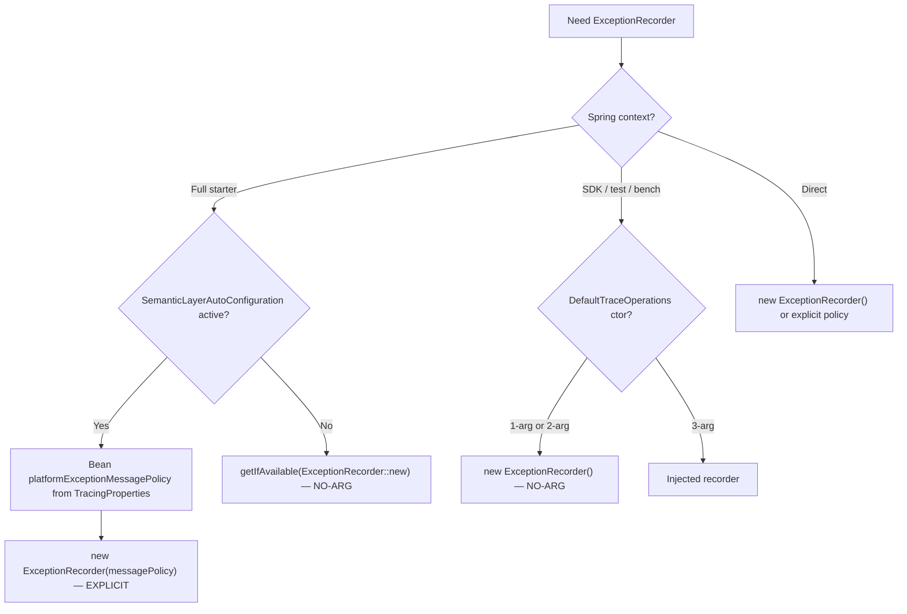

# ExceptionRecorder() — анализ использования no-arg конструктора в боевом коде

**Класс:** `space.br1440.platform.tracing.core.exception.ExceptionRecorder`  
**Метод:** `ExceptionRecorder()` (no-arg)  
**Module:** `platform-tracing-core` (+ call sites в `platform-tracing-spring-boot-autoconfigure`)  
**Analysis date:** 2026-07-01  
**Purpose:** Фактический инвентарь для решения архитекторов: удалять no-arg конструктор или оставить. Документ не содержит рекомендации «удалить/оставить» — только evidence.

**Контекст замечания архитекторов:** no-arg конструктор может скрывать, что по умолчанию применяется `ExceptionMessagePolicy.secureDefault()` (`includeMessage=false`, `includeStacktrace=false`). Это security-relevant default: exception-event в span **не скрабится** `ScrubbingSpanProcessor` (events ≠ attributes), поэтому политика message/stacktrace критична.

---

## RESOLUTION (2026-07-01) — реализовано

Архитекторы приняли решение **удалить** публичный no-arg конструктор `ExceptionRecorder()` перед выходом в продакшен, чтобы security-relevant дефолт был **явным** на call site.

**Изменения API:**

- Удалён `public ExceptionRecorder()` (делегировал в `secureDefault()`).
- Добавлена статическая фабрика `public static ExceptionRecorder secureDefault()` с Javadoc, явно называющим секьюр-дефолт.
- Сохранён `ExceptionRecorder(ExceptionMessagePolicy)` как explicit policy-injection конструктор.

**Обновлённые call sites:**

| File | Было | Стало |
|------|------|-------|
| `DefaultTraceOperations.java` | `new ExceptionRecorder()` | `ExceptionRecorder.secureDefault()` |
| `TracingCoreAutoConfiguration.java` | `ExceptionRecorder::new` | `ExceptionRecorder::secureDefault` |
| `PlatformKafkaAutoConfiguration.java` | `ExceptionRecorder::new` | `ExceptionRecorder::secureDefault` |
| `ExceptionRecorderTest.java` (×5) | `new ExceptionRecorder()` | `ExceptionRecorder.secureDefault()` |

**Поведение не изменено:** `secureDefault()` эквивалентен прежнему no-arg пути (`ExceptionMessagePolicy.secureDefault()` = `(false, false)`); дефолты `TracingProperties`, семантика скрабинга и exception-event не тронуты.

Разделы ниже описывают состояние **до** рефакторинга (сохранены как обоснование решения).

---

## Executive Summary

| Факт | Detail |
|------|--------|
| **Реализация no-arg ctor** | Делегирует в `this(ExceptionMessagePolicy.secureDefault())` — семантически эквивалентен `new ExceptionMessagePolicy(false, false)` |
| **Прямых вызовов `new ExceptionRecorder()` в production `.java`** | **1** (`DefaultTraceOperations`) |
| **Method reference `ExceptionRecorder::new` в production `.java`** | **2** (Spring fallback в autoconfigure) |
| **Явный путь `new ExceptionRecorder(messagePolicy)` в production** | **1** (`SemanticLayerAutoConfiguration` — основной Spring Boot путь) |
| **Полный Spring Boot starter (оба auto-config)** | Runtime использует **explicit policy bean**, no-arg ctor **не вызывается**, если бин `ExceptionRecorder` уже зарегистрирован |
| **SDK-only / partial Spring / benchmarks / tests** | No-arg ctor **используется** напрямую или через `DefaultTraceOperations(otel[, policy])` |

**Вывод для review:** no-arg конструктор — не dead code, но и **не единственный** production-path. В типичном Spring Boot приложении с полным autoconfigure политика задаётся явно через `ExceptionMessagePolicy` + properties; no-arg ctor остаётся **fallback** и **SDK convenience**.

---

## Реализация конструкторов (source of truth)

```20:26:platform-tracing-core/src/main/java/space/br1440/platform/tracing/core/exception/ExceptionRecorder.java
    public ExceptionRecorder(@Nonnull ExceptionMessagePolicy messagePolicy) {
        this.messagePolicy = Objects.requireNonNull(messagePolicy, "messagePolicy");
    }

    public ExceptionRecorder() {
        this(ExceptionMessagePolicy.secureDefault());
    }
```

```30:34:platform-tracing-core/src/main/java/space/br1440/platform/tracing/core/exception/ExceptionMessagePolicy.java
    @Nonnull
    public static ExceptionMessagePolicy secureDefault() {
        return new ExceptionMessagePolicy(false, false);
    }
```

**Семантическая эквивалентность с Spring defaults:**

```576:581:platform-tracing-spring-boot-autoconfigure/src/main/java/space/br1440/platform/tracing/autoconfigure/TracingProperties.java
        public static class Exception {
            private boolean includeMessage = false;
            private boolean includeStacktrace = false;
        }
```

При дефолтных `TracingProperties` bean `platformExceptionMessagePolicy` создаёт `new ExceptionMessagePolicy(false, false)` — **идентично** `secureDefault()`.

---

## Карта всех call site'ов

### Легенда категорий

| Категория | Описание |
|-----------|----------|
| **PROD-DIRECT** | Прямой `new ExceptionRecorder()` или `ExceptionRecorder::new` в `src/main` |
| **PROD-INDIRECT** | Через `DefaultTraceOperations(otel)` / `(otel, policy)` → внутренний `new ExceptionRecorder()` |
| **PROD-EXPLICIT** | `new ExceptionRecorder(messagePolicy)` — policy видна на call site |
| **NON-PROD** | test / bench / test-support |

### 1. Production — прямое использование no-arg ctor

| # | File | Line | Form | Role |
|---|------|------|------|------|
| P1 | `core/DefaultTraceOperations.java` | 71 | `new ExceptionRecorder()` | 2-arg ctor `(OpenTelemetry, AttributePolicy)` делегирует сюда |
| P2 | `autoconfigure/TracingCoreAutoConfiguration.java` | 97 | `ExceptionRecorder::new` | Fallback, если бин `ExceptionRecorder` отсутствует в контексте |
| P3 | `autoconfigure/kafka/PlatformKafkaAutoConfiguration.java` | 28 | `ExceptionRecorder::new` | Fallback для `KafkaBatchLinksAspect`, если бин отсутствует |

**Комментарии в коде (P2, P3) явно документируют намерение:**

> «ExceptionRecorder обычно поставляется SemanticLayerAutoConfiguration; fallback — секьюр-дефолт (message/stacktrace off)»

### 2. Production — explicit policy (NOT no-arg ctor)

| # | File | Line | Form | Role |
|---|------|------|------|------|
| E1 | `autoconfigure/SemanticLayerAutoConfiguration.java` | 73-74 | `new ExceptionRecorder(messagePolicy)` | Основной Spring Boot wiring; policy из `TracingProperties` |

Цепочка бинов:

```
TracingProperties.semantic.exception.{includeMessage, includeStacktrace}
    → platformExceptionMessagePolicy (bean)
    → platformExceptionRecorder (bean)
    → inject в DefaultTraceOperations через TracingCoreAutoConfiguration
    → inject в KafkaBatchLinksAspect (если kafka batch-links enabled)
```

### 3. Production — indirect через DefaultTraceOperations (2-arg / 1-arg ctor)

`DefaultTraceOperations` constructor chain:

| Ctor | ExceptionRecorder source |
|------|-------------------------|
| `(OpenTelemetry)` | → `(otel, new AttributePolicy())` → **`new ExceptionRecorder()`** |
| `(OpenTelemetry, AttributePolicy)` | → **`new ExceptionRecorder()`** |
| `(OpenTelemetry, AttributePolicy, ExceptionRecorder)` | injected — **no-arg не используется** |

**Production `DefaultTraceOperations` call sites (src/main only):**

| File | Ctor used | ExceptionRecorder path |
|------|-----------|------------------------|
| `TracingCoreAutoConfiguration.java:108,125` | 3-arg | Injected bean (explicit policy path или fallback `::new`) |

**Вывод:** в `src/main` нет других `new DefaultTraceOperations(...)` кроме autoconfigure 3-arg. SDK-only путь `DefaultTraceOperations(otel)` в **production main** не вызывается.

### 4. Non-production — indirect SDK path (DefaultTraceOperations 1–2 arg)

| Module | Files | Count |
|--------|-------|-------|
| `platform-tracing-bench` (JMH) | `CompositePipelineBenchmark`, `StartSpanBenchmark`, `TracedAspectBenchmark`, `TypedBuilderBenchmark` | 4+ |
| `platform-tracing-test` | `TraceOperationsTestExtension` | 1 |
| `platform-tracing-core` (test) | `DefaultTraceOperationsTest`, `EscapeHatchSpanBuilderTest`, `SpanEnricherTest`, … | many |
| `platform-tracing-e2e-tests` | `ExceptionEventScrubbingE2ETest` | 0 indirect — uses **explicit** `new ExceptionRecorder(ExceptionMessagePolicy.secureDefault())` |

### 5. Non-production — direct `new ExceptionRecorder()`

| File | Usages | Purpose |
|------|--------|---------|
| `core/exception/ExceptionRecorderTest.java` | 5 | Characterization secure-default behavior |

### 6. Non-production — explicit policy (reference style)

| File | Form |
|------|------|
| `ExceptionRecorderTest.java:65` | `new ExceptionRecorder(new ExceptionMessagePolicy(true, false))` |
| `ExceptionEventScrubbingE2ETest.java:111,113` | `new ExceptionRecorder(ExceptionMessagePolicy.secureDefault())` / custom policy |

---

## Runtime paths (decision tree)



### Path A — типичный Spring Boot production (full autoconfigure)

**Условия:** `platform.tracing.enabled=true` (default), на classpath `SemanticLayerAutoConfiguration`, нет user override `@Bean ExceptionRecorder`.

1. `SemanticLayerAutoConfiguration.platformExceptionMessagePolicy()` → defaults `false/false`
2. `SemanticLayerAutoConfiguration.platformExceptionRecorder(messagePolicy)` → **`new ExceptionRecorder(messagePolicy)`**
3. `TracingCoreAutoConfiguration.traceOperations(..., exceptionRecorderProvider, ...)` → `getIfAvailable(...)` **возвращает bean** → **no-arg ctor не вызывается**
4. `DefaultTraceOperations(otel, policy, exceptionRecorder)` — 3-arg

**Policy на runtime:** из properties (по умолчанию = secureDefault).

### Path B — Spring Boot partial context (fallback)

**Условия:** `TracingCoreAutoConfiguration` без `SemanticLayerAutoConfiguration` (пример: `TracingAutoConfigurationTest` — semantic layer не включён в runner).

1. Нет bean `ExceptionRecorder`
2. `exceptionRecorderProvider.getIfAvailable(ExceptionRecorder::new)` → **no-arg ctor**
3. Policy = `secureDefault()` (скрыто внутри ctor)

**Relevance для production:** partial context — тестовый/edge сценарий. Полный starter загружает оба auto-config (см. `AutoConfiguration.imports`).

### Path C — Kafka batch-links aspect

**Условия:** `platform.tracing.kafka.batch-links-enabled=true`, `PlatformKafkaAutoConfiguration`.

- Если bean `ExceptionRecorder` есть (Path A) → injected, no-arg не used
- Иначе → `getIfAvailable(ExceptionRecorder::new)` → no-arg

### Path D — SDK-only / benchmarks / unit tests

`new DefaultTraceOperations(sdk)` или `(sdk, policy)` → always **`new ExceptionRecorder()`** inside 2-arg ctor.

---

## Auto-configuration ordering

`META-INF/spring/org.springframework.boot.autoconfigure.AutoConfiguration.imports`:

```
TracingCoreAutoConfiguration          ← line 1
SemanticLayerAutoConfiguration      ← line 2
...
PlatformKafkaAutoConfiguration      ← line 12
```

`TracingCoreAutoConfiguration` **не** объявляет `@AutoConfigureAfter(SemanticLayerAutoConfiguration)`. Fallback `ExceptionRecorder::new` существует **намеренно** для устойчивости к порядку/отсутствию semantic layer (комментарий в коде: «чтобы фасад не зависел от порядка автоконфигов»).

При полном контексте Spring DI разрешает `ObjectProvider<ExceptionRecorder>` к bean из SemanticLayer независимо от порядка строк в imports file.

---

## Кто потребляет ExceptionRecorder (downstream)

ExceptionRecorder **не вызывается снаружи напрямую** в application code — он инжектится в:

| Component | Module | Injection |
|-----------|--------|-----------|
| `DefaultTraceOperations` | core | field; `recordException()`, span builders |
| `AbstractPlatformSpanBuilder` + typed builders | core | constructor param |
| `OwningSpanScope`, `NonOwningSpanScope` | core | close-on-exception path |
| `KafkaBatchLinksAspect` | autoconfigure | constructor param |

Все span builder'ы получают **тот же экземпляр**, что и фасад (per `DefaultTraceOperations` instance / Spring singleton bean).

**NoopTraceOperations** не использует `ExceptionRecorder`.

---

## Поведенческая значимость no-arg ctor

При `secureDefault()` / default properties:

| Output on `record(Throwable)` | Value |
|------------------------------|-------|
| `error.type` | FQN exception class ✅ |
| `platform.trace.result` | `failure` ✅ |
| `StatusCode.ERROR` | yes ✅ |
| status description | empty (no message) ✅ |
| `exception.message` in event | **not written** ✅ |
| `exception.stacktrace` in event | **not written** ✅ |

Verified by: `ExceptionRecorderTest.record_секьюрДефолт_...`, `ExceptionEventScrubbingE2ETest`.

**Removing no-arg ctor does not change behavior** if all call sites are migrated to `new ExceptionRecorder(ExceptionMessagePolicy.secureDefault())` or injected policy bean. It changes **explicitness at call sites only**.

---

## Аргумент «скрывает secureDefault» — разбор

### Что скрыто

| Call site | Visible at call site | Hidden |
|-----------|---------------------|--------|
| `new ExceptionRecorder()` | «recorder with defaults» | `ExceptionMessagePolicy.secureDefault()` |
| `ExceptionRecorder::new` | constructor ref only | policy entirely |
| `new ExceptionRecorder(messagePolicy)` | policy object / bean | nothing (if policy origin traced) |
| `new ExceptionRecorder(ExceptionMessagePolicy.secureDefault())` | explicit secure default | nothing |
| Spring bean path | properties keys `includeMessage` / `includeStacktrace` | link to `secureDefault()` name |

### Что уже явно документировано

- Javadoc `ExceptionMessagePolicy.secureDefault()`
- Javadoc `TracingProperties.Semantic.Exception` (secure-by-default rationale)
- Comments in `TracingCoreAutoConfiguration`, `PlatformKafkaAutoConfiguration`, `DefaultTraceOperations` 2-arg ctor
- **No Javadoc on `ExceptionRecorder()` itself** in current source (only delegation in body)

### Аналоги в кодовой базе

| Pattern | Similar? |
|---------|----------|
| `AttributePolicy::new` fallback in `TracingCoreAutoConfiguration:91` | yes — hides WARN defaults |
| `DefaultTraceOperations(otel)` → default `AttributePolicy()` | yes — two hidden defaults chained |

No-arg `ExceptionRecorder` — часть broader «convenience ctor» pattern в core, не изолированный случай.

---

## Impact matrix: удаление no-arg конструктора

| Area | Files to change | Risk |
|------|-----------------|------|
| `ExceptionRecorder.java` | remove ctor | compile break until call sites fixed |
| `DefaultTraceOperations.java:71` | `new ExceptionRecorder(ExceptionMessagePolicy.secureDefault())` | low — behavior identical |
| `TracingCoreAutoConfiguration.java:97` | `() -> new ExceptionRecorder(ExceptionMessagePolicy.secureDefault())` | low |
| `PlatformKafkaAutoConfiguration.java:28` | same | low |
| `ExceptionRecorderTest.java` | 5 call sites → explicit secureDefault | low — tests become clearer |
| JMH / test `DefaultTraceOperations(otel*)` | optional: migrate to 3-arg explicit | low — or keep if 2-arg ctor updated internally |
| Public API surface | **breaking** for external callers of no-arg ctor | NEEDS_VERIFICATION — grep shows no external module usage today |

**Behavior regression risk:** **none**, если все замены используют `secureDefault()` или equivalent `(false, false)`.

**Review readability gain:** **high** на fallback call sites; **medium** если оставить делегирование только в `DefaultTraceOperations` 2-arg ctor с явным `secureDefault()` в одном месте.

---

## Альтернативы (для обсуждения архитекторов, не решение)

| Option | Idea | Trade-off |
|--------|------|-----------|
| **A. Remove no-arg ctor** | Force explicit policy everywhere | Verbose; clearest security intent |
| **B. Static factory** | `ExceptionRecorder.withSecureDefaults()` instead of ctor | Idiomatic; ctor removal still breaking |
| **C. Keep no-arg + Javadoc** | Document `@implNote delegates to secureDefault()` | Minimal diff; architect concern partially addressed |
| **D. Package-private no-arg** | Restrict to core/autoconfigure only | **Not possible** — fallbacks in autoconfigure module need public ctor or factory in core |

---

## Open questions / NEEDS_VERIFICATION

| Item | Notes |
|------|-------|
| External libraries calling `new ExceptionRecorder()` | Grep workspace: **none** outside platform-tracing-core test + definitions |
| Custom `@Bean ExceptionRecorder` in user apps | Would bypass both no-arg and SemanticLayer defaults — intentional override |
| `@ConditionalOnMissingBean` on `platformExceptionRecorder` | User bean replaces platform wiring entirely |
| ArchUnit rule for raw `span.recordException` | `OtelDirectIntegrationRules` — exceptions must go through `ExceptionRecorder`; unrelated to ctor choice |

---

## Appendix: полный grep snapshot (2026-07-01)

### `new ExceptionRecorder()` — all `.java`

| Location | Category |
|----------|----------|
| `ExceptionRecorder.java:24` | definition |
| `DefaultTraceOperations.java:71` | PROD-DIRECT |
| `ExceptionRecorderTest.java` (×5) | test |

### `ExceptionRecorder::new`

| Location | Category |
|----------|----------|
| `TracingCoreAutoConfiguration.java:97` | PROD-DIRECT |
| `PlatformKafkaAutoConfiguration.java:28` | PROD-DIRECT |

### `new ExceptionRecorder(` with policy

| Location | Category |
|----------|----------|
| `SemanticLayerAutoConfiguration.java:74` | PROD-EXPLICIT |
| `ExceptionRecorderTest.java:65` | test |
| `ExceptionEventScrubbingE2ETest.java:111,113` | e2e test |

### Related documentation

| File | Relevance |
|------|-----------|
| `docs/tracing/traceability.md` | P13-06 ExceptionRecorder + policy |
| `docs/semconv-mapping.md` | exception event policy |
| `CHANGELOG.md` | feature introduction |

---

## Validation

| Item | Result |
|------|--------|
| Source read | `ExceptionRecorder`, `ExceptionMessagePolicy`, `DefaultTraceOperations`, autoconfigure wiring |
| Grep scope | all `*.java` in workspace |
| Tests run | not required for inventory document |
