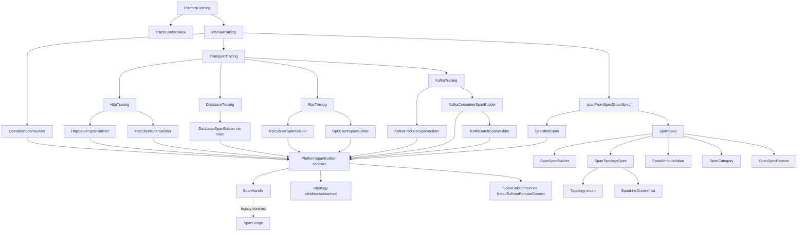

# platform-tracing-api Class Hierarchy and Model Inventory

> Документ подготовлен для handoff в Codex Extension (анализ имён API-моделей).
> Источник: read-only инспекция `platform-tracing-api/src/main/java` и выборочная проверка потребителей в `platform-tracing-core`, `platform-tracing-spring-boot-autoconfigure`, `platform-tracing-test`, `platform-tracing-bench`, `platform-tracing-e2e-tests`.
> Дата инвентаризации: 2026-07-11.

---

## 1. Executive Summary

- `platform-tracing-api` — публичный контракт платформенной трассировки: интерфейсы, value-модели, SPI, аннотации, semconv-реестр, control protocol, propagation/MDC utilities. Источник: `platform-tracing-api/build.gradle:1-5`, `settings.gradle:27-28`.
- Корневая точка входа v3: `space.br1440.platform.tracing.api.PlatformTracing` с двумя ветками: `traceContext()` и `manual()`. Источник: `PlatformTracing.java:14-21`.
- В модуле **21 пакет** (включая корневой `api`) и **87 Java-файлов** в `src/main/java`, из них **80 публичных типов** и **7 package-private** реализаций/валидаторов.
- Главные ветки иерархии от `PlatformTracing`: **manual tracing** (`ManualTracing` → builders → `SpanHandle`), **trace context view** (`TraceContextView`), плюс **параллельные** (не достижимые напрямую из `PlatformTracing`) подсистемы: semconv, enrichment, propagation, control protocol, SPI scrubbing, runtime state, annotations, MDC.
- Основные категории моделей: span specification (`SpanSpec`, `SpanTopologySpec`), span lifecycle (`SpanHandle`, legacy `SpanScope`), topology (`Topology`, `SpanLinkContext`), attributes (`SpanAttributeValue`, `PlatformAttributes`, `SemconvKeys`), semconv policy (`CategoryContract`, `ValidationMode`), enrichment scopes, propagation control, runtime versioning.
- Критический naming hotspot: тип переименован `SpanOptions` → `SpanTopologySpec`, но accessor `SpanSpec.options()` **не переименован** — рассинхрон type/method. Источник: `SpanSpec.java:27`, `SpanTopologySpec.java:9`; `SpanOptions.java` **отсутствует** (`Test-Path` → `False`).
- `SpanScope` остаётся публичным legacy lifecycle-интерфейсом (v1/v2), реализуется только в core (`OwningSpanScope`), v3 application path использует `SpanHandle`. Источник: `SpanScope.java:7-9`, `SpanHandle.java:8`, `OwningSpanScope.java:17`.
- Пакет `api.span.builder` **удалён** (`Test-Path` → `False`); старый direct builder stack отсутствует в API-модуле.
- `PlatformSpanBuilder` — базовый v3 builder contract (не legacy), несмотря на сходство имени с удалённым v1 `PlatformTracing.start*()` stack.
- `DatabaseTracing extends DatabaseSpanBuilder` — необычный mixin: navigation interface одновременно является builder contract.
- `V3ManualApiArchTest` содержит устаревшую ссылку `"SpanOptions"` в allowlist static factories; актуальный тип — `SpanTopologySpec`. Источник: `V3ManualApiArchTest.java:31-35`.
- `EnrichScope` публично экспонирует `io.opentelemetry.api.common.AttributeKey` в сигнатуре метода при `compileOnly` OTel в main. Источник: `EnrichScope.java:25`, `build.gradle:19-21`.
- Модуль **не зависит** от Spring; OTel API/Context — `compileOnly` (кроме тестов). Runtime: `slf4j-api`, `jakarta.annotation-api`, BOM. Источник: `build.gradle:7-35`.
- Потребители API (Gradle `api`/`implementation`): `platform-tracing-core`, все autoconfigure/starter модули, `platform-tracing-test`, `platform-tracing-bench`, `platform-tracing-otel-extension`, `platform-tracing-e2e-tests`, `platform-tracing-samples`.
- Документ готов для Codex rename analysis: полная инвентаризация, naming pressure markers, blast radius, без финальных решений по переименованию.

---

## 2. Facts vs Assumptions

### Facts

| # | Утверждение | Доказательство |
|---|---|---|
| F1 | `PlatformTracing` имеет ровно 2 метода: `traceContext()`, `manual()` | `PlatformTracing.java:16-20` |
| F2 | `ManualTracing` имеет 3 метода: `operation()`, `transport()`, `spanFromSpec()` | `ManualTracing.java:13-20` |
| F3 | Все semantic builders наследуют `PlatformSpanBuilder` с topology + execution | `PlatformSpanBuilder.java:16-40` |
| F4 | `SpanSpec` — immutable spec с полями name, category, options→`SpanTopologySpec`, attributes, reason, reference | `SpanSpec.java:20-36` |
| F5 | `SpanTopologySpec` содержит только `topology()` + `links()` + static factories/validator | `SpanTopologySpec.java:11-34` |
| F6 | Package-private: `DefaultSpanSpecBuilder`, `SpanSpecImpl`, `ImmutableSpanTopologySpec` | модификаторы в исходниках |
| F7 | `SpanScope` публичен; Javadoc помечает v1/v2 legacy | `SpanScope.java:7-9,29` |
| F8 | `SpanHandle` — v3 terminal handle; Javadoc ссылается на legacy `SpanScope` | `SpanHandle.java:8-15` |
| F9 | Core implementations: `DefaultPlatformTracing`, `DefaultManualTracing`, `AbstractSemanticSpanBuilder`, `OwningSpanScope`, `SpanHandleImpl` | grep `implements` в `platform-tracing-core` |
| F10 | `api.span.builder` package отсутствует | `Test-Path` → `False` |
| F11 | `SpanOptions.java` отсутствует; тип — `SpanTopologySpec` | file listing + `SpanSpec.java:27` |
| F12 | ArchUnit allowlist содержит `"SpanOptions"`, не `"SpanTopologySpec"` | `V3ManualApiArchTest.java:31-35` |
| F13 | OTel types: `compileOnly` в main, не в runtime classpath API | `build.gradle:16-21` |
| F14 | 28 тестовых классов в `platform-tracing-api/src/test/java` | directory listing |

### Assumptions / Needs Verification

| # | Пункт | Почему неясно |
|---|---|---|
| A1 | Проходит ли `V3ManualApiArchTest` после rename `SpanOptions`→`SpanTopologySpec` | allowlist stale; Gradle test не запускался в рамках инвентаризации |
| A2 | Планируется ли удаление публичного `SpanScope` из API | Javadoc говорит legacy, но тип публичен и используется `SpanHandleImpl` |
| A3 | Должен ли `SpanSpec.options()` быть переименован в `topology()` | type уже `SpanTopologySpec`, method name — `options()` |
| A4 | Является ли `SpecifiedSpan` временным именем или целевым | мало Javadoc; семантика «terminal surface for spanFromSpec» |
| A5 | Публикуются ли package-private типы в Javadoc/public API docs | не проверялось в published artifacts |
| A6 | Полный список downstream потребителей вне monorepo | анализ только внутри `Platform_Traces` |

---

## 3. Gradle Module Role

### Назначение

Публичный API платформенной трассировки без Spring и без OTel SDK в runtime classpath. Описание: `platform-tracing-api/build.gradle:1-5`.

### Зависимости (`platform-tracing-api/build.gradle`)

| Scope | Артефакт | Назначение |
|---|---|---|
| `api` | `platform-tracing-bom` | Версионирование |
| `api` | `jakarta.annotation-api` | `@Nonnull`/`@Nullable` |
| `implementation` | `slf4j-api` | MDC bridge (`RemoteServiceMdc`) |
| `compileOnly` | `opentelemetry-context` | `PlatformTraceContextKeys` |
| `compileOnly` | `opentelemetry-api` | `SensitiveDataRule`, `SemconvKeys`, `CategoryContract`, `EnrichScope` signatures |
| `compileOnly` | `lombok` | `@UtilityClass` и др. |
| `testImplementation` | `platform-tracing-test`, JUnit, AssertJ, OTel API/Context | Unit/Arch tests |

### Утечка OTel в публичный API

- **Сигнатуры** с OTel типами: `SemconvKeys` (`AttributeKey`), `CategoryContract` (`AttributeKey`), `SensitiveDataRule.evaluate`, `EnrichScope.attribute(AttributeKey)`.
- **Runtime classpath** API-модуля OTel **не содержит** (compileOnly).
- **ArchUnit guard**: `V3ManualApiArchTest` запрещает зависимости на OTel в пакетах `manual` и `span.spec`, но **не** в `semconv`, `span.enrich`, `spi`.

### Потребители модуля (Gradle)

| Модуль | Тип зависимости |
|---|---|
| `platform-tracing-core` | `api` |
| `platform-tracing-spring-boot-autoconfigure` | `api` |
| `platform-tracing-autoconfigure-webmvc` | `api` |
| `platform-tracing-autoconfigure-webflux` | `api` |
| `platform-tracing-test` | `api` |
| `platform-tracing-bench` | `jmh` + `testImplementation` |
| `platform-tracing-otel-extension` | `implementation` |
| `platform-tracing-e2e-tests` | `testImplementation` + embedded in agent JAR |
| `platform-tracing-samples` | `implementation` |
| `platform-tracing-collector-config` | `testImplementation` |

---

## 4. Package Tree

```
space.br1440.platform.tracing.api
├── (root)                          PlatformTracing
├── annotation/                     @Traced, @TracedAttribute, @SuppressAgentInstrumentation
├── attributes/                     PlatformAttributes, PlatformSamplingReasons
├── context/                        TracingRequestContext
├── control/
│   └── protocol/
│       ├── TracingControlProtocol
│       ├── result/                 ValidationResult, Violation records
│       ├── schema/                 Schema, Keys, Types, Operations, FieldDescriptor
│       ├── validation/             TracingControlProtocolValidator (+ package-private helpers)
│       └── version/                TracingControlProtocolVersion
├── manual/                         v3 manual tracing facades & builders
├── mdc/                            TracingMdcKeys, RemoteServiceMdc, mirrors/readers
├── propagation/                    PlatformContextPropagation, PlatformHeaders, RequestIdSupport
│   └── control/                    Outbound policy, injector, trace control records
├── runtime/
│   └── state/                      VersionedState, VersionedStateHolder
├── semconv/                        CategoryContracts registry, keys, validation mode, violations
├── span/
│   ├── SpanCategory, SpanResult, SpanScope, SpanLinkContext, RemoteContext
│   ├── enrich/                     EnrichScope, GenericEnrichScope
│   ├── sanitize/                   SqlSanitizer, UrlSanitizer
│   └── spec/                       SpanSpec ecosystem (v3 value models + builders)
├── spi/                            SensitiveDataRule, ScrubbingDecision, ScrubbingAction
└── util/                           ThrowingSupplier
```

**Package-private типы** (не в публичном API, но в том же JAR):

- `span.spec.DefaultSpanSpecBuilder`
- `span.spec.SpanSpecImpl`
- `span.spec.ImmutableSpanTopologySpec`
- `control.protocol.validation.ContractVersionValidator`
- `control.protocol.validation.FieldTypeSupport`
- `control.protocol.validation.OperationSemanticsValidator`
- `control.protocol.validation.RouteRatiosValidator`

---

## 5. PlatformTracing Root Hierarchy

### Mermaid — достижимость от корня



### Параллельные ветки (не от PlatformTracing)

```mermaid
graph LR
    subgraph semconv
        CC[CategoryContracts] --> CCo[CategoryContract]
        SK[SemconvKeys]
        VM[ValidationMode]
    end
    subgraph enrich
        GES[GenericEnrichScope]
        ES[EnrichScope]
    end
    subgraph propagation
        PCP[PlatformContextPropagation]
        PTC[PlatformTraceControl]
    end
    subgraph spi
        SDR[SensitiveDataRule]
    end
    subgraph annotations
        TR[@Traced]
    end
```

---

## 6. Complete Public Type Inventory

> **80 публичных типов.** Таблица сгруппирована по пакетам. `Naming Notes` — только давление на имя, без финальных рекомендаций.

### 6.1 Root & Manual Tracing (20 типов)

| Type | Kind | Package | Responsibility | Key Members | Related Types | Implementation/Consumers | Naming Notes |
|---|---|---|---|---|---|---|---|
| `PlatformTracing` | interface | `api` | Корневой v3 фасад | `traceContext()`, `manual()` | `TraceContextView`, `ManualTracing` | `DefaultPlatformTracing`, `NoOpPlatformTracing`; autoconfigure bean | OK; узкий фасад |
| `ManualTracing` | interface | `manual` | Entry manual tracing | `operation()`, `transport()`, `spanFromSpec()` | `OperationSpanBuilder`, `TransportTracing`, `SpanSpec` | `DefaultManualTracing` | OK |
| `TraceContextView` | interface | `manual` | Read-only trace/span/correlation | `traceId()`, `spanId()`, `correlationId()` | `PlatformTracing` | `DefaultTraceContextView` | OK; не путать с `TracingRequestContext` |
| `PlatformSpanBuilder<B>` | interface | `manual` | Общий builder: topology + execution | `child/root/detached`, `linkedTo`, `fromRemoteContext`, `start/run/call` | `SpanHandle`, `SpanLinkContext` | `AbstractSemanticSpanBuilder` hierarchy | Имя «Platform» + «SpanBuilder» может ассоциироваться с удалённым v1 stack |
| `OperationSpanBuilder` | interface | `manual` | Internal operation spans | extends `PlatformSpanBuilder` | `ManualTracing.operation()` | `OperationSpanBuilderImpl` | OK |
| `TransportTracing` | interface | `manual` | Transport navigator | `http/database/rpc/kafka()` | `ManualTracing` | `DefaultTransportTracing` | OK |
| `HttpTracing` | interface | `manual` | HTTP navigator | `server()`, `client()` | `TransportTracing` | `DefaultHttpTracing` | OK |
| `HttpServerSpanBuilder` | interface | `manual` | HTTP server semantics | `method()`, `route()`, `statusCode()` | `HttpTracing.server()` | nested in `DefaultHttpTracing` | OK |
| `HttpClientSpanBuilder` | interface | `manual` | HTTP client semantics | `method()`, `url()`, `statusCode()`, `serverAddress()` | `HttpTracing.client()` | nested in `DefaultHttpTracing` | OK |
| `DatabaseTracing` | interface | `manual` | DB entry **= builder** | extends `DatabaseSpanBuilder` | `TransportTracing.database()` | `DatabaseSpanBuilderImpl` | **Mixin**: «Tracing» navigator совпадает с builder type |
| `DatabaseSpanBuilder` | interface | `manual` | DB semantics | `system()`, `operation()`, `collection()` | `DatabaseTracing` | `DatabaseSpanBuilderImpl` | OK |
| `RpcTracing` | interface | `manual` | RPC navigator | `server()`, `client()` | `TransportTracing` | `DefaultRpcTracing` | OK |
| `RpcServerSpanBuilder` | interface | `manual` | RPC server semantics | `system()`, `service()`, `method()` | `RpcTracing` | nested in `DefaultRpcTracing` | OK |
| `RpcClientSpanBuilder` | interface | `manual` | RPC client semantics | + `serverAddress()` | `RpcTracing` | nested in `DefaultRpcTracing` | OK |
| `KafkaTracing` | interface | `manual` | Kafka navigator | `producer()`, `consumer()` | `TransportTracing` | `DefaultKafkaTracing` | OK |
| `KafkaProducerSpanBuilder` | interface | `manual` | Producer semantics | `destination()`, `operation()` | `KafkaTracing` | nested in `DefaultKafkaTracing` | OK |
| `KafkaConsumerSpanBuilder` | interface | `manual` | Consumer semantics | `destination()`, `operation()`, `batch()` | `KafkaBatchSpanBuilder` | nested in `DefaultKafkaTracing` | OK |
| `KafkaBatchSpanBuilder` | interface | `manual` | Batch consumer (ROOT+links) | extends `PlatformSpanBuilder` only | `KafkaConsumerSpanBuilder.batch()` | nested in `DefaultKafkaTracing` | OK; marker interface |
| `ThrowingSupplier<T>` | interface | `util` | Checked supplier | `get() throws Exception` | `PlatformSpanBuilder`, `PlatformContextPropagation` | used in builders/propagation | OK |

### 6.2 Span Spec Models (9 public + 3 package-private)

| Type | Kind | Package | Responsibility | Key Members | Related Types | Implementation/Consumers | Naming Notes |
|---|---|---|---|---|---|---|---|
| `SpanSpec` | interface | `span.spec` | Immutable governed span spec | `builder()`, `name()`, `category()`, `options()`, `attributes()`, `reason()`, `reference()` | `SpanSpecBuilder`, `SpanTopologySpec` | `SpanSpecImpl` (package-private) | **`options()` returns `SpanTopologySpec`** — method/type mismatch |
| `SpanSpecBuilder` | interface | `span.spec` | Fluent builder for `SpanSpec` | topology, links, attributes, reason, reference, `build()` | `SpanSpec` | `DefaultSpanSpecBuilder` | OK |
| `SpanTopologySpec` | interface | `span.spec` | Topology+links value slice | `topology()`, `links()`, static `child/root/detached`, `validateTopologyLinks` | `Topology`, `SpanLinkContext` | `ImmutableSpanTopologySpec` | OK type name; accessor still `options()` on `SpanSpec` |
| `SpanAttributeValue` | sealed interface | `span.spec` | Typed attribute values | factories `of/stringList/...`, nested records | `SpanSpec.attributes()` | converter in core | OK `*Spec` pattern for spec attributes |
| `SpanSpecReason` | enum | `span.spec` | Governance reason for escape-hatch spec | 5 constants incl. `LEGACY_INTEGRATION` | `SpanSpecBuilder.reason()` | tests, `SemanticSpanSpecs` | OK |
| `Topology` | enum | `span.spec` | CHILD/ROOT/DETACHED | 3 values | `SpanTopologySpec`, builders | `OtelTracingRuntime`, topology tests | OK; краткое имя намеренно |
| `SpanHandle` | interface | `span.spec` | v3 minimal lifecycle handle | `recordException()`, `close()` | `PlatformSpanBuilder.start()` | `SpanHandleImpl` wraps `SpanScope` | OK; contrast с `SpanScope` documented |
| `SpecifiedSpan` | interface | `span.spec` | Terminal for `spanFromSpec` | `start/run/call/callChecked` | `ManualTracing`, `SpanSpec` | `SpecifiedSpanImpl` | **Weak**: имя неочевидно vs `SpanHandle` |
| `DefaultSpanSpecBuilder` | class | `span.spec` | Builder impl | package-private | — | internal | OK hidden |
| `SpanSpecImpl` | class | `span.spec` | Spec impl | package-private | — | internal | OK hidden |
| `ImmutableSpanTopologySpec` | class | `span.spec` | Topology spec impl | package-private | — | internal | OK hidden |

### 6.3 Span Domain (6 типов)

| Type | Kind | Package | Responsibility | Key Members | Related Types | Implementation/Consumers | Naming Notes |
|---|---|---|---|---|---|---|---|
| `SpanCategory` | enum | `span` | Platform span kind | 8 categories + `value()` | builders, `SpanSpec`, semconv | widely used | OK |
| `SpanResult` | enum | `span` | Final operation status | 6 values + `value()` | `SpanScope`, enrich scopes | tail-sampling, enricher | OK |
| `SpanScope` | interface | `span` | Legacy full lifecycle scope | `setAttribute`, `addEvent`, `setResult`, `recordException`, `close` | contrast `SpanHandle` | `OwningSpanScope` in core | **Legacy public API**; misleading as app entry |
| `SpanLinkContext` | record | `span` | Remote span link | `traceId`, `spanId`, `traceFlags`, `traceState`; `sampled()` | builders, `SpanTopologySpec` | `OtelTracingRuntime` | OK |
| `RemoteContext` | utility class | `span` | W3C traceparent parsing | `parseTraceparent`, `requireTraceparent` | `SpanSpecBuilder.fromRemoteContext` | tests | OK |
| `SqlSanitizer` | class | `span.sanitize` | SQL redaction | sanitize methods | core naming | tests | OK utility |
| `UrlSanitizer` | class | `span.sanitize` | URL redaction | sanitize methods | core naming | tests | OK utility |

### 6.4 Enrichment (2 типа)

| Type | Kind | Package | Responsibility | Key Members | Related Types | Implementation/Consumers | Naming Notes |
|---|---|---|---|---|---|---|---|
| `GenericEnrichScope` | interface | `span.enrich` | Agent-first safe enrich | `requestId`, `userHash`, `result`, `businessTag` | `SpanEnricher` in core | `DefaultGenericEnrichScope` | OK |
| `EnrichScope` | interface | `span.enrich` | Category-specific enrich | `attribute(AttributeKey)`, `result` | `CategoryContract` policy | `DefaultEnrichScope` | OTel `AttributeKey` in public signature |

### 6.5 Semconv (9 типов)

| Type | Kind | Package | Responsibility | Key Members | Related Types | Implementation/Consumers | Naming Notes |
|---|---|---|---|---|---|---|---|
| `CategoryContracts` | utility class | `semconv` | Registry of contracts | `of(SpanCategory)` | `CategoryContract` | `AttributePolicy` in core | OK plural registry pattern |
| `CategoryContract` | record | `semconv` | Per-category allowlist/required/forbidden | 5 components | `SemconvKeys` | lint, core policy | OK |
| `SemconvKeys` | utility class | `semconv` | Typed `AttributeKey` constants | PLATFORM_*, HTTP_*, DB_*, RPC_*, messaging | `PlatformAttributes` strings | core, lint | OK; OTel keys compileOnly |
| `ValidationMode` | enum | `semconv` | STRICT/WARN/DISABLED | 3 values | `AttributePolicy` | core, autoconfigure | OK |
| `SemconvViolation` | record | `semconv` | Single violation descriptor | `ruleId`, `category`, `builder`, `attributeKey`, `message` | `SemconvViolationException` | `AttributePolicy` | OK |
| `SemconvViolationException` | class | `semconv` | Fail-fast exception | wraps violation | `ValidationMode.STRICT` | tests | OK |
| `DatabaseSemconvVersion` | annotation | `semconv` | Semconv version marker | `value()` default | `DatabaseTracing` | arch marker test | OK marker |
| `RpcSemconvVersion` | annotation | `semconv` | Semconv version marker | — | `RpcTracing` | arch marker test | OK marker |
| `KafkaSemconvVersion` | annotation | `semconv` | Semconv version marker | — | `KafkaTracing` | arch marker test | OK marker |

### 6.6 Attributes, Context, Annotations (7 типов)

| Type | Kind | Package | Responsibility | Key Members | Related Types | Implementation/Consumers | Naming Notes |
|---|---|---|---|---|---|---|---|
| `PlatformAttributes` | utility class | `attributes` | String attribute key constants | PLATFORM_*, HTTP_*, DB_*, RPC_* | `SemconvKeys` | core, extension | OK; legacy key names in Javadoc |
| `PlatformSamplingReasons` | utility class | `attributes` | Sampling reason constants | `FORCE_HEADER`, `QA_TRACE`, etc. | `PlatformTraceControl` | extension sampler | OK |
| `TracingRequestContext` | record | `context` | Error-handling snapshot | `correlationId`, `traceId`, `spanId` | distinct from `TraceContextView` | autoconfigure filters | **Similar concept** to `TraceContextView` |
| `@Traced` | annotation | `annotation` | Declarative span wrapping | `value`, `category`, `attributes` | `SpanCategory` | `TracedAspect` in autoconfigure | OK |
| `@TracedAttribute` | annotation | `annotation` | Mark method param for auto-attr | — | `@Traced` | AOP | OK |
| `@SuppressAgentInstrumentation` | annotation | `annotation` | Escape-hatch audit marker | `value` reason | ArchUnit in test | agent-first guard | OK |

### 6.7 Propagation (8 типов)

| Type | Kind | Package | Responsibility | Key Members | Related Types | Implementation/Consumers | Naming Notes |
|---|---|---|---|---|---|---|---|
| `PlatformContextPropagation` | interface | `propagation` | Cross-thread context wrap | `wrap`, `contextAware` | `ThrowingSupplier` | `OtelPlatformContextPropagation`, `NoOp...` | OK |
| `PlatformHeaders` | utility class | `propagation` | Header name constants | W3C + platform headers | propagation control | web filters | OK |
| `RequestIdSupport` | utility class | `propagation` | Request ID sanitize/generate | static helpers | `PlatformTraceControl` | autoconfigure | OK |
| `OutboundPropagationPolicy` | class | `propagation.control` | Outbound inject policy | policy methods | `PlatformOutboundInjector` | extension | OK |
| `PlatformOutboundInjector` | class | `propagation.control` | OTel context inject | inject methods | OTel Context | tests | OK |
| `PlatformPropagationDecision` | record | `propagation.control` | Inject decision | `propagateForceTrace`, etc. | outbound policy | extension | OK |
| `PlatformTraceContextKeys` | utility class | `propagation.control` | OTel ContextKey constants | keys | OTel Context | extension | OTel type in API |
| `PlatformTraceControl` | record | `propagation.control` | Inbound control params | `forceTrace`, `qaTrace`, `requestId`, etc. | `PlatformHeaders` | web filters | OK |
| `TrustedDestinationMatcher` | class | `propagation.control` | Allowlist matcher | match methods | outbound policy | tests | OK |

### 6.8 MDC (4 типа)

| Type | Kind | Package | Responsibility | Key Members | Related Types | Implementation/Consumers | Naming Notes |
|---|---|---|---|---|---|---|---|
| `TracingMdcKeys` | utility class | `mdc` | Canonical MDC key names | `TRACE_ID`, `SPAN_ID`, `CORRELATION_ID`, etc. | logging starter | autoconfigure | OK |
| `RemoteServiceMdc` | class | `mdc` | MDC bridge for remote service | put/clear | `TracingMdcKeys` | autoconfigure | OK |
| `RemoteServiceTraceMirror` | class | `mdc` | Trace mirror to MDC | mirror methods | — | autoconfigure | OK |
| `RemoteServiceContextReaders` | class | `mdc` | Read remote service from context | readers | — | extension | OK |

### 6.9 Runtime State (2 типа)

| Type | Kind | Package | Responsibility | Key Members | Related Types | Implementation/Consumers | Naming Notes |
|---|---|---|---|---|---|---|---|
| `VersionedState` | interface | `runtime.state` | Monotonic version marker | `version()` | `VersionedStateHolder` | `ImmutableTracingState` in core | OK minimal contract |
| `VersionedStateHolder<T>` | class | `runtime.state` | CAS holder | `current()`, `tryUpdate()` | `VersionedState` | core runtime state | OK; generic holder in API |

### 6.10 Control Protocol (11 типов)

| Type | Kind | Package | Responsibility | Key Members | Related Types | Implementation/Consumers | Naming Notes |
|---|---|---|---|---|---|---|---|
| `TracingControlProtocol` | class | `control.protocol` | Versioned protocol entry | `current()`, `validator()`, `schema()` | subpackages | otel-extension JMX wire | Long prefix; consistent family |
| `TracingControlProtocolValidator` | class | `control.protocol.validation` | Validates wire maps | validate methods | schema, violation codes | extension | OK |
| `TracingControlProtocolValidationResult` | record | `control.protocol.result` | Validation outcome | `valid`, violations | validator | extension tests | OK |
| `TracingControlProtocolViolation` | record | `control.protocol.result` | Single violation | fields per schema | validator | tests | OK |
| `TracingControlProtocolViolationCode` | enum | `control.protocol.validation` | Violation codes | enum constants | validator | tests | OK |
| `TracingControlProtocolSchema` | class | `control.protocol.schema` | Field schema v1 | `forMajor(1)` | keys, types | validator | OK |
| `TracingControlProtocolKeys` | class | `control.protocol.schema` | Wire key constants | static keys | schema | tests | OK |
| `TracingControlProtocolTypes` | enum | `control.protocol.schema` | Wire types | STRING, MAP, etc. | schema | tests | OK |
| `TracingControlProtocolOperation` | enum | `control.protocol.schema` | Allowed operations | enum | validator | tests | OK |
| `TracingControlProtocolFieldCategory` | enum | `control.protocol.schema` | Field categories | enum | schema | tests | OK |
| `TracingControlProtocolFieldDescriptor` | record | `control.protocol.schema` | Field metadata | key, type, category, required | schema | tests | OK |
| `TracingControlProtocolVersion` | record | `control.protocol.version` | Major version | `major()` | protocol registry | tests | OK |

### 6.11 SPI (3 типа)

| Type | Kind | Package | Responsibility | Key Members | Related Types | Implementation/Consumers | Naming Notes |
|---|---|---|---|---|---|---|---|
| `SensitiveDataRule` | interface | `spi` | Scrubbing rule SPI | `name()`, `priority()`, `evaluate()` | `ScrubbingDecision` | otel-extension rules | OK |
| `ScrubbingDecision` | record | `spi` | Rule outcome | `action`, `reason`, `maxLength`, `terminal`; factories | `ScrubbingAction` | processor | OK |
| `ScrubbingAction` | enum | `spi` | KEEP/MASK/DROP/HASH/TRUNCATE | 5 values | `ScrubbingDecision` | processor | OK |

---

## 7. Model-Type Inventory

| Current Name | Category | What It Represents | Why Name Works | Why Name May Be Weak | Used By | Rename Sensitivity |
|---|---|---|---|---|---|---|
| `SpanSpec` | span specification | Полная immutable spec для `spanFromSpec` | `*Spec` согласован с builder | Смешивает governance (reason) и технические поля | `ManualTracing`, core runtime | **High** |
| `SpanTopologySpec` | topology/parenting | Только topology + pre-start links | Точный scope после rename | Accessor на `SpanSpec` всё ещё `options()` | `SpanSpec`, `OtelTracingRuntime` | **High** |
| `Topology` | topology enum | CHILD/ROOT/DETACHED | Короткий доменный enum | Коллизия с `SpanTopologySpec.topology()` | builders, runtime | Medium |
| `SpanLinkContext` | topology/parenting | Remote link для pre-start | Ясная OTel-aligned модель | — | builders, spec, runtime | Low |
| `SpanAttributeValue` | attribute/value | Typed immutable attrs in spec | Sealed value object | — | `SpanSpec`, converter | Medium |
| `SpanSpecReason` | governance enum | Почему использован escape-hatch spec | Ясная governance семантика | `LEGACY_INTEGRATION` confusing vs API legacy | `SpanSpecBuilder` | Medium |
| `SpanHandle` | span lifecycle | v3 minimal closeable handle | Отличается от `SpanScope` | Минимальный — неочевидно что нет setAttribute | `PlatformSpanBuilder.start()` | **High** |
| `SpanScope` | span lifecycle (legacy) | Full mutable scope | Исторически понятно | Публичен, но не app entry; Javadoc v1/v2 | `OwningSpanScope`, `SpanHandleImpl` | **High** |
| `SpecifiedSpan` | span lifecycle terminal | Execution surface for built spec | Уникальное имя | Не follow `*Builder/*Handle` pattern | `ManualTracing.spanFromSpec` | **High** |
| `TraceContextView` | trace context | Read-only active context | «View» pattern | Overlap с `TracingRequestContext` | `PlatformTracing` | Medium |
| `TracingRequestContext` | trace context | Snapshot for error handling | «Request» scope ясен | Два context типа без чёткой иерархии | autoconfigure | Medium |
| `SpanCategory` | enum model | Platform span kind | Stable domain enum | — | everywhere | Low |
| `SpanResult` | enum model | Operation outcome | Maps to `platform.trace.result` | — | scopes, enricher | Low |
| `CategoryContract` | semconv model | Per-category attribute policy | Record clear structure | — | `CategoryContracts`, core | Low |
| `SemconvViolation` | validation model | Policy violation event | — | `builder` field = builder name string | `AttributePolicy` | Low |
| `ValidationMode` | validation enum | STRICT/WARN/DISABLED | ADR-aligned | — | core, autoconfigure | Low |
| `VersionedState` | runtime state | Version marker interface | Minimal CAS contract | Very generic name | core `TracingState` | Medium |
| `PlatformTraceControl` | propagation model | Inbound trace control | Clear record | — | web stack | Low |
| `ScrubbingDecision` | SPI model | Scrub outcome | Rich factories | — | otel-extension | Low |
| `TracingControlProtocol*` family | control/wire models | JMX/wire validation schema | Consistent long prefix | Verbose | otel-extension | Low-Medium |

---

## 8. Builder / Fluent API Hierarchy

### 8.1 Builder-chain map (фактический)

```text
PlatformTracing
  ├─ traceContext() → TraceContextView (read-only)
  └─ manual() → ManualTracing
       ├─ operation(name) → OperationSpanBuilder
       │    ├─ [topology] child() | root() | detached()
       │    ├─ [links] linkedTo(SpanLinkContext...) | fromRemoteContext(traceparent...)
       │    └─ [terminal] start() → SpanHandle
       │         | run(Runnable) | call(Supplier) | callChecked(ThrowingSupplier)
       │
       ├─ transport() → TransportTracing
       │    ├─ http() → HttpTracing
       │    │    ├─ server() → HttpServerSpanBuilder → method/route/statusCode + PlatformSpanBuilder
       │    │    └─ client() → HttpClientSpanBuilder → method/url/statusCode/serverAddress + PlatformSpanBuilder
       │    ├─ database() → DatabaseTracing (= DatabaseSpanBuilder) → system/operation/collection + PlatformSpanBuilder
       │    ├─ rpc() → RpcTracing
       │    │    ├─ server() → RpcServerSpanBuilder → system/service/method + PlatformSpanBuilder
       │    │    └─ client() → RpcClientSpanBuilder → system/service/method/serverAddress + PlatformSpanBuilder
       │    └─ kafka() → KafkaTracing
       │         ├─ producer() → KafkaProducerSpanBuilder → destination/operation + PlatformSpanBuilder
       │         └─ consumer() → KafkaConsumerSpanBuilder → destination/operation + PlatformSpanBuilder
       │              └─ batch(destination) → KafkaBatchSpanBuilder → PlatformSpanBuilder (ROOT+links)
       │
       └─ spanFromSpec(SpanSpec) → SpecifiedSpan
            └─ start() → SpanHandle | run | call | callChecked

SpanSpec.builder(name) → SpanSpecBuilder
  ├─ category(SpanCategory) [required]
  ├─ child() | root() | detached()  (first wins)
  ├─ linkedTo(...) | fromRemoteContext(...)
  ├─ attribute(...) | *ListAttribute(...)
  ├─ reason(SpanSpecReason) [required]
  ├─ reference(String) [required for TEMPORARY_WORKAROUND]
  └─ build() → SpanSpec
       └─ options() → SpanTopologySpec { topology(), links() }
```

### 8.2 Builder notes

| Builder | Required inputs | Optional inputs | Terminal | Produces |
|---|---|---|---|---|
| `OperationSpanBuilder` | `name` (at entry) | topology, links | `start/run/call` | `SpanHandle` via core `toSpanSpec()` |
| Semantic builders (HTTP/DB/RPC/Kafka) | semantic fields (lazy) | topology, links | same | `SpanSpec` internally with `SpanCategory` |
| `SpanSpecBuilder` | `name`, `category`, `reason` | topology (default CHILD), links, attributes, reference | `build()` | `SpanSpec` value |
| `SpecifiedSpan` | pre-built `SpanSpec` | — | `start/run/call` | `SpanHandle` |

### 8.3 Naming consistency в builder layer

- Topology methods унифицированы: `child/root/detached` на `PlatformSpanBuilder` и `SpanSpecBuilder`.
- Links: `linkedTo` + `fromRemoteContext` на обоих уровнях.
- **Несогласованность**: typed builders → `SpanHandle`; `spanFromSpec` → `SpecifiedSpan` → `SpanHandle` (лишний тип-обёртка).
- `DatabaseTracing` одновременно navigator и builder — единственный mixin в transport group.

---

## 9. Legacy / Deprecated API Findings

| Finding | Status | Evidence |
|---|---|---|
| Пакет `api.span.builder` | **Удалён** | `Test-Path` → `False`; нет в file listing |
| `PlatformTracing.startInternal/startHttp*` methods | **Удалены** | `PlatformTracing.java` — только 2 метода |
| `SpanOptions` type | **Переименован** в `SpanTopologySpec` | `SpanOptions.java` отсутствует; `SpanTopologySpec.java` существует |
| `SpanSpec.options()` accessor | **Stale name** (возвращает `SpanTopologySpec`) | `SpanSpec.java:27` |
| `SpanScope` | **Legacy, но публичен** | `SpanScope.java:7-9`; core `OwningSpanScope` |
| `SpanHandle` vs `SpanScope` | **Документированный split** | `SpanHandle.java:8` |
| `@Deprecated` annotations | **Не найдены** в API sources | grep `Deprecated` → 0 в `.java` |
| `SpanSpecReason.LEGACY_INTEGRATION` | **Актуальный enum** (governance, не deprecated API) | `SpanSpecReason.java:6` |
| Legacy semconv keys (`db.system`, `http.method`) | **Сохранены** как compatibility | `SemconvKeys.DB_SYSTEM_LEGACY`, Javadoc в `PlatformAttributes` |
| `V3ManualApiArchTest` allowlist `"SpanOptions"` | **Stale** | `V3ManualApiArchTest.java:32` |
| Docs references to old `SpanOptions` | **Есть в docs/** | `docs/analysis/platform-tracing-refactoring-plan.md` |
| `NonOwningSpanScope`, `NoOpSpanScope` in API | **Отсутствуют** | не в API module (удалены из core) |

---

## 10. Public API Surface and Blast Radius

| Type | Public Surface Size | Consumers | Rename Impact | Delete/Merge/Split Candidate? | Notes |
|---|---|---|---|---|---|
| `PlatformTracing` | 2 methods | autoconfigure, e2e, core, tests | **High** | No | Spring bean type |
| `ManualTracing` | 3 methods | core, tests | High | No | v3 entry |
| `PlatformSpanBuilder` | 10 methods | all builders, core | **High** | No | Base contract |
| `SpanSpec` | 7 accessors + 1 factory | core runtime, tests | **High** | No | Central value model |
| `SpanTopologySpec` | 2 accessors + 4 static | core, tests | High | No | Recently renamed |
| `SpanSpec.options()` method | 1 method name | ~15 test call sites `.options()` | **High** if renamed | N/A (method) | Mismatch with type name |
| `SpanHandle` | 2 methods | core, all builder tests | High | No | v3 terminal |
| `SpanScope` | 8 methods | core only (impl) | Medium | **Maybe** (hide from API?) | Legacy public |
| `SpecifiedSpan` | 4 methods | core, few tests | Medium | Merge with builder? | Thin terminal |
| `TraceContextView` | 3 methods | core, autoconfigure | Medium | No | |
| `SpanCategory` | 8 enum + `value()` | everywhere | **High** | No | Wire format |
| `CategoryContracts` | 1 main method | core, lint | Medium | No | Registry |
| `SensitiveDataRule` | 5 methods (incl defaults) | otel-extension (~20 rules) | Medium | No | SPI |
| `TracingControlProtocol` | ~6 static + fields | otel-extension JMX | Medium | No | Wire contract |
| `PlatformContextPropagation` | 4 methods | autoconfigure, core | Medium | No | |
| `EnrichScope` / `GenericEnrichScope` | 2-4 methods each | core enricher | Low-Medium | No | |
| `DatabaseTracing` | mixin (full builder surface) | core | Medium | **Maybe** split navigator/builder | Unusual pattern |

---

## 11. Naming Consistency Audit

| Naming Pattern | Types Affected | Problem | Severity | Needs Codex Rename Review? |
|---|---|---|---|---|
| `*Spec` vs `*Options` vs accessor mismatch | `SpanTopologySpec`, `SpanSpec.options()` | Type renamed, method — нет | **High** | **Yes** |
| `*Scope` vs `*Handle` | `SpanScope`, `SpanHandle`, `EnrichScope`, `GenericEnrichScope` | «Scope» overloaded (lifecycle vs enrich DSL) | **High** | **Yes** |
| `*Tracing` as navigator vs builder | `HttpTracing`, `DatabaseTracing`, `ManualTracing` | `DatabaseTracing` = builder; others = navigator | Medium | Yes |
| `*Builder` suffix | 10+ builder interfaces | Consistent within manual package | Low | Optional |
| `Platform*` prefix | `PlatformTracing`, `PlatformSpanBuilder`, `PlatformAttributes`, `PlatformHeaders`, ... | Heavy prefixing; some «Platform» on models not facades | Medium | Yes |
| `Specified*` | `SpecifiedSpan` | Outlier vs `SpanHandle`/`SpanSpec` | Medium | Yes |
| `Tracing*Context` vs `Trace*View` | `TracingRequestContext`, `TraceContextView` | Similar concepts, different packages | Medium | Yes |
| `*Contract` vs `*Contracts` | `CategoryContract`, `CategoryContracts` | Singular/plural registry — OK but review pairs | Low | Optional |
| `Topology` enum vs `SpanTopologySpec` | both in `span.spec` | Potential `spec.topology().topology()` after accessor rename | Medium | Yes |
| `TracingControlProtocol*` long prefix | 11 types | Consistent family, verbose | Low | No |
| `Default/Impl/NoOp` in API module | none in public API | Clean — implementations in core | Low | No |
| OTel vocabulary in API | `SemconvKeys`, `EnrichScope`, `SpanLinkContext` | Intentional semconv alignment | Low | Optional |
| `LEGACY_*` in enum | `SpanSpecReason.LEGACY_INTEGRATION` | «Legacy» in name, not deprecated | Low | Optional |

---

## 12. Adjacent Usage Map

| API Type | Used In | Usage Kind | Notes |
|---|---|---|---|
| `PlatformTracing` | core (`DefaultPlatformTracing`), autoconfigure (bean), e2e tests | DI bean, direct construction | ~208 refs repo-wide |
| `ManualTracing` | core (`DefaultManualTracing`) | implementation | Entry for all manual spans |
| `PlatformSpanBuilder` | core (`AbstractSemanticSpanBuilder`) | implementation | All typed builders |
| `SpanSpec` | core (`OtelTracingRuntime`, `SemanticSpanSpecs`) | runtime input model | ~98 refs |
| `SpanTopologySpec` | core (`OtelTracingRuntime`), tests via `spec.options()` | topology+links read | 18 refs; accessor name stale |
| `SpanHandle` | core (`SpanHandleImpl`, builders) | terminal handle | ~83 refs |
| `SpanScope` | core (`OwningSpanScope`, `SpanHandleImpl`) | internal lifecycle | Public but not app-facing |
| `TraceContextView` | core, autoconfigure | read context | ~41 refs |
| `CategoryContracts` | core (`AttributePolicy`), api tests | semconv registry | ~15 refs |
| `SensitiveDataRule` | otel-extension (20+ rule classes) | SPI implementation | ~150 refs |
| `TracingControlProtocol` | otel-extension JMX wire | validation entry | embedded in agent JAR |
| `PlatformContextPropagation` | autoconfigure, core | bean/async wrapping | ~15 refs |
| `EnrichScope` | core (`SpanEnricher`, `DefaultEnrichScope`) | enrichment callback | ~9 refs |
| `GenericEnrichScope` | core (`DefaultGenericEnrichScope`) | agent-first enrich | ~14 refs |
| `VersionedState` | core (`ImmutableTracingState`, `ValidationSnapshot`) | CAS state pattern | ~21 refs |
| `@Traced` | autoconfigure (`TracedAspect`), samples | AOP annotation | compile-time |
| `TracingMdcKeys` | autoconfigure MDC bridge | constants | logging integration |
| `ThrowingSupplier` | builders, propagation | functional contract | shared util |

---

## 13. Test Coverage Map

| API Area | Test Classes | Coverage Strength | Gaps |
|---|---|---|---|
| v3 manual + spec facades | `V3ManualApiArchTest` | **Strong** (ArchUnit) | Stale `SpanOptions` allowlist |
| `SpanSpecBuilder` / `SpanTopologySpec` | `SpanSpecBuilderFinalStateTest`, `SpanAttributeValueTest` | Strong | Нет тестов `SpanTopologySpec` static factories (unused) |
| `RemoteContext` | `RemoteContextTest` | Strong | — |
| Semconv registry | `CategoryContractsTest`, `*SemconvVersionMarkerTest` | Strong | — |
| Control protocol | 10+ tests in `control/protocol/**` | **Strong** | — |
| Propagation control | `OutboundPropagationPolicyTest`, `PlatformOutboundInjectorTest`, `TrustedDestinationMatcherTest`, `RequestIdSupportTest` | Strong | — |
| Runtime state | `VersionedStateHolderTest`, `RuntimeStateArchTest` | Medium | `VersionedState` itself thin |
| MDC | `RemoteServiceMdcTest` | Medium | mirrors/readers partial |
| Sanitizers | `SanitizerTest` | Medium | — |
| `PlatformTracing` / `ManualTracing` behavior | core tests (20+ builder/topology tests) | **Strong** indirect | No direct `PlatformTracing` test in api module |
| `SpanHandle` / `SpanScope` lifecycle | core `SpanOptionsTopologyTest`, builder tests | Strong indirect | API module не тестирует `SpanScope` |
| `SpecifiedSpan` | core routing tests | Medium indirect | No dedicated api test |
| `EnrichScope` / `GenericEnrichScope` | core `SpanEnricherTest` (assumed) | Medium | Not in api module |
| `SensitiveDataRule` SPI | otel-extension rule tests | Strong in extension | Not in api module |
| Transport builders (HTTP/DB/RPC/Kafka) | core `*SpanBuilderTest` | **Strong** | api module — only ArchUnit |

---

## 14. Codex Extension Handoff

### 14.1 High-Value Naming Hotspots

1. **`SpanSpec.options()` → vs type `SpanTopologySpec`** — самый зрелый кандидат; type уже переименован, accessor и ~15 test call sites — нет.
2. **`SpanScope` (public legacy) vs `SpanHandle` (v3)** — решить: deprecate/remove from public API или rename для clarity.
3. **`SpecifiedSpan`** — неясная роль в цепочке `spanFromSpec` → execution.
4. **`PlatformSpanBuilder`** — имя может вводить в заблуждение относительно удалённого v1 builder stack.
5. **`DatabaseTracing extends DatabaseSpanBuilder`** — mixin navigator/builder.
6. **`TraceContextView` vs `TracingRequestContext`** — два context snapshot типа.
7. **`V3ManualApiArchTest` stale `SpanOptions`** — technical debt после rename.

### 14.2 Safe Rename Candidates

- `SpanSpec.options()` method only (if type stays `SpanTopologySpec`) — pre-production, ~15 test sites.
- Package-private types (`DefaultSpanSpecBuilder`, etc.) — already hidden.
- Stale docs references `SpanOptions` — documentation only.
- `V3ManualApiArchTest` allowlist entry — test constant.

### 14.3 Risky Rename Candidates

- `PlatformTracing` — Spring bean identity.
- `SpanCategory` — wire values (`http_server`, etc.).
- `SpanHandle` — widespread v3 terminal type.
- `PlatformSpanBuilder` — all builders extend it.
- `CategoryContracts` / `SemconvKeys` — semconv registry, lint, core policy.
- `SensitiveDataRule` SPI — extension rules implement by name.
- `TracingControlProtocol*` family — wire/JMX compatibility within platform.

### 14.4 Legacy Names to Remove or Avoid

- `SpanOptions` (type — already removed; purge from tests/docs/arch).
- `SpanScope` as **public** application API (consider hiding; keep internal in core).
- `api.span.builder` package (already gone — do not reintroduce).
- v1 method names: `startInternal`, `startHttpServer`, `inSpan` on `PlatformTracing` (already gone).

### 14.5 Files Codex Must Inspect

**API contracts:**
- `platform-tracing-api/.../PlatformTracing.java`
- `platform-tracing-api/.../manual/*.java`
- `platform-tracing-api/.../span/spec/*.java`
- `platform-tracing-api/.../span/SpanScope.java`
- `platform-tracing-api/.../span/SpanCategory.java`

**Implementation/consumers:**
- `platform-tracing-core/.../facade/DefaultPlatformTracing.java`
- `platform-tracing-core/.../manual/AbstractSemanticSpanBuilder.java`
- `platform-tracing-core/.../runtime/otel/OtelTracingRuntime.java`
- `platform-tracing-core/.../runtime/SpanHandleImpl.java`
- `platform-tracing-core/.../runtime/otel/scope/OwningSpanScope.java`

**Guards/tests:**
- `platform-tracing-api/.../manual/arch/V3ManualApiArchTest.java`
- `platform-tracing-core/.../manual/SpanOptionsTopologyTest.java` (class name stale)
- `platform-tracing-api/.../span/spec/SpanSpecBuilderFinalStateTest.java`

**Docs/plans:**
- `docs/analysis/platform-tracing-refactoring-plan.md` (SpanSpec/SpanOptions ownership rules)

### 14.6 Constraints for the Next Refactoring Step

1. **Не ломать wire values**: `SpanCategory.value()`, `SpanResult.value()`, `TracingControlProtocol` keys.
2. **Сохранить builder grammar**: `.child()/.root()/.detached()/.linkedTo()` — preferred app API.
3. **Не дублировать sources of truth**: не добавлять `SpanSpec.links()` при наличии `SpanTopologySpec` (см. refactoring plan §242-248).
4. **ArchUnit guards**: обновить allowlists при rename (`V3ManualApiArchTest`).
5. **OTel compileOnly**: не тащить OTel в runtime API classpath; учитывать сигнатуры `EnrichScope`, `SemconvKeys`.
6. **Backward compatibility не требуется**, но architects reject cosmetic-only renames — каждое переименование должно улучшать model boundary clarity.
7. **Package-private impls** (`SpanSpecImpl`, `ImmutableSpanTopologySpec`) можно переименовывать свободно.

---

## 15. Recommended Next Prompt for Codex

```
Read docs/analysis/platform-tracing-api-class-hierarchy-inventory.md in full.

Using only evidence from that inventory and the cited source files, propose a rename plan for
platform-tracing-api model classes and mismatched accessors. Do NOT modify code yet.

Priorities:
1. Resolve SpanSpec.options() vs SpanTopologySpec type name mismatch.
2. Decide fate of public SpanScope vs SpanHandle.
3. Evaluate SpecifiedSpan, DatabaseTracing mixin, TraceContextView vs TracingRequestContext.
4. Update V3ManualApiArchTest stale SpanOptions allowlist.

Output:
- Rename matrix: Current → Proposed, Rationale, Impact (files/modules), Risk level.
- Phased plan: Phase 0 (docs/tests/arch), Phase 1 (accessors), Phase 2 (types), Phase 3 (legacy removal).
- Explicit non-goals (what must NOT be renamed).
- No implementation — plan only.
```

---

## Appendix A. Verification Commands (read-only, executed)

```powershell
# File listing
Get-ChildItem platform-tracing-api/src/main/java -Recurse -Filter *.java

# Public vs package-private classification
# (script over all 87 files)

# SpanOptions removal check
Test-Path platform-tracing-api/.../SpanOptions.java  # → False

# api.span.builder removal check
Test-Path platform-tracing-api/.../span/builder       # → False

# Usage counts (repo-wide, excluding build/)
PlatformTracing: 208 | SpanSpec: 98 | SpanHandle: 83 | SpanScope: 37 | SpanTopologySpec: 18

# Legacy grep in API sources
legacy/SpanOptions/Deprecated → only Javadoc + SemconvKeys legacy keys + SpanHandle legacy ref
```

Gradle tests **не запускались** в рамках инвентаризации (per instructions).
