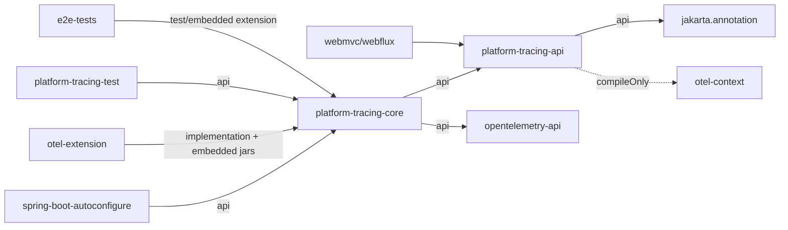

# platform-tracing-core Architecture Discovery

> **HISTORICAL EVIDENCE / SUPERSEDED INVENTORY.** Snapshot and findings below predate completion of the authoritative refactoring. Current architecture: [platform-tracing-final-architecture](../architecture/platform-tracing-final-architecture.md). Closed findings and final decisions are recorded in Slice J/K/M evidence; old module names remain here intentionally.

## Executive Summary

**Снимок:** ветка `feature/runtime-control-hardening`, commit `809ce49cff24ca62433d0060da6754397c22f3ab` (`feat(control): fail closed for runtime policy mutations`, 2026-07-18).

`platform-tracing-core` фактически является не одним «core», а общим артефактом для пяти разных ролей: реализации application-facing API, OTel runtime adapter, чистых policy engines, runtime-control domain layer и нескольких process-wide utilities. В модуле 24 production-пакета, 91 top-level production type и 13 nested production types. 68 из 91 top-level типов `public`; JPMS и package-level export control отсутствуют. Поэтому Java-visible surface существенно шире application API и одновременно служит неформальным SPI для autoconfigure и agent extension.

Гипотеза о неполном соответствии API и core **подтверждена**, но простое зеркалирование пакетов API было бы ошибкой. `TraceOperations -> SpanFactory -> SpanSpec/SpanExecution` имеет последовательную реализацию через `TracingRuntime`, однако границы политики, механизма и владения lifecycle размыты. В частности, `fromSpec()` достигает OTel без `AttributePolicy`, `start()` одновременно создаёт и активирует span, а mutable facade kill-switch существует только на concrete core type. Одновременно сама API-модель не является нейтральной: propagation API публично экспонирует OTel `Context`, `ContextKey` и `TextMapSetter`, а `SpanSpec`/manual builders зависят от статически инициализируемого `ServiceLoader`, требующего core в runtime.

Чистые sampling/validation/versioned-state части лучше отделены и защищены ArchUnit. Однако публичный `SamplingPolicyRule` практически не расширяем извне из-за package-private конструктора `SamplingPolicyEngine`; `RemoteServiceTraceMirror` полагается на внешнюю дисциплину cleanup; runtime-control принимает типизированный decode result, но передаёт domain payload как `Map<String,Object>` и ошибки как строки. Это архитектурные pressure points, не предложение целевой структуры.

Документация богата, но неоднородна по нормативности и актуальности. Ранние Accepted ADR используют удалённые `manual()` и `TracingImplementation`; актуальные `spans()` и `TracingRuntime` появились позднее. Runtime-код и тесты являются авторитетными там, где документы расходятся.

## Scope, Constraints, and Method

- Исследованы production/test source sets, Gradle-граф, resources, ArchUnit, Spring wiring, agent extension, web adapters, test fixtures, benchmarks, e2e и Git history.
- Интернет не использовался. Production code, tests, build/config и существующие документы не изменялись.
- **Confirmed fact** означает прямое подтверждение кодом/build/resource/test. **Inference** обозначает вывод из нескольких фактов. **Unresolved** означает отсутствие достаточного runtime/operational evidence.
- Поиск relevant tests определён как тестовые Java-файлы, ссылающиеся на ключевые API/core concepts; это 93 файла в 7 модулях. Это воспроизводимый discovery count, а не coverage metric.
- Pre-existing worktree changes сохранены: unstaged `docs/architecture/baselines/pr-0/starter-dependency-smoke.txt`; staged `platform-tracing-core/.../semconv/SemconvKeys.java`.

## Repository and Module Dependency Facts

### Build facts

| Fact | Confirmed evidence | Finding |
|---|---|---|
| Build | [settings.gradle](../../settings.gradle), [build.gradle](../../build.gradle) | Multi-project Gradle; Java toolchain 21; no `module-info.java`/`package-info.java`. |
| Versions | [gradle.properties](../../gradle.properties) | Platform `0.1.0-SNAPSHOT`, Spring Boot 3.5.5, OTel API BOM 1.62.0, instrumentation 2.28.1. |
| API dependencies | [platform-tracing-api/build.gradle](../../platform-tracing-api/build.gradle) | `jakarta.annotation` is `api`; OTel context is `compileOnly`; no Spring. |
| Core dependencies | [platform-tracing-core/build.gradle](../../platform-tracing-core/build.gradle) | API and `opentelemetry-api` are both `api`; SLF4J is `implementation`. Normal tests exclude `r01-red`; `knownDefectTest` includes it. |
| Fitness gates | [build.gradle](../../build.gradle), [ModuleTaxonomyArchRules.java](../../platform-tracing-test/src/main/java/space/br1440/platform/tracing/test/arch/ModuleTaxonomyArchRules.java) | `pr1ModuleTaxonomyVerify` and `pr4ArchitectureFitnessVerify`; rules enforce selected package constraints, not a complete core public-surface allowlist. |
| Service registration | [META-INF/services/OtelTraceparentReader](../../platform-tracing-core/src/main/resources/META-INF/services/space.br1440.platform.tracing.api.propagation.OtelTraceparentReader) | Core is the runtime provider for API `OtelTraceparentReader`. |

### Declared dependency direction



**Observed source direction:** core imports API throughout; API has no compile dependency on core, but [OtelTraceparentReaders.java](../../platform-tracing-api/src/main/java/space/br1440/platform/tracing/api/propagation/OtelTraceparentReaders.java#L26) resolves a core provider by ServiceLoader at runtime. Spring autoconfigure imports 28 core-using files, otel-extension 28, bench 7, e2e 4, test fixture 3, webmvc/webflux one each. Thus the build DAG is acyclic while runtime construction crosses an implicit API-to-core service boundary.

The API build description says it does not depend on OTel API/SDK, but public signatures in [TraceControlHeaderInjector.java](../../platform-tracing-api/src/main/java/space/br1440/platform/tracing/api/propagation/control/TraceControlHeaderInjector.java) use `Context` and `TextMapSetter`, and [PlatformTraceContextKeys.java](../../platform-tracing-api/src/main/java/space/br1440/platform/tracing/api/propagation/control/PlatformTraceContextKeys.java#L15) exposes `ContextKey`. Runtime code, not the description, is authoritative.

## Current platform-tracing-core Architecture

### Package responsibility map

Полный проверяемый inventory production packages (24/24):

```text
space.br1440.platform.tracing.core.context
space.br1440.platform.tracing.core.control.protocol
space.br1440.platform.tracing.core.enrichment
space.br1440.platform.tracing.core.exception
space.br1440.platform.tracing.core.facade
space.br1440.platform.tracing.core.manual
space.br1440.platform.tracing.core.manual.spec
space.br1440.platform.tracing.core.mdc.remote
space.br1440.platform.tracing.core.naming
space.br1440.platform.tracing.core.propagation
space.br1440.platform.tracing.core.propagation.control
space.br1440.platform.tracing.core.runtime
space.br1440.platform.tracing.core.runtime.otel
space.br1440.platform.tracing.core.runtime.otel.scope
space.br1440.platform.tracing.core.runtime.state
space.br1440.platform.tracing.core.runtime.versioned
space.br1440.platform.tracing.core.sampling.engine
space.br1440.platform.tracing.core.sampling.model
space.br1440.platform.tracing.core.sampling.policy
space.br1440.platform.tracing.core.sampling.properties
space.br1440.platform.tracing.core.semconv
space.br1440.platform.tracing.core.semconv.policy
space.br1440.platform.tracing.core.utils
space.br1440.platform.tracing.core.validation
```

| Module | Package | Intended/observed responsibility | Key types | Dependencies | Cohesion/boundary finding | Evidence |
|---|---|---|---|---|---|---|
| core | `core.context` | Supplier-backed read-only active IDs | `DefaultActiveTraceContextView` | API only | Cohesive adapter; public although only runtimes construct it. | [source](../../platform-tracing-core/src/main/java/space/br1440/platform/tracing/core/context/DefaultActiveTraceContextView.java) |
| core | `core.facade` | API facade and facade-level enable switch | `DefaultTraceOperations`, `NoopTraceOperations` | API, runtime, manual | Facade owns mutable routing and factory construction, not only delegation. | [source](../../platform-tracing-core/src/main/java/space/br1440/platform/tracing/core/facade/DefaultTraceOperations.java) |
| core | `core.manual` | API builders, semantic accumulation, execution | builders, `DefaultSpanFactory`, `ScopedExecution` | API, runtime, policy | Mixes adapters, orchestration, sanitization and execution lifecycle. | [source](../../platform-tracing-core/src/main/java/space/br1440/platform/tracing/core/manual/AbstractSemanticSpanBuilder.java) |
| core | `core.manual.spec` | Converts builder state to `SpanSpec` | `OperationSpanSpecs`, `SemanticSpanSpecs` | API, OTel common, policy | `SemanticSpanSpecs` owns naming plus policy validation and OTel conversion. | [source](../../platform-tracing-core/src/main/java/space/br1440/platform/tracing/core/manual/spec/SemanticSpanSpecs.java) |
| core | `core.runtime` | Internal span-creation/lifecycle boundary and no-op | `TracingRuntime`, handles, delegates | API, core policy/state | Public internal SPI is an intentional autoconfigure extension seam but exposed artifact-wide. | [source](../../platform-tracing-core/src/main/java/space/br1440/platform/tracing/core/runtime/TracingRuntime.java) |
| core | `core.runtime.otel` | OTel adapter and value conversion | `OtelTracingRuntime`, factory, converter | OTel API, API, core | Cohesive mechanism boundary; public helpers enlarge surface. | [source](../../platform-tracing-core/src/main/java/space/br1440/platform/tracing/core/runtime/otel/OtelTracingRuntime.java) |
| core | `core.runtime.otel.scope` | Owns OTel `Scope` and `Span` close/end | `OwningSpanScope` | OTel, exception policy | Explicit idempotent owner; public although wrapped by `SpanHandleImpl`. | [source](../../platform-tracing-core/src/main/java/space/br1440/platform/tracing/core/runtime/otel/scope/OwningSpanScope.java) |
| core | `core.runtime.state` | Enabled/degraded diagnostics state | `TracingMode`, `TracingState`, immutable impl | JDK | Internal state nevertheless public and consumed by autoconfigure. | [source](../../platform-tracing-core/src/main/java/space/br1440/platform/tracing/core/runtime/state/TracingState.java) |
| core | `core.runtime.versioned` | CAS/LKG immutable state primitive | `VersionedState`, holder | concurrency | Cohesive and tested; consumed by agent holders. | [source](../../platform-tracing-core/src/main/java/space/br1440/platform/tracing/core/runtime/versioned/VersionedStateHolder.java) |
| core | `core.enrichment` | Mutates current recording OTel span via safe API | `DefaultSpanEnricher`, generic adapter | API, OTel | Separate active-span path bypasses `TracingRuntime`; deliberate but competing lifecycle path. | [source](../../platform-tracing-core/src/main/java/space/br1440/platform/tracing/core/enrichment/DefaultSpanEnricher.java) |
| core | `core.exception` | Secure exception-event policy/recording | policy, recorder | OTel, API attributes | Cohesive policy+adapter pair; public construction used by Spring. | [source](../../platform-tracing-core/src/main/java/space/br1440/platform/tracing/core/exception/ExceptionRecorder.java) |
| core | `core.naming` | Canonical span-name normalization | `PlatformSpanNameBuilder` | OTel common | Pure naming goal, but imports OTel `Attributes`. | [source](../../platform-tracing-core/src/main/java/space/br1440/platform/tracing/core/naming/PlatformSpanNameBuilder.java) |
| core | `core.propagation` | OTel context wrapping, traceparent SPI, request-id utility | five types | API, OTel context | Three separate concerns under one package; ServiceLoader provider is hidden runtime protocol. | [source](../../platform-tracing-core/src/main/java/space/br1440/platform/tracing/core/propagation/OtelTraceparentReaderImpl.java) |
| core | `core.propagation.control` | Inbound extraction, trust policy, header injection | five types | API, OTel context | Policy and OTel adapter coexist; API owns contracts and context keys. | [source](../../platform-tracing-core/src/main/java/space/br1440/platform/tracing/core/propagation/control/DefaultTraceControlHeaderInjector.java) |
| core | `core.mdc.remote` | Cross-layer remote-service MDC and trace mirror | three types | SLF4J, concurrent map | Process-global mutable mirror has convention-based cleanup. | [source](../../platform-tracing-core/src/main/java/space/br1440/platform/tracing/core/mdc/remote/RemoteServiceTraceMirror.java) |
| core | `core.sampling.engine` | Ordered first-non-null rule evaluation | `SamplingPolicyEngine` | sampling packages | Pure and cohesive; custom-rule SPI cannot construct engine externally. | [source](../../platform-tracing-core/src/main/java/space/br1440/platform/tracing/core/sampling/engine/SamplingPolicyEngine.java) |
| core | `core.sampling.model` | Immutable request/decision/snapshot model | eight types | JDK, API reason constants | Cohesive; snapshot uses array plus defensive copying/order. | [source](../../platform-tracing-core/src/main/java/space/br1440/platform/tracing/core/sampling/model/SamplingPolicySnapshot.java) |
| core | `core.sampling.policy` | Ordered production sampling rules | ten types | model | Rule ordering is an executable hidden protocol encoded by array order. | [source](../../platform-tracing-core/src/main/java/space/br1440/platform/tracing/core/sampling/policy/ProductionSamplingPolicyChain.java) |
| core | `core.sampling.properties` | Config DTO, validation, snapshot factory | three types | model, utils | Pure configuration translation; used by runtime-control and agent. | [source](../../platform-tracing-core/src/main/java/space/br1440/platform/tracing/core/sampling/properties/SamplingPolicyPropertiesValidator.java) |
| core | `core.validation` | Versioned validation policy snapshots | two types | versioned state, time | Cohesive; domain semantics are strings/booleans rather than API enum. | [source](../../platform-tracing-core/src/main/java/space/br1440/platform/tracing/core/validation/ValidationSnapshot.java) |
| core | `core.control.protocol` | Domain validation, mutation authorization and apply orchestration | nine types | API decoder contracts, sampling | Correct decode/domain/apply order; public map/string protocol remains between core and extension. | [source](../../platform-tracing-core/src/main/java/space/br1440/platform/tracing/core/control/protocol/RuntimePolicyControlHandler.java) |
| core | `core.semconv` | OTel typed key registry | `SemconvKeys` | OTel common | Internal semantic mechanism is public and currently has a pre-existing staged edit. | [source](../../platform-tracing-core/src/main/java/space/br1440/platform/tracing/core/semconv/SemconvKeys.java) |
| core | `core.semconv.policy` | Category contracts, validation modes, metrics | five types | API semconv, OTel common, SLF4J/concurrency | Meaningful policy; public result and OTel signatures force transitive OTel exposure. | [source](../../platform-tracing-core/src/main/java/space/br1440/platform/tracing/core/semconv/policy/AttributePolicy.java) |
| core | `core.utils` | Null/empty helpers | five types | JDK | Public generic utilities are not tracing architecture and expand coupling surface. | [source](../../platform-tracing-core/src/main/java/space/br1440/platform/tracing/core/utils/MapUtils.java) |

### Complete production-type inventory

Counts: **91 top-level types** (68 public, 23 package-private) plus **13 nested types**, total **104 declarations**. Nested types are explicitly accounted for in their owning rows.

Для читаемости этой таблицы только обозначение `...` в колонке FQN формально разворачивается в точный префикс `space.br1440.platform.tracing.core`; например, `...runtime.TracingRuntime` означает полный FQN `space.br1440.platform.tracing.core.runtime.TracingRuntime`. Первая строка оставлена полностью развёрнутой как контроль формата.

| FQN | Visibility/kind | Responsibility | Key collaborators | Created by / consumed by | Tests | Architectural observation | Evidence |
|---|---|---|---|---|---|---|---|
| `space.br1440.platform.tracing.core.context.DefaultActiveTraceContextView` | public final class | Supplies optional trace/span/correlation IDs. | API view, suppliers | OTel/no-op runtimes | runtime tests | Stateless adapter; correlationId aliases traceId. | [code](../../platform-tracing-core/src/main/java/space/br1440/platform/tracing/core/context/DefaultActiveTraceContextView.java) |
| `...control.protocol.RuntimeControlMutationDecision` | public record | Allow/reject value with reason. | mutation policy | policy -> handler | control tests | Domain result is core-public. | [code](../../platform-tracing-core/src/main/java/space/br1440/platform/tracing/core/control/protocol/RuntimeControlMutationDecision.java) |
| `...control.protocol.RuntimeControlMutationPolicy` | public interface | Authorizes decoded valid mutation; startup fail-closed factory. | API operation | handler/agent wiring | handler tests | Policy/mechanism split is explicit. | [code](../../platform-tracing-core/src/main/java/space/br1440/platform/tracing/core/control/protocol/RuntimeControlMutationPolicy.java) |
| `...control.protocol.RuntimePolicyApplier` | public interface | Applies normalized runtime policy. | operation, `Map` | extension implementation | control/e2e | Cross-module SPI exposes untyped map. | [code](../../platform-tracing-core/src/main/java/space/br1440/platform/tracing/core/control/protocol/RuntimePolicyApplier.java) |
| `...control.protocol.RuntimePolicyControlDomainValidator` | public final class | Empty-mutation, sampling and validation-mode checks. | sampling validators | handler/e2e harness | domain tests | Static domain service; no operation parameter, infers from payload. | [code](../../platform-tracing-core/src/main/java/space/br1440/platform/tracing/core/control/protocol/RuntimePolicyControlDomainValidator.java) |
| `...control.protocol.RuntimePolicyControlHandler` | public final class | decode-result -> domain -> mutation policy -> apply. | above types/API decode | extension registrar/MBean | handler, extension e2e | Central control orchestrator; stateless after construction. | [code](../../platform-tracing-core/src/main/java/space/br1440/platform/tracing/core/control/protocol/RuntimePolicyControlHandler.java) |
| `...control.protocol.RuntimePolicyControlHandleResult` + `.HandleStatus` | public record + nested public enum | Encodes success/rejection without expected exceptions. | API violations/operation | handler -> MBean | handler/e2e | Nested enum is the 1st nested production type. | [code](../../platform-tracing-core/src/main/java/space/br1440/platform/tracing/core/control/protocol/RuntimePolicyControlHandleResult.java) |
| `...control.protocol.TracingControlDomainValidationResult` | public record | Immutable string violation list. | validator | handler/e2e | domain tests | Domain errors are strings, unlike typed wire violations. | [code](../../platform-tracing-core/src/main/java/space/br1440/platform/tracing/core/control/protocol/TracingControlDomainValidationResult.java) |
| `...control.protocol.ValidationModePolicyValidator` | public final class | Mode allowlist and mode/strict cross-field rules. | API keys | domain validator | dedicated tests | Core correctly owns domain semantics. | [code](../../platform-tracing-core/src/main/java/space/br1440/platform/tracing/core/control/protocol/ValidationModePolicyValidator.java) |
| `...enrichment.DefaultGenericSpanEnrichment` | package final class | Allowed mutations on one OTel span. | Span, SemconvKeys | `DefaultSpanEnricher` callback | enricher tests | No value validation beyond null. | [code](../../platform-tracing-core/src/main/java/space/br1440/platform/tracing/core/enrichment/DefaultGenericSpanEnrichment.java) |
| `...enrichment.DefaultSpanEnricher` | public final class | Enriches current valid recording span. | OTel `Span.current` | Spring bean/application | enricher tests | Silent no-op outside recording span. | [code](../../platform-tracing-core/src/main/java/space/br1440/platform/tracing/core/enrichment/DefaultSpanEnricher.java) |
| `...exception.ExceptionMessagePolicy` | public final class | Decides exception message/stack publication. | JDK | Spring -> recorder | exception tests | Immutable security policy. | [code](../../platform-tracing-core/src/main/java/space/br1440/platform/tracing/core/exception/ExceptionMessagePolicy.java) |
| `...exception.ExceptionRecorder` | public final class | Sanitized OTel exception event/status recording. | Span, policy | OTel runtime/Spring | exception/runtime tests | Centralized mechanism protected by ArchUnit. | [code](../../platform-tracing-core/src/main/java/space/br1440/platform/tracing/core/exception/ExceptionRecorder.java) |
| `...facade.DefaultTraceOperations` + `.RuntimeHolder` | public class + private record | API facade, factory routing, volatile enable/disable swap. | runtime/manual/state | Spring/user | facade/routing/bean tests | Owns mutable lifecycle not exposed by API; nested type 2. | [code](../../platform-tracing-core/src/main/java/space/br1440/platform/tracing/core/facade/DefaultTraceOperations.java) |
| `...facade.NoopTraceOperations` | public final class | No-op facade, optionally backed by degraded runtime. | no-op runtime, factory | Spring fallback/tests | no-op/bean tests | Context can retain degraded reason while spans no-op. | [code](../../platform-tracing-core/src/main/java/space/br1440/platform/tracing/core/facade/NoopTraceOperations.java) |
| `...manual.AbstractSemanticSpanBuilder` | package abstract class | Common mutable builder and execution grammar. | API builders/specs, policy, ServiceLoader | concrete builders | builder tests | Stateful, single-use intent not structurally enforced. | [code](../../platform-tracing-core/src/main/java/space/br1440/platform/tracing/core/manual/AbstractSemanticSpanBuilder.java) |
| `...manual.DatabaseSpanBuilderImpl` | package final class | Database semantic attributes. | SemconvKeys | transport factory | DB tests | Thin API adapter. | [code](../../platform-tracing-core/src/main/java/space/br1440/platform/tracing/core/manual/DatabaseSpanBuilderImpl.java) |
| `...manual.DefaultHttpTracing` + `.HttpServerSpanBuilderImpl` + `.HttpClientSpanBuilderImpl` | package final + 2 private nested classes | HTTP server/client builder family. | URL sanitizer, semantic specs | transport factory | HTTP tests | Types 3-4 nested; one file combines factory and two implementations. | [code](../../platform-tracing-core/src/main/java/space/br1440/platform/tracing/core/manual/DefaultHttpTracing.java) |
| `...manual.DefaultKafkaTracing` + `.AbstractKafkaSpanBuilder`, `.KafkaProducerSpanBuilderImpl`, `.KafkaConsumerSpanBuilderImpl`, `.KafkaBatchSpanBuilderImpl` | package final + private abstract/3 final | Producer/consumer/batch builder family and links. | semantic specs | transport factory | Kafka unit/integration | Nested types 5-8; high responsibility density. | [code](../../platform-tracing-core/src/main/java/space/br1440/platform/tracing/core/manual/DefaultKafkaTracing.java) |
| `...manual.DefaultRpcTracing` + `.AbstractRpcSpanBuilder`, `.RpcServerSpanBuilderImpl`, `.RpcClientSpanBuilderImpl` | package final + private abstract/2 final | RPC server/client builder family. | semantic specs | transport factory | RPC unit/integration | Nested types 9-11. | [code](../../platform-tracing-core/src/main/java/space/br1440/platform/tracing/core/manual/DefaultRpcTracing.java) |
| `...manual.DefaultSpanFactory` | public final class | Implements three `SpanFactory` entry points. | runtime, policy | facades | factory/execution tests | `fromSpec` does not invoke policy itself. | [code](../../platform-tracing-core/src/main/java/space/br1440/platform/tracing/core/manual/DefaultSpanFactory.java) |
| `...manual.DefaultTransportTracing` | public final class | Creates transport builder families. | runtime, policy | span factory | transport tests | Public implementation container. | [code](../../platform-tracing-core/src/main/java/space/br1440/platform/tracing/core/manual/DefaultTransportTracing.java) |
| `...manual.OperationSpanBuilderImpl` | package final class | Generic operation builder. | abstract builder | span factory | operation tests | Thin adapter with INTERNAL default. | [code](../../platform-tracing-core/src/main/java/space/br1440/platform/tracing/core/manual/OperationSpanBuilderImpl.java) |
| `...manual.ScopedExecution` | package final utility | start/try/record exception/close/rethrow. | SpanHandle | builders/execution | dedicated tests | Records `Exception`; `Error` is not recorded. | [code](../../platform-tracing-core/src/main/java/space/br1440/platform/tracing/core/manual/ScopedExecution.java) |
| `...manual.SpanExecutionImpl` | package final class | Binds immutable spec to runtime. | runtime, scoped execution | `fromSpec` | execution tests | Pure forwarding except lifecycle helper. | [code](../../platform-tracing-core/src/main/java/space/br1440/platform/tracing/core/manual/SpanExecutionImpl.java) |
| `...manual.UrlSanitizer` | package final utility | Redacts URL credentials/query/fragment and bounds length. | JDK URI/string | HTTP builder | dedicated tests | Security mechanism embedded in manual package. | [code](../../platform-tracing-core/src/main/java/space/br1440/platform/tracing/core/manual/UrlSanitizer.java) |
| `...manual.spec.OperationSpanSpecs` | public final utility | Builds generic operation `SpanSpec`. | API spec | operation builder | spec tests | Public helper despite internal use. | [code](../../platform-tracing-core/src/main/java/space/br1440/platform/tracing/core/manual/spec/OperationSpanSpecs.java) |
| `...manual.spec.SemanticSpanSpecs` | public final utility | Naming, attribute policy, OTel/API conversion, spec construction. | policy, converter, name builder | all semantic builders | semantic tests | Crosses policy and adapter boundaries. | [code](../../platform-tracing-core/src/main/java/space/br1440/platform/tracing/core/manual/spec/SemanticSpanSpecs.java) |
| `...mdc.remote.RemoteServiceMdc` | public final utility | MDC write/clear and trace mirror coordination. | SLF4J, API MDC key | extension processor/web filters | MDC tests/e2e | Cross-thread/process-global side effect. | [code](../../platform-tracing-core/src/main/java/space/br1440/platform/tracing/core/mdc/remote/RemoteServiceMdc.java) |
| `...mdc.remote.RemoteServiceNameResolver` | public final class | Resolves remote service from attributes then mirror. | API source enum, mirror | Spring provider | resolver tests | Reads convention shared with extension. | [code](../../platform-tracing-core/src/main/java/space/br1440/platform/tracing/core/mdc/remote/RemoteServiceNameResolver.java) |
| `...mdc.remote.RemoteServiceTraceMirror` | package final class | Concurrent traceId -> remoteService mirror. | `ConcurrentHashMap` | MDC/resolver | indirect tests | Unbounded until explicit `clearForTrace`. | [code](../../platform-tracing-core/src/main/java/space/br1440/platform/tracing/core/mdc/remote/RemoteServiceTraceMirror.java) |
| `...naming.PlatformSpanNameBuilder` | public final utility | Canonical names by span category/attributes. | OTel Attributes | semantic specs/extension | naming tests | OTel common coupling outside adapter package. | [code](../../platform-tracing-core/src/main/java/space/br1440/platform/tracing/core/naming/PlatformSpanNameBuilder.java) |
| `...propagation.NoOpPlatformContextPropagation` | public final class | Identity wrappers. | API | Spring degraded mode | propagation/bean tests | Semantic no-op parity is explicit. | [code](../../platform-tracing-core/src/main/java/space/br1440/platform/tracing/core/propagation/NoOpPlatformContextPropagation.java) |
| `...propagation.OtelPlatformContextPropagation` | public class | Captures/restores OTel context and wraps executors. | OTel Context, concurrency | Spring enabled mode | propagation tests | Mutable-free adapter; public class is unnecessarily extensible. | [code](../../platform-tracing-core/src/main/java/space/br1440/platform/tracing/core/propagation/OtelPlatformContextPropagation.java) |
| `...propagation.OtelTraceparentReaderImpl` + `.CarrierGetter` | public final + private enum | Delegates traceparent parsing to OTel propagator. | OTel propagation | ServiceLoader/API builders | parser/API tests | Nested type 12; provider ordering uses first service. | [code](../../platform-tracing-core/src/main/java/space/br1440/platform/tracing/core/propagation/OtelTraceparentReaderImpl.java) |
| `...propagation.RequestIdSupport` | public final utility | Sanitizes/creates bounded request IDs. | JDK | control/web/extension | dedicated tests | Dependency-light utility intentionally in core. | [code](../../platform-tracing-core/src/main/java/space/br1440/platform/tracing/core/propagation/RequestIdSupport.java) |
| `...propagation.control.DefaultInboundTraceControlExtractor` | public final class | Parses three inbound headers into API value. | RequestIdSupport | extension propagator | unit/e2e | Pure except shared reason constants. | [code](../../platform-tracing-core/src/main/java/space/br1440/platform/tracing/core/propagation/control/DefaultInboundTraceControlExtractor.java) |
| `...propagation.control.DefaultOutboundPropagationPolicy` | public final class | Trust and feature-flag decision. | API matcher/result | Spring outbound wiring | unit tests | Immutable policy. | [code](../../platform-tracing-core/src/main/java/space/br1440/platform/tracing/core/propagation/control/DefaultOutboundPropagationPolicy.java) |
| `...propagation.control.DefaultTraceControlHeaderInjector` | public final class | Injects allowed control values into OTel carrier. | API Context/Setter/keys | Spring Kafka/outbound | unit/e2e | OTel adapter in policy package. | [code](../../platform-tracing-core/src/main/java/space/br1440/platform/tracing/core/propagation/control/DefaultTraceControlHeaderInjector.java) |
| `...propagation.control.GlobTrustedDestinationMatcher` | package final class | Compiled glob matcher. | regex | matcher factory | matcher tests | Mechanism hidden correctly. | [code](../../platform-tracing-core/src/main/java/space/br1440/platform/tracing/core/propagation/control/GlobTrustedDestinationMatcher.java) |
| `...propagation.control.TrustedDestinationMatchers` | public final utility | Builds matcher from patterns. | glob matcher | Spring wiring | matcher tests | Public construction boundary. | [code](../../platform-tracing-core/src/main/java/space/br1440/platform/tracing/core/propagation/control/TrustedDestinationMatchers.java) |
| `...runtime.DelegatingTracingRuntime` | public interface | Complete decorator delegation contract. | `TracingRuntime` | metered runtime | routing/metrics tests | Prevents partial-decorator semantic loss. | [code](../../platform-tracing-core/src/main/java/space/br1440/platform/tracing/core/runtime/DelegatingTracingRuntime.java) |
| `...runtime.NoOpSpanHandle` | public final class | Null-object lifecycle. | API handle | no-op runtime | no-op tests | Idempotent stateless singleton. | [code](../../platform-tracing-core/src/main/java/space/br1440/platform/tracing/core/runtime/NoOpSpanHandle.java) |
| `...runtime.NoOpTracingRuntime` | public final class | Disabled/unavailable/noop state and empty context. | state, policy | Spring/facades/tests | no-op/routing tests | Uses permissive `AttributePolicy` even though no spans start. | [code](../../platform-tracing-core/src/main/java/space/br1440/platform/tracing/core/runtime/NoOpTracingRuntime.java) |
| `...runtime.SpanHandleImpl` | public final class | Exception de-duplication and owning-scope close. | `OwningSpanScope`, identity set | OTel runtime | lifecycle tests | Mutable and not documented thread-safe. | [code](../../platform-tracing-core/src/main/java/space/br1440/platform/tracing/core/runtime/SpanHandleImpl.java) |
| `...runtime.TracingRuntime` | public interface | Start span, active context, error, state, attribute policy. | API + core policy/state | Spring/custom runtime/manual | arch/routing/bean tests | Internal boundary leaks concrete `AttributePolicy`. | [code](../../platform-tracing-core/src/main/java/space/br1440/platform/tracing/core/runtime/TracingRuntime.java) |
| `...runtime.otel.OtelTracingRuntime` | public final class | Maps spec to OTel, starts and activates span. | OTel tracer/scope, recorder | Spring/factory | creation/relationship tests | ROOT and DETACHED both set root parent; returned handle owns activation. | [code](../../platform-tracing-core/src/main/java/space/br1440/platform/tracing/core/runtime/otel/OtelTracingRuntime.java) |
| `...runtime.otel.OtelTracingRuntimeFactory` | public final utility | Overloaded construction with defaults. | OTel, policy, recorder | direct users/tests | creation tests | Duplicates Spring constructor path. | [code](../../platform-tracing-core/src/main/java/space/br1440/platform/tracing/core/runtime/otel/OtelTracingRuntimeFactory.java) |
| `...runtime.otel.SpanKinds` | public final utility | Maps API category to OTel kind. | API/OTel | runtime | mapping tests | Adapter helper need not be artifact-public. | [code](../../platform-tracing-core/src/main/java/space/br1440/platform/tracing/core/runtime/otel/SpanKinds.java) |
| `...runtime.otel.SpanSpecAttributeValueConverter` | public final utility | Sealed API attribute values <-> OTel attributes. | API/OTel | runtime/spec helper/tests | converter tests | Public bidirectional adapter. | [code](../../platform-tracing-core/src/main/java/space/br1440/platform/tracing/core/runtime/otel/SpanSpecAttributeValueConverter.java) |
| `...runtime.otel.scope.OwningSpanScope` | public final class | Idempotently closes scope then ends span. | OTel, recorder | runtime/handle | lifecycle tests | Correct explicit owner, but lower-level public surface. | [code](../../platform-tracing-core/src/main/java/space/br1440/platform/tracing/core/runtime/otel/scope/OwningSpanScope.java) |
| `...runtime.state.ImmutableTracingState` | public final class | Immutable mode/reason/diagnostic map. | JDK | runtimes/diagnostics | state/bean tests | Public internal diagnostics model. | [code](../../platform-tracing-core/src/main/java/space/br1440/platform/tracing/core/runtime/state/ImmutableTracingState.java) |
| `...runtime.state.TracingMode` | public enum | ENABLED/DISABLED/UNAVAILABLE modes. | JDK | runtime/Spring | state tests | Construction policy depends on it. | [code](../../platform-tracing-core/src/main/java/space/br1440/platform/tracing/core/runtime/state/TracingMode.java) |
| `...runtime.state.TracingState` | public interface | Internal mode/reason/diagnostics view. | JDK | runtime/Spring diagnostics | state/arch tests | Despite name, not public API state. | [code](../../platform-tracing-core/src/main/java/space/br1440/platform/tracing/core/runtime/state/TracingState.java) |
| `...runtime.versioned.VersionedState` | public interface | Snapshot version contract. | JDK | validation/agent snapshots | ArchUnit/holder tests | Cross-module internal SPI. | [code](../../platform-tracing-core/src/main/java/space/br1440/platform/tracing/core/runtime/versioned/VersionedState.java) |
| `...runtime.versioned.VersionedStateHolder` | public final class | Lock-free validated LKG updates. | AtomicReference | agent holders | holder/ArchUnit | Builder may re-run; catches nonfatal Throwable and restores interrupt. | [code](../../platform-tracing-core/src/main/java/space/br1440/platform/tracing/core/runtime/versioned/VersionedStateHolder.java) |
| `...sampling.engine.SamplingPolicyEngine` | public final class | Ordered rule evaluation. | rule/model | extension adapter | engine tests | Constructor is package-private despite public rule SPI. | [code](../../platform-tracing-core/src/main/java/space/br1440/platform/tracing/core/sampling/engine/SamplingPolicyEngine.java) |
| `...sampling.model.ParentContextState` | public enum | Parent sampling state. | JDK | request/rules/adapter | rule tests | Pure domain value. | [code](../../platform-tracing-core/src/main/java/space/br1440/platform/tracing/core/sampling/model/ParentContextState.java) |
| `...sampling.model.RouteRatioPrefix` | public record | Prefix-ratio pair. | JDK | snapshot/factory/rule | snapshot/rule tests | Ratio validity is external validator invariant. | [code](../../platform-tracing-core/src/main/java/space/br1440/platform/tracing/core/sampling/model/RouteRatioPrefix.java) |
| `...sampling.model.SamplingPolicyDecision` | public record | Decision/reason/winning rule. | enums/utils | rules/adapter | decision/rule tests | Constructor enforces decision invariants. | [code](../../platform-tracing-core/src/main/java/space/br1440/platform/tracing/core/sampling/model/SamplingPolicyDecision.java) |
| `...sampling.model.SamplingPolicyDecisionType` | public enum | drop/sample/abstain. | JDK | decision/adapter | decision tests | Pure value. | [code](../../platform-tracing-core/src/main/java/space/br1440/platform/tracing/core/sampling/model/SamplingPolicyDecisionType.java) |
| `...sampling.model.SamplingPolicyReason` | public enum | Maps domain reason to API wire attribute value. | API constants | decisions/adapter | reason tests | Core model is coupled to public telemetry strings. | [code](../../platform-tracing-core/src/main/java/space/br1440/platform/tracing/core/sampling/model/SamplingPolicyReason.java) |
| `...sampling.model.SamplingPolicyRequest` | public record | Inputs for rule chain. | parent state | extension adapter | engine/rule tests | Pure request, nullable fields normalized by rules. | [code](../../platform-tracing-core/src/main/java/space/br1440/platform/tracing/core/sampling/model/SamplingPolicyRequest.java) |
| `...sampling.model.SamplingPolicySnapshot` | public final class | Immutable normalized sampling policy. | collections/route array | factory/engine/agent | snapshot/rule tests | Owns ordering and defensive copies. | [code](../../platform-tracing-core/src/main/java/space/br1440/platform/tracing/core/sampling/model/SamplingPolicySnapshot.java) |
| `...sampling.policy.DefaultRatioPolicyRule`, `ForceHeaderPolicyRule`, `HardDropPolicyRule`, `KillSwitchPolicyRule`, `ParentSampledPolicyRule`, `QaTracePolicyRule`, `RouteRatioPolicyRule` | seven package final classes | Individual ordered sampling decisions. | model/utils | production chain | one test class each | Cohesive rules; correctness depends on chain order. | [package](../../platform-tracing-core/src/main/java/space/br1440/platform/tracing/core/sampling/policy) |
| `...sampling.policy.ProductionSamplingPolicyChain` | public final utility | Defines production/foundation rule arrays. | all rules | engine | chain tests | Array order is policy protocol. | [code](../../platform-tracing-core/src/main/java/space/br1440/platform/tracing/core/sampling/policy/ProductionSamplingPolicyChain.java) |
| `...sampling.policy.SamplingPolicyRule` | public interface | Rule evaluation SPI. | model | package rules/engine | rule/ArchUnit | Public but external composition blocked by engine constructor. | [code](../../platform-tracing-core/src/main/java/space/br1440/platform/tracing/core/sampling/policy/SamplingPolicyRule.java) |
| `...sampling.policy.SamplingPolicyRuleNames` | package final utility | Stable winning-rule strings. | API constants | rules | chain/decision tests | Hidden string contract exported in decisions. | [code](../../platform-tracing-core/src/main/java/space/br1440/platform/tracing/core/sampling/policy/SamplingPolicyRuleNames.java) |
| `...sampling.policy.TraceIdRatioDecision` | package final utility | Deterministic trace-id ratio decision. | hex arithmetic | ratio rules | dedicated tests | Pure mechanism. | [code](../../platform-tracing-core/src/main/java/space/br1440/platform/tracing/core/sampling/policy/TraceIdRatioDecision.java) |
| `...sampling.properties.SamplingPolicyProperties` | public record | Raw policy configuration values. | collections | domain validator/factory/extension | validator/factory tests | Core-public config DTO. | [code](../../platform-tracing-core/src/main/java/space/br1440/platform/tracing/core/sampling/properties/SamplingPolicyProperties.java) |
| `...sampling.properties.SamplingPolicyPropertiesValidator` | public final utility | Bounds/cardinality/value validation. | utils | domain/extension | extensive tests | Owns domain limits. | [code](../../platform-tracing-core/src/main/java/space/br1440/platform/tracing/core/sampling/properties/SamplingPolicyPropertiesValidator.java) |
| `...sampling.properties.SamplingPolicySnapshotFactory` | public final utility | Normalizes properties into snapshot. | model/utils | extension | factory tests | Pure translator. | [code](../../platform-tracing-core/src/main/java/space/br1440/platform/tracing/core/sampling/properties/SamplingPolicySnapshotFactory.java) |
| `...semconv.SemconvKeys` | public final utility | OTel `AttributeKey` registry. | OTel common | builders/policy/extension | contract tests | Mechanism public only through core artifact. | [code](../../platform-tracing-core/src/main/java/space/br1440/platform/tracing/core/semconv/SemconvKeys.java) |
| `...semconv.policy.AttributePolicy` + `.UnsafeKeyClass` | public final + nested public enum | Category contracts, unsafe-key audit, normalization, warn-once. | OTel Attributes, API semconv, metrics | manual/Spring/bench | policy/contract tests | Mutable concurrent warned set; nested type 13. | [code](../../platform-tracing-core/src/main/java/space/br1440/platform/tracing/core/semconv/policy/AttributePolicy.java) |
| `...semconv.policy.CategoryContract` | package record | Allowed/required keys per category. | OTel keys/API enum | registry/policy | contract tests | Pure internal metadata. | [code](../../platform-tracing-core/src/main/java/space/br1440/platform/tracing/core/semconv/policy/CategoryContract.java) |
| `...semconv.policy.CategoryContracts` | package final utility | Static category contract registry. | SemconvKeys | policy | contract tests | Central ordering/allowlist source. | [code](../../platform-tracing-core/src/main/java/space/br1440/platform/tracing/core/semconv/policy/CategoryContracts.java) |
| `...semconv.policy.SemconvMetrics` | public interface | Validation/audit metrics with NOOP. | API enums | policy/Spring Micrometer | metrics/policy tests | Good adapter seam, but core-public. | [code](../../platform-tracing-core/src/main/java/space/br1440/platform/tracing/core/semconv/policy/SemconvMetrics.java) |
| `...semconv.policy.ValidatedAttributes` | public record | OTel attributes plus API violations. | OTel/API | policy/manual | policy tests | Public result exposes OTel common. | [code](../../platform-tracing-core/src/main/java/space/br1440/platform/tracing/core/semconv/policy/ValidatedAttributes.java) |
| `...utils.ArrayUtils`, `ListUtils`, `MapUtils`, `SetUtils`, `StringUtils` | five public final utilities | Null/empty collection/string helpers. | JDK | sampling/control/core | indirect + utility use | No domain ownership; artifact-public by convenience. | [package](../../platform-tracing-core/src/main/java/space/br1440/platform/tracing/core/utils) |
| `...validation.ValidationPolicyUpdate` | public final utility | Builds next normalized versioned validation snapshot. | time | extension holder | update tests | Pure domain transition. | [code](../../platform-tracing-core/src/main/java/space/br1440/platform/tracing/core/validation/ValidationPolicyUpdate.java) |
| `...validation.ValidationSnapshot` | public record | Immutable versioned validation policy. | VersionedState/time | extension holder/processor | snapshot/ArchUnit | Correct cross-module LKG value. | [code](../../platform-tracing-core/src/main/java/space/br1440/platform/tracing/core/validation/ValidationSnapshot.java) |

### Construction and runtime topology

[TracingCoreAutoConfiguration.tracingImplementation](../../platform-tracing-spring-boot-autoconfigure/src/main/java/space/br1440/platform/tracing/autoconfigure/TracingCoreAutoConfiguration.java#L73) selects disabled/unavailable OTel runtime, optionally wraps enabled runtime in `MeteredTracingRuntime`, then [traceOperations](../../platform-tracing-spring-boot-autoconfigure/src/main/java/space/br1440/platform/tracing/autoconfigure/TracingCoreAutoConfiguration.java#L134) chooses default/no-op facade. [SemanticLayerAutoConfiguration](../../platform-tracing-spring-boot-autoconfigure/src/main/java/space/br1440/platform/tracing/autoconfigure/SemanticLayerAutoConfiguration.java#L41) independently builds `AttributePolicy`, `SpanEnricher` and exception policy/recorder. User-provided `TracingRuntime` is an explicit advanced replacement seam and is not automatically metered.

Agent-side sampling constructs `SamplingPolicyEngine.productionEngine()` through `PlatformSamplerBuilder`; validation/scrubbing/sampling state holders use `VersionedStateHolder`; unified control is wired by [PlatformSpanProcessorFactory](../../platform-tracing-otel-extension/src/main/java/space/br1440/platform/tracing/otel/extension/factory/PlatformSpanProcessorFactory.java) into `RuntimePolicyControlHandler` and JMX registrar.

### Lifecycle, state and concurrency observations

- `OtelTracingRuntime.startSpan` creates **and immediately makes current**; `SpanHandle.close` restores scope and ends span. Creation and activation are inseparable.
- `OwningSpanScope.close` is idempotent via `AtomicBoolean`; `SpanHandleImpl` holds a mutable identity set without synchronization. No cross-thread use contract is explicit.
- `DefaultTraceOperations` changes a volatile immutable `RuntimeHolder`; individual reads are safe, but the switch is facade-local and can diverge from injected runtime state/diagnostics.
- `VersionedStateHolder` is lock-free; update functions can execute multiple times and must be side-effect-free.
- `AttributePolicy.warnedOnce` is concurrent process-lifetime state. `RemoteServiceTraceMirror` is a process-global concurrent map whose boundedness depends on external cleanup.

## Relevant platform-tracing-api Architecture

| Subdomain | Relevant API concepts | Contract evidence | Critical assessment |
|---|---|---|---|
| Root facade | `TraceOperations.traceContext()/spans()` | [TraceOperations.java](../../platform-tracing-api/src/main/java/space/br1440/platform/tracing/api/TraceOperations.java) | Narrow and application-oriented; enable/state controls deliberately absent. |
| Creation namespace | `SpanFactory.operation/transport/fromSpec` | [SpanFactory.java](../../platform-tracing-api/src/main/java/space/br1440/platform/tracing/api/span/SpanFactory.java) | Three clear entry paths; `fromSpec` is an intended governed escape hatch. |
| Fluent builders | `ManualSpanBuilder`, operation and transport builders | [builder package](../../platform-tracing-api/src/main/java/space/br1440/platform/tracing/api/span/builder) | CRTP vocabulary is consistent, but builders imply mutable single-use state without declaring thread/reuse semantics. |
| Specification | `SpanSpec`, builder, relationship, reason, typed values | [spec package](../../platform-tracing-api/src/main/java/space/br1440/platform/tracing/api/span/spec) | Immutable value and relationship validation are strong; implementation `DefaultSpanSpecBuilder` resides in API and invokes runtime SPI for traceparent parsing. |
| Execution/lifecycle | `SpanExecution`, `SpanHandle` | [SpanExecution.java](../../platform-tracing-api/src/main/java/space/br1440/platform/tracing/api/span/spec/SpanExecution.java), [SpanHandle.java](../../platform-tracing-api/src/main/java/space/br1440/platform/tracing/api/span/spec/SpanHandle.java) | `start()` name does not state that current context is changed; handle owns both scope and span. |
| Active context | `ActiveTraceContextView` | [ActiveTraceContextView.java](../../platform-tracing-api/src/main/java/space/br1440/platform/tracing/api/span/builder/ActiveTraceContextView.java) | OTel-neutral optional IDs; correlationId semantics are implementation alias. |
| Enrichment | `SpanEnricher`, `GenericSpanEnrichment` | [enrich package](../../platform-tracing-api/src/main/java/space/br1440/platform/tracing/api/span/enrich) | Safe narrow callback, but silent no-op semantics and current-span lookup are implicit. |
| Context propagation | `PlatformContextPropagation` | [PlatformContextPropagation.java](../../platform-tracing-api/src/main/java/space/br1440/platform/tracing/api/propagation/PlatformContextPropagation.java) | OTel-neutral signatures and explicit capture timing. |
| Trace control propagation | extractor/policy/injector/value types/context keys | [control package](../../platform-tracing-api/src/main/java/space/br1440/platform/tracing/api/propagation/control) | `TraceControlHeaderInjector` and context keys expose OTel types, contradicting neutral API description. |
| Traceparent SPI | `OtelTraceparentReader(s)` | [OtelTraceparentReaders.java](../../platform-tracing-api/src/main/java/space/br1440/platform/tracing/api/propagation/OtelTraceparentReaders.java) | API class initialization fails without a provider; first-provider selection is global and implicit. |
| Semantic governance | categories/results, semconv mode/violations/version markers | [semconv package](../../platform-tracing-api/src/main/java/space/br1440/platform/tracing/api/semconv) | Good stable vocabulary; enforcement is not uniform on every creation path. |
| Runtime control | seven public protocol types plus package-private decoder/schema | [control protocol](../../platform-tracing-api/src/main/java/space/br1440/platform/tracing/api/control/protocol) | PR #13 boundary is coherent: wire shape in API, domain rules in core, no public schema introspection. |
| Extension SPI | scrubbing rule and related types | [spi package](../../platform-tracing-api/src/main/java/space/br1440/platform/tracing/api/spi) | Used by agent ServiceLoader; separate from manual runtime. |

Nullability is mostly explicit with Jakarta annotations. Expected protocol failures are values; fluent methods reject null. No-op creation returns a non-null `SpanHandle`. `SpanEnricher` silently skips invalid/non-recording spans. Checked exceptions are rethrown by `callChecked`; runtime exceptions are recorded and rethrown by core execution helpers.

## API-to-Core Traceability Matrix

| API concept/type/method | Core implementation/path | Wiring owner | Runtime effect | No-op path | Tests | Alignment finding | Evidence |
|---|---|---|---|---|---|---|---|
| `TraceOperations.traceContext` | facade -> runtime `currentTraceContext` | Spring core auto-config | Reads current OTel IDs | empty view | routing/bean tests | Aligned. | [facade](../../platform-tracing-core/src/main/java/space/br1440/platform/tracing/core/facade/DefaultTraceOperations.java#L36) |
| `TraceOperations.spans` | facade-held `DefaultSpanFactory` | facade constructor | Returns creation namespace | same factory over no-op runtime | factory tests | Aligned, but factory construction is facade responsibility. | [facade](../../platform-tracing-core/src/main/java/space/br1440/platform/tracing/core/facade/DefaultTraceOperations.java) |
| `SpanFactory.operation` | `OperationSpanBuilderImpl` -> `OperationSpanSpecs` | core factory | governed INTERNAL span | no-op handle | operation tests | Policy runs during semantic spec build. | [factory](../../platform-tracing-core/src/main/java/space/br1440/platform/tracing/core/manual/DefaultSpanFactory.java#L27) |
| `SpanFactory.transport` | `DefaultTransportTracing` -> typed builders | core factory | semantic transport spans | no-op handle | transport unit/integration | Aligned; implementation family is dense. | [transport](../../platform-tracing-core/src/main/java/space/br1440/platform/tracing/core/manual/DefaultTransportTracing.java) |
| `SpanFactory.fromSpec` | `SpanExecutionImpl` -> runtime | core factory | Direct OTel span from API attributes | no-op handle | execution/spec tests | **Gap:** does not pass through `AttributePolicy`. | [execution](../../platform-tracing-core/src/main/java/space/br1440/platform/tracing/core/manual/SpanExecutionImpl.java#L25) |
| `ManualSpanBuilder.start/run/call` | abstract builder -> spec -> runtime/`ScopedExecution` | builder instance | start/current/error/end | action still executes | builder/scoped tests | Lifecycle works, activation is implicit. | [builder](../../platform-tracing-core/src/main/java/space/br1440/platform/tracing/core/manual/AbstractSemanticSpanBuilder.java#L117) |
| `SpanHandle` | `SpanHandleImpl` -> `OwningSpanScope` | OTel runtime | exception de-dup, scope close, span end | singleton no-op | lifecycle tests | Ownership exists but thread contract unclear. | [handle](../../platform-tracing-core/src/main/java/space/br1440/platform/tracing/core/runtime/SpanHandleImpl.java) |
| `SpanEnricher` | `DefaultSpanEnricher` | semantic auto-config | Mutates current recording OTel span | silent callback skip | enricher/bean tests | Separate direct OTel path, not runtime-mediated. | [enricher](../../platform-tracing-core/src/main/java/space/br1440/platform/tracing/core/enrichment/DefaultSpanEnricher.java) |
| `PlatformContextPropagation` | OTel/no-op implementations | Spring core auto-config | capture/restore OTel context | identity wrappers | propagation/bean tests | Selection uses facade concrete type. | [wiring](../../platform-tracing-spring-boot-autoconfigure/src/main/java/space/br1440/platform/tracing/autoconfigure/TracingCoreAutoConfiguration.java#L184) |
| inbound trace control | default extractor -> API value -> extension Context | extension propagator | request/force/QA control in OTel context | absent values | unit/e2e | Contract split is clear; Context key is OTel-leaky API. | [extractor](../../platform-tracing-core/src/main/java/space/br1440/platform/tracing/core/propagation/control/DefaultInboundTraceControlExtractor.java) |
| outbound policy/injector | trust matcher -> decision -> OTel injector | Spring outbound auto-config | conditional header propagation | deny all | unit/Kafka tests | Policy and adapter are distinguishable. | [policy](../../platform-tracing-core/src/main/java/space/br1440/platform/tracing/core/propagation/control/DefaultOutboundPropagationPolicy.java) |
| traceparent builder methods | API/core builder -> `OtelTraceparentReaders.get` -> core provider | META-INF/services | OTel W3C extraction to API link | no provider = class-init failure | reader/parser tests | Runtime coupling is hidden from build graph. | [holder](../../platform-tracing-api/src/main/java/space/br1440/platform/tracing/api/propagation/OtelTraceparentReaders.java#L26) |
| decoded control request | API decode -> core handler -> extension applier | agent factory/registrar | validated state mutation | rejection value/no apply | API/core/extension/e2e | PR #13 direction is aligned. | [handler](../../platform-tracing-core/src/main/java/space/br1440/platform/tracing/core/control/protocol/RuntimePolicyControlHandler.java) |
| semconv validation | API vocabulary -> core `AttributePolicy` -> metrics | semantic auto-config | normalize/warn/throw | permissive policy in no-op | policy/ArchUnit | Not uniformly reached by raw specs/enrichment. | [policy](../../platform-tracing-core/src/main/java/space/br1440/platform/tracing/core/semconv/policy/AttributePolicy.java) |

## Representative End-to-End Flows

### Manual operation span

`TraceOperations.spans()` -> `DefaultTraceOperations.spans()` -> `DefaultSpanFactory.operation(name)` -> `OperationSpanBuilderImpl` -> `AbstractSemanticSpanBuilder.start()` -> `OperationSpanSpecs/SemanticSpanSpecs` -> `AttributePolicy.validateAndNormalize()` -> `OtelTracingRuntime.startSpan()` -> OTel `SpanBuilder.startSpan()` -> `Context.makeCurrent()` -> `OwningSpanScope` -> `SpanHandleImpl`; `close()` closes scope then ends span. Evidence: [builder](../../platform-tracing-core/src/main/java/space/br1440/platform/tracing/core/manual/AbstractSemanticSpanBuilder.java), [runtime](../../platform-tracing-core/src/main/java/space/br1440/platform/tracing/core/runtime/otel/OtelTracingRuntime.java#L53), [scope](../../platform-tracing-core/src/main/java/space/br1440/platform/tracing/core/runtime/otel/scope/OwningSpanScope.java#L84).

`run/call/callChecked` add `ScopedExecution`: it records `RuntimeException`/`Exception`, rethrows, and closes through try-with-resources. `Error` bypasses recording but still closes.

### Governed raw specification

`SpanSpec.builder()` -> API `DefaultSpanSpecBuilder` final-state checks -> `SpanFactory.fromSpec()` -> `SpanExecutionImpl.start()` -> `TracingRuntime.startSpan()` -> OTel. Relationship/link validation is repeated at runtime, but semantic `AttributePolicy` is not called on this path. This contradicts the central-governance claim in [ADR-platform-tracing-span-spec-governance.md](../decisions/ADR-platform-tracing-span-spec-governance.md).

### Active enrichment and error

`SpanEnricher.enrichCurrentSpan(callback)` -> `DefaultSpanEnricher` -> `Span.current()` -> if valid+recording `DefaultGenericSpanEnrichment` -> direct `Span.setAttribute`. Manual error: `SpanHandle.recordException` -> `SpanHandleImpl` identity de-dup -> `OwningSpanScope.recordException` -> `ExceptionRecorder.record` -> OTel event/status.

### Inbound/outbound control

Inbound: extension `InboundTraceControlPropagator.extract` -> `DefaultInboundTraceControlExtractor.fromHeaders` -> `RequestIdSupport.sanitizeOrNull` -> API `InboundTraceControl` -> OTel `Context` under `PlatformTraceContextKeys.TRACE_CONTROL` -> sampling adapter reads control.

Outbound: Spring interceptor/configuration -> `DefaultOutboundPropagationPolicy.decide(destination)` -> API `OutboundPropagationDecision` -> context key -> `DefaultTraceControlHeaderInjector.inject(Context, carrier, TextMapSetter)` -> selected platform headers.

### Context capture/restore

`PlatformContextPropagation.wrap(Runnable)` captures `Context.current()` at wrap; supplier uses captured `Context.makeCurrent()` during execution; executor wrappers use OTel task-wrapping and capture at each submission. Degraded/no-op facade selects identity implementation, so tasks execute normally without context manipulation.

### Runtime creation and disabled behavior

`TracingCoreAutoConfiguration.platformSdkModeDiagnostics` -> SDK mode resolver/probe -> `tracingImplementation`: disabled/unavailable returns `NoOpTracingRuntime`; enabled returns `OtelTracingRuntime`, optionally `MeteredTracingRuntime`; `traceOperations` returns `NoopTraceOperations.backedBy` unless mode is ENABLED. Disabled manual actions still execute and receive no-op handles; active IDs are empty; platform context wrappers are identity functions.

## Adjacent Module Constraints

| Module | File/symbol | Relationship to core/API | Constraint or assumption | Refactoring impact | Evidence |
|---|---|---|---|---|---|
| spring autoconfigure | `TracingCoreAutoConfiguration` | Sole normal application construction owner | Supports custom `TracingRuntime`; chooses no-op by state; probes OTel by creating a span. | Runtime/facade/state changes require bean topology migration. | [code](../../platform-tracing-spring-boot-autoconfigure/src/main/java/space/br1440/platform/tracing/autoconfigure/TracingCoreAutoConfiguration.java) |
| spring autoconfigure | `SemanticLayerAutoConfiguration` | Builds policy/enricher/recorder | Spring properties map directly to public core constructors. | Policy construction boundary is externally coupled. | [code](../../platform-tracing-spring-boot-autoconfigure/src/main/java/space/br1440/platform/tracing/autoconfigure/SemanticLayerAutoConfiguration.java) |
| spring autoconfigure | `MeteredTracingRuntime` | Implements core decorator SPI | Must delegate every method; user custom runtime bypasses wrapper. | SPI change affects metrics and topology tests. | [code](../../platform-tracing-spring-boot-autoconfigure/src/main/java/space/br1440/platform/tracing/autoconfigure/metrics/MeteredTracingRuntime.java) |
| spring autoconfigure | AOP, Kafka, diagnostics, health, remote service provider | Consumes facade, runtime state, propagation, MDC resolver | Several concrete core types are operational contracts. | Cannot classify all public core types as unused implementation. | [module](../../platform-tracing-spring-boot-autoconfigure/src/main/java) |
| webmvc | `TraceResponseHeaderServletFilter` | Clears core remote MDC/mirror at request end | Cleanup ordering is lifecycle contract. | Moving MDC ownership affects leak prevention. | [code](../../platform-tracing-autoconfigure-webmvc/src/main/java/space/br1440/platform/tracing/autoconfigure/servlet/TraceResponseHeaderServletFilter.java) |
| webflux | `TraceResponseHeaderWebFilter` | Same cleanup in reactive lifecycle | Reactor cancellation/finalization semantics constrain cleanup. | Requires reactive characterization. | [code](../../platform-tracing-autoconfigure-webflux/src/main/java/space/br1440/platform/tracing/autoconfigure/reactive/TraceResponseHeaderWebFilter.java) |
| otel-extension | sampler package | Adapts OTel `shouldSample` to core sampling engine/model and versioned state | Core pure model is embedded in agent classloader. | Signature/package moves alter shaded/embedded extension jar. | [adapter](../../platform-tracing-otel-extension/src/main/java/space/br1440/platform/tracing/otel/extension/sampler/SamplingPolicyOtelAdapter.java) |
| otel-extension | processors/holders | Uses core enrichment, semconv, validation/versioned state | Agent lifecycle and policy updates depend on core-public internals. | Must preserve classloader and LKG behavior. | [processor](../../platform-tracing-otel-extension/src/main/java/space/br1440/platform/tracing/otel/extension/processor/EnrichingSpanProcessor.java) |
| otel-extension | control/JMX | Implements `RuntimePolicyApplier`, constructs handler, maps OpenMBean | Core remains JMX-neutral; wire boundary uses maps/open types. | PR #13 architecture must remain intact. | [applier](../../platform-tracing-otel-extension/src/main/java/space/br1440/platform/tracing/otel/extension/control/JmxRuntimePolicyApplier.java) |
| platform-tracing-test | extension + ArchUnit rules | Public test fixture re-exports API/core and codifies boundaries | Structural rules are shared by modules. | Rule updates must distinguish behavior from package freeze. | [rules](../../platform-tracing-test/src/main/java/space/br1440/platform/tracing/test/arch/ModuleTaxonomyArchRules.java) |
| e2e-tests | normal/custom/test/jmxWire source sets | Embeds API/core into extension fixtures | Classloader-neutral wire and ServiceLoader resources are packaging contracts. | Must verify actual execution, not only compilation. | [build](../../platform-tracing-e2e-tests/build.gradle) |
| bench | JMH sources | Directly constructs policy/runtime/core models | Measures concrete classes and may resist visibility changes. | Bench is evidence, not automatically public API. | [build](../../platform-tracing-bench/build.gradle) |
| samples | compilable API examples | Uses API only | Captures application-facing vocabulary. | API changes require adoption examples. | [module](../../platform-tracing-samples/src/main/java) |
| collector-config | tests API constants | Downstream wire/attribute consumer | Stable telemetry strings matter beyond Java API. | Semantic key changes affect collector assertions. | [build](../../platform-tracing-collector-config/build.gradle) |
| servlet/reactive starters | dependency-only modules | Transitively deliver autoconfigure/API/core | Artifact graph is user-visible. | Module dependency moves affect fleet classpaths. | [settings](../../settings.gradle) |

Active materially adjacent modules counted for this report: **11** (Spring autoconfigure, two web autoconfigures, two starters, OTel extension, test, e2e, bench, samples, collector config). `platform-tracing-semconv-lint` was inspected as an excluded scaffold, not counted active.

## Test Architecture and Coverage Evidence

Search identified **93 relevant test Java files**: core 52, Spring autoconfigure 19, otel-extension 11, API 4, e2e 4, platform-tracing-test 2, webmvc 1. Core has 67 total test Java files; API has 21 total.

| Class | Protected claims | Evidence/limitations |
|---|---|---|
| Contract/characterization | Manual builder unit/integration tests, sampling rule tests, protocol decoder/golden tests | Strong relationship, semantic attribute, rule-order and protocol behavior. `fromSpec` policy-bypass behavior is not characterized as an intentional contract. |
| Runtime integration | `OtelTracingRuntimeCreationAttributesTest`, transport integration tests | Verifies OTel effects and relationships; no broad cross-thread `SpanHandle` ownership test found. |
| Wiring | `BeanTopologyTest`, SDK mode tests, extension registrar/control e2e | Protects bean singularity, custom runtime replacement, disabled modes and control apply safety. |
| Fitness | six core ArchUnit classes plus API and shared rule suites | Protects selected dependency directions, OTel isolation, package placement and runtime-versioned rules. It does not whitelist core public surface or enforce all policy/mechanism directions. |
| Negative/no-op | no-op/routing/disabled Spring tests and mutation-disabled control tests | Good non-throwing semantics; context propagation selection is tied to concrete facade type. |
| Structure-coupled | package allowlists, class names, removed-symbol tests | Valuable for accepted boundaries, but some preserve names/locations rather than runtime behavior; planning must revalidate intent before moving types. |
| Special suite | `knownDefectTest` includes `r01-red`, normal `test` excludes it | A passing normal core test does not imply known-defect suite passes. [build](../../platform-tracing-core/build.gradle) |

No test task was run in this discovery because the task is read-only, relevant behavior was already represented by test source evidence, and the worktree contains pre-existing generated-baseline and staged source changes. This report does not claim runtime green status.

## Architecture Documentation and Evolution

217 repository documents matched broad architecture terms; the table lists the normative or directly explanatory subset. Other audits/plans are indexed by search but are not treated as current decisions.

| Document/commit | Status/date if known | Decision or claim | Current code conformity | Staleness/contradiction | Relevance |
|---|---|---|---|---|---|
| [ADR clean-core hybrid](../decisions/ADR-platform-tracing-clean-core-hybrid.md) | Proposed, 2026-06-11 | API contracts, pure policy core, thin OTel/Spring adapters | Partial: sampling/validation pure; core still hosts OTel/manual/facade. | Still `Proposed`; text claims committee target but status not updated. | Broad target context, not proof of accepted current state. |
| [ADR core OTel exposure](../decisions/ADR-platform-tracing-core-otel-api-exposure.md) | Accepted, pre-production | Keep OTel as core `api` due public signatures | Build conforms. | Rationale cites removed OTel constructors on `DefaultTraceOperations`; only `AttributePolicy` rationale remains current. | Explains transitive OTel debt but needs revalidation. |
| [ADR v3 public API](../decisions/ADR-platform-tracing-v3-public-api.md) | Accepted, 2026-07-07 | two-method facade, formerly `manual()` | Concept conforms; method is now `spans()`. | Uses removed `TracingImplementation`/`manual`. | Historical rationale for narrow facade. |
| [ADR SpanFactory shape](../decisions/ADR-span-factory-api-shape.md) | Accepted | Rename `manual()` to `spans()`; three entry points | Conforms exactly. | Supersedes vocabulary in earlier ADRs but does not mark them superseded. | Current API vocabulary. |
| [ADR API span package boundary](../decisions/ADR-api-span-package-boundary.md) | Accepted | Keep `TraceOperations` at `traceContext/spans`; move implementation keys | Mostly conforms. | Follow-up status must be checked against staged `SemconvKeys`. | Current package decision. |
| [ADR SpanSpec governance](../decisions/ADR-platform-tracing-span-spec-governance.md) | Accepted, 2026-07-07 | all raw specs governed centrally | Partial. Final-state/reason rules conform; core policy is bypassed by `fromSpec`. | Names use `manual().spanFromSpec`; current is `spans().fromSpec`. | Evidence for ALIGN-04. |
| [ADR context-first propagation](../decisions/ADR-context-first-propagation.md) | accepted as stated | OTel Context is canonical propagation carrier | Code conforms. | Creates intentional API OTel exposure not reflected by API build description. | Explains exposure intent. |
| [ADR sampling layering](../decisions/ADR-sampling-package-layering.md) | Accepted | model/policy/engine/properties separation | Conforms and ArchUnit protects it. | None material found. | Strong current subdomain evidence. |
| [ADR versioned state](../decisions/ADR-versioned-state-runtime-package.md) | Accepted | CAS primitive in core runtime.versioned | Conforms; shared rules enforce allowlist. | None material found. | State/concurrency boundary. |
| [module taxonomy](../architecture/platform-tracing-module-taxonomy.md) | PR-1 status | Allowed module directions and migration risks | Build mostly conforms. | Descriptive category «internal» is not enforced by Java visibility. | Current fitness baseline. |
| [fitness implementation](../architecture/platform-tracing-fitness-functions-implementation.md) | PR-4 status | Gradle/ArchUnit gates | Tasks/rules exist. | Does not imply full boundary coverage. | Verification ownership. |
| [old core inventory](platform-tracing-core-architecture-inventory.md) | analysis, no normative status | Earlier full inventory | Substantially stale. | Mentions root/impl/legacy packages, `TracingImplementation`, `manual()`. | Useful evolution evidence, unsafe as current source. |
| [runtime policy control architecture](../tracing/runtime-policy-control-architecture.md) | normative references, PR-9A+ | policy holders, JMX split, LKG | Broadly conforms; now seven MBeans with protocol facade. | Six-MBean statements predate PR #13 seventh MBean. | Agent/core boundary history. |
| `26f25fc` | 2026-07-13 | rename root facade to `TraceOperations` | Current naming conforms. | Commit subject alone does not establish semantics. | Recent facade evolution. |
| `8f48a3a`, `2c59b42` | 2026-07-13 | `SpanFactory`, semantic specs/API builder | Current architecture descends directly. | None inferred beyond diff history. | Creation model evolution. |
| `faa4887`..`dbfaf4e` | 2026-07-14 | move semconv contracts/keys to core and close leaks | Current core policy placement mostly conforms. | History includes restore/remove churn; staged `SemconvKeys` means snapshot is locally modified. | Explains semconv instability. |
| `3542351`..`4f2e372` | 2026-07-15/16 | move/refine RequestIdSupport in core | Current dependency-light utility conforms. | Multiple small refactors; intent documented by tests/rules. | Propagation utility history. |
| `9f9fd7e`, `dbb0be0`, `56719c9` | 2026-07-15/16 | contracts in API, implementations in core, consumer migration | Current propagation pattern conforms. | Generic commit subjects; no broader design intent inferred. | API/core split history. |
| `9def9d5`..`64f7499` | 2026-07-17/18 | flat protocol decoder + core handler | Current PR #13 architecture conforms. | None material; post-audits record process history. | Control protocol baseline. |
| `809ce49` | 2026-07-18 | fail-closed runtime mutations | Current branch HEAD. | Not evidence of merged status. | Latest control hardening. |

## Confirmed Alignment Gaps

| ID | Dimension | Confirmed gap | Evidence | Consequence | Correction locus | Confidence |
|---|---|---|---|---|---|---|
| ALIGN-01 | public/internal boundary | 68/91 core top-level types are public; no JPMS/export allowlist; many are documented internal. | inventory, builds, no descriptors | Consumers can couple to factories, utilities, state and OTel mechanics not represented by API. | core | high |
| ALIGN-02 | dependency direction | `TracingRuntime` is a public cross-module SPI returning concrete core `AttributePolicy` and `TracingState`. | [interface](../../platform-tracing-core/src/main/java/space/br1440/platform/tracing/core/runtime/TracingRuntime.java), Spring custom bean path | Runtime implementations must depend on core policy/state details; facade and mechanism cannot evolve independently. | core + possibly api | high |
| ALIGN-03 | OTel isolation | OTel usage is spread over 17 core files in naming, enrichment, exception, manual.spec, propagation/control and semconv, not only `runtime.otel`. | import scan and package map | Adapter changes and OTel versioning affect policy/manual packages; «pure core» claim is only locally true. | core, unresolved module boundary | high |
| ALIGN-04 | governance | `SpanFactory.fromSpec` reaches `OtelTracingRuntime.startSpan` without `AttributePolicy`; accepted ADR says all paths are governed centrally. | [factory](../../platform-tracing-core/src/main/java/space/br1440/platform/tracing/core/manual/DefaultSpanFactory.java), [runtime](../../platform-tracing-core/src/main/java/space/br1440/platform/tracing/core/runtime/otel/OtelTracingRuntime.java) | Raw spec attributes can bypass category allow/required/unsafe validation applied to semantic builders. | both | high |
| ALIGN-05 | lifecycle ownership | API `start()` returns a handle, while runtime also activates the span immediately; API does not name this side effect or thread confinement. | [runtime lines 73-77](../../platform-tracing-core/src/main/java/space/br1440/platform/tracing/core/runtime/otel/OtelTracingRuntime.java#L73), API handle/execution | Misuse across threads or delayed close can corrupt current context and leak scope. | both | high |
| ALIGN-06 | state/control | `DefaultTraceOperations.setFacadeEnabled` is mutable core-only behavior separate from `TracingRuntime.state`; no API/diagnostic atomic state model covers both. | [facade](../../platform-tracing-core/src/main/java/space/br1440/platform/tracing/core/facade/DefaultTraceOperations.java#L46) | Downcasts and divergent enabled diagnostics are possible. | core + wiring | high |
| ALIGN-07 | extension semantics | `SamplingPolicyRule` is public, but external code cannot construct an engine with custom rules because constructor is package-private. | [engine](../../platform-tracing-core/src/main/java/space/br1440/platform/tracing/core/sampling/engine/SamplingPolicyEngine.java#L14) | Public SPI signals extensibility that the construction boundary denies. | core or API decision | high |
| ALIGN-08 | propagation boundary | `core.propagation` combines context adapter, traceparent SPI provider and request-id policy; API builder indirectly loads core. | package sources/resource | Independent API use and testing depend on classpath/service initialization conventions. | both | high |
| ALIGN-09 | policy/mechanism | `SemanticSpanSpecs` performs naming, OTel conversion, category policy validation and API spec construction. | [source](../../platform-tracing-core/src/main/java/space/br1440/platform/tracing/core/manual/spec/SemanticSpanSpecs.java) | Changes in one concern force broad builder regressions and OTel coupling. | core | high |
| ALIGN-10 | lifecycle/concurrency | Remote-service mirror is process-global/unbounded until filters call `clearForTrace`; producer and cleanup live in three modules. | MDC/mirror/web filters | Missing/cancelled cleanup path can retain entries and cross-request state. | core + adjacent | medium |
| ALIGN-11 | control model | Core control SPI uses normalized `Map<String,Object>` and string domain violations after typed API decode. | control types | Key changes and error semantics are compiler-invisible between core and extension. | core + API, preserve wire boundary | medium |
| ALIGN-12 | cohesion | Public `core.utils` collection/string helpers have no tracing responsibility and are used as implementation conveniences. | inventory/usages | Creates accidental reusable surface and makes internal refactoring consumer-visible. | core | high |
| ALIGN-13 | documentation | Accepted documents simultaneously name `manual/TracingImplementation` and `spans/TracingRuntime`; old inventory is structurally obsolete. | documentation table | Review/planning agents can optimize against a non-existent architecture. | docs governance | high |

## Potential Defects in the API Reference Architecture

These findings are separate from core misalignment; blindly matching core to API could preserve them.

| ID | Potential API defect | Evidence and consequence | Certainty |
|---|---|---|---|
| API-01 | OTel-neutrality claim is false for propagation-control API. | Public `TraceControlHeaderInjector` uses OTel `Context/TextMapSetter`; public keys use `ContextKey`, while dependency is `compileOnly`. Consumers of these signatures need OTel types despite module description. | confirmed |
| API-02 | API static initialization requires an implementation artifact. | `OtelTraceparentReaders.INSTANCE` calls `ServiceLoader.findFirst().orElseThrow`; `SpanSpec`/builders invoking traceparent support can fail at class initialization without core. Provider selection and classloader are implicit. | confirmed |
| API-03 | Lifecycle grammar does not expose activation semantics. | `SpanExecution.start`/`ManualSpanBuilder.start` sound like creation, but core makes span current and handle owns restoration. API has no inactive-start concept or explicit same-thread statement. | confirmed shape; misuse likelihood unresolved |
| API-04 | `SpanSpec` governance metadata is stronger than enforcement seam. | API validates reason/reference and relationship, but offers no contract requiring a runtime semantic policy pass; current core bypass demonstrates the missing seam. | confirmed |
| API-05 | Enrichment no-op is observable only by absence of callback. | Callback is never invoked when current span is invalid/non-recording; API has `void` return and no result/reason. Applications cannot distinguish enrichment success. | confirmed; whether defective is unresolved |
| API-06 | `ActiveTraceContextView.correlationId` vocabulary is underspecified. | Core aliases it to traceId, while request-id is a separate platform concept and ADR history discusses both. | confirmed ambiguity |
| API-07 | API contains implementation (`DefaultSpanSpecBuilder`) and SPI holder, not only contracts. | This keeps immutable value construction convenient, but embeds provider discovery and final-state mechanics in the public artifact. | confirmed pressure point, not intrinsically defective |

## Hidden Contracts and Refactoring Risk Register

| ID | Hidden contract/risk | Trigger | Affected modules | Existing protection | Missing evidence/test | Severity |
|---|---|---|---|---|---|---|
| RISK-01 | ServiceLoader first provider and class-init singleton | provider absent/duplicate/classloader split | API/core/e2e/extension | provider unit test, resource | duplicate-provider and agent/app CL selection | high |
| RISK-02 | Start implies make-current; close order scope-before-end | moving lifecycle or async use | API/core/autoconfigure | scope/runtime tests, strict context opt-in | explicit cross-thread misuse contract | high |
| RISK-03 | Semantic policy bypass on `fromSpec` | arbitrary API spec attributes | API/core/export | final-state tests | end-to-end policy parity test | high |
| RISK-04 | Sampling rule array order/first non-null wins | reorder/add rule | core/extension | per-rule and chain tests | fleet-policy compatibility evidence | high |
| RISK-05 | Rule names/reason codes are telemetry strings | rename model/constants | core/collector/dashboards | constants/tests | external dashboard/alert inventory | medium |
| RISK-06 | Remote-service mirror cleanup | exception/cancellation/filter absent | core/extension/webmvc/webflux | unit/filter tests | cardinality/leak soak under cancellation | high |
| RISK-07 | `VersionedStateHolder` updater re-execution | CAS contention/side effects | core/extension | holder tests/Javadoc | contention test for every holder updater | medium |
| RISK-08 | Custom `TracingRuntime` replaces default and bypasses metering | user bean exists | autoconfigure/core | bean topology test/Javadoc | production adoption inventory | medium |
| RISK-09 | No-op selection by `instanceof NoopTraceOperations` | custom facade over no-op runtime | autoconfigure | default bean tests | custom facade matrix | medium |
| RISK-10 | Core/API jars embedded in agent extension | visibility/package/signature change | core/API/extension/e2e | jar tasks, cross-CL e2e | published artifact class-collision matrix | high |
| RISK-11 | Control payload keys remain map protocol inside process | key/type/domain change | API/core/extension/Spring | golden wire, handler/e2e/ArchUnit | compile-time mapping protection | high |
| RISK-12 | Normal core test excludes `r01-red` | relying on `:core:test` only | CI/core | separate `knownDefectTest` | current expected outcome/ownership of R01 suite | medium |
| RISK-13 | `SpanHandleImpl` exception identity set is unsynchronized | multi-thread record/close | core consumers | basic lifecycle tests | thread ownership test/document | medium |
| RISK-14 | Spring functional probe creates `__probe` span | exporter active at startup | autoconfigure/export | explicit comment/tests | production exporter side-effect acceptance | low |
| RISK-15 | Pre-existing staged `SemconvKeys` changes alter inspected snapshot | later report/plan assumes HEAD content | core/manual/extension | git status recorded | intent and eventual commit unknown | medium |

## Open Questions for the Planning Phase

| ID | Question | Why unresolved / what evidence is needed |
|---|---|---|
| OPEN-01 | Is `TracingRuntime` a supported enterprise extension SPI or only Spring-internal wiring? | Public type and custom-bean test say extension; API omission and docs call it internal. Architect decision and consumer inventory required. |
| OPEN-02 | Must `fromSpec` obey the same `AttributePolicy` as typed builders, and at which boundary? | ADR says yes; code does not. Expected behavior test/committee clarification required. |
| OPEN-03 | Is a started `SpanHandle` same-thread confined? | OTel scope semantics suggest ownership constraints, but public API does not state one. Usage search outside repo/fleet evidence required. |
| OPEN-04 | Is OTel exposure in propagation API an accepted exception or an unfinished migration? | Context-first ADR supports OTel Context; module description claims neutral API. Status clarification required. |
| OPEN-05 | Is custom sampling-rule composition intentionally unsupported? | Public rule interface conflicts with package-private engine construction. No external in-repo implementation exists. |
| OPEN-06 | What is the authoritative correlationId definition: traceId or requestId? | Current implementation aliases traceId; naming/history contains both concepts. Product contract required. |
| OPEN-07 | What bounds/expiry are required for `RemoteServiceTraceMirror`? | Cleanup exists, but no soak evidence or maximum lifecycle is specified. |
| OPEN-08 | Which of 68 public core types are supported contracts? | No whitelist or publication policy found. Binary/public API scan plus architect classification needed. |
| OPEN-09 | Are the early Accepted ADRs amended or merely stale? | Later ADRs supersede vocabulary without formal supersession links. Documentation authority policy required. |
| OPEN-10 | Does the staged `SemconvKeys` edit represent an approved concurrent change? | It predates this report and was intentionally not inspected as report-owned work. Planning must rebase evidence after resolution. |

## Evidence Index

- Build/module: [settings.gradle](../../settings.gradle), [root build](../../build.gradle), [API build](../../platform-tracing-api/build.gradle), [core build](../../platform-tracing-core/build.gradle), [versions](../../gradle.properties).
- API entry/model: [TraceOperations](../../platform-tracing-api/src/main/java/space/br1440/platform/tracing/api/TraceOperations.java), [SpanFactory](../../platform-tracing-api/src/main/java/space/br1440/platform/tracing/api/span/SpanFactory.java), [builders](../../platform-tracing-api/src/main/java/space/br1440/platform/tracing/api/span/builder), [spec](../../platform-tracing-api/src/main/java/space/br1440/platform/tracing/api/span/spec), [propagation](../../platform-tracing-api/src/main/java/space/br1440/platform/tracing/api/propagation), [protocol](../../platform-tracing-api/src/main/java/space/br1440/platform/tracing/api/control/protocol).
- Core central paths: [facade](../../platform-tracing-core/src/main/java/space/br1440/platform/tracing/core/facade), [manual](../../platform-tracing-core/src/main/java/space/br1440/platform/tracing/core/manual), [runtime](../../platform-tracing-core/src/main/java/space/br1440/platform/tracing/core/runtime), [sampling](../../platform-tracing-core/src/main/java/space/br1440/platform/tracing/core/sampling), [control](../../platform-tracing-core/src/main/java/space/br1440/platform/tracing/core/control/protocol).
- Wiring/adapters: [Spring auto-config](../../platform-tracing-spring-boot-autoconfigure/src/main/java/space/br1440/platform/tracing/autoconfigure/TracingCoreAutoConfiguration.java), [OTel extension](../../platform-tracing-otel-extension/src/main/java), [webmvc](../../platform-tracing-autoconfigure-webmvc/src/main/java), [webflux](../../platform-tracing-autoconfigure-webflux/src/main/java), [e2e build](../../platform-tracing-e2e-tests/build.gradle).
- Fitness/tests: [core tests](../../platform-tracing-core/src/test/java), [API tests](../../platform-tracing-api/src/test/java), [shared ArchUnit rules](../../platform-tracing-test/src/main/java/space/br1440/platform/tracing/test/arch), [core policy fitness](../../platform-tracing-core/src/test/java/space/br1440/platform/tracing/core/arch/CorePolicyPackagePurityArchTest.java), [runtime fitness](../../platform-tracing-core/src/test/java/space/br1440/platform/tracing/core/arch/TracingImplementationArchTest.java).
- Documentation/history: documents and commits are enumerated in “Architecture Documentation and Evolution”; broad search found 217 matching documents and Git log inspected 100 most recent API/core-touching commits.

## Commands and Verification Performed

Read-only commands included:

```powershell
git branch --show-current
git log -1 --format=...
git status --short
Get-Content settings.gradle, build.gradle, gradle.properties, module build.gradle files
rg --files platform-tracing-core/src/main/java
rg/Select-String declaration, import, caller, resource and test searches
rg -l "space\.br1440\.platform\.tracing\.core\." --glob "*.java"
Get-ChildItem ... META-INF/services, META-INF/spring, module-info.java, package-info.java
git log --all -- ... platform-tracing-core platform-tracing-api
git diff --check -- docs/analysis/platform-tracing-core-architecture-discovery.md
git status --short
```

No Gradle test/build task, formatter, generator, dependency update or internet command was run. The report therefore records source/test architecture, not a fresh green runtime result.

## Completeness Checklist

| Gate | Status | Evidence/limitation |
|---|---|---|
| Every core production type inventoried | PASS | 91 top-level rows/group entries plus all 13 nested declarations accounted for; 104 total. |
| Every production package in package map | PASS | 24/24 packages. |
| Repository dependencies on core searched | PASS | imports, FQ strings, Gradle dependencies and embedded jars searched. |
| Relevant API abstractions mapped or marked | PASS | facade, builders/spec/execution/context/enrichment/propagation/protocol/SPI covered. |
| Normal, disabled and no-op paths checked | PASS | source and neighboring tests inspected. |
| Main and relevant test source sets searched | PASS | standard tests plus e2e custom/testExtension/jmxWire resources and sources. |
| Resource/string registrations searched | PASS | ServiceLoader, Spring imports, OTel extension providers and FQ strings. |
| Architecture documents and Git history searched | PASS | 217 matching docs; selected normative table; recent 100 commits inspected. |
| API defects separated from core gaps | PASS | dedicated section and IDs. |
| Facts/hypotheses/questions separated | PASS | confirmed tables plus `API-*`, `OPEN-*`. |
| No target tree/PR slices/migration plan | PASS | Report remains diagnostic. |
| Fresh runtime/build verification | PARTIAL | Deliberately not run; no green claim. Planning must not assume runtime status from this report. |
| Worktree hygiene | PASS if final checks below remain green | Only this report is report-owned; two pre-existing changes are listed above. |
