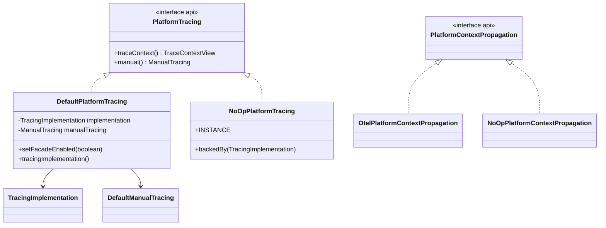
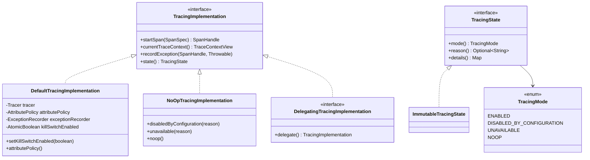
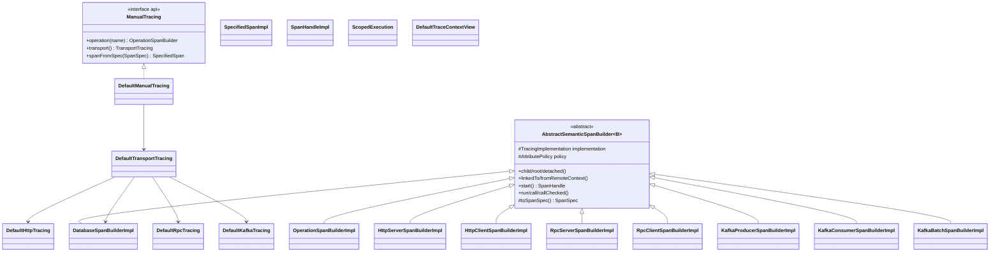
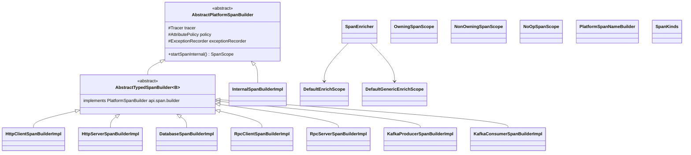
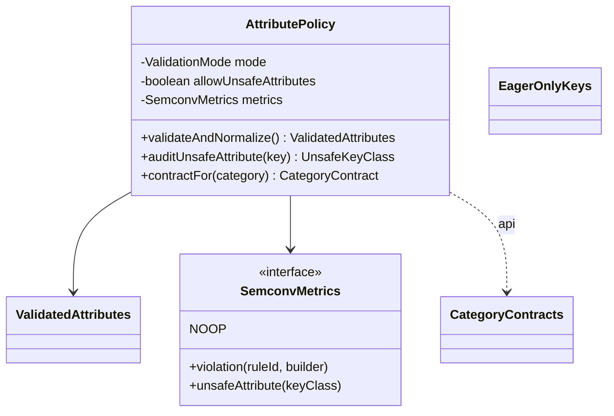
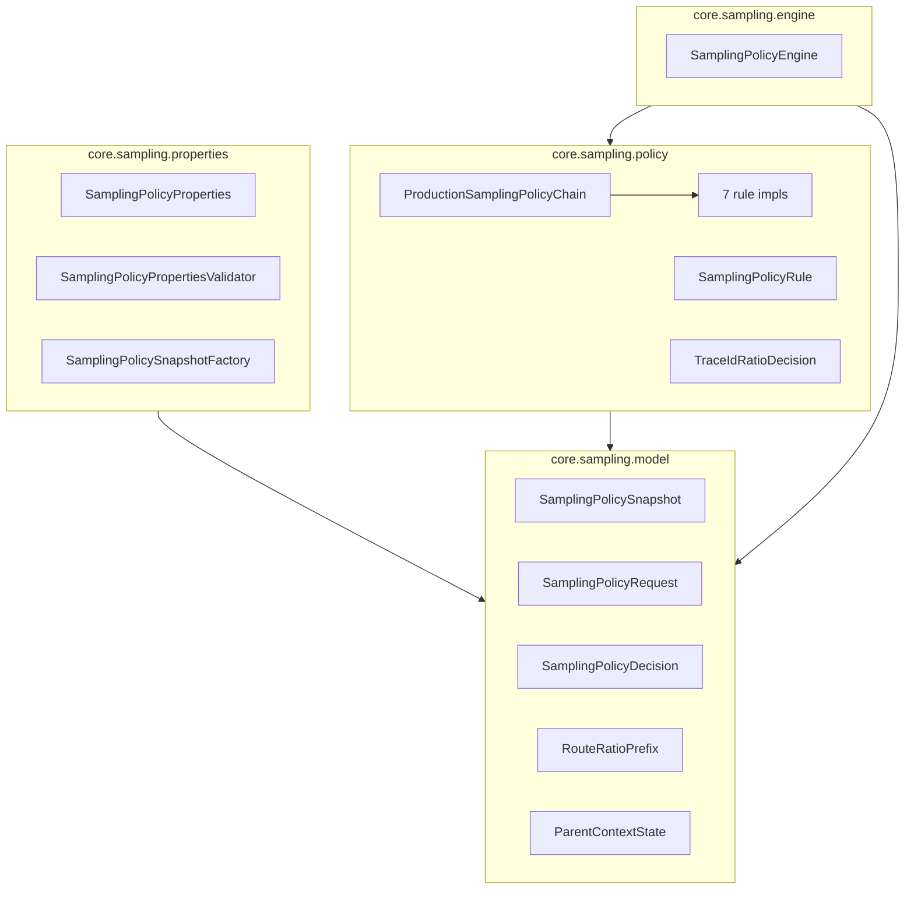

# platform-tracing-core — архитектурный инвентарь

> **HISTORICAL — до рефакторинга Fable_5 v1.2 (snapshot pre-PR-5).**  
> Этот документ описывает архитектуру `platform-tracing-core` **до** рефакторинга Fable_5 v1.2.
> Упоминания `core.impl`, `TracingImplementation`, `api.span.builder.*` и `core.span.legacy`
> отражают **удалённое** состояние и **не** описывают текущую реализацию.  
> Актуальная post-refactor архитектура определяется:
> - [ADR-legacy-span-builder-stack-removal.md](../decisions/ADR-legacy-span-builder-stack-removal.md) — финальное решение Fable_5 v1.2;
> - [platform-tracing-core-extraction-readiness.md](../architecture/platform-tracing-core-extraction-readiness.md) — post-refactor boundary inventory;
> - [anti-double-instrumentation.md](../tracing/anti-double-instrumentation.md) §2 — v3 marker-based enrichment model.  
> Post-refactor verification audit (2026-07-08): **PASS WITH WARNINGS** — код core корректен, doc drift устраняется отдельно.

Документ описывает модуль `platform-tracing-core` **без тестов** — иерархию классов, назначение, runtime-потоки и смежный код. Предназначен как база для серьёзного архитектурного рефакторинга.

**Состояние:** pre-production (обратная совместимость не требуется).  
**Объём main sources:** 84 Java-класса в 11 пакетах верхнего уровня.  
**Связанные ADR/документы:** `docs/decisions/ADR-sampling-package-layering.md`, `docs/architecture/platform-tracing-core-extraction-readiness.md`, `docs/architecture/platform-tracing-module-taxonomy.md`.

---

## 1. Роль модуля в платформе

`platform-tracing-core` — **реализация публичного API** (`platform-tracing-api`) поверх OpenTelemetry API. Модуль не содержит Spring, JMX, Micrometer и OTel SDK — только OTel API + SLF4J.

### Что модуль делает

| Область | Где в core | Комментарий |
|---------|------------|-------------|
| Публичный фасад v3 | `DefaultPlatformTracing`, `NoOpPlatformTracing` | Реализует `PlatformTracing`: `traceContext()` + `manual()` |
| Ручная трассировка (v3) | `core.manual`, `core.impl` | Builder'ы → `SpanSpec` → `TracingImplementation.startSpan()` |
| Legacy OTel-direct builders | `core.span` | Прямой `Tracer.spanBuilder()`; API `api.span.builder.*` — **не подключён к `PlatformTracing`** |
| Semconv-валидация (creation-time) | `core.semconv` | `AttributePolicy` — до `startSpan()`, sampler видит нормализованные атрибуты |
| Agent-first enrichment | `core.span.SpanEnricher` | Обогащение уже активного span'а (созданного Agent'ом) |
| Чистая политика sampling | `core.sampling.*` | Без OTel/Spring/JMX; исполняется в agent extension |
| Снимок политики validation | `core.validation.*` | Только immutable snapshot/update; runtime — в otel-extension |
| Запись исключений | `core.exception` | Безопасная запись в OTel span |
| Propagation helpers | `OtelPlatformContextPropagation` | Обёртки над OTel Context API |

### Что модуль **не** делает

- Scrubbing (маскирование PII) — `platform-tracing-otel-extension` (`scrubbing.*`)
- Runtime validation на export — `ValidatingSpanProcessor` в otel-extension
- JMX / control plane — `PlatformTracingControl`, `PlatformScrubbingControl` в otel-extension
- Spring wiring, Actuator, metrics — `platform-tracing-spring-boot-autoconfigure`
- Micrometer Observation conventions — autoconfigure-модули webmvc/webflux

---

## 2. Gradle и границы модулей

### Зависимости (`platform-tracing-core/build.gradle`)

| Конфигурация | Зависимость | Назначение |
|--------------|-------------|------------|
| `api` | `platform-tracing-api` | Контракты, реэкспорт транзитивно |
| `api` | `opentelemetry-api` | Span/Context/Attributes (**MIGRATION_RISK**, задокументировано) |
| `implementation` | `slf4j-api` | Логирование в `AttributePolicy`, builders |
| compileOnly | `lombok` | `@Getter`, `@UtilityClass` в sampling |

### Кто зависит от core

| Модуль | Тип зависимости | Что использует |
|--------|-----------------|----------------|
| `platform-tracing-spring-boot-autoconfigure` | `api` | Фасад, `TracingImplementation`, semconv, exception |
| `platform-tracing-otel-extension` | `implementation` | Sampling engine/model, validation snapshot; упаковывается в agent JAR |
| `platform-tracing-test` | `api` | Test harness + ArchUnit rules |
| `platform-tracing-bench` | `jmh` | Micro-benchmarks |
| `platform-tracing-e2e-tests` | `testImplementation` | E2E цепочка |

### Архитектурные guardrails (ArchUnit)

Правила в `platform-tracing-test/.../ModuleTaxonomyArchRules.java`, применяются через `CorePolicyPackagePurityArchTest` и `TracingImplementationArchTest`:

- `core.sampling.*`, `core.validation.*` — **без** OTel, Spring, JMX
- `core.main` — **без** JMX
- `core.manual.*` — **без** прямого OTel trace API (только через `TracingImplementation`)
- `TracingImplementation` — полностью абстрактный SPI, без default methods

---

## 3. Обзор пакетов

```
space.br1440.platform.tracing.core
├── (root)              — фасад PlatformTracing, propagation
├── impl                — внутренний SPI создания span'ов
├── manual              — v3 manual tracing (builders → SpanSpec)
├── span                — legacy OTel-direct builders + enrichment + scopes
├── semconv             — creation-time semconv validation
├── sampling
│   ├── model           — чистое состояние решений
│   ├── policy          — правила chain-of-responsibility
│   ├── engine          — исполнитель цепочки
│   └── properties      — compile-time нормализация конфигурации
├── validation          — immutable runtime snapshot validation policy
├── exception           — безопасная запись ошибок
└── utils               — JDK-only утилиты для policy-пакетов
```

---

## 4. Иерархии классов

### 4.1. Публичный фасад и propagation



| Класс | Видимость | Назначение |
|-------|-----------|------------|
| `DefaultPlatformTracing` | `public` | Основная реализация `PlatformTracing`. Делегирует в `TracingImplementation` + создаёт `DefaultManualTracing`. Конструкторы: от `TracingImplementation`, от `OpenTelemetry` (+ `AttributePolicy`, `ExceptionRecorder`). Извлекает `AttributePolicy` из `DefaultTracingImplementation` через unwrap делегатов. |
| `NoOpPlatformTracing` | `public` | Singleton `INSTANCE` и factory `backedBy()`. Manual tracing работает, но span'ы — no-op. |
| `OtelPlatformContextPropagation` | `public` | `wrap(Runnable/ThrowingSupplier)`, `contextAware(Executor/ExecutorService)` через OTel Context. |
| `NoOpPlatformContextPropagation` | `public` | Identity-обёртки без переноса контекста. |

**Смежный код:** `TracingCoreAutoConfiguration` создаёт beans `PlatformTracing`, `TracingImplementation`, `PlatformContextPropagation`. `MeteredTracingImplementation` (autoconfigure) оборачивает default impl метриками.

---

### 4.2. Внутренний SPI: `core.impl`



| Класс | Назначение |
|-------|------------|
| `TracingImplementation` | **Единственная точка создания span'ов** для v3 manual path. Не application-facing; ArchUnit запрещает default methods и abstract skeletons. |
| `DefaultTracingImplementation` | OTel-backed реализация. `startSpan(SpanSpec)`: валидация topology/links → kill-switch → `tracer.spanBuilder()` → `OwningSpanScope` → `SpanHandleImpl`. Применяет атрибуты из `SpanSpec` post-start. `INSTRUMENTATION_NAME = "space.br1440.platform.tracing"`. |
| `NoOpTracingImplementation` | Возвращает `NoOpSpanHandle`, пустой trace context. Три factory-метода с разными `TracingMode`. |
| `DelegatingTracingImplementation` | Marker для декораторов (`MeteredTracingImplementation` в autoconfigure). |
| `TracingState` / `ImmutableTracingState` / `TracingMode` | Supportability state для diagnostics/Actuator. Kill-switch → `DISABLED_BY_CONFIGURATION`. |
| `SemanticSpanSpecs` | `public static build(...)`: валидация semconv через `AttributePolicy`, построение имени через `PlatformSpanNameBuilder`, сборка `SpanSpec`. |
| `OperationSpanSpecs` | `public static from(...)`: governed `SpanSpec` для `manual().operation()` без semconv-атрибутов. |
| `SpanAttributeValueConverter` | `package-private`: конвертация `Map<String, SpanAttributeValue>` ↔ OTel `Attributes`. Guard на mixed-type lists. |

**Поток `DefaultTracingImplementation.startSpan()`:**

1. `SpanOptions.validateTopologyLinks(topology, links)`
2. Kill-switch → `NoOpSpanHandle`
3. `SpanBuilder` с kind (`SpanKinds`), `platform.trace.type`, parent context (ROOT/DETACHED → `Context.root()`), links
4. `builder.startSpan()` → `OwningSpanScope` + apply attributes
5. Return `SpanHandleImpl.wrap(scope)`

---

### 4.3. V3 manual tracing: `core.manual`



#### Базовый builder

| Класс | Назначение |
|-------|------------|
| `AbstractSemanticSpanBuilder<B>` | Базовый v3 builder. Накапливает атрибуты (`Map<String, SpanAttributeValue>`), topology (first-wins policy), links. `toSpanSpec()`: INTERNAL → `OperationSpanSpecs`, иначе → `SemanticSpanSpecs.build()`. Terminal methods делегируют в `ScopedExecution`. **Не использует OTel API напрямую.** |
| `ScopedExecution` | `run`/`call`/`callChecked`: try-with-resources на `SpanHandle`, auto `recordException` на RuntimeException/Exception. |
| `SpanHandleImpl` | `SpanHandle` с exactly-once exception recording per `Throwable` instance (IdentityHashMap). |
| `NoOpSpanHandle` | Singleton no-op handle. |
| `SpecifiedSpanImpl` | `SpecifiedSpan` из готового `SpanSpec` — bypass builder, прямой `implementation.startSpan(spec)`. |
| `DefaultTraceContextView` | Читает traceId/spanId через supplier'ы (OTel `Span.current()` в default impl). `correlationId()` всегда empty. |
| `NoOpTraceContextView` | Пустые Optional. |
| `NoOpManualTracing` | Manual API с no-op handles. |
| `StubTransportTracing` | Stub для disabled transport paths. |

#### Transport builders (вложенные классы в файлах)

| Файл | Классы | Категория / особенности |
|------|--------|-------------------------|
| `OperationSpanBuilderImpl.java` | `OperationSpanBuilderImpl` | `SpanCategory.INTERNAL`, имя из конструктора |
| `DefaultHttpTracing.java` | `DefaultHttpTracing`, `HttpServerSpanBuilderImpl`, `HttpClientSpanBuilderImpl` | HTTP server/client semconv keys; client URL через `UrlSanitizer` |
| `DatabaseSpanBuilderImpl.java` | `DatabaseSpanBuilderImpl` (implements `DatabaseTracing`) | Required: operation, collection, system (db.system.name или legacy) |
| `DefaultRpcTracing.java` | `DefaultRpcTracing`, `AbstractRpcSpanBuilder`, `RpcServerSpanBuilderImpl`, `RpcClientSpanBuilderImpl` | Required: rpc.system, rpc.service, rpc.method |
| `DefaultKafkaTracing.java` | `DefaultKafkaTracing`, `AbstractKafkaSpanBuilder`, producer/consumer/batch impls | Auto `messaging.system=kafka`; batch → category KAFKA_CONSUMER, operation=process |
| `DefaultTransportTracing.java` | `public` entry point | `http()`, `database()`, `rpc()`, `kafka()` |

**Важно:** имена `HttpClientSpanBuilderImpl` и аналоги **дублируются** с legacy-классами в `core.span` — разные API (`api.manual.*` vs `api.span.builder.*`).

---

### 4.4. Legacy span stack: `core.span`



| Класс | Назначение |
|-------|------------|
| `AbstractPlatformSpanBuilder` | Legacy базовый builder **напрямую через `Tracer`**. Порядок: validateAndNormalize → имя → SpanBuilder.setAllAttributes → startSpan → lazy/unsafe post-start. Anti-double guard (модель B): re-entry той же категории → `NonOwningSpanScope.enrich()`. |
| `AbstractTypedSpanBuilder<B>` | Fluent-обёртка legacy `api.span.builder.PlatformSpanBuilder`. |
| `InternalSpanBuilderImpl` | `api.span.builder.InternalSpanBuilder` — категория INTERNAL, lazy attrs, forceNewSpan. |
| `*SpanBuilderImpl` (8 классов) | Типизированные legacy builders для HTTP/DB/RPC/Kafka. Реализуют `api.span.builder.*`. |
| `PlatformSpanNameBuilder` | Low-cardinality имена span'ов по категории (HTTP: `{method} {route}`, DB: `{op} {collection}`, etc.). Используется и v3 (`SemanticSpanSpecs`), и legacy. |
| `SpanKinds` | `SpanCategory` → OTel `SpanKind`. Shared v3 + legacy. |
| `PlatformSpanContextKeys` | `ContextKey<SpanCategory>` — маркер platform span для anti-double и marker-based enrich. |
| `OwningSpanScope` | `SpanScope` с ownership: close → end span + close scope. Используется v3 (`DefaultTracingImplementation`) и legacy. |
| `NonOwningSpanScope` | Enrich-only scope при re-entry; **не** завершает чужой span. |
| `NoOpSpanScope` | No-op scope. |
| `SpanEnricher` | Agent-first enrichment активного span'а. `enrichCurrentSpan(GenericEnrichScope)` — platform-safe keys only. `enrichCurrentSpanIfPlatformCategory` — typed keys через allowlist `CategoryContract`. No-op если !isRecording(). |
| `DefaultGenericEnrichScope` | Hardcoded platform-safe keys: requestId, userHash, result, businessTag. |
| `DefaultEnrichScope` | Category-specific enrich через allowlist; unknown keys → WARN once. |

**Статус legacy stack:** `PlatformTracing` (v3) **не экспонирует** `api.span.builder.*`. Legacy builders остаются в core как dead code для приложений, но используются внутри `SpanEnricher` tests и потенциально прямым инстанцированием (не через public API).

---

### 4.5. Semconv validation: `core.semconv`



| Класс | Назначение |
|-------|------------|
| `AttributePolicy` | Движок creation-time semconv validation. Режимы: STRICT (throw), WARN (safe-defaults + log once + metrics), DISABLED (passthrough). Проверки: allowlist, forbidden, required, requiredAnyOf. `auditUnsafeAttribute` — escape-hatch с классификацией known/unknown/rejected и sanitized log. |
| `ValidatedAttributes` | Immutable snapshot: normalized `Attributes` + список violations. |
| `SemconvMetrics` | Абстракция метрик (без Micrometer в core). Реализация: `MicrometerSemconvMetrics` в autoconfigure. |
| `EagerOnlyKeys` | Registry ключей, запрещающих lazy-setter (sampling-relevant + name-building keys). |

**Отличие от runtime validation:** `core.validation.ValidationSnapshot` управляет **post-creation** проверкой required attrs в `ValidatingSpanProcessor` (otel-extension). `AttributePolicy` — **до** создания span'а.

---

### 4.6. Sampling policy: `core.sampling`

#### Слои (ADR-sampling-package-layering)



#### Model layer

| Класс | Назначение |
|-------|------------|
| `SamplingPolicySnapshot` | Immutable runtime snapshot: enabled, droppedRoutes, forceRecordValues, routeRatios (sorted longest-prefix-first), defaultRatio. Нормализация в конструкторе. |
| `SamplingPolicyRequest` | Input для правила: urlPath, traceId, forceTraceHeaderValue, qaTrace, parentContextState. |
| `SamplingPolicyDecision` | DROP / RECORD_AND_SAMPLE / ABSTAIN + reason + winningRule. Factory methods с invariant checks. |
| `SamplingPolicyDecisionType` | Enum: DROP, RECORD_AND_SAMPLE, ABSTAIN. |
| `SamplingPolicyReason` | Enum причин (KILL_SWITCH, HARD_DROP, ROUTE_RATIO, etc.). |
| `RouteRatioPrefix` | Record (prefix, ratio). |
| `ParentContextState` | SAMPLED / NOT_SAMPLED / ABSENT. |

#### Properties layer (compile-time config)

| Класс | Назначение |
|-------|------------|
| `SamplingPolicyProperties` | Raw config record: enabled, defaultRatio, droppedRoutes, forceRecordValues, routeRatios. |
| `SamplingPolicyPropertiesValidator` | Fail-fast domain validation (ratio bounds, blank prefixes, max counts). |
| `SamplingPolicySnapshotFactory` | **Единственная** точка LENIENT компиляции config → snapshot (silent-skip invalid route entries). |

#### Policy layer — цепочка правил

`ProductionSamplingPolicyChain.productionRules()` — **фиксированный порядок**:

| # | Класс | Поведение |
|---|-------|-----------|
| 1 | `KillSwitchPolicyRule` | `!snapshot.enabled` → DROP |
| 2 | `HardDropPolicyRule` | urlPath starts with dropped prefix → DROP |
| 3 | `ForceHeaderPolicyRule` | force header value in snapshot.forceRecordValues → SAMPLE |
| 4 | `QaTracePolicyRule` | qaTrace flag → SAMPLE |
| 5 | `ParentSampledPolicyRule` | parent SAMPLED → SAMPLE; NOT_SAMPLED → DROP; ABSENT → abstain |
| 6 | `RouteRatioPolicyRule` | longest matching prefix → traceId ratio decision |
| 7 | `DefaultRatioPolicyRule` | defaultRatio traceId ratio decision |

Вспомогательные: `SamplingPolicyRule` (public interface), `SamplingPolicyRuleNames`, `TraceIdRatioDecision` (deterministic traceId hashing).

`foundationRules()` — только kill_switch + hard_drop (для foundation engine, package-private).

#### Engine layer

| Класс | Назначение |
|-------|------------|
| `SamplingPolicyEngine` | Chain executor: first non-null decision wins; else `abstain()`. `productionEngine()` — public entry. Constructor/foundationEngine — package-private. |

---

### 4.7. Validation policy: `core.validation`

| Класс | Назначение |
|-------|------------|
| `ValidationSnapshot` | Immutable record: enabled, strict, version, updatedAt, source. Implements `VersionedState` (api). Modes: bypass / lenient annotate / strict throw. |
| `ValidationPolicyUpdate` | Side-effect-free builder next snapshot: increment version, normalize source (blank → "JMX"). |

Runtime holders/processors — **не в core**: `ValidationPolicyHolder`, `ValidatingSpanProcessor` в otel-extension.

---

### 4.8. Exception handling: `core.exception`

| Класс | Назначение |
|-------|------------|
| `ExceptionRecorder` | Запись exception в OTel span: error.type, platform.result=failure, status ERROR, exception event. Uses `ExceptionMessagePolicy`. `secureDefault()` — no message/stack. |
| `ExceptionMessagePolicy` | Configurable include message (max 512) / stack trace. `secureDefault()` — оба false. |

**Смежный код:** `TracedAspect`, `TracingAopAutoConfiguration`, `SemanticLayerAutoConfiguration` инжектят `ExceptionRecorder`. `OwningSpanScope.recordException` делегирует в recorder.

---

### 4.9. Utils: `core.utils`

JDK-only утилиты для policy-пакетов (без внешних зависимостей):

| Класс | Методы |
|-------|--------|
| `ArrayUtils` | `isNullOrEmpty` |
| `StringUtils` | `isNullOrEmpty`, `isNullOrBlank`, `isNotEmpty` |
| `ListUtils` | `isNullOrEmpty` |
| `SetUtils` | `isNullOrEmpty` |
| `MapUtils` | `isNullOrEmpty` |

---

## 5. Runtime-потоки

### 5.1. V3 manual span lifecycle (целевой путь)

```
Application
  └─ PlatformTracing.manual()
       └─ DefaultManualTracing
            ├─ operation("x") → OperationSpanBuilderImpl
            └─ transport().http().client() → HttpClientSpanBuilderImpl
                 └─ AbstractSemanticSpanBuilder.start()
                      └─ SemanticSpanSpecs.build() / OperationSpanSpecs.from()
                           └─ AttributePolicy.validateAndNormalize()  [creation-time semconv]
                           └─ PlatformSpanNameBuilder.forCategory()
                      └─ TracingImplementation.startSpan(SpanSpec)
                           └─ DefaultTracingImplementation
                                └─ tracer.spanBuilder().startSpan()
                                └─ OwningSpanScope + SpanHandleImpl
```

### 5.2. Legacy span lifecycle (устаревший путь)

```
Direct construction (не через PlatformTracing)
  └─ HttpClientSpanBuilderImpl(tracer, policy, recorder)  [api.span.builder]
       └─ AbstractPlatformSpanBuilder.startSpanInternal()
            └─ anti-double guard → NonOwningSpanScope OR new span
            └─ AttributePolicy.validateAndNormalize()
            └─ tracer.spanBuilder().setAllAttributes().startSpan()
            └─ lazy/unsafe attrs post-start if isRecording()
            └─ OwningSpanScope
```

### 5.3. Agent-first enrichment

```
Span created by OTel Java Agent (no platform marker)
  └─ SpanEnricher.enrichCurrentSpan(fn)
       └─ DefaultGenericEnrichScope → span.setAttribute(platform-safe keys)

Span created by platform builder (has PLATFORM_SPAN_CATEGORY marker)
  └─ SpanEnricher.enrichCurrentSpanIfPlatformCategory(HTTP_SERVER, fn)
       └─ DefaultEnrichScope → allowlist-only typed attributes
```

### 5.4. Sampling (agent-side)

```
OTel SDK shouldSample()
  └─ CompositeSampler (otel-extension)
       └─ SamplingPolicyOtelAdapter.toRequest()
       └─ SamplingPolicyEngine.productionEngine().evaluate(request, snapshot)
            └─ ProductionSamplingPolicyChain rules [ordered]
       └─ SamplingPolicyOtelAdapter.toSamplingResult()
```

Snapshot обновляется через `SamplerState` / JMX / Spring `RuntimeConfigApplier` → `SamplingPolicySnapshotFactory.create()`.

### 5.5. Runtime validation (agent-side, не core)

```
Span export/onEnding
  └─ ValidatingSpanProcessor (otel-extension)
       └─ reads ValidationSnapshot from ValidationPolicyHolder
       └─ strict/lenient/bypass modes
```

---

## 6. Смежный код по модулям

### 6.1. `platform-tracing-api`

| API пакет | Связь с core |
|-----------|--------------|
| `api.PlatformTracing` | Реализуется `DefaultPlatformTracing` |
| `api.manual.*` | Builder interfaces → `core.manual` impls |
| `api.span.spec.*` | `SpanSpec`, `SpanHandle`, `Topology` — consumed by `TracingImplementation` |
| `api.span.builder.*` | **Legacy** — impls в `core.span`, не wired в v3 facade |
| `api.span.enrich.*` | `SpanEnricher` + enrich scopes |
| `api.semconv.*` | `CategoryContracts`, `SemconvKeys`, `ValidationMode` → `AttributePolicy` |
| `api.propagation.*` | `OtelPlatformContextPropagation` |
| `api.runtime.state.VersionedState` | `ValidationSnapshot` |

### 6.2. `platform-tracing-spring-boot-autoconfigure`

| Класс | Использует из core |
|-------|-------------------|
| `TracingCoreAutoConfiguration` | `DefaultPlatformTracing`, `DefaultTracingImplementation`, `NoOpTracingImplementation`, propagation |
| `SemanticLayerAutoConfiguration` | `AttributePolicy`, `SemconvMetrics`, `SpanEnricher`, `ExceptionRecorder`, `ExceptionMessagePolicy` |
| `MeteredTracingImplementation` | `DelegatingTracingImplementation`, `TracingState` |
| `MicrometerSemconvMetrics` | implements `SemconvMetrics` |
| `TracingDiagnosticsMapper` | `TracingMode`, `TracingState` |
| `ManualTracingDiagnostics` | `TracingImplementation` |
| `TracedAspect` | `ExceptionRecorder` |
| `TracingHealthIndicator` | `NoOpPlatformTracing` |

### 6.3. `platform-tracing-otel-extension`

| Класс | Использует из core |
|-------|-------------------|
| `CompositeSampler` | `SamplingPolicyEngine`, model classes |
| `SamplingPolicyOtelAdapter` | model → OTel `SamplingResult` |
| `SamplerState` | `SamplingPolicySnapshotFactory`, `SamplingPolicyProperties` |
| `SamplerPolicyUpdate` | `SamplingPolicyPropertiesValidator` |
| `ValidationPolicyHolder` | `ValidationSnapshot`, `ValidationPolicyUpdate` |
| `ValidatingSpanProcessor` | `ValidationSnapshot` |

Scrubbing (`scrubbing.*`), JMX MBeans (`jmx.*`) — **не используют core** (кроме shared ArchUnit `VersionedState` rules).

### 6.4. Starters и web autoconfigure

Starters (`platform-tracing-spring-boot-starter-servlet/reactive`) транзитивно тянут autoconfigure → core. Web-specific observation conventions — в `autoconfigure-webmvc/webflux`, не в core.

---

## 7. Архитектурные напряжения (для рефакторинга)

### 7.1. Два параллельных стека создания span'ов

| Аспект | V3 (`core.manual` + `core.impl`) | Legacy (`core.span`) |
|--------|----------------------------------|----------------------|
| API | `api.manual.*` | `api.span.builder.*` |
| OTel coupling | Через `TracingImplementation` | Прямой `Tracer` |
| Entry | `PlatformTracing.manual()` | Нет public entry |
| Validation timing | Pre-`SpanSpec` in `SemanticSpanSpecs` | Pre-`startSpan()` in builder |
| Anti-double | Нет (topology explicit) | Context marker + re-entry enrich |
| Lazy/unsafe attrs | Нет | Да |

**Рекомендация для рефакторинга:** удалить legacy stack + `api.span.builder.*`; перенести `SpanEnricher`, `PlatformSpanNameBuilder`, `SpanKinds`, scopes в v3-структуру.

### 7.2. OTel API на main classpath core

Задокументировано как `MIGRATION_RISK`. Затронутые классы: `DefaultTracingImplementation`, `AbstractPlatformSpanBuilder`, `SpanEnricher`, `ExceptionRecorder`, `OtelPlatformContextPropagation`, scopes.

Pure policy packages (`sampling`, `validation`) уже OTel-free. Semconv (`AttributePolicy`) использует OTel `AttributeKey`/`Attributes`.

### 7.3. Дублирование имён builder'ов

`HttpClientSpanBuilderImpl` и аналоги существуют в `core.manual.*` и `core.span` с разными API-контрактами — источник путаницы при рефакторинге.

### 7.4. Enrichment не выделен в отдельный пакет

`SpanEnricher` живёт в `core.span` рядом с legacy builders. ArchUnit guard `core.enrichment.*` зарезервирован, но пакет не создан.

### 7.5. Scrubbing deferred

Per `platform-tracing-core-extraction-readiness.md` PR-9D: `core.scrubbing` move deferred из-за coupling с `RuleExecutionWrapper` в agent.

### 7.6. Semconv vs validation — два слоя

| Concern | Package | When | Where executed |
|---------|---------|------|----------------|
| Semconv contract (allowlist, required) | `core.semconv` | Creation-time | App classpath (core) |
| Required attrs at export | `core.validation` snapshot | On-ending | Agent (otel-extension) |

---

## 8. Полный реестр классов (main)

### `space.br1440.platform.tracing.core` (root, 4 класса)

| Класс | Тип |
|-------|-----|
| `DefaultPlatformTracing` | Facade impl |
| `NoOpPlatformTracing` | Facade noop |
| `OtelPlatformContextPropagation` | Propagation impl |
| `NoOpPlatformContextPropagation` | Propagation noop |

### `core.impl` (10 классов)

| Класс | Тип |
|-------|-----|
| `TracingImplementation` | Interface SPI |
| `DefaultTracingImplementation` | OTel impl |
| `NoOpTracingImplementation` | Noop impl |
| `DelegatingTracingImplementation` | Decorator marker |
| `TracingState` | Interface |
| `ImmutableTracingState` | Record-like impl |
| `TracingMode` | Enum |
| `SemanticSpanSpecs` | Utility |
| `OperationSpanSpecs` | Utility |
| `SpanAttributeValueConverter` | Package-private utility |

### `core.manual` (16 классов)

| Класс | Файл |
|-------|------|
| `DefaultManualTracing` | own file |
| `AbstractSemanticSpanBuilder` | own file |
| `OperationSpanBuilderImpl` | own file |
| `DefaultTransportTracing` | own file |
| `DefaultHttpTracing`, `HttpServerSpanBuilderImpl`, `HttpClientSpanBuilderImpl` | `DefaultHttpTracing.java` |
| `DatabaseSpanBuilderImpl` | own file (implements `DatabaseTracing`) |
| `DefaultRpcTracing`, `AbstractRpcSpanBuilder`, `RpcServerSpanBuilderImpl`, `RpcClientSpanBuilderImpl` | `DefaultRpcTracing.java` |
| `DefaultKafkaTracing`, `AbstractKafkaSpanBuilder`, `KafkaProducerSpanBuilderImpl`, `KafkaConsumerSpanBuilderImpl`, `KafkaBatchSpanBuilderImpl` | `DefaultKafkaTracing.java` |
| `SpanHandleImpl`, `NoOpSpanHandle` | `SpanHandleImpl.java`, `NoOpSpanHandle.java` |
| `ScopedExecution` | own file |
| `SpecifiedSpanImpl` | own file |
| `DefaultTraceContextView`, `NoOpTraceContextView` | separate files |
| `NoOpManualTracing`, `StubTransportTracing` | separate files |

### `core.span` (19 классов)

| Класс | Назначение |
|-------|------------|
| `AbstractPlatformSpanBuilder` | Legacy base |
| `AbstractTypedSpanBuilder` | Legacy fluent base |
| `InternalSpanBuilderImpl` | Legacy internal |
| `HttpClientSpanBuilderImpl`, `HttpServerSpanBuilderImpl` | Legacy HTTP |
| `DatabaseSpanBuilderImpl` | Legacy DB |
| `RpcClientSpanBuilderImpl`, `RpcServerSpanBuilderImpl` | Legacy RPC |
| `KafkaProducerSpanBuilderImpl`, `KafkaConsumerSpanBuilderImpl` | Legacy Kafka |
| `SpanEnricher` | Agent-first enrich |
| `DefaultEnrichScope`, `DefaultGenericEnrichScope` | Enrich scope impls |
| `OwningSpanScope`, `NonOwningSpanScope`, `NoOpSpanScope` | Span lifecycle |
| `PlatformSpanNameBuilder` | Span naming |
| `SpanKinds` | Category → SpanKind |
| `PlatformSpanContextKeys` | Context markers |

### `core.semconv` (4 класса)

`AttributePolicy`, `ValidatedAttributes`, `SemconvMetrics`, `EagerOnlyKeys`

### `core.sampling` (22 класса)

**model (7):** `SamplingPolicySnapshot`, `SamplingPolicyRequest`, `SamplingPolicyDecision`, `SamplingPolicyDecisionType`, `SamplingPolicyReason`, `RouteRatioPrefix`, `ParentContextState`

**properties (3):** `SamplingPolicyProperties`, `SamplingPolicyPropertiesValidator`, `SamplingPolicySnapshotFactory`

**policy (11):** `SamplingPolicyRule`, `ProductionSamplingPolicyChain`, `SamplingPolicyRuleNames`, `TraceIdRatioDecision`, + 7 rule impls

**engine (1):** `SamplingPolicyEngine`

### `core.validation` (2 класса)

`ValidationSnapshot`, `ValidationPolicyUpdate`

### `core.exception` (2 класса)

`ExceptionRecorder`, `ExceptionMessagePolicy`

### `core.utils` (5 классов)

`ArrayUtils`, `StringUtils`, `ListUtils`, `SetUtils`, `MapUtils`

---

## 9. Связанная документация

| Документ | Содержание |
|----------|------------|
| `docs/decisions/ADR-sampling-package-layering.md` | Слои sampling, порядок правил, visibility |
| `docs/decisions/ADR-runtime-sampling-policy.md` | Runtime sampling policy semantics |
| `docs/architecture/platform-tracing-core-extraction-readiness.md` | PR-9B/C/D extraction status, boundary inventory |
| `docs/architecture/platform-tracing-module-taxonomy.md` | Module dependency taxonomy |
| `docs/architecture/ADR-jmx-wire-map-contract.md` | JMX/control plane boundary (agent-side) |
| `docs/tracing/platform-tracing-v3-public-api.md` | V3 public API contract |
| `docs/decisions/ADR-platform-tracing-span-spec-governance.md` | SpanSpec governance |

---

## 10. Кандидаты рефакторинга (кратко)

1. **Удалить legacy `core.span` builders** + `api.span.builder.*` — оставить shared utilities (`PlatformSpanNameBuilder`, `SpanKinds`, scopes, enricher) в новой структуре.
2. **OTel port за `TracingImplementation`** — убрать `api opentelemetry-api` из core main (long-term).
3. **Выделить `core.enrichment`** из `core.span` — соответствие ArchUnit guard.
4. **Переименовать v3 builder impls** — убрать коллизии имён с legacy.
5. **Перенести `AttributePolicy` в `core.validation` или `core.semconv.policy`** — явное разделение creation-time vs export-time validation.
6. **Убрать `testImplementation autoconfigure`** из `build.gradle` core — если не используется.

---

*Сгенерировано для архитектурного рефакторинга. Исключены тестовые классы и test-only utilities (`RecordingTracingImplementation` и др.).*
