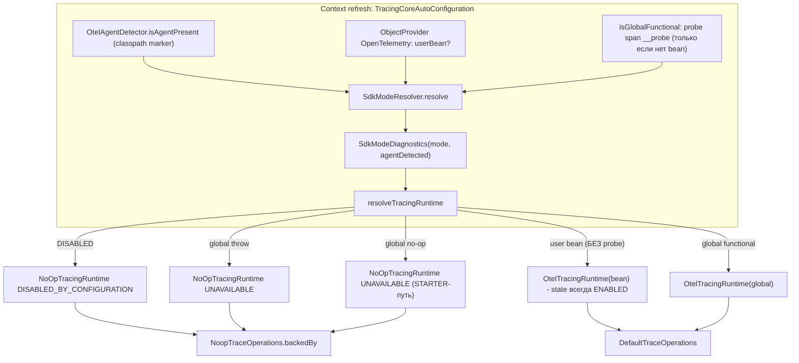
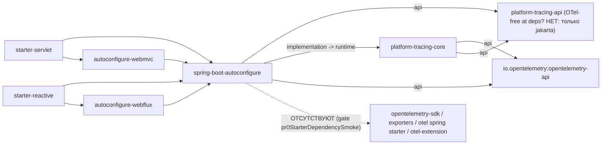
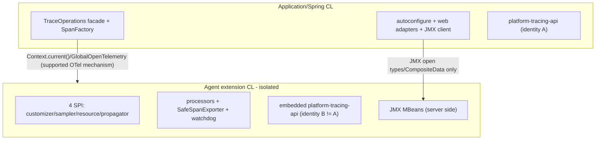

# Slice E: Spring-without-Agent — Repository-Grounded Forensic Audit

> Дата: 2026-07-20
> Ветка: `feature/runtime-control-hardening` (current HEAD)
> Аудитор: principal Java platform architect (repository-grounded, forensic)
> Статус: `EVIDENCE FINAL / DECISION INPUT`
> Входы: HEAD; `docs/analysis/platform-tracing-slice-e-spring-sdk-decision-packet.md`;
> authoritative plan `platform-tracing_refactor_7a676baf.plan.md`;
> `ADR-otel-direct-integration.md`; `ADR-sdk-mode-detection.md`;
> Perplexity reports 01–06 (`Platform_Traces_Archive\...\Slice_E\Analyzis\Perplexity`).
> Правило приоритета: **repository wins** для текущих фактов реализации; primary
> specifications (OpenTelemetry) — для внешних фактов. Ни один код/тест/ADR/план не изменён.

---

## A. Executive verdict

1. **Decision packet подтверждён по существу.** Все 7 evidence-строк packet'а подтверждены
   точными цитатами HEAD (см. §D). Центральное «Следствие» packet'а — модель одновременно
   декларирует «NoOp только для `DISABLED`» и фактически возвращает NoOp для `STARTER` —
   **CONFIRMED**: декларация в `SdkMode` javadoc (строки 17–18) и `TracingProperties.Sdk`
   javadoc (строки 72–73) противоречит runtime-пути
   `STARTER → NoOpTracingRuntime.unavailable(...) → NoopTraceOperations`
   (`TracingCoreAutoConfiguration` 116–127, 134–139).
2. **`ADR-sdk-mode-detection` частично STALE относительно HEAD**: таблица режимов ADR
   относит «функциональный `GlobalOpenTelemetry`» к `AGENT`; HEAD-резолвер относит его к
   `EXTERNAL` (`SdkModeResolver.resolveAutomatically` 49–57; `SdkMode` javadoc 14–15).
   Кроме того, ADR не упоминает три fail-fast mismatch-правила, реально присутствующие в
   резолвере (34–38, 59–92).
3. **B0 (starter-owned SDK; packet Option A) НЕ реализуем без второго runtime-plane и без
   деградации возможностей.** В app-plane нет ни одной точки конструирования SDK
   (`SdkTracerProvider` / `ContextPropagators` / `W3CTraceContextPropagator` /
   `GlobalOpenTelemetry.set` — 0 совпадений в `src/main` autoconfigure), а весь
   платформенный pipeline (sampler, 8+ processors, SafeSpanExporter, ResourceProvider,
   inbound control propagator, JMX MBean server) существует **только** в
   `platform-tracing-otel-extension` за agent SPI. B0 = сознательное создание второго
   runtime + перенос/дублирование pipeline. Это отдельный capability, как и утверждает packet.
4. **B1 (strict agent-required, без `EXTERNAL`) реализуем без второго runtime**, но требует
   намеренного API-delta: удаление рабочего, покрытого тестами `EXTERNAL`
   (`SdkModeDetectionAutoConfigurationTest.agent_mode_provides_facade_not_noop`) и supersede
   ADR. Capability set = agent set, деградации нет, но теряется поддерживаемый сценарий
   user-bean.
5. **B2 (agent-first fail-fast + certified `EXTERNAL`; packet Option B) реализуем без
   недекларированного второго runtime** — рекомендован. Обязательная оговорка (disclosure):
   `EXTERNAL` **по построению** имеет усечённый capability set (нет platform sampler,
   scrubbing-процессора, watchdog, baggage→span projection, SafeSpanExporter, JMX
   server-side; §E) — это должно быть задекларировано в ADR/diagnostics, иначе B2 повторит
   тот же грех «тихой деградации» на уровень выше.
6. **Критические до-код спайки (минимальный blocking set):** S1 — детекция агента
   (classpath-marker → FP/FN-матрица + negative gate); S2 — pinning/timing
   `GlobalOpenTelemetry.get()` на context refresh (3 вызова в HEAD); S3 — certification
   user-bean (сегодня bean принимается **без** functional-probe — единственный путь, где
   `isFunctional` не вызывается). См. §G.

---

## B. Repository evidence ledger

Все пути от корня `E:\Platform_Traces`. Формат: `файл:строки — факт`.

### B.1 Mode surface и defaults

| # | Evidence | Факт |
|---|----------|------|
| L01 | `platform-tracing-spring-boot-autoconfigure/src/main/java/.../support/SdkMode.java:21-27` | `enum SdkMode { AUTO, AGENT, STARTER, EXTERNAL, DISABLED }` |
| L02 | `.../TracingProperties.java:78-79` | Default `Sdk.mode = SdkMode.AUTO` |
| L03 | `.../TracingCoreAutoConfiguration.java:47` | `@ConditionalOnProperty(... name="enabled", havingValue="true", matchIfMissing=true)` — tracing включён по умолчанию |
| L04 | `SdkMode.java:14-15` (javadoc) | `EXTERNAL` = user bean **или** functional global без agent marker |
| L05 | `SdkMode.java:17-18`, `TracingProperties.java:72-73` (javadoc) | Декларация «`DISABLED` — единственный режим с NoOp» |

### B.2 AUTO resolution и mismatch matrix

| # | Evidence | Факт |
|---|----------|------|
| L06 | `SdkModeResolver.java:49-57` | AUTO: `agentPresent → AGENT`; иначе `globalFunctional \|\| userBeanPresent → EXTERNAL`; иначе `STARTER` |
| L07 | `SdkModeResolver.java:31-33` | Явный `DISABLED` уважается безусловно (даже с агентом) |
| L08 | `SdkModeResolver.java:34-38` | **agent + user bean одновременно → `IllegalStateException`** (fail-fast, не «bean wins» и не «agent wins») |
| L09 | `SdkModeResolver.java:59-92` | Явные `AGENT`/`STARTER`/`EXTERNAL` проверяются на совместимость со средой; все mismatch — `IllegalStateException` с точным сообщением |
| L10 | `.../support/SdkModeDecisionPrototypeTest.java:14-73` | Вся mismatch-матрица зафиксирована регрессионным тестом («Регрессия утверждённой в Spike A mismatch-семантики», строка 9) |

### B.3 Detection и timing

| # | Evidence | Факт |
|---|----------|------|
| L11 | `.../support/OtelAgentDetector.java:23,36` | Детекция агента = `ClassUtils.isPresent("io.opentelemetry.javaagent.OpenTelemetryAgent", null)` — **только classpath marker**, без runtime-probe |
| L12 | `TracingCoreAutoConfiguration.java:58-64` | Inputs собираются один раз при создании bean'а `SdkModeDiagnostics` (context refresh); `globalFunctional` вычисляется **только если нет user bean** (строка 60) |
| L13 | `TracingCoreAutoConfiguration.java:144-150,159-168` | Functional-probe: span `__probe` у tracer `space.br1440.platform.tracing.probe`, критерий `SpanContext.isValid()`; probe-span может попасть в exporters (задокументированный side-effect B09) |
| L14 | `TracingCoreAutoConfiguration.java:118,146`; `.../health/TracingHealthIndicator.java:33` | `GlobalOpenTelemetry.get()` вызывается в **3 точках**: diagnostics-probe, runtime-resolution (context refresh) и health-check (per-request) |
| L15 | `platform-tracing-test/src/main/java/.../arch/OtelSdkArchRules.java:30-34` | ArchUnit-правило против `GlobalOpenTelemetry` в прикладном коде («must be injected via Spring») — autoconfigure-вызовы являются санкционированным исключением платформенного слоя |
| L16 | Внешний факт (OpenTelemetry Java spec, primary source) | `GlobalOpenTelemetry.get()` при неинициализированном global **устанавливает и закрепляет no-op** (или autoconfigured instance при наличии `opentelemetry-sdk-extension-autoconfigure` + флаг); последующий `GlobalOpenTelemetry.set(...)` бросает `IllegalStateException`. Следствие: любой app-код, регистрирующий global **после** context refresh, сломается — starter уже «запинил» no-op (L14) |

### B.4 STARTER → UNAVAILABLE → NoopTraceOperations (точный путь)

| # | Evidence | Факт |
|---|----------|------|
| L17 | `TracingCoreAutoConfiguration.java:100-103` | `mode == DISABLED → NoOpTracingRuntime.disabledByConfiguration(...)` (`TracingMode.DISABLED_BY_CONFIGURATION`) |
| L18 | `TracingCoreAutoConfiguration.java:111-114` | User bean → `OtelTracingRuntime(bean, ...)` — **без functional-probe** (единственный не-проверяемый путь) |
| L19 | `TracingCoreAutoConfiguration.java:116-123` | `GlobalOpenTelemetry.get()` throw → `NoOpTracingRuntime.unavailable("GlobalOpenTelemetry unavailable: ...")` |
| L20 | `TracingCoreAutoConfiguration.java:124-127` | global no-op (`!isFunctional`) → `NoOpTracingRuntime.unavailable("GlobalOpenTelemetry not functional")` — **это и есть STARTER-путь** |
| L21 | `TracingCoreAutoConfiguration.java:134-139` | `traceOperations`: `state().mode() != ENABLED → NoopTraceOperations.backedBy(runtime)`; иначе `DefaultTraceOperations` |
| L22 | `.../core/runtime/otel/OtelTracingRuntime.java:93-95` | `OtelTracingRuntime.state()` — **всегда** `ImmutableTracingState.enabled()`; не отражает работоспособность SDK |
| L23 | `.../core/runtime/NoOpTracingRuntime.java:31-50` | Три фабрики состояний: `disabledByConfiguration` / `unavailable` / `noop` |
| L24 | `.../core/runtime/state/TracingMode.java:3-9` | `{ENABLED, DISABLED_BY_CONFIGURATION, UNAVAILABLE, NOOP, TEST}` — `AGENT_DEGRADED` **не существует** |
| L25 | `.../core/facade/NoopTraceOperations.java:24-26` | `backedBy(runtime)` сохраняет ссылку на runtime (диагностика причины доступна через state) |

**Полный перечень условий публикации `NoopTraceOperations`:** (a) `sdk.mode=DISABLED`
(L17→L21); (b) global throw (L19→L21); (c) global no-op — фактический `STARTER` (L20→L21);
(d) пользовательский `TracingRuntime` bean с non-ENABLED state (через
`@ConditionalOnMissingBean`, L21). При `platform.tracing.enabled=false` автоконфигурация
отключается целиком (L03) — бин `TraceOperations` вообще не публикуется платформой.

### B.5 Published starter dependency graphs

| # | Evidence | Факт |
|---|----------|------|
| L26 | `platform-tracing-spring-boot-starter-servlet/build.gradle:5-11` | `api`: autoconfigure + autoconfigure-webmvc + `spring-boot-starter-web`. Больше ничего |
| L27 | `platform-tracing-spring-boot-starter-reactive/build.gradle:5-11` | `api`: autoconfigure + autoconfigure-webflux + `spring-boot-starter-webflux` |
| L28 | `platform-tracing-spring-boot-autoconfigure/build.gradle:8-9,15` | `api project(':platform-tracing-api')`; `implementation project(':platform-tracing-core')`; `api 'io.opentelemetry:opentelemetry-api'` |
| L29 | `platform-tracing-spring-boot-autoconfigure/build.gradle:23` | `micrometer-tracing-bridge-otel` — **compileOnly** («dev/staging SDK-only path only»), не транзитивен потребителям |
| L30 | `platform-tracing-spring-boot-autoconfigure/build.gradle:66-67` | `opentelemetry-sdk` / `opentelemetry-sdk-testing` — **testImplementation only** |
| L31 | `platform-tracing-core/build.gradle:13` | core: `api 'io.opentelemetry:opentelemetry-api'`; SDK — только testImplementation (23-24) |
| L32 | `platform-tracing-api/build.gradle:6-13` | api-модуль: только `jakarta.annotation-api`; ни одного `io.opentelemetry.*` import в `src/main` (grep: 0 совпадений) |
| L33 | Корневой `build.gradle:307-364` (`pr0StarterDependencySmoke`) | Gradle-gate: у обоих starters required = {autoconfigure, web-модуль}; forbidden compile = {чужой web-модуль, otel-extension}; forbiddenTransitive = {otel-extension} — «Agent extension must not enter application classpath via starter» |
| L34 | grep `opentelemetry-javaagent` по `*.gradle` | Агентский jar — только в изолированной конфигурации `otelJavaAgent` e2e/perf-модулей (`platform-tracing-e2e-tests/build.gradle:75`; perf-tests:44; perf-harness:39). Ни один production-модуль не тянет marker-класс |

**Вывод:** в published runtime graph starters присутствует `opentelemetry-api`
(+micrometer-observation, context-propagation), отсутствуют `opentelemetry-sdk`, exporters,
официальный `opentelemetry-spring-boot-starter`, `platform-tracing-otel-extension`.

### B.6 SDK-wiring в app-plane (негативные проверки)

| # | Evidence | Факт |
|---|----------|------|
| L35 | grep по `src/main` autoconfigure | `SdkTracerProvider` — только в javadoc (`SdkMode.java:8`); `ContextPropagators` — 0; `W3CTraceContextPropagator` — 0; `GlobalOpenTelemetry.set` — 0 |
| L36 | grep `forceFlush\|\.shutdown(` по `src/main` | Все вхождения — в `platform-tracing-otel-extension` (processors/exporter/factory). App-plane не владеет lifecycle SDK |

### B.7 Agent-plane (extension) capabilities

SPI-регистрация: 4 файла `META-INF/services` → `PlatformAutoConfigurationCustomizer`,
`PlatformSamplerProvider`, `SafeResourceProvider`, `InboundTraceControlPropagatorProvider`
(упаковка обоих проверяется `verifyExtensionSpiRegistration`,
`platform-tracing-otel-extension/build.gradle:111-139`; embedded api+core+slf4j —
`agentExtensionJar`, строки 77-92, и `verifyAgentJarContents`, 94-107).

Extension-only компоненты (полный перечень — §E): sampler (`SamplingPolicyOtelAdapter`,
`CompositeSampler`), процессоры (`BaggageSpanProcessor`, `EnrichingSpanProcessor`,
`ScrubbingSpanProcessor`, `ValidatingSpanProcessor`, `ClassificationSpanProcessor`,
`SpanWatchdogProcessor`, `PlatformDropOldestExportSpanProcessor`,
`PlatformCompositeSpanProcessor`), `SafeSpanExporter`, JMX MBean server-side
(`PlatformTracingJmxRegistrar` + Sampling/Scrubbing/Validation/Export/Diagnostics MBeans).

### B.8 Web adapters: instrumentation coverage без агента

| # | Evidence | Факт |
|---|----------|------|
| L37 | webmvc `TraceResponseHeaderServletFilter` (81-84, 116-118) | Только enrich текущего span (`Span.current().setAttribute`), response headers, MDC. **Не создаёт** server span |
| L38 | webmvc `PlatformOutboundHttpInterceptor` (15-21, 35-44) | Только platform control headers; явно не создаёт span и не инжектит W3C |
| L39 | webflux `TraceResponseHeaderWebFilter` (53-65), `PlatformOutboundExchangeFilterFunction` (19-20) | То же для reactive: headers/context, без создания span |
| L40 | `WebMvc/WebFluxSuppressMicrometerTracingAutoConfiguration`; `TracingObservationSuppressStartupRunner` (13-18, 38-52) | Server spans без агента возможны только от Micrometer Observation (suppress=false); 2×2 WARN-матрица suppress×agent |
| L41 | e2e `MicrometerStatusMappingE2ETest` (35-43, 62-93) | Единственный Spring-without-agent тест с реальными span'ами — через Micrometer Observation → `InMemorySpanExporter`. **Packaged Spring-without-agent → Collector E2E НЕ существует** (`TracingE2ETest.java:65-66` явно выводит Spring HTTP из scope) |

### B.9 Packaged E2E evidence (agent plane)

| # | Evidence | Факт |
|---|----------|------|
| L42 | `SpringAgentCompositionProbeMain` (43-57, 74-88) | Packaged Spring+Agent: `AUTO→AGENT`; facade не NoOp; **0** `OpenTelemetry` beans в контексте; `TraceOperations.traceContext().traceId()` == traceId agent-owned span (видимость context через supported OTel mechanism); явный `DISABLED` → facade NoOp при живом агенте |
| L43 | `ClassLoaderVisibilityE2ETest` (82-99, 119-125) | **Разные class identities** API-классов app CL vs extension CL (подтверждено как инвариант); взаимная невидимость CL; F1 ServiceLoader isolation |
| L44 | Smoke-набор (см. §C.3) | Packaged agent: sampler SPI, scrubbing, JMX runtime control, BSP overflow, DROP_OLDEST, MDC, Reactor propagation, resource identity — весь platform pipeline доказан **только в agent-режиме** |

### B.10 Тесты: поведение vs bean-присутствие

| Тест | Класс проверки |
|------|----------------|
| `SdkModeDetectionAutoConfigurationTest` | Тип facade + mode value (bean-level); `agent_mode_does_not_create_sdk` — negative bean check |
| `SdkModeDecisionPrototypeTest`, `SdkModeResolverTest` | Чистая resolver-таблица (unit) |
| `TracingAutoConfigurationTest`, `BeanTopologyTest`, `SpringBootContextMatrixTest` | Bean topology / mode / actuator shape — **не** runtime-поведение экспорта |
| `ObservationCoexistenceTest` | **Runtime-поведение** (InMemorySpanExporter, parent/child) |
| e2e smoke (agent) | **Runtime-поведение** до Jaeger/Collector |

Итог: `STARTER→NoOp` доказан как поведение (facade-тип), но «спаны не создаются и не
экспортируются» в STARTER подтверждается конструкцией (`NoOpSpanHandle`), а не
экспортным тестом — packet формулирует корректно.

### B.11 Diagnostics surface

| # | Evidence | Факт |
|---|----------|------|
| L45 | `SdkModeDiagnostics.java:13` | Record хранит **только** `(mode, agentDetected)` |
| L46 | `TracingActuatorEndpoint.java:93-101` | `/actuator/tracing.sdk` = `{mode, configuredMode, agentDetected}` — **не** различает user bean vs functional global (оба `EXTERNAL`) |
| L47 | `TracingCoreAutoConfiguration.java:66-67` | Различение bean/global — только в INFO-логе (`globalFunctional`, `userOpenTelemetryBean`) |
| L48 | `TracingHealthIndicator.java:30-51` | NoOp facade или global==null → `OUT_OF_SERVICE` с reason |

---

## C. Runtime / dependency / classloader diagrams

### C.1 Runtime graph по 7 режимам (HEAD, фактический)

Матрица по 7 запрошенным режимам:

| # | Режим | resolved mode | Runtime | Facade | Server spans | Export |
|---|-------|---------------|---------|--------|--------------|--------|
| 1 | Spring + platform Agent extension | `AGENT` (L42) | `OtelTracingRuntime(GlobalOTel)` | `DefaultTraceOperations` | agent auto-instr | agent BSP/OTLP + platform pipeline |
| 2 | Spring, без Agent, без внешнего SDK | `STARTER` | `NoOpTracingRuntime.UNAVAILABLE` (L20) | **`NoopTraceOperations`** (L21) | только Micrometer Observation при suppress=false (L40/L41) — вне platform facade | нет (probe/observation зависят от чужого SDK; его нет) |
| 3 | Spring + app-provided `OpenTelemetry` bean | `EXTERNAL` | `OtelTracingRuntime(bean)` **без certification** (L18) | `DefaultTraceOperations` | manual + Observation; НЕТ auto-instr агента | владелец bean; platform pipeline отсутствует |
| 4 | Direct SDK mode (non-Spring) | — (Spring-резолвера нет) | прямое конструирование `OtelTracingRuntime` кодом приложения; отдельного `OtelTracingBootstrap` в HEAD **нет** (plan §7.1 Gap подтверждён) | как соберёт приложение | как соберёт приложение | владелец приложения |
| 5 | Agent-only (без Spring) | — | нет platform facade/SpanFactory beans | нет | agent auto-instr | agent + extension pipeline |
| 6 | disabled (`platform.tracing.enabled=false`), Agent отсутствует | автоконфигурация выключена (L03) | нет платформенных beans | нет (приложение без facade) | нет | нет |
| 7 | platform facade disabled (`sdk.mode=DISABLED`), Agent присутствует | `DISABLED` (L07) | `NoOpTracingRuntime.DISABLED_BY_CONFIGURATION` | `NoopTraceOperations` | **agent продолжает** auto-instr (L42, probe строки 74-88) | agent pipeline живёт |

### C.2 Published dependency graph (runtime scope)

### C.3 Classloader boundaries (packaged, доказано E2E)

Доказательства: разные identities и взаимная невидимость — L43; видимость current context
фасадом — L42; JMX wire — `MapWireRoundTripE2ETest`. Запрещённый cross-CL object sharing
не обнаружен; negative gates: L33 (extension не попадает в app classpath), F1 ServiceLoader
isolation (L43).

---

## D. Decision-packet claim audit

| # | Claim packet'а | Классификация | Основание |
|---|----------------|---------------|-----------|
| P1 | ADR-otel-direct-integration: agent-first; SDK-only path отложен как P2 | **CONFIRMED** | ADR §Решение п.2; §Deferred(P2) «SDK-only path без Java Agent» |
| P2 | ADR-sdk-mode-detection: starter никогда не создаёт `SdkTracerProvider`; `STARTER` = consume-mode | **CONFIRMED** (сам ADR при этом частично **STALE** к HEAD в части «global→AGENT», см. §A.2) | ADR §Контекст, §Режимы; L35 |
| P3 | Published starter runtime graph: есть `opentelemetry-api`; нет `opentelemetry-sdk`, exporter, actuator-OTel-autoconfigure, `platform-tracing-otel-extension` | **CONFIRMED** | L26–L34 |
| P4 | `SdkModeResolver`: AUTO без marker/bean/functional-global → `STARTER` | **CONFIRMED** | L06 |
| P5 | `TracingCoreAutoConfiguration`: нефункциональный global → `UNAVAILABLE` → `NoopTraceOperations` | **CONFIRMED** | L19–L21 |
| P6 | `SdkModeDetectionAutoConfigurationTest` фиксирует `STARTER → NoopTraceOperations` | **CONFIRMED** | тест, строки 63–74 |
| P7 | authoritative plan §7.1 требует starter-owned SDK bootstrap для Spring-без-Agent | **CONFIRMED** (как текст плана; сам plan-target конфликтует с действующими ADR — конфликт зафиксирован packet'ом корректно) | plan §7.1 строка режима 1 («SDK bootstrap — всё в Spring/app CL (autoconfigure)») |
| P8 | Следствие: модель одновременно «NoOp только для DISABLED» и NoOp для STARTER | **CONFIRMED** | L05 vs L20–L21 |
| P9 | Option A требует полный ownership contract + supersede 2 ADR | **CONFIRMED** | §A.3, L35–L36, §E |
| P10 | Option B: «`AUTO` без agent marker и без functional external runtime завершает startup ошибкой» — **не текущее поведение**, а предложение | **CONFIRMED as proposal** (текущее поведение — silent NoOp, L20) | L20–L21 |

Аудит ключевых конфликтующих claims Perplexity-отчётов (репозиторий выигрывает):

| Claim (отчёт) | Классификация | Факт HEAD |
|---------------|---------------|-----------|
| «Bean-ветка побеждает, агент игнорируется» (отчёты 02/03/04) | **REFUTED** | L08: agent+bean → `IllegalStateException` |
| «Resolver возвращает AGENT и игнорирует bean, без warning» (отчёт 06, CR-08) | **REFUTED** | L08 |
| «Resolver классифицирует AGENT через globalFunctional без marker» (отчёты 03 C-1, 06) | **REFUTED** (соответствует старому ADR-тексту, не HEAD) | L06, L04 |
| «`isFunctional()` в `OtelTracingRuntime`» (отчёт 05) | **REFUTED** | L13: приватный static в `TracingCoreAutoConfiguration` |
| «`isFunctional()` возвращает true при нерабочем экспортёре» (отчёты 02/03/05) | **CONFIRMED** | L13 + тест использует `OpenTelemetrySdk.builder().build()` без exporter → `EXTERNAL`+`DefaultTraceOperations` |
| «EXTERNAL принимает любой bean без capability check» (отчёт 02) | **CONFIRMED** | L18 (bean минует даже probe) |
| «Fail-fast отсутствует при AUTO+enabled+нет агента» (отчёты 02/03/04) | **CONFIRMED** (для AUTO); для явных режимов — **REFUTED** (mismatch fail-fast есть, L09) | L06, L09, L20 |
| «`resolveTracingRuntime` реализует параллельную логику, независимую от `SdkModeDiagnostics.mode()`» (отчёты 02/03, INV-4) | **PARTIALLY CONFIRMED** | mode используется только для `DISABLED` (L17) и лога (128); ветвление bean/global/noop дублирует resolver-inputs заново (L18–L20) — две согласованные, но независимые ветки |
| «`RuntimeConfigApplier`, `DualChannelDriftDiagnostics`, `SharedDefaultsAlignmentTest`, `FacadeOtelIsolationArchTest` существуют» (отчёты 03/04/05) | **CONFIRMED** | grep: main/test классы найдены |
| «`TracingMode.AGENT_DEGRADED`» (вопрос отчёта 06) | **REFUTED** (не существует) | L24 |
| «Agent marker может быть невидим из app CL в некоторых версиях агента» (отчёт 03) | **UNVERIFIED** (внешний факт, требует S1) | — |
| «DROP_OLDEST aspiration; фактически stock BSP drop-new» (отчёт 04) | **PARTIALLY CONFIRMED** | `PlatformDropOldestExportSpanProcessor` существует и активируется (E2E `BspDropOldestSafetyAgentSmokeTest`); историческое finding задокументировано отдельным ADR — вне scope Slice E |
| Line-цитаты отчётов (`TracingCoreAutoConfiguration:77–103` и т.п.) | **STALE** | фактические строки: 93–130 (resolve), 159–168 (probe) |

---

## E. Capability parity matrix by mode

Единица — платформенная capability; owner указан для колонки «есть».

| Capability | Spring+Agent (1) | STARTER (2) | EXTERNAL (3) | Direct SDK (4) | Agent-only (5) | disabled/no agent (6) | DISABLED+Agent (7) |
|---|---|---|---|---|---|---|---|
| `TraceOperations`/`SpanFactory` facade | Да (app CL) | NoOp | Да | Да (ручная сборка) | **Нет** | Нет | NoOp |
| Auto-instr server spans | Agent | Нет (только Observation при suppress=false) | Нет | Нет | Agent | Нет | Agent |
| Head sampler (`platform`) | Extension SPI | **Нет** | **Нет** (owner bean, платформа не вмешивается) | Нет | Extension | Нет | Extension |
| Enrich/Scrub/Validate/Classify processors | Extension | **Нет** | **Нет** | Нет | Extension | Нет | Extension |
| Baggage→span projection | Extension `BaggageSpanProcessor` | Нет | Нет | Нет | Extension | Нет | Extension |
| Watchdog hung spans | Extension | Нет (только props/metrics поверхность) | Нет | Нет | Extension | Нет | Extension |
| SafeSpanExporter / DROP_OLDEST | Extension | Нет | Нет | Нет | Extension | Нет | Extension |
| Resource identity (SPI) | Extension `SafeResourceProvider` | Нет | Частично (owner bean; Spring props только диагностируют) | Owner app | Extension | Нет | Extension |
| Inbound control propagator | Extension SPI | Нет | Нет | Нет | Extension | Нет | Extension |
| Outbound platform headers | App web adapters | App (без span-контекста ценность ограничена) | App | — | Нет | Нет | App (headers без platform span-данных) |
| Enrichment активного span (app path) | App `DefaultSpanEnricher` | Нет (NoOp) | Да | Да | Нет | Нет | Нет |
| Exception-event scrubbing (`ExceptionRecorder`) | App | Нет | Да | Да | Нет | Нет | Нет |
| JMX runtime control | Client(app)+Server(ext) | Client без server → reject | Client без server | Нет | Server | Нет | Server (client с NoOp facade) |
| MDC traceId (production path) | OpenTelemetryAppender+Agent | Нет | Owner bean | Owner | Agent | Нет | Agent |
| forceFlush/shutdown lifecycle | Agent SDK | — | Owner bean | Owner app | Agent | — | Agent |

**Вывод для арбитра:** «Spring без Agent» в любом варианте (STARTER или EXTERNAL) — это
не «тот же продукт минус auto-instrumentation», а потеря **всего** платформенного
SDK-pipeline (sampling/scrubbing/validation/watchdog/safe-export/resource/control-propagation).
Application-side эквиваленты существуют только для enrichment активного span и
exception-event scrubbing.

---

## F. Mode-detection: false-positive / false-negative риски

| ID | Риск | Тип | Основание | Текущая защита |
|----|------|-----|-----------|----------------|
| F1 | Marker-класс `io.opentelemetry.javaagent.OpenTelemetryAgent` попадает на app classpath как обычная зависимость → `AGENT` без агента → global no-op → mode=AGENT, runtime=UNAVAILABLE, facade=NoOp (диагностический рассинхрон mode↔runtime) | FP | L11; L06 | На HEAD ни один production-модуль не тянет jar (L34), но **нет negative gate** |
| F2 | Агент активен, но marker невидим через `ClassUtils.getDefaultClassLoader()` (экзотический CL/agent-версия) → `EXTERNAL` (global functional) — режим неверен, телеметрия работает | FN (label-only) | L11; claim отчёта 03 UNVERIFIED | Packaged probe проверяет только позитивный случай (L42) |
| F3 | `GlobalOpenTelemetry.get()` на refresh **закрепляет no-op**: приложение, регистрирующее global после старта контекста, получит `IllegalStateException`/будет проигнорировано → навсегда `STARTER`+NoOp | FN + внешне-спековый side-effect | L14, L16 | Отсутствует; ни один тест не покрывает поздний global |
| F4 | User bean = `OpenTelemetry.noop()` (или SDK без exporter): `EXTERNAL` + `DefaultTraceOperations` над мёртвым runtime — **тихая потеря телеметрии в «рабочем» режиме** | FP (функциональный) | L18 (bean без probe); L22 (`OtelTracingRuntime.state()` всегда ENABLED) | Отсутствует |
| F5 | `isFunctional` = `SpanContext.isValid()`: true для SDK без exporters/с битым OTLP endpoint → `EXTERNAL`-через-global «функционален», но ничего не экспортирует | FP (функциональный) | L13; сам тест-fixture (`OpenTelemetrySdk.builder().build()`) | Осознанный компромисс, не задокументирован как ограничение |
| F6 | Race: `GlobalOpenTelemetry` ещё не инициализирован агентом к моменту refresh (нестандартный порядок запуска) → FN | FN | L14; отчёт 03 | premain-контракт агента делает риск теоретическим; не доказан тестом |
| F7 | Health-indicator дергает `GlobalOpenTelemetry.get()` per-request (L14) — в disabled-режимах может сам инициализировать/пинить global | side-effect | L14, L48 | Нет |

---

## G. Required spikes и acceptance-тесты (минимальный blocking set)

**S1 — Agent-presence detection hardening (блокирует B1/B2 fail-fast).**
Заменить/дополнить classpath-marker проверяемым runtime-признаком либо задокументировать
marker как контракт.
Acceptance:
- packaged E2E: FP-кейс (marker-jar на classpath, агент не подключён) → ожидаемое
  диагностируемое поведение (fail-fast или явный `UNAVAILABLE` с reason «marker without agent»);
- packaged E2E: FN-кейс — агент активен, `resolved mode == AGENT` (уже частично L42);
- Gradle/ArchUnit negative gate: `io.opentelemetry.javaagent:*` запрещён в
  runtimeClasspath production-модулей (расширение `pr0StarterDependencySmoke`).

**S2 — GlobalOpenTelemetry pinning/timing contract (блокирует B2).**
Характеризовать и зафиксировать: (a) три точки `get()` (L14); (b) поведение при позднем
`GlobalOpenTelemetry.set(...)` после refresh; (c) side-effect health-indicator (F7).
Acceptance:
- характеризационный тест: `set()` после старта контекста → текущее поведение
  (exception/ignored) зафиксировано green-тестом с defect-ID;
- решение в ADR: поддерживаемый порядок регистрации external global (до refresh) — или
  отказ от global-ветки `EXTERNAL` в пользу bean-only.

**S3 — EXTERNAL capability certification (блокирует B2-«certified EXTERNAL»).**
Закрыть F4/F5: functional-probe (или строже) обязан применяться и к user bean; определить
минимальный contract «functional external runtime».
Acceptance:
- context-тест: bean `OpenTelemetry.noop()` + `enabled=true` → startup failure с сообщением
  packet'а (или задокументированный degraded-режим с actuator-признаком);
- context-тест: SDK-bean без exporter → поведение согласовано и явно (валиден по span-probe —
  допускаем? тогда disclosure в ADR);
- actuator `sdk`-секция расширена признаком источника runtime (`bean|global`) — снятие L46.

**S4 — Fail-fast семантика AUTO (собственно Slice E delta, после approve Option B).**
Acceptance (из packet §6, уточнено):
- замена characterization `STARTER→NoOp` на startup-failure тест с точным сообщением;
- `SpringAgentCompositionProbeMain` дополняется negative-кейсом «AUTO без агента»;
- повторный прогон: Spring context matrix, packaged Agent E2E, `pr0StarterDependencySmoke`,
  ArchUnit gates.

**Опциональный S5 (только если арбитр вернётся к B0):** полный ownership contract
SDK/exporter/resource/propagator/lifecycle + packaged Spring-without-Agent→Collector E2E
(сейчас отсутствует, L41) + supersede двух ADR. Это отдельный capability-PR, не Slice E.

---

## H. Facts the final arbiter must treat as authoritative

1. `SdkMode = {AUTO, AGENT, STARTER, EXTERNAL, DISABLED}`, default `AUTO`;
   `platform.tracing.enabled` default `true` (L01–L03).
2. AUTO-приоритет: **agent marker → AGENT; functional global или user bean → EXTERNAL;
   иначе STARTER**. Функциональный global без marker — это `EXTERNAL`, не `AGENT`
   (HEAD против текста ADR-sdk-mode-detection; репозиторий выигрывает) (L04, L06).
3. Agent+bean одновременно → **fail-fast `IllegalStateException`** уже на HEAD (L08).
   Явные `AGENT/STARTER/EXTERNAL` имеют полную mismatch-матрицу fail-fast (L09, L10).
4. Точный путь тихой деградации: `AUTO`(нет ничего) → `STARTER` →
   `GlobalOpenTelemetry.get()` no-op → `NoOpTracingRuntime.unavailable("GlobalOpenTelemetry
   not functional")` → `NoopTraceOperations.backedBy(...)` (L20–L21). Fail-fast для AUTO
   **не реализован** — это и есть предмет решения.
5. `NoopTraceOperations` публикуется в 4 случаях: `DISABLED`, global-throw, global-no-op,
   пользовательский non-ENABLED runtime (§B.4). Джавадоки «NoOp только для DISABLED»
   (L05) — фактически неверны и подлежат исправлению при любом выбранном варианте.
6. User bean принимается **без какой-либо functional-проверки**; `OtelTracingRuntime.state()`
   всегда `ENABLED` (L18, L22). «Certified EXTERNAL» сегодня не существует.
7. Published starters не содержат SDK/exporters/extension; gate `pr0StarterDependencySmoke`
   enforced (L26–L34). В app-plane нет ни одного SDK-wiring вызова (L35–L36).
8. Весь платформенный pipeline существует только в agent extension (§E); packaged E2E
   доказывает его только в agent-режиме (§B.9). Packaged Spring-without-Agent→Collector E2E
   отсутствует (L41).
9. Classloader-модель доказана: разные class identities app CL vs extension CL — ожидаемый
   инвариант; cross-CL связь только через supported OTel context + JMX open types (L42–L43).
10. `GlobalOpenTelemetry.get()` вызывается на refresh в 3 точках и, по спецификации OTel,
    закрепляет no-op при отсутствии global — позднеустановленный external global не
    поддерживается текущей реализацией (L14, L16). Любое решение обязано зафиксировать
    порядок регистрации.
11. Perplexity-отчёты 01–06: направление (agent-first, отказ от B0-as-stated, fail-fast)
    согласуется с evidence, но их конкретные code-claims содержат ошибки (см. §D:
    «bean wins», «AGENT via global», местоположение `isFunctional`, line-цитаты) —
    использовать их можно только через данный ledger.
12. Plan §7.1 (режим 1 «SDK bootstrap в autoconfigure») противоречит действующим ADR и
    текущему HEAD; после решения арбитра план и/или ADR должны быть синхронизированы —
    два authoritative-источника с разными моделями недопустимы.
