# Анализ: валидация в конструкторе `SamplingPolicySnapshot`

**Дата:** 2026-07-01  
**Статус:** для architect review (факты из кода, без реализации)  
**Триггер:** архитекторы считают, что проверка на строках 32–34 `SamplingPolicySnapshot.java` не должна находиться в конструкторе model-слоя.

---

## 1. Краткое резюме

| Факт | Значение |
|------|----------|
| Единственная **fail-fast валидация** в конструкторе | `defaultRatio ∈ [0.0, 1.0]` → `IllegalArgumentException` |
| Другая логика в конструкторе | **нормализация** (trim, filter blank, sort route-ratios, defensive copy) — не бросает исключений |
| Дублирование той же проверки | `SamplingPolicyPropertiesValidator.validateDefaultRatio()` — идентичное сообщение |
| Production `src/main` создание снимка | только через `SamplingPolicySnapshotFactory.create(...)` → 6-arg конструктор |
| Прямой вызов конструктора из production | **нет** (кроме фабрики); тесты и `SamplingPolicySnapshotFixtures` — да |
| Тест на reject invalid `defaultRatio` в конструкторе | **отсутствует** (покрыт только validator + runtime `validateDomain`) |

**Суть спора:** validation domain-инварианта (`defaultRatio`) живёт одновременно в `model` (конструктор) и в `properties` (validator). ADR и clean-architecture review закрепляли, что `model` — «чистое состояние», а validation/normalization compile-time — в слое `config`/`properties`.

---

## 2. Текущий код конструктора

**Файл:** `platform-tracing-core/src/main/java/space/br1440/platform/tracing/core/sampling/model/SamplingPolicySnapshot.java`

```java
public SamplingPolicySnapshot(boolean enabled,
                              List<String> droppedRoutes,
                              Set<String> forceRecordValues,
                              List<RouteRatioPrefix> routeRatios,
                              double defaultRatio,
                              long version) {
    if (defaultRatio < 0.0 || defaultRatio > 1.0) {
        throw new IllegalArgumentException("defaultRatio must be in [0.0, 1.0]");
    }

    this.enabled = enabled;
    this.droppedRoutes = normalizeDropPaths(droppedRoutes);
    this.forceRecordValues = normalizeForceValues(forceRecordValues);
    this.routeRatios = normalizeRouteRatios(routeRatios);
    this.defaultRatio = defaultRatio;
    this.version = version;
}
```

### 2.1. Что делает конструктор (разбивка ответственности)

| Шаг | Тип | Поведение | Бросает? |
|-----|-----|-----------|----------|
| `defaultRatio` range check | **validation** | `[0.0, 1.0]` | `IllegalArgumentException` |
| `normalizeDropPaths` | normalization | null/empty → `List.of()`; trim; skip blank; `List.copyOf` | нет |
| `normalizeForceValues` | normalization | null/empty → `Set.of()`; trim + lower-case; skip blank; `Set.copyOf` | нет |
| `normalizeRouteRatios` | normalization + ordering | null/empty → `[]`; sort longest-prefix-first; to array | нет |

**Важно:** архитектурное замечание касается **только validation-блока (стр. 32–34)**. Нормализация в model — отдельный, более широкий вопрос (см. §8).

### 2.2. Связанные private-методы

- `normalizeDropPaths` — молча пропускает null/blank элементы (не fail-fast).
- `normalizeForceValues` — то же + `toLowerCase(Locale.ROOT)`.
- `normalizeRouteRatios` — сортировка через `ROUTE_RATIO_ORDER` (longest prefix, затем lexicographic tie-break). **Не** фильтрует ratio вне `[0,1]` — предполагается, что `RouteRatioPrefix` уже валиден или отфильтрован на compile-path.

`RouteRatioPrefix` — голый record без инвариантов:

```java
public record RouteRatioPrefix(String prefix, double ratio) {}
```

---

## 3. Дублирование: validator в слое `properties`

**Файл:** `platform-tracing-core/.../sampling/properties/SamplingPolicyPropertiesValidator.java`

```java
private static void validateDefaultRatio(double defaultRatio) {
    if (defaultRatio < 0.0 || defaultRatio > 1.0) {
        throw new IllegalArgumentException("defaultRatio must be in [0.0, 1.0]");
    }
}
```

Полный `validate(SamplingPolicyProperties)` также проверяет:
- drop paths (null element, must start with `/`, max count),
- force values (null, max length, max count),
- route ratios (blank prefix, null/out-of-range ratio).

**Сообщение для `defaultRatio` — байт-в-байт идентично конструктору.**

### 3.1. Кто вызывает validator

| Call site | Модуль | Когда |
|-----------|--------|-------|
| `SamplerPolicyUpdate.validateDomain(...)` | otel-extension | **перед** CAS runtime-обновления (`tryApplyPolicyUpdate`) |
| `SamplingPolicyPropertiesValidatorTest` | core test | unit-матрица fail-fast |

### 3.2. Кто **не** вызывает validator перед созданием снимка

| Call site | Путь | Последствие при invalid `defaultRatio` |
|-----------|------|------------------------------------------|
| `SamplingPolicySnapshotFactory.create(...)` | core | делегирует в конструктор → **конструктор бросает** |
| `SamplerState` конструктор | otel-extension | `Factory.create(...)` → **конструктор бросает** |
| `SamplerStateHolder(boolean, ...)` startup | otel-extension | `new SamplerState(...)` **без** `validateDomain` → **конструктор — единственный барьер** |
| `PlatformSamplerBuilder.build(...)` | otel-extension | `new SamplerStateHolder(...)` → см. выше |
| Тесты `new SamplingPolicySnapshot(...)` | core / otel test | **конструктор бросает** (если ratio вне диапазона) |
| `SamplingPolicySnapshotFixtures.snapshot(...)` | core test | фиксирует `defaultRatio = 1.0` — validation не триггерится |

**Вывод:** для **startup-path** (agent bootstrap) validator **не вызывается**; safety net сегодня — только проверка в конструкторе `SamplingPolicySnapshot`. Для **runtime JMX update** validator вызывается явно до `buildNext`.

---

## 4. Production pipeline (факты из кода)

```mermaid
flowchart TD
    subgraph startup [Startup path — LENIENT, без validateDomain]
        SEC[SamplingExtensionConfig] --> PSB[PlatformSamplerBuilder.build]
        PSB --> SSH_ctor[SamplerStateHolder ctor]
        SSH_ctor --> SS[SamplerState ctor]
        SS --> FACT[SamplingPolicySnapshotFactory.create]
        FACT --> SNAP_ctor[SamplingPolicySnapshot 6-arg ctor]
    end

    subgraph runtime [Runtime update — FAIL-FAST]
        JMX[PlatformSamplingControl / tryApplyPolicyUpdate] --> VD[SamplerPolicyUpdate.validateDomain]
        VD --> VAL[SamplingPolicyPropertiesValidator.validate]
        VAL --> BN[SamplerPolicyUpdate.buildNext]
        BN --> SS2[SamplerState ctor]
        SS2 --> FACT2[SamplingPolicySnapshotFactory.create]
        FACT2 --> SNAP_ctor2[SamplingPolicySnapshot 6-arg ctor]
    end
```



### 4.1. Две семантики compile vs validate (намеренно разделены)

| Путь | Семантика | `defaultRatio` | route-ratio map |
|------|-----------|----------------|-----------------|
| **Compile** (`SnapshotFactory`) | LENIENT | проходит в конструктор as-is | invalid entries **silent-skip** в `buildRouteRatios` |
| **Validate** (`PropertiesValidator`) | FAIL-FAST | reject out-of-range | reject blank/null/out-of-range |
| **Runtime update** (`validateDomain`) | FAIL-FAST | через validator | через validator + wire parity arrays |

Тесты, фиксирующие разделение:
- `SamplingPolicyPropertiesLenientTest` — compile не бросает на bad route entries;
- `SamplingPolicyPropertiesValidatorTest` — validator бросает;
- `SamplerPolicyUpdateTest.validateDomain_rejectsOutOfRangeDefaultRatio` — runtime path.

### 4.2. Javadoc, ссылающийся на validation в конструкторе

`SamplerState.java` (стр. 30):

> «валидация `defaultRatio` выполняется фабрикой/конструктором снимка»

`SamplerStateHolder.tryUpdate(Supplier)` (стр. 112–113):

> «например, `IllegalArgumentException` из конструктора `SamplerState` при невалидном ratio»

`PlatformSamplerBuilder.parseRouteRatios` (стр. 65–66):

> «финальная валидация диапазона выполняется в конструкторе `SamplerState`»

Фактически `SamplerState` не валидирует сам — validation происходит в `SamplingPolicySnapshot` через factory.

---

## 5. Использование `SamplingPolicySnapshot` на hot path

Policy rules читают снимок **без** повторной validation:

| Rule | Accessor | Примечание |
|------|----------|------------|
| `DefaultRatioPolicyRule` | `snapshot.getDefaultRatio()` | при `ratio >= 1.0` → sample; `<= 0.0` → drop; иначе `TraceIdRatioDecision` |
| `RouteRatioPolicyRule` | `snapshot.getRouteRatios()` | та же трёхветочная логика по ratio |
| `KillSwitchPolicyRule` | `snapshot.isEnabled()` | |
| `HardDropPolicyRule` | `snapshot.getDroppedRoutes()` | prefix match |

**Если убрать validation из конструктора и передать `defaultRatio = 1.5`:**
- hot path **не упадёт** — `DefaultRatioPolicyRule` трактует `ratio >= 1.0` как «всегда sample»;
- семантически это **не эквивалентно** fail-fast reject: invalid config молча превращается в «sample everything».

Для route-ratio в compile-path invalid ratio **отфильтровывается** в factory; в 6-arg конструктор из тестов можно передать `RouteRatioPrefix` с ratio=1.5 напрямую — rule отработает как «always sample» для matching prefix.

---

## 6. Все call sites конструктора (grep, 2026-07-01)

### 6.1. Production `src/main`

| Файл | Вызов |
|------|-------|
| `SamplingPolicySnapshotFactory.java:18` | единственный production entry |

### 6.2. Test / fixture

| Файл | Кол-во | Через fixture? |
|------|--------|----------------|
| `SamplingPolicySnapshotFixtures.java` | 1 | — (сам fixture) |
| `SamplingPolicySnapshotTest.java` | 4× 6-arg + 2× fixture | частично |
| `SamplingPolicyEngineTest.java` | 2× fixture + 2× 6-arg | частично |
| `KillSwitchPolicyRuleTest.java` | 2× fixture | да |
| `HardDropPolicyRuleTest.java` | 4× fixture | да |
| `ForceHeaderPolicyRuleTest.java` | 1× fixture + 3× 6-arg | частично |
| `DefaultRatioPolicyRuleTest.java` | 1× fixture + 1× 6-arg | частично |
| `QaTracePolicyRuleTest.java` | 1× fixture (field) | да |
| `RouteRatioPolicyRuleTest.java` | 7× 6-arg | нет |
| `TraceIdRatioParityTest.java` (otel) | 1× 6-arg | нет |

Прямой `new SamplingPolicySnapshot(...)` в тестах — осознанный shortcut; production всегда через factory.

---

## 7. Архитектурный контекст (ADR и prior analysis)

### 7.1. ADR `docs/decisions/ADR-sampling-package-layering.md`

| Слой | Заявленная роль |
|------|-----------------|
| `model` | «чистое состояние (без логики слоёв выше)» |
| `config` / `properties` | compile-time нормализация и **доменная валидация** |

Validator и factory описаны как единый compile-path. **Validation в конструкторе model в ADR явно не обоснован** — скорее исторический carry-over от `fromConfiguration`.

### 7.2. Prior inventory (`tracing-sampling-package-inventory.md`)

Зафиксировано:
- «Snapshot: **defaultRatio range only**; route map filters invalid entries»
- «Split validation ownership» — strict validation в extension, core silently filters route map
- Рекомендация clean-architecture review: «parsing/normalization/validation не должны быть спрятаны внутри snapshot»

### 7.3. ArchUnit

`SAMPLING_MODEL_IS_PURE` — запрещает **зависимости** model → policy/engine/config, но **не** запрещает throw/logic внутри model-классов.

Аналог в model: `SamplingPolicyDecision` compact constructor тоже содержит invariant checks (ABSTAIN vs winning rule) — см. §8.

---

## 8. Смежные вопросы (выходят за рамки стр. 32, но связаны)

| Тема | Где сейчас | Замечание архитекторов может распространиться? |
|------|------------|-----------------------------------------------|
| Normalization в конструкторе | `normalizeDropPaths/ForceValues/RouteRatios` | **Да** — это тоже compile-time logic в model |
| Sort route-ratios | `normalizeRouteRatios` | Load-bearing для `RouteRatioPolicyRule` |
| Validation в `SamplingPolicyDecision` | compact constructor record | Другой тип; invariant decision graph, не config |
| Accessor drift (`@Getter` vs record-style) | tests + `SamplerState` | **NEEDS_FIX** — блокирует compile test; orthogonal к validation |

---

## 9. Поведение при удалении validation из конструктора

### 9.1. Что **не** изменится

- Hot-path `evaluate()` — без изменений, если снимок создан с валидными данными.
- Runtime update path — validator уже отклоняет invalid до `SamplerState`.
- Lenient compile route-ratios — без изменений.

### 9.2. Что **изменится** (риски)

| Сценарий | С validation | Без validation (status quo validator не на startup) |
|----------|--------------|-----------------------------------------------------|
| Startup с `ratio = 1.5` из env/config | `IllegalArgumentException` при создании holder | Agent **стартует** с de-facto «sample all» (`ratio >= 1.0`) |
| `Factory.create` с invalid properties без prior validate | throw в конструкторе | **молчаливое** принятие invalid ratio |
| Тест `new SamplingPolicySnapshot(..., 1.5, ...)` | throw | **не throw** — тесты могут не заметить регрессию |
| `tryUpdate` с `new SamplerState(..., badRatio, ...)` без validate | throw → LKG (documented) | invalid state **публикуется** |

**Критический gap:** `SamplerStateHolder` startup ctor и `PlatformSamplingControl.setSamplerEnabled` (копирует `prev.defaultRatio()`) сегодня **не** вызывают `validateDomain`. Удаление validation из конструктора без компенсации на startup-path **ослабит** fail-fast.

---

## 10. Варианты для architect decision

### Вариант A — Убрать validation из конструктора; оставить только в `PropertiesValidator`

**Плюсы:** чистый model; один источник fail-fast validation; согласуется с ADR.  
**Минусы:** нужен **явный** validate-before-create на startup-path (`PlatformSamplerBuilder`, `SamplerStateHolder` ctor).  
**Обязательные companion changes:**
- `SamplingPolicySnapshotFactory.create` → `validate` then `new Snapshot(...)` **или** отдельный `createValidated` vs lenient `create`;
- startup: вызов validator до `SamplerStateHolder`;
- тест: startup reject invalid ratio (сейчас отсутствует на уровне snapshot ctor).

### Вариант B — Убрать из конструктора; validation только в factory (package-private)

Конструктор — «trusted internal» для уже проверенных полей; factory всегда валидирует для production path; lenient factory path **осознанно** skip validate (как сейчас для route map).

**Плюсы:** model без throws; production entry guarded.  
**Минусы:** тесты с прямым `new SamplingPolicySnapshot` обходят factory — нужен discipline или package-private ctor.

### Вариант C — Оставить validation в конструкторе как defense-in-depth

**Плюсы:** последний барьер; startup safety без изменений extension.  
**Минусы:** дублирование; нарушает «model = pure state»; два места менять сообщение/границы.

### Вариант D — Вынести **и** validation, **и** normalization из model в `properties`

Model становится dumb data holder (или record); compile полностью в factory.

**Плюсы:** максимально чистый model.  
**Минусы:** largest refactor; sort order и immutability contract переезжают; больше файлов трогается.

---

## 11. Открытые вопросы для обсуждения

1. **Scope замечания:** только `defaultRatio` check (стр. 32) или вся compile-логика (`normalize*`) тоже должна уйти из model?
2. **Startup-path:** должен ли agent **fail-fast** при invalid startup ratio (как runtime update), или допустим lenient fallback?
3. **Factory contract:** один метод `create` (lenient routes + ??? ratio) или split `createLenient` / `createValidated`?
4. **Visibility конструктора:** оставить `public` (тесты) или package-private + test fixture в том же package?
5. **Defense-in-depth:** допустимо ли дублирование validator + ctor, если ctor — «assertion for trusted callers only»?
6. **Паритет с `SamplingPolicyDecision`:** validation invariants в других model-типах — та же политика или exception?

---

## 12. Рекомендуемый минимальный scope изменения (если approve вариант A/B)

1. Удалить блок `if (defaultRatio < 0.0 || defaultRatio > 1.0)` из `SamplingPolicySnapshot` ctor.
2. Добавить вызов `SamplingPolicyPropertiesValidator.validate(...)` в **production** compile path:
   - либо в `SamplingPolicySnapshotFactory.create` (осознанно: lenient route compile + strict defaultRatio — **уточнить**, не ломает ли ADR lenient semantics);
   - либо в `SamplerState` / `SamplerStateHolder` startup **перед** factory.
3. Обновить Javadoc в `SamplerState`, `SamplerStateHolder`, `PlatformSamplerBuilder` (убрать «конструктор валидирует»).
4. Добавить characterization test: startup / factory reject `defaultRatio = 1.5`.
5. **Не трогать** normalization/sort в ctor на этом PR — вынести отдельным ADR если нужно.

---

## 13. Evidence index

| Артефакт | Путь |
|----------|------|
| Model + ctor validation | `platform-tracing-core/.../sampling/model/SamplingPolicySnapshot.java:26-42` |
| Domain validator | `platform-tracing-core/.../sampling/properties/SamplingPolicyPropertiesValidator.java:24-28` |
| Compile factory | `platform-tracing-core/.../sampling/properties/SamplingPolicySnapshotFactory.java:16-26` |
| Runtime validate delegate | `platform-tracing-otel-extension/.../sampler/SamplerPolicyUpdate.java:29-45` |
| Production snapshot creation | `platform-tracing-otel-extension/.../sampler/SamplerState.java:52-54` |
| Startup без validateDomain | `platform-tracing-otel-extension/.../sampler/SamplerStateHolder.java:33-43` |
| Hot-path ratio read | `platform-tracing-core/.../sampling/policy/DefaultRatioPolicyRule.java:25-32` |
| ADR layering | `docs/decisions/ADR-sampling-package-layering.md` |
| Prior inventory note | `docs/analysis/tracing-sampling-package-inventory.md` (validation split) |
| Validator tests | `platform-tracing-core/.../config/SamplingPolicyPropertiesValidatorTest.java:47-52` |
| Lenient compile tests | `platform-tracing-core/.../config/SamplingPolicyPropertiesLenientTest.java` |
| Test fixture (defaultRatio=1.0) | `platform-tracing-core/.../model/SamplingPolicySnapshotFixtures.java:19-21` |

---

## 14. Verdict для review (нейтральный)

Замечание архитекторов **обосновано** с точки зрения слоистой модели: domain validation `defaultRatio` формально принадлежит слою `properties`, а не `model`, и **уже продублирована** там.

Однако validation в конструкторе сегодня выполняет роль **единственного fail-fast барьера на startup-path**, где `SamplingPolicyPropertiesValidator` **не вызывается**. Удаление без companion change **изменит поведение** (invalid ratio → silent «sample all»), а не только «переложит» код.

**Blocking decision для реализации:** выбрать вариант A/B/C/D и явно зафиксировать контракт startup-path (fail-fast vs lenient).
