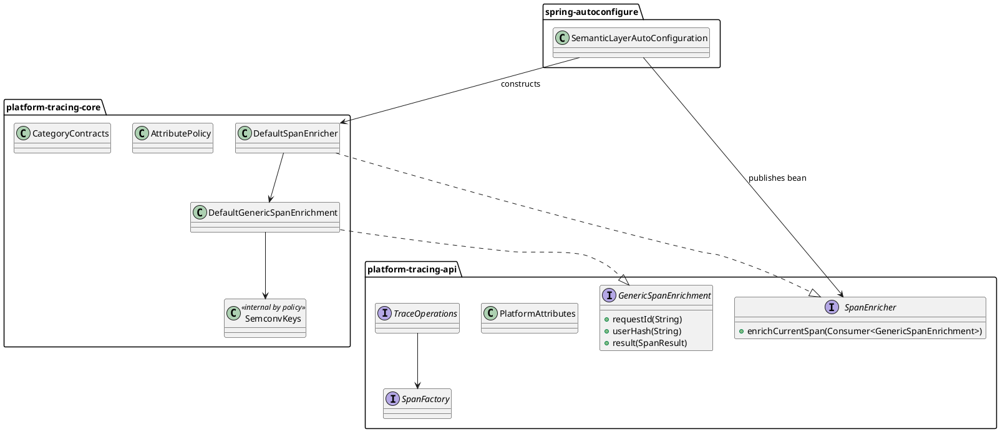

# Opus Refactoring Plan — SpanEnrichment API Decision

## 1. Executive Verdict

**Выбор: `E_OTHER`.**

Оставить публичной только закрытую generic-возможность обогащения активного span: новый контракт
`api.span.enrich.SpanEnricher` и существующий `GenericSpanEnrichment`, но без
`businessTag(String, String)`. Удалить публичный `SpanEnrichment`, category-scoped runtime
enrichment, его marker в OTel `Context` и `DefaultSpanEnrichment`. Перенести `SemconvKeys` в
`platform-tracing-core`, оставить `PlatformAttributes` единственным публичным реестром строковых
имён и не вводить `SpanAttributeKey<T>`.

Это не косметический перенос: решение удаляет неиспользуемый публичный OTel-контракт, закрывает
произвольную запись runtime-атрибутов, отделяет application API от concrete core bean, убирает
мёртвый context-marker и сокращает зависимость `platform-tracing-api` от
`opentelemetry-api`. Возможность enrichment не удаляется полностью: application teams продолжают
обогащать любой активный, в том числе созданный Java Agent, span через API-интерфейс и три
явно управляемые операции: `requestId`, `userHash`, `result`.

## 2. Independent Repository Findings

Анализ выполнен по текущему workspace `E:\Platform_Traces`, ветка `master`. Remote действительно
указывает на `https://github.com/andrew3008/EnglishDictionary.git`; имя GitHub-репозитория не
соответствует содержимому, но рабочая копия и требуемые tracing-модули совпадают с задачей.

Все десять named reports прочитаны из
`E:\Platform_Traces_Archive\Refactoring\__platform-tracing-api\span_package\Analyzis`. Они не
являются частью текущего Git working tree и рассматриваются только как внешние гипотезы.
Дополнительно проверены доступные исторические bundles в `docs/analysis/perplexity-review`.
Факты и line references из отчётов не принимались без повторной проверки в `E:\Platform_Traces`.

| Finding | Evidence | Result |
|---|---|---|
| `SpanEnrichment` не имеет application/production caller | `api/span/enrich/SpanEnrichment.java`; production-ссылки только в `core/enrichment/SpanEnricher.java` и `DefaultSpanEnrichment.java`; вызовы `enrichCurrentSpanIfPlatformCategory` только в core tests | **CONFIRMED**: публичность не подтверждена реальным потребителем |
| `GenericSpanEnrichment` используется только реализацией и тестами | `GenericSpanEnrichment.java`; `DefaultGenericSpanEnrichment.java`; `SpanEnricherTest`; `SpanEnricherV3CharacterizationTest` | **CONFIRMED**; capability полезна, но вход сейчас ошибочно находится в core |
| Concrete `SpanEnricher` является фактическим публичным Spring API | `core/enrichment/SpanEnricher.java:16`; `SemanticLayerAutoConfiguration.java:55-60`; `SemanticLayerAutoConfigurationTest.java:28` | **CONFIRMED**: бин публикуется concrete core-классом |
| В samples enrichment отсутствует | repository search в `platform-tracing-samples` по четырём enrichment-типам | **CONFIRMED**, 0 совпадений |
| Category-scoped enrichment поддерживается только тестами/документацией | `SpanEnricherTest:70-95`; `V3MarkerPortCharacterizationTest`; `MarkerBasedEnrichmentCharacterizationTest`; `anti-double-instrumentation.md:87-104` | **CONFIRMED**; production call-site отсутствует |
| `businessTag` не используется production-кодом | Единственный tracing-вызов — `SpanEnricherTest:54`; реализация `DefaultGenericSpanEnrichment:45-50` | **CONFIRMED**; arbitrary key/value API является спекулятивным |
| `businessTag` обходит semantic allowlist | Реализация формирует `platform.business.<normalizedName>` и сразу вызывает `Span.setAttribute`; `AttributePolicy` не вызывается | **CONFIRMED** |
| `SemconvKeys` main-потребители находятся только в core | `core/manual/*`, `core/exception/ExceptionRecorder`, `core/enrichment/*`, `core/semconv/policy/*` | **CONFIRMED**; нет main-импортов в samples, autoconfigure и otel-extension |
| `SemconvKeys` — один из двух `AttributeKey` leaks в API | `SemconvKeys.java:3,6-7`; `SpanEnrichment.java:3` | **CONFIRMED** |
| `PlatformAttributes` широко используется за пределами core | webmvc/webflux conventions, otel-extension processors/resources, core runtime, tests, bench | **CONFIRMED**; это правильный публичный wire-name registry |
| `PlatformAttributes` не содержит `PLATFORM_USER_HASH` | `PlatformAttributes.java`; значение есть только в `SemconvKeys.java:55-56` | **CONFIRMED**; реестр неполон для публичного generic enrichment |
| В API есть другие OTel-типы, но только из `opentelemetry-context` | `PlatformTraceContextKeys`, `TraceControlHeaderInjector` | **CONFIRMED**; API не станет полностью OTel-free в этом PR |
| В API main `opentelemetry-api` нужен только двум удаляемым типам | Полный search `io.opentelemetry` в `platform-tracing-api/src/main`: API Common imports только в `SpanEnrichment`, `SemconvKeys` | **CONFIRMED** |
| Gradle-комментарий про scrubbing устарел | `platform-tracing-api/build.gradle:16` говорит про `AttributeKey`; фактический `SpanAttributeScrubbingRule.evaluate` принимает `String, Object` | **CONFIRMED** |
| API dependency scopes | `platform-tracing-api/build.gradle:13-18`: `compileOnly opentelemetry-context` и `compileOnly opentelemetry-api` | **CONFIRMED** |
| Core dependency scope | `platform-tracing-core/build.gradle:9-13`: `api project(':platform-tracing-api')`, `api opentelemetry-api` | **CONFIRMED**; core OTel exposure отдельно принят ADR |
| Autoconfigure транзитивно раскрывает API/core/OTel | `platform-tracing-spring-boot-autoconfigure/build.gradle:8-15` | **CONFIRMED** |
| Extension использует api+core как implementation | `platform-tracing-otel-extension/build.gradle:15-23`; agent JAR embeds оба модуля | **CONFIRMED** |
| `TraceOperations` не экспонирует enrichment | `TraceOperations.java:21-27`: только `traceContext()` и `spans()` | **CONFIRMED** |
| `SpanFactory` отвечает только за создание/запуск span | `SpanFactory.java:20-63`: `operation`, `transport`, `fromSpec` | **CONFIRMED** |
| Runtime category marker существует только ради удаляемого path | `OtelTracingRuntime.java:73-76`; `PlatformSpanContextKeys`; reader — только текущий concrete `SpanEnricher` | **CONFIRMED** |
| Reflection/ServiceLoader не держат enrichment-типы | Search по `META-INF/services`, `Class.forName`, `getMethod`, direct construction | **CONFIRMED**, 0 dynamic consumers |
| Scrubbing уже является export-time backstop | `SpanAttributeScrubbingRule`; `ScrubbingSpanProcessor`; built-in rules | **CONFIRMED**, но это не cardinality/allowlist на write-time |
| `AttributePolicy` нужен независимо от enrichment | Используется `TracingRuntime`, manual builders, core runtime, autoconfigure, bench и e2e | **CONFIRMED**; удалять policy нельзя |
| `AttributePolicy.isAllowed` нужен только `DefaultSpanEnrichment` | `AttributePolicy.java:74-76`; единственный caller `DefaultSpanEnrichment.java:40` | **CONFIRMED**; после удаления path метод становится мёртвым |
| Version-controlled Perplexity bundles не являются named арбитражами | `docs/analysis/perplexity-review/*`: Slice 7/8 snapshots от 2026-07-07, содержат устаревшие имена `manual()` и старые source copies; десять named reports прочитаны отдельно из archive path выше | **CONFIRMED**; bundles использовать только как historical context |
| Внешние downstream-сервисы могут использовать concrete `SpanEnricher` | В текущем repository таких consumers нет; доступ к отдельным service repos отсутствует | **INSUFFICIENT_EVIDENCE**; breaking pre-production policy позволяет удалить/заменить контракт без shim |

## 3. Review of Perplexity Conclusions

### Report-by-report reconciliation

| Report | Main conclusion | Accept / Modify / Reject | Repository-backed correction |
|---|---|---|---|
| `проход_1` | Hybrid: generic public, category internal, expose via `TraceOperations` | **Modify** | Верно разделяет аудитории; ошибочно трактует `compileOnly` как transitive и не знает фактический Spring bean |
| `проход_2` | Public `SpanAttributeKey<T>` and typed public enrichment | **Reject** | Не доказан application caller; создаёт третий key model рядом с `PlatformAttributes` и typed core keys |
| `проход_3` | Move `SemconvKeys`, hide category API, add enrichment sub-facade to `TraceOperations` | **Modify** | Верно находит два leaks; третий root capability противоречит принятому narrow facade и не нужен при API-owned injectable interface |
| `проход_4` | Builder/spec semantics + generic runtime enrichment through `TraceOperations` | **Modify** | Верно выбирает construction-time для semconv; named builder methods и изменение root facade не нужны для текущего минимального решения |
| `проход_5` | Public generic, internal `CategoryEnrichmentPort`, add `TraceOperations.enrich` | **Modify** | Разделение верно; новый internal port сохраняет feature без production owner |
| `проход_6` | Keep public typed category API with `SpanAttributeKey`; make core enricher internal | **Reject** | Базируется на ложном факте, что `SpanEnricher` не зарегистрирован Spring bean; сохраняет ненужный public category path |
| `проход_7` | Platform typed keys + new customizer/scrubber SPIs | **Reject** | Scope creep; scrubbing SPI уже существует, а новые SPI не подтверждены call-sites |
| `проход_8` | Atomic B only; partial key replacement is cosmetic | **Accept diagnosis, reject solution** | Верно: менять только `SpanEnrichment` недостаточно. Но атомарный третий key model сложнее удаления неиспользуемого path |
| `проход_9` | `C_REFINED`: delete public category API, keep generic, move keys, keep internal category | **Modify** | Близко к цели; ошибочно утверждает отсутствие Spring bean и переоценивает необходимость `InternalSpanEnrichment` |
| `проход_10` | `C_REFINED`, `TraceOperations` unchanged, internal category retained | **Modify** | Верно сохраняет narrow facade и core OTel dependency; оставляет apps без API-owned entry и сохраняет test-only marker path |

### Resolved contradictions

| Perplexity conclusion | Accept / Modify / Reject | Reason |
|---|---|---|
| Keep public OTel `AttributeKey` | **Reject** | Category runtime enrichment не имеет production caller; сохранять OTel leak ради тестового path нельзя |
| Introduce `SpanAttributeKey<T>` | **Reject** | После удаления arbitrary category enrichment нет публичного use case; появится третий реестр рядом с `PlatformAttributes` и internal `SemconvKeys` |
| Delete public `SpanEnrichment` | **Accept** | Тип используется только текущей core-реализацией и тестами; скрытый marker/allowlist делает API недоступным и недостоверным |
| Keep `GenericSpanEnrichment` | **Modify** | Оставить `requestId`, `userHash`, `result`; удалить неограниченный `businessTag` |
| Move `SemconvKeys` to core | **Accept** | Все production-потребители находятся в core; тип является OTel implementation registry |
| Add `TraceOperations.enrich(...)` | **Reject** | Ломает принятый двухметодный root facade и смешивает creation/read с mutation; отдельный DI capability яснее |
| Leave `TraceOperations` unchanged | **Accept** | Приложения получают enrichment через новый API-интерфейс `SpanEnricher`, а не concrete core type |
| Make `SpanEnricher` internal | **Modify** | Concrete implementation — internal-by-policy; сам интерфейс должен быть публичным, иначе `GenericSpanEnrichment` не имеет application entry point |
| Remove OTel from `platform-tracing-api` | **Modify** | Удалить `opentelemetry-api`, но сохранить `opentelemetry-context`: propagation API уже публично использует `Context`, `ContextKey`, `TextMapSetter` |
| Semantic attributes only via builders/spec | **Accept** | Typed transport builders и governed `SpanSpecBuilder` задают semantic attributes до start; runtime generic enrichment не должен менять transport semantics |
| Public generic + internal category | **Modify** | Не создавать `InternalSpanEnrichment`: category path вообще не имеет production caller; удалить его до появления подтверждённого use case |

Ключевое расхождение разрешено так:

- B-family (`проход_2/6/7/8`) права только в том, что частичная замена одного `AttributeKey` была
  бы косметикой; её вывод о необходимости нового public key model не следует из кода.
- C/F-family (`проход_3/4/5/9/10`) правильно отделяет generic runtime metadata от semantic
  construction-time attributes.
- `проход_9/10` дают наиболее близкое направление, но опираются на неверный факт об отсутствии
  Spring bean и оставляют `GenericSpanEnrichment` без корректного API-owned entry point.
- Предлагаемый `E_OTHER` исправляет этот остаточный дефект: отдельный API-интерфейс
  `SpanEnricher`, core implementation и полное удаление неиспользуемого category path.

## 4. Problem Statement

Реальная проблема — не отсутствие ещё одного типа ключа и не недостаток метода на
`TraceOperations`.

1. **Ложная публичность.** `SpanEnrichment` лежит в API, но вызвать его можно только через concrete
   `core.enrichment.SpanEnricher`, а category path работает лишь на span с невидимым internal
   context-marker.
2. **Несвоевременная мутация transport semantics.** HTTP/RPC/DB/Kafka атрибуты должны формироваться
   builder/spec pipeline до `startSpan`, чтобы sampler и validation видели финальный creation
   snapshot. Post-start category mutation конкурирует с этой моделью.
3. **OTel leakage без подтверждённого use case.** `AttributeKey<V>` в `SpanEnrichment` и публичный
   `SemconvKeys` существуют ради core-only поведения.
4. **Concrete core bean как application API.** 80 сервисов должны инжектировать контракт из
   `platform-tracing-api`, а не реализацию из `platform-tracing-core`.
5. **Неверное обещание “platform-safe”.** `businessTag` допускает произвольный key suffix и
   произвольное value без allowlist, bounds и cardinality policy. Export-time scrubbing снижает PII
   риск, но не отменяет память/CPU/cardinality cost до экспорта.
6. **Discoverability.** Allowed generic metadata скрыта за concrete core bean и не представлена в
   sample module.

`SemconvKeys` является главным модульным OTel leak, потому что содержит весь typed registry.
`SpanEnrichment` является главным API-design leak, потому что публично обещает capability, которой
нет у нормального application entry point. Оба дефекта должны быть устранены вместе.

## 5. Option Scoring Matrix

Баллы выставлены по rubric: clarity 20, production stability 20, dependency governance 15,
type safety 15, OTel compatibility 10, ergonomics 8, testability 7, complexity 5.

| Option | Clarity | Stability | Dependencies | Type safety | OTel | DX | Tests | Complexity | Score | Verdict | Main risk |
|---|---:|---:|---:|---:|---:|---:|---:|---:|---:|---|---|
| A — public OTel `AttributeKey` | 11 | 13 | 5 | 14 | 10 | 5 | 6 | 5 | **69** | WEAK | OTel и hidden allowlist становятся коммерческим API навсегда |
| B — public `SpanAttributeKey<T>` | 14 | 15 | 12 | 15 | 7 | 4 | 6 | 2 | **75** | ACCEPTABLE | Третий registry и постоянный mapper без доказанного caller |
| C — всё enrichment internal | 18 | 12 | 15 | 12 | 8 | 2 | 6 | 5 | **78** | WEAK | Удаляет полезный agent-first application capability |
| C_REFINED — generic public, category internal | 17 | 17 | 14 | 13 | 9 | 7 | 6 | 4 | **87** | ACCEPTABLE | Сохраняет speculative internal path и marker |
| D — split: public generic, internal category, builders/spec semantics | 18 | 18 | 14 | 13 | 9 | 7 | 6 | 4 | **89** | ACCEPTABLE | Internal category path остаётся без production owner |
| E — public closed generic, category path deleted | 19 | 19 | 14 | 14 | 9 | 7 | 7 | 4 | **93** | **STRONG_RECOMMEND** | Требует честно удалить ранее задокументированный, но не используемый feature |

Migration simplicity намеренно не определяет победителя.

## 6. Final Target Design

### `platform-tracing-api`

```text
space.br1440.platform.tracing.api
├── TraceOperations                         unchanged
├── attributes
│   └── PlatformAttributes                  public String registry; add PLATFORM_USER_HASH
├── span
│   ├── SpanFactory                         unchanged
│   └── enrich
│       ├── SpanEnricher                    NEW public application capability
│       └── GenericSpanEnrichment           public; requestId/userHash/result only
└── semconv
    ├── *SemconvVersion                     unchanged, remain here
    ├── SemconvValidationMode               unchanged
    └── SemconvViolation*                   unchanged
```

Удаляются из API:

- `space.br1440.platform.tracing.api.span.enrich.SpanEnrichment`;
- `space.br1440.platform.tracing.api.semconv.SemconvKeys`;
- `GenericSpanEnrichment.businessTag`.

Новые публичные `SpanAttributeKey<T>` / `SpanAttributeKeys` **не вводятся**.

### `platform-tracing-core`

```text
space.br1440.platform.tracing.core
├── enrichment
│   ├── DefaultSpanEnricher                 public technical impl, final
│   └── DefaultGenericSpanEnrichment        package-private
└── semconv
    ├── SemconvKeys                         public technical impl, ArchUnit-restricted
    └── policy
        ├── AttributePolicy                 keep; remove dead isAllowed only
        ├── CategoryContract                unchanged
        └── CategoryContracts               unchanged
```

Удаляются:

- old concrete `core.enrichment.SpanEnricher`;
- `core.enrichment.DefaultSpanEnrichment`;
- `core.runtime.otel.context.PlatformSpanContextKeys`;
- marker write из `OtelTracingRuntime`.

`DefaultSpanEnricher` публичен только из-за Java cross-module wiring в autoconfigure. Он не является
application API; ArchUnit разрешает прямую зависимость только из core, autoconfigure и tests.
После удаления category path он не принимает `AttributePolicy`: public no-arg constructor не
создаёт ложной связи generic metadata с semantic allowlist.

Core `SemconvKeys` строит все `platform.*` typed keys из констант `PlatformAttributes`, включая
новый `PLATFORM_USER_HASH`; прямые строковые литералы остаются только для OTel semconv-ключей,
которых пока нет в публичном registry.

### Application seam

```java
final class OrderService {
    private final SpanEnricher spanEnricher;

    OrderService(SpanEnricher spanEnricher) {
        this.spanEnricher = spanEnricher;
    }

    void process(String requestId) {
        spanEnricher.enrichCurrentSpan(e -> e
                .requestId(requestId)
                .result(SpanResult.SUCCESS));
    }
}
```

Контракт:

- обогащается только текущий recording span;
- span не создаётся;
- при отсутствии active recording span — silent no-op;
- произвольные ключи отсутствуют;
- transport/semantic attributes задаются builder/spec до старта.

### PlantUML



## 7. Dependency Decision

Выбор: **hybrid**.

- Public generic enrichment не экспонирует OTel-типы.
- OTel `AttributeKey` разрешён в `platform-tracing-core`, включая internal `SemconvKeys`,
  `AttributePolicy` и runtime adapter.
- `platform-tracing-api` после удаления `SpanEnrichment` и переноса `SemconvKeys` не должен
  импортировать `io.opentelemetry.api.*`.
- `compileOnly 'io.opentelemetry:opentelemetry-api'` удаляется из
  `platform-tracing-api/build.gradle`.
- `compileOnly 'io.opentelemetry:opentelemetry-context'` остаётся, потому что
  `TraceControlHeaderInjector` и `PlatformTraceContextKeys` сознательно имеют OTel Context в
  публичных сигнатурах.
- `platform-tracing-core` сохраняет `api 'io.opentelemetry:opentelemetry-api'`: public core
  signatures (`AttributePolicy`, OTel runtime factory) и принятый
  `ADR-platform-tracing-core-otel-api-exposure` остаются вне scope.
- Autoconfigure и otel-extension dependency scopes не меняются.
- Для 80 Spring Boot services API-интерфейс `SpanEnricher` приходит через starter/autoconfigure;
  concrete core-класс не должен импортироваться application-кодом.

Перед удалением Gradle dependency обязательны source scan и class-level scan (`jdeps`) собранного
API JAR. Критерий: `io.opentelemetry.api.*` отсутствует; `io.opentelemetry.context.*` допустим.

## 8. Public API Decision

| Type | Current status | Target status | Reason |
|---|---|---|---|
| `SpanEnrichment` | Public API, OTel `AttributeKey` | **Deleted** | Нет production caller; post-start semantic mutation противоречит builder/spec pipeline |
| `GenericSpanEnrichment` | Public callback with 4 methods | **Public, narrowed** to `requestId/userHash/result` | Сохраняет agent-first generic metadata без arbitrary keys |
| `SpanEnricher` | Public concrete core bean | **Public API interface** in `api.span.enrich` | Apps depend on contract, not core |
| `DefaultSpanEnrichment` | Package-private core impl | **Deleted** | Реализует удаляемый category path |
| `DefaultGenericSpanEnrichment` | Package-private core impl | **Kept package-private**, remove `businessTag` | Correct implementation placement |
| `DefaultSpanEnricher` | Absent | **New public technical core implementation**, ArchUnit-restricted | Нужен cross-module autoconfigure wiring |
| `SemconvKeys` | Public API OTel typed registry | **Moved to `core.semconv`, internal-by-policy** | Все production consumers в core |
| `PlatformAttributes` | Public String registry | **Kept public**, add `PLATFORM_USER_HASH` | Единственный public wire-name registry |
| `TraceOperations` | Two methods | **Unchanged** | Не превращать root facade в god object |
| `SpanFactory` | Span creation capability | **Unchanged** | Enrichment не создаёт spans |

## 9. Error / Misuse / Governance Model

### Must fix in this refactor

- Удалить hidden category allowlist API и вместе с ним `WARNED_ONCE` static state из
  `DefaultSpanEnrichment`.
- Удалить `businessTag`: произвольные имена/значения не являются platform-safe.
- Новый `SpanEnricher` документирует silent no-op без active recording span.
- `GenericSpanEnrichment` принимает только non-null values; текущие `Objects.requireNonNull`
  сохраняются.
- Application API не видит `SemconvKeys` и `AttributeKey`.
- Construction-time semantic attributes остаются в typed builders или governed `SpanSpec`.

### Existing behavior retained

- `AttributePolicy.warnedOnce` остаётся **instance state**, а не static global state.
- `SemconvValidationMode.WARN` продолжает логировать и считать violations для builder/spec path.
- `CategoryContract`/`CategoryContracts` остаются single source of truth для construction-time
  validation.
- `SpanAttributeScrubbingRule` и `ScrubbingSpanProcessor` продолжают export-time mask/drop/hash.
- `requestId` остаётся high-cardinality span attribute и запрещён для metric labels.
- `userHash` остаётся только псевдонимизированным значением; raw identifier/PII запрещён.

### Limits of scrubbing

Scrubbing — backstop, а не разрешение писать произвольные данные. Он работает после записи
атрибута, не устраняет allocation/cardinality cost и не гарантирует знание бизнес-семантики.
Именно поэтому `businessTag` удаляется, несмотря на существующий scrubbing SPI.

### Deferred follow-up ADRs

- Max length/format policy для `requestId` и `userHash`.
- Нужна ли отдельная метрика no-op enrichment; сейчас сохраняется тихий no-op без hot-path log.
- Полная консолидация строк `PlatformAttributes` и internal typed `SemconvKeys`.
- Полная OTel-free стратегия для propagation API — отдельный большой redesign.
- Typed public key model может рассматриваться только при появлении минимум двух подтверждённых
  application use cases, которые нельзя выразить explicit methods/builders/spec.

## 10. Implementation Slices

### Slice 0 — Characterization / repository snapshot

Production changes: none.

Tests to add before deletion:

- `SpanEnrichmentApiSurfaceTest` фиксирует текущие/целевые public symbols;
- расширить `SpanEnricherTest` доказательством: generic enrichment не создаёт новый span;
- snapshot значений internal typed keys до переноса.

Evidence artifact:

- записать классификацию всех search hits: main/test/docs/dynamic;
- зафиксировать отсутствие samples, SPI и reflection consumers;
- сохранить dependency reports API/core.

Verification:

```powershell
.\gradlew.bat :platform-tracing-api:test :platform-tracing-core:test
.\gradlew.bat :platform-tracing-api:dependencies --configuration compileClasspath
.\gradlew.bat :platform-tracing-core:dependencies --configuration compileClasspath
```

Expected: baseline green; `opentelemetry-api` direct compileOnly в API; category callers только tests.

### Slice 1 — Public generic contract

Create:

- `api/span/enrich/SpanEnricher.java`;
- `core/enrichment/DefaultSpanEnricher.java`.

Modify:

- `GenericSpanEnrichment`: удалить `businessTag` и ссылки на `SpanEnrichment`;
- `DefaultGenericSpanEnrichment`: удалить `businessTag`, `normalize`, `BUSINESS_PREFIX`;
- `PlatformAttributes`: добавить `PLATFORM_USER_HASH`;
- `DefaultSpanEnricher` больше не принимает неиспользуемый `AttributePolicy`;
- autoconfigure публикует bean типа API `SpanEnricher`, создаёт no-arg `DefaultSpanEnricher`;
- tests используют API interface.

На этом slice old category path ещё может существовать только временно внутри одной branch, но не
должен публиковаться как второй bean/API.

Verification:

```powershell
.\gradlew.bat :platform-tracing-api:test :platform-tracing-core:test
.\gradlew.bat :platform-tracing-spring-boot-autoconfigure:test --tests "*SemanticLayerAutoConfigurationTest"
.\gradlew.bat :platform-tracing-samples:compileJava
```

Expected: один bean API `SpanEnricher`; generic tests green; `businessTag` отсутствует reflection API.

### Slice 2 — Remove category-scoped runtime enrichment

Delete:

- API `SpanEnrichment`;
- core `DefaultSpanEnrichment`;
- old core concrete `SpanEnricher`;
- `PlatformSpanContextKeys`;
- category-only characterization tests.

Modify:

- `OtelTracingRuntime`: удалить marker `.with(...)`;
- `AttributePolicy`: удалить только dead `isAllowed`;
- сохранить `validateAndNormalize`, contracts, metrics и warn-once logic.

Verification:

```powershell
.\gradlew.bat :platform-tracing-core:test
.\gradlew.bat :platform-tracing-spring-boot-autoconfigure:test
rg "SpanEnrichment|enrichCurrentSpanIfPlatformCategory|PLATFORM_SPAN_CATEGORY|PlatformSpanContextKeys" . --glob "*.java"
```

Expected: search hits только в intentional negative tests/post-audit; все span builder/policy tests
green; OTel span output не изменён.

### Slice 3 — Move typed semconv registry and reduce API dependency

Create/move:

- `core/semconv/SemconvKeys.java`.

Modify:

- все core main/test imports;
- API Gradle: удалить `compileOnly opentelemetry-api` и неверный scrubbing comment;
- оставить `compileOnly opentelemetry-context`;
- API test dependency на `opentelemetry-api` удалить, если dependency report подтверждает отсутствие
  direct test need.

Delete:

- `api/semconv/SemconvKeys.java`.

Verification:

```powershell
.\gradlew.bat :platform-tracing-api:clean :platform-tracing-api:compileJava
.\gradlew.bat :platform-tracing-core:compileJava :platform-tracing-spring-boot-autoconfigure:compileJava
.\gradlew.bat :platform-tracing-api:dependencyInsight --dependency opentelemetry-api --configuration compileClasspath
.\gradlew.bat :platform-tracing-api:dependencyInsight --dependency opentelemetry-context --configuration compileClasspath
```

Expected: API compile succeeds без `opentelemetry-api`; context остаётся; core imports new FQN.

### Slice 4 — Governance

Add ArchUnit/API surface checks:

- no `io.opentelemetry.api..` dependency from API main;
- `SemconvKeys` resides only in `core.semconv`;
- no production `SpanEnrichment` type;
- only core `DefaultSpanEnricher` implements API `SpanEnricher`;
- direct dependency on `DefaultSpanEnricher` allowed only core/autoconfigure/tests;
- four `*SemconvVersion` annotations remain in `api.semconv`;
- removed `businessTag` and category method do not reappear.

Verification:

```powershell
.\gradlew.bat pr4ArchitectureFitnessVerify
.\gradlew.bat :platform-tracing-test:test :platform-tracing-api:test :platform-tracing-core:test
```

### Slice 5 — Docs / ADR / post-audit

Create:

- `docs/decisions/ADR-span-enrichment-public-boundary.md`;
- `docs/analysis/span-enrichment-post-audit.md`;
- sample using injected API `SpanEnricher`.

Update current user-facing docs:

- `docs/tracing/anti-double-instrumentation.md`;
- `docs/semconv-mapping.md`;
- `docs/tracing/traceability.md`;
- `docs/tracing/requirements-coverage-dossier.md`;
- `platform-tracing-api/CHANGELOG.md`;
- API/core module descriptions.

Historical analysis/source bundles are not rewritten; add a superseded note only where they are
likely to be mistaken for current architecture.

Verification:

```powershell
rg "api\.semconv\.SemconvKeys|SpanEnrichment|enrichCurrentSpanIfPlatformCategory|businessTag" docs platform-tracing-samples
.\gradlew.bat :platform-tracing-samples:compileJava
```

Expected: removed terms only in ADR alternatives, changelog history and explicit historical notes.

## 11. Exact Create / Modify / Delete Set

### Create

| Path | Class | Visibility | Purpose |
|---|---|---|---|
| `platform-tracing-api/src/main/java/space/br1440/platform/tracing/api/span/enrich/SpanEnricher.java` | `SpanEnricher` | public interface | Stable application capability |
| `platform-tracing-core/src/main/java/space/br1440/platform/tracing/core/enrichment/DefaultSpanEnricher.java` | `DefaultSpanEnricher` | public final, restricted | OTel-backed implementation |
| `platform-tracing-core/src/main/java/space/br1440/platform/tracing/core/semconv/SemconvKeys.java` | `SemconvKeys` | public final, restricted | Internal typed OTel registry |
| `platform-tracing-api/src/test/java/space/br1440/platform/tracing/api/span/enrich/SpanEnrichmentApiSurfaceTest.java` | test | package-private | Public API/removed-symbol guard |
| `docs/decisions/ADR-span-enrichment-public-boundary.md` | ADR | n/a | Architecture decision |
| `docs/analysis/span-enrichment-post-audit.md` | audit | n/a | Implementation evidence |

### Modify

| Path | Change | Risk |
|---|---|---|
| `platform-tracing-api/.../span/enrich/GenericSpanEnrichment.java` | Remove `businessTag`, remove category Javadoc | Medium: source break, intentional |
| `platform-tracing-api/.../attributes/PlatformAttributes.java` | Add `PLATFORM_USER_HASH` | Low |
| `platform-tracing-api/build.gradle` | Remove OTel API compileOnly; fix comment | Medium: classpath verification required |
| `platform-tracing-core/.../enrichment/DefaultGenericSpanEnrichment.java` | Remove arbitrary business tags; new SemconvKeys import | Medium |
| `platform-tracing-core/.../enrichment/DefaultSpanEnricher.java` | No-arg generic implementation; no AttributePolicy dependency | Low |
| `platform-tracing-core/.../semconv/SemconvKeys.java` | Derive `platform.*` keys from `PlatformAttributes` | Low |
| `platform-tracing-core/.../runtime/otel/OtelTracingRuntime.java` | Remove category context marker | Medium |
| `platform-tracing-core/.../semconv/policy/AttributePolicy.java` | Remove dead `isAllowed` only | Low |
| `platform-tracing-core/src/main/**` Semconv consumers | Import core `SemconvKeys` | Low/mechanical |
| `platform-tracing-core/src/test/**` Semconv consumers | Import core `SemconvKeys`; retain behavior assertions | Low |
| `SemanticLayerAutoConfiguration.java` | Publish API interface, construct default core impl | Medium |
| `SemanticLayerAutoConfigurationTest.java` | Assert interface bean and implementation boundary | Low |
| `SpanEnricherTest.java` | Generic-only contract; remove category/businessTag tests | Medium |
| `SpanEnricherV3CharacterizationTest.java` | Use new interface/impl; preserve manual/agent active-span semantics | Low |
| `ModuleTaxonomyArchRules.java` + API/core arch test adapters | Add boundary guards | Medium |
| user-facing docs and changelog listed in Slice 5 | Update current architecture | Low |

### Delete

| Path | Reason |
|---|---|
| `platform-tracing-api/.../span/enrich/SpanEnrichment.java` | Unused public OTel/category API |
| `platform-tracing-api/.../semconv/SemconvKeys.java` | Typed registry belongs to core |
| `platform-tracing-core/.../enrichment/SpanEnricher.java` | Replaced by API interface + `DefaultSpanEnricher` |
| `platform-tracing-core/.../enrichment/DefaultSpanEnrichment.java` | Category path deleted |
| `platform-tracing-core/.../runtime/otel/context/PlatformSpanContextKeys.java` | Marker has no remaining consumer |
| `platform-tracing-core/.../characterization/V3MarkerPortCharacterizationTest.java` | Tests deleted behavior |
| `platform-tracing-core/.../characterization/MarkerBasedEnrichmentCharacterizationTest.java` | Tests deleted behavior |

## 12. Required Tests

### Unit

`DefaultSpanEnricherTest`:

- `enrichCurrentSpan_writesRequestIdUserHashAndResult`;
- `enrichCurrentSpan_withoutActiveSpan_isNoOp`;
- `enrichCurrentSpan_onNonRecordingSpan_isNoOp`;
- `enrichCurrentSpan_neverCreatesSecondSpan`;
- `enrichCurrentSpan_rejectsNullConsumer`;
- `genericSurface_hasNoArbitraryAttributeOrBusinessTagMethod`.

`SemconvKeysTest`:

- key names and types are byte-for-byte equal before/after move;
- `PLATFORM_USER_HASH` equals `PlatformAttributes.PLATFORM_USER_HASH`.

Keep all `AttributePolicyTest` and `CategoryContractsTest`; they prove policy was not accidentally
deleted with category enrichment.

### Integration

- `SpanEnricherV3CharacterizationTest`: generic enrichment on manual v3 span;
- add equivalent active Java Agent/SDK-created span test;
- `SemanticLayerAutoConfigurationTest`: one bean by API interface, concrete implementation is
  `DefaultSpanEnricher`;
- scrubbing interaction test for a generic enrichment value, without changing scrubbing policy.

### API surface

- old `SpanEnrichment` FQN absent;
- old API `SemconvKeys` FQN absent;
- API `SpanEnricher` contains exactly `enrichCurrentSpan`;
- `GenericSpanEnrichment` contains only three approved methods;
- no aliases, deprecated bridges or duplicate types.

### ArchUnit

- API main has no `io.opentelemetry.api..` dependencies;
- API may depend on `io.opentelemetry.context..` only in propagation/control packages;
- `SemconvKeys` only in `core.semconv`;
- `DefaultSpanEnricher` dependents restricted;
- API `SpanEnricher` implementation restricted to core;
- no `SpanEnrichment` simple name;
- semconv version annotations remain in `api.semconv`.

### Gradle/dependency

- API compile from clean state without `opentelemetry-api`;
- dependencyInsight confirms no direct API OTel API dependency;
- core continues to expose OTel API as accepted;
- samples compile against API `SpanEnricher`;
- agent extension JAR still contains API/core classes and no deleted old FQNs.

## 13. Do-Not-Touch List

- `TraceOperations`: no third root method.
- `SpanFactory`: no enrichment method; creation only.
- `SpanCategory`, `SpanResult`: names and wire values unchanged.
- `SpanSpec`, `SpanSpecBuilder` and typed transport builders: behavior unchanged.
- `RpcSemconvVersion`, `KafkaSemconvVersion`, `HttpSemconvVersion`,
  `DatabaseSemconvVersion`: remain exactly in `api.semconv`.
- `SemconvValidationMode`, `SemconvViolation`, `SemconvViolationException`: unchanged.
- `AttributePolicy.validateAndNormalize`, `CategoryContract`, `CategoryContracts`: logic unchanged;
  only dead `isAllowed` may be removed.
- `SpanAttributeScrubbingRule`, `ScrubbingDecision`, `ScrubbingAction`: unchanged.
- OTel extension processors/sampling/runtime/control/JMX packages: no behavior changes.
- `platform-tracing-core` OTel dependency scope: unchanged.
- Propagation OTel Context contracts: out of scope.

Intentional exceptions:

- `GenericSpanEnrichment` loses only `businessTag`; three explicit methods remain unchanged.
- `PlatformAttributes` gains only missing `PLATFORM_USER_HASH`; no existing constant changes.

## 14. Verification Commands

Все команды запускаются из `E:\Platform_Traces`.

```powershell
# Fast architecture and affected modules
.\gradlew.bat pr4ArchitectureFitnessVerify
.\gradlew.bat :platform-tracing-api:test :platform-tracing-core:test :platform-tracing-test:test
.\gradlew.bat :platform-tracing-spring-boot-autoconfigure:test

# Downstream compilation
.\gradlew.bat :platform-tracing-autoconfigure-webmvc:test
.\gradlew.bat :platform-tracing-autoconfigure-webflux:test
.\gradlew.bat :platform-tracing-otel-extension:test
.\gradlew.bat :platform-tracing-samples:compileJava

# Dependency governance
.\gradlew.bat :platform-tracing-api:dependencies --configuration compileClasspath
.\gradlew.bat :platform-tracing-api:dependencyInsight --dependency opentelemetry-api --configuration compileClasspath
.\gradlew.bat :platform-tracing-api:dependencyInsight --dependency opentelemetry-context --configuration compileClasspath
.\gradlew.bat :platform-tracing-core:dependencyInsight --dependency opentelemetry-api --configuration compileClasspath

# Source gates
rg "import io\.opentelemetry\.api" platform-tracing-api\src\main --glob "*.java"
rg "SpanEnrichment|enrichCurrentSpanIfPlatformCategory|PLATFORM_SPAN_CATEGORY|businessTag" . --glob "*.java"
rg "space\.br1440\.platform\.tracing\.api\.semconv\.SemconvKeys" . --glob "*.java"

# JAR/classpath gate
.\gradlew.bat :platform-tracing-api:jar :platform-tracing-otel-extension:verifyAgentJarContents
$apiJar = Get-ChildItem platform-tracing-api\build\libs\*.jar |
    Where-Object { $_.Name -notmatch 'sources|javadoc' } |
    Select-Object -First 1
jdeps -verbose:class $apiJar.FullName | Select-String "io.opentelemetry"
jar tf $apiJar.FullName | Select-String "SpanEnrichment|SemconvKeys"

# Full pre-production gate
.\gradlew.bat build

# Optional Docker-backed agent verification
.\gradlew.bat :platform-tracing-e2e-tests:test -PrunE2e
```

Ожидаемые результаты:

- source gate по OTel API в API main — 0;
- removed-symbol gate — только intentional negative tests/history;
- `jdeps` показывает только `io.opentelemetry.context`, не `io.opentelemetry.api`;
- old API `SpanEnrichment` и `SemconvKeys` отсутствуют в JAR;
- все non-Docker gates green.

## 15. ADR Draft

### ADR: Public boundary для enrichment активного span

**Статус:** Proposed  
**Контекст:** pre-production cleanup; backward compatibility не требуется.

#### Контекст

Текущая архитектура публикует `SpanEnrichment.attribute(AttributeKey<V>, V)` и `SemconvKeys` в
`platform-tracing-api`, но доступ к category enrichment возможен только через concrete
`core.enrichment.SpanEnricher` и internal marker в OTel `Context`. В production main sources нет
ни одного caller category path. Generic enrichment является важным agent-first сценарием, однако
его entry point ошибочно раскрывает core implementation. `businessTag` допускает произвольные
ключи и значения без write-time governance.

#### Решение

1. Ввести публичный `api.span.enrich.SpanEnricher` с единственным методом
   `enrichCurrentSpan(Consumer<GenericSpanEnrichment>)`.
2. Оставить в `GenericSpanEnrichment` только `requestId`, `userHash`, `result`.
3. Удалить `SpanEnrichment`, category method, `DefaultSpanEnrichment` и category context marker.
4. Перенести typed `SemconvKeys` в `platform-tracing-core`; `PlatformAttributes` остаётся
   единственным публичным string registry.
5. Не вводить `SpanAttributeKey<T>`.
6. Не менять `TraceOperations` и `SpanFactory`.
7. Semantic transport attributes задаются builders/spec до старта span.
8. Generic enrichment не создаёт span и является no-op без active recording span.
9. Удалить `opentelemetry-api` dependency из API, оставить `opentelemetry-context`.
10. Не добавлять aliases, deprecated bridges и compatibility wrappers.

#### Отклонённые альтернативы

- Public OTel `AttributeKey`: фиксирует vendor type и hidden allowlist без реального caller.
- `SpanAttributeKey<T>`: третий registry и mapper без подтверждённой потребности.
- Полностью internal enrichment: лишает applications безопасного способа дополнить agent span.
- Internal category enrichment: сохраняет dead marker/path “на будущее”.
- `TraceOperations.enrich`: расширяет root facade и смешивает span creation/read с mutation.

#### Последствия

Положительные:

- application imports только API contract;
- generic capability сохраняется;
- arbitrary runtime keys и hidden drops исчезают;
- API больше не зависит от `opentelemetry-api`;
- semantic attributes формируются в едином construction-time pipeline.

Отрицательные:

- intentional source/binary break;
- удаляется задокументированный, но не используемый category feature;
- `DefaultSpanEnricher` остаётся public технически для autoconfigure wiring;
- API всё ещё зависит от OTel Context в propagation surface.

#### Dependency governance

`platform-tracing-api` допускает OTel Context только в propagation/control. OTel API Common/Trace
разрешён в core и adapter modules. `platform-tracing-core` сохраняет transitive
`opentelemetry-api` согласно отдельному ADR.

#### Public API status

Public: `SpanEnricher`, `GenericSpanEnrichment`, `PlatformAttributes`.  
Internal-by-policy: `DefaultSpanEnricher`, `DefaultGenericSpanEnrichment`, core `SemconvKeys`.  
Deleted: `SpanEnrichment`, category marker/path, `businessTag`.

#### Backward compatibility

Не предоставляется: решение не было выпущено в production. Нет deprecated aliases или shims.

#### Follow-up

- bounded value policy для request/user hash;
- возможная полная OTel-free propagation abstraction;
- registry consolidation;
- typed key ADR только после появления подтверждённых use cases.

## 16. Post-Audit Checklist

- [ ] Старый `api.span.enrich.SpanEnrichment` отсутствует в sources/classes/JAR.
- [ ] Старый `api.semconv.SemconvKeys` отсутствует в sources/classes/JAR.
- [ ] Нет aliases, deprecated bridges и compatibility wrappers.
- [ ] `api.span.enrich.SpanEnricher` — единственный public entry point enrichment.
- [ ] `GenericSpanEnrichment` содержит только `requestId`, `userHash`, `result`.
- [ ] `businessTag` отсутствует в active Java и user-facing docs.
- [ ] `DefaultSpanEnricher` используется напрямую только core/autoconfigure/tests.
- [ ] `DefaultGenericSpanEnrichment` остаётся package-private.
- [ ] Category context marker и запись marker в runtime удалены.
- [ ] `AttributePolicy`, `CategoryContract`, `CategoryContracts` construction-time tests green.
- [ ] `PlatformAttributes.PLATFORM_USER_HASH` добавлен; существующие значения не изменены.
- [ ] Все `*SemconvVersion` остались в `api.semconv`.
- [ ] API main не импортирует `io.opentelemetry.api.*`.
- [ ] API Gradle не содержит `compileOnly opentelemetry-api`.
- [ ] API сохраняет documented `compileOnly opentelemetry-context`.
- [ ] Core сохраняет `api opentelemetry-api`.
- [ ] Spring context содержит один bean типа API `SpanEnricher`.
- [ ] Generic enrichment работает на active manual и agent/SDK span.
- [ ] No-active-span поведение остаётся no-op.
- [ ] Scrubbing pipeline продолжает обрабатывать enrichment values.
- [ ] Samples компилируются и показывают injection API interface.
- [ ] User-facing docs обновлены; historical bundles отмечены как historical.
- [ ] `pr4ArchitectureFitnessVerify`, affected modules и full build green.
- [ ] `span-enrichment-post-audit.md` содержит команды, результаты и remaining risks.

## 17. Codex Implementation Prompt

```text
Act as a senior Java platform engineer implementing an approved breaking pre-production
SpanEnrichment boundary refactor in E:\Platform_Traces.

Read first:
- docs/analysis/span-enrichment-opus-refactoring-plan.md
- docs/decisions/ADR-platform-tracing-v3-public-api.md
- docs/decisions/ADR-platform-tracing-core-otel-api-exposure.md
- platform-tracing-api/build.gradle
- platform-tracing-core/build.gradle

Approved design (implement exactly):
1. Add public interface
   space.br1440.platform.tracing.api.span.enrich.SpanEnricher with exactly
   void enrichCurrentSpan(Consumer<GenericSpanEnrichment>).
2. Keep GenericSpanEnrichment public, but remove businessTag(String, String). Keep requestId,
   userHash, and result with their current semantics.
3. Add PlatformAttributes.PLATFORM_USER_HASH without changing any existing constant.
4. Replace the public concrete core SpanEnricher with
   space.br1440.platform.tracing.core.enrichment.DefaultSpanEnricher implementing the API
   interface. Its public constructor is no-arg; do not retain an unused AttributePolicy
   dependency. Keep DefaultGenericSpanEnrichment package-private and remove businessTag logic.
5. Wire Spring autoconfiguration by the API SpanEnricher interface and construct
   DefaultSpanEnricher. Application code must not depend on the concrete core type.
6. Delete public api.span.enrich.SpanEnrichment, core DefaultSpanEnrichment,
   enrichCurrentSpanIfPlatformCategory, PlatformSpanContextKeys, and the category marker write
   from OtelTracingRuntime.
7. Move SemconvKeys from api.semconv to core.semconv. Update all core main/test imports. It is
   public only for Java cross-package access and must be restricted by ArchUnit. Build all
   `platform.*` AttributeKeys from PlatformAttributes constants; keep direct literals only for
   OTel semconv names that PlatformAttributes does not define.
8. Remove only AttributePolicy.isAllowed if repository search confirms it has no caller after
   DefaultSpanEnrichment deletion. Do not change validateAndNormalize, CategoryContract,
   CategoryContracts, validation modes, logging, or metrics.
9. Remove compileOnly opentelemetry-api from platform-tracing-api after proving no
   io.opentelemetry.api imports remain in API main. Keep compileOnly opentelemetry-context.
   Do not change platform-tracing-core's api opentelemetry-api dependency.
10. Keep TraceOperations and SpanFactory unchanged.
11. Do not introduce SpanAttributeKey, SpanAttributeKeys, aliases, deprecated bridges, or
   compatibility shims.
12. Keep RpcSemconvVersion, KafkaSemconvVersion, HttpSemconvVersion, and
   DatabaseSemconvVersion in api.semconv.

Pre-flight:
- Verify branch/worktree status.
- Re-run repository searches for every removed symbol, classifying hits as main/test/docs.
- Verify there are no ServiceLoader, reflection, generated, sample, or external module callers.
- Capture API/core dependency reports before edits.
- If repository evidence contradicts any approved assumption, stop and report the blocker;
  do not invent a compatibility layer.

Implementation order:
A. Add characterization/API-surface tests.
B. Add API SpanEnricher and DefaultSpanEnricher; rewire autoconfiguration.
C. Narrow GenericSpanEnrichment and remove arbitrary business tags.
D. Delete category enrichment and marker path.
E. Move SemconvKeys and reduce the API Gradle dependency.
F. Add ArchUnit and negative public-surface guards.
G. Update current docs, ADR, changelog, and a compilable sample.
H. Create docs/analysis/span-enrichment-post-audit.md with exact evidence and command results.

Required behavior:
- Generic enrichment mutates only the current recording span.
- It never creates a span.
- No active recording span means silent no-op.
- requestId, userHash, and result output keys/values remain byte-for-byte unchanged.
- SpanCategory/SpanResult wire values, builders/specs, semantic validation, and scrubbing remain
  unchanged.

Required tests:
- API reflection tests for exact method surface and removed FQNs.
- DefaultSpanEnricher unit tests for active/no-active/non-recording/no-second-span behavior.
- Spring bean test by API interface.
- Semconv key name/type equivalence after move.
- Existing AttributePolicy and CategoryContracts suites.
- ArchUnit rules described in the approved plan.

Run:
.\gradlew.bat pr4ArchitectureFitnessVerify
.\gradlew.bat :platform-tracing-api:test :platform-tracing-core:test :platform-tracing-test:test
.\gradlew.bat :platform-tracing-spring-boot-autoconfigure:test
.\gradlew.bat :platform-tracing-autoconfigure-webmvc:test
.\gradlew.bat :platform-tracing-autoconfigure-webflux:test
.\gradlew.bat :platform-tracing-otel-extension:test
.\gradlew.bat :platform-tracing-samples:compileJava
.\gradlew.bat :platform-tracing-api:dependencyInsight --dependency opentelemetry-api --configuration compileClasspath
.\gradlew.bat :platform-tracing-api:jar :platform-tracing-otel-extension:verifyAgentJarContents
.\gradlew.bat build

Use rg/jdeps/JAR scans from section 14 of the plan. Optional Docker E2E may be skipped only if
Docker is unavailable; record that explicitly in post-audit.

Do not perform unrelated package renames or cleanup. Do not commit.
```
