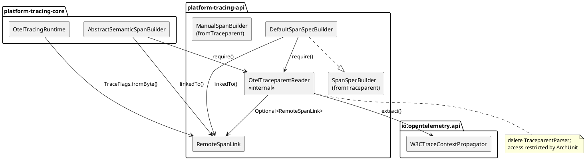

# Opus Refactoring Plan — TraceparentParser

> **Статус:** APPROVED (архитектурный комитет). **Codex readiness:** YES. Документ фиксирует утверждённый план рефакторинга; реализация — отдельный этап. Коммит не входит в scope.

---

## 1. Executive Verdict

**Решение: `DELETE_AND_REPLACE_WITH_OTEL`** — с двумя принципиальными поправками к консенсусу арбитражных советов (см. §3).

- Удалить `space.br1440.platform.tracing.api.propagation.TraceparentParser`.
- Делегировать разбор W3C `traceparent` официальному `io.opentelemetry.api.trace.propagation.W3CTraceContextPropagator`, который **уже в classpath** (`platform-tracing-core` объявляет `api 'io.opentelemetry:opentelemetry-api'`; `platform-tracing-api` — `compileOnly`).
- Экстрактор разместить **в `platform-tracing-api`** (internal, доступ ограничен ArchUnit), а **не** в `platform-tracing-core`, как предлагали все три совета.
- Сохранить публичные `SpanSpecBuilder.fromTraceparent(String...)` и `ManualSpanBuilder.fromTraceparent(String...)`.
- **Не** вводить новый публичный тип `RemoteTraceContext`; экстрактор возвращает `Optional<RemoteSpanLink>`.

**Почему это commercial-grade, а не косметика.** Самописный парсер не соответствует W3C Trace Context в четырёх местах (не валидирует `version`, не отклоняет `ff`, не проверяет длину `trace-flags`, использует regex-`split` без верхней границы длины) — это security-adjacent разбор недоверенного заголовка. Делегирование в OTel устраняет постоянные maintenance/security-обязательства по поддержке собственного парсера, гарантирует spec-conformance и forward-compatibility и **унифицирует** извлечение контекста с уже работающим production-путём Kafka (`KafkaBatchLinksAspect` использует OTel propagator). Это структурное упрощение публичного API и удаление кода, а не переименование.

## 1a. Решения архитектурного комитета (обязательные патчи, статус: APPROVED)

Комитет: `APPROVE WITH MANDATORY PATCHES` → после внесения ниже — `Codex readiness: YES`.

- **P0 — контракт зависимостей: решение A (keep `compileOnly`).** `platform-tracing-api` уже **не** OTel-runtime-free: `SemconvKeys` и `SpanEnrichment` в `api/src/main` импортируют `io.opentelemetry.api.common.AttributeKey` (артефакт `opentelemetry-api` — тот же, что содержит `W3CTraceContextPropagator`) и исполняются в runtime при активной трассировке. Значит `OtelTraceparentReader` **не вводит новую dependency-категорию**, а продолжает существующий provided-runtime контракт. `opentelemetry-api` остаётся `compileOnly`; повышать до `api` только ради reader'а нельзя (иначе модуль станет внутренне несогласованным — прочие OTel-using классы остались бы на `compileOnly`). Глобальный переход `compileOnly → api` — отдельное governance-решение вне этого PR. Требуется явно задокументировать реальный контракт в ADR и module description.
- **P1 — размещение/видимость: решение A (`api.propagation`, ArchUnit-restricted).** Класс остаётся в `api.propagation`, public-for-compilation, со строгим «internal bridge» Javadoc и ArchUnit-ограничением доступа (идиома `PRODUCTION_CHAIN_ACCESS_RESTRICTED`). Новый пакет `api.propagation.internal` **не** вводится (нет прецедента в модуле; ограничение всё равно обеспечивает ArchUnit).
- **P1 — SLF4J: разрешено, без новых зависимостей.** `slf4j-api` — уже `implementation` (runtime) зависимость `platform-tracing-api` (`build.gradle:11`, мост `RemoteServiceMdc`). `log.debug` в reader'е допустим и оформлен.
- **P1 — тесты W3C edge-cases: расширить** (+5 кейсов) и добавить **pre-flight-замер фактического поведения OTel** до фиксации ожиданий.
- **P2 — follow-up ADR (tracked):** (1) `RemoteSpanLink.traceFlags: byte` — signed-byte debt решён на границе parser'а и сохранён на границе `RemoteSpanLink`; (2) двухзаголовочный `traceparent + tracestate` API. Оба — отдельные будущие ADR, вне scope.

---

## 2. Independent Repository Findings

Проверено прямым чтением репозитория (ветка `master`).

| Finding | Evidence | Result |
|---|---|---|
| **Два** production call-site, а не один | `platform-tracing-api/.../api/span/spec/DefaultSpanSpecBuilder.java:79` (`TraceparentParser.requireTraceparent`) и `platform-tracing-core/.../core/manual/AbstractSemanticSpanBuilder.java:102-108` (`TraceparentParser.requireTraceparent`) | Советы учли только core-call-site. Размещение экстрактора в core **не скомпилируется** (api не зависит от core) |
| Публичный контракт `fromTraceparent` объявлен в двух интерфейсах | `api/span/spec/SpanSpecBuilder.java:28`, `api/manual/ManualSpanBuilder.java:29` | Обе сигнатуры — публичный API; сохраняем |
| Soft-путь `parseTraceparent` | `TraceOperationsV3Samples.java:160` (samples), `TraceparentParserTest` (tests) | Нет production-потребителей, кроме samples; переносим на экстрактор |
| `RemoteSpanLink` | `api/span/RemoteSpanLink.java` — `record(String traceId, String spanId, byte traceFlags, @Nullable String traceState)` + `sampled(...)` | Публичный value-тип; поле `byte traceFlags` не трогаем |
| Единственный потребитель `traceFlags` | `OtelTracingRuntime.java:139` → `TraceFlags.fromByte(link.traceFlags())` (bit-preserving); арифметики `traceFlags > 0` нигде нет | «Signed-byte 0xff → -1» — латентный, не боевой дефект |
| OTel API доступен | `platform-tracing-core/build.gradle:13` `api 'io.opentelemetry:opentelemetry-api'`; `platform-tracing-api/build.gradle` — `compileOnly` OTel api/context | Новая зависимость не нужна |
| **api уже требует `opentelemetry-api` в runtime** (P0-факт) | `SemconvKeys.java:3` и `SpanEnrichment.java:3` → `import io.opentelemetry.api.common.AttributeKey` (артефакт `opentelemetry-api`, тот же, что и `W3CTraceContextPropagator`); `TraceControlHeaderInjector`/`PlatformTraceContextKeys` → `io.opentelemetry.context.*` | Reader **не** вводит новый runtime-артефакт; premise «api OTel-runtime-free» неверна |
| `slf4j-api` — runtime-зависимость api | `platform-tracing-api/build.gradle:11` `implementation 'org.slf4j:slf4j-api'` (мост `RemoteServiceMdc`) | `log.debug` в reader'е безопасен, новой зависимости не нужно |
| OTel в api объявлен `compileOnly` | `platform-tracing-api/build.gradle:17,21` `compileOnly opentelemetry-context/-api` с комментарием «runtime предоставляется OTel Agent/SDK в потребляющем модуле» | Контракт «provided-runtime» уже действует; reader ему следует |
| ArchUnit governance | `OtelDirectIntegrationRules` (`FORBIDDEN_OTEL_SDK_SIMPLE_NAMES` включает `W3CTraceContextPropagator`, `TextMapPropagator`); Rule 1/3 запрещают **имена** классов, не **вызовы** | Нельзя называть класс `W3CTraceContextPropagator`; вызывать `getInstance()` — можно |
| Идиома «public-for-compilation + access restriction» | `ModuleTaxonomyArchRules.PRODUCTION_CHAIN_ACCESS_RESTRICTED`, `SAMPLING_RULE_IMPLS_ONLY_IN_POLICY` | Готовый паттерн для internal-типа, видимого между пакетами |
| Production Kafka-путь уже на OTel | `KafkaBatchLinksAspect.java:110` `getTextMapPropagator().extract(...)` | Делегирование в OTel = консистентность, а не новый механизм |
| Существующие тесты | `TraceparentParserTest`, `SpanSpecBuilderFinalStateTest` (methods `fromTraceparent_*`), `KafkaConsumerBatchLinksTest`, `KafkaBatchSpanBuilderIntegrationTest` | Требуют переписывания/переноса |

---

## 3. Review of Perplexity Conclusions

| Perplexity conclusion | Accept / Modify / Reject | Reason |
|---|---|---|
| «Заменить на OTel `W3CTraceContextPropagator`» | **Accept** | OTel уже в classpath, Apache-2.0, spec-conformant, forward-compatible; совпадает с production Kafka-путём |
| «Удалить `TraceparentParser`» | **Accept** | Публичный wire-parser в api не нужен; заменяется internal-экстрактором |
| «Разместить экстрактор в `core.propagation` (package-private), удалить из api» | **Reject** | Провальная фактическая посылка: call-site `DefaultSpanSpecBuilder` живёт в `platform-tracing-api`; api не может зависеть от core → не компилируется (тот же класс ошибки, что в PR #2/#3) |
| «Добавить публичный `RemoteTraceContext(int flags, …)` + `RemoteSpanLinkAdapter`» | **Reject** | Избыточный scope: `RemoteSpanLink` уже моделирует связь; параллельный публичный value-тип раздувает API. Экстрактор возвращает `Optional<RemoteSpanLink>` |
| «Сохранить `ManualSpanBuilder.fromTraceparent`» | **Accept** | Легитимный convenience; сигнатура остаётся, меняется только реализация |
| «`version=ff` принимать (forward-compat)» | **Modify** | Тонкость: `ff` — это *invalid version* по W3C §3.2.1 (запрещено), а не «будущая версия». OTel-propagator сам отклоняет `version=ff` → возвращаем поведение OTel как эталон, тест фиксирует **empty** для `ff-...`. Отдельно: неизвестная-но-валидная будущая версия (`01..fe`) с корректной базой — принимается OTel |
| «`RemoteSpanLink` сделать `int`/unsigned flags» | **Reject (defer)** | `traceFlags` (byte) бит-сохраняюще проходит через `TraceFlags.fromByte`; арифметических потребителей нет. Смена типа публичного record — отдельный breaking change без выгоды |
| «tracestate теперь сохраняется (fixed defect)» | **Modify** | `tracestate` — отдельный заголовок; из одной строки `traceparent` он невосстановим. Дизайн советов сам передаёт `null`. Документируем как неустранимое ограничение string-convenience; двухаргументный вариант — отдельный будущий ADR |
| «Три новых ArchUnit-правила, в т.ч. `W3C_PROPAGATOR_ONLY_IN_CORE_PROPAGATION`» | **Modify** | Правило «только в core.propagation» противоречит корректному размещению в api. Заменяем на: (a) `api.propagation` не содержит публичных `*Parser`; (b) доступ к экстрактору ограничен двумя билдерами (+tests) |

Разрешение противоречий между отчётами: расхождение «удалять / переписать / оставить» разрешается в пользу delete+delegate, но **точка размещения** берётся из прямой проверки репозитория, а не из отчётов (они единодушно ошиблись). Расхождение по «дефектам flags/tracestate» разрешается в сторону честного scoping: единственный содержательный технический аргумент — неполный W3C-conformance самописного парсера (deep-research), остальное — либо латентно, либо неустранимо на данном call-site.

---

## 4. Specification and Library Decision

### W3C Trace Context (факты, релевантные разбору)
- `traceparent` v`00`: `version "-" trace-id "-" parent-id "-" trace-flags`; длины ровно `2-32-16-2` hex, нижний регистр; общая длина строки v00 = 55.
- `version = ff` — **запрещённое** значение (invalid), заголовок игнорируется.
- `trace-id` = все нули и `parent-id`/`span-id` = все нули — **невалидны**, заголовок игнорируется.
- `trace-flags` — 8 бит; определён только бит `00000001` (sampled); прочие биты должны сохраняться, но не интерпретироваться.
- Forward-compat: для `version > 00` реализация обязана разобрать известные базовые поля и **не** делать предположений о неизвестном хвосте; «prohibitively large» заголовки допустимо отклонять (DoS-профиль).

### Поведение OpenTelemetry Java
- `W3CTraceContextPropagator.getInstance()` (артефакт `io.opentelemetry:opentelemetry-api`, пакет `io.opentelemetry.api.trace.propagation`) реализует `TextMapPropagator`.
- `extract(Context, carrier, getter)` при валидном `traceparent` кладёт remote `SpanContext`; при невалидном/отсутствующем — возвращает исходный `Context` (то есть `Span.fromContext(...).getSpanContext().isValid() == false`).
- `SpanContext` даёт `getTraceId()`, `getSpanId()`, `getTraceFlags().asByte()`, `getTraceState()`; `isRemote() == true` для извлечённого.
- OTel сам выполняет строгую W3C-валидацию (длины, hex, all-zero, `version=ff`), что снимает с нас поддержку собственного корпуса conformance.

### Dependency / licensing
- OpenTelemetry — Apache-2.0, CNCF, ежемесячные релизы, официальная поддержка Java 21. Governance-риск нулевой: новых артефактов не добавляем; используем уже присутствующий `opentelemetry-api`.

### Решение по библиотеке
**`USE_EXISTING_OTEL_API`.** Внешняя замена (Brave/Jaeger/Sleuth) не оправдана: Jaeger/Sleuth deprecated/archived; Brave — B3-centric. JDK-only переписывание парсера — жизнеспособная альтернатива, но проигрывает по стратегии для OTel-native платформы (см. §6 «Отклонённая альтернатива»). Оговорка: тезис «api slf4j-only runtime» фактически неверен — api уже требует `opentelemetry-api` в runtime (см. §2, §4 «Контракт зависимостей»).

### Контракт зависимостей (P0, решение комитета: A — keep `compileOnly`)
- `opentelemetry-api` остаётся `compileOnly` в `platform-tracing-api`; **новую зависимость PR не добавляет** и **не** повышает scope до `api`.
- Реальный контракт (уже действующий для `SemconvKeys`/`SpanEnrichment`/`TraceControlHeaderInjector`/`PlatformTraceContextKeys`): **OTel runtime предоставляется потребителем платформы** — `platform-tracing-core`, Spring Boot starter, OpenTelemetry Java Agent или граф зависимостей приложения. `OtelTraceparentReader` следует ровно этому контракту.
- Честная формулировка для архитекторов: «`platform-tracing-api` сам по себе не гарантирует OTel runtime без предоставленного платформенного runtime». Это надо задокументировать (ADR + module description), а не маскировать под «OTel в runtime не нужен».
- Глобальный перевод `compileOnly → api` (Вариант B) отклонён для этого PR: это отдельное dependency-governance-решение, затрагивающее **все** OTel-using классы api, а не только traceparent. Вариант C (перенос парсинга в core через хранение raw-строк в `SpanSpec`) отклонён: это крупный редизайн `SpanSpec`/core-runtime и он всё равно не убирает существующую OTel-runtime-потребность из `SemconvKeys`/`SpanEnrichment`.

---

## 5. Final Target Design

### Пакеты / классы / видимость

```
platform-tracing-api                                   [публичный контракт]
├── api.propagation
│   ├── TraceparentParser.java              DELETE
│   └── OtelTraceparentReader.java          CREATE — final, public-for-compilation,
│         Optional<RemoteSpanLink> read(String traceparent)        // soft
│         RemoteSpanLink require(String traceparent)               // strict
│         // делегирует W3CTraceContextPropagator.getInstance();
│         // строгий "internal bridge / not extension API" Javadoc;
│         // доступ ограничен ArchUnit-правилом; пакет api.propagation
│         // (без .internal — по решению комитета P1=A)
├── api.span
│   └── RemoteSpanLink.java                  UNCHANGED (byte traceFlags)
├── api.span.spec
│   ├── SpanSpecBuilder.java                 UNCHANGED (fromTraceparent сигнатура)
│   └── DefaultSpanSpecBuilder.java          MODIFY (вызывает OtelTraceparentReader)
└── api.manual
    └── ManualSpanBuilder.java               UNCHANGED (fromTraceparent сигнатура)

platform-tracing-core                                  [реализация]
└── core.manual
    └── AbstractSemanticSpanBuilder.java      MODIFY (вызывает OtelTraceparentReader)

platform-tracing-test                                  [governance]
└── test.arch
    └── (ModuleTaxonomyArchRules ИЛИ новый PropagationArchRules)  MODIFY/CREATE
          + API_PROPAGATION_NO_PUBLIC_WIRE_PARSERS
          + OTEL_TRACEPARENT_READER_ACCESS_RESTRICTED
```

### Границы владения

| Слой | Знает wire-format? | Знает OTel? | Public API? |
|---|---|---|---|
| `api.propagation.OtelTraceparentReader` | Да | Да (делегирует) | Нет (public только для cross-package компиляции; закрыт ArchUnit) |
| `api.span.spec.DefaultSpanSpecBuilder` | Нет (делегирует) | Косвенно | Нет (`final class`, package-private) |
| `api.manual.ManualSpanBuilder` | Да (String-param convenience) | Нет | Да |
| `core.manual.AbstractSemanticSpanBuilder` | Нет (делегирует) | Косвенно | Нет |

### Ключевые сигнатуры

```java
// api.propagation.OtelTraceparentReader
/**
 * Internal bridge from raw W3C {@code traceparent} values to {@link RemoteSpanLink}.
 *
 * <p>Public only for cross-package/module compilation inside the platform
 * implementation. NOT an extension API; application code must not use it.
 * Access is restricted by architecture tests.
 */
public final class OtelTraceparentReader {
    private OtelTraceparentReader() {}
    public static Optional<RemoteSpanLink> read(@Nullable String traceparent);   // soft
    public static RemoteSpanLink require(@Nonnull String traceparent);           // strict: IAE если невалиден
}
```

### PlantUML



---

## 6. ManualSpanBuilder.fromTraceparent Decision

**Решение: `KEEP_SIGNATURE_REWRITE_IMPLEMENTATION`.**

- Публичные сигнатуры `ManualSpanBuilder.fromTraceparent(String...)` и `SpanSpecBuilder.fromTraceparent(String...)` сохраняются: это легитимный ergonomic-контракт для приложений, у которых на руках raw-строка `traceparent`.
- Реализация в `AbstractSemanticSpanBuilder` и `DefaultSpanSpecBuilder` переписывается на `OtelTraceparentReader.require(tp)` → `linkedTo(link)`.
- **tracestate**: из одиночной строки `traceparent` недоступен (это отдельный W3C-заголовок). Осознанно откладываем: `require`/`read` строят `RemoteSpanLink` с `traceState == null` — ровно как сейчас. Полноценный контекст с `tracestate` уже корректно извлекается там, где есть оба заголовка — в `KafkaBatchLinksAspect` (OTel propagator, `linkedTo(RemoteSpanLink...)`). Будущий двухаргументный вход — отдельный ADR, вне scope.

### Отклонённая альтернатива (зафиксировать в доке)
`REWRITE_CUSTOM_PARSER` (bounded, regex-free, fixed-position JDK-only, в api, internal). Отклонено: платформа OTel-native, OTel уже парсит формат корректно, а поддержка собственного security-sensitive парсера — постоянный долг. Заявленная выгода «сохранить OTel-free-путь в api» **иллюзорна**: api main уже ссылается на `opentelemetry-api` (`SemconvKeys`, `SpanEnrichment`), то есть модуль и так не OTel-runtime-free; JDK-only парсер не убрал бы эту существующую зависимость.

---

## 7. Error and Failure Model

| Ситуация | `read()` (soft) | `require()` (strict) | Реализация билдеров |
|---|---|---|---|
| `traceparent == null` | `Optional.empty()` | `NullPointerException` (`Objects.requireNonNull`) | `fromTraceparent` делает `requireNonNull(tp, "traceparent")` до вызова |
| пустая/blank строка | `Optional.empty()` | `IllegalArgumentException("invalid traceparent: …")` | IAE — ошибка разработчика в билдер-цепочке |
| синтаксически некорректный (длина/hex/разделители) | `Optional.empty()` | `IllegalArgumentException` | IAE |
| all-zero trace-id/span-id | `Optional.empty()` (OTel invalid) | `IllegalArgumentException` | IAE |
| `version = ff` | `Optional.empty()` (OTel отклоняет) | `IllegalArgumentException` | IAE |
| валидная будущая версия (`01..fe`) с корректной базой | `Optional.of(link)` | `link` | link добавляется |
| валидный v00 | `Optional.of(link)` | `link` | `linkedTo(link)` |

- **Тип исключения strict-пути**: `IllegalArgumentException` (сохранение текущей семантики; `fromTraceparent` — developer-facing).
- **Логирование**: `read()` при отклонении — `log.debug` с **санитизацией** (обрезка до 128 символов, замена non-`\x20-\x7E` на `?`), без стектрейса, без утечки полного недоверенного заголовка. SLF4J разрешён без новой зависимости: `slf4j-api` — уже `implementation` (runtime) у `platform-tracing-api` (`build.gradle:11`, мост `RemoteServiceMdc`).
- **Санитизация**: применяется и в сообщении `IllegalArgumentException` (обрезанный, очищенный ввод), чтобы не логировать/не пробрасывать произвольные управляющие символы.
- **Soft vs strict граница**: `read()` — для циклов пакетного извлечения (samples, потенциальные batch-loops); `require()` — для `fromTraceparent(...)`, где невалидный ввод есть ошибка вызывающего.

---

## 8. Implementation Slices

> Все слайсы — отдельные reviewable-коммиты. Без aliases/`@Deprecated`-мостов. Verification — PowerShell (`;` вместо `&&`).

### Slice 0 — Characterization (только тесты, prod не тронут)
- Добавить `OtelTraceparentReader`-baseline пока нельзя (класса нет) → фиксируем текущее поведение существующих тестов как эталон: прогнать `TraceparentParserTest`, `SpanSpecBuilderFinalStateTest`, `KafkaConsumerBatchLinksTest`, `KafkaBatchSpanBuilderIntegrationTest` и зафиксировать зелёный baseline.
- Files created: —; modified: —; deleted: —; tests added: —.
- Verify: `./gradlew.bat :platform-tracing-api:test :platform-tracing-core:test`
- Expected: BUILD SUCCESSFUL (baseline).

### Slice 1 — Create `OtelTraceparentReader` (additive)
- Create `platform-tracing-api/.../api/propagation/OtelTraceparentReader.java` (delegate to `W3CTraceContextPropagator.getInstance()`; `read`/`require`; санитизация; SLF4J debug).
- Tests added: `OtelTraceparentReaderTest` (W3C conformance + negative + malicious, см. §10).
- Verify: `./gradlew.bat :platform-tracing-api:compileJava :platform-tracing-api:test`
- Expected: новые тесты зелёные; `TraceparentParser` ещё существует.

### Slice 2 — Switch both call-sites
- Modify `DefaultSpanSpecBuilder.fromTraceparent()` → `OtelTraceparentReader.require(tp)`; удалить import `TraceparentParser`.
- Modify `AbstractSemanticSpanBuilder.fromTraceparent()` → `OtelTraceparentReader.require(tp)`; удалить import `TraceparentParser`.
- Modify `TraceOperationsV3Samples` → `OtelTraceparentReader::read` вместо `TraceparentParser::parseTraceparent`.
- Verify: `./gradlew.bat :platform-tracing-api:compileJava :platform-tracing-core:compileJava` ; `Select-String -Path platform-tracing-core\...\AbstractSemanticSpanBuilder.java -Pattern TraceparentParser` → пусто.
- Expected: компиляция чистая; ссылок на `TraceparentParser` в prod не осталось.

### Slice 3 — Delete `TraceparentParser` + перенос тестов
- Delete `platform-tracing-api/.../api/propagation/TraceparentParser.java`.
- Delete/переписать `TraceparentParserTest` → покрытие переехало в `OtelTraceparentReaderTest`.
- Обновить `SpanSpecBuilderFinalStateTest`/Kafka-тесты, если они ссылались на `TraceparentParser` напрямую (заменить на `OtelTraceparentReader` или `RemoteSpanLink.sampled`).
- Verify: `rg TraceparentParser --glob *.java` (или `Select-String -Recurse`) → пусто; `./gradlew.bat build`.
- Expected: полный build зелёный; класс отсутствует в sources и в jar.

### Slice 4 — ArchUnit guardrails
- Add `API_PROPAGATION_NO_PUBLIC_WIRE_PARSERS` (в `api.propagation` нет публичных `*Parser`).
- Add `OTEL_TRACEPARENT_READER_ACCESS_RESTRICTED` (зависеть от `OtelTraceparentReader` могут только `DefaultSpanSpecBuilder`, `AbstractSemanticSpanBuilder`, `TraceOperationsV3Samples`, tests) — по образцу `PRODUCTION_CHAIN_ACCESS_RESTRICTED`.
- Verify: `./gradlew.bat :platform-tracing-api:test :platform-tracing-core:test :platform-tracing-test:test`
- Expected: правила зелёные.

### Slice 5 — Docs / ADR / post-audit
- Create `docs/decisions/ADR-traceparent-otel-delegation.md` (§13), включая раздел **Dependency contract**.
- Уточнить module description в `platform-tracing-api/build.gradle` (строка про «единственная runtime-зависимость slf4j»): честно отразить, что api уже использует OTel API типы в main и опирается на provided-runtime контракт (OTel предоставляется потребителем). Строку `compileOnly opentelemetry-api` **не менять**.
- Обновить упоминания в `docs/tracing/*kafka-batch-links*.md`, `docs/analysis/*inventory*` (замена `TraceparentParser` → `OtelTraceparentReader`; уточнение про tracestate). Пользовательские docs учат только публичный путь (`builder.fromTraceparent(...)`), а НЕ `OtelTraceparentReader.read(...)`.
- Заполнить post-audit (§14).
- Verify: `./gradlew.bat build`.
- Expected: зелёный build; документация консистентна.

---

## 9. Exact Create / Modify / Delete Set

### Create
| Path | Class | Visibility | Purpose |
|---|---|---|---|
| `platform-tracing-api/src/main/java/space/br1440/platform/tracing/api/propagation/OtelTraceparentReader.java` | `OtelTraceparentReader` | `public final` (доступ ограничен ArchUnit) | Делегирующий OTel-экстрактор `traceparent → RemoteSpanLink` |
| `platform-tracing-api/src/test/java/space/br1440/platform/tracing/api/propagation/OtelTraceparentReaderTest.java` | тест | test | W3C-conformance / negative / malicious |
| `docs/decisions/ADR-traceparent-otel-delegation.md` | — | — | ADR |
| (опц.) `platform-tracing-test/src/main/java/space/br1440/platform/tracing/test/arch/PropagationArchRules.java` | `PropagationArchRules` | `public` | Если не расширять `ModuleTaxonomyArchRules` |

### Modify
| Path | Change | Risk |
|---|---|---|
| `platform-tracing-api/.../api/span/spec/DefaultSpanSpecBuilder.java` | `fromTraceparent` → `OtelTraceparentReader.require`; убрать import | Низкий (внутренняя реализация) |
| `platform-tracing-core/.../core/manual/AbstractSemanticSpanBuilder.java` | `fromTraceparent` → `OtelTraceparentReader.require`; убрать import | Низкий |
| `platform-tracing-samples/.../TraceOperationsV3Samples.java` | `parseTraceparent` → `OtelTraceparentReader::read` | Низкий (samples) |
| `platform-tracing-api/.../api/span/spec/SpanSpecBuilderFinalStateTest.java` | при необходимости — заменить прямые ссылки | Низкий (test) |
| `platform-tracing-core/.../KafkaConsumerBatchLinksTest.java`, `KafkaBatchSpanBuilderIntegrationTest.java` | `TraceparentParser.requireTraceparent` → `OtelTraceparentReader.require` | Низкий (test) |
| `platform-tracing-test/.../ModuleTaxonomyArchRules.java` (или новый файл) | +2 правила | Низкий |
| `docs/tracing/*kafka-batch-links*.md`, `docs/analysis/*inventory*` | обновить имена/уточнить tracestate | Нулевой |

### Delete
| Path | Reason |
|---|---|
| `platform-tracing-api/.../api/propagation/TraceparentParser.java` | Заменён `OtelTraceparentReader`; публичный wire-parser в api не нужен |
| `platform-tracing-api/.../api/propagation/TraceparentParserTest.java` | Покрытие переехало в `OtelTraceparentReaderTest` |

---

## 10. Tests Required

### Slice 0.5 — Pre-flight probe фактического поведения OTel (обязателен до фиксации ожиданий)
До написания assert'ов прогнать одноразовый исследовательский тест на `W3CTraceContextPropagator.getInstance().extract(...)` и **зафиксировать реальный результат** (не догадки LLM) для:
- `version = ff` (`ff-<traceId>-<spanId>-01`);
- uppercase hex в `trace-id`/`span-id`;
- v00 с лишней 5-й частью (`00-<traceId>-<spanId>-01-extra`);
- v01 с лишней частью (`01-<traceId>-<spanId>-01-extra`);
- `trace-flags` длиной 1 (`...-1`) и длиной 3 (`...-001`).
Результаты (`isValid()` true/false, нормализация регистра) переносятся в ожидания тестов ниже. Расхождение отчётов по `version=ff` разрешается этим замером, а не обсуждением.

### `OtelTraceparentReaderTest` (api)
- `read_validV00_returnsSampledLink` — `00-4bf92f3577b34da6a3ce929d0e0e4736-00f067aa0ba902b7-01` → present; `traceId=4bf9…4736`, `spanId=00f0…02b7`, `traceFlags=(byte)0x01`, `traceState=null`.
- `read_uppercaseHex_isNormalizedOrRejectedPerOtel` — зафиксировать фактическое поведение OTel (W3C требует lowercase; тест закрепляет результат `getInstance().extract`).
- `read_allZeroTraceId_returnsEmpty`.
- `read_allZeroSpanId_returnsEmpty`.
- `read_null_returnsEmpty`; `read_blank_returnsEmpty`.
- `read_threePartsOnly_returnsEmpty`.
- `read_invalidHexInTraceId_returnsEmpty`.
- `read_wrongLengthTraceId_returnsEmpty` (31 символ).
- `read_versionFf_returnsEmpty` — `ff-…` (W3C invalid version).
- `read_flags00_notSampled` — `traceFlags == (byte)0x00`.
- `read_flagsFf_bitsPreserved` — `traceFlags == (byte)0xff` (== `-1` как byte; регресс-заметка: bit-preserving для `TraceFlags.fromByte`).
- `read_prohibitivelyLongInput_returnsEmpty` — вход ~10k символов → empty (DoS).
- `read_v00WithExtraPart_returnsEmpty` — `00-<traceId>-<spanId>-01-extra` (v00 не допускает хвост) → зафиксировать по pre-flight.
- `read_traceFlagsOneHexDigit_returnsEmpty` — `...-1`.
- `read_traceFlagsThreeHexDigits_returnsEmpty` — `...-001`.
- `read_uppercaseTraceId_behaviorIsDocumented` — закрепить фактическое поведение OTel (reject или normalize) по pre-flight, без догадок.
- `read_validFutureVersion01_behaviorIsDocumented` — `01-<traceId>-<spanId>-01-extra`: закрепить фактическое поведение OTel (forward-compat present vs empty) по pre-flight.
- `require_valid_returnsLink`.
- `require_invalid_throwsIllegalArgumentException` — message содержит `invalid traceparent` и санитизирован.
- `require_null_throwsNpe`.

### `SpanSpecBuilderFinalStateTest` (api, обновить существующие)
- `fromTraceparent_parsesSingleTraceparentIntoLinks` (валид).
- `fromTraceparent_multipleTraceparents_areAdditive`.
- `fromTraceparent_invalidValue_throws` (`IllegalArgumentException`, `invalid traceparent`).
- `fromTraceparentThenChild_isInvalid` (сохранить существующий инвариант билдера).

### `AbstractSemanticSpanBuilder`-путь (core, интеграция)
- `fromTraceparent_validTp_spanHasLinkWithTraceId`.
- `fromTraceparent_invalidTp_throwsIllegalArgumentException`.
- `fromTraceparent_nullElement_throwsNpe`.
- `fromTraceparent_valid_then_invalid_throwsOnSecond`.
- Kafka: `KafkaConsumerBatchLinksTest`, `KafkaBatchSpanBuilderIntegrationTest` — `fromTraceparent` даёт ожидаемые ROOT+links.

### ArchUnit
- `apiPropagationHasNoPublicWireParsers` — в `..api.propagation..` нет публичных `*Parser`.
- `otelTraceparentReaderAccessRestricted` — зависимые классы `OtelTraceparentReader` ⊆ {`DefaultSpanSpecBuilder`, `AbstractSemanticSpanBuilder`, `TraceOperationsV3Samples`, `..test..`}.
- (регресс) `OtelDirectIntegrationRules.NO_LOCAL_COPIES_OF_OTEL_SDK_CLASSES` — остаётся зелёным (новый класс не назван `W3CTraceContextPropagator`).

---

## 11. Do-Not-Touch List

| Файл / контракт | Причина |
|---|---|
| `api/span/RemoteSpanLink.java` (`byte traceFlags`) | Публичный value-тип; смена типа — отдельный breaking change без выгоды; bit-preserving через `TraceFlags.fromByte` |
| `api/manual/ManualSpanBuilder.java`, `api/span/spec/SpanSpecBuilder.java` (сигнатуры `fromTraceparent`) | Публичный контракт заморожен; меняется только реализация |
| `core/runtime/otel/OtelTracingRuntime.java` | Единственный потребитель `traceFlags`; корректен, вне scope |
| `core/propagation/OtelPlatformContextPropagation.java`, `NoOpPlatformContextPropagation.java` | Ортогональны задаче |
| `spring-boot-autoconfigure/.../kafka/KafkaBatchLinksAspect.java` | Уже корректно извлекает контекст через OTel propagator (в т.ч. tracestate) |
| `platform-tracing-test/.../OtelDirectIntegrationRules.java` | Существующие правила не меняем; используем как guardrail |
| `platform-tracing-api/build.gradle` (OTel `compileOnly`), `platform-tracing-core/build.gradle` | Новых зависимостей не добавляем; `compileOnly` сохраняем (§Executive decision) |
| `DefaultHttpTracing`, `DefaultKafkaTracing`, `DefaultRpcTracing` | Наследуют `AbstractSemanticSpanBuilder`; конструкторы не трогаем — изменение подхватится автоматически |

---

## 12. Verification Commands (PowerShell)

```powershell
# Slice 0 — baseline
cd E:\Platform_Traces
.\gradlew.bat :platform-tracing-api:test :platform-tracing-core:test

# Slice 1 — новый класс + тесты
.\gradlew.bat :platform-tracing-api:compileJava :platform-tracing-api:test

# Slice 2 — переключение call-sites; проверка отсутствия импорта
.\gradlew.bat :platform-tracing-api:compileJava :platform-tracing-core:compileJava
Select-String -Path "platform-tracing-core\src\main\java\space\br1440\platform\tracing\core\manual\AbstractSemanticSpanBuilder.java" -Pattern "TraceparentParser"   # ожидается: пусто
Select-String -Path "platform-tracing-api\src\main\java\space\br1440\platform\tracing\api\span\spec\DefaultSpanSpecBuilder.java" -Pattern "TraceparentParser"        # ожидается: пусто

# Slice 3 — удаление; ноль ссылок; полный build
rg "TraceparentParser" --glob "*.java"      # ожидается: пусто (или Get-ChildItem -Recurse -Filter *.java | Select-String TraceparentParser)
.\gradlew.bat build

# P0 — проверка контракта зависимостей (reader не добавил нового артефакта)
.\gradlew.bat :platform-tracing-api:dependencies --configuration compileClasspath
.\gradlew.bat :platform-tracing-api:dependencies --configuration runtimeClasspath
# ожидается: opentelemetry-api присутствует в compileClasspath как compileOnly (не в runtimeClasspath api),
# как и раньше для SemconvKeys/SpanEnrichment; никаких новых артефактов из-за reader'а.
# Если отчёт слишком шумный — зафиксировать в post-audit релевантные строки build.gradle.
Select-String -Path "platform-tracing-api\build.gradle" -Pattern "opentelemetry-api"   # ожидается: compileOnly (без изменений)

# api-jar не содержит TraceparentParser, содержит OtelTraceparentReader
$jar = Get-ChildItem -Recurse -Path "platform-tracing-api\build\libs" -Filter "platform-tracing-api-*.jar" | Where-Object { $_.Name -notmatch "sources|javadoc" } | Select-Object -First 1
jar tf $jar.FullName | Select-String "Traceparent"

# Slice 4 — ArchUnit
.\gradlew.bat :platform-tracing-test:test :platform-tracing-api:test :platform-tracing-core:test

# Slice 5 — финальный полный прогон
.\gradlew.bat build
```

---

## 13. ADR Draft (`docs/decisions/ADR-traceparent-otel-delegation.md`)

```markdown
# ADR — Делегирование разбора W3C traceparent в OpenTelemetry

| Поле | Значение |
|---|---|
| Статус | PROPOSED |
| Дата | 2026-07-14 |
| Контекст | Рефакторинг api.propagation.TraceparentParser (pre-production) |

## Контекст
`TraceparentParser` (platform-tracing-api) — самописный разбор W3C `traceparent`:
- не валидирует поле `version` и не отклоняет запрещённое `ff`;
- не проверяет длину `trace-flags` (ровно 2 hex);
- использует regex `String.split("-")` без верхней границы длины входа (security-adjacent разбор недоверенного заголовка);
- всегда возвращает `traceState = null` (из одной строки `traceparent` tracestate невосстановим — это отдельный заголовок).

Класс — публичный wire-parser в api-слое. Живые call-site: `DefaultSpanSpecBuilder`
(модуль platform-tracing-api) и `AbstractSemanticSpanBuilder` (модуль platform-tracing-core).
OTel API уже в classpath (`opentelemetry-api`: `api` в core, `compileOnly` в api).
Production-путь Kafka batch (`KafkaBatchLinksAspect`) уже извлекает контекст
через OTel `TextMapPropagator`.

## Решение
Удалить `TraceparentParser`. Ввести internal-делегат `OtelTraceparentReader`
в `api.propagation`, использующий `io.opentelemetry.api.trace.propagation.W3CTraceContextPropagator`.
`read()` — soft (Optional), `require()` — strict (IllegalArgumentException).
Экстрактор возвращает `RemoteSpanLink` (существующий публичный тип); новый публичный
value-объект не вводится. Публичные `SpanSpecBuilder.fromTraceparent` и
`ManualSpanBuilder.fromTraceparent` сохраняются; меняется только реализация.
Доступ к `OtelTraceparentReader` ограничен ArchUnit (не extension API).

## Отклонённые альтернативы
- Перенос парсера в `core.propagation` (предложение арбитражных советов) — не компилируется:
  call-site `DefaultSpanSpecBuilder` в api, а api не зависит от core.
- Новый публичный `RemoteTraceContext(int flags, …)` + adapter — избыточный scope; `RemoteSpanLink` достаточен.
- JDK-only bounded rewrite — жизнеспособно (сохраняет slf4j-only runtime у api), но проигрывает
  по стратегии OTel-native платформе и оставляет собственный security-sensitive парсер.
- Смена `RemoteSpanLink.traceFlags` на `int` — не требуется: byte bit-preserving через `TraceFlags.fromByte`.

## Dependency contract

`platform-tracing-api` is not an OTel-runtime-free artifact. The module already
uses OpenTelemetry API types in main API code (`SemconvKeys`, `SpanEnrichment`
reference `io.opentelemetry.api.common.AttributeKey`) while declaring
`opentelemetry-api` as `compileOnly`.

This refactor keeps that existing dependency model unchanged:

- `opentelemetry-api` remains `compileOnly` in `platform-tracing-api`;
- the runtime is provided by the platform consumer, normally through
  `platform-tracing-core`, the Spring Boot starter, the OpenTelemetry agent, or
  the application dependency graph;
- `OtelTraceparentReader` follows the same provided-runtime contract as the
  existing OTel-using API classes.

This PR does not promote `opentelemetry-api` to a transitive `api` dependency.
A global change from `compileOnly` to `api` for `platform-tracing-api` would be
a separate dependency-governance decision affecting all OTel-using API classes,
not just traceparent parsing.

## Последствия
- (+) W3C-conformance и forward-compatibility делегированы OTel; свой корпус conformance не нужен.
- (+) Единый механизм извлечения контекста с production Kafka-путём.
- (+) Удалён публичный wire-parser из api; поверхность API сокращена.
- (+) Нет новых зависимостей и новых dependency-категорий; Apache-2.0; governance-риск нулевой.
- (−) BREAKING: `TraceparentParser` удалён из публичного API (обратная совместимость не требуется).
- (−) Путь `fromTraceparent(String...)` по-прежнему не несёт `tracestate`. Это **ограничение формата, не дефект**:
  из одной строки `traceparent` `tracestate` невосстановим — это отдельный W3C-заголовок.
  **Данный рефактор улучшает conformance разбора `traceparent`, но НЕ делает `fromTraceparent(String...)`
  tracestate-aware.** Поддержка `tracestate` требует нового API, принимающего оба заголовка
  (`traceparent` + `tracestate`), — отдельный будущий ADR.
- (−) `RemoteSpanLink.traceFlags` остаётся `byte` по scope. Signed-byte debt **решён на границе parser'а
  и сохранён (bit-preserving) на границе `RemoteSpanLink`** (`TraceFlags.fromByte`), а не «signed-byte problem solved».
  Полное решение (`byte → int`/`TraceFlags`-like либо методы `sampled()`/`traceFlagsUnsigned()`) —
  отдельный tracked follow-up ADR. В этом PR достаточно adapter-теста, показывающего `(byte)0xff == -1`.
- (−) `platform-tracing-api` сам по себе не гарантирует OTel runtime без предоставленного платформенного
  runtime — это уже действующий контракт модуля, теперь задокументированный явно.

## Governance зависимостей
Используется уже присутствующий `opentelemetry-api` (Apache-2.0). Новые артефакты не добавляются.
Класс не именуется `W3CTraceContextPropagator`/`TextMapPropagator` (см. OtelDirectIntegrationRules).
```

---

## 14. Post-Audit Checklist

- [ ] `TraceparentParser.java` удалён; `rg TraceparentParser --glob *.java` → пусто.
- [ ] `OtelTraceparentReader` создан в `api.propagation` (без `.internal`); не именован как запрещённые OTel-типы; имеет строгий «internal bridge / not extension API» Javadoc.
- [ ] **P0:** `opentelemetry-api` в `platform-tracing-api` остаётся `compileOnly` — согласованно с существующим OTel-использованием (`SemconvKeys`/`SpanEnrichment`).
- [ ] **P0:** `OtelTraceparentReader` не вводит новый dependency-артефакт (сверка `:platform-tracing-api:dependencies`).
- [ ] **P0:** runtime-пути покрыты в модулях, где OTel реально присутствует (`platform-tracing-core` / starter / e2e).
- [ ] **P0:** явно задокументировано (ADR + module description), что `platform-tracing-api` сам по себе не гарантирует OTel runtime без предоставленного платформенного runtime.
- [ ] **P1:** `slf4j-api` остаётся `implementation` у api; логирование reader'а не добавило зависимостей.
- [ ] `DefaultSpanSpecBuilder.fromTraceparent` и `AbstractSemanticSpanBuilder.fromTraceparent` вызывают `OtelTraceparentReader.require`; импорты `TraceparentParser` удалены.
- [ ] `SpanSpecBuilder.fromTraceparent` / `ManualSpanBuilder.fromTraceparent` сигнатуры не изменены.
- [ ] `RemoteSpanLink` не изменён (`byte traceFlags`).
- [ ] `read()` санитизирует и логирует на `debug`; `require()` бросает `IllegalArgumentException` с санитизированным сообщением.
- [ ] `version=ff`, all-zero id, blank, null, >maxLen — покрыты тестами и отклоняются.
- [ ] `flags=ff` тест фиксирует bit-preserving `(byte)0xff`.
- [ ] ArchUnit: нет публичных `*Parser` в `api.propagation`; доступ к `OtelTraceparentReader` ограничен списком.
- [ ] `OtelDirectIntegrationRules` остаются зелёными.
- [ ] `TraceOperationsV3Samples` использует `OtelTraceparentReader::read`.
- [ ] Документы (kafka-batch-links, inventory) обновлены; ADR добавлен.
- [ ] `./gradlew.bat build` — BUILD SUCCESSFUL; api-jar содержит `OtelTraceparentReader`, не содержит `TraceparentParser`.
- [ ] Коммиты по слайсам; без aliases/`@Deprecated`-мостов; не запушено без явного указания.

---

## 15. Codex Implementation Prompt (English)

```
You are a senior Java engineer implementing an approved, breaking refactoring in a
multi-module Gradle repository (Windows, PowerShell). Repository root: E:\Platform_Traces.
Platform: enterprise Spring Boot tracing platform, pre-production.
Backward compatibility: NOT required. Aliases / @Deprecated bridges: FORBIDDEN.
Do not commit. Do not push. Make no unrelated refactors.

GOAL
Delete space.br1440.platform.tracing.api.propagation.TraceparentParser and delegate
W3C traceparent parsing to io.opentelemetry.api.trace.propagation.W3CTraceContextPropagator,
via a new internal delegate in platform-tracing-api. Keep the public fromTraceparent(String...)
builder methods unchanged.

PRE-FLIGHT INSPECTION (read-only first; confirm before editing)
1. Confirm TWO production call-sites of TraceparentParser.requireTraceparent:
   - platform-tracing-api/src/main/java/space/br1440/platform/tracing/api/span/spec/DefaultSpanSpecBuilder.java
   - platform-tracing-core/src/main/java/space/br1440/platform/tracing/core/manual/AbstractSemanticSpanBuilder.java
2. Confirm samples use TraceparentParser.parseTraceparent in
   platform-tracing-samples/.../TraceOperationsV3Samples.java
3. Confirm RemoteSpanLink is record(String traceId, String spanId, byte traceFlags, @Nullable String traceState).
4. Confirm opentelemetry-api is on the classpath (core build.gradle: api 'io.opentelemetry:opentelemetry-api';
   api build.gradle: compileOnly). Do NOT add dependencies.
5. Confirm OtelDirectIntegrationRules forbids class simple names "W3CTraceContextPropagator"/"TextMapPropagator".
   Therefore do NOT name any new class those names.
6. Confirm platform-tracing-api build.gradle: opentelemetry-api is compileOnly and slf4j-api is implementation.
   Do NOT change these. Do NOT promote opentelemetry-api to api. Do NOT add slf4j (already present).

PRE-FLIGHT BEHAVIOR PROBE (do before writing test assertions)
Write a temporary experiment (a scratch @Test or a throwaway main) calling
W3CTraceContextPropagator.getInstance().extract(...) and RECORD the actual result
(isValid true/false, case normalization) for each of:
  - "ff-<traceId>-<spanId>-01"                 (version ff)
  - uppercase hex in trace-id/span-id
  - "00-<traceId>-<spanId>-01-extra"           (v00 extra part)
  - "01-<traceId>-<spanId>-01-extra"           (v01 extra part / forward-compat)
  - "00-<traceId>-<spanId>-1"                   (flags length 1)
  - "00-<traceId>-<spanId>-001"                 (flags length 3)
Use the observed results as the expected values below. Do NOT guess. Delete the scratch experiment afterwards.

IMPLEMENTATION
Step 1 — Create platform-tracing-api/.../api/propagation/OtelTraceparentReader.java:
  public final class with private constructor.
  Add strict Javadoc: "Internal bridge from raw W3C traceparent values to RemoteSpanLink.
  Public only for cross-package/module compilation inside the platform implementation.
  NOT an extension API; application code must not use it. Access is restricted by architecture tests."
  Keep it in package space.br1440.platform.tracing.api.propagation (NO .internal subpackage).
  static Optional<RemoteSpanLink> read(@Nullable String traceparent):
    - null/blank -> Optional.empty();
    - build Map<String,String> carrier {"traceparent": value};
    - Context ctx = W3CTraceContextPropagator.getInstance().extract(Context.root(), carrier, getter);
    - SpanContext sc = Span.fromContext(ctx).getSpanContext();
    - if (!sc.isValid()) { log.debug("rejected traceparent: {}", sanitize(value)); return empty; }
    - return Optional.of(new RemoteSpanLink(sc.getTraceId(), sc.getSpanId(),
        sc.getTraceFlags().asByte(), null));   // tracestate not recoverable from a single header
  static RemoteSpanLink require(@Nonnull String traceparent):
    - Objects.requireNonNull(traceparent, "traceparent");
    - read(traceparent).orElseThrow(() -> new IllegalArgumentException("invalid traceparent: " + sanitize(traceparent)));
  private static String sanitize(String raw): trim to 128 chars, replace [^\x20-\x7E] with '?'.
  private static inner enum TextMapGetter singleton (keys()->carrier.keySet(); get(c,k)-> k==null?null:c.get(k.toLowerCase(Locale.ROOT))).
  SLF4J logger. No Spring annotations.

Step 2 — Modify DefaultSpanSpecBuilder.fromTraceparent(String...):
  replace TraceparentParser.requireTraceparent(tp) with OtelTraceparentReader.require(tp);
  remove import of TraceparentParser; add import of OtelTraceparentReader.
Step 3 — Modify AbstractSemanticSpanBuilder.fromTraceparent(String...): same replacement;
  do NOT change any constructor signature.
Step 4 — Modify TraceOperationsV3Samples: TraceparentParser::parseTraceparent -> OtelTraceparentReader::read.
Step 5 — Delete platform-tracing-api/.../api/propagation/TraceparentParser.java and its test
  TraceparentParserTest.java. Recreate coverage as OtelTraceparentReaderTest.java (see cases below).
  Update SpanSpecBuilderFinalStateTest, KafkaConsumerBatchLinksTest, KafkaBatchSpanBuilderIntegrationTest
  to use OtelTraceparentReader.require or RemoteSpanLink.sampled instead of TraceparentParser.
Step 6 — Add two ArchUnit rules (extend ModuleTaxonomyArchRules or new PropagationArchRules in
  platform-tracing-test):
    - no public classes with simple name ending "Parser" in ..api.propagation..;
    - only DefaultSpanSpecBuilder, AbstractSemanticSpanBuilder, TraceOperationsV3Samples, ..test..
      may depend on OtelTraceparentReader (pattern: onlyHaveDependentClassesThat().resideInAnyPackage/haveFQN).
  Wire them into the api/core/test ArchTest holders. allowEmptyShould(true).

TESTS (OtelTraceparentReaderTest) — cover:
  valid v00 -> present (traceId, spanId, flags=(byte)0x01, traceState=null);
  all-zero traceId -> empty; all-zero spanId -> empty; null -> empty; blank -> empty;
  3 parts -> empty; invalid hex -> empty; traceId length 31 -> empty;
  version "ff" -> (per pre-flight); flags "00" -> traceFlags==(byte)0; flags "ff" -> traceFlags==(byte)0xff;
  prohibitively long input (~10k) -> empty;
  v00 extra part -> (per pre-flight); flags length 1 -> (per pre-flight); flags length 3 -> (per pre-flight);
  uppercase trace-id -> (per pre-flight, documented); future version "01" extra part -> (per pre-flight, documented);
  require(valid) -> link; require(invalid) -> IllegalArgumentException with "invalid traceparent";
  require(null) -> NullPointerException.

CONSTRAINTS
  - Do NOT change ManualSpanBuilder/SpanSpecBuilder signatures.
  - Do NOT change RemoteSpanLink (byte traceFlags stays).
  - Do NOT name any class "W3CTraceContextPropagator"/"TextMapPropagator".
  - Do NOT add Spring annotations to OtelTraceparentReader.
  - Do NOT add new Gradle dependencies. Keep api OTel dependency compileOnly.
  - Do NOT modify OtelPlatformContextPropagation, KafkaBatchLinksAspect, OtelDirectIntegrationRules.
  - No aliases, no @Deprecated bridges.

VERIFICATION (PowerShell; run per step)
  cd E:\Platform_Traces
  .\gradlew.bat :platform-tracing-api:compileJava :platform-tracing-core:compileJava
  .\gradlew.bat :platform-tracing-api:test :platform-tracing-core:test :platform-tracing-test:test
  rg "TraceparentParser" --glob "*.java"   # expected: empty
  .\gradlew.bat build

POST-AUDIT
  Produce docs/analysis/traceparent-parser-post-audit.md summarizing: files created/modified/deleted,
  grep proof of zero TraceparentParser references, test results, ArchUnit results, confirmation
  that the api-jar contains OtelTraceparentReader and not TraceparentParser, and the recorded
  pre-flight OTel behavior for version=ff / uppercase / extra-part / flags length. Also confirm that
  opentelemetry-api stayed compileOnly in platform-tracing-api and that the reader added no new
  dependency artifact (capture relevant build.gradle snippet + :platform-tracing-api:dependencies).
  Do NOT commit.
```
