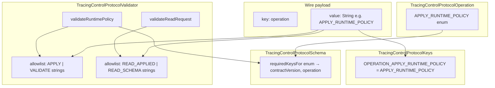

# TracingControlProtocolOperation — материал для обсуждения Javadoc

Документ собран для архитектурного обсуждения **комментариев к enum-классу и его константам**.  
Содержит фактическое состояние кода, связь enum ↔ wire string, использование в schema/validator и открытые вопросы.

**Дата сбора:** 2026-07-03  
**Scope:** `space.br1440.platform.tracing.api.control.protocol.schema` + потребители operation в validation/tests/docs.

**См. также:** [tracing-control-protocol-field-category-discussion.md](tracing-control-protocol-field-category-discussion.md) — category policy зависит от validator entrypoint, который группирует operation.

---

## 1. Текущее состояние исходника

### 1.1 `TracingControlProtocolOperation.java`

Публичный enum, **без class-level и constant-level Javadoc**, без методов.

```java
public enum TracingControlProtocolOperation {

    APPLY_RUNTIME_POLICY,
    VALIDATE_RUNTIME_POLICY,
    READ_APPLIED_STATE,
    READ_SCHEMA

}
```

| Метрика | Значение |
|---------|----------|
| Файл | `platform-tracing-api/src/main/java/.../schema/TracingControlProtocolOperation.java` |
| Строк | 10 |
| Констант | 4 |
| Методов | 0 (только `values()` / `valueOf()`) |

### 1.2 Исторический контекст

| Было | Стало |
|------|-------|
| Operation names только как `String` constants в `TracingControlWireKeys` | Typed enum + те же `String` constants в `TracingControlProtocolKeys` |
| `requiredKeysForRuntimeApply()` / `requiredKeysForReadRequest()` | Единый `requiredKeysFor(TracingControlProtocolOperation)` |

Источники: [tracing-control-protocol-refactoring-plan.md](tracing-control-protocol-refactoring-plan.md) §8, [ADR-control-protocol-version-model.md](../decisions/ADR-control-protocol-version-model.md).

---

## 2. Двойное представление operation

Operation существует в protocol в **двух формах** — это ключевой момент для Javadoc.

| Представление | Где | Назначение |
|---------------|-----|------------|
| **Java enum** | `TracingControlProtocolOperation` | Typed API schema: requiredness, `requiredKeysFor(operation)` |
| **Wire string** | payload key `"operation"` → value `"APPLY_RUNTIME_POLICY"`, … | Значение на wire boundary (`Map<String,Object>`) |

### 2.1 Соответствие enum constant ↔ wire string (v1)

Имена enum constants **совпадают byte-for-byte** с wire values в `TracingControlProtocolKeys`:

| Enum constant | Wire constant | Wire string value |
|---------------|---------------|-------------------|
| `APPLY_RUNTIME_POLICY` | `Keys.OPERATION_APPLY_RUNTIME_POLICY` | `"APPLY_RUNTIME_POLICY"` |
| `VALIDATE_RUNTIME_POLICY` | `Keys.OPERATION_VALIDATE_RUNTIME_POLICY` | `"VALIDATE_RUNTIME_POLICY"` |
| `READ_APPLIED_STATE` | `Keys.OPERATION_READ_APPLIED_STATE` | `"READ_APPLIED_STATE"` |
| `READ_SCHEMA` | `Keys.OPERATION_READ_SCHEMA` | `"READ_SCHEMA"` |

**Нет** метода `wireValue()` / `fromWireString()` на enum — mapping не централизован в типе operation, а дублируется через naming convention + `TracingControlProtocolKeys`.

Payload field:

```text
key   = "operation"          // TracingControlProtocolKeys.OPERATION
value = "APPLY_RUNTIME_POLICY"  // String, не enum name() через API
```

Validator проверяет allowlist через `List<String>` wire constants, не через `TracingControlProtocolOperation` enum.

---

## 3. Роль operation в модели schema

```text
TracingControlProtocolFieldDescriptor
├── key, type, category
└── requiredForOperations: Set<TracingControlProtocolOperation>
         ↑
         единственное production-использование enum в schema (кроме requiredKeysFor)
```

### 3.1 `requiredKeysFor(TracingControlProtocolOperation operation)`

```java
public Set<String> requiredKeysFor(TracingControlProtocolOperation operation) {
    Objects.requireNonNull(operation, "operation");
    return fieldsByKey.values().stream()
            .filter(descriptor -> descriptor.requiredForOperations().contains(operation))
            .map(TracingControlProtocolFieldDescriptor::key)
            .collect(Collectors.toUnmodifiableSet());
}
```

v1 факт: только `contractVersion` и `operation` помечены required — через `putRequired(..., ALL_OPERATIONS)` где `ALL_OPERATIONS = EnumSet.allOf(TracingControlProtocolOperation.class)`.

**Следствие для v1:** для **любой** из 4 operation required set идентичен:

```text
{ "contractVersion", "operation" }
```

Зафиксировано тестом `RequiredKeysEquivalenceTest` (`@EnumSource` по всем constants).

### 3.2 Forward-looking design (v2)

Refactoring plan (RF-005): descriptor с `Set<TracingControlProtocolOperation>` позволяет в будущем diverge required keys по operation (напр. `correlationId` только для `READ_*`).  
Сегодня это **behavior-equivalent** для всех 4 constants; параметр `operation` в `requiredKeysFor` — не косметика, а подготовка schema.

---

## 4. Группировка operation: runtime mutation vs read

```text
Runtime mutation entry (validateRuntimePolicy):
  APPLY_RUNTIME_POLICY
  VALIDATE_RUNTIME_POLICY

Read entry (validateReadRequest):
  READ_APPLIED_STATE
  READ_SCHEMA
```

Документировано в [platform-tracing-wire-schema-v1.md](../architecture/platform-tracing-wire-schema-v1.md) §8 Operations.

| Wire value | Краткое назначение (из wire schema doc) |
|------------|----------------------------------------|
| `APPLY_RUNTIME_POLICY` | Future apply path (PR-3+) |
| `VALIDATE_RUNTIME_POLICY` | Dry-run validation |
| `READ_APPLIED_STATE` | Read request |
| `READ_SCHEMA` | Schema introspection |

---

## 5. Validator: как operation используется (и где — нет)

### 5.1 Public entry methods

| Method | `requiredKeysFor(...)` argument | Allowlist wire strings | `allowRuntimePolicyFields` |
|--------|--------------------------------|------------------------|----------------------------|
| `validateRuntimePolicy` | `APPLY_RUNTIME_POLICY` | `APPLY_RUNTIME_POLICY`, `VALIDATE_RUNTIME_POLICY` | `true` |
| `validateReadRequest` | `READ_APPLIED_STATE` | `READ_APPLIED_STATE`, `READ_SCHEMA` | `false` |

Allowlists — `List<String>` в `TracingControlProtocolValidator`, порядок детерминирован (Phase 3 refactor):

```text
Runtime: APPLY_RUNTIME_POLICY|VALIDATE_RUNTIME_POLICY
Read:    READ_APPLIED_STATE|READ_SCHEMA
```

### 5.2 Разрыв enum ↔ validator allowlist

| Аспект | Использует `TracingControlProtocolOperation`? |
|--------|-----------------------------------------------|
| `requiredKeysFor` в entry methods | **Да** (но только как representative constant группы) |
| Operation allowlist check | **Нет** — `TracingControlProtocolKeys.OPERATION_*` strings |
| Category policy (`allowRuntimePolicyFields`) | **Нет** — boolean на уровне entry method |
| Wire value validation (`operation` must be String) | **Нет** — сравнение со `String` allowlist |

**Smell (inventory):** allowlists захардкожены в validator, не выводятся из enum или schema. Enum и wire constants синхronized только по naming discipline.

### 5.3 Latent coupling: representative `requiredKeysFor` argument

`validateReadRequest` всегда вызывает:

```java
schema.requiredKeysFor(TracingControlProtocolOperation.READ_APPLIED_STATE)
```

даже когда payload `operation = "READ_SCHEMA"`.  
Безопасно в v1 (required sets equal), но при v2 divergence может потребовать derive from payload operation.

---

## 6. Runtime semantics по operation (через entrypoint)

Validator не ветвится по конкретной operation внутри группы — только по entry method + allowlist.

### 6.1 Матрица: wire operation × entry method

| Payload `operation` | `validateRuntimePolicy` | `validateReadRequest` |
|---------------------|-------------------------|----------------------|
| `APPLY_RUNTIME_POLICY` | valid (if payload ok) | `OPERATION_NOT_ALLOWED` |
| `VALIDATE_RUNTIME_POLICY` | valid | `OPERATION_NOT_ALLOWED` |
| `READ_APPLIED_STATE` | `OPERATION_NOT_ALLOWED` | valid |
| `READ_SCHEMA` | `OPERATION_NOT_ALLOWED` | valid |
| not String | `TYPE_MISMATCH` | `TYPE_MISMATCH` |
| wrong group | `OPERATION_NOT_ALLOWED` | `OPERATION_NOT_ALLOWED` |

Violation при wrong allowlist:

- code: `OPERATION_NOT_ALLOWED`
- reason: `"unsupported operation for this validation entry point"`
- expectedType: `String.join("|", allowedOperations)` (deterministic order)

### 6.2 Category policy (косвенно от entry, не от enum)

Одинакова для всех operation внутри группы:

- `validateRuntimePolicy` → runtime policy fields allowed
- `validateReadRequest` → runtime policy fields rejected

См. [tracing-control-protocol-field-category-discussion.md](tracing-control-protocol-field-category-discussion.md) §5.

---

## 7. Смежный код

| Type | Связь с operation |
|------|-------------------|
| `TracingControlProtocolKeys` | 4 wire string constants + key `"operation"` |
| `TracingControlProtocolFieldDescriptor` | `requiredForOperations: Set<TracingControlProtocolOperation>` |
| `TracingControlProtocolSchema` | `requiredKeysFor(operation)`, `ALL_OPERATIONS` для required envelope |
| `TracingControlProtocolValidator` | 2 entry methods; allowlists as `List<String>` |
| `OperationSemanticsValidator` | validate `operation` field as String against allowlist |

**Не использует enum напрямую:** `ContractVersionValidator`, `FieldTypeSupport`, `RouteRatiosValidator`.

---

## 8. Тесты как спецификация

| Test | Что фиксирует |
|------|---------------|
| `RequiredKeysEquivalenceTest` | `@EnumSource` — все 4 operation → `{contractVersion, operation}` |
| `TracingControlProtocolKeysTest` | wire string values для 4 operations |
| `OperationSemanticsValidatorTest` | allowlist order; APPLY vs READ expectedType strings |
| `TracingControlProtocolValidatorTest` | char-02..04 cross-entry operation rejection; VALIDATE on runtime path; READ on read path |
| E2E / wire contract tests | преимущественно `VALIDATE_RUNTIME_POLICY` и `APPLY_RUNTIME_POLICY` payloads |

---

## 9. Упоминания в документации

| Документ | Содержание |
|----------|------------|
| [platform-tracing-wire-schema-v1.md](../architecture/platform-tracing-wire-schema-v1.md) §8 | таблица 4 wire operation values + назначение |
| [tracing-control-protocol-refactoring-plan.md](tracing-control-protocol-refactoring-plan.md) §8 | rationale typed enum + operation-aware requiredness |
| [ADR-control-protocol-version-model.md](../decisions/ADR-control-protocol-version-model.md) | enum в taxonomy public API |
| [tracing-control-protocol-validator-inventory.md](tracing-control-protocol-validator-inventory.md) §7 | entrypoint policy; allowlist not from enum |
| [tracing-control-wire-package-inventory.md](tracing-control-wire-package-inventory.md) | historical operation constants grouping |

**Пробел:** formal Javadoc на enum/constants отсутствует; wire schema doc описывает wire values, не Java enum semantics.

---

## 10. Архитектурный контекст для комментариев

### 10.1 Зачем enum существует (если wire — String)

1. **Type-safe schema API** — `requiredKeysFor(TracingControlProtocolOperation)` вместо magic strings.
2. **Operation-aware requiredness** в descriptor — подготовка к v2 divergence.
3. **Closed set** — 4 operations в v1; расширение = protocol version change.

### 10.2 Чего enum не делает

- Не сериализуется на wire (payload uses String).
- Не определяет allowlist validator (duplicate in `TracingControlProtocolKeys`).
- Не привязан к category (`TracingControlProtocolFieldCategory`).
- Не имеет `parse(String)` / `wireValue()` helper.

### 10.3 Open design questions (из inventory / plan)

1. Should operation allowlists live in **validator**, **enum**, or **schema**?
2. Should `validateReadRequest` derive `requiredKeysFor` from **payload operation** once sets diverge?
3. Should enum expose **wire string** and **entrypoint group** (runtime vs read)?

---

## 11. Открытые вопросы для архитекторов (Javadoc)

### 11.1 Class-level Javadoc

1. Описывать enum как **«protocol command discriminator on wire»** или как **«schema indexing key for requiredness»** (оба верны, акцент разный)?
2. Явно ли указать: **not the Java type of payload `"operation"` value** (that remains `String`)?
3. Ссылаться ли на `TracingControlProtocolKeys.OPERATION_*` как canonical wire values?

### 11.2 Constant-level Javadoc

| Constant | Ключевые решения для текста |
|----------|----------------------------|
| `APPLY_RUNTIME_POLICY` | «Future apply» vs «production mutation»; связь с `validateRuntimePolicy`; PR-3+ roadmap |
| `VALIDATE_RUNTIME_POLICY` | Dry-run / validation-only; primary op в e2e/wire tests |
| `READ_APPLIED_STATE` | Read applied runtime state; representative for `requiredKeysFor` in read entry |
| `READ_SCHEMA` | Introspection; same read entry allowlist; schema export semantics |

### 11.3 Enum vs Keys duplication

Нужно ли в Javadoc enum constant **@see** на соответствующий `TracingControlProtocolKeys.OPERATION_*`?

### 11.4 Язык

Public schema API: English (как ADR/wire schema) vs Russian+English terms (как validator comments после refactor)?

### 11.5 Relationship to validator entry methods

Document mapping:

```text
APPLY_RUNTIME_POLICY, VALIDATE_RUNTIME_POLICY  →  validateRuntimePolicy(...)
READ_APPLIED_STATE, READ_SCHEMA                →  validateReadRequest(...)
```

Or leave validator docs as sole source?

---

## 12. Черновики формулировок (для обсуждения, not approved)

> English draft — baseline для public API Javadoc.

### 12.1 Class

```text
Typed protocol operations for schema requiredness and public schema API.
Wire payloads carry the operation as the String value of key "operation"
(see TracingControlProtocolKeys). Enum constant names match wire values in v1.
Not used directly for validator allowlists (those use String constants today).
```

### 12.2 Constants (one-liners)

| Constant | Draft |
|----------|-------|
| `APPLY_RUNTIME_POLICY` | Apply runtime policy changes (mutation entry; validateRuntimePolicy allowlist). |
| `VALIDATE_RUNTIME_POLICY` | Validate runtime policy without applying (dry-run; validateRuntimePolicy allowlist). |
| `READ_APPLIED_STATE` | Read currently applied runtime state (validateReadRequest allowlist). |
| `READ_SCHEMA` | Read protocol schema metadata (validateReadRequest allowlist). |

---

## 13. Файлы для review при добавлении Javadoc

| Файл | Действие |
|------|----------|
| `TracingControlProtocolOperation.java` | primary — class + constant Javadoc |
| `TracingControlProtocolKeys.java` | cross-link `OPERATION_*` ↔ enum (optional section comment) |
| `TracingControlProtocolSchema.java` | Javadoc `requiredKeysFor(TracingControlProtocolOperation)` |
| `TracingControlProtocolFieldDescriptor.java` | `@param requiredForOperations` |
| `TracingControlProtocolValidator.java` | optional — map entry methods ↔ operation groups |

---

## 14. Checklist перед merge Javadoc

- [ ] Явно разведены **enum** vs **wire String** в payload
- [ ] v1: все 4 constants → одинаковый required set (или oговорка «v1 only»)
- [ ] Группировка runtime vs read согласована с validator allowlists
- [ ] Нет противоречия с wire schema doc §8 (APPLY «future path»)
- [ ] `@see TracingControlProtocolKeys.OPERATION_*` если принято архитекторами
- [ ] Язык согласован с остальным public schema API
- [ ] `javadoc` без новых warnings

---

## 15. Diagram: operation flow (v1)



**Note:** enum участвует в `requiredKeysFor` path; wire string — в allowlist check path. Связь между ними — naming convention, не API method.
