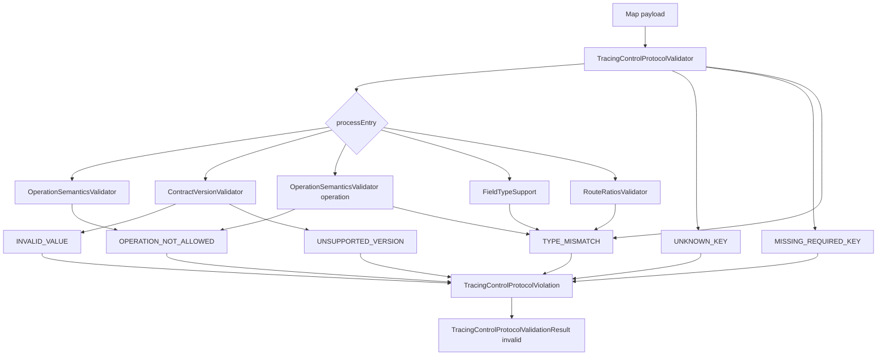

# TracingControlProtocolViolationCode — материал для обсуждения Javadoc

Документ собран для архитектурного обсуждения **комментариев к enum-классу и его константам**.  
Содержит фактическое состояние кода, семантику каждого code, связь с `reason`/`expectedType` и смежными типами.

**Дата сбора:** 2026-07-03  
**Scope:** `validation/TracingControlProtocolViolationCode` + emission sites + `result/TracingControlProtocolViolation`.

**См. также:**
- [tracing-control-protocol-field-category-discussion.md](tracing-control-protocol-field-category-discussion.md) — `OPERATION_NOT_ALLOWED` для category policy
- [tracing-control-protocol-operation-discussion.md](tracing-control-protocol-operation-discussion.md) — `OPERATION_NOT_ALLOWED` для wrong operation allowlist
- [tracing-control-protocol-validator-inventory.md](tracing-control-protocol-validator-inventory.md) §5 — violation semantics matrix

---

## 1. Текущее состояние исходника

### 1.1 `TracingControlProtocolViolationCode.java`

Публичный enum в пакете **`validation`**, **без Javadoc**, без методов.

```java
public enum TracingControlProtocolViolationCode {

    UNSUPPORTED_VERSION,
    INVALID_VALUE,
    UNKNOWN_KEY,
    MISSING_REQUIRED_KEY,
    TYPE_MISMATCH,
    OPERATION_NOT_ALLOWED

}
```

| Метрика | Значение |
|---------|----------|
| Файл | `platform-tracing-api/.../validation/TracingControlProtocolViolationCode.java` |
| Строк | 12 |
| Констант | 6 (closed set для v1) |
| Public API | да — используется в `TracingControlProtocolViolation` record |

### 1.2 Историческое имя

| Было | Стало |
|------|-------|
| `WireViolationCode` | `TracingControlProtocolViolationCode` |

Источник: [tracing-control-protocol-refactoring-plan.md](tracing-control-protocol-refactoring-plan.md), [ADR-control-protocol-version-model.md](../decisions/ADR-control-protocol-version-model.md).

---

## 2. Роль code в модели validation

### 2.1 Два слоя diagnostics

```text
TracingControlProtocolViolation (record, package result)
├── key: String              // wire key или synthetic key, напр. "<map>", "sampling.ratio./api"
├── reason: String           // free-text English message (human diagnostics)
├── expectedType: String     // подсказка ожидаемого shape/type
├── actualType: String       // FQCN или literal "null", "absent", operation string, …
└── code: TracingControlProtocolViolationCode   // ← stable machine-readable enum
```

**ADR (binding):** `code` — **stable contract** для programmatic handling; `reason` — **non-contractual** free text.

**Refactor invariant (binding для validator):** reason strings в production validator — **byte-for-byte preserved** при рефакторинге; characterization tests assert exact `reason` для ключевых сценариев.

→ Для Javadoc: constant-level text должен описывать **семантику code**, не дублировать каждый возможный `reason`.

### 2.2 Package placement

```text
space.br1440.platform.tracing.api.control.protocol
├── result/TracingControlProtocolViolation.java     // imports validation.ViolationCode
├── validation/TracingControlProtocolViolationCode.java
└── validation/*Validator*, FieldTypeSupport, …      // emit codes
```

`result` зависит от `validation` только ради enum code (не от validator classes).  
Open question для архитекторов: оставить enum в `validation` или вынести в `result` / neutral subpackage.

### 2.3 Non-throwing validation

Validator **не бросает** на validation failure — только накопляет `TracingControlProtocolViolation` с `code`.  
`IllegalStateException` — только defensive guard (`ROUTE_RATIOS_MAP` в `FieldTypeSupport`), не part of violation model.

---

## 3. Closed set: шесть constants (v1)

Порядок объявления в исходнике (не alphabetical):

```text
1. UNSUPPORTED_VERSION
2. INVALID_VALUE
3. UNKNOWN_KEY
4. MISSING_REQUIRED_KEY
5. TYPE_MISMATCH
6. OPERATION_NOT_ALLOWED
```

Arch test фиксирует: `TracingControlProtocolViolationCode.values().length == 6`.

**Explicit non-goal (refactor):** no new violation codes без protocol version bump / ADR.

---

## 4. Семантика constants (binding rules)

### 4.1 Summary matrix

| Code | Когда emit | Единственный owner-сценарий? | Normalized payload on invalid |
|------|------------|------------------------------|-------------------------------|
| `INVALID_VALUE` | Malformed `contractVersion` (parse empty) | **Да** — только contractVersion | discarded (`Map.of()`) |
| `UNSUPPORTED_VERSION` | Parsed but unsupported `contractVersion` major | **Да** | discarded |
| `UNKNOWN_KEY` | Key not in v1 schema (strict) | **Да** | discarded |
| `MISSING_REQUIRED_KEY` | Required key absent in payload | **Да** | discarded |
| `OPERATION_NOT_ALLOWED` | Category policy или operation allowlist | Нет — 3 distinct reason families | discarded |
| `TYPE_MISMATCH` | Всё прочее wrong shape/type/semantic | **Catch-all** | discarded |

### 4.2 Critical disambiguation (частые ошибки при Javadoc)

| Сценарий | Code | НЕ использовать |
|----------|------|-----------------|
| `contractVersion = "abc"` | `INVALID_VALUE` | `TYPE_MISMATCH` |
| `contractVersion = 2` (unsupported major) | `UNSUPPORTED_VERSION` | `INVALID_VALUE`, `TYPE_MISMATCH` |
| `contractVersion = null` (key present) | `INVALID_VALUE` | `MISSING_REQUIRED_KEY`, generic `"null value rejected"` |
| `sampling.ratio = 1.5` | `TYPE_MISMATCH` | `INVALID_VALUE` |
| unknown `validation.mode` | `TYPE_MISMATCH` | `INVALID_VALUE` |
| `operation = 42` | `TYPE_MISMATCH` | `OPERATION_NOT_ALLOWED` |
| `operation = "READ_SCHEMA"` on runtime entry | `OPERATION_NOT_ALLOWED` | `TYPE_MISMATCH` |
| `exporter.endpoint` on wire path | `OPERATION_NOT_ALLOWED` | `TYPE_MISMATCH` |

---

## 5. Emission map: code → production class → reason strings

Factory: `FieldTypeSupport.violation(key, reason, expectedType, actualType, code)` → `TracingControlProtocolViolation`.

### 5.1 `UNSUPPORTED_VERSION`

| Emitter | Condition | reason (verbatim) | expectedType | key |
|---------|-----------|-------------------|--------------|-----|
| `ContractVersionValidator` | parsed ok, `!TracingControlProtocol.isSupported` | `"unsupported contractVersion"` | current major as String (`"1"`) | `contractVersion` |

### 5.2 `INVALID_VALUE`

| Emitter | Condition | reason (verbatim) | expectedType | key |
|---------|-----------|-------------------|--------------|-----|
| `ContractVersionValidator` | `TracingControlProtocolVersion.parse` empty | `"invalid contractVersion"` | `"Integer"` | `contractVersion` |

Covers: null, malformed String, Long out of int range, unrecognised types.

### 5.3 `UNKNOWN_KEY`

| Emitter | Condition | reason (verbatim) | expectedType | key |
|---------|-----------|-------------------|--------------|-----|
| `TracingControlProtocolValidator` | `!schema.isKnownKey(key)` | `"unknown key rejected (strict v1)"` | `"known wire key"` | offending key |

### 5.4 `MISSING_REQUIRED_KEY`

| Emitter | Condition | reason (verbatim) | expectedType | actualType | key |
|---------|-----------|-------------------|--------------|------------|-----|
| `TracingControlProtocolValidator` | null payload | `"required key missing"` | `String.valueOf(schema.typeOf(required))` | `"absent"` | each required |
| `TracingControlProtocolValidator` | `!payload.containsKey(required)` | same | same | `"absent"` | each required |

v1 required: `contractVersion`, `operation`.

### 5.5 `OPERATION_NOT_ALLOWED`

| Emitter | Condition | reason (verbatim) | expectedType |
|---------|-----------|-------------------|--------------|
| `OperationSemanticsValidator` | category `STARTUP_TOPOLOGY` | `"startup topology field rejected for wire control path"` | `"runtime policy or envelope key"` |
| `OperationSemanticsValidator` | category `RUNTIME_POLICY` on read path | `"runtime policy field not allowed in read request"` | `"envelope or diagnostic key"` |
| `OperationSemanticsValidator` | operation not in allowlist | `"unsupported operation for this validation entry point"` | `String.join("\|", allowedOperations)` |

actualType для operation allowlist case = operation string value.

### 5.6 `TYPE_MISMATCH` (catch-all)

| Emitter / area | reason (verbatim) | Notes |
|----------------|-------------------|-------|
| `TracingControlProtocolValidator` | `"map keys must be String"` | key = `"<map>"` |
| `TracingControlProtocolValidator` | `"null value rejected"` | known key, value null (not contractVersion) |
| `OperationSemanticsValidator` | `"operation must be String"` | |
| `FieldTypeSupport` | `"enum instance rejected; use String wire value"` | before type switch |
| `FieldTypeSupport` | `"invalid wire type"` | scalar wrong Java type |
| `FieldTypeSupport` | `"unknown wire value for key"` | STRING + allowedValues predicate fail (incl. validation.mode) |
| `FieldTypeSupport` | `"ratio must be in [0.0, 1.0]"` | ratioField=true |
| `FieldTypeSupport` | `"invalid wire type; use String[] not List or custom type"` | |
| `FieldTypeSupport` | `"String[] must not contain null elements"` | actualType `"null element"` |
| `RouteRatiosValidator` | `"invalid wire type"` | not a Map |
| `RouteRatiosValidator` | `"routeRatios map keys must be String"` | |
| `RouteRatiosValidator` | `"enum instance rejected in routeRatios"` | |
| `RouteRatiosValidator` | via `validateDouble` | synthetic key `parent.routeKey` |

**Special violation key:** `"<map>"` — non-String map key in payload (not a schema key).

### 5.7 Observed reason / test drift (NEEDS_ARCHITECT_DECISION)

Production `FieldTypeSupport` для unknown `validation.mode` emit:

```text
reason = "unknown wire value for key"
expectedType = "<caller-defined allowed set>"
```

Characterization tests (`TracingControlProtocolValidatorTest` char-06, `FieldTypeSupportTest`) всё ещё assert:

```text
reason = "unknown validation.mode wire value"
expectedType = "STRICT|WARN|DISABLED"
```

Зафиксировать в Javadoc/discussion: какой variant — contract, и нужна ли синхронизация code vs tests.

---

## 6. Emission frequency by class (production)

| Class | Codes emitted |
|-------|---------------|
| `FieldTypeSupport` | `TYPE_MISMATCH` only |
| `ContractVersionValidator` | `INVALID_VALUE`, `UNSUPPORTED_VERSION` |
| `OperationSemanticsValidator` | `OPERATION_NOT_ALLOWED`, `TYPE_MISMATCH` |
| `RouteRatiosValidator` | `TYPE_MISMATCH` only |
| `TracingControlProtocolValidator` | `TYPE_MISMATCH`, `UNKNOWN_KEY`, `MISSING_REQUIRED_KEY` |

Нет class, emit'ящего все 6 codes. `TYPE_MISMATCH` — dominant (~80%+ emission sites).

---

## 7. `TracingControlProtocolValidationResult` interaction

```java
public static TracingControlProtocolValidationResult invalid(List<TracingControlProtocolViolation> violations) {
    return new TracingControlProtocolValidationResult(false, violations, Map.of());
}
```

Любой non-empty violations list → `valid=false`, **normalized payload discarded** независимо от `code`.  
Consumers должны branch на `result.valid()` и/или `violation.code()`, не на presence of partial normalized map.

Multi-defect: codes смешиваются в одном list; порядок = payload iteration order + required-key sweep (см. characterization tests 24–26).

---

## 8. Смежные типы

| Type | Relation |
|------|----------|
| `TracingControlProtocolViolation` | carries `code` as record component |
| `TracingControlProtocolValidationResult` | `List<TracingControlProtocolViolation> violations` |
| `TracingControlProtocolValidator` | public entry; не expose enum directly |
| `FieldTypeSupport.violation(...)` | единая factory для всех emitters |

**Downstream consumers (tests / integration):**

| Module | Usage |
|--------|-------|
| `platform-tracing-spring-boot-autoconfigure` | wire contract tests — assert `valid()` |
| `platform-tracing-e2e-tests` | JMX round-trip — delegate to validator |
| Future reconciler / actuator (docs) | expected to branch on `code` + `key` |

Production modules outside `platform-tracing-api` **не import** `TracingControlProtocolViolationCode` напрямую (на момент сбора) — только через validation result.

---

## 9. Тесты как спецификация

| Test class | Codes covered |
|------------|---------------|
| `TracingControlProtocolViolationTest` | `UNSUPPORTED_VERSION`, `INVALID_VALUE`, `UNKNOWN_KEY` (integration smoke) |
| `ContractVersionValidatorTest` | `INVALID_VALUE`, `UNSUPPORTED_VERSION` |
| `OperationSemanticsValidatorTest` | `OPERATION_NOT_ALLOWED`, `TYPE_MISMATCH` |
| `FieldTypeSupportTest` | `TYPE_MISMATCH` (many branches) |
| `RouteRatiosValidatorTest` | `TYPE_MISMATCH` |
| `TracingControlProtocolValidatorTest` | all 6 codes (53 + characterization tests) |
| `ApiProtocolNoImplementationDependencyArchTest` | enum size == 6; record has `code` field |

**Gap (historical inventory):** до Phase 0 часть matrix rows помечены «no dedicated test» — после characterization suite покрытие существенно выше; см. inventory §5 для baseline.

---

## 10. Документация репозитория

| Document | Content |
|----------|---------|
| [ADR-control-protocol-version-model.md](../decisions/ADR-control-protocol-version-model.md) §Violation codes | closed enum 6 values; code stable vs reason free-text |
| [platform-tracing-wire-schema-v1.md](../architecture/platform-tracing-wire-schema-v1.md) §9 | validation entry points; failures return violations list |
| [tracing-control-protocol-refactoring-plan.md](tracing-control-protocol-refactoring-plan.md) | rename `WireViolationCode`; 6 codes list |
| [tracing-control-protocol-validator-inventory.md](tracing-control-protocol-validator-inventory.md) §5 | full scenario matrix |
| [tracing-control-protocol-validator-implementation-report.md](tracing-control-protocol-validator-implementation-report.md) | «no new violation codes» invariant |

---

## 11. Архитектурный контекст для Javadoc

### 11.1 Зачем enum, если есть `reason`

1. **Stable programmatic handling** — switch on `code` без parse English text.
2. **Closed vocabulary** — 6 values; расширение = protocol evolution.
3. **Cross-layer contract** — ADR positions code as API; reason as diagnostics.

### 11.2 Чего enum не делает

- Не carry key / expectedType / actualType (those live on violation record).
- Не encode severity or HTTP mapping.
- Не serialize to wire (validation result stays in-process / JMX response shape TBD).

### 11.3 `TYPE_MISMATCH` as catch-all — Javadoc challenge

Architects must decide Javadoc tone:

- **Narrow:** «wrong Java type for known schema field»
- **Actual v1 behavior:** includes ratio range, enum rejection, validation.mode semantic reject, routeRatios shape, null values, map key type

Recommend **honest catch-all** wording in constant Javadoc to avoid misleading consumers.

### 11.4 Relationship `INVALID_VALUE` vs `TYPE_MISMATCH`

Only `contractVersion` malformed uses `INVALID_VALUE`.  
Javadoc must **explicitly exclude** general malformed values — иначе consumers будут over-handle.

---

## 12. Открытые вопросы для архитекторов (Javadoc)

### 12.1 Class-level

1. Document as **«stable violation taxonomy for v1 protocol validation»**?
2. State **closed set** and **no extension without version bump**?
3. Cross-link `TracingControlProtocolViolation` and ADR?
4. Package `validation` vs move to `result` / `protocol` root?

### 12.2 Constant-level

| Constant | Javadoc decisions |
|----------|-------------------|
| `UNSUPPORTED_VERSION` | Parsed version not in registry; only `contractVersion` key |
| `INVALID_VALUE` | **Only** malformed `contractVersion`; explicitly NOT ratio/validation.mode |
| `UNKNOWN_KEY` | Strict v1; forward-compatible ignore rejected |
| `MISSING_REQUIRED_KEY` | Uses `payload.containsKey`; key present with bad value ≠ missing |
| `TYPE_MISMATCH` | Catch-all scope — list representative scenarios or refer to inventory §5 |
| `OPERATION_NOT_ALLOWED` | Category policy + operation allowlist; two reason families |

### 12.3 `reason` vs `code` in Javadoc

Should constant Javadoc list **canonical reason strings** (contract) or say «see validator for reason text» (ADR non-contractual)?

Refactor plan treated reasons as **byte-for-byte invariant** — tension with ADR «non-contractual».

### 12.4 Ordering of enum constants

Document declaration order significance? (currently none in code)

### 12.5 Language

Public API English (ADR) vs Russian+English terms (validator comments post-refactor)?

---

## 13. Черновики формулировок (for discussion, not approved)

### 13.1 Class (English draft)

```text
Stable violation codes returned by TracingControlProtocolValidator.
Each TracingControlProtocolViolation carries one code plus diagnostic
fields (key, reason, expectedType, actualType). The code enum is a closed
v1 set; extending it requires a protocol version change. Prefer branching
on code rather than parsing reason strings.
```

### 13.2 Constants (one-liners)

| Constant | Draft |
|----------|-------|
| `UNSUPPORTED_VERSION` | contractVersion parsed successfully but major is not supported by the current protocol registry. |
| `INVALID_VALUE` | contractVersion present but cannot be parsed into a supported integer major (malformed wire value). |
| `UNKNOWN_KEY` | Payload contains a key that is not registered in the v1 schema (strict rejection). |
| `MISSING_REQUIRED_KEY` | A schema-required key for the validation entrypoint is absent from the payload map. |
| `TYPE_MISMATCH` | Known key present but wire value shape, type, or field-local semantic constraint failed (catch-all). |
| `OPERATION_NOT_ALLOWED` | Field category or operation value is incompatible with the validation entrypoint. |

---

## 14. Diagram: validation → violation code



---

## 15. Файлы для review при добавлении Javadoc

| File | Action |
|------|--------|
| `TracingControlProtocolViolationCode.java` | primary — class + 6 constant Javadocs |
| `TracingControlProtocolViolation.java` | `@param code` on record; link to enum |
| `FieldTypeSupport.violation(...)` | optional — «creates violation with given code» |
| ADR / wire schema doc | align code definitions if Javadoc becomes normative |

---

## 16. Checklist перед merge Javadoc

- [ ] `INVALID_VALUE` scoped **only** to malformed `contractVersion`
- [ ] `TYPE_MISMATCH` documented as catch-all (ratio, enum, null, shape, …)
- [ ] `OPERATION_NOT_ALLOWED` covers both category and operation allowlist
- [ ] Closed set (6) and no silent extension documented
- [ ] Relationship code vs reason aligned with ADR **and** refactor verbatim-reason invariant
- [ ] Resolve validation.mode reason drift (production vs tests) before normative Javadoc
- [ ] Special key `"<map>"` mentioned where relevant
- [ ] `javadoc` clean for validation + result packages
