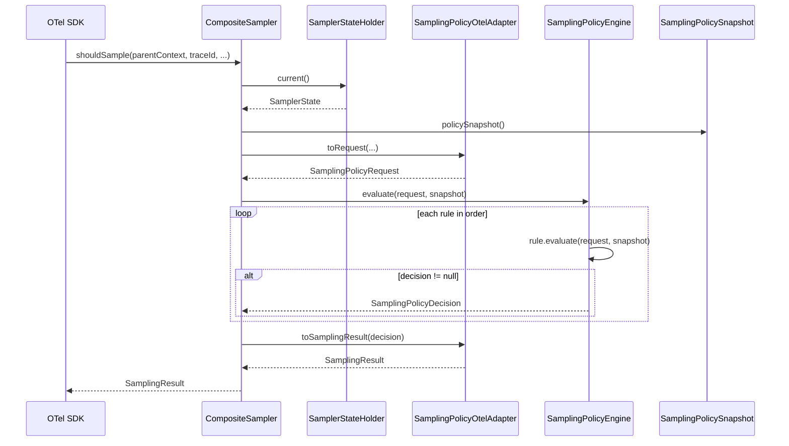
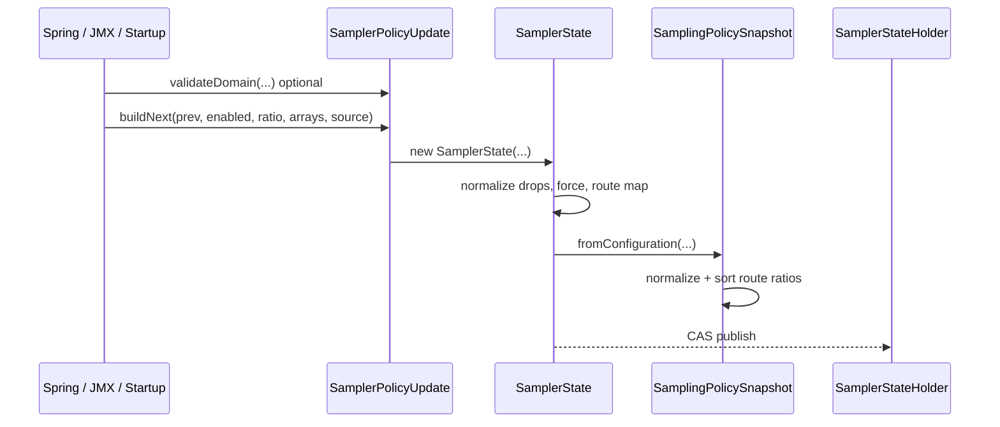

# Tracing Sampling Package Inventory

**Package:** `space.br1440.platform.tracing.core.sampling`  
**Module:** `platform-tracing-core`  
**Analysis date:** 2026-06-30  
**Purpose:** Factual inventory for downstream architecture design (8 refactoring alternatives). No architecture proposals in this document.

---

## Executive Summary

The `core.sampling` package is a **pure-Java, OTel-free policy engine** extracted in PR-6B. It implements a fixed **chain-of-responsibility** over seven production rules, driven by an immutable `SamplingPolicySnapshot` and a per-span `SamplingPolicyRequest`. Rules return `null` to abstain; the engine returns the first non-null decision or `SamplingPolicyDecision.abstain()`.

**Configuration does not enter this package directly.** Runtime config is validated and normalized in `platform-tracing-otel-extension` (`SamplerPolicyUpdate`, `SamplerState`), which compiles a `SamplingPolicySnapshot` via `SamplingPolicySnapshot.fromConfiguration(...)`. The hot path is: `CompositeSampler.shouldSample()` → `SamplingPolicyOtelAdapter.toRequest()` → `SamplingPolicyEngine.evaluate()` → `SamplingPolicyOtelAdapter.toSamplingResult()`.

**External surface:** Only `platform-tracing-otel-extension` imports types from this package (5 production files, 2 test files). Spring autoconfigure, starter, benchmarks, and e2e tests integrate **indirectly** through otel-extension samplers and JMX.

**Test status (this analysis):** `:platform-tracing-core:test --tests "space.br1440.platform.tracing.core.sampling.*"` — **PASSED** (37 tests). Selected otel-extension adapter tests — **PASSED**.

**Key factual findings:**
1. Production rule order is hard-coded in `SamplingPolicyEngine.productionEngine()` and is normative per ADR and characterization docs.
2. `DefaultRatioPolicyRule` always decides (never abstains); with the production chain the engine never abstains in normal operation.
3. Route-ratio prefix matching uses **longest-prefix-first** sort at snapshot compile time (PR-9G), not config insertion order.
4. Ratio decisions use package-private `TraceIdRatioDecision`, intended to match OTel `traceIdRatioBased` (verified by `TraceIdRatioParityTest`).
5. Duplicated normalization exists between `SamplerState` (otel-extension) and `SamplingPolicySnapshot` (core).

---

## Package Map

```
space.br1440.platform.tracing.core.sampling/
├── Domain model (immutable)
│   ├── SamplingPolicyRequest          (record — per-evaluation inputs)
│   ├── SamplingPolicyDecision         (record — outcome + reason + winning rule)
│   ├── SamplingPolicySnapshot         (class — immutable compiled policy)
│   ├── RouteRatioPrefix                 (record — prefix + ratio pair)
│   ├── ParentContextState               (enum — parent sampling tri-state)
│   ├── SamplingPolicyDecisionType       (enum — DROP | RECORD_ONLY | RECORD_AND_SAMPLE | ABSTAIN)
│   └── SamplingPolicyReason             (enum — maps to PlatformSamplingReasons codes)
├── Engine
│   ├── SamplingPolicyRule               (interface)
│   └── SamplingPolicyEngine             (class — ordered rule chain)
├── Rules (7 production + 0 optional)
│   ├── KillSwitchPolicyRule
│   ├── HardDropPolicyRule
│   ├── ForceHeaderPolicyRule
│   ├── QaTracePolicyRule
│   ├── ParentSampledPolicyRule
│   ├── RouteRatioPolicyRule
│   └── DefaultRatioPolicyRule
└── Package-private utilities
    ├── TraceIdRatioDecision
    └── SamplingPolicyRuleNames
```

**Module boundary (enforced):** `ModuleTaxonomyArchRules.CORE_POLICY_PACKAGES_NO_OTEL_OR_SPRING` — `core.sampling..` must not depend on OTel, Spring, or JMX (`platform-tracing-test/.../ModuleTaxonomyArchRules.java:65-77`).

**Dependencies inward:** `platform-tracing-api` (`Versioned`, `PlatformSamplingReasons` via `SamplingPolicyReason`).

---

## Class-by-Class Inventory

### `SamplingPolicyEngine`

| Attribute | Detail |
|-----------|--------|
| **Responsibility** | Orchestrates ordered rule evaluation; first non-null decision wins |
| **Category** | Runtime control / domain logic |
| **Public API** | `SamplingPolicyEngine(SamplingPolicyRule... rules)`, `foundationEngine()`, `productionEngine()`, `evaluate(request, snapshot)`, `ruleCount()`, `ruleNameAt(index)` |
| **Package-private API** | None |
| **State** | Immutable after construction; holds cloned `SamplingPolicyRule[]` |
| **Thread-safety** | Immutable; safe to share across threads if rules are stateless (all current rules are) |
| **Dependencies** | All rule classes in package |
| **Collaborators** | `CompositeSampler` holds one `productionEngine()` instance for app lifetime |

Evidence: `SamplingPolicyEngine.java:3-46`

---

### `SamplingPolicyRule` (interface)

| Attribute | Detail |
|-----------|--------|
| **Responsibility** | Single policy rule contract |
| **Category** | Domain logic (extension point) |
| **Public API** | `ruleName()`, `evaluate(request, snapshot)` → `SamplingPolicyDecision` or **`null` (abstain)** |
| **State** | Implementations are stateless singletons in practice |

Evidence: `SamplingPolicyRule.java:3-8`

---

### `SamplingPolicyRequest` (record)

| Attribute | Detail |
|-----------|--------|
| **Responsibility** | Normalized inputs for one evaluation (decoupled from OTel) |
| **Category** | Domain model |
| **Public API** | Canonical constructor + convenience `SamplingPolicyRequest(String urlPath)` defaulting traceId/force/qa/parent to null/false/ABSENT |
| **Fields** | `urlPath`, `traceId`, `forceTraceHeaderValue`, `qaTrace`, `parentContextState` |
| **Mutability** | Immutable record |
| **Built by** | `SamplingPolicyOtelAdapter.toRequest()` in otel-extension |

Evidence: `SamplingPolicyRequest.java:3-13`; adapter `SamplingPolicyOtelAdapter.java:63-76`

---

### `SamplingPolicyDecision` (record)

| Attribute | Detail |
|-----------|--------|
| **Responsibility** | Typed outcome with validation in compact constructor |
| **Category** | Domain model |
| **Public API** | `drop(reason, winningRule)`, `recordAndSample(reason, winningRule)`, `abstain()` |
| **Validation** | ABSTAIN requires `NO_MATCH` reason and null/empty winningRule; non-ABSTAIN requires concrete reason and non-empty winningRule |
| **Mutability** | Immutable |

Evidence: `SamplingPolicyDecision.java:3-37`

---

### `SamplingPolicyDecisionType` (enum)

| Values | `DROP`, `RECORD_ONLY`, `RECORD_AND_SAMPLE`, `ABSTAIN` |
| **Usage in rules** | Rules emit only `DROP` or `RECORD_AND_SAMPLE`. **`RECORD_ONLY` is never produced by any rule in this package.** Adapter handles it if present (`SamplingPolicyOtelAdapter.java:82-86`). |

Evidence: `SamplingPolicyDecisionType.java:3-8`

---

### `SamplingPolicyReason` (enum)

| Attribute | Detail |
|-----------|--------|
| **Responsibility** | Maps policy outcomes to stable `reasonCode()` strings from `PlatformSamplingReasons` |
| **Category** | Domain model / API bridge |
| **Values** | KILL_SWITCH, HARD_DROP, FORCE_HEADER, QA_TRACE, PARENT_DECISION, PARENT_DROP, ROUTE_RATIO, ROUTE_RATIO_DROP, DEFAULT_RATIO, DEFAULT_RATIO_DROP, NO_MATCH(null) |
| **Dependency** | `space.br1440.platform.tracing.api.attributes.PlatformSamplingReasons` |

Evidence: `SamplingPolicyReason.java:5-27`; `PlatformSamplingReasons.java:18-71`

---

### `SamplingPolicySnapshot`

| Attribute | Detail |
|-----------|--------|
| **Responsibility** | Immutable compiled policy state for evaluation; implements `Versioned` |
| **Category** | Configuration logic + domain model |
| **Public API** | Two constructors, `fromConfiguration(...)`, getters: `enabled()`, `droppedRoutes()`, `forceRecordValues()`, `routeRatios()`, `defaultRatio()`, `version()` |
| **Defaults (3-arg ctor)** | `forceRecordValues=∅`, `routeRatios=∅`, `defaultRatio=1.0` |
| **Validation** | `defaultRatio ∈ [0,1]` throws `IllegalArgumentException`; invalid route entries in `fromConfiguration` are **silently skipped** (blank key, null ratio, ratio out of range) |
| **Normalization (private)** | Drop paths trimmed; force values trimmed + lowercased; route ratios sorted longest-prefix-first then lexicographic |
| **Mutability** | Immutable; defensive copies via `List.copyOf` / `Set.copyOf` / array clone at compile |
| **Thread-safety** | Immutable; safe for lock-free reads |

Evidence: `SamplingPolicySnapshot.java:11-138`

---

### `RouteRatioPrefix` (record)

| Attribute | Detail |
|-----------|--------|
| **Responsibility** | Compiled route prefix + ratio |
| **Category** | Domain model |
| **Validation** | **None** at record level — ratio range enforced upstream |

Evidence: `RouteRatioPrefix.java:3-4`

---

### `ParentContextState` (enum)

| Values | `ABSENT`, `SAMPLED`, `NOT_SAMPLED` |
| **Set by** | `SamplingPolicyOtelAdapter.resolveParentState()` from OTel parent `SpanContext` |

Evidence: `ParentContextState.java:3-7`; `SamplingPolicyOtelAdapter.java:109-115`

---

### Rule classes (common pattern)

All seven rules are `public final`, implement `SamplingPolicyRule`, hold **static final** pre-built `SamplingPolicyDecision` instances, and are **stateless**.

| Class | Abstains when | Decides |
|-------|---------------|---------|
| `KillSwitchPolicyRule` | `snapshot.enabled()==true` | DROP when disabled |
| `HardDropPolicyRule` | no drop list, empty/null urlPath, no prefix match | DROP on first matching prefix (`startsWith`) |
| `ForceHeaderPolicyRule` | empty force values, no header match | RECORD_AND_SAMPLE on match (case-insensitive) |
| `QaTracePolicyRule` | `request.qaTrace()==false` | RECORD_AND_SAMPLE when qa |
| `ParentSampledPolicyRule` | parent ABSENT | SAMPLE / DROP for SAMPLED / NOT_SAMPLED |
| `RouteRatioPolicyRule` | no route ratios, empty urlPath, no prefix match | ratio 1.0→SAMPLE, 0.0→DROP, else `TraceIdRatioDecision` |
| `DefaultRatioPolicyRule` | **never** | always SAMPLE or DROP via ratio / traceId |

**Rule names** (metric keys via `ruleName()`): from `SamplingPolicyRuleNames` — mix of `PlatformSamplingReasons` constants and local strings (`hard_drop`, `parent_decision`, `default_ratio`).

Evidence: individual rule files; `SamplingPolicyRuleNames.java:5-13`

---

### `TraceIdRatioDecision` (package-private)

| Attribute | Detail |
|-----------|--------|
| **Responsibility** | Deterministic traceId-based probability sampling |
| **Category** | Utility logic |
| **API** | `static boolean shouldSample(String traceId, double probability)` |
| **Algorithm** | `probability >= 1` → true; `<= 0` → false; requires `traceId != null && length >= 32`; compares `abs(parseUnsignedLong(traceId.substring(16), 16)) < (long)(probability * Long.MAX_VALUE)` |
| **Short traceId** | Returns **false** (drop) — NEEDS_VERIFICATION whether otel adapter always supplies 32-char ids |

Evidence: `TraceIdRatioDecision.java:10-26`

---

### `SamplingPolicyRuleNames` (package-private)

| Attribute | Detail |
|-----------|--------|
| **Responsibility** | Centralizes winning-rule string constants |
| **Category** | Utility / configuration logic |

Evidence: `SamplingPolicyRuleNames.java:5-17`

---

## Sampling Domain Model Mapping

| Concept | Concrete type(s) | Notes |
|---------|------------------|-------|
| **Policy** | `SamplingPolicySnapshot` | Compiled enabled/drops/force/routes/defaultRatio/version |
| **Rules** | `SamplingPolicyRule` + 7 implementations | Chain membership defined by engine factory |
| **Decisions** | `SamplingPolicyDecision`, `SamplingPolicyDecisionType`, `SamplingPolicyReason` | Abstain is explicit enum value; rules use null |
| **Samplers** | *Not in this package* | OTel `CompositeSampler` delegates here |
| **Configuration objects** | `SamplingPolicySnapshot.fromConfiguration(...)` | Map-based route ratios → `RouteRatioPrefix[]` |
| **Defaults** | 3-arg snapshot ctor: ratio=1.0, empty force/routes | Engine `productionEngine()` hard-coded rule set |
| **Runtime updates** | *Outside package* | `SamplerStateHolder` → new `SamplerState` → new snapshot |
| **Validation** | Snapshot: defaultRatio range only; route map filters invalid entries | Stricter validation in `SamplerPolicyUpdate` (otel-extension) |
| **Parsing** | `fromConfiguration` trims/filters map entries | No string parsing of config files in core |
| **Normalization** | Snapshot private methods + `fromConfiguration` | Duplicated in `SamplerState` |
| **Error handling** | `IllegalArgumentException` on ctor validation; invalid route entries dropped silently in `fromConfiguration` | Runtime update LKG handled in otel-extension |

---

## Runtime Flow

### Hot path (every span)



Evidence: `CompositeSampler.java:36-47`; `SamplingPolicyEngine.java:29-37`

### Production rule order (normative)

| # | Rule | `ruleName()` |
|---|------|--------------|
| 1 | KillSwitchPolicyRule | `kill_switch` |
| 2 | HardDropPolicyRule | `hard_drop` |
| 3 | ForceHeaderPolicyRule | `force_header` |
| 4 | QaTracePolicyRule | `qa_trace` |
| 5 | ParentSampledPolicyRule | `parent_decision` |
| 6 | RouteRatioPolicyRule | `route_ratio` |
| 7 | DefaultRatioPolicyRule | `default_ratio` |

Evidence: `SamplingPolicyEngine.productionEngine()` lines 18-27; verified by `SamplingPolicyEngineTest.productionEngine_matchesCompositeSamplerRuleOrder()`

### Abstain / fallback semantics

- Individual rules return **`null`** to abstain (not `SamplingPolicyDecision.abstain()`).
- Engine returns `abstain()` only if **all** rules abstain (`SamplingPolicyEngine.java:36`).
- `CompositeSampler` uses `productionEngine()` where rule 7 never abstains → engine never abstains in production (`SamplingPolicyEngineTest.productionEngine_neverAbstains()`).
- If abstain occurs (custom engine), adapter maps to DROP with metric key `fallback_drop` (`SamplingPolicyOtelAdapter.java:79-80, 102-107`).

---

## Configuration / Control Flow

Configuration **enters outside** `core.sampling`:



| Stage | Location | Behavior |
|-------|----------|----------|
| Spring properties | `TracingProperties.Sampling` → `SamplingRuntimeConfig.from()` | No direct core import |
| JMX | `PlatformSamplingControl.updateSamplingPolicy(...)` | Arrays → `SamplerStateHolder.tryApplyPolicyUpdate` |
| Validation (strict) | `SamplerPolicyUpdate.validateDomain` | Ratio bounds, drop path count/prefix, force value count/length, route array parity |
| Validation (core) | `SamplingPolicySnapshot` ctor | `defaultRatio` bounds only |
| Invalid runtime input | `SamplerStateHolder.tryApplyPolicyUpdate` | Returns false, LKG retained |
| Invalid map entries | `fromConfiguration` | Skipped silently |

Evidence: `SamplerState.java:39-64`; `SamplerPolicyUpdate.java:27-122`; `SamplingRuntimeConfig.java:38-48`

**Note:** `SamplingRouteRatiosWire` (autoconfigure) preserves `LinkedHashMap` insertion order for JMX wire format only; **matching semantics** use PR-9G compile-time sort in snapshot (`SamplingRouteRatiosWire.java:9-12`; `SamplingPolicySnapshot.java:117-137`).

---

## External Usage Map

### Direct imports of `core.sampling` (production)

| Module | File | Types used |
|--------|------|------------|
| `platform-tracing-otel-extension` | `CompositeSampler.java` | `SamplingPolicyEngine`, `SamplingPolicyRequest`, `SamplingPolicyDecision` |
| `platform-tracing-otel-extension` | `SamplingPolicyOtelAdapter.java` | `ParentContextState`, `SamplingPolicyRequest`, `SamplingPolicyDecision*`, `SamplingPolicyReason` |
| `platform-tracing-otel-extension` | `SamplerState.java` | `SamplingPolicySnapshot` |

### Direct imports (tests)

| Module | File |
|--------|------|
| `platform-tracing-otel-extension` | `TraceIdRatioParityTest.java` |
| `platform-tracing-otel-extension` | `SamplingPolicyDecisionOtelAdapterTest.java` |

### Indirect integration (no `core.sampling` import)

| Module / area | Integration path |
|---------------|------------------|
| **autoconfigure** | `SamplingRuntimeConfig`, `SamplingRouteRatiosWire` → JMX client → `SamplerStateHolder` |
| **starter** | Wires autoconfigure + otel-extension (NEEDS_VERIFICATION of exact class path — no direct grep hits) |
| **otel-extension (broader)** | Characterization tests exercise `CompositeSampler.policyEngine()` without importing all core types |
| **platform-tracing-test** | Harness (`SamplingDecisionCase`, `SamplingContextFactory`) used by otel characterization tests |
| **platform-tracing-e2e-tests** | `RuntimeSamplingControlSmokeTest` — JMX/runtime, no direct core import |
| **platform-tracing-bench** | JMH benchmarks on `CompositeSampler` — no direct `core.sampling` import |
| **docs / ADRs** | `ADR-runtime-sampling-policy.md`, `platform-tracing-sampling-characterization.md`, `runtime-sampling-control.md` |
| **arch tests** | `ModuleTaxonomyArchRules.CORE_POLICY_PACKAGES_NO_OTEL_OR_SPRING` |

### External contracts vs internal details

| **True external contracts** (used outside package) | **Internal / accidental exposure** |
|-----------------------------------------------------|-------------------------------------|
| `SamplingPolicyEngine`, `SamplingPolicySnapshot`, `SamplingPolicyRequest`, `SamplingPolicyDecision` | `RouteRatioPrefix` public but only constructed via snapshot/tests |
| `SamplingPolicyRule` (extension point) | `SamplingPolicyRuleNames` package-private ✓ |
| All seven rule classes (public, instantiable) | `TraceIdRatioDecision` package-private ✓ |
| `ParentContextState`, enums | Individual rules public — consumers could bypass engine (no enforcement) |
| | `RECORD_ONLY` in enum — unused by rules, adapter-only path |

---

## Test Coverage Map

### Core module (`platform-tracing-core`) — 37 tests, 8 classes

| Test class | Behavior protected | Edge cases | Gaps | Locks implementation detail? |
|------------|-------------------|------------|------|-------------------------------|
| `KillSwitchPolicyRuleTest` | enabled/disabled | — | Interaction with other rules (covered in engine test) | Static DROP instance — low risk |
| `HardDropPolicyRuleTest` | prefix match, empty lists/paths | null/empty urlPath | Non-`/` prefixes allowed in core (validation only in extension) | `startsWith` matching |
| `ForceHeaderPolicyRuleTest` | match, case insensitivity, abstain | empty force config | Pre-normalized snapshot vs raw header path | Dual match logic (contains + equalsIgnoreCase) |
| `ParentSampledPolicyRuleTest` | SAMPLED/NOT_SAMPLED/ABSENT | Ignores snapshot (null passed) | — | — |
| `RouteRatioPolicyRuleTest` | ratio 0/1, abstain, PR-9G longest prefix | insertion order independence | Fractional ratios (probabilistic) | Sorted snapshot dependency |
| `DefaultRatioPolicyRuleTest` | ratio 0/1 only | — | **No fractional ratio tests in core** | — |
| `SamplingPolicySnapshotTest` | normalization, immutability, route sort, decision validation | fromConfiguration copy safety | Invalid ratio map entries silently dropped — **not tested** | Sort comparator order |
| `SamplingPolicyEngineTest` | rule order, priority interactions, never abstains | kill switch vs hard drop, force vs default, parent vs route | Custom engine configurations | Exact rule name strings |

### Missing core tests (recommended before refactor)

1. **`QaTracePolicyRuleTest`** — rule has **zero** dedicated tests in core (only via engine/characterization).
2. **`TraceIdRatioDecisionTest`** — short/null traceId, boundary probabilities, parity with OTel for multiple ratios/traceIds.
3. **`SamplingPolicySnapshot.fromConfiguration`** — silent skip of invalid entries; out-of-range defaultRatio.
4. **Fractional ratio behavior** — `DefaultRatioPolicyRule` / `RouteRatioPolicyRule` at e.g. 0.25 (deterministic traceId fixtures).
5. **`SamplingPolicyDecision` compact constructor** — only one negative test in `SamplingPolicySnapshotTest`.
6. **`RECORD_ONLY` path** — no core producer; adapter test only.

### Otel-extension tests touching core (indirect contract)

| Test class | Role |
|------------|------|
| `TraceIdRatioParityTest` | Core `DefaultRatioPolicyRule` vs OTel `traceIdRatioBased` at ratio 0.5 |
| `SamplingPolicyDecisionOtelAdapterTest` | Adapter mapping + matrix parity with `CompositeSampler` |
| `SamplingRuleOrderCharacterizationTest` | Engine order via `policyEngine()` |
| `SamplingDecisionMatrixCharacterizationTest` | 12-case golden matrix |
| `SamplingRuleChainCharacterizationTest` | Priority interactions |
| `SamplerStateCharacterizationTest` | Runtime update effects on decisions |
| `SamplingRuntimeUpdateCharacterizationTest` | Concurrent read during update |
| `CompositeSamplerTest`, `CompositeSamplerEdgeCasesTest` | ADR-priority cases (kill switch, drop vs force) |

### Benchmarks

- `CompositeSamplerBenchmark`, `CompositeSamplerPolicyBranchesBenchmark`, `CompositeSamplerConcurrentUpdateBenchmark` — exercise end-to-end sampler, not core types in isolation.

---

## Current Pain Points (Factual)

| Smell | Evidence | Impact |
|-------|----------|--------|
| **Duplicated normalization** | `SamplerState.normalize*` vs `SamplingPolicySnapshot.normalize*` (drops, force, route filter) | Drift risk; two places to change validation semantics |
| **Split validation ownership** | Strict validation in `SamplerPolicyUpdate`; core silently filters bad route map entries | Inconsistent error semantics between startup and direct snapshot construction |
| **Hard-coded production chain** | `productionEngine()` static factory; `CompositeSampler` ctor calls it once | Cannot inject alternate chains without code change (rate-limit spike notes this) |
| **Mixed rule-name sources** | `SamplingPolicyRuleNames` mixes API constants and local strings | Metric keys ≠ reason codes for some rules (`hard_drop` vs `drop_path`) |
| **Unused decision type** | `RECORD_ONLY` never emitted by rules | Dead path in domain model; adapter must still handle |
| **Public rule classes** | All rules public | Bypass engine possible; unclear intended extension API |
| **Force header double normalization** | Snapshot lowercases; rule also `equalsIgnoreCase` loop | Redundant; subtle if raw header matched before snapshot normalize |
| **TraceIdRatioDecision opaque** | Package-private, no unit tests | Refactor risk for ratio parity guarantee |
| **Primitive obsession** | `urlPath` as String prefix match; parallel JMX arrays outside core | Adapter/wire complexity stays in extension |
| **QaTrace untested in core** | No `QaTracePolicyRuleTest` | Regression gap for simplest rule |
| **Parent rule ignores snapshot** | `ParentSampledPolicyRule.evaluate` never reads snapshot | Correct but implicit — could confuse readers |

No OTel/Spring leakage **into** core.sampling confirmed. Infrastructure concerns (CAS holder, JMX, OTel `SamplingResult`) correctly remain in otel-extension per extraction docs.

---

## Refactoring Seams

| Seam | Description | Confidence | Rationale |
|------|-------------|------------|-----------|
| **`SamplingPolicyRule` interface** | Stable extension point for new rules | **HIGH** | Already used by engine; rate-limit spike targets this |
| **`SamplingPolicyEngine.evaluate`** | Pure function `(request, snapshot) → decision` | **HIGH** | No side effects; fully testable |
| **`SamplingPolicySnapshot` compilation** | Extract snapshot builder/normalizer | **HIGH** | Clear boundary from otel `SamplerState` |
| **`TraceIdRatioDecision`** | Extract/test ratio algorithm | **HIGH** | Isolated utility; parity test exists |
| **`SamplingPolicyRuleNames` / reason mapping** | Consolidate metric vs span reason codes | **MEDIUM** | Cross-module contract with `PlatformSamplingReasons` |
| **`SamplingPolicyRequest` construction** | Keep in adapter (anti-corruption) | **HIGH** | OTel-specific fields mapped to pure domain |
| **Individual rule classes** | One class per rule | **HIGH** | Already isolated; stateless |
| **`productionEngine()` factory** | Configuration of chain order | **MEDIUM** | Normative ADR order — changing seam touches contracts |
| **`SamplerState` (otel-extension)** | Anti-corruption for runtime config | **HIGH** | Documented as staying in extension |
| **Package split: `core.sampling.policy` vs `core.sampling.ratio`** | Optional subpackages | **LOW** | Only 17 types; split may not pay off yet |

### Should remain stable (high coupling)

- Production rule **order** (ADR + characterization tests).
- `SamplingPolicyReason` ↔ `PlatformSamplingReasons` mapping (Collector contract).
- `TraceIdRatioDecision` algorithm (OTel parity).
- Longest-prefix-first route sort semantics (PR-9G).

---

## Open Questions

1. **Is `SamplingPolicyRule` intended as a public SPI** for third-party rules, or are public rule classes merely test convenience?
2. **Should invalid route-ratio entries fail fast** in core (like `SamplerPolicyUpdate`) instead of silent skip in `fromConfiguration`?
3. **What is the contract for `traceId` length** when ratio rules run — always 32 hex chars from OTel, or can shorter ids appear in non-OTel callers?
4. **Will `RECORD_ONLY` ever be produced** by a future rule, or should it be removed from the domain model?
5. **Should force-header matching require pre-normalized headers only** (snapshot path) eliminating redundant case logic in `ForceHeaderPolicyRule`?
6. **Is `foundationEngine()` (2 rules) part of the long-term API** or test-only scaffolding?
7. **Backward compatibility scope** for refactoring — ADR says reason codes are stable since Phase 12; are rule metric keys (`hard_drop`, `parent_decision`) equally stable?
8. **NEEDS_VERIFICATION:** Does any module outside otel-extension construct `SamplingPolicySnapshot` directly in production code?

---

## Validation

| Item | Result |
|------|--------|
| **Files changed** | `docs/analysis/tracing-sampling-package-inventory.md` (created) |
| **Command 1** | `.\gradlew :platform-tracing-core:test --tests "space.br1440.platform.tracing.core.sampling.*"` |
| **Result 1** | **PASSED** (exit 0) |
| **Command 2** | `.\gradlew :platform-tracing-otel-extension:test --tests "...TraceIdRatioParityTest" --tests "...SamplingPolicyDecisionOtelAdapterTest"` |
| **Result 2** | **PASSED** (exit 0) |
| **Not run** | Full otel characterization matrix, e2e smoke, JMH — out of scope for package inventory; no failures expected based on prior CI artifacts |

### Unresolved uncertainties

- Starter module classpath wiring to sampling (indirect only; not traced file-by-file).
- Whether any future non-OTel caller will invoke `SamplingPolicyEngine` directly.
- Exact OTel traceId format guarantees under all SDK versions.

---

## Appendix: Source File Paths

### Production (`platform-tracing-core/src/main/java/.../sampling/`)

| File |
|------|
| `DefaultRatioPolicyRule.java` |
| `ForceHeaderPolicyRule.java` |
| `HardDropPolicyRule.java` |
| `KillSwitchPolicyRule.java` |
| `ParentContextState.java` |
| `ParentSampledPolicyRule.java` |
| `QaTracePolicyRule.java` |
| `RouteRatioPolicyRule.java` |
| `RouteRatioPrefix.java` |
| `SamplingPolicyDecision.java` |
| `SamplingPolicyDecisionType.java` |
| `SamplingPolicyEngine.java` |
| `SamplingPolicyReason.java` |
| `SamplingPolicyRequest.java` |
| `SamplingPolicyRule.java` |
| `SamplingPolicyRuleNames.java` |
| `SamplingPolicySnapshot.java` |
| `TraceIdRatioDecision.java` |

### Tests (`platform-tracing-core/src/test/java/.../sampling/`)

| File |
|------|
| `DefaultRatioPolicyRuleTest.java` |
| `ForceHeaderPolicyRuleTest.java` |
| `HardDropPolicyRuleTest.java` |
| `KillSwitchPolicyRuleTest.java` |
| `ParentSampledPolicyRuleTest.java` |
| `RouteRatioPolicyRuleTest.java` |
| `SamplingPolicyEngineTest.java` |
| `SamplingPolicySnapshotTest.java` |

### Primary integration (otel-extension)

| File |
|------|
| `platform-tracing-otel-extension/.../sampler/CompositeSampler.java` |
| `platform-tracing-otel-extension/.../sampler/SamplingPolicyOtelAdapter.java` |
| `platform-tracing-otel-extension/.../sampler/SamplerState.java` |
| `platform-tracing-otel-extension/.../sampler/SamplerStateHolder.java` |
| `platform-tracing-otel-extension/.../sampler/SamplerPolicyUpdate.java` |

### Documentation references

| File |
|------|
| `docs/decisions/ADR-runtime-sampling-policy.md` |
| `docs/architecture/platform-tracing-sampling-characterization.md` |
| `docs/tracing/runtime-sampling-control.md` |
| `docs/architecture/platform-tracing-core-extraction-readiness.md` |
| `platform-tracing-api/.../PlatformSamplingReasons.java` |
