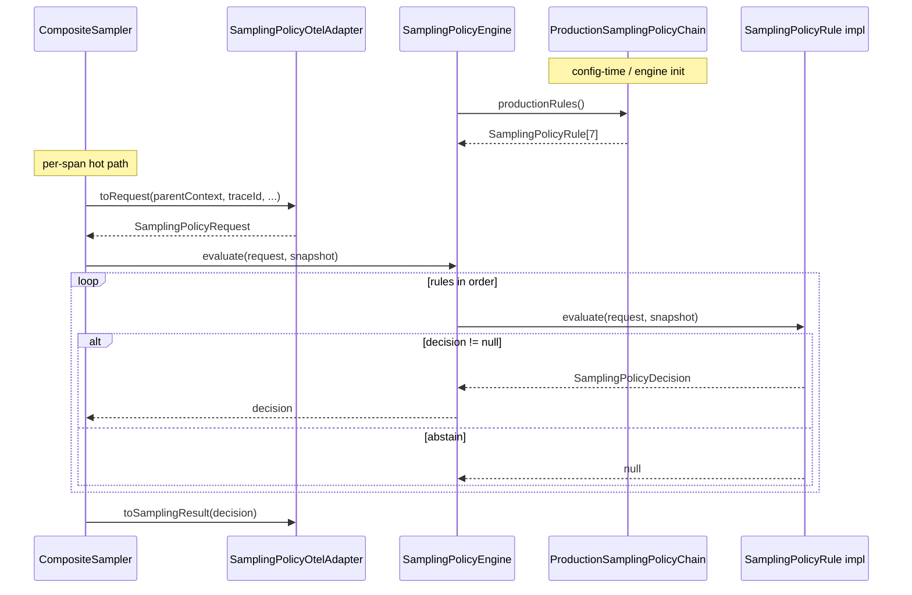

# Tracing Sampling Policy Package Inventory

**Package:** `space.br1440.platform.tracing.core.sampling.policy`  
**Module:** `platform-tracing-core`  
**Analysis date:** 2026-07-01  
**Purpose:** Factual inventory of the semantic sampling-rules layer after package layering refactor. No architecture proposals in this document.

**Related layers (out of scope, referenced for context):**

| Layer | Package | Role |
|-------|---------|------|
| Model | `core.sampling.model` | Immutable request/decision/snapshot state consumed by rules |
| Engine | `core.sampling.engine` | Chain-of-responsibility executor (`SamplingPolicyEngine`) |
| Properties | `core.sampling.properties` | Compile-time properties → snapshot (`SamplingPolicySnapshotFactory`) |
| Integration | `platform-tracing-otel-extension` … `sampler` | OTel adapter + `CompositeSampler` hot path |

---

## Executive Summary

The `core.sampling.policy` package is the **semantic layer** of platform sampling: seven stateless chain rules, a public rule contract, package-private concrete implementations, a deterministic ratio helper, and the **only** assembly point for production/foundation rule chains.

Rules implement chain-of-responsibility semantics: `evaluate(request, snapshot)` returns a concrete `SamplingPolicyDecision` or **`null` (abstain)**. The engine in `core.sampling.engine` walks the array returned by `ProductionSamplingPolicyChain` and returns the first non-null decision.

**Configuration does not enter this package.** Rules read only `SamplingPolicySnapshot` (compiled in `properties` / otel-extension `SamplerState`) and `SamplingPolicyRequest` (built by `SamplingPolicyOtelAdapter`).

**External surface:**

| Type | Visibility | Intended consumer |
|------|------------|-------------------|
| `SamplingPolicyRule` | `public` interface | Engine (type of rule array); **not** extension API |
| `ProductionSamplingPolicyChain` | `public` utility | Engine only (ArchUnit-restricted) |
| All 7 concrete rules | **package-private** | Only chain assembly + unit tests in same package |
| `TraceIdRatioDecision`, `SamplingPolicyRuleNames` | **package-private** | Internal to policy |

**Direct production imports of `core.sampling.policy`:** only `SamplingPolicyEngine` (engine package). otel-extension imports `engine`, not `policy` directly (verified by grep, 2026-07-01).

**Key factual findings:**

1. Normative production order is defined once in `ProductionSamplingPolicyChain.productionRules()` — seven rules, fresh instances per call.
2. `DefaultRatioPolicyRule` **never abstains**; with the production chain the engine never returns `ABSTAIN` in normal operation.
3. `RouteRatioPolicyRule` relies on **longest-prefix-first** sort performed in `SamplingPolicySnapshot` (model), not on map/list insertion order.
4. `HardDropPolicyRule` uses **first matching prefix in snapshot list order** (not longest-prefix-wins).
5. Ratio decisions delegate to package-private `TraceIdRatioDecision`, algorithmically aligned with OTel `TraceIdRatioBased` (verified by `TraceIdRatioParityTest` via `productionEngine()`).
6. Concrete rules are **package-private**; cross-module direct instantiation (e.g. `new DefaultRatioPolicyRule()` from otel-extension) does not compile.
7. **NEEDS_VERIFICATION:** ArchUnit rules in `ModuleTaxonomyArchRules` still reference package suffix `core.sampling.config`, while production code uses `core.sampling.properties` — possible guardrail drift.

---

## Package Map

```
space.br1440.platform.tracing.core.sampling.policy/
├── Contract
│   └── SamplingPolicyRule                    (public interface)
├── Chain assembly
│   └── ProductionSamplingPolicyChain         (public @UtilityClass — not extension API)
├── Production rules (all package-private final)
│   ├── KillSwitchPolicyRule                  (#1 kill_switch)
│   ├── HardDropPolicyRule                    (#2 hard_drop)
│   ├── ForceHeaderPolicyRule                 (#3 force_header)
│   ├── QaTracePolicyRule                     (#4 qa_trace)
│   ├── ParentSampledPolicyRule               (#5 parent_decision)
│   ├── RouteRatioPolicyRule                  (#6 route_ratio)
│   └── DefaultRatioPolicyRule                (#7 default_ratio — terminal)
└── Internal utilities (package-private)
    ├── TraceIdRatioDecision                  (deterministic traceId ratio)
    └── SamplingPolicyRuleNames               (winning-rule string constants)
```

**File count:** 11 production Java files, 9 test files (same package in tests).

---

## Layer Boundaries and Dependencies

### Allowed dependencies (policy →)

| Target | Used for |
|--------|----------|
| `core.sampling.model.*` | `SamplingPolicyRequest`, `SamplingPolicySnapshot`, `SamplingPolicyDecision`, enums/records |
| `core.utils.*` | `StringUtils`, `SetUtils` (null/empty checks) |
| `api.attributes.PlatformSamplingReasons` | Rule name constants via `SamplingPolicyRuleNames` |

### Forbidden dependencies (enforced / intended)

| Target | Status |
|--------|--------|
| `core.sampling.engine` | **Not imported** — `SAMPLING_POLICY_NO_ENGINE_OR_CONFIG` |
| `core.sampling.properties` / legacy `config` | **Not imported** |
| OpenTelemetry, Spring, JMX | **Not imported** — `CORE_POLICY_PACKAGES_NO_OTEL_OR_SPRING` |

### Inbound dependencies (→ policy)

| Consumer | Types used |
|----------|------------|
| `SamplingPolicyEngine` | `ProductionSamplingPolicyChain`, `SamplingPolicyRule` |
| Unit tests in `core.sampling.policy` | All concrete rules (same package) |

Evidence: `SamplingPolicyEngine.java:6-7`; grep for `core.sampling.policy` in production sources.

---

## Visibility and Extension-API Posture

| Class | Visibility | Rationale |
|-------|------------|-----------|
| `SamplingPolicyRule` | `public` | Engine holds `SamplingPolicyRule[]`; interface visible across package boundary |
| `ProductionSamplingPolicyChain` | `public` | Engine in sibling package must call `productionRules()` / `foundationRules()` |
| 7 rule classes | **package-private** | Instantiations confined to `ProductionSamplingPolicyChain` (+ tests) |
| `TraceIdRatioDecision` | **package-private** | Ratio helper — implementation detail of ratio rules |
| `SamplingPolicyRuleNames` | **package-private** | Centralizes `winningRule` strings |

**Dual enforcement of «not extension API»:**

1. **Java visibility** — external modules cannot reference concrete rule classes.
2. **ArchUnit** — `SAMPLING_RULE_IMPLS_ONLY_IN_POLICY`: any `SamplingPolicyRule` implementation must reside in `..core.sampling.policy..`.
3. **ArchUnit** — `PRODUCTION_CHAIN_ACCESS_RESTRICTED`: only `policy` and `engine` may depend on `ProductionSamplingPolicyChain`.

ADR: `docs/decisions/ADR-sampling-package-layering.md`.

---

## Class-by-Class Inventory

### `SamplingPolicyRule` (interface)

| Attribute | Detail |
|-----------|--------|
| **Responsibility** | Contract for a single policy rule in the chain |
| **Category** | Domain logic contract |
| **Public API** | `String ruleName()`; `SamplingPolicyDecision evaluate(SamplingPolicyRequest, SamplingPolicySnapshot)` |
| **Abstain protocol** | Return **`null`** (not `SamplingPolicyDecision.abstain()`) |
| **State** | Implementations are stateless; pre-built static `SamplingPolicyDecision` constants |
| **Thread-safety** | Safe if stateless (all current rules are) |

Evidence: `SamplingPolicyRule.java:7-13`

---

### `ProductionSamplingPolicyChain`

| Attribute | Detail |
|-----------|--------|
| **Responsibility** | Sole assembly point for rule arrays; defines normative order |
| **Category** | Chain builder (config-time, not hot-path logic) |
| **Public API** | `productionRules()` → 7 rules; `foundationRules()` → 2 rules (kill-switch + hard-drop) |
| **Fresh-array contract** | Each call returns **new array** and **new rule instances** (verified by test) |
| **State** | `@UtilityClass` — no instances |
| **Consumers** | `SamplingPolicyEngine.productionEngine()`, `SamplingPolicyEngine.foundationEngine()` |

Evidence: `ProductionSamplingPolicyChain.java:6-25`; `ProductionSamplingPolicyChainTest.productionRules_returnsFreshArrayEachCall()`

---

### `SamplingPolicyRuleNames` (package-private)

| Constant | Value source | Used by |
|----------|--------------|---------|
| `KILL_SWITCH` | `PlatformSamplingReasons.KILL_SWITCH` | KillSwitchPolicyRule |
| `HARD_DROP` | literal `"hard_drop"` | HardDropPolicyRule |
| `FORCE_HEADER` | `PlatformSamplingReasons.FORCE_HEADER` | ForceHeaderPolicyRule |
| `QA_TRACE` | `PlatformSamplingReasons.QA_TRACE` | QaTracePolicyRule |
| `PARENT_DECISION` | literal `"parent_decision"` | ParentSampledPolicyRule |
| `ROUTE_RATIO` | `PlatformSamplingReasons.ROUTE_RATIO` | RouteRatioPolicyRule |
| `DEFAULT_RATIO` | literal `"default_ratio"` | DefaultRatioPolicyRule |

**Note:** `winningRule()` strings mix API constants and local literals. Metric keys in `CompositeSampler` use `decision.winningRule()` via `SamplingPolicyOtelAdapter.metricRuleName()`.

Evidence: `SamplingPolicyRuleNames.java:7-16`

---

### `TraceIdRatioDecision` (package-private)

| Attribute | Detail |
|-----------|--------|
| **Responsibility** | Deterministic probability sampling from W3C traceId |
| **Category** | Pure utility (zero allocation) |
| **API** | `static boolean shouldSample(String traceId, double probability)` |
| **Algorithm** | `probability >= 1.0` → true; `<= 0.0` → false; requires `traceId != null && length >= 32`; compares `Math.abs(parseUnsignedLong(traceId.substring(16), 16)) < (long)(probability * Long.MAX_VALUE)` |
| **Invalid traceId** | Returns **false** (drop) — no exception |
| **Used by** | `RouteRatioPolicyRule`, `DefaultRatioPolicyRule` |
| **Parity** | Golden tests in `TraceIdRatioDecisionTest`; cross-module parity in `TraceIdRatioParityTest` (via engine) |

Evidence: `TraceIdRatioDecision.java:12-31`; `TraceIdRatioDecisionTest.java`

---

### Rule implementations — common pattern

All seven rules:

- `final class`, **package-private**, implement `SamplingPolicyRule`
- Hold **static final** pre-built `SamplingPolicyDecision` instances (zero allocation on hot path when rule fires)
- No instance fields; no synchronization
- Read-only access to `request` and `snapshot`

---

### `KillSwitchPolicyRule` (#1)

| Attribute | Detail |
|-----------|--------|
| **Trigger** | `!snapshot.isEnabled()` |
| **Decision** | DROP, reason `KILL_SWITCH`, winningRule `kill_switch` |
| **Abstains when** | `snapshot.isEnabled() == true` |
| **Request fields used** | None |
| **Snapshot fields used** | `enabled` |

Evidence: `KillSwitchPolicyRule.java:8-26`

---

### `HardDropPolicyRule` (#2)

| Attribute | Detail |
|-----------|--------|
| **Trigger** | `urlPath.startsWith(dropPrefix)` for any entry in `snapshot.getDroppedRoutes()` |
| **Decision** | DROP, reason `HARD_DROP`, winningRule `hard_drop` |
| **Abstains when** | Empty drop list; null/empty `urlPath`; no prefix match |
| **Prefix semantics** | **First match in list iteration order** (snapshot stores normalized trimmed list; **not** longest-prefix-first) |
| **Request fields used** | `urlPath` |
| **Snapshot fields used** | `droppedRoutes` |

Evidence: `HardDropPolicyRule.java:9-38`; `HardDropPolicyRuleTest.java`

---

### `ForceHeaderPolicyRule` (#3)

| Attribute | Detail |
|-----------|--------|
| **Trigger** | Force header value matches configured set |
| **Decision** | RECORD_AND_SAMPLE, reason `FORCE_HEADER` |
| **Abstains when** | Empty force set; no match |
| **Matching logic** | Exact `Set.contains(rawValue)` first; then case-insensitive compare against normalized snapshot values (snapshot lowercases force values at compile time) |
| **Request fields used** | `forceTraceHeaderValue` (from `PlatformTraceControl` via adapter) |
| **Snapshot fields used** | `forceRecordValues` |

Evidence: `ForceHeaderPolicyRule.java:12-52`; `ForceHeaderPolicyRuleTest.customForceValue_isCaseInsensitive()`

---

### `QaTracePolicyRule` (#4)

| Attribute | Detail |
|-----------|--------|
| **Trigger** | `request.qaTrace() == true` |
| **Decision** | RECORD_AND_SAMPLE, reason `QA_TRACE` |
| **Abstains when** | `qaTrace == false` |
| **Snapshot fields used** | None (ignores snapshot) |

Evidence: `QaTracePolicyRule.java:8-26`

---

### `ParentSampledPolicyRule` (#5)

| Attribute | Detail |
|-----------|--------|
| **Trigger** | `ParentContextState` from request |
| **Decisions** | SAMPLED → RECORD_AND_SAMPLE (`PARENT_DECISION`); NOT_SAMPLED → DROP (`PARENT_DROP`); both use winningRule `parent_decision` |
| **Abstains when** | `ABSENT` |
| **Snapshot fields used** | None |
| **Parent state source** | `SamplingPolicyOtelAdapter.resolveParentState()` from OTel parent `SpanContext` |

Evidence: `ParentSampledPolicyRule.java:8-30`; `SamplingPolicyOtelAdapter.java:109-115`

---

### `RouteRatioPolicyRule` (#6)

| Attribute | Detail |
|-----------|--------|
| **Trigger** | First route prefix where `urlPath.startsWith(entry.prefix())` |
| **Decisions** | ratio ≥ 1.0 → SAMPLE; ratio ≤ 0.0 → DROP; else `TraceIdRatioDecision.shouldSample(traceId, ratio)` |
| **Reasons** | SAMPLE → `ROUTE_RATIO`; DROP → `ROUTE_RATIO_DROP` |
| **Abstains when** | No route ratios in snapshot; null/empty `urlPath`; no prefix match |
| **Prefix semantics** | **Longest-prefix-first** — enforced by `SamplingPolicySnapshot` sort before evaluation |
| **Request fields used** | `urlPath`, `traceId` |
| **Snapshot fields used** | `routeRatios` (`RouteRatioPrefix[]`) |

Evidence: `RouteRatioPolicyRule.java:6-53`; `RouteRatioPolicyRuleTest.overlappingPrefixes_mostSpecificWins()`

---

### `DefaultRatioPolicyRule` (#7 — terminal)

| Attribute | Detail |
|-----------|--------|
| **Trigger** | Always evaluates (never abstains) |
| **Decisions** | Same ratio thresholds as route rule, applied to `snapshot.getDefaultRatio()` |
| **Reasons** | SAMPLE → `DEFAULT_RATIO`; DROP → `DEFAULT_RATIO_DROP` |
| **Request fields used** | `traceId` (for fractional ratio) |
| **Snapshot fields used** | `defaultRatio` |
| **Terminal guarantee** | Ensures production engine never abstains |

Evidence: `DefaultRatioPolicyRule.java:8-39`; `SamplingPolicyEngineTest.productionEngine_neverAbstains()`

---

## Normative Production Rule Order

| # | Class | `ruleName()` | Typical priority role |
|---|-------|--------------|------------------------|
| 1 | KillSwitchPolicyRule | `kill_switch` | Global off → DROP all |
| 2 | HardDropPolicyRule | `hard_drop` | Path denylist |
| 3 | ForceHeaderPolicyRule | `force_header` | Operator force-on |
| 4 | QaTracePolicyRule | `qa_trace` | QA/debug force-on |
| 5 | ParentSampledPolicyRule | `parent_decision` | Distributed trace inheritance |
| 6 | RouteRatioPolicyRule | `route_ratio` | Per-prefix ratio override |
| 7 | DefaultRatioPolicyRule | `default_ratio` | Global ratio fallback |

**Foundation chain** (tests / minimal engine): rules #1–#2 only via `foundationRules()`.

Evidence: `ProductionSamplingPolicyChain.java:8-24`; characterized in core + otel-extension tests.

---

## Rule Interaction Matrix (engine-level)

Verified by `SamplingPolicyEngineTest` and individual rule tests:

| Scenario | Winning rule | Reason |
|----------|--------------|--------|
| Disabled + matching hard-drop path | kill_switch | KILL_SWITCH (kill-switch wins over hard-drop) |
| Force header `on` + defaultRatio 0.0 | force_header | FORCE_HEADER |
| Parent NOT_SAMPLED + route ratio 1.0 on matching path | parent_decision | PARENT_DROP |
| Enabled, no force/qa/parent, no route match, defaultRatio 1.0 | default_ratio | DEFAULT_RATIO |
| Enabled, empty request, defaultRatio 1.0 (3-arg snapshot) | default_ratio | DEFAULT_RATIO (engine never abstains) |

---

## Decision and Reason Mapping

Rules emit only `DROP` or `RECORD_AND_SAMPLE`. **`RECORD_ONLY` is never produced by any rule in this package.**

| Rule | DROP reason | SAMPLE reason | `reasonCode()` (via enum) |
|------|-------------|---------------|---------------------------|
| KillSwitch | KILL_SWITCH | — | `kill_switch` |
| HardDrop | HARD_DROP | — | `drop_path` |
| ForceHeader | — | FORCE_HEADER | `force_header` |
| QaTrace | — | QA_TRACE | `qa_trace` |
| Parent | PARENT_DROP | PARENT_DECISION | `parent_drop` / `parent_sampled` |
| RouteRatio | ROUTE_RATIO_DROP | ROUTE_RATIO | `route_ratio_drop` / `route_ratio` |
| DefaultRatio | DEFAULT_RATIO_DROP | DEFAULT_RATIO | `global_ratio_drop` / `global_ratio` |

Adapter mapping: `SamplingPolicyOtelAdapter.toSamplingResult()` switches on `decision.reason()` (not `winningRule()`).

Evidence: `SamplingPolicyReason.java`; `SamplingPolicyOtelAdapter.java:87-99`

---

## Inputs Consumed by Policy Layer

### From `SamplingPolicyRequest` (model)

| Field | Set by adapter from | Rules reading it |
|-------|---------------------|------------------|
| `urlPath` | OTel attribute `url.path` | HardDrop, RouteRatio |
| `traceId` | OTel SDK argument | RouteRatio, DefaultRatio |
| `forceTraceHeaderValue` | `PlatformTraceControl.rawForceTraceValue()` | ForceHeader |
| `qaTrace` | `PlatformTraceControl.qaTrace()` | QaTrace |
| `parentContextState` | Parent `SpanContext.isSampled()` | ParentSampled |

Evidence: `SamplingPolicyOtelAdapter.toRequest()` lines 63-75

### From `SamplingPolicySnapshot` (model)

| Field | Normalization (in snapshot ctor) | Rules reading it |
|-------|----------------------------------|------------------|
| `enabled` | as-is | KillSwitch |
| `droppedRoutes` | trim, skip blank | HardDrop |
| `forceRecordValues` | trim, lowercase | ForceHeader |
| `routeRatios` | longest-prefix-first sort | RouteRatio |
| `defaultRatio` | validated ∈ [0,1] at ctor | DefaultRatio |
| `version` | as-is | not read by rules |

Evidence: `SamplingPolicySnapshot.java:14-95`

---

## Runtime Flow (policy in context)

Policy classes are **not** invoked directly from otel-extension. Hot path:



Evidence: `CompositeSampler.java:30-47`; `SamplingPolicyEngine.java:26-38`

### Abstain / fallback semantics

- Rules return **`null`** to abstain.
- Engine returns `SamplingPolicyDecision.abstain()` only if **all** rules abstain (`SamplingPolicyEngine.java:38`).
- Production chain: rule #7 never abstains → engine never abstains.
- If abstain occurred (custom engine), adapter maps to DROP (`FALLBACK_DROP`); metric key `fallback_drop`.

---

## Hot-Path and Performance Characteristics

| Property | Fact |
|----------|------|
| Rule instances | Stateless; static final decisions reused |
| Per-evaluation allocation in rules | **Zero** when using pre-built decisions |
| `TraceIdRatioDecision` | No allocation; pure arithmetic on traceId substring |
| Chain walk | Array iteration in engine; early exit on first decision |
| Route ratio scan | Linear in number of prefixes; order pre-sorted by length |
| Hard drop scan | Linear in drop list size |
| Engine construction | `productionEngine()` allocates new rule array + 7 rule objects **once** per `CompositeSampler` lifetime |

JMH evidence (post-refactor, dev profile): `CompositeSamplerBenchmark` / `CompositeSamplerPolicyBranchesBenchmark` — latency tens of ns/op; allocations in full `shouldSample` path come from adapter/request construction, not from rule evaluation body. See `docs/decisions/ADR-sampling-package-layering.md` § Hot-path safety.

---

## Test Coverage

### Unit tests in `core.sampling.policy` (9 files)

| Test class | Focus | Approx. tests |
|------------|-------|---------------|
| `KillSwitchPolicyRuleTest` | enabled/disabled | 2 |
| `HardDropPolicyRuleTest` | prefix match, empty path/list | 4 |
| `ForceHeaderPolicyRuleTest` | match, case-insensitivity, empty set | 4 |
| `QaTracePolicyRuleTest` | qa flag, rule name | 3 |
| `ParentSampledPolicyRuleTest` | SAMPLED / NOT_SAMPLED / ABSENT | 3 |
| `RouteRatioPolicyRuleTest` | ratio 0/1, longest-prefix, insertion-order independence | 7 |
| `DefaultRatioPolicyRuleTest` | defaultRatio 0/1 | 2 |
| `TraceIdRatioDecisionTest` | golden ratio algorithm | 7 |
| `ProductionSamplingPolicyChainTest` | order, fresh array, engine integration | 3 |

### Cross-layer tests referencing policy behavior

| Test | Module | What it guards |
|------|--------|----------------|
| `SamplingPolicyEngineTest` | core.engine | Chain priority, foundation vs production, never-abstain |
| `TraceIdRatioParityTest` | otel-extension | Core default_ratio vs OTel `TraceIdRatioBased` via `productionEngine()` |
| `SamplingRuleOrderCharacterizationTest` | otel-extension | CompositeSampler engine order vs expected list |

**Not covered in policy package (by design):**

- OTel attribute extraction edge cases (adapter tests in otel-extension)
- Properties compile LENIENT matrix (`core.sampling.properties` tests)
- Full e2e / JMX update flows

---

## External Call Sites (production)

| File | Module | References |
|------|--------|------------|
| `SamplingPolicyEngine.java` | core.engine | `ProductionSamplingPolicyChain`, `SamplingPolicyRule` |

**No production file outside `core.sampling.{policy,engine}` imports concrete rule classes.**

otel-extension references policy only indirectly through `SamplingPolicyEngine.productionEngine()`.

---

## ArchUnit Guardrails Affecting Policy

| Rule | Effect on policy |
|------|------------------|
| `SAMPLING_POLICY_NO_ENGINE_OR_CONFIG` | Policy must not depend on engine or properties/config |
| `SAMPLING_RULE_IMPLS_ONLY_IN_POLICY` | All `SamplingPolicyRule` impls only in this package |
| `PRODUCTION_CHAIN_ACCESS_RESTRICTED` | Only policy + engine may use `ProductionSamplingPolicyChain` |
| `CORE_POLICY_PACKAGES_NO_OTEL_OR_SPRING` | No OTel/Spring/JMX in policy |
| `SAMPLING_MODEL_IS_PURE` | Model must not depend on policy (inverse edge) |

Applied in: `CorePolicyPackagePurityArchTest`.

**Known drift (NEEDS_VERIFICATION):** `SAMPLING_MODEL_IS_PURE` and `SAMPLING_CONFIG_DEPENDS_ONLY_ON_MODEL` / `SAMPLING_POLICY_NO_ENGINE_OR_CONFIG` reference package glob `..core.sampling.config..`, while production package was renamed to `core.sampling.properties`. ArchUnit may not enforce properties-layer boundaries until rules are updated.

---

## Open Questions / NEEDS_VERIFICATION

| Item | Notes |
|------|-------|
| ArchUnit `config` vs `properties` package name | Rules may not match renamed package |
| Hard-drop overlapping prefixes | First list win — unlike route-ratio longest-prefix; intentional but undocumented in ADR |
| `urlPath` blank vs empty | HardDrop/RouteRatio use `isNullOrEmpty` (blank string `"   "` is **not** treated as absent) |
| OTel traceId length under all SDK versions | `TraceIdRatioDecision` drops if `< 32` chars; adapter typically supplies W3C 32-hex ids |
| Future non-OTel caller of `SamplingPolicyEngine` | Only otel-extension `CompositeSampler` in current codebase |

---

## Appendix: Source File Paths

### Production (`platform-tracing-core/.../sampling/policy/`)

| File | Visibility |
|------|------------|
| `SamplingPolicyRule.java` | public interface |
| `ProductionSamplingPolicyChain.java` | public |
| `KillSwitchPolicyRule.java` | package-private |
| `HardDropPolicyRule.java` | package-private |
| `ForceHeaderPolicyRule.java` | package-private |
| `QaTracePolicyRule.java` | package-private |
| `ParentSampledPolicyRule.java` | package-private |
| `RouteRatioPolicyRule.java` | package-private |
| `DefaultRatioPolicyRule.java` | package-private |
| `TraceIdRatioDecision.java` | package-private |
| `SamplingPolicyRuleNames.java` | package-private |

### Tests (`platform-tracing-core/.../sampling/policy/`)

| File |
|------|
| `KillSwitchPolicyRuleTest.java` |
| `HardDropPolicyRuleTest.java` |
| `ForceHeaderPolicyRuleTest.java` |
| `QaTracePolicyRuleTest.java` |
| `ParentSampledPolicyRuleTest.java` |
| `RouteRatioPolicyRuleTest.java` |
| `DefaultRatioPolicyRuleTest.java` |
| `TraceIdRatioDecisionTest.java` |
| `ProductionSamplingPolicyChainTest.java` |

### Primary collaborators

| File | Package |
|------|---------|
| `SamplingPolicyEngine.java` | core.engine |
| `SamplingPolicyRequest.java` | core.model |
| `SamplingPolicyDecision.java` | core.model |
| `SamplingPolicySnapshot.java` | core.model |
| `CompositeSampler.java` | otel-extension |
| `SamplingPolicyOtelAdapter.java` | otel-extension |
| `ModuleTaxonomyArchRules.java` | platform-tracing-test |

### Documentation references

| File |
|------|
| `docs/decisions/ADR-sampling-package-layering.md` |
| `docs/analysis/tracing-sampling-package-inventory.md` (pre-layering full-package inventory) |
| `docs/architecture/platform-tracing-sampling-characterization.md` |
| `platform-tracing-api/.../PlatformSamplingReasons.java` |
