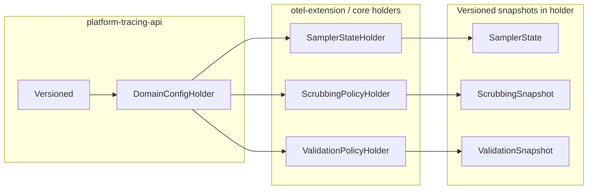

# Инвентаризация: `space.br1440.platform.tracing.api.config.Versioned`

**Дата:** 2026-07-01
**Статус:** для architect review (факты из кода + контекст для рефакторинга пакета)
**Триггер:** архитекторы считают, что интерфейс находится **не в том пакете** и требует рефакторинга.

---

## 1. Краткое резюме

| Факт | Значение |
|------|----------|
| **Что это** | Маркерный контракт «иммутабельный снимок с монотонной `long`-версией» |
| **Где живёт** | `platform-tracing-api` → `space.br1440.platform.tracing.api.config` |
| **Единственный потребитель контракта (generic bound)** | `DomainConfigHolder<T extends Versioned>` (тот же пакет) |
| **Production implementers** | 4 класса в 3 модулях |
| **Прямых импортов из application/starter кода** | **0** (grep по репозиторию) |
| **Публичность** | `public interface` в API-модуле, но по факту — **infrastructure primitive**, не SDK-контракт для прикладных команд |

**Суть замечания архитекторов (гипотеза, требует подтверждения на review):** имя пакета `api.config` семантически ассоциируется с «конфигурацией приложения / properties / wire-schema», тогда как `Versioned` — это **runtime-механика атомарной публикации policy-снимков** (Фаза 14). Рядом в API уже есть более точный пакет `api.control.wire` для JMX/control-plane wire-контрактов.

---

## 2. Определение интерфейса

**Файл:** `platform-tracing-api/src/main/java/space/br1440/platform/tracing/api/config/Versioned.java`

```java
/**
 * Иммутабельный снимок конфигурации, несущий монотонную версию.
 * Монотонность обеспечивает DomainConfigHolder через CAS.
 */
public interface Versioned {
    /** Монотонно растущая версия снимка. Стартовый снимок обычно имеет версию 1. */
    long version();
}
```

| Свойство | Значение |
|----------|----------|
| Методов | 1 — `long version()` |
| Семантика версии | простое `long`-поле снимка; отдельного типа `ConfigVersion` нет (осознанное «no over-engineering», ADR Фаза 14) |
| Гарантия монотонности | **не в интерфейсе** — обеспечивается дисциплиной builder'ов (`prev.version() + 1`) + CAS в `DomainConfigHolder` |
| Immutability | **не закреплена** в типе — только javadoc |

---

## 3. Связанный тип: `DomainConfigHolder<T extends Versioned>`

**Файл:** `platform-tracing-api/.../api/config/DomainConfigHolder.java`

`Versioned` существует **в первую очередь** как upper bound для holder'а:

```java
public final class DomainConfigHolder<T extends Versioned> {
    public T current();
    public long version();  // делегирует ref.get().version()
    public boolean tryUpdate(UnaryOperator<T> builder);
    public boolean tryUpdate(UnaryOperator<T> builder, Predicate<T> validator);
}
```

| Контракт | Назначение |
|----------|------------|
| Lock-free read | hot-path читает `current()` без блокировок |
| CAS publish | атомарная замена целого снимка |
| Last-known-good | builder/validator throw/null → `false`, предыдущий снимок сохраняется |
| Side-effect-free builder | при contention builder может вызываться многократно |

**ADR:** [ADR-runtime-config-policy-vs-topology.md](../decisions/ADR-runtime-config-policy-vs-topology.md) — единый механизм runtime-mutable policy для sampler / scrubbing / validation.

**Почему класс в `api`:** dual classloader (Spring app CL + OTel Agent extension CL) — примитив должен быть виден обоим (javadoc `DomainConfigHolder`).

---

## 4. Пакет `api.config` в контексте модуля `platform-tracing-api`

### 4.1. Содержимое пакета (production)

| Класс | Роль |
|-------|------|
| `Versioned` | маркер версии снимка |
| `DomainConfigHolder` | CAS + LKG holder |

**Весь пакет — 2 класса.** Больше ничего в `api.config` нет.

### 4.2. Соседние пакеты API (для сравнения семантики)

| Пакет | Примеры | Смысл «config/control» |
|-------|---------|------------------------|
| `api` | `TraceOperations`, span builders | публичный SDK |
| `api.control.wire` | `TracingControlWireSchema`, `TracingControlWireValidator` | **wire-контракт** JMX/control-plane (JDK-only, без I/O) |
| `api.config` | `Versioned`, `DomainConfigHolder` | **runtime CAS primitive** (не wire, не Spring properties) |
| `api.spi` | `SpanAttributeScrubbingRule` | extension SPI |
| `api.attributes` | `PlatformSamplingReasons` | semconv/platform attrs |

**Конфликт имён:** `api.config` ≠ Spring `@ConfigurationProperties` / `TracingProperties` (они в autoconfigure).
`api.config` ≠ `api.control.wire` (тот описывает **поля wire-payload**, а не holder-механику).

### 4.3. Что говорят архитектурные документы

| Документ | Позиция |
|----------|---------|
| `platform-tracing-target-architecture.md` | `api/config/` — `DomainConfigHolder`, `Versioned` |
| `platform-tracing-preservation-first-migration-plan.md` | `KEEP_AS_IS`, LOW risk |
| `ADR-runtime-config-policy-vs-topology.md` | holder + Versioned — центральный runtime-механизм |
| `ADR-sampling-package-layering.md` | `core.sampling.model` зависит от `api` **только** для `Versioned` (+ `PlatformSamplingReasons`) |

Документы **не обосновывают** выбор имени `config` vs `runtime` / `control` / `snapshot`.

---

## 5. Production implementers `Versioned`

| # | Класс | Модуль | Пакет | Хранится в `DomainConfigHolder`? | Роль версии |
|---|-------|--------|-------|----------------------------------|-------------|
| 1 | `SamplerState` | otel-extension | `...sampler` | **Да** (`SamplerStateHolder`) | CAS-версия sampling policy; JMX/метрики |
| 2 | `ScrubbingSnapshot` | otel-extension | `...scrubbing` | **Да** (`ScrubbingPolicyHolder`) | CAS-версия scrubbing policy |
| 3 | `ValidationSnapshot` | core | `...core.validation` | **Да** (`ValidationPolicyHolder`) | CAS-версия validation policy |
| 4 | `SamplingPolicySnapshot` | core | `...core.sampling.model` | **Нет** (вложен в `SamplerState`) | поле `version` прокидывается из `SamplerState`; **не участвует в CAS напрямую** |

### 5.1. Детали по каждому implementer

#### `SamplerState` (otel-extension) — **primary CAS entity для sampling**

- `SamplerStateHolder` → `DomainConfigHolder<SamplerState>`
- `version()` — монотонное поле, инкремент при `SamplerPolicyUpdate.buildNext` / JMX round-trip
- Внутри держит `SamplingPolicySnapshot policySnapshot` (compile artifact для hot-path rules)
- Hot-path: `CompositeSampler` → `configHolder.current().policySnapshot()`

#### `ScrubbingSnapshot` (otel-extension)

- `ScrubbingPolicyHolder` → `DomainConfigHolder<ScrubbingSnapshot>`
- Версия для JMX reload metrics, runtime rule list updates

#### `ValidationSnapshot` (core)

- `ValidationPolicyHolder` → `DomainConfigHolder<ValidationSnapshot>`
- Record с полем `version`; используется `ValidatingSpanProcessor`

#### `SamplingPolicySnapshot` (core) — **спорный implementer**

```java
@Getter
public final class SamplingPolicySnapshot implements Versioned {
    private final long version;
    @Override
    public long version() { return version; }
}
```

| Наблюдение | Implication |
|------------|-------------|
| Не кладётся в `DomainConfigHolder` | generic bound `T extends Versioned` **не требует** этого класса |
| `version` копируется из `SamplerState` через `SamplingPolicyProperties` | дублирование версии: outer `SamplerState.version()` и inner `policySnapshot.version()` |
| Production grep: **нет** вызовов `policySnapshot().version()` | поле используется в **тестах** и при compile через factory |
| Зависимость `core.sampling.model → api.config` | единственная причина — `implements Versioned` (ArchUnit `SAMPLING_MODEL_IS_PURE` разрешает только `api`) |

**Вопрос для рефакторинга:** нужен ли `implements Versioned` на domain compile-snapshot, или достаточно plain `long version` без API-зависимости?

---

## 6. Где и зачем используется (по целям)

### 6.1. Runtime CAS / last-known-good (основная цель)



| Holder | Модуль | Update entry points |
|--------|--------|---------------------|
| `SamplerStateHolder` | otel-extension | `tryApplyPolicyUpdate`, `tryUpdate`, JMX via `PlatformSamplingControl` |
| `ScrubbingPolicyHolder` | otel-extension | `tryApplyPolicyUpdate`, JMX scrubbing control |
| `ValidationPolicyHolder` | otel-extension | `tryUpdate`, JMX validation control |

### 6.2. JMX / observability (версия как metadata)

| Место | Использование |
|-------|---------------|
| `PlatformSamplingControl` | `getSamplingPolicyVersion()`, `JmxConfigReloadRecorder.record(..., version)` |
| `ValidatingSpanProcessor` | `policyHolder.version()` |
| `ScrubbingSpanProcessor` | `policyHolder.version()` |
| `CompositeSampler` (debug) | `configHolder.current().version()` |

Версия здесь — **observability / reconcile**, не часть hot-path decision logic.

### 6.3. Hot-path sampling (косвенно)

`Versioned` **не вызывается** на hot-path `shouldSample`.
Hot-path читает `SamplerState` → `policySnapshot` → policy engine. Поле `version` на hot-path **не используется** (grep).

### 6.4. Тесты и bench

| Область | Файлы (примеры) |
|---------|-----------------|
| API unit | `DomainConfigHolderTest` (record `Snapshot implements Versioned`) |
| Sampling | `SamplerStateHolderTest`, `SamplerPolicyUpdateTest`, concurrency/characterization tests |
| Scrubbing | `ScrubbingPolicyHolderTest`, `ScrubbingPolicyUpdateTest` |
| Validation | `ValidationPolicyHolderTest`, `ValidationSnapshotTest` |
| JMH | `CompositeSamplerConcurrentUpdateBenchmark` (side-effect-free builder с `prev.version() + 1`) |

### 6.5. Зависимости модулей на `api.config`

| Модуль | Зависимость от api | Импортирует |
|--------|-------------------|-------------|
| `platform-tracing-core` | `api` (transitive/public) | `Versioned` ← 2 implementers |
| `platform-tracing-otel-extension` | `implementation api` + **embedded in agent JAR** | `Versioned`, `DomainConfigHolder` |
| `platform-tracing-api` | — | defines both |
| Spring autoconfigure / starters | `api` | **не импортируют** `Versioned` |
| Application code | через starter | **не импортируют** `Versioned` |

---

## 7. Почему пакет `api.config` может считаться «неверным»

### 7.1. Семантическое несоответствие имени

| Ожидание от `*.config` | Фактическое содержимое `api.config` |
|------------------------|-------------------------------------|
| Properties / binding DTO | **нет** |
| Spring `@ConfigurationProperties` | **нет** (живут в autoconfigure) |
| Wire schema / control payload | **нет** (это `api.control.wire`) |
| Compile-time config normalization | **нет** (это `core.sampling.properties`) |
| **Runtime CAS holder + version marker** | **да** — единственное содержимое |

### 7.2. «Public API» vs «internal infrastructure»

`platform-tracing-api` позиционируется как контракт для прикладных команд (`TraceOperations`, builders, SPI).
`Versioned` + `DomainConfigHolder` — **agent/runtime infrastructure**, не используемая приложениями напрямую.

Размещение в корне `api` делает тип **технически public**, хотя по intent это shared primitive между classloader'ами.

### 7.3. Зависимость domain model → `api.config`

`SamplingPolicySnapshot implements Versioned` тянет `core.sampling.model` к пакету с именем «config», хотя snapshot — **domain compile state**, не configuration layer (см. ADR sampling layering).

### 7.4. Путаница с другими «version» в системе

| Термин | Другой смысл |
|--------|--------------|
| `TracingControlWireContractVersion` | версия **wire-schema** JMX payload |
| `service.version` / resource attrs | версия **сервиса** в телеметрии |
| `platform-tracing-collector-config` | versioned **Collector YAML** (infra) |
| `Versioned.version()` | версия **runtime policy snapshot** |

Общее слово «version» без namespace усложняет review.

---

## 8. Варианты рефакторинга (для architect decision)

### Вариант A — Переименовать пакет (минимальный semantic fix)

**Примеры целевых имён:**

| Кандидат | Плюсы | Минусы |
|----------|-------|--------|
| `api.runtime` | отражает runtime-mutable policy | абстрактно |
| `api.runtime.snapshot` | snapshot + CAS semantics | длиннее |
| `api.control.holder` | рядом с `api.control.wire` | holder ≠ wire |
| `api.internal.runtime` | явно «не SDK» | `internal` спорен в published api jar |

Перенос: `Versioned` + `DomainConfigHolder` **вместе** (они неразрывны).

**Breaking:** FQN change для 4 implementers + все imports в otel-extension/core/tests. Pre-production — допустимо.

### Вариант B — Оставить FQN, добавить package-info / ADR

Только документировать, что `api.config` = «runtime config snapshot infrastructure», не application config.
**Плюс:** zero code churn. **Минус:** имя по-прежнему вводит в заблуждение.

### Вариант C — Убрать `implements Versioned` с `SamplingPolicySnapshot`

- `SamplingPolicySnapshot` остаётся с полем `long version` (или getter), **без** API-интерфейса
- `core.sampling.model` может не зависеть от `api.config` (только `PlatformSamplingReasons`)
- CAS-entity остаётся `SamplerState`

**Плюс:** чище layering. **Минус:** два типа с `version()` без общего контракта (может быть OK).

### Вариант D — Вынести holder-примитив из `api` в отдельный модуль

Например `platform-tracing-runtime-api` / `platform-tracing-control-api`, от которого зависят core + otel-extension, но **не** application starter.

**Плюс:** чистое разделение SDK vs agent infrastructure. **Минус:** новый модуль, agent JAR embedding, Gradle/ArchUnit churn.

### Вариант E — Слить `Versioned` в `DomainConfigHolder` (убрать интерфейс)

Holder принимает `Function<T, Long> versionExtractor` или требует convention «у T есть version()» через duck typing невозможно в Java — потребуется оставить interface или base class.

**Вывод:** интерфейс практически необходим для generic bound; удалить без замены нельзя.

---

## 9. Рекомендуемый scope рефакторинга (draft, не решение)

Если architects approve **semantic relocation** (вариант A + C):

1. **Phase 1:** новый пакет (например `api.runtime.holder` или `api.control.snapshot`) + move `Versioned` + `DomainConfigHolder` + test.
2. **Phase 2:** mechanical import update (core, otel-extension, docs, ArchUnit if any).
3. **Phase 3 (optional):** `SamplingPolicySnapshot` перестаёт implements `Versioned`; поле `version` остаётся; обновить ADR sampling model purity.
4. **Phase 4:** package-info + ADR «why not api.config».
5. **Не трогать:** semantics CAS/LKG, `long version`, builder `prev.version() + 1`, wire-schema в `api.control.wire`.

**Out of scope для того же PR:** переименование `version` → `policyRevision`, введение `ConfigVersion` record, изменение монотонности.

---

## 10. Открытые вопросы для architect review

1. **Целевое имя пакета:** `api.runtime.*`, `api.control.*`, или отдельный модуль?
2. **Public vs internal:** остаётся ли тип в published `platform-tracing-api` JAR для приложений, или только для agent embedding?
3. **`SamplingPolicySnapshot implements Versioned`:** убрать как часть рефакторинга?
4. **`DomainConfigHolder`:** переезжает вместе с `Versioned` always, или holder public а Versioned package-private (невозможно — implementers в других модулях)?
5. **Связь с `api.control.wire`:** нужен ли общий parent package `api.control` для wire + holder?
6. **ArchUnit:** добавить правило «application modules must not depend on `..api.config..` / new package»?

---

## 11. Evidence index

| Артефакт | Путь |
|----------|------|
| Interface | `platform-tracing-api/.../api/config/Versioned.java` |
| CAS holder | `platform-tracing-api/.../api/config/DomainConfigHolder.java` |
| Holder tests | `platform-tracing-api/.../api/config/DomainConfigHolderTest.java` |
| ADR runtime policy | `docs/decisions/ADR-runtime-config-policy-vs-topology.md` |
| Sampling model dependency | `docs/decisions/ADR-sampling-package-layering.md` |
| `SamplerState` | `platform-tracing-otel-extension/.../sampler/SamplerState.java` |
| `SamplerStateHolder` | `platform-tracing-otel-extension/.../sampler/SamplerStateHolder.java` |
| `ScrubbingSnapshot` | `platform-tracing-otel-extension/.../scrubbing/ScrubbingSnapshot.java` |
| `ValidationSnapshot` | `platform-tracing-core/.../validation/ValidationSnapshot.java` |
| `SamplingPolicySnapshot` | `platform-tracing-core/.../sampling/model/SamplingPolicySnapshot.java` |
| Wire schema (contrast) | `platform-tracing-api/.../api/control/wire/TracingControlWireSchema.java` |
| Module taxonomy | `docs/architecture/platform-tracing-module-taxonomy.md` |

---

## 12. Verdict для review (нейтральный)

`Versioned` — минимальный, хорошо локализованный контракт (1 метод), но ** misplaced by package name**: `api.config` не отражает runtime CAS semantics и конфликтует с другими «config» понятиями в платформе.

Функционально интерфейс **работает корректно** и tightly coupled с `DomainConfigHolder`; рефакторинг — **перемещение/переименование пакета** (и, возможно, decouple `SamplingPolicySnapshot`), а не изменение runtime-поведения.

**Blocking decision:** выбрать target package/module и судьбу `SamplingPolicySnapshot implements Versioned` до механического переноса.
