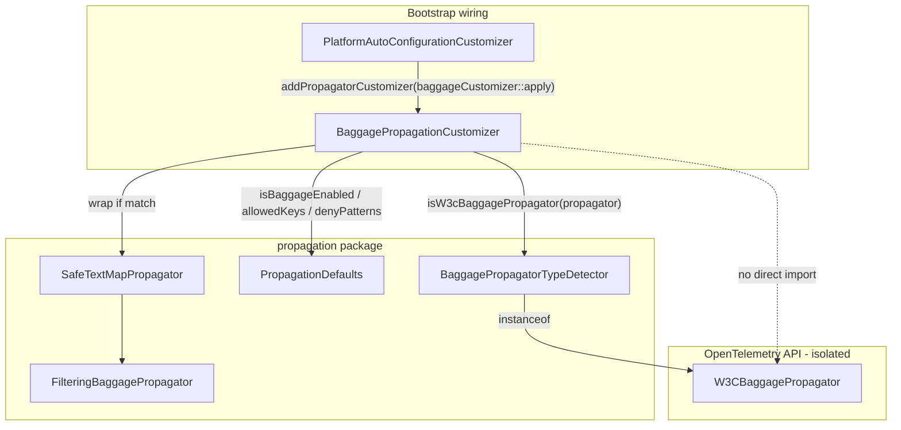

# FULL_PROPAGATION_BOUNDARY — отчёт о реализации

**Дата:** 2026-06-17  
**Статус:** реализовано, adversarial audit пройден, модульные тесты и grep-проверки выполнены  
**План:** [baggage-propagation-customization-boundary-plan.md](baggage-propagation-customization-boundary-plan.md)  
**Cursor plan:** `full_propagation_boundary_ff1d0f83.plan.md`

---

## 1. Контекст и цель

Рефакторинг `FULL_PROPAGATION_BOUNDARY` выполнен **до production**. Обратная совместимость не требовалась.

**Проблема до рефакторинга:** класс `PlatformPropagatorFactory` в пакете `factory` определял тип W3C baggage propagator через хрупкую строковую проверку:

```java
propagator.getClass().getName().contains("W3CBaggagePropagator")
```

Это создавало несколько архитектурных дефектов:

- ложная абстракция «фабрики» для условной логики оборачивания;
- знание о конкретном OTel-типе смешано с решением «оборачивать или нет»;
- строковое определение типа уязвимо к рефакторингу имён и прокси-классам;
- отсутствовали unit-тесты на границу детекции;
- composite propagator теоретически мог быть ошибочно обработан при смене семантики OTel SDK.

**Цель:** перенести customization в пакет `propagation`, разделить детекцию и оборачивание, изолировать import `W3CBaggagePropagator` в одном package-private классе, удалить старую фабрику без косметического переименования.

---

## 2. Что было до рефакторинга

| Элемент | Состояние |
|---|---|
| Класс | `space.br1440.platform.tracing.otel.extension.factory.PlatformPropagatorFactory` |
| Метод | `customizePropagator(TextMapPropagator, ConfigProperties)` |
| Детекция | `getClass().getName().contains("W3CBaggagePropagator")` |
| Оборачивание | `SafeTextMapPropagator(FilteringBaggagePropagator(propagator, allowedKeys, denyPatterns))` при `PropagationDefaults.isBaggageEnabled(config)` |
| Wiring | `PlatformAutoConfigurationCustomizer`: поле `propagatorFactory`, `customizer.addPropagatorCustomizer(propagatorFactory::customizePropagator)` |
| Тесты factory | отсутствовали |

---

## 3. Что сделано — пошагово

### Шаг 1. Создан `BaggagePropagatorTypeDetector`

**Файл:**  
`platform-tracing-otel-javaagent-extension/src/main/java/space/br1440/platform/tracing/otel/extension/propagation/BaggagePropagatorTypeDetector.java`

**Характеристики:**

- package-private `final` class;
- единственный статический метод `isW3cBaggagePropagator(TextMapPropagator propagator)`;
- реализация: `return propagator instanceof W3CBaggagePropagator;`;
- **единственный** production-класс с `import io.opentelemetry.api.baggage.propagation.W3CBaggagePropagator`.

```java
final class BaggagePropagatorTypeDetector {

    private BaggagePropagatorTypeDetector() {
    }

    static boolean isW3cBaggagePropagator(TextMapPropagator propagator) {
        return propagator instanceof W3CBaggagePropagator;
    }
}
```

**Сознательно не использовано:**

- `getClass().getName().contains(...)`;
- `propagator.fields().contains("baggage")`;
- Semantic Conventions;
- fake-константы для идентичности propagator;
- config-only detection (`otel.propagators`).

---

### Шаг 2. Создан `BaggagePropagationCustomizer`

**Файл:**  
`platform-tracing-otel-javaagent-extension/src/main/java/space/br1440/platform/tracing/otel/extension/propagation/BaggagePropagationCustomizer.java`

**Характеристики:**

- `public final` class в пакете `propagation`;
- метод `apply(TextMapPropagator propagator, ConfigProperties config)`;
- **не импортирует** `W3CBaggagePropagator`;
- делегирует type check в `BaggagePropagatorTypeDetector`;
- сохраняет прежнюю семантику оборачивания и порядок wrapper'ов.

```java
public final class BaggagePropagationCustomizer {

    public TextMapPropagator apply(TextMapPropagator propagator, ConfigProperties config) {
        if (BaggagePropagatorTypeDetector.isW3cBaggagePropagator(propagator)
                && PropagationDefaults.isBaggageEnabled(config)) {
            return new SafeTextMapPropagator(
                    new FilteringBaggagePropagator(
                            propagator,
                            new HashSet<>(PropagationDefaults.getBaggageAllowedKeys(config)),
                            PropagationDefaults.getBaggageDenyPatterns(config)
                    ));
        }

        return propagator;
    }
}
```

**Поведение:**

| Условие | Результат |
|---|---|
| `W3CBaggagePropagator` + baggage enabled | обёртка `SafeTextMapPropagator(FilteringBaggagePropagator(...))` |
| `W3CBaggagePropagator` + baggage disabled | тот же экземпляр propagator |
| любой другой propagator (TraceContext, composite, custom) | тот же экземпляр propagator |

---

### Шаг 3. Обновлён wiring в `PlatformAutoConfigurationCustomizer`

**Файл:**  
`platform-tracing-otel-javaagent-extension/src/main/java/space/br1440/platform/tracing/otel/extension/PlatformAutoConfigurationCustomizer.java`

**Изменения:**

| Было | Стало |
|---|---|
| `import ...factory.PlatformPropagatorFactory` | `import ...propagation.BaggagePropagationCustomizer` |
| `private final PlatformPropagatorFactory propagatorFactory = new PlatformPropagatorFactory()` | `private final BaggagePropagationCustomizer baggageCustomizer = new BaggagePropagationCustomizer()` |
| `customizer.addPropagatorCustomizer(propagatorFactory::customizePropagator)` | `customizer.addPropagatorCustomizer(baggageCustomizer::apply)` |

Spring-зависимости и глобальное состояние не добавлялись.

---

### Шаг 4. Удалён `PlatformPropagatorFactory`

**Удалён файл:**  
`platform-tracing-otel-javaagent-extension/src/main/java/space/br1440/platform/tracing/otel/extension/factory/PlatformPropagatorFactory.java`

После удаления:

- 0 ссылок на `PlatformPropagatorFactory` в active Java-коде;
- класс не перенесён в другой пакет под другим именем;
- логика не «упрощена» до прямого `instanceof` в customizer — detector сохранён.

---

### Шаг 5. Добавлены unit-тесты детектора

**Файл:**  
`platform-tracing-otel-javaagent-extension/src/test/java/space/br1440/platform/tracing/otel/extension/propagation/BaggagePropagatorTypeDetectorTest.java`

Тесты размещены в **том же пакете**, что и package-private detector.

| Тест | Ожидание | Результат Gradle |
|---|---|---|
| `W3CBaggagePropagator.getInstance()` | `true` | passed |
| `TextMapPropagator.composite(W3CBaggagePropagator, W3CTraceContextPropagator)` | `false` | passed |
| `W3CTraceContextPropagator.getInstance()` | `false` | passed |
| anonymous `TextMapPropagator` (dummy) | `false` | passed |

**4/4 tests, 0 failures.**

Composite-тест обязателен: composite **не является** экземпляром `W3CBaggagePropagator`, поэтому `instanceof` возвращает `false` — это защита от ложного оборачивания.

---

### Шаг 6. Добавлены unit-тесты customizer

**Файл:**  
`platform-tracing-otel-javaagent-extension/src/test/java/space/br1440/platform/tracing/otel/extension/propagation/BaggagePropagationCustomizerTest.java`

| Тест | Ожидание | Результат Gradle |
|---|---|---|
| W3C baggage + enabled | `instanceOf(SafeTextMapPropagator.class)` | passed |
| W3C baggage + disabled | `isSameAs(original)` | passed |
| W3CTraceContext + enabled | `isSameAs(original)` | passed |
| composite + enabled | `isSameAs(original)` | passed |
| custom dummy + enabled | `isSameAs(original)` | passed |

**5/5 tests, 0 failures.**

Конфигурация в тестах: `DefaultConfigProperties.createFromMap` с ключом `PropagationDefaults.PROP_BAGGAGE_ENABLED`.

---

### Шаг 7. Добавлен ArchUnit guardrail

**Файл:**  
`platform-tracing-otel-javaagent-extension/src/test/java/space/br1440/platform/tracing/otel/extension/arch/PropagationBoundaryArchTest.java`

**G-PROP-1 — `no_class_getName_in_propagation`**

- Scope: production-классы в `..propagation..`
- Запрещает вызов `java.lang.Class.getName()`
- Цель: предотвратить регресс string-based type detection в propagation-пакете
- Scope намеренно **узкий** — не ломает легитимные diagnostic-вызовы `getClass().getName()` в `scrubbing`, `processor`, `factory`

**G-PROP-2 — `only_detector_depends_on_w3c_baggage_propagator`**

- Scope: production-классы в `space.br1440.platform.tracing.otel.extension..`, кроме `BaggagePropagatorTypeDetector`
- Запрещает bytecode-зависимость от `io.opentelemetry.api.baggage.propagation.W3CBaggagePropagator`
- Javadoc `{@link ...}` в `FilteringBaggagePropagator` **не** создаёт bytecode dependency и правило не нарушает

**2/2 ArchUnit tests, 0 failures.**

---

### Шаг 8. Создана архитектурная документация

**Файл:**  
[docs/architecture/baggage-propagation-customization-boundary-plan.md](baggage-propagation-customization-boundary-plan.md)

Содержит: executive summary, target architecture, file-by-file plan, test plan, guardrail plan, validation commands, stop conditions.

---

### Шаг 9. Adversarial audit

Проведён audit по чеклисту FULL_PROPAGATION_BOUNDARY.

**Результат:** `passed`, исправлений не потребовалось.

Проверены риски, отмеченные архитектором:

- customizer **не** содержит прямой `instanceof W3CBaggagePropagator` — только вызов detector;
- **нет** `fields().contains("baggage")` в production-коде модуля.

---

### Шаг 10. Gradle-валидация и grep-проверки

**Команда:**

```powershell
.\gradlew :platform-tracing-otel-javaagent-extension:test --continue
```

**Результат:** `BUILD SUCCESSFUL` (~18s, 2026-06-17)

**Grep-проверки (эквивалент `rg`):**

| Проверка | Ожидание | Факт |
|---|---|---|
| `PlatformPropagatorFactory` в `*.java` | 0 | 0 |
| `"W3CBaggagePropagator"` string literal в production | 0 | 0 |
| `getClass().getName().contains` / `getName().contains` в production | 0 | 0 |
| `W3CBaggagePropagator` import в production | только detector | только `BaggagePropagatorTypeDetector.java` |
| `fields().*baggage` / `.contains("baggage")` как detection | 0 | 0 |
| `BaggagePropagationCustomizer` / `BaggagePropagatorTypeDetector` | видны в prod + tests + wiring | 6 Java-файлов |

**Примечание:** в `FilteringBaggagePropagator.java` есть Javadoc-ссылка `{@link io.opentelemetry.api.baggage.propagation.W3CBaggagePropagator}` — это документация, не import и не runtime dependency.

---

## 4. Целевая архитектура (as-built)



**Границы ответственности:**

| Класс | Роль |
|---|---|
| `BaggagePropagatorTypeDetector` | «Это W3C baggage propagator?» — единственное место знания о конкретном OTel-типе |
| `BaggagePropagationCustomizer` | «Нужно ли оборачивать?» — type check + config gate + создание wrapper chain |
| `FilteringBaggagePropagator` | фильтрация исходящего baggage (без изменений) |
| `SafeTextMapPropagator` | safe-обёртка ошибок propagation (без изменений) |
| `PropagationDefaults` | ключи и дефолты конфигурации baggage (без изменений) |

---

## 5. Полный перечень изменённых файлов

### Создано

| Файл | Назначение |
|---|---|
| `.../propagation/BaggagePropagatorTypeDetector.java` | type-based detection |
| `.../propagation/BaggagePropagationCustomizer.java` | customization logic |
| `.../propagation/BaggagePropagatorTypeDetectorTest.java` | detector unit tests |
| `.../propagation/BaggagePropagationCustomizerTest.java` | customizer unit tests |
| `.../arch/PropagationBoundaryArchTest.java` | ArchUnit guardrails G-PROP-1, G-PROP-2 |
| `docs/architecture/baggage-propagation-customization-boundary-plan.md` | архитектурный plan |
| `docs/architecture/baggage-propagation-customization-boundary-implementation-report.md` | этот отчёт |

### Изменено

| Файл | Изменение |
|---|---|
| `.../PlatformAutoConfigurationCustomizer.java` | import, поле, method reference |

### Удалено

| Файл | Причина |
|---|---|
| `.../factory/PlatformPropagatorFactory.java` | заменён propagation-boundary architecture |

---

## 6. Что сознательно не менялось

| Компонент | Статус |
|---|---|
| `FilteringBaggagePropagator` — семантика и API | без изменений |
| `SafeTextMapPropagator` — семантика и API | без изменений |
| `PropagationDefaults` — ключи, дефолты, методы | без изменений |
| Порядок оборачивания `SafeTextMapPropagator(FilteringBaggagePropagator(...))` | сохранён |
| Allowlist / deny-patterns logic | сохранена |
| `PlatformPropagatorsDefaultsCustomizer` (otel.propagators defaults) | без изменений |
| Spike-тесты (`BaggageFilteringSpikeTest`) | без изменений (исторические spike, не production path) |

---

## 7. Почему это не косметический рефакторинг

| Критерий | До | После |
|---|---|---|
| Пакетная ответственность | `factory` (ложная фабрика) | `propagation` (домен propagation) |
| Детекция типа | string `getClass().getName().contains` | `instanceof` через isolated detector |
| Знание о `W3CBaggagePropagator` | размазано в factory | изолировано в 1 package-private class |
| Разделение concerns | detection + wrapping в одном классе | 2 класса с разными ролями |
| Тесты границы | отсутствовали | 9 unit + 2 arch tests |
| Composite safety | не покрыто | явные negative tests |
| Machine-enforced boundary | нет | ArchUnit G-PROP-1, G-PROP-2 |

---

## 8. Отклонённые альтернативы (и почему)

| Альтернатива | Почему отклонена |
|---|---|
| `propagator.fields().contains("baggage")` | false positive для composite propagator |
| config-only (`otel.propagators` содержит `baggage`) | слабее object-based detection; не проверяет фактический объект |
| Semantic Conventions constants | не описывают runtime identity propagator |
| fake constant `"W3CBaggagePropagator"` | не устраняет хрупкость string matching |
| unconditional wrap всех propagators при enabled | нарушает composite/no-op semantics |
| прямой `instanceof` в customizer без detector | нарушает import isolation boundary |
| оставить класс в `factory` package | нарушает package responsibility |

---

## 9. Статус todos плана

| Todo | Статус |
|---|---|
| create-detector | completed |
| create-detector-test | completed |
| create-customizer | completed |
| create-customizer-test | completed |
| update-wiring | completed |
| delete-factory | completed |
| add-arch-guardrail | completed |
| run-validation | completed |
| create-plan-doc | completed |

**Все todos плана закрыты.**

---

## 10. Оставшиеся опциональные шаги

| Шаг | Статус | Комментарий |
|---|---|---|
| `./gradlew pr4ArchitectureFitnessVerify --continue` | не запускался | широкий ArchUnit smoke по нескольким модулям; не блокирует merge данного рефакторинга, но рекомендуется перед общим merge |
| Обновление исторических docs со ссылками на `PlatformPropagatorFactory` | не выполнялось | упоминания остались в `docs/tracing/`, `docs/decisions/`, `CHANGELOG.md` — исторический контекст, не active code |

---

## 11. Итог

Рефакторинг `FULL_PROPAGATION_BOUNDARY` **выполнен полностью** по плану:

- `PlatformPropagatorFactory` удалён;
- `BaggagePropagationCustomizer` и `BaggagePropagatorTypeDetector` созданы в пакете `propagation`;
- import `W3CBaggagePropagator` изолирован в detector;
- string-based и fields-based detection не используются;
- composite propagator явно не оборачивается;
- поведение wrapper chain и конфигурации сохранено;
- unit-тесты и ArchUnit guardrails добавлены;
- `./gradlew :platform-tracing-otel-javaagent-extension:test` — **BUILD SUCCESSFUL**;
- adversarial audit — **passed**.

```text
Implementation status: COMPLETED
Ready for: merge (после опционального pr4ArchitectureFitnessVerify)
```
