# Platform Tracing: архитектурные варианты и целевая рекомендация

| Поле | Значение |
|------|----------|
| Версия | 1.0 |
| Дата | 2026-06-11 |
| Аудитория | архитектурный комитет, staff Java/OTel архитекторы, SRE, platform engineering |
| Статус | **Historical** — superseded target: [ADR Clean Core Hybrid](../decisions/ADR-platform-tracing-clean-core-hybrid.md) |
| Связанные ADR | [`ADR-runtime-config-policy-vs-topology`](../decisions/ADR-runtime-config-policy-vs-topology.md), [`ADR-collector-boundary`](../decisions/ADR-collector-boundary.md), [`ADR-dual-channel-properties-v0.1`](../decisions/ADR-dual-channel-properties-v0.1.md), [`ADR-platform-tracing-target-architecture`](../decisions/ADR-platform-tracing-target-architecture.md) |
| Источники фактов | код репозитория, [`platform-tracing-modules-architecture.md`](../../Platform_Traces_Archive/Architecture/Current/platform-tracing-modules-architecture.md), [`architecture-committee-review.md`](../tracing/perf-results/2026-06-10_official/architecture-committee-review.md) |

---

## 1. Executive summary

**Краткий вывод анализа:** текущая agent-first архитектура (extension + Spring autoconfigure + JMX bridge + `platform-tracing-api`) **архитектурно корректна** по classloader-модели, OpenTelemetry SPI и policy/topology-контракту, но **не готова к mandatory rollout** из-за подтверждённого perf FAIL (M5: +48% CPU, +25% RSS vs бюджет 3%/10%) и незавершённой формализации control-plane контрактов.

**Рекомендуемый целевой вариант:** **Conservative Hardening Hybrid** — эволюция baseline (V1) с усилением границ (V4), формализацией shared control API в `platform-tracing-api` (V5) и программой hardening без смены топологии (V12). Это **не big bang rewrite**, а серия 8 небольших PR.

**Top-3 по weighted score:** V12 (472), V4/V5 (440), V9/V11 (415).

**Отклонённые направления:** Pure Spring starter (V3), multi-extension modular split (V10), classloader bridge без JMX (явно rejected), runtime topology mutation.

**Ключевой риск, который архитектура не решает сама:** CPU/RSS overhead — требует отдельного perf track (processor chain audit, sampler fast-path, export queue tuning), не смены agent-first модели.

---

## 2. Assumptions and Missing Context

### 2.1. Подтверждённые факты (из кода и документов)

| Факт | Источник |
|------|----------|
| Agent-first: SDK конфигурируется OTel Java Agent + extension SPI | `PlatformAutoConfigurationCustomizer`, ADR `otel-direct-integration` |
| Extension ~99 классов, без Spring; autoconfigure ~46 классов | module architecture doc |
| Связь app↔agent только через JMX `PlatformTracingControlMBean` + `SamplingControlClient` | `PlatformTracingControl`, `SamplingControlClient` |
| Shared contracts: `DomainConfigHolder`, `PlatformAttributes`, semconv API | `platform-tracing-api` |
| Policy runtime-mutable; topology startup-only | ADR `runtime-config-policy-vs-topology` |
| Head sampler: `CompositeSampler` chain через `SamplerStateHolder` | extension sampler package |
| Export: `PlatformDropOldestExportSpanProcessor` → `SafeSpanExporter` | ADR `drop-oldest-export-processor`, `safe-span-exporter` |
| M5 perf FAIL: +48.1% CPU, +25.4% RSS при ratio 0.1 | `architecture-committee-review.md` |
| Pre-production статус (не развёрнуто в prod) | ADR headers, SRE review |
| OTel Java Agent 2.28.x, SDK 1.62.0, Spring Boot 3.5.5, Java 21 | ADR metadata |

### 2.2. Допущения (не подтверждены в репозитории)

| ID | Допущение |
|----|-----------|
| A1 | Production rollout предполагает k8s rolling update для topology changes |
| A2 | OpenTelemetry Collector уже развёрнут или будет развёрнут централизованно |
| A3 | SRE требуют HTTP Actuator mirror для JMX ops (не только JMX напрямую) |
| A4 | Dashboards/alerts завязаны на `platform.tracing.*` semconv и `PlatformSamplingReasons` |
| A5 | External control plane (V6) — опциональный future track, не текущая инфра |
| A6 | Целевой perf budget M5 остаётся <3% CPU / <10% RSS после hardening |
| A7 | Alibaba/ARMS compatibility matrix — отложен до architect meeting (PR-B) |

### 2.3. Отсутствующий контекст

- Финальный production SLO по trace volume и retention per tenant.
- Организационное решение: mandatory tracing vs opt-in per service tier.
- Версионная политика OTel Agent pin vs floating minor.
- Централизованный schema registry для telemetry (если есть — не отражён в коде).

---

## 3. Current architecture baseline (V1)

### 3.1. Описание

Agent-first модель: `platform-tracing-otel-extension` в Agent CL настраивает OTel SDK через SPI; `platform-tracing-spring-boot-autoconfigure` в Application CL предоставляет `TracingProperties`, фасад `TraceOperations`, JMX client и Actuator endpoint. Runtime policy (sampling, scrubbing, validation toggles) мутирует через JMX atomic domain updates в `SamplerStateHolder` и sibling holders. Topology (exporter endpoint, BSP queue, processor chain composition) — startup-only.

### 3.2. Диаграмма

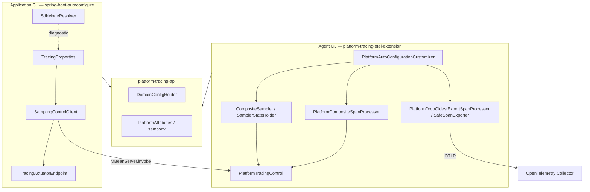

### 3.3. Ключевые классы

| Домен | Extension (Agent CL) | Autoconfigure (App CL) | API |
|-------|---------------------|------------------------|-----|
| Entry SPI | `PlatformAutoConfigurationCustomizer` | `TracingCoreAutoConfiguration` | — |
| Sampler | `PlatformSamplerFactory`, `CompositeSampler`, `SamplerStateHolder` | `SamplingControlClient` | `DomainConfigHolder` |
| Processors | `ScrubbingSpanProcessor`, `ValidatingSpanProcessor`, `EnrichingSpanProcessor` | — | semconv contracts |
| Export | `PlatformDropOldestExportSpanProcessor`, `SafeSpanExporter` | `DropOldestAspirationDiagnostics` | — |
| Propagation | `PlatformTraceControlPropagator` | `PlatformContextPropagation` | `PlatformTraceControl` |
| Control | `PlatformTracingControl`, `PlatformTracingControlMBean` | `TracingActuatorEndpoint` | — |
| Config | `ExtensionPropertyNames`, `ExtensionDefaults`, `PlatformTracingDefaultsProvider`, `ConfigProperties` | `TracingProperties` | `Versioned` |
| Drift | — | `DualChannelDriftDiagnostics`, `SdkModeResolver` | — |

### 3.4. Сильные стороны baseline

- Корректная classloader isolation (ArchUnit enforced).
- Официальные OTel SPI extension points (не internal API в hot path).
- Policy/topology ADR с LKG и CAS semantics.
- Degraded-mode resilience подтверждена (M6, M8a–c: no OOM, p99 < 1 ms delta).

### 3.5. Слабые стороны baseline

- M5 CPU/RSS превышает бюджет на порядок.
- Dual-channel drift между `TracingProperties` и agent runtime state (`DualChannelDriftDiagnostics` — WARN only).
- JMX contract не формализован как versioned DTO в `platform-tracing-api`.
- Pending gates: M10 macro evidence, Alibaba matrix, architect sign-off.

---

## 4. Двенадцать архитектурных вариантов

Для каждого варианта: **V1–V12**. Поля 1–26 обязательны.

---

### V1. Current Baseline — agent-first + extension + autoconfigure + JMX + shared API

**1. Name:** V1 Current Baseline

**2. Short description:** Текущая production-bound архитектура без structural changes.

**3. Diagram:**

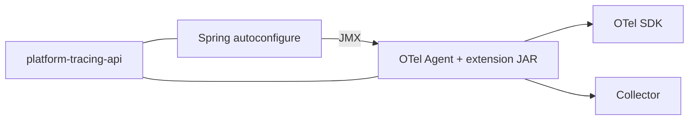

**4. Module/classloader model:** `otel-extension` → Agent CL; `spring-boot-autoconfigure` → App CL; `platform-tracing-api` → shared; `platform-tracing-core` → App CL only.

**5. Dependency direction:** extension → api (compile); autoconfigure → api + core; autoconfigure ↛ extension impl; extension ↛ Spring.

**6. Runtime control model:** JMX domain atomic updates → `DomainConfigHolder.tryUpdate()` в Agent CL.

**7. Configuration model:** Dual channel: agent `-D`/`OTEL_*` at startup + Spring `TracingProperties` for runtime push via JMX.

**8. Sampling control:** `CompositeSampler` reads `SamplerStateHolder.current()` lock-free; runtime via `PlatformTracingControl.updateSamplingPolicy(...)`.

**9. Scrubbing/PII policy:** `ScrubbingSpanProcessor` + runtime holder; two-line defense (Java scrub + Collector per ADR).

**10. Validation/semconv:** `ValidatingSpanProcessor` + `CategoryContracts` in api; strict/permissive modes.

**11. Export pipeline:** `PlatformCompositeSpanProcessor` → `PlatformDropOldestExportSpanProcessor` → `SafeSpanExporter` → OTLP.

**12. Actuator/JMX/control plane:** `SamplingControlClient` → MBean; `TracingActuatorEndpoint` HTTP mirror.

**13. Policy vs topology:** ADR-compliant; topology in `PlatformAutoConfigurationCustomizer` at agent startup only.

**14. Performance impact:** **FAIL at M5** (+48% CPU documented); p99 acceptable.

**15. Classloader risk:** **Low** — proven isolation.

**16. OpenTelemetry compatibility risk:** **Low** — named SPI providers.

**17. Operational complexity:** Medium — dual channel, JMX + Actuator.

**18. Testability:** Good — unit + e2e smoke exist; contract tests partial.

**19. Security/PII risk:** Medium-low — scrubbing present; regex ReDoS mitigated by circuit breaker.

**20. Dashboards/alerts compatibility:** Stable if semconv keys unchanged.

**21. Backward compatibility:** N/A (reference point).

**22. Migration complexity:** None.

**23. Rollback strategy:** Disable extension JAR / `platform.tracing.enabled=false`.

**24. Suitable when:** Need proven model, incremental improvement only.

**25. Not suitable when:** Mandatory low-overhead rollout without perf program.

**26. Final verdict:** **Correct architecture, insufficient hardening for prod mandate.** Baseline for evolution, not final target.

---

### V2. Pure Agent Extension — minimal or absent Spring autoconfigure

**1. Name:** V2 Pure Agent Extension

**2. Short description:** Вся runtime logic в extension; Spring module сведён к optional facade или удалён.

**3. Diagram:**

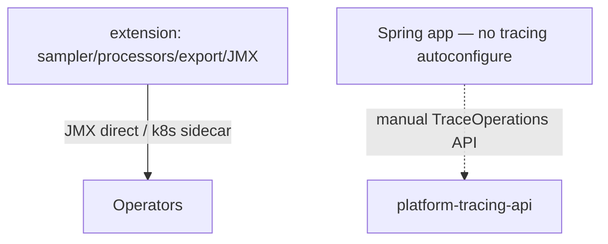

**4–5. Module/dependencies:** Extension + api only for platform logic; apps use raw OTel API or thin api facade.

**6. Runtime control:** JMX only (or env/`-D` reload limited to policy if implemented).

**7. Configuration:** Single channel — agent properties; no `TracingProperties` push.

**8. Sampling:** Same `CompositeSampler`; ops change via JMX attach or external script.

**9. Scrubbing:** Unchanged in extension.

**10. Validation:** Unchanged in extension.

**11. Export:** Unchanged.

**12. Actuator/JMX:** No HTTP mirror unless custom; loses `TracingActuatorEndpoint`.

**13. Policy vs topology:** Clean — no dual channel drift.

**14. Performance:** Same agent pipeline cost; slightly less app-side overhead.

**15. Classloader risk:** Low.

**16. OTel compatibility:** Low risk.

**17. Operational complexity:** **Higher** for Spring teams — no declarative YAML policy push.

**18. Testability:** Loses Spring integration test surface.

**19. Security/PII:** Same scrubbing; ops via JMX less auditable than Actuator.

**20. Dashboards:** Unchanged telemetry schema.

**21. Backward compatibility:** **Breaking** — removes `TracingProperties` contract.

**22. Migration complexity:** High — all services lose Spring config path.

**23. Rollback:** Re-enable autoconfigure module.

**24. Suitable when:** Non-Spring services, batch jobs, minimal footprint.

**25. Not suitable when:** Large Spring Boot estate with YAML-driven ops.

**26. Final verdict:** **Rejected as primary** — sacrifices operational ergonomics without solving perf.

---

### V3. Pure Spring Boot Starter — application-owned SDK, no agent extension

**1. Name:** V3 Pure Spring Boot Starter

**2. Short description:** Application creates/configures SDK or wraps `GlobalOpenTelemetry`; no agent extension JAR.

**3. Diagram:**

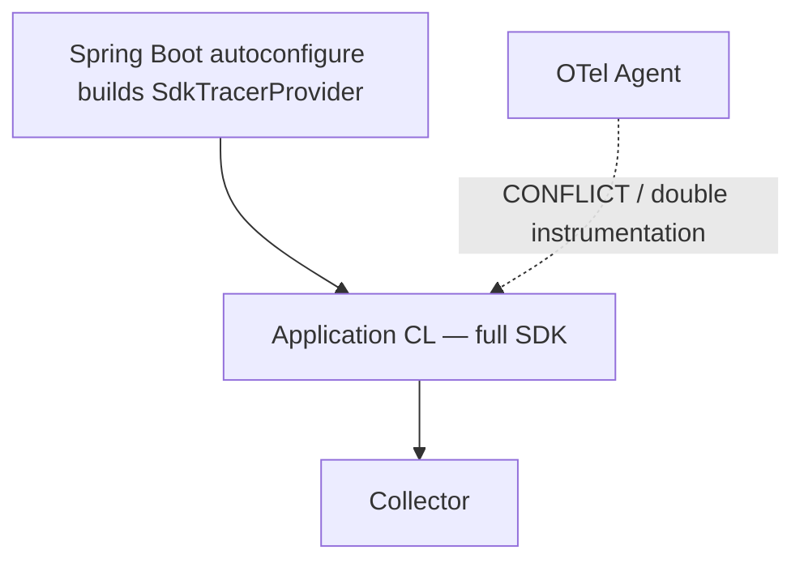

**4–5. Module/dependencies:** autoconfigure → OTel SDK directly; extension removed.

**6. Runtime control:** Spring `@RefreshScope` / custom holders in App CL.

**7. Configuration:** Single Spring channel.

**8. Sampling:** Reimplement `CompositeSampler` in App CL or use OTel defaults.

**9. Scrubbing:** Processors in App CL — accessible but loses agent-global instrumentation.

**10. Validation:** Same processors, different wiring.

**11. Export:** App-managed BSP.

**12. Actuator:** Native Spring control — simpler HTTP.

**13. Policy vs topology:** Spring refresh tempts runtime topology change — **unsafe** without strict guards.

**14. Performance:** Different profile — loses bytecode instrumentation breadth OR conflicts with agent.

**15. Classloader risk:** Medium — simpler CL, but agent+app SDK **double init risk**.

**16. OTel compatibility:** **Medium-high** — conflicts with ADR agent-first.

**17. Operational complexity:** Lower per-app, higher fleet inconsistency.

**18. Testability:** Standard Spring tests.

**19. Security/PII:** Must re-prove scrubbing on all app versions.

**20. Dashboards:** **High drift risk** — different span shapes without agent instrumentations.

**21. Backward compatibility:** **Breaking** — reverses foundational ADR.

**22. Migration complexity:** **Very high** — rewrite.

**23. Rollback:** Reattach agent extension.

**24. Suitable when:** Greenfield without agent policy (not this company).

**25. Not suitable when:** Agent-first mandate, deep auto-instrumentation need.

**26. Final verdict:** **Explicitly rejected** — violates agent-first, ADR `otel-direct-integration`, classloader rationale.

---

### V4. Hybrid Agent + Spring Bridge — stronger boundaries and contracts

**1. Name:** V4 Hybrid Improved Bridge

**2. Short description:** Сохранить V1 topology; усилить границы модулей, формализовать contracts, расширить drift diagnostics to fail-fast where safe.

**3. Diagram:**

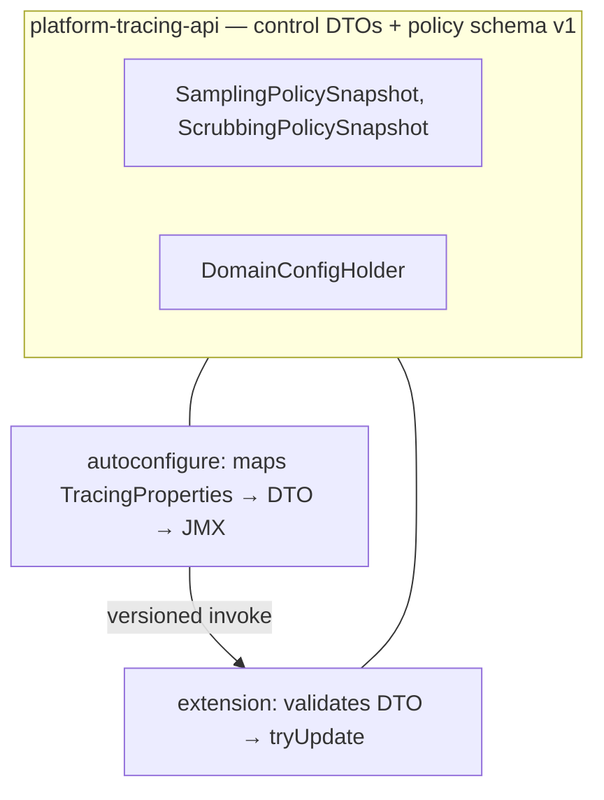

**4. Module/classloader:** Unchanged from V1.

**5. Dependencies:** Add control DTO interfaces to api; still no autoconfigure → extension impl.

**6. Runtime control:** Versioned MBean methods accepting api DTOs/Maps with schema version field.

**7. Configuration:** Dual channel preserved but **single write path**: Spring builds DTO, agent validates.

**8. Sampling:** Unchanged chain; policy snapshot includes version + hash for drift check.

**9. Scrubbing:** Policy snapshot with bounded rules list in DTO.

**10. Validation:** Policy snapshot with mode enum from api.

**11. Export:** Unchanged topology.

**12. Actuator/JMX:** `TracingActuatorEndpoint` returns same shape as MBean read API.

**13. Policy vs topology:** Enforced by DTO separation — topology fields absent from policy DTO.

**14. Performance:** Same as V1 until perf PRs land.

**15. Classloader risk:** Low.

**16. OTel compatibility:** Low.

**17. Operational complexity:** Lower drift; clearer ops docs.

**18. Testability:** **High** — contract tests on DTO round-trip.

**19. Security/PII:** Explicit scrubbing policy in versioned contract.

**20. Dashboards:** Improved stability via schema version in telemetry meta attributes (optional).

**21. Backward compatibility:** Additive DTO v1 alongside existing MBean methods (deprecate gradually).

**22. Migration complexity:** **Low-medium** — incremental PRs.

**23. Rollback:** Feature flag `platform.tracing.control.contract.v1=false`.

**24. Suitable when:** Large Spring estate, need JMX+Actuator with formal contracts.

**25. Not suitable when:** Seeking perf fix by architecture change alone.

**26. Final verdict:** **Shortlist #2** — core of recommended target.

---

### V5. Agent Extension + Shared Control API in platform-tracing-api

**1. Name:** V5 Shared Control API

**2. Short description:** V4 + все JMX payload types, constants, operation names, compatibility version в `platform-tracing-api`.

**3. Diagram:** Same as V4 with api package `space.br1440.platform.tracing.api.control.*`.

**4–5. Module/dependencies:** api gains `ControlContractVersion`, `SamplingPolicyUpdate`, MBean name constants; extension implements; autoconfigure serializes.

**6–13.** Same as V4 with stronger api ownership of contract.

**14. Performance:** Neutral.

**15. Classloader risk:** Low — DTOs in shared api jar loaded in both CLs (separate instances, same bytecode).

**16. OTel compatibility:** Low.

**17. Operational complexity:** Low-medium.

**18. Testability:** **Highest** for bridge layer.

**19. Security/PII:** Policy fields explicitly typed — no ad-hoc Map keys.

**20. Dashboards:** Contract tests prevent silent attribute changes.

**21. Backward compatibility:** Version field enables v1/v2 coexistence.

**22. Migration complexity:** Low — extract interfaces from existing MBean.

**23. Rollback:** Disable new api package usage.

**24. Suitable when:** Multi-team consumers of control plane.

**25. Not suitable when:** api jar bloat concerns (mitigated — small DTOs only).

**26. Final verdict:** **Shortlist #2 (tie with V4)** — merge with V4 in recommendation.

---

### V6. Agent Extension + External Control Plane

**1. Name:** V6 External Control Plane

**2. Short description:** Runtime policy from external service (etcd/Consul/custom) polled by extension or sidecar; Spring/JMX as fallback.

**3. Diagram:**

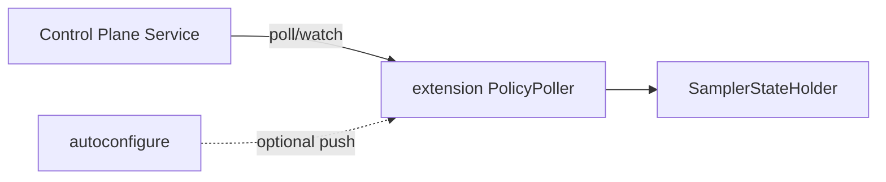

**4–5. Module/dependencies:** New module optional `platform-tracing-control-plane-client` in Agent CL (no Spring).

**6. Runtime control:** Poll + CAS publish; JMX override for break-glass.

**7. Configuration:** External source authoritative; local cache LKG.

**8. Sampling:** Same holder; source = poller not JMX.

**9–11.** Unchanged processors/export.

**12. Actuator/JMX:** Read-only mirror + manual override audit.

**13. Policy vs topology:** External plane must enforce topology immutability — **ops risk if misconfigured**.

**14. Performance:** Poll overhead + network; cache amortizes.

**15. Classloader risk:** Low if client is agent-side only.

**16. OTel compatibility:** Medium — custom control not in OTel spec.

**17. Operational complexity:** **High** — new service SLO, auth, partition behavior.

**18. Testability:** Requires contract tests + fault injection for CP down.

**19. Security/PII:** CP becomes secret-bearing surface.

**20. Dashboards:** Neutral.

**21. Backward compatibility:** Additive if JMX remains.

**22. Migration complexity:** **High** — infra dependency.

**23. Rollback:** Disable poller; revert to JMX-only.

**24. Suitable when:** Fleet-wide dynamic policy at scale, centralized audit.

**25. Not suitable when:** No control plane team, pre-production stage.

**26. Final verdict:** **Deprioritized** — future phase; not migration-critical now.

---

### V7. Agent Extension + Collector-First Policy

**1. Name:** V7 Collector-First Policy

**2. Short description:** Head sampling minimal on Java; classification, routing, retention delegated to Collector processors.

**3. Diagram:**

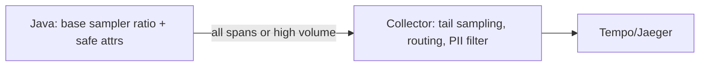

**4–5. Module/dependencies:** Reduce Java policy surface; align with ADR `collector-boundary`.

**6. Runtime control:** Java policy minimal; Collector config reload for tail policies.

**7. Configuration:** Split — Java topology fixed; Collector YAML for tail.

**8. Sampling:** Java `CompositeSampler` keeps kill-switch, force-header, parent; ratio decisions partially moved tail-side.

**9. Scrubbing:** Java first line kept (ADR); Collector second line.

**10. Validation:** Java strict mode for app spans; Collector drops invalid downstream.

**11. Export:** Higher volume to Collector — network cost shift.

**12. Actuator/JMX:** Java controls head only; Collector ops separate.

**13. Policy vs topology:** **Risk** — Collector reload may blur policy/topology if tail rules change export routing.

**14. Performance:** Java CPU may drop; Collector + network load rises.

**15. Classloader risk:** Low.

**16. OTel compatibility:** **Good** — aligns with OTel tail sampling patterns.

**17. Operational complexity:** **Split brain** — two ops surfaces.

**18. Testability:** Need cross-tier integration tests.

**19. Security/PII:** Must not skip Java scrub — PII reaches Collector otherwise.

**20. Dashboards:** Tail sampling changes span counts — alert thresholds must move.

**21. Backward compatibility:** Partial — head/tail split changes volume metrics.

**22. Migration complexity:** Medium — Collector config + Java ratio tuning.

**23. Rollback:** Increase Java head ratio; disable Collector tail filters.

**24. Suitable when:** Collector capacity proven, cost model accepts tail compute.

**25. Not suitable when:** Collector not ready; PII must not leave JVM unscrubbed.

**26. Final verdict:** **Complementary track**, not replacement for V4/V12. Partial adoption after perf baseline fixed.

---

### V8. Minimal Java + Collector Tail Sampling

**1. Name:** V8 Minimal Java + Collector Tail

**2. Short description:** Java emits safe base telemetry only; Collector owns classification, routing, retention almost entirely.

**3. Diagram:**

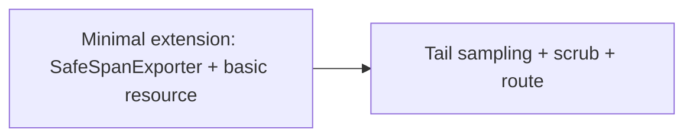

**4–13.** Aggressive reduction of `CompositeSampler` features on Java side.

**14. Performance:** Lowest Java overhead potential.

**15. Classloader risk:** Low.

**16. OTel compatibility:** Good for export path; loses platform header semantics if propagator trimmed.

**17. Operational complexity:** High — depends on Collector for business rules.

**18. Testability:** Harder E2E without full Collector in CI.

**19. Security/PII:** **High risk** if Java scrubbing reduced — violates two-line ADR.

**20. Dashboards:** **High breakage risk** — `PlatformSamplingReasons` may not be set.

**21. Backward compatibility:** **Poor** — telemetry contract changes.

**22. Migration complexity:** High.

**23. Rollback:** Restore full Java sampler chain.

**24. Suitable when:** Extreme perf constraints, trusted Collector pipeline.

**25. Not suitable when:** Platform semconv contract, PII policy, ARMS equivalence required.

**26. Final verdict:** **Rejected as primary** — breaks telemetry contract stability; consider only for tier-3 services with explicit exception.

---

### V9. Split Core/Domain Module

**1. Name:** V9 Split Core/Domain

**2. Short description:** Extract company-specific logic from OTel integration into `platform-tracing-core` (or expand existing core); extension and autoconfigure depend on stable core contracts.

**3. Diagram:**

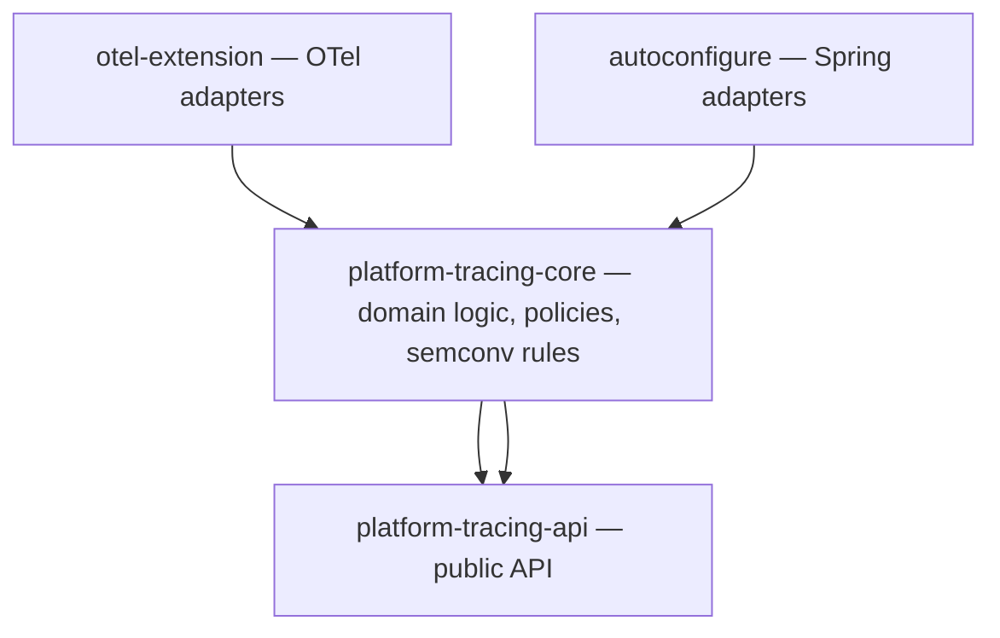

**4. Module/classloader:** core loaded in both CLs (like api); adapters thin.

**5. Dependencies:** ext → core → api; boot → core → api; core ↛ Spring, ↛ OTel SDK (pure Java).

**6–13.** Same runtime as V1 but policy builders live in core.

**14. Performance:** Neutral; possible dedup of validation logic.

**15. Classloader risk:** Medium — must ensure core has no OTel/Spring leaks; ArchUnit critical.

**16. OTel compatibility:** Low risk if adapters isolated.

**17. Operational complexity:** Medium.

**18. Testability:** **High** — core unit tests without agent/Spring.

**19. Security/PII:** Scrubbing rules testable in core pure tests.

**20. Dashboards:** Stable if core owns semconv constants.

**21. Backward compatibility:** Good if packages preserved.

**22. Migration complexity:** Medium — move classes incrementally.

**23. Rollback:** Revert package moves per PR.

**24. Suitable when:** Growing domain complexity, multiple adapters planned.

**25. Not suitable when:** Urgent perf fix needed — refactor doesn't help M5.

**26. Final verdict:** **Shortlist #3** — valuable parallel track; merge with V4/V12 over 2–3 PRs.

---

### V10. Multi-Extension Modular Architecture

**1. Name:** V10 Multi-Extension Modular

**2. Short description:** Split sampler, scrubbing, resource, propagation, export into separate extension JAR modules.

**3. Diagram:**

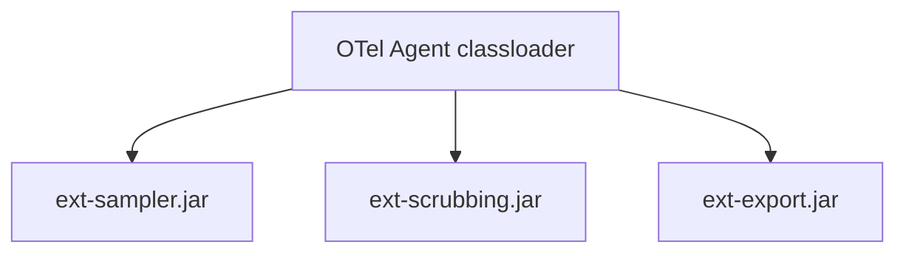

**4–5. Multiple agentExtensionJar artifacts; ordering via SPI `Ordered` / docs.

**6–13.** Functionally same; deployment composable.

**14. Performance:** Neutral to slightly worse (multiple SPI scans).

**15. Classloader risk:** **Medium** — extension ordering and duplicate SPI conflicts.

**16. OTel compatibility:** Medium — multiple extensions supported but ordering fragile.

**17. Operational complexity:** **High** — matrix of JAR combinations.

**18. Testability:** Combinatorial explosion.

**19. Security/PII:** Same if scrubbing module always bundled.

**20. Dashboards:** Neutral.

**21. Backward compatibility:** Poor — deployment model change.

**22. Migration complexity:** High.

**23. Rollback:** Single fat JAR revert.

**24. Suitable when:** Different product lines need different subsets.

**25. Not suitable when:** Single uniform fleet (this company).

**26. Final verdict:** **Rejected** — ops complexity outweighs modularity benefit.

---

### V11. Compile-Time Generated Configuration/Contracts

**1. Name:** V11 Codegen Contracts

**2. Short description:** Single schema (YAML/JSON) generates `TracingProperties` metadata, MBean signatures, docs, compatibility tests.

**3. Diagram:**

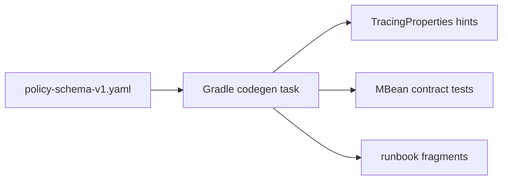

**4–13.** Runtime identical to V4/V5; build-time guarantees alignment.

**14. Performance:** Neutral.

**15. Classloader risk:** Low.

**16. OTel compatibility:** Low.

**17. Operational complexity:** Lower long-term; higher build complexity.

**18. Testability:** **High** — generated compatibility tests.

**19. Security/PII:** Schema validates scrubbing rule bounds at build time.

**20. Dashboards:** Schema changelog drives alert review checklist.

**21. Backward compatibility:** Schema versioning explicit.

**22. Migration complexity:** Medium — introduce generator without changing runtime.

**23. Rollback:** Disable codegen; manual sources.

**24. Suitable when:** Frequent property additions, large ops docs burden.

**25. Not suitable when:** Small team without codegen maintenance appetite (short term).

**26. Final verdict:** **Shortlist #3 (tie with V9)** — adopt after V4/V5 DTOs stabilize.

---

### V12. Conservative Hardening Architecture

**1. Name:** V12 Conservative Hardening

**2. Short description:** Keep V1 topology; focus on perf, contracts, tests, drift diagnostics, rollback — no structural pivot.

**3. Diagram:**

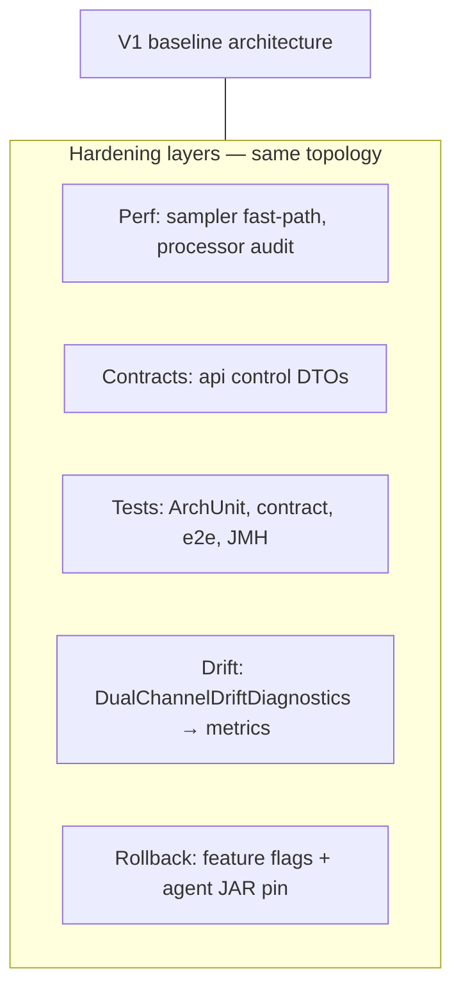

**4–13.** Identical to V1/V4 runtime; differences are quality gates and observability.

**14. Performance:** **Target improvement** via dedicated perf PRs (not architectural).

**15. Classloader risk:** Low.

**16. OTel compatibility:** Low.

**17. Operational complexity:** Medium → improving via diagnostics.

**18. Testability:** **Highest** — explicit test matrix in this doc §11.

**19. Security/PII:** Enhanced negative tests for forbidden attributes.

**20. Dashboards:** Compatibility checklist on schema changes.

**21. Backward compatibility:** **Maximal** — no breaking changes.

**22. Migration complexity:** **Lowest** — incremental.

**23. Rollback:** Per-PR flags; agent JAR version pin.

**24. Suitable when:** Pre-production → production path with committee gates.

**25. Not suitable when:** Fundamental model is wrong (it isn't).

**26. Final verdict:** **Shortlist #1** — recommended primary frame.

---

## 5. Scoring criteria

| # | Критерий | Вес |
|---|----------|-----|
| 1 | Production safety | 15 |
| 2 | OpenTelemetry compatibility | 12 |
| 3 | Classloader correctness | 10 |
| 4 | Performance overhead control | 12 |
| 5 | Migration feasibility | 10 |
| 6 | Backward compatibility | 10 |
| 7 | Testability | 8 |
| 8 | Operational simplicity | 8 |
| 9 | Security/PII safety | 8 |
| 10 | Telemetry contract stability | 7 |
| | **Σ** | **100** |

Шкала: 1 = неприемлемо, 3 = минимально достаточно, 5 = отлично.

---

## 6. Weighted scoring matrix

| Variant | Prod (15) | OTel (12) | CL (10) | Perf (12) | Mig (10) | BC (10) | Test (8) | Ops (8) | PII (8) | Tel (7) | **Total** |
|---------|-----------|-----------|---------|-----------|----------|---------|----------|---------|---------|---------|-----------|
| V1 Baseline | 4 | 5 | 5 | **2** | 5 | 5 | 4 | **3** | 4 | 4 | **410** |
| V2 Pure agent | **3** | 5 | 5 | 3 | **2** | **2** | **3** | **2** | 4 | 4 | **331** |
| V3 Pure Spring | **2** | **3** | 4 | 3 | **1** | **1** | **3** | 3 | **3** | **2** | **248** |
| V4 Hybrid improved | 5 | 5 | 5 | 3 | 4 | 4 | 5 | 4 | 4 | 5 | **440** |
| V5 Shared control API | 5 | 5 | 5 | 3 | 4 | 4 | 5 | 4 | 4 | 5 | **440** |
| V6 External CP | **3** | 4 | 5 | 3 | **2** | **3** | **3** | **2** | **3** | 4 | **321** |
| V7 Collector-first | 4 | 5 | 5 | 4 | **3** | **3** | 4 | **3** | 4 | 4 | **394** |
| V8 Minimal+tail | **3** | 5 | 5 | 4 | **2** | **2** | **3** | **3** | **3** | **3** | **336** |
| V9 Split core | 4 | 5 | 5 | 3 | **3** | 4 | 5 | 4 | 4 | 5 | **415** |
| V10 Multi-ext | **3** | 4 | 4 | 3 | **2** | **2** | 4 | **2** | 4 | 4 | **317** |
| V11 Codegen | 4 | 5 | 5 | 3 | **3** | 4 | 5 | 4 | 4 | 5 | **415** |
| V12 Conservative | 5 | 5 | 5 | 4 | 5 | 5 | 5 | 4 | 4 | 5 | **472** |

### Scores < 3 — обоснование

| Variant | Criterion | Score | Reason |
|---------|-----------|-------|--------|
| V1 | Perf (2) | 2 | M5 +48% CPU FAIL — documented evidence |
| V1 | Ops (3) | 3 | Dual-channel drift; JMX limitations |
| V2 | Prod (3) | 3 | No Actuator mirror; ops friction |
| V2 | Mig/BC (2) | 2 | Breaking Spring config path |
| V3 | Prod (2) | 2 | Agent conflict; loses instrumentation model |
| V3 | OTel (3) | 3 | Violates agent-first ADR |
| V3 | Mig/BC (1) | 1 | Full rewrite |
| V6 | Ops (2) | 2 | New infra dependency |
| V8 | BC/Tel (2–3) | 2–3 | Telemetry contract drift |
| V10 | Ops (2) | 2 | Combinatorial deployment matrix |

---

## 7. Top 3 shortlist

### 7.1. V12 Conservative Hardening (472)

**Why shortlist:** Максимальная migration feasibility и backward compatibility при сохранении проверенной agent-first топологии; directly addresses committee gates (perf, tests, rollback).

**Advantages:** No structural risk; aligns with all ADRs; incremental PR path; production rollback per flag.

**Risks:** Perf may remain FAIL if hardening insufficient; committee may perceive as "no architecture change."

**Guardrails:** M5 re-run after each perf PR; ArchUnit gates in CI; LKG tests mandatory.

**Failure mode:** Perf budget unachievable without also adopting V7 partial tail offload.

**Migration:** 8 PRs (see §10) — foundation → safety → boundary → perf → docs.

**Mandatory tests:** Full §11 matrix.

---

### 7.2. V4 + V5 Hybrid with Shared Control API (440)

**Why shortlist:** Fixes dual-channel drift root cause (informal JMX contract); enables contract tests without topology change.

**Advantages:** Formal DTOs in `platform-tracing-api`; Actuator/MBean parity; versioned evolution.

**Risks:** Scope creep in api jar; duplicate DTO maintenance if codegen (V11) delayed.

**Guardrails:** Policy DTO excludes topology fields; schema version bump rules; Map fallback deprecated with timeline.

**Failure mode:** Teams bypass DTO and use raw JMX Maps — drift returns.

**Migration:** PR-2–PR-4 in plan; additive MBean methods.

**Mandatory tests:** JMX/Actuator contract tests §11.4.

---

### 7.3. V9 Split Core + V11 Codegen (415)

**Why shortlist:** Long-term maintainability for 99+46 classes; pure domain tests; generated compatibility.

**Advantages:** Test scrubbing/sampler rules without agent; docs always aligned with schema.

**Risks:** Refactor distraction from perf; core must stay OTel/Spring-free (ArchUnit).

**Guardrails:** Move pure logic only; adapters stay thin; no big-bang package moves.

**Failure mode:** core accidentally imports OTel SDK — classloader contamination.

**Migration:** After V4 DTOs — PR-6/PR-7 optional.

**Mandatory tests:** ArchUnit core purity; generated contract tests.

---

## 8. Recommended architecture

**Name:** **Conservative Hardening Hybrid (V12 + V4 + V5)**

### 8.1. Final architecture summary

Сохранить agent-first topology V1. Добавить: (1) versioned control DTOs в `platform-tracing-api`; (2) усиленные drift diagnostics с метриками; (3) perf program на hot path (`CompositeSampler`, processor chain, export queue); (4) expanded test/ArchUnit gates; (5) optional partial V7 tail policy **только после** M5 pass — не as default.

### 8.2. Diagram

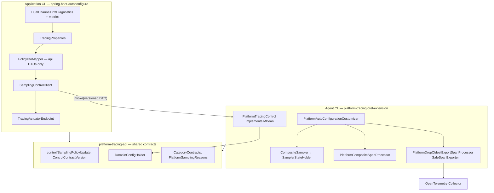

### 8.3. Module boundaries

| Module | CL | Responsibility |
|--------|-----|----------------|
| `platform-tracing-api` | Both | Public API, control DTOs, `DomainConfigHolder`, semconv |
| `platform-tracing-core` | App (optional both for pure logic) | Domain helpers, mappers without OTel/Spring |
| `platform-tracing-otel-extension` | Agent | OTel SPI adapters only |
| `platform-tracing-spring-boot-autoconfigure` | App | Spring wiring, JMX client, Actuator |
| `platform-tracing-e2e-tests` | Test | Smoke, contract, agent processes |

### 8.4. Package boundaries

| Package | Module | Notes |
|---------|--------|-------|
| `...api.control.*` | api | DTOs, constants, contract version |
| `...api.config.*` | api | `DomainConfigHolder`, `Versioned` |
| `...otel.extension.sampler.*` | extension | `CompositeSampler`, holders |
| `...otel.extension.jmx.*` | extension | MBean impl |
| `...autoconfigure.sampling.*` | autoconfigure | `SamplingControlClient`, mapper |
| `...autoconfigure.actuator.*` | autoconfigure | Endpoints, drift |

### 8.5. Allowed dependencies

- extension → api (compile); OTel SPI/SDK compileOnly
- autoconfigure → api, core; Spring Boot
- autoconfigure → extension **testImplementation only**
- api → JDK + minimal (no OTel, no Spring)

### 8.6. Forbidden dependencies

- extension → Spring (**rejected**)
- autoconfigure → extension main sources (**rejected**)
- api → OTel SDK / Spring
- Shared mutable singletons across CL boundaries
- Runtime topology mutation APIs

### 8.7. Runtime control model

1. Operator → Actuator or JMX.
2. `SamplingControlClient` serializes `SamplingPolicyUpdate` (api DTO).
3. `PlatformTracingControl.updateSamplingPolicy(dto)` validates → builds immutable `SamplerState` → `SamplerStateHolder.tryUpdate()`.
4. Invalid update → LKG + metric `platform.tracing.config.reload.failure`.
5. Hot path: `SamplerStateHolder.current()` — volatile read, lock-free.

### 8.8. Configuration model

| Channel | Purpose | When |
|---------|---------|------|
| Agent `-D` / `OTEL_*` | Startup topology + initial policy | Agent premain |
| `TracingProperties` | Runtime policy push | Post-Spring startup |
| Drift diagnostics | Compare desired (Spring) vs actual (JMX read-back) | Periodic / on update |

### 8.9. Policy vs topology contract

| Type | Examples | Mutable | Mechanism |
|------|----------|---------|-----------|
| Policy | ratio, route-ratios, scrub rules, validation mode | Yes | DTO + CAS |
| Topology | exporter URL, BSP queue, processor chain, propagator list | No | Redeploy / rolling update |

Topology fields **absent** from policy DTOs — enforced by schema + ArchUnit.

### 8.10. OpenTelemetry extension points

| OTel SPI | Platform class |
|----------|----------------|
| `AutoConfigurationCustomizerProvider` | `PlatformAutoConfigurationCustomizer` |
| `ConfigurableSamplerProvider` | `PlatformSamplerProvider` |
| `ConfigurablePropagatorProvider` | `PlatformTraceControlPropagatorProvider` |
| `ResourceProvider` | `PlatformResourceProvider` |
| Span processors / exporters | Via customizer in `PlatformSpanProcessorFactory`, `PlatformExportProcessorFactory` |

No internal/unstable OTel APIs on hot path. See §Why internal API is unavoidable — none required for recommendation.

### 8.11. JMX/Actuator/control-plane contract

- MBean name constant in api: `PlatformTracingControlMBean.OBJECT_NAME`
- Operations: `updateSamplingPolicy(SamplingPolicyUpdate)`, read `getSamplingState()`
- DTO includes `contractVersion`, `policyVersion`, content hash
- Actuator `/actuator/tracing` mirrors read; write via same client
- Drift: `DualChannelDriftDiagnostics` emits metric when Spring desired ≠ agent actual

### 8.12. Performance strategy

1. JMH benchmarks on `CompositeSampler` branches (exists: `CompositeSamplerPolicyBranchesBenchmark`).
2. Processor chain audit — measure cost per processor at M5 ratio 0.1.
3. Scrubbing: rule count bounds; circuit breaker (ADR `scrubbing-cost`).
4. Export: validate `PlatformDropOldestExportSpanProcessor` queue depth vs CPU (ADR `bsp-overflow-policy`).
5. Re-run M5/M10 on Gentoo perf lab after each perf PR.
6. Optional V7: tail sampling for non-critical routes **after** Java baseline passes.

### 8.13. Telemetry schema strategy

- Stable keys in `PlatformAttributes`, `SemconvKeys`, `PlatformSamplingReasons`
- Contract tests on every PR touching semconv
- Breaking change = major platform version + dashboard migration checklist
- Optional `platform.tracing.contract.version` resource attribute (additive)

### 8.14. PII/scrubbing strategy

- Java first line: `ScrubbingSpanProcessor` + bounded rules in policy DTO
- Collector second line per ADR `collector-boundary`
- Forbidden attributes list in contract tests
- ReDoS: validate regex at `tryUpdate`; circuit breaker at runtime

### 8.15. Semantic conventions strategy

- `CategoryContracts` + `ValidationMode` (strict/permissive)
- Typed span builders in api for application code
- Weaver/agent enrichment separate from validation policy

### 8.16. Testing strategy

See §11 — ArchUnit, contract, policy, JMX, perf, compatibility tiers in CI.

### 8.17. Documentation strategy

- ADR per significant decision (target architecture ADR)
- Runbook: `runtime-sampling-control.md` (exists)
- Module architecture doc synced after boundary PRs
- Generated docs from schema when V11 adopted

### 8.18. Compatibility strategy

- Additive DTO v1; deprecate raw Map JMX over 2 releases
- OTel Agent pin matrix in CI (version compatibility job)
- Property names frozen per `TracingProperties` `@ConfigurationProperties`

### 8.19. Rollback strategy

| Level | Action |
|-------|--------|
| Policy | Invalid update auto-LKG; ops revert ratio via Actuator |
| Feature | `platform.tracing.control.contract.v1=false` |
| Module | Remove extension JAR from javaagent args |
| Fleet | Pin previous agentExtensionJar version in deployment manifest |

### 8.20. Why better than V1 baseline

- Formal control contract eliminates silent drift
- Perf program explicit with gates
- Test matrix codified for committee sign-off
- Same proven topology — no migration risk

### 8.21. Why other variants rejected/deprioritized

| Variant | Disposition |
|---------|-------------|
| V2 Pure agent | Ops regression for Spring fleet |
| V3 Pure Spring | Violates agent-first ADR |
| V6 External CP | Premature infra dependency |
| V7 Collector-first | Complement only, not primary |
| V8 Minimal Java | Breaks PII/semconv contract |
| V10 Multi-extension | Ops combinatorics |
| V2/V3/V8/V10 | See scoring < 350 |

---

## Why internal API is unavoidable

**Для рекомендуемой архитектуры internal OTel API не требуется.** Все точки интеграции — public SPI (`AutoConfigurationCustomizerProvider`, `ConfigurableSamplerProvider`, etc.).

Historical note: если в будущем понадобится доступ к agent-internal hooks, это оформляется отдельным spike ADR с pin OTel version и acceptance of upgrade fragility — **вне scope текущей рекомендации**.

---

## 9. Migration plan (8 PRs)

### Foundation PRs

#### PR-1: Control contract types in platform-tracing-api

| Field | Value |
|-------|-------|
| Goal | Introduce versioned policy DTOs and constants without behavior change |
| Scope | `api/control/*`, Javadoc, unit tests |
| Files | `platform-tracing-api/src/main/java/.../control/` |
| Behavior change | No |
| Telemetry schema change | No |
| Config compatibility | Additive |
| Risk | Low |
| Tests | DTO serialization, version field tests |
| Rollback | DTOs unused until PR-2 |
| Order | Foundation — no runtime dependency |
| Acceptance | CI green; no module dependency violations |

#### PR-2: MBean accepts DTO — parallel to existing methods

| Field | Value |
|-------|-------|
| Goal | `PlatformTracingControl.updateSamplingPolicy(SamplingPolicyUpdate)` |
| Scope | extension jmx + holder wiring |
| Files | `PlatformTracingControl.java`, `SamplerStateHolder` |
| Behavior change | **Yes** — new code path, old path default |
| Telemetry | No |
| Config | Additive |
| Risk | Medium |
| Tests | LKG, invalid update, concurrent update |
| Rollback | Flag disable new operation |
| Order | After PR-1 |
| Acceptance | e2e smoke passes both paths |

### Safety / test PRs

#### PR-3: ArchUnit + forbidden dependency gates

| Field | Value |
|-------|-------|
| Goal | Enforce extension no Spring; autoconfigure no extension main |
| Scope | arch tests in both modules |
| Behavior change | No |
| Risk | Low |
| Tests | ArchUnit suite |
| Rollback | N/A |
| Order | Early safety net before refactors |

#### PR-4: JMX/Actuator contract tests + drift metrics

| Field | Value |
|-------|-------|
| Goal | `SamplingControlClient` uses DTO; drift → metric not only WARN |
| Scope | autoconfigure + e2e |
| Files | `SamplingControlClient`, `DualChannelDriftDiagnostics`, `TracingActuatorEndpoint` |
| Behavior change | Yes — client prefers DTO path |
| Telemetry | No |
| Risk | Medium |
| Tests | Contract tests §11.4 |
| Rollback | Revert client to legacy invoke |
| Order | After PR-2 |

### Architecture boundary PRs

#### PR-5: Policy vs topology schema enforcement

| Field | Value |
|-------|-------|
| Goal | Reject topology fields in policy DTO at validation |
| Scope | api validator + MBean |
| Behavior change | Yes — invalid payloads rejected (LKG) |
| Risk | Low-medium |
| Tests | Negative tests for topology in policy payload |
| Order | After PR-4 |

#### PR-6: Extract pure domain to platform-tracing-core (incremental)

| Field | Value |
|-------|-------|
| Goal | Move scrubbing rule validation, sampler state merge to core |
| Scope | small subset — not 99 classes |
| Behavior change | No — move only |
| Risk | Medium |
| Tests | Core unit + ArchUnit purity |
| Order | Optional after PR-5 |

### Performance PRs

#### PR-7: CompositeSampler hot-path optimization

| Field | Value |
|-------|-------|
| Goal | Reduce M5 CPU toward budget |
| Scope | `CompositeSampler`, `SamplerStateHolder` read path |
| Behavior change | No semantic change |
| Telemetry | No |
| Risk | Medium-high |
| Tests | JMH regression gates; M5 re-run |
| Order | After safety tests protect behavior |

#### PR-8: Processor chain audit + selective disable flags

| Field | Value |
|-------|-------|
| Goal | Document and toggles for expensive processors at runtime (policy) |
| Scope | `PlatformCompositeSpanProcessor`, policy DTO |
| Behavior change | Yes — new toggles default ON |
| Risk | Medium |
| Tests | Perf + semconv regression |
| Order | After PR-7 |

### Documentation / ADR PRs

#### PR-9: ADR platform-tracing-target-architecture + update module doc

| Field | Value |
|-------|-------|
| Goal | Committee sign-off package |
| Scope | docs only |
| Behavior change | No |
| Risk | Low |
| Order | Last — reflects implemented state |

*(PR-9 optional if ADR accepted before implementation — this document serves as pre-ADR.)*

---

## 10. Required tests (recommended architecture)

### 10.1. ArchUnit

- `ExtensionNoSpringDependencyArchTest` — extend to ban `org.springframework.*`
- `AutoconfigureNoExtensionImplementationArchTest`
- Package direction: api ↛ otel/spring; core ↛ otel/spring
- Forbidden: autoconfigure → `...otel.extension...` (main)

### 10.2. Telemetry contract tests

- Span name patterns per `CategoryContracts`
- Required/forbidden attributes per category
- `PlatformSamplingReasons` enum coverage
- High-cardinality guard: reject unbounded URL paths in validation strict mode

### 10.3. Runtime policy tests

- Valid update publishes new version
- Invalid update preserves LKG
- Concurrent CAS updates — single winner, no corruption
- Disabled mode (`killSwitch`) drops all

### 10.4. JMX/Actuator contract tests

- MBean registered when agent present
- Graceful degradation when MBean absent (`SdkModeResolver`)
- Invalid operation → exception + LKG
- Drift diagnostics fires when Spring ≠ agent
- DTO v1 round-trip Map compatibility

### 10.5. Performance tests

- JMH: sampler branches, concurrent read during update
- Macro M5 scenario in perf lab
- Scrubbing with N rules — linear bound verification
- Queue overflow — drop oldest, no OOM
- Allocation regression threshold in JMH

### 10.6. Compatibility tests

- OTel Agent 2.28.x matrix (extend per PR-B)
- Java 21 (current); Java 17 if claimed
- Spring Boot autoconfigure conditions on/off
- Without Actuator — JMX client still works
- Without Micrometer — no failure
- With Kafka — propagation smoke
- Async propagation enabled/disabled

---

## 11. ADR draft

Полный ADR вынесен в [`docs/decisions/ADR-platform-tracing-target-architecture.md`](../decisions/ADR-platform-tracing-target-architecture.md).

---

## 12. Final recommendation

**Adopt Conservative Hardening Hybrid (V12 + V4 + V5)** as target architecture for production rollout path.

**Do not** pivot to Pure Spring (V3), Multi-extension (V10), or Minimal Java (V8).

**Immediate next steps for architecture committee:**

1. Accept target ADR (status Proposed → Accepted).
2. Approve PR-1–PR-4 sequence for control contract (no behavior break).
3. Parallel track: PR-7 perf with M5 gate — **blocking for mandatory rollout**.
4. Defer V6/V7 until M5 pass and Collector capacity review.

**Invariants preserved:**

- extension has no Spring dependency ✓
- autoconfigure does not import extension implementation ✓
- shared stable contracts in api ✓
- runtime policy mutable ✓
- runtime topology startup-only ✓
- hot path lock-free reads ✓
- invalid policy → LKG ✓
- telemetry schema compatibility-managed ✓
- PII/high-cardinality explicit ✓
- dashboards protected by contract tests ✓
- production rollback possible ✓

---

## 13. Open questions for architecture committee

| # | Question | Owner | Blocking |
|---|----------|-------|----------|
| Q1 | Is M5 budget (<3% CPU) hard gate or tiered by service class? | Committee + SRE | Mandatory rollout |
| Q2 | Accept dual-channel model long-term or migrate to single authoritative channel? | Architect | PR-4 design |
| Q3 | When to adopt V7 partial tail sampling? | Architect + Collector team | Post-M5 |
| Q4 | Alibaba/ARMS matrix scope (PR-B) | Architect meeting | External parity claims |
| Q5 | Pin OTel Agent version fleet-wide vs allow minor float? | Platform | Compatibility CI |
| Q6 | Codegen (V11) in 2026 H2 or defer? | Tech lead | Docs maintenance |
| Q7 | External control plane (V6) on roadmap? | Platform | Not blocking |
| Q8 | Mandatory tracing rollout timeline vs perf FAIL status | Leadership | Business |

---

*Документ подготовлен на основе кодовой базы Platform_Traces и perf evidence 2026-06-10/11. Изменения кода не вносились.*
