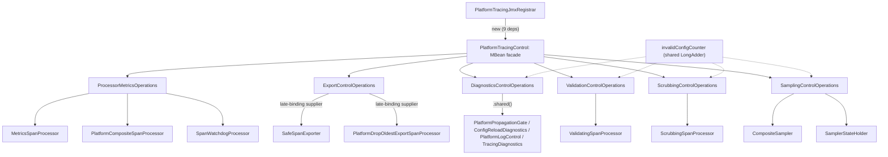

# PlatformTracingControl Refactoring Dossier

> **СТАТУС: SUPERSEDED — Phase 2 IMPLEMENTED (2026-06-18).** `SPLIT_DOMAIN_MBEANS` reset выполнен.
> Монолитный `PlatformTracingControl` / `PlatformTracingControlMBean` / `jmx.operations` **удалены**.
> Вместо них — **шесть доменных Standard MBean** (`PlatformSamplingControl`, …) с отдельными ObjectName,
> batch-регистрация через `PlatformTracingJmxRegistrar`, Spring-клиент `PlatformTracingJmxClient`,
> `RuntimeConfigApplier` с `[REJECTED]`/`[PARTIAL]` диагностикой.
> Актуальная архитектура: [runtime-policy-control-architecture.md](../tracing/runtime-policy-control-architecture.md).
>
> **СТАТУС Phase 1: IMPLEMENTED — WINNER_INTERNAL_DELEGATES (2026-06-18).** Заменён Phase 2.
> Итог Phase 1 (исторический):
> - `PlatformTracingControl` оставался единственной Standard MBean-реализацией; делегаты в `jmx.operations`.
> - Тонкий фасад с 56 `@Override`-методами; operation-делегаты оказались **public** из-за subpackage visibility.
>
> **Тип документа:** аналитическое досье + план рефакторинга (Phase 1). Ниже — исходный анализ Phase 1.
>
> **Дата:** 2026-06-18
>
> **Скоуп:** `space.br1440.platform.tracing.otel.extension.jmx.PlatformTracingControl`
>
> **Источник истины:** текущий исходный код + ранее созданные
> `docs/architecture/platform-tracing-control-constructor-inventory.md`,
> `docs/architecture/platform-tracing-control-boundary-cleanup-plan.md`.
> Внешние Perplexity/Kimi memo-файлы в репозитории **не найдены** (`Not found`).

---

## 1. Executive Summary

- **Почему класс трудно сопровождать:** `PlatformTracingControl` — это «god-facade» на **~669 строк**, реализующий **один** интерфейс `PlatformTracingControlMBean` с **~50 операциями**, относящимися к **16 несвязанным группам ответственности** (sampling, sampler counters, watchdog, processor errors, span limits, scrubbing policy/metrics, validation policy, export-gate/metrics, safe-exporter, propagation-gate, config-reload diagnostics, log-level, safe-wrapper diagnostics). Один файл = вся control-plane поверхность.
- **Текущее число ответственностей:** 16 доменных групп + 2 сквозных аспекта (`invalidConfigCounter`, `recordConfigReload`).
- **MBean-контракт должен остаться неизменным.** Внешний клиент `SamplingControlClient` (модуль `platform-tracing-spring-boot-autoconfigure`) обращается к MBean **через другой classloader** строго по **строковым именам** операций/атрибутов (`MBeanServer.invoke` / `getAttribute`). Он **не компилируется** против `PlatformTracingControl`. Значит, внутренний рефакторинг, сохраняющий имена и сигнатуры методов MBean, безопасен.
- **Рекомендуемое направление:** `WINNER_INTERNAL_DELEGATES` — превратить `PlatformTracingControl` в тонкий MBean-фасад, который делегирует в **package-private доменные operation-классы** в пакете `jmx`. `PlatformTracingControlMBean` остаётся без изменений. Тайминг ранней регистрации MBean — **вне скоупа**.
- **Это структурный, а не косметический рефакторинг:** меняется внутренняя топология ответственности (16 групп → ~6 связных delegate-компонентов с явными зависимостями), а не имена/формат. Снижается сложность фасада, появляется точечная тестируемость доменных операций.

---

## 2. Current Class Snapshot

- **Package:** `space.br1440.platform.tracing.otel.extension.jmx`
- **Файл:** [platform-tracing-otel-extension/src/main/java/space/br1440/platform/tracing/otel/extension/jmx/PlatformTracingControl.java](platform-tracing-otel-extension/src/main/java/space/br1440/platform/tracing/otel/extension/jmx/PlatformTracingControl.java) — 669 строк.
- **Реализует:** `PlatformTracingControlMBean` ([.../jmx/PlatformTracingControlMBean.java](platform-tracing-otel-extension/src/main/java/space/br1440/platform/tracing/otel/extension/jmx/PlatformTracingControlMBean.java), 376 строк, `OBJECT_NAME = "space.br1440.platform.tracing:type=Control,name=PlatformTracingControl"`).
- **Конструктор:** один, **package-private**, 9-arg (результат предыдущего `AGGRESSIVE_FULL_BOUNDARY_CLEANUP`).
- **Владелец регистрации:** `PlatformTracingJmxRegistrar` ([.../jmx/PlatformTracingJmxRegistrar.java](platform-tracing-otel-extension/src/main/java/space/br1440/platform/tracing/otel/extension/jmx/PlatformTracingJmxRegistrar.java)) — в том же пакете `jmx`, вызывает package-private конструктор напрямую.

### 2.1 Поля (12)

Инъецируемые зависимости (9, через конструктор):

```text
SamplerStateHolder                                  configHolder
CompositeSampler                                    compositeSampler
SpanWatchdogProcessor                               watchdog
PlatformCompositeSpanProcessor                      composite
MetricsSpanProcessor                                metrics
ScrubbingSpanProcessor                              scrubbing
ValidatingSpanProcessor                             validating
Supplier<PlatformDropOldestExportSpanProcessor>     exportProcessorSupplier   (late-binding)
Supplier<SafeSpanExporter>                          safeExporterSupplier      (late-binding)
```

Локальные поля (2): `LongAdder invalidConfigCounter`, `RateLimitedLogger logLevelChangeLog`.

Сквозные статические синглтоны, **не** инъецируемые (доступ через `.shared()`):

```text
ConfigReloadDiagnostics.shared()    — recordConfigReload / getConfigReloadMetrics / getConfigAuditTrail
PlatformPropagationGate.shared()    — isPropagationEnabled / setPropagationEnabled
PlatformLogControl.shared()         — getPlatformLogLevel / setPlatformLogLevel
TracingDiagnostics.shared()         — getSafeWrapperMetrics
```

> **Наблюдение (структурное):** часть групп зависит от инъецированных полей, часть — от процессных синглтонов. Это асимметрия, которую рефакторинг должен сохранить (не «инъецировать» синглтоны искусственно — это раздуло бы конструктор без выгоды).

### 2.2 Группы ответственности (16)

`SAMPLING_POLICY_CONTROL`, `SAMPLER_COUNTERS`, `WATCHDOG_METRICS`, `PROCESSOR_ERROR_METRICS`, `SPAN_LIMITS_METRICS`, `SCRUBBING_POLICY_CONTROL`, `SCRUBBING_METRICS`, `VALIDATION_POLICY_CONTROL`, (`VALIDATION_METRICS` — отсутствует отдельно), `EXPORT_GATE_CONTROL`, `EXPORT_PIPELINE_METRICS`, `SAFE_EXPORTER_METRICS`, `PROPAGATION_GATE_CONTROL`, `CONFIG_RELOAD_DIAGNOSTICS`, `LOG_LEVEL_CONTROL`, `SAFE_WRAPPER_DIAGNOSTICS`, `INTERNAL_HELPERS`.

---

## 3. Usage Inventory

### 3.1 Production usage

- **Создание/регистрация:** только `PlatformTracingJmxRegistrar.tryRegisterMBean()` → `new PlatformTracingControl(...)` → `MBeanServer.registerMBean`. Единственный production call-site инстанцирования (подтверждено grep: `new PlatformTracingControl(` в `src/main` встречается только в registrar).
- **Wiring зависимостей:** фабрики в пакете `factory` (`PlatformSamplerFactory`, `PlatformSpanProcessorFactory`, `PlatformExportProcessorFactory`) и `PlatformAutoConfigurationCustomizer` наполняют registrar через сеттеры; registrar передаёт значения/late-binding suppliers в конструктор.
- **Внутри класса нет бизнес-логики домена** — каждый метод делегирует в соответствующую зависимость (sampler/processor/gate/diagnostics) либо в статический синглтон. Класс — уже фасад, но «плоский» и монолитный.

### 3.2 Test usage

Тесты создают экземпляры **только** через `PlatformTracingControlTestBuilder` ([.../jmx/PlatformTracingControlTestBuilder.java](platform-tracing-otel-extension/src/test/java/space/br1440/platform/tracing/otel/extension/jmx/PlatformTracingControlTestBuilder.java)) — прямого `new PlatformTracingControl` в тестах нет. Файлы:

- [.../jmx/PlatformTracingControlTest.java](platform-tracing-otel-extension/src/test/java/space/br1440/platform/tracing/otel/extension/jmx/PlatformTracingControlTest.java) — sampling CRUD, валидация, registrar-регистрация/идемпотентность, watchdog-stats null-tolerant, processor-errors агрегация, export late-binding.
- [.../sampler/SamplingPolicyRuntimeUpdateJmxTest.java](platform-tracing-otel-extension/src/test/java/space/br1440/platform/tracing/otel/extension/sampler/SamplingPolicyRuntimeUpdateJmxTest.java)
- [.../scrubbing/ScrubbingPolicyRuntimeUpdateJmxTest.java](platform-tracing-otel-extension/src/test/java/space/br1440/platform/tracing/otel/extension/scrubbing/ScrubbingPolicyRuntimeUpdateJmxTest.java)
- [.../processor/ValidationPolicyRuntimeUpdateJmxTest.java](platform-tracing-otel-extension/src/test/java/space/br1440/platform/tracing/otel/extension/processor/ValidationPolicyRuntimeUpdateJmxTest.java)
- [.../processor/ValidationStrictRuntimeGuardTest.java](platform-tracing-otel-extension/src/test/java/space/br1440/platform/tracing/otel/extension/processor/ValidationStrictRuntimeGuardTest.java)
- [.../PlatformAutoConfigurationCustomizerProcessorsTest.java](platform-tracing-otel-extension/src/test/java/space/br1440/platform/tracing/otel/extension/PlatformAutoConfigurationCustomizerProcessorsTest.java) — production bootstrap guard.
- [.../PlatformSpiAutoconfigureIntegrationTest.java](platform-tracing-otel-extension/src/test/java/space/br1440/platform/tracing/otel/extension/PlatformSpiAutoconfigureIntegrationTest.java) — SPI/registration интеграция.

### 3.3 JMX / external usage

- **`SamplingControlClient`** ([.../autoconfigure/sampling/SamplingControlClient.java](platform-tracing-spring-boot-autoconfigure/src/main/java/space/br1440/platform/tracing/autoconfigure/sampling/SamplingControlClient.java)) — главный внешний потребитель. Обращается по **строковым именам** через `MBeanServer.invoke(...)` и `getAttribute(...)`; **не** компилируется против `PlatformTracingControl` (разные classloader'ы). Использует, в частности:
  - операции: `getSamplingRatio`, `setSamplingRatio`, `setDropPathPrefixes`, `setForceRecordValues`, `setSamplerEnabled`, `updateSamplingPolicy` (7-arg), `updateScrubbingPolicy` (3-arg), `updateValidationPolicy` (3-arg), `setExportEnabled`, `setPropagationEnabled`, `setPlatformLogLevel`, `getSamplerDecisionCount`;
  - атрибуты: `ProcessorErrorsTotal`, `ProcessorErrorsByName`, `SamplerEnabled`, `SamplerDecisionCounts`, `SamplingConfigVersion`, `InvalidConfigCount`, `SamplingConfigLastUpdatedSource`, `DropPathPrefixes`, `ForceRecordValues`, `RouteRatios`, `ScrubbingEnabled`, `ScrubbingConfigVersion`, `ScrubbingConfigLastUpdatedSource`, `ScrubbingMetrics`, `ValidationEnabled`, `ValidationStrict`, `ValidationStrictRuntimeAllowed`, `ValidationConfigVersion`, `ValidationConfigLastUpdatedSource`, `ConfigReloadMetrics`, `ConfigAuditTrail`, `SafeWrapperMetrics`, `SafeExporterMetrics`, `ExportQueueCapacity`, `ExportQueueSize`, `ExportDroppedOverflowTotal`, `ExportDroppedAfterShutdownTotal`, `ExportFailuresTotal`, `ExportTimeoutsTotal`.
- **Вывод:** клиент завязан на **полный текущий набор имён**. Любое переименование атрибута/операции = ломающее изменение JMX-контракта. Рефакторинг должен оставить `PlatformTracingControlMBean` буквально неизменным.

### 3.4 Docs usage

`PlatformTracingControl` упоминается в ~45 docs-файлах. Наиболее релевантные (требуют синхронизации после рефакторинга):

- [docs/architecture/Components_v1.puml](docs/architecture/Components_v1.puml), [docs/architecture/platform-tracing-classes.puml](docs/architecture/platform-tracing-classes.puml) — UML (уже частично обновлены предыдущим PR).
- [docs/tracing/runtime-policy-control-architecture.md](docs/tracing/runtime-policy-control-architecture.md), [docs/tracing/runtime-sampling-control.md](docs/tracing/runtime-sampling-control.md) — control-plane архитектура.
- [docs/architecture/platform-tracing-control-constructor-inventory.md](docs/architecture/platform-tracing-control-constructor-inventory.md), [docs/architecture/platform-tracing-control-boundary-cleanup-plan.md](docs/architecture/platform-tracing-control-boundary-cleanup-plan.md) — предыдущие артефакты (помечены как historical/implemented).

Остальные упоминания — исторические/ADR; **не** требуют изменений в этом PR (помечать как historical).

---

## 4. Responsibility Map

| Группа | Методы (MBean, если не указано иное) | Зависимости | Read/Mutation | Null-поведение | Тесты | Кандидат на извлечение |
|---|---|---|---|---|---|---|
| SAMPLING_POLICY_CONTROL | `isSamplerEnabled`/`setSamplerEnabled`, `getRouteRatios`/`setRouteRatios`, `getSamplingRatio`/`setSamplingRatio`, `getDropPathPrefixes`/`setDropPathPrefixes`, `getForceRecordValues`/`setForceRecordValues`, `updateSamplingPolicy`(5-arg, 7-arg), `getSamplingConfigVersion`, `getSamplingConfigLastUpdatedSource` | `configHolder`, `invalidConfigCounter`, `recordConfigReload`, `Strings` | both | read: `-1.0`/`emptyMap`/`new String[0]`/`"unknown"`; mutation: `IllegalStateException` если `configHolder==null` | `PlatformTracingControlTest`, `SamplingPolicyRuntimeUpdateJmxTest` | `SamplingControlOperations` |
| SAMPLER_COUNTERS | `getSamplerDecisionCount`, `getSamplerDecisionCounts`, `resetSamplerCounters`, `getInvalidConfigCount` | `compositeSampler`, `invalidConfigCounter` | both (reset=mutation) | `0L`/`emptyMap`; reset — no-op если null | `SamplingPolicyRuntimeUpdateJmxTest` (частично) | `SamplerCountersOperations` или часть `SamplingControlOperations` |
| WATCHDOG_METRICS | `getForcedSpanCloses`, `getForcedTraceCloses`, `getActiveSpanCount`, `getActiveTraceCount` | `watchdog` | read | `0`/`0L` если null | `PlatformTracingControlTest` (stats) | `ProcessorMetricsOperations` |
| PROCESSOR_ERROR_METRICS | `getProcessorErrorsTotal`, `getProcessorErrorsByName` | `composite` | read | `0L`/`emptyMap` | `PlatformTracingControlTest` | `ProcessorMetricsOperations` |
| SPAN_LIMITS_METRICS | `getDroppedAttributesTotal`, `getDroppedEventsTotal`, `getDroppedLinksTotal` | `metrics` | read | `0L` | косвенно (`MetricsSpanProcessorTest`) | `ProcessorMetricsOperations` |
| SCRUBBING_POLICY_CONTROL | `isScrubbingEnabled`, `updateScrubbingPolicy`(2-arg,3-arg), `getScrubbingConfigVersion`, `getScrubbingConfigLastUpdatedSource` | `scrubbing`, `invalidConfigCounter`, `recordConfigReload` | both | read: `false`/`-1L`/`"unknown"`; mutation: `IllegalStateException` если null | `ScrubbingPolicyRuntimeUpdateJmxTest` | `ScrubbingControlOperations` |
| SCRUBBING_METRICS | `getScrubbingMetrics` | `scrubbing` | read | `emptyMap` | `ScrubbingPolicyRuntimeUpdateJmxTest` (частично) | `ScrubbingControlOperations` |
| VALIDATION_POLICY_CONTROL | `isValidationEnabled`, `isValidationStrict`, `isValidationStrictRuntimeAllowed`, `updateValidationPolicy`(2-arg,3-arg), `getValidationConfigVersion`, `getValidationConfigLastUpdatedSource` | `validating`, `invalidConfigCounter`, `recordConfigReload` | both | read: `false`/`-1L`/`"unknown"`; mutation: `IllegalStateException` если null | `ValidationPolicyRuntimeUpdateJmxTest`, `ValidationStrictRuntimeGuardTest` | `ValidationControlOperations` |
| EXPORT_GATE_CONTROL | `isExportEnabled`, `setExportEnabled` | `safeExporterSupplier`, `recordConfigReload` | both | read: `false`; mutation: `IllegalStateException` если exporter null | косвенно | `ExportControlOperations` |
| EXPORT_PIPELINE_METRICS | `getExportDroppedOverflowTotal`, `getExportDroppedAfterShutdownTotal`, `getExportFailuresTotal`, `getExportTimeoutsTotal`, `getExportQueueCapacity`, `getExportQueueSize` | `exportProcessorSupplier` | read | `0`/`0L` | `PlatformTracingControlTest` (late-binding) | `ExportControlOperations` |
| SAFE_EXPORTER_METRICS | `getSafeExporterMetrics` | `safeExporterSupplier` | read | `emptyMap` | `PlatformTracingControlTest` (late-binding) | `ExportControlOperations` |
| PROPAGATION_GATE_CONTROL | `isPropagationEnabled`, `setPropagationEnabled` | `PlatformPropagationGate.shared()`, `recordConfigReload` | both | read: значение gate | косвенно (gate-тесты) | `DiagnosticsControlOperations` |
| CONFIG_RELOAD_DIAGNOSTICS | `getConfigReloadMetrics`, `getConfigAuditTrail`, *(private)* `recordConfigReload` | `ConfigReloadDiagnostics.shared()` | read (+ запись через сквозной helper) | `emptyMap`/`String[0]` | косвенно | `DiagnosticsControlOperations` |
| LOG_LEVEL_CONTROL | `getPlatformLogLevel`, `setPlatformLogLevel` | `PlatformLogControl.shared()`, `RateLimitedLogger`, `invalidConfigCounter`, `recordConfigReload` | both | mutation: `IllegalArgumentException` на неизвестный уровень | косвенно | `DiagnosticsControlOperations` |
| SAFE_WRAPPER_DIAGNOSTICS | `getSafeWrapperMetrics` | `TracingDiagnostics.shared()` | read | `emptyMap` | косвенно | `DiagnosticsControlOperations` |
| INTERNAL_HELPERS | `recordConfigReload`, `exportProcessorOrNull`, `safeExporterOrNull` | static singletons / suppliers | — | — | — | приватные в delegate-ах |

> **Замечание по покрытию (inference):** для SPAN_LIMITS, EXPORT_GATE, PROPAGATION, CONFIG_RELOAD, LOG_LEVEL, SAFE_WRAPPER нет **прямых** unit-тестов уровня `PlatformTracingControl`; поведение покрывается на уровне нижележащих компонентов и/или `SamplingControlClient`-тестов. Это помечено как пробел покрытия (см. §7).

---

## 5. Dependency Coupling Matrix

| Зависимость | Используется методами | Mutable? | Null-поведение | Цель извлечения | Риск |
|---|---|---|---|---|---|
| `SamplerStateHolder configHolder` | вся SAMPLING_POLICY_CONTROL | да (`tryUpdate`/`tryApplyPolicyUpdate`) | mutation → `IllegalStateException`; read → дефолты | `SamplingControlOperations` | low |
| `CompositeSampler compositeSampler` | SAMPLER_COUNTERS | да (`resetCounters`) | `0L`/`emptyMap`; reset no-op | `SamplerCountersOperations`/`SamplingControlOperations` | low |
| `SpanWatchdogProcessor watchdog` | WATCHDOG_METRICS | нет (read-only) | `0`/`0L` | `ProcessorMetricsOperations` | low |
| `PlatformCompositeSpanProcessor composite` | PROCESSOR_ERROR_METRICS | нет | `0L`/`emptyMap` | `ProcessorMetricsOperations` | low |
| `MetricsSpanProcessor metrics` | SPAN_LIMITS_METRICS | нет | `0L` | `ProcessorMetricsOperations` | low |
| `ScrubbingSpanProcessor scrubbing` | SCRUBBING_POLICY_CONTROL, SCRUBBING_METRICS | да (`tryApplyPolicyUpdate`) | mutation → `IllegalStateException`; read → дефолты | `ScrubbingControlOperations` | low |
| `ValidatingSpanProcessor validating` | VALIDATION_POLICY_CONTROL | да (`tryApplyPolicyUpdate`) | mutation → `IllegalStateException`; read → дефолты | `ValidationControlOperations` | low |
| `Supplier<PlatformDropOldestExportSpanProcessor> exportProcessorSupplier` | EXPORT_PIPELINE_METRICS | late-binding (supplier) | `null`-значение → `0`/`0L` | `ExportControlOperations` | medium (late-binding инвариант) |
| `Supplier<SafeSpanExporter> safeExporterSupplier` | EXPORT_GATE_CONTROL, SAFE_EXPORTER_METRICS | late-binding (supplier) | `null`-значение → `false`/`emptyMap`; set → `IllegalStateException` | `ExportControlOperations` | medium (late-binding инвариант) |
| `ConfigReloadDiagnostics.shared()` (static) | CONFIG_RELOAD_DIAGNOSTICS + `recordConfigReload` (сквозной) | да (record) | — | `DiagnosticsControlOperations` (остаётся `.shared()`) | low |
| `PlatformPropagationGate.shared()` (static) | PROPAGATION_GATE_CONTROL | да | — | `DiagnosticsControlOperations` (остаётся `.shared()`) | low |
| `PlatformLogControl.shared()` (static) | LOG_LEVEL_CONTROL | да | mutation → `IllegalArgumentException` | `DiagnosticsControlOperations` (остаётся `.shared()`) | low |
| `RateLimitedLogger logLevelChangeLog` | LOG_LEVEL_CONTROL | — | — | внутрь `DiagnosticsControlOperations` | low |
| `TracingDiagnostics.shared()` (static) | SAFE_WRAPPER_DIAGNOSTICS | нет (read) | `emptyMap` | `DiagnosticsControlOperations` (остаётся `.shared()`) | low |
| `LongAdder invalidConfigCounter` (сквозной) | SAMPLING, SAMPLER_COUNTERS(read), SCRUBBING, VALIDATION, LOG_LEVEL | да (increment + read) | — | **общий**: передать всем delegate-ам как разделяемую ссылку | **medium (главный связующий риск)** |
| `recordConfigReload` (сквозной) | SAMPLING, SCRUBBING, VALIDATION, EXPORT, PROPAGATION, LOG_LEVEL | — | — | каждый delegate вызывает `ConfigReloadDiagnostics.shared()` напрямую, либо общий мелкий helper | low |
| `Strings` | `updateSamplingPolicy` (валидация ключей) | нет | — | внутрь `SamplingControlOperations` | low |
| `SamplerState` (record) | SAMPLING сеттеры (построение нового снимка) | immutable | — | внутрь `SamplingControlOperations` | low |

> **Ключевой структурный вывод:** единственная нетривиальная связность между группами — **`invalidConfigCounter`** (инкрементится в 4 группах, читается в `getInvalidConfigCount`) и **`recordConfigReload`** (вызывается в 6 группах). Любая декомпозиция обязана сохранить единый счётчик и единый audit-trail. Рекомендация: ввести разделяемый package-private носитель счётчика (например, передавать `LongAdder invalidConfigCounter` в каждый delegate) и оставить `recordConfigReload` как обращение к `ConfigReloadDiagnostics.shared()` внутри каждого delegate.

---

## 6. JMX Contract Constraints

### 6.1 Что обязано оставаться стабильным

- `PlatformTracingControlMBean.OBJECT_NAME` — **неизменен** (ломающее изменение контракта по javadoc интерфейса).
- **Все имена операций и атрибутов** — `SamplingControlClient` обращается по строкам; переименование = поломка cross-CL клиента.
- **Сигнатуры**, особенно `updateSamplingPolicy(boolean,double,String[],String[],String[],double[],String)` — клиент передаёт точную сигнатуру типов в `invoke(...)`.
- **JMX standard-MBean naming convention:** имя класса реализации = `PlatformTracingControl`, имя интерфейса = `<impl>MBean`. Это нужно для регистрации без `StandardMBean`-обёртки (registrar регистрирует сам объект). **Доменные delegate-классы НЕ должны** ни реализовывать `*MBean`-интерфейс, ни попадать в регистрацию.

### 6.2 Map/array/OpenMBean-чувствительные методы

Возвращают `Map`/массивы → проходят через JMX OpenType-конвертацию; их форму менять нельзя:

```text
getRouteRatios(): Map<String,Double>            setRouteRatios(Map<String,Double>)
getSamplerDecisionCounts(): Map<String,Long>    getProcessorErrorsByName(): Map<String,Long>
getScrubbingMetrics(): Map<String,Long>         getConfigReloadMetrics(): Map<String,Long>
getSafeExporterMetrics(): Map<String,Long>      getSafeWrapperMetrics(): Map<String,Long>
getDropPathPrefixes(): String[]                 setDropPathPrefixes(String[])
getForceRecordValues(): String[]                setForceRecordValues(String[])
getConfigAuditTrail(): String[]
```

Делегирование сохраняет ту же возвращаемую коллекцию (фасад просто проксирует) → OpenMBean-совместимость не затрагивается.

### 6.3 Допустимо как внутреннее

- Группировка реализации в package-private delegate-классы.
- Изменение **приватных** helper'ов (`recordConfigReload`, `*OrNull`).
- Перенос полей в delegate-объекты, если фасад продолжает хранить ссылки на delegate-ы.

### 6.4 Рискованные изменения, которых избегаем

- Любое изменение `PlatformTracingControlMBean` (по умолчанию **запрещено**; см. Option D — отвергается).
- Разбиение на несколько MBean'ов с новыми ObjectName.
- Замена возвращаемых типов (`Map`→record, массив→`List`) — сломает JMX-конвертацию и клиента.

---

## 7. Test Coverage Map

| Группа методов | Текущие тесты | Качество покрытия | Пробелы | Нужные правки при извлечении |
|---|---|---|---|---|
| SAMPLING_POLICY_CONTROL | `PlatformTracingControlTest`, `SamplingPolicyRuntimeUpdateJmxTest` | хорошее (CRUD, IAE, last-known-good, версия) | — | builder остаётся; тесты не меняются (фасад сохраняет API) |
| SAMPLER_COUNTERS | `PlatformTracingControlTest` (`getInvalidConfigCount` косвенно), `SamplingPolicyRuntimeUpdateJmxTest` | среднее | нет прямого теста `resetSamplerCounters`/`getSamplerDecisionCounts` на уровне control | без правок |
| WATCHDOG_METRICS | `PlatformTracingControlTest` (stats null + live) | хорошее | — | без правок |
| PROCESSOR_ERROR_METRICS | `PlatformTracingControlTest` (агрегация per-delegate) | хорошее | — | без правок |
| SPAN_LIMITS_METRICS | косвенно `MetricsSpanProcessorTest` | слабое (нет control-уровня) | прямой тест на null-tolerant `0L` | опционально добавить |
| SCRUBBING_POLICY_CONTROL | `ScrubbingPolicyRuntimeUpdateJmxTest` | хорошее | — | без правок |
| SCRUBBING_METRICS | `ScrubbingPolicyRuntimeUpdateJmxTest` (частично) | среднее | snapshot-ключи | без правок |
| VALIDATION_POLICY_CONTROL | `ValidationPolicyRuntimeUpdateJmxTest`, `ValidationStrictRuntimeGuardTest` | хорошее (strict guard) | — | без правок |
| EXPORT_GATE_CONTROL | косвенно | слабое | прямой тест `setExportEnabled` IllegalState | опционально |
| EXPORT_PIPELINE_METRICS | `PlatformTracingControlTest` (late-binding) | хорошее | — | без правок (late-binding инвариант важен) |
| SAFE_EXPORTER_METRICS | `PlatformTracingControlTest` (late-binding) | среднее | — | без правок |
| PROPAGATION_GATE_CONTROL | косвенно (gate-тесты) | слабое на control-уровне | прямой toggle-тест | опционально |
| CONFIG_RELOAD_DIAGNOSTICS | косвенно | слабое | `recordConfigReload` audit-trail на control-уровне | опционально |
| LOG_LEVEL_CONTROL | косвенно | слабое | прямой тест `setPlatformLogLevel` IAE | опционально |
| SAFE_WRAPPER_DIAGNOSTICS | косвенно | слабое | — | без правок |
| Bootstrap/registration | `PlatformAutoConfigurationCustomizerProcessorsTest`, `PlatformSpiAutoconfigureIntegrationTest`, `PlatformTracingControlTest` (registrar) | хорошее | — | **не менять** — production-path guard |

> Все тесты инстанцируют через `PlatformTracingControlTestBuilder`. Поскольку рекомендуемый рефакторинг **сохраняет** публичный набор MBean-методов и package-private конструктор, существующие тесты **не требуют переписывания** (только потенциальные добавления для пробелов).

---

## 8. Refactoring Options

### Option A — Internal delegates only (рекомендуемая база)

- **Концепт:** `PlatformTracingControlMBean` неизменен; `PlatformTracingControl` — тонкий фасад; вся реализация в package-private доменных operation-классах пакета `jmx`.
- **Целевые классы:** `SamplingControlOperations`, `ScrubbingControlOperations`, `ValidationControlOperations`, `ExportControlOperations`, `ProcessorMetricsOperations`, `DiagnosticsControlOperations` (propagation + config-reload + log-level + safe-wrapper).
- **Что переезжает:** тело каждого MBean-метода → одноимённый метод delegate-а; поля-зависимости → в соответствующий delegate; `invalidConfigCounter` — общий, передаётся всем мутационным delegate-ам.
- **Что остаётся:** `PlatformTracingControl` хранит ссылки на delegate-ы и проксирует ~50 методов 1-в-1; реализует MBean-интерфейс; package-private конструктор; late-binding suppliers передаются в `ExportControlOperations`.
- **Tests impact:** нулевой (API фасада не меняется); опциональные добавления для пробелов.
- **Risks:** общий `invalidConfigCounter`; сохранение late-binding и null-tolerant поведения.
- **Stop conditions:** см. §15.

### Option B — Domain services

- **Концепт:** перенести логику в существующие доменные классы (`SamplerStateHolder`, `ScrubbingSpanProcessor`, ...), фасад только маппит JMX→домен.
- **Минус:** большая часть логики **уже** в доменных классах; то, что осталось в control — это JMX-специфичная адаптация (валидация диапазонов, парные массивы, `invalidConfigCounter`, audit). Перенос в домен размажет JMX-аспект по доменным классам и нарушит их single-responsibility. Низкая отдача, средний риск.

### Option C — Facade + immutable context

- **Концепт:** ввести `PlatformTracingControlDependencies` (record из 9 полей) для чистого конструктора + delegate-ы.
- **Плюс:** конструктор уже один (9-arg) — record слегка упрощает сигнатуру. Дополняет, но не заменяет Option A.
- **Минус сам по себе:** не решает проблему 16 ответственностей. Полезен **в связке** с A (delegate получает context).

### Option D — Split MBean interfaces

- **Концепт:** разбить `PlatformTracingControlMBean` на несколько MBean с разными ObjectName.
- **Отвергается:** ломает JMX-контракт и `SamplingControlClient` (cross-CL, по именам/одному ObjectName). Высокий риск, нарушает §6.1. Не выбирать.

### Option E — Two-phase cleanup

- **Фаза 1:** Option A (delegate-ы, контракт неизменен).
- **Фаза 2:** ревизия контракта/lifecycle/early-registration timing — **отдельный PR**.
- **Плюс:** безопасно разделяет «читаемость сейчас» и «тайминг потом».

### Option F — Aggressive internal boundary cleanup

- **Концепт:** Option A, выполненный **за один PR** для всех 6 delegate-групп сразу (а не итеративно).
- **Плюс:** один связный коммит, минимум промежуточных состояний; согласуется с «не в production, агрессивная чистка разрешена».
- **Минус:** крупнее diff одного PR (но тесты-страховка полные).

---

## 9. Scoring Matrix

Шкала 1–10 (выше = лучше; для «Impl Risk» выше = меньше риск). Вес: Maintainability/Readability/Arch Review/Responsibility Reduction — высокий.

| Option | Readability | Maintainability | Behavior Safety | JMX Safety | Testability | Impl Risk | Arch Review | Timing Separation | Extensibility | Responsibility Reduction | Weighted |
|---|---:|---:|---:|---:|---:|---:|---:|---:|---:|---:|---:|
| A — Internal delegates | 9 | 9 | 9 | 10 | 9 | 8 | 9 | 9 | 8 | 9 | **8.9** |
| B — Domain services | 5 | 5 | 7 | 9 | 6 | 5 | 5 | 7 | 6 | 5 | 5.9 |
| C — Facade+context | 6 | 7 | 9 | 10 | 7 | 8 | 6 | 9 | 7 | 5 | 7.1 |
| D — Split MBeans | 6 | 6 | 3 | 2 | 7 | 3 | 4 | 6 | 7 | 8 | 4.7 |
| E — Two-phase | 9 | 9 | 10 | 10 | 9 | 9 | 9 | 10 | 8 | 9 | **9.2** |
| F — Aggressive internal | 9 | 9 | 8 | 10 | 9 | 7 | 9 | 9 | 8 | 10 | 8.8 |

> Победитель по сумме — **E (two-phase)**, где Фаза 1 = Option A с интенсивностью «один связный PR» (F). C добавляется как опциональный приём (context-record) внутри Фазы 1.

---

## 10. Recommended Winner

```text
WINNER_INTERNAL_DELEGATES
```

Исполняется как **Фаза 1 двухфазного плана (Option E)** с интенсивностью одного связного PR (Option F): извлечь все доменные операции в package-private delegate-классы пакета `jmx`, оставив `PlatformTracingControlMBean` и весь JMX-контракт без изменений. Тайминг ранней регистрации — **Фаза 2 / отдельный follow-up**.

---

## 11. Recommended Target Architecture

### 11.1 Классы

**Создать (package-private, пакет `space.br1440.platform.tracing.otel.extension.jmx`):**

- `SamplingControlOperations` — SAMPLING_POLICY_CONTROL + SAMPLER_COUNTERS. Поля: `configHolder`, `compositeSampler`, разделяемый `invalidConfigCounter`.
- `ScrubbingControlOperations` — SCRUBBING_POLICY_CONTROL + SCRUBBING_METRICS. Поля: `scrubbing`, `invalidConfigCounter`.
- `ValidationControlOperations` — VALIDATION_POLICY_CONTROL. Поля: `validating`, `invalidConfigCounter`.
- `ExportControlOperations` — EXPORT_GATE_CONTROL + EXPORT_PIPELINE_METRICS + SAFE_EXPORTER_METRICS. Поля: `exportProcessorSupplier`, `safeExporterSupplier`.
- `ProcessorMetricsOperations` — WATCHDOG_METRICS + PROCESSOR_ERROR_METRICS + SPAN_LIMITS_METRICS. Поля: `watchdog`, `composite`, `metrics`. (Read-only.)
- `DiagnosticsControlOperations` — PROPAGATION_GATE_CONTROL + CONFIG_RELOAD_DIAGNOSTICS + LOG_LEVEL_CONTROL + SAFE_WRAPPER_DIAGNOSTICS. Использует статические `.shared()` синглтоны; владеет `logLevelChangeLog`, `invalidConfigCounter`.
- *(Опционально, Option C)* `PlatformTracingControlDependencies` — package-private record/holder 9 зависимостей + общий `invalidConfigCounter`, чтобы фасад и registrar собирали delegate-ы единообразно.

**Модифицировать:**

- `PlatformTracingControl` — становится тонким фасадом: хранит 6 delegate-ссылок (+ общий `invalidConfigCounter`), каждый из ~50 MBean-методов = одна строка делегирования. Конструктор остаётся package-private 9-arg; внутри собирает delegate-ы.
- `PlatformTracingControlMBean` — **без изменений**.
- `PlatformTracingJmxRegistrar` — **без изменений** (конструктор фасада не меняет сигнатуру).

### 11.2 Поток зависимостей



### 11.3 Куда делегирует что

Каждый MBean-метод из §4 → одноимённый метод соответствующего delegate-а. `getInvalidConfigCount()` читает общий `invalidConfigCounter` (живёт в фасаде или в context-record). `recordConfigReload(...)` — приватный helper в каждом delegate, который вызывает `ConfigReloadDiagnostics.shared().record(...)` (поведение идентично текущему).

### 11.4 Что остаётся в `PlatformTracingControl`

- Реализация `implements PlatformTracingControlMBean` (контракт-binding).
- package-private 9-arg конструктор (сборка delegate-ов).
- Ссылки на 6 delegate-ов + общий `invalidConfigCounter`.
- ~50 однострочных проксирующих методов.

---

## 12. File-by-File Refactoring Plan

| Файл | Действие | Причина | Риск | Валидация |
|---|---|---|---|---|
| `.../jmx/PlatformTracingControl.java` | Преобразовать в фасад; вынести тела в delegate-ы | снять 16 ответственностей с одного класса | medium | targeted JMX-тесты + full module |
| `.../jmx/SamplingControlOperations.java` | Создать (package-private) | sampling policy + counters | low | `SamplingPolicyRuntimeUpdateJmxTest`, `PlatformTracingControlTest` |
| `.../jmx/ScrubbingControlOperations.java` | Создать | scrubbing policy + metrics | low | `ScrubbingPolicyRuntimeUpdateJmxTest` |
| `.../jmx/ValidationControlOperations.java` | Создать | validation policy | low | `ValidationPolicyRuntimeUpdateJmxTest`, `ValidationStrictRuntimeGuardTest` |
| `.../jmx/ExportControlOperations.java` | Создать | export gate/metrics + safe-exporter (late-binding) | medium | `PlatformTracingControlTest` (late-binding) |
| `.../jmx/ProcessorMetricsOperations.java` | Создать | watchdog + processor errors + span limits | low | `PlatformTracingControlTest` (stats/errors) |
| `.../jmx/DiagnosticsControlOperations.java` | Создать | propagation + config-reload + log-level + safe-wrapper | low | full module |
| `.../jmx/PlatformTracingControlDependencies.java` *(опц.)* | Создать record/holder | чистая сборка delegate-ов | low | компиляция |
| `.../jmx/PlatformTracingControlMBean.java` | **Не менять** | JMX-контракт | — | grep-diff = 0 |
| `.../jmx/PlatformTracingJmxRegistrar.java` | **Не менять** | конструктор фасада неизменен | — | bootstrap-тест |
| `.../jmx/PlatformTracingControlTestBuilder.java` | **Не менять** | API фасада неизменен | — | компиляция тестов |
| `docs/architecture/Components_v1.puml`, `platform-tracing-classes.puml` | Обновить: фасад + delegate-ы | синхронизация UML | low | визуальный review |
| `docs/tracing/runtime-policy-control-architecture.md` | Обновить (delegate-структура) | актуальность | low | review |
| `docs/architecture/platform-tracing-control-refactoring-dossier.md` | Этот файл | артефакт решения | — | — |

---

## 13. Behavior Invariants

- `OBJECT_NAME` — неизменен.
- `PlatformTracingControlMBean` — неизменен (имена/сигнатуры/возвращаемые типы).
- Сигнатуры всех MBean-методов — неизменны.
- Null-tolerant reads — неизменны (`0`/`0L`/`-1`/`-1.0`/`emptyMap`/`new String[0]`/`"unknown"`).
- Mutation exceptions — неизменны (`IllegalStateException` при отсутствующей зависимости; `IllegalArgumentException` при невалидном вводе/уровне).
- `invalidConfigCounter` — единый счётчик, та же семантика increment/read.
- `ConfigReloadDiagnostics` (record/snapshot/auditTrail) — неизменное поведение.
- Export supplier late-binding — неизменно (значения читаются лениво, `null` → дефолты).
- Log-level rate limiting (`logLevelChangeLog`) — неизменно.
- Early-registration timing — **неизменно** (вне скоупа).

---

## 14. Test Strategy

- **Targeted (должны пройти без изменений):** `PlatformTracingControlTest`, `SamplingPolicyRuntimeUpdateJmxTest`, `ScrubbingPolicyRuntimeUpdateJmxTest`, `ValidationPolicyRuntimeUpdateJmxTest`, `ValidationStrictRuntimeGuardTest`, `PlatformAutoConfigurationCustomizerProcessorsTest`, `PlatformSpiAutoconfigureIntegrationTest`.
- **Новые (опционально, закрыть пробелы §7):** прямые control-уровневые тесты для SPAN_LIMITS (null-tolerant `0L`), EXPORT_GATE (`setExportEnabled` IllegalState), PROPAGATION toggle, LOG_LEVEL (`setPlatformLogLevel` IAE). Можно добавить как `*OperationsTest` на сами delegate-ы (теперь они изолированно тестируемы — главный выигрыш).
- **Переписать:** ничего обязательного (API фасада не меняется).
- **Не менять:** bootstrap/registration guard-тесты; `PlatformTracingControlTestBuilder`.
- **Ассерты, которые обязаны сохраниться:** last-known-good при невалидном апдейте; bump версии; `invalidConfigCount` инкременты; агрегация processor-errors per-delegate; late-binding export нули→значения.

---

## 15. Stop Conditions

Остановить реализацию, если:

- требуется изменить `PlatformTracingControlMBean` (имена/сигнатуры/типы);
- меняется `OBJECT_NAME`;
- меняется null-tolerant поведение чтения;
- меняется поведение mutation-исключений;
- извлечение требует менять тайминг регистрации/lifecycle;
- тесты приходится ослаблять;
- delegate-ы вынужденно становятся `public` без обоснования (должны быть package-private);
- появляются циклические зависимости между фасадом и delegate-ами;
- `invalidConfigCounter` нельзя сделать единым без изменения семантики `getInvalidConfigCount`.

---

## 16. Separate Follow-Ups

- **Early-registration timing** (Фаза 2): registrar регистрирует MBean при первом `setConfigHolder` — до того, как все процессоры подключены; часть атрибутов временно отдаёт нули. Отдельный PR (требует решения о порядке wiring или явном «ready»-флаге).
- **Возможный split MBean** — не рекомендуется (ломает контракт), но при будущем версионировании control-plane можно ввести `v2` ObjectName рядом.
- **Domain-level policy control APIs** — вынести валидацию диапазонов (ratio∈[0,1], лимиты размеров) ближе к доменам, если потребуется переиспользование вне JMX.
- **Docs cleanup** — синхронизировать UML и `runtime-policy-control-architecture.md` со структурой delegate-ов.
- **Переименование `SamplingControlClient` → `PlatformTracingControlClient`** (исторически отложено в PR-9A) — отдельный naming-PR.

---

## 17. Cursor Implementation Prompt Draft

```text
Implement WINNER_INTERNAL_DELEGATES (Phase 1) for PlatformTracingControl.

Goal: turn PlatformTracingControl into a thin MBean facade by extracting package-private
domain operation delegates in package ...jmx. Do NOT change PlatformTracingControlMBean,
OBJECT_NAME, method signatures, null-tolerant reads, mutation exceptions, invalidConfigCounter
semantics, ConfigReloadDiagnostics behavior, export supplier late-binding, or registration timing.

Create (package-private, ...jmx):
- SamplingControlOperations (sampling policy + sampler counters; uses configHolder, compositeSampler, shared invalidConfigCounter)
- ScrubbingControlOperations (scrubbing policy + metrics; uses scrubbing, shared invalidConfigCounter)
- ValidationControlOperations (validation policy; uses validating, shared invalidConfigCounter)
- ExportControlOperations (export gate + pipeline metrics + safe-exporter metrics; uses both late-binding suppliers)
- ProcessorMetricsOperations (watchdog + processor errors + span-limits; read-only)
- DiagnosticsControlOperations (propagation gate + config-reload + log-level + safe-wrapper; uses .shared() singletons, owns logLevelChangeLog, shared invalidConfigCounter)
- (optional) PlatformTracingControlDependencies holder/record for clean delegate assembly

Modify PlatformTracingControl: keep implements PlatformTracingControlMBean and the package-private
9-arg constructor; build the 6 delegates in the constructor; make every MBean method a 1-line
delegation. Keep invalidConfigCounter shared across mutation delegates and read by getInvalidConfigCount.

Hard rules: no public delegates; no reflection; no changes to PlatformTracingJmxRegistrar /
PlatformTracingControlMBean / PlatformTracingControlTestBuilder signatures; do not fix early-registration timing.

Validation:
- ./gradlew :platform-tracing-otel-extension:test --tests "*PlatformTracingControlTest*" --tests "*SamplingPolicyRuntimeUpdateJmxTest*" --tests "*ScrubbingPolicyRuntimeUpdateJmxTest*" --tests "*ValidationPolicyRuntimeUpdateJmxTest*" --tests "*ValidationStrictRuntimeGuardTest*" --tests "*PlatformAutoConfigurationCustomizerProcessorsTest*" --continue
- ./gradlew :platform-tracing-otel-extension:test --continue
- ./gradlew pr4ArchitectureFitnessVerify --continue
- grep: PlatformTracingControlMBean unchanged; no public *Operations; OBJECT_NAME unchanged.
```

---

## 18. Final Status

```text
Phase 1 (WINNER_INTERNAL_DELEGATES): IMPLEMENTED — superseded by Phase 2
Phase 2 (SPLIT_DOMAIN_MBEANS): IMPLEMENTED — 2026-06-18
  • Monolith PlatformTracingControl deleted
  • Six domain MBeans + PlatformTracingJmxRegistrar batch registration
  • PlatformTracingJmxClient replaces SamplingControlClient
  • RuntimeConfigApplier fail-closed + ConfigApplyResult diagnostics
  • Docs synced: runtime-policy-control-architecture.md, PUML diagrams
Inventory/refactoring dossier status: COMPLETED (historical record)
```
