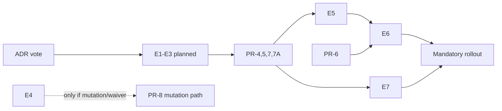

# Platform Tracing: Evidence Gates (Production Rollout)

| Поле | Значение |
|------|----------|
| Версия | 1.0 |
| Дата | 2026-06-11 |
| Статус | **Gate checklist** |
| ADR | [ADR-platform-tracing-clean-core-hybrid](../decisions/ADR-platform-tracing-clean-core-hybrid.md) |
| PR roadmap | [platform-tracing-pr-roadmap.md](./platform-tracing-pr-roadmap.md) |

---

## 1. Назначение

Документ перечисляет **evidence gates** для mandatory production rollout и отдельных enablement gates (mutation path). Архитектурное решение Clean Core Hybrid может быть **утверждено комитетом как target architecture** до закрытия всех evidence.

**Committee approval vs production rollout:** комитет может утвердить ADR как **целевую архитектуру** до полного закрытия production evidence. Mandatory rollout остаётся заблокированным до E1–E6 и **E7 (если Config Server / Helm desired-state в mandatory scope)**, или явного waiver.

**Принцип:** claims в ADR разделены на **подтверждённые факты**, **working hypotheses** и **design intent**.

---

## 2. Статус claims после review

| Claim | Status | Correct wording |
|-------|--------|-----------------|
| OTel Java Agent extensions work | **Confirmed** (Sonar) | Extension via `otel.javaagent.extensions` — valid |
| Cross-CL Java DTO over JMX is risky | **Confirmed** (spike ADR + Oracle JMX) | Avoid raw DTO; use open-type wire |
| Map wire format is safe | **Partially confirmed** | Acceptable only when constrained to validated JDK/open types; CompositeData fallback documented |
| MXBean/OpenMBean portability | **Confirmed** (Oracle) | Prefer open types; CompositeData is canonical structured form |
| Actuator as public control surface | **Confirmed with conditions** | Production: READ diagnostics only; MUTATION dev-only |
| Tail sampling reduces JVM work | **Partially confirmed** | Shifts cost to Collector; needs buffering |
| Tail sampling replaces JVM PII guard | **Rejected** | JVM scrubbing mandatory |
| M5 FAIL = placement error | **Rejected as proven fact** | Symptom; hypothesis pending profiling |
| Heavy processors default-off = OTel best practice | **Rejected** | Local engineering policy; needs benchmarks |
| Tiered pipeline fixes M5 | **Rejected as proven fact** | Expected to reduce overhead; verified by E6 |
| Schema-first required before prod | **Rejected as blocker** | Should-have after manual v1 |
| `platform-tracing-core` can be pure Java | **Hypothesis** | Requires spike + ArchUnit |
| Thin adapter reduces OTel migration risk | **Hypothesis** | Expected to localize impact; requires prototype + compatibility tests |

---

## 3. Evidence artifacts

### E1 — Perf characterization report (BLOCKING for mandatory rollout)

| Field | Detail |
|-------|--------|
| **Closes** | M5 root cause hypothesis |
| **PR** | PR-0 |
| **Owner** | Platform perf + SRE |
| **Methods** | JFR, async-profiler, or equivalent on Gentoo perf lab M5 scenario |
| **Required sections** | |
| | 1. M0 vs M5 CPU/RSS reproduction |
| | 2. Flamegraph top contributors (sampler, processors, scrubbing, export, agent baseline) |
| | 3. Cost attribution: sampled vs unsampled span paths |
| | 4. Per-processor onEnd cost estimate |
| | 5. Leading hypothesis statement (not conclusion unless data supports) |
| **Acceptance** | Report stored in `docs/tracing/perf-results/` with date stamp |
| **Does NOT require** | Proving single root cause — ranked contributors sufficient |

**Mandatory wording in report:**

> M5 FAIL is a performance symptom. Leading hypothesis: mixed architecture and implementation overhead. Root cause requires local profiling evidence.

---

### E2 — Cross-CL wire format spike (BLOCKING for mandatory rollout)

| Field | Detail |
|-------|--------|
| **Closes** | JMX Map wire decision vs raw DTO |
| **PR** | PR-2 |
| **Owner** | Platform tracing team |
| **Tests** | |
| | Map payload round-trip App CL → Agent CL — **must pass** |
| | Same-shape Java DTO cross-CL — **document failure mode** (ClassCastException or equivalent) |
| | Invalid value types rejected — Integer vs Long vs Double semantics |
| | Unknown keys rejected or ignored per schema policy |
| | Nested Map/List of non-primitives rejected |
| | Topology fields in policy payload rejected → LKG |
| **Acceptance** | Test class in `e2e-tests/contract/` green; short spike summary in docs |
| **Fallback documented** | CompositeData path if Map too loose |

---

### E3 — Core extraction feasibility spike (BLOCKING for mandatory rollout)

| Field | Detail |
|-------|--------|
| **Closes** | Pure Java core hypothesis |
| **PR** | PR-4 (spike may precede full PR) |
| **Owner** | Platform tracing team |
| **Deliverables** | |
| | New `platform-tracing-core` module compiles |
| | ArchUnit: no `io.opentelemetry..`, no `org.springframework..` |
| | At least 2 components extracted: sampler policy state + scrubbing rule engine |
| | Core unit tests run without agent/Spring (<5s suite) |
| | Package inventory: what stays in extension (OTel adapters only) |
| **Acceptance** | ArchUnit report attached; no OTel types leaked |

---

### E4 — Actuator mutation security review (BLOCKING for mutation enablement only)

| Field | Detail |
|-------|--------|
| **Closes** | Dev/debug mutation exposure; temporary production waiver |
| **PR** | PR-8 |
| **Owner** | Security + Platform + SRE |
| **Blocks** | **Mutation enablement or temporary production waiver only** — **not** normal production rollout when Actuator MUTATION is disabled in prod |
| **Review scope** | |
| | Prod default: MUTATION disabled / not exposed |
| | READ vs MUTATION separation |
| | RBAC matrix for non-prod mutation |
| | Temporary prod waiver: flag, TTL, audit, network restrictions |
| | Rate limiting; CSRF; threat model |
| **Acceptance** | Signed security review when mutation or waiver enabled |

---

### E5 — Baseline telemetry contract test suite (BLOCKING for mandatory rollout)

| Field | Detail |
|-------|--------|
| **Closes** | Tiered pipeline does not break dashboards/alerts |
| **PR** | PR-6 (tests may start earlier) |
| **Owner** | Platform + observability owners |
| **Tests** | |
| | Mandatory span names per category |
| | Mandatory attributes per category — **same in prod and dev profiles** |
| | Forbidden attributes never exported |
| | `PlatformSamplingReasons` coverage |
| | High-cardinality guards |
| | Semconv strict mode — dev only; baseline attrs still present in prod |
| **Acceptance** | CI job `telemetry-contract` green on all profiles |

---

### E6 — M5 macro re-run after tiered pipeline (BLOCKING for mandatory rollout)

| Field | Detail |
|-------|--------|
| **Closes** | Performance budget gate |
| **PR** | PR-6 |
| **Owner** | SRE + Platform perf |
| **Method** | Gentoo perf lab; same methodology as `2026-06-10_official` |
| **Budget** | Δ CPU < 3%, Δ RSS < 10% vs M0 (pending Q1 committee tier decision) |
| **Acceptance** | Report in `docs/tracing/perf-results/` with PASS/FAIL verdict |
| **If FAIL** | Committee decides: tiered rollout, further perf PRs, or budget revision |

---

### E7 — Config source reconciliation test suite (BLOCKING for mandatory rollout if Config Server / Helm desired-state in scope)

| Field | Detail |
|-------|--------|
| **Closes** | Desired state model; Config Server as runtime policy authority |
| **PR** | PR-7A |
| **Owner** | Platform + SRE |
| **Condition** | **Required** if Config Server / Helm-driven desired state is part of mandatory production rollout scope |
| **Checks** | |
| | Helm/env topology fields are startup-only |
| | Config Server runtime policy refresh updates desired state |
| | Config Server topology refresh is rejected |
| | Config Server desired policy applies through `SamplingControlClient` and validated JMX Map |
| | Agent absent → desired state preserved, apply status degraded |
| | desired ≠ actual → drift metric emitted |
| | audit/apply result includes source=`config-server` \| `helm` \| `actuator-debug` |
| | Actuator MUTATION disabled in prod does not block Config Server desired-state apply |
| | emergency/debug override does not silently fight Config Server desired state |
| **Acceptance** | CI job `config-reconciliation` green; FF-19–FF-22 |

---

## 4. Non-blocking evidence (should-have)

| ID | Artifact | PR | Purpose |
|----|----------|-----|---------|
| E8 | JMH regression baselines checked in | PR-3, PR-6 | CI perf guard |
| E9 | OTel Agent compatibility matrix | PR-B (deferred) | Alibaba/ARMS parity |
| E10 | Schema codegen spike | PR-9 | Prove single source of truth |
| E11 | Collector tail sampling capacity review | Future | V7 complement track |
| E12 | Scrubbing-only M5 baseline | PR-0 extension | Isolate scrubbing CPU cost |

---

## 5. Evidence vs committee decision

| Decision type | Minimum evidence |
|---------------|------------------|
| **Committee approves target ADR** | ADR + roadmap agreed; Config Server scope decided; E1–E3 **planned** |
| **Merge PR-4/5** | E3 spike green |
| **Merge PR-7A** | E7 test plan approved |
| **Normal mandatory fleet rollout** | E1, E2, E3, E5, **E6 PASS** (or waiver); **+ E7 if Config Server in scope** |
| **Dev/debug mutation exposure** | E4 signed |
| **Temporary prod mutation waiver** | E4 signed + FF-23 |

---

## 6. Evidence storage conventions

| Artifact | Location |
|----------|----------|
| Perf reports | `docs/tracing/perf-results/YYYY-MM-DD_*/` |
| Spike summaries | `docs/tracing/spikes/` or inline in PR description |
| Security review | Ticket reference in ADR appendix |
| ArchUnit reports | CI artifact + optional `docs/tracing/evidence/archunit-*.md` |
| Contract test results | CI badge / test report |

---

## 7. Claims explicitly NOT required as proven facts

Следующие формулировки **запрещены** в committee materials без E1:

| Forbidden claim | Replace with |
|-----------------|--------------|
| "M5 caused by processor placement" | "Leading hypothesis; see E1" |
| "Tiered pipeline will fix M5" | "Expected to help; verified by E6" |
| "Thin adapter guarantees OTel v3 migration" | "Expected to localize impact; compatibility tests required" |
| "Map is safer than CompositeData" | "Validated Map with open types; CompositeData fallback documented" |
| "Actuator is the production mutation surface" | "Actuator READ in prod; MUTATION dev-only; Config Server desired state in prod" |
| "Agent runtime state is source of truth" | "Applied state only; Config Server desired state is authority" |
| "Helm values are runtime mutable policy" | "Helm/env — startup topology + bootstrap; Config Server — runtime policy" |

---

## 8. Open questions affecting evidence scope

| # | Question | Impact on evidence |
|---|----------|-------------------|
| Q1 | M5 budget tiered by service class? | E6 may use tier-specific budgets |
| Q2 | CompositeData vs Map final? | E2 scope |
| Q3 | Which attrs mandatory when validation off? | E5 test matrix |
| Q4 | Is Config Server in mandatory production scope? | E7 required? |
| Q5 | Config Server product choice? | PR-7A, E7 |
| Q6 | Temporary prod mutation waiver process? | E4, FF-23 |

---

## 9. Checklist for committee session

**Before vote on ADR (target architecture):**

- [ ] M5 wording corrected (symptom/hypothesis)
- [ ] Scrubbing in baseline tier documented (not disableable)
- [ ] Schema-first marked should-have
- [ ] Actuator MUTATION disabled in prod documented
- [ ] Config Server desired state authority documented
- [ ] PR-7A / E7 scope agreed
- [ ] PR roadmap agreed
- [ ] Evidence E1–E3 planned (delivery не блокирует ADR vote)

**Before mandatory rollout vote (отдельный gate):**

- [ ] E1 delivered
- [ ] E2 delivered
- [ ] E3 delivered
- [ ] E5 green
- [ ] E6 PASS (or waiver)
- [ ] E7 green **if Config Server in scope**
- [ ] E4 signed **only if** mutation/waiver enabled

---

*Evidence gates aligned with Sonar Fact Check and GPT-5.4 Adversarial Check blocking corrections.*
