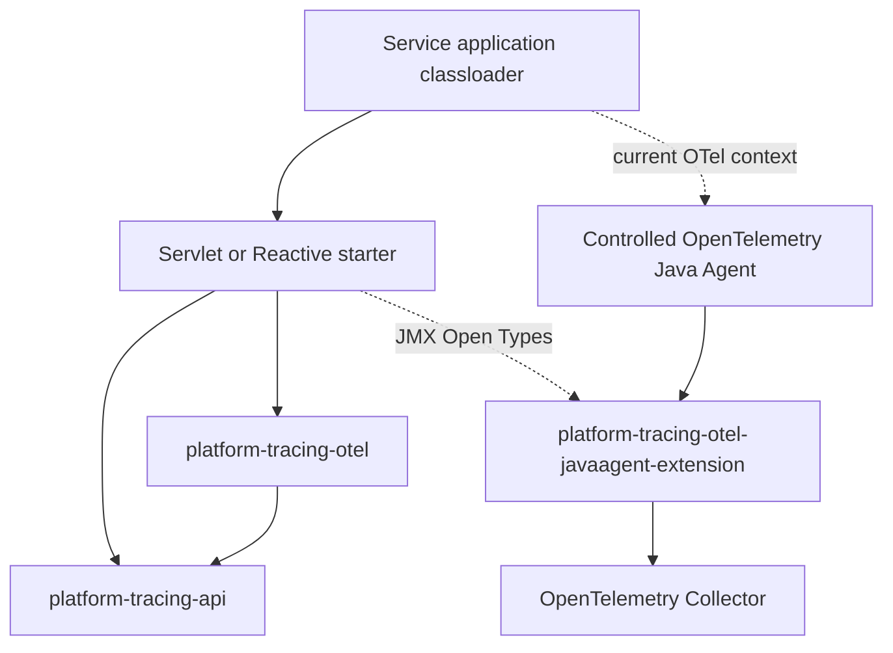

# Platform Tracing: final active architecture

> **CANONICAL ACTIVE DOCUMENT.** Architecture implementation reflects master after Slices E-M. Release hardening remains incomplete: `RG-IDENTITY-TRUST OPEN`, `RG-CONTROLLED-AGENT OPEN`, **PRODUCTION ROLLOUT FORBIDDEN**.

## Product boundary

Platform Tracing is an agent-first tracing stack for Spring Boot services. A service adds exactly one stack-specific starter. The application plane provides the OTel-free facade, adapters and diagnostics. The Controlled Agent plane owns telemetry runtime and export.



The complete module table and dependency rules are in [module taxonomy](./platform-tracing-module-taxonomy.md).

## Ownership

| Concern | Owner |
|---|---|
| Application API, Spring beans, web/Kafka adapters | Application plane |
| SDK, auto-instrumentation, sampler, processors, sanitizer, propagation hooks, protected export | Controlled Agent plane |
| Runtime policy decode/domain validation | API + `platform-tracing-otel` |
| Runtime applied state and JMX server | Agent plane |
| JMX client and Actuator diagnostics | Application plane |

Application and Agent classes may have different class identities. Their supported bridges are OTel current context and versioned JMX wire data composed of Open Types/primitives. Shared mutable statics, application DTO transfer and implementation-object injection across classloaders are prohibited.

## Runtime modes

| Mode | Required state | Result |
|---|---|---|
| `AGENT` | `platform.tracing.enabled=true` and compatible full-profile Agent state `AGENT_READY` | functional facade and Agent-owned tracing |
| `DISABLED` | `platform.tracing.enabled=false`, no Agent and no application SDK | intentional NoOp facade |

There is no production `AUTO`, `STARTER` or `EXTERNAL` mode. Enabled tracing without compatible READY Controlled Agent fails startup. See [runtime ADR](../decisions/ADR-sdk-mode-detection.md) and [Controlled Agent gate](./rg-controlled-agent-release-gate.md).

## Onboarding

Choose one dependency:

```gradle
implementation 'space.br1440.platform.tracing:platform-tracing-spring-boot-starter-servlet'
// or
implementation 'space.br1440.platform.tracing:platform-tracing-spring-boot-starter-reactive'
```

The deployment must also supply the Controlled Agent distribution and its approved startup verification. A stock Agent or arbitrary extension set is unsupported. Because `RG-CONTROLLED-AGENT` is open, this is an architecture contract, not authorization for fleet rollout.

## Identity lifecycle

| Identity | Meaning | Canonical projection |
|---|---|---|
| `traceId` | OTel/W3C distributed trace | `traceparent`, MDC `traceId` |
| `requestId` | edge-stable technical request/message chain | `X-Request-Id`, `platform.request_id`, MDC `requestId` |
| `correlationId` | business workflow across requests/traces | baggage `platform.correlation.id`, `platform.correlation_id`, MDC `correlationId` |

These identities are not aliases. MDC, headers, baggage and span attributes are projections, not storage authorities. RequestId never comes from baggage. RequestId and correlationId are high-cardinality and must not be metric dimensions.

- WebMVC binds request identity for filter execution.
- WebFlux stores identity per subscription in Reactor Context through `ReactiveCorrelationOperations`.
- Kafka producer projects approved outbound identity; consumer binds a technical requestId per listener execution.
- Retry/redelivery can retain business correlation through approved propagation but does not reuse mutable request state.
- Scheduler-specific identity adapter is not documented as implemented because master does not prove one.

Ingress business correlation is fail-closed. Untrusted baggage is removed before server/consumer span creation. Trusted transport classification remains blocked by [RG-IDENTITY-TRUST](./rg-identity-trust-release-gate.md).

## Sampling and control

Sampling is sealed internal. The platform owns the fixed chain and the OTel adapter only delegates to it. There is no public rule SPI, ServiceLoader provider, Spring override or arbitrary application rule. Rule exceptions fail closed to DROP. Runtime mutation passes through the versioned control protocol, domain validation and apply boundary.

## Public API

`platform-tracing-api` is free of OTel, Spring and Reactor. `TraceOperations` exposes read-only context, governed span creation and synchronous correlation scoping. Reactive correlation is a WebFlux contract. Internal runtime, identity binder/storage, sampling rules and Agent implementation are not public extension points.

See [public API governance](../decisions/ADR-public-api-allowlist.md) and [OTel-free facade](../decisions/ADR-api-otel-free-facade.md).

## Diagnostics and logs

`GET /actuator/tracing` reports configured mode, Agent readiness and effective OTel settings. It is diagnostic and cannot prove pre-JVM supply-chain enforcement.

Example structured log fields:

```json
{
  "traceId": "4bf92f3577b34da6a3ce929d0e0e4736",
  "spanId": "00f067aa0ba902b7",
  "traceFlags": "01",
  "requestId": "9a80c46d-0ef5-4cd5-b171-627494997123",
  "correlationId": "order-workflow-281"
}
```

Example trace queries:

```text
traceId = "4bf92f3577b34da6a3ce929d0e0e4736"
span.platform.request_id = "9a80c46d-0ef5-4cd5-b171-627494997123"
span.platform.correlation_id = "order-workflow-281"
```

Backend query syntax is deployment-specific; these examples name current fields, not a guaranteed vendor query language.

## Verification and release

Architecture gates: starter dependency smoke, module taxonomy, architecture fitness, ABI/public-surface snapshots, extension packaging checks and published-consumer fixture. Packaged Agent E2E from prior slices verifies runtime/classloader behavior.

Architecture implementation completion does not close release gates. Pilot and production remain forbidden until both release-hardening documents are satisfied and independently approved.

## Source of truth

- [ADR catalog](../decisions/README.md)
- [module taxonomy](./platform-tracing-module-taxonomy.md)
- [identity ADR](../decisions/ADR-identity-model-trace-request-correlation.md)
- [operational diagnostics](../runbook/actuator-tracing-diagnostics.md)
- [production readiness](../tracing/platform-tracing-v3-production-readiness.md)
