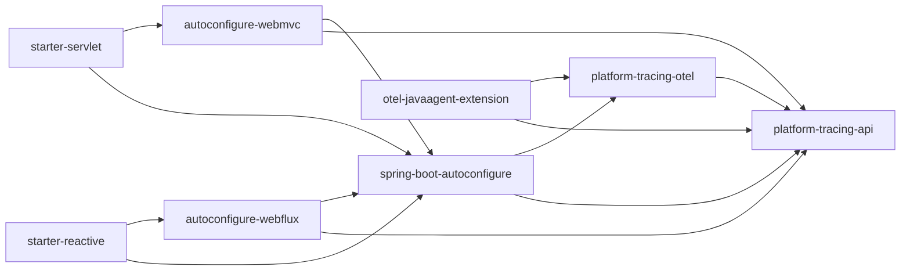

# Platform Tracing: module taxonomy and dependency guardrails

## Document status

**CANONICAL.** Состояние master после Slice J и CP-3/CP-4 Slice K. Архитектурное решение: [final architecture ADR](../decisions/ADR-platform-tracing-final-architecture.md).

## Module categories

| Category | Modules | Contract |
|---|---|---|
| Public API | `platform-tracing-api` | OTel-free application contracts |
| OTel implementation | `platform-tracing-otel` | facade/runtime/policy implementation over OTel API |
| Spring composition | `platform-tracing-spring-boot-autoconfigure` | application-plane wiring and diagnostics |
| Web adapters | `platform-tracing-autoconfigure-webmvc`, `platform-tracing-autoconfigure-webflux` | stack-specific boundaries |
| Service entry points | `platform-tracing-spring-boot-starter-servlet`, `platform-tracing-spring-boot-starter-reactive` | one starter per web stack |
| Agent plane | `platform-tracing-otel-javaagent-extension` | OTel Java Agent SPI, processors, sanitizer, control server |
| Versions/config | `platform-tracing-bom`, `platform-tracing-collector-config` | dependency alignment and collector configuration |
| Verification | `platform-tracing-test`, `platform-tracing-e2e-tests`, `platform-tracing-samples`, `platform-tracing-bench`, `platform-tracing-perf-tests`, `platform-tracing-perf-harness` | tests, examples and evidence; not production dependencies |

`platform-tracing-semconv-lint` remains a disconnected scaffold in `settings.gradle`; it is not part of the build or published product.

## Dependency model

Starters do not bring the Java Agent extension onto application compile/runtime classpath. The extension is distributed through the Controlled Agent artifact and loaded in the Agent extension classloader.

## Allowed directions

- Application code -> one starter and `platform-tracing-api` contracts exposed by it.
- Web adapters -> autoconfigure, API and approved OTel-free propagation port.
- Autoconfigure -> API and `platform-tracing-otel` for explicit composition.
- `platform-tracing-otel` -> API, OTel API and SLF4J.
- Java Agent extension -> API and `platform-tracing-otel` classes embedded in its self-contained extension artifact, plus official OTel Agent/SDK SPI.
- Verification modules -> production modules under test.

## Forbidden directions

- `platform-tracing-api` -> OTel, Spring, Reactor, implementation modules or `ServiceLoader`.
- Application/web modules -> Java Agent extension implementation.
- Web adapters -> OTel `Context`, `Span` or carrier setter APIs.
- Production modules -> e2e, samples, benchmark or perf modules.
- Cross-classloader injection/casts of platform implementation objects.
- Application extension of sealed sampling rules.

## Package taxonomy

CP-3 closed with **KEEP**: `platform-tracing-otel` retains `space.br1440.platform.tracing.core.*`. The package name is historical internal taxonomy and does not imply technology neutrality or a planned core extraction.

The Java Agent extension uses `space.br1440.platform.tracing.otel.javaagent.*`. CP-4 closed with **KEEP**: enrichment keeps its `void` contract; no `EnrichmentOutcome` type is planned or missing.

## Guardrails

- `pr0StarterDependencySmoke`: published starter graph and forbidden transitive dependencies.
- `pr1ModuleTaxonomyVerify`: module boundaries and package rules.
- `pr4ArchitectureFitnessVerify`: aggregate architecture fitness.
- `ApiModuleTaxonomyArchTest`: API purity, no static discovery, no forbidden identity infrastructure.
- `PublicSurfaceAllowlistTest` and `AbiSnapshotTest`: exact implementation surface and ABI.
- Extension packaging/SPI and controlled-distribution verification tasks.
- C3 published-consumer fixture: publication metadata and consumer classpath.

## Future changes

Module split, artifact rename, package migration or public ABI expansion requires a separate architecture decision and failing evidence that justifies the change. `otel-runtime`, `platform-tracing-policy` and mass `core.* -> otel.*` repackaging are not backlog commitments.

## Release status

Architecture refactoring is complete after Slice L, but release hardening is not:

- `RG-IDENTITY-TRUST OPEN`;
- `RG-CONTROLLED-AGENT OPEN`;
- **PRODUCTION ROLLOUT FORBIDDEN**.
