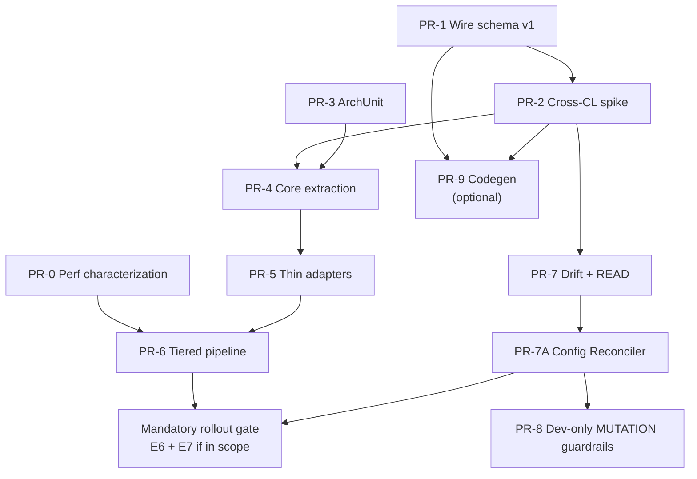

# Platform Tracing: PR Roadmap (Clean Core Hybrid)

| Поле | Значение |
|------|----------|
| Версия | 1.0 |
| Дата | 2026-06-11 |
| Статус | **Proposed** — без изменений кода до явного выбора PR |
| ADR | [ADR-platform-tracing-clean-core-hybrid](../decisions/ADR-platform-tracing-clean-core-hybrid.md) |
| Target architecture | [platform-tracing-target-architecture.md](./platform-tracing-target-architecture.md) |
| Evidence gate | [platform-tracing-evidence-before-committee.md](./platform-tracing-evidence-before-committee.md) |

---

## 1. Принципы roadmap

1. **No big bang** — каждый PR mergeable independently.
2. **Evidence before extract** — perf characterization и wire spike до mass extraction.
3. **Manual v1 contract before codegen** — schema-first (PR-9) не блокирует prod path.
4. **Behavior changes** — явно помечены; telemetry schema changes — отдельный gate.
5. **Rollback** — feature flag или revert per PR.

**Sequencing rationale:** evidence before extract; manual v1 contract before codegen; ArchUnit before core extraction; no PR-6 before PR-0 complete.

**Committee approval vs production rollout:** ADR vote не требует закрытия E1–E6. PRs помеченные «Blocks mandatory rollout» блокируют fleet rollout, не architecture approval.

---

## 2. PR overview

| PR | Phase | Title | Blocks mandatory rollout | Behavior Δ | Telemetry Δ |
|----|-------|-------|---------------|------------|-------------|
| PR-0 | Evidence | Perf characterization baseline | **Yes** | No | No |
| PR-1 | Foundation | Wire schema v1 in api | **Yes** | No | No |
| PR-2 | Foundation | Cross-CL wire spike + contract tests | **Yes** | No | No |
| PR-3 | Safety | ArchUnit fitness functions | **Yes** | No | No |
| PR-4 | Boundary | Core module bootstrap + first extraction | **Yes** | No* | No |
| PR-5 | Boundary | Thin OTel adapters refactor | **Yes** | No* | No |
| PR-6 | Performance | Tiered pipeline defaults | **Yes** (E6 gate) | **Yes** | Possible** |
| PR-7 | Observability | Drift metrics + Actuator READ split | **Yes** | Yes | No |
| PR-7A | Desired state | Config Reconciler (Config Server / Helm) | **Yes** (E7 if in scope) | Yes | No |
| PR-8 | Security | Dev-only Actuator MUTATION guardrails | **No*** | Yes | No |
| PR-9 | Docs/codegen | Schema-first codegen (should-have) | No | No | No |

\* No intentional semantic change; refactor risk requires full regression.  
\*\* Only if optional processors previously set mandatory attrs — contract tests must prove no regression.  
\*\*\* PR-8 blocks mutation/waiver enablement (E4), not normal production rollout with Actuator MUTATION disabled in prod.

---

## 3. Foundation PRs

### PR-0: Perf characterization baseline

| Field | Value |
|-------|-------|
| **Goal** | Establish evidence for M5 root cause hypothesis |
| **Scope** | JFR/async-profiler on M5 scenario; per-processor attribution; sampler hot path timings |
| **Files/packages** | `docs/tracing/perf-results/`, optional `platform-tracing-e2e-tests` perf harness, JMH existing suite |
| **Behavior change** | No |
| **Telemetry schema change** | No |
| **Config compatibility** | None |
| **Risk** | Low |
| **Required tests** | Reproducible perf report artifact E1 |
| **Rollback** | N/A (docs/evidence only) |
| **Acceptance criteria** | Report published: sampled vs unsampled path costs; top-3 CPU contributors ranked |
| **Order** | First — closes unsupported causal claims |

---

### PR-1: Wire schema v1 in platform-tracing-api

| Field | Value |
|-------|-------|
| **Goal** | Manual stable v1 control wire contract |
| **Scope** | `api/control/ControlContractVersion`, allowed keys per domain, validator interface, serialization helpers |
| **Files/packages** | `platform-tracing-api/src/main/java/.../control/` |
| **Behavior change** | No (types only) |
| **Telemetry schema change** | No |
| **Config compatibility** | Additive |
| **Risk** | Low |
| **Required tests** | Unit: valid/invalid keys, type rejection, topology field rejection |
| **Rollback** | Unused until PR-2 |
| **Acceptance criteria** | Validator rejects non-primitive values; documents CompositeData fallback if Map proves too loose |
| **Order** | May run in parallel with PR-0; must complete before PR-2 |

---

### PR-2: Cross-CL wire spike + contract tests

| Field | Value |
|-------|-------|
| **Goal** | Prove Map wire format works; document DTO failure mode |
| **Scope** | `SamplingControlClient` Map path; `PlatformTracingControl` Map accept; e2e cross-CL test |
| **Files/packages** | `autoconfigure/sampling/`, `otel-extension/jmx/`, `e2e-tests/contract/` |
| **Behavior change** | Additive (parallel to existing invoke path) |
| **Telemetry schema change** | No |
| **Config compatibility** | Additive flag `platform.tracing.control.wire.v1` |
| **Risk** | Medium |
| **Required tests** | E2 spike; round-trip; concurrent update; invalid type rejection |
| **Rollback** | Flag false → legacy path |
| **Acceptance criteria** | Evidence E2 attached; contract tests green in CI |
| **Order** | Before core extraction — stabilizes boundary |

---

## 4. Safety / test PRs

### PR-3: ArchUnit fitness functions

| Field | Value |
|-------|-------|
| **Goal** | Enforce module boundaries in CI |
| **Scope** | ArchUnit rules per [fitness-functions doc](./platform-tracing-fitness-functions.md) |
| **Files/packages** | `*-extension/src/test/.../arch/`, `autoconfigure/src/test/.../arch/`, new `core/src/test/.../arch/` |
| **Behavior change** | No |
| **Telemetry schema change** | No |
| **Risk** | Low–medium (may fail on existing violations) |
| **Required tests** | ArchUnit suite itself |
| **Rollback** | N/A |
| **Acceptance criteria** | All boundary rules green |
| **Order** | Before PR-4 — prevents core pollution during extraction |

---

## 5. Architecture boundary PRs

### PR-4: Core module bootstrap + first extraction

| Field | Value |
|-------|-------|
| **Goal** | Create `platform-tracing-core`; move sampler policy state + scrubbing rules |
| **Scope** | New Gradle module; extract `SamplerState`, policy merge, scrubbing rule engine from extension |
| **Files/packages** | `platform-tracing-core/`, `platform-tracing-otel-extension/.../sampler/`, `.../scrubbing/` |
| **Behavior change** | No intentional |
| **Telemetry schema change** | No |
| **Config compatibility** | Unchanged |
| **Risk** | **High** (largest refactor) |
| **Required tests** | Core unit tests; existing extension tests green; ArchUnit core purity |
| **Rollback** | Revert module; monolith extension |
| **Acceptance criteria** | Evidence E3; core tests run <1s; no OTel imports in core |
| **Order** | After PR-2, PR-3 |

---

### PR-5: Thin OTel adapters refactor

| Field | Value |
|-------|-------|
| **Goal** | Extension delegates to core; reduce extension to SPI + adapters + private JMX |
| **Scope** | `SamplerAdapter`, `ScrubbingProcessorAdapter`, `PlatformAutoConfigurationCustomizer` slim |
| **Files/packages** | `otel-extension/adapter/`, `PlatformSamplerFactory`, `PlatformSpanProcessorFactory` |
| **Behavior change** | No intentional |
| **Telemetry schema change** | No |
| **Risk** | Medium–high |
| **Required tests** | Extension integration tests; e2e smoke; mapping allocation spot-check |
| **Rollback** | Revert PR-5; keep PR-4 core |
| **Acceptance criteria** | Extension adapter classes documented; policy branching only in core |
| **Order** | Immediately after PR-4 |

---

## 6. Performance PRs

### PR-6: Tiered pipeline defaults

| Field | Value |
|-------|-------|
| **Goal** | Optional processors off by default in prod profile; scrubbing remains on (not disableable) |
| **Scope** | `PlatformSpanProcessorFactory`, feature flags in policy DTO, `TracingProperties` profiles |
| **Files/packages** | `otel-extension/.../processor/`, `autoconfigure/TracingProperties`, core policy flags |
| **Behavior change** | **Yes** — validation/enrichment default off in prod |
| **Telemetry schema change** | **Possible** — gated by contract tests |
| **Config compatibility** | New flags; prod profile change |
| **Risk** | **High** |
| **Required tests** | Baseline contract tests all profiles; JMH regression; **M5 macro re-run (E6)** |
| **Rollback** | `platform.tracing.pipeline.profile=full` restores prior chain |
| **Acceptance criteria** | E6 evidence; baseline mandatory attrs unchanged |
| **Order** | After PR-5; uses PR-0 attribution to validate improvement |

---

## 7. Observability / security PRs

### PR-7: Drift metrics + Actuator READ split

| Field | Value |
|-------|-------|
| **Goal** | Actuator READ exposes desired/actual/drift; separate from MUTATION; READ degraded when agent absent |
| **Scope** | `TracingActuatorEndpoint` READ split; Micrometer binder; foundation for reconciler READ API |
| **Files/packages** | `autoconfigure/actuator/`, `autoconfigure/support/` |
| **Behavior change** | Yes — observability |
| **Telemetry schema change** | No |
| **Risk** | Medium |
| **Required tests** | READ works without agent (degraded); drift metric; no prod mutation exposure |
| **Rollback** | Revert endpoint split |
| **Acceptance criteria** | Metric `platform.tracing.config.drift.detected`; READ returns desired/actual placeholders until PR-7A |
| **Order** | After PR-2 (wire path operational) |

---

### PR-7A: Desired State Config Reconciler

| Field | Value |
|-------|-------|
| **Goal** | Config Server / Helm-driven desired state → agent applied state via validated JMX |
| **Scope** | See scope list below |
| **Files/packages** | `autoconfigure/configsource/`, `TracingProperties`, `SamplingControlClient`, Actuator READ extensions |
| **Behavior change** | **Yes** — production policy path moves to reconciler |
| **Telemetry schema change** | No |
| **Config compatibility** | Config Server property binding; Helm/env classification |
| **Risk** | **High** |
| **Required tests** | E7 config reconciliation suite; FF-19–FF-22 |
| **Rollback** | Disable reconciler; fallback to bootstrap-only until redeploy |
| **Acceptance criteria** | E7 green; Config Server refresh applies policy; topology refresh rejected |
| **Order** | After PR-7; before PR-8 |

**Scope PR-7A:**

- bind tracing config from Spring Environment / Config Server;
- classify fields as topology vs policy;
- reject runtime topology changes;
- build `TracingDesiredState`;
- compare desired state vs agent actual state;
- apply runtime policy through `SamplingControlClient`;
- emit drift/apply metrics;
- expose desired/actual/source/last-applied version through Actuator READ;
- handle agent absent as degraded apply status;
- ensure all runtime apply operations go through validated JMX Map wire format.

---

### PR-8: Dev-only Actuator MUTATION guardrails

| Field | Value |
|-------|-------|
| **Goal** | Mutation endpoint disabled in prod; enabled only under dev/test/staging/debug profile |
| **Scope** | Profile guards; prod disablement; waiver hook for temporary prod enablement |
| **Files/packages** | `autoconfigure/actuator/`, security config docs, runbook update |
| **Behavior change** | Yes — prod mutation not exposed |
| **Telemetry schema change** | No |
| **Risk** | Medium |
| **Required tests** | FF-18, FF-13 (non-prod); E4 for waiver path |
| **Rollback** | Re-enable mutation via profile override (non-prod only) |
| **Acceptance criteria** | Prod profile: mutation not exposed or 404/403; dev profile: RBAC + audit; agent absent → 503 on mutation |
| **Order** | After PR-7A |

**Scope PR-8:**

- mutation endpoint disabled by default in prod;
- mutation endpoint enabled only under explicit dev/test/staging/debug profile/property;
- prod profile must not expose mutation endpoint;
- temporary prod waiver requires explicit flag, RBAC, audit, network restrictions and security approval (E4);
- READ endpoint remains available in prod;
- mutation enabled + agent absent → HTTP 503;
- mutation disabled in prod → endpoint not exposed or returns 404/403 per project convention.

---

## 8. Documentation / ADR PRs

### PR-9: Schema-first codegen (should-have)

| Field | Value |
|-------|-------|
| **Goal** | Generate metadata + contract tests from `policy-schema-v1.yaml` |
| **Scope** | Gradle codegen task; generated compatibility tests; docs fragments |
| **Files/packages** | `buildSrc/` or `platform-tracing-schema/`, `docs/tracing/` |
| **Behavior change** | No |
| **Telemetry schema change** | No |
| **Risk** | Medium (build complexity) |
| **Required tests** | Generated tests match manual v1; no second source of truth drift |
| **Rollback** | Disable codegen; manual maintenance |
| **Acceptance criteria** | Single schema → generated artifacts; CI drift check |
| **Order** | **Last** — after manual v1 stable in production path |

---

## 9. PR dependency graph

---

## 10. Parallelization opportunities

| Parallel track A | Parallel track B |
|----------------|------------------|
| PR-0 perf characterization | PR-1 wire schema |
| PR-3 ArchUnit (after PR-1) | PR-7 READ (after PR-2) |
| PR-9 codegen spike (non-blocking) | PR-7A reconciler (after PR-7) |

**Do not parallelize:** PR-4/PR-5 (sequential); PR-6 before PR-0 complete.

---

## 11. Committee gates

| Gate | Required PRs | Evidence | Blocks ADR vote? |
|------|--------------|----------|-------------------|
| **ADR approval (target architecture)** | ADR + roadmap agreed | E1–E3 planned | **No** |
| Pre-prod integration | PR-4, PR-5, PR-7, PR-7A | E3 green; E7 planned if in scope | No |
| Perf gate (mandatory rollout) | PR-6 + PR-0 | **E6 PASS** (or waiver) | No |
| **Mandatory fleet rollout** | PR-0..PR-7A (+ PR-6, PR-8 if mutation scope) | E1–E6; **E7 if Config Server in scope** | N/A (post-ADR) |
| Dev/debug mutation enablement | PR-8 | **E4** | No |
| Temporary prod mutation waiver | PR-8 + waiver flag | **E4** + FF-23 | No |

---

## 12. Rollback strategy summary

| PR | Rollback mechanism |
|----|-------------------|
| PR-2 | `platform.tracing.control.wire.v1=false` |
| PR-4/PR-5 | Git revert (major) |
| PR-6 | `platform.tracing.pipeline.profile=full` |
| PR-7/PR-7A | Disable reconciler; READ-only mode |
| PR-8 | Mutation remains disabled in prod (default) |
| PR-9 | Disable codegen task |
| Any | Pin previous `agentExtensionJar` version |

---

## 13. Deferred items (not in this roadmap)

| Item | Reason |
|------|--------|
| External control plane (V6) | Future track; infra not ready |
| Collector-first tail policy default | After M5 pass |
| Multi-extension modular (V10) | Rejected |
| Alibaba/ARMS matrix (PR-B) | Separate architect meeting |
| Pure Spring starter (V3) | Rejected |

---

*Roadmap aligned with ADR Clean Core Hybrid. No production code changed in this document.*
