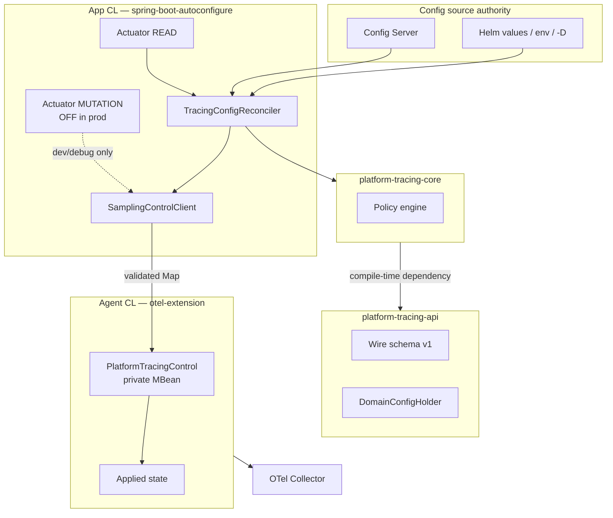
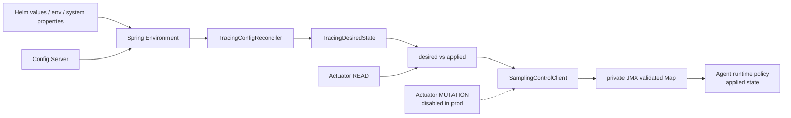
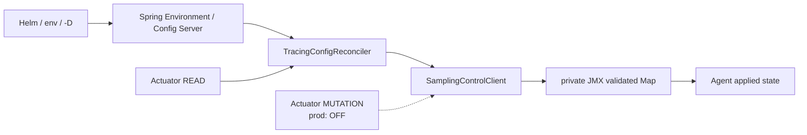
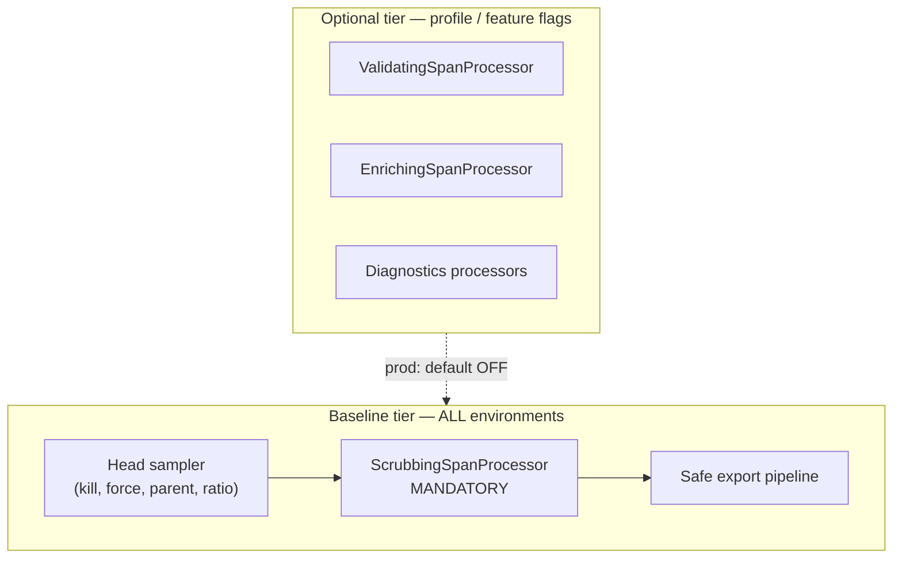

# Platform Tracing: целевая архитектура (Clean Core Hybrid)

| Поле | Значение |
|------|----------|
| Версия | 1.0 |
| Дата | 2026-06-11 |
| Статус | **Committee-ready target** (pre-production) |
| ADR | [ADR-platform-tracing-clean-core-hybrid](../decisions/ADR-platform-tracing-clean-core-hybrid.md) |
| PR roadmap | [platform-tracing-pr-roadmap.md](./platform-tracing-pr-roadmap.md) |
| Evidence gate | [platform-tracing-evidence-before-committee.md](./platform-tracing-evidence-before-committee.md) (evidence gates E1–E7) |
| Fitness functions | [platform-tracing-fitness-functions.md](./platform-tracing-fitness-functions.md) |
| Prior analysis | [platform-tracing-architecture-options.md](./platform-tracing-architecture-options.md) (12 variants — historical) |

---

## 1. Назначение документа

Этот документ фиксирует **целевую production-bound архитектуру** Platform Tracing. Документ **не** является новым architecture review и **не** вводит новых архитектурных вариантов.

**Целевой вывод:** Clean Core Hybrid Architecture (CCH) — pre-production target.

**Committee approval vs production rollout:** комитет может утвердить ADR как **целевую архитектуру** до полного закрытия production evidence. Mandatory rollout остаётся заблокированным до E1–E6 и **E7 (если Config Server / Helm desired-state в scope)**, или явного waiver.

**Target stack:** Clean Core Hybrid + Desired State Configuration Layer + Production Read-only Actuator + Dev-only Actuator Mutation.

---

## 2. Executive summary

| Решение | Формулировка |
|---------|--------------|
| Structural model | Pure Policy Core + Thin OTel Adapter + Thin Spring Adapter + **TracingConfigReconciler** |
| Config authority | Helm/env — startup topology + bootstrap; Config Server — runtime **desired policy**; agent — **applied state** |
| Control transport | JMX — private validated Map; production policy via reconciler, not Actuator MUTATION |
| Actuator | **READ** — prod diagnostics/drift; **MUTATION** — dev/test/staging/debug only (disabled in prod) |
| Wire format | Schema-validated `Map<String, Object>` (primitive/open types only); raw DTO запрещён |
| Pipeline | Performance-tiered: baseline (sampling + **mandatory scrubbing** + export); optional (validation, enrichment, diagnostics) |
| Schema governance | Manual v1 contract first; schema-first codegen — should-have |
| Perf gate | M5 FAIL — symptom; root cause — hypothesis pending profiling evidence |

---

## 3. Архитектурная диаграмма



---

## 3.1. Control-plane flow (production)



---

## 4. Модульная модель

### 4.1. Обязательные модули (до production)

| Module | CL | Классов (target) | Ответственность |
|--------|-----|------------------|-----------------|
| `platform-tracing-api` | Shared | ~70 (existing) | Public contracts, wire schema, semconv |
| `platform-tracing-core` | Shared | TBD (extract) | Pure policy engine |
| `platform-tracing-otel-extension` | Agent | **Thin target: adapters + JMX** | OTel SPI glue |
| `platform-tracing-spring-boot-autoconfigure` | App | ~46 → thinner | Spring wiring, Actuator |
| `platform-tracing-e2e-tests` | Test | — | Cross-CL, smoke, contract |

### 4.3. Allowed / forbidden dependencies

```text
platform-tracing-api          → JDK only
platform-tracing-core         → platform-tracing-api + JDK
platform-tracing-otel-extension → core + api + OTel SPI/SDK (compileOnly)
platform-tracing-spring-boot-autoconfigure → core + api + Spring Boot
platform-tracing-e2e-tests    → all modules (test)

Forbidden:
  api → core | OTel | Spring
  core → OTel | Spring | extension | autoconfigure
  autoconfigure → extension (main)
  extension → Spring
```

### 4.4. Classloader note для core

`platform-tracing-core` может загружаться в Agent CL и App CL как один bytecode, но **разные Class objects**. Core не должен полагаться на cross-CL object identity, mutable static shared state или прямую передачу объектов через границу CL. Межмодульная связь app↔agent — только через validated JMX Map wire format.

---

### 4.5. Не создавать до появления pain

| Proposed module | Verdict | Alternative |
|-----------------|---------|-------------|
| `platform-tracing-control-api` | Overengineering | `api.control.*` package |
| `platform-tracing-semconv` | Overengineering | `api.semconv.*` package |
| `platform-tracing-otel-adapter` | Overengineering | thin `otel-extension` |
| `platform-tracing-testkit` | Defer | test fixtures in e2e module |

---

## 5. Package boundaries

```
platform-tracing-api/
  api/                          — TraceOperations facade interfaces
  api/attributes/               — PlatformSamplingReasons, etc.
  api/config/                   — DomainConfigHolder, Versioned
  api/control/                  — Wire schema, ControlContractVersion, allowed keys
  api/propagation/              — PlatformHeaders, trace control
  api/semconv/                  — CategoryContracts, SemconvKeys

platform-tracing-core/
  core/policy/                  — SamplerState, policy merge, validators
  core/scrubbing/               — RuleEngine, RuleSet, CircuitBreaker logic
  core/validation/              — CategoryValidator, ValidationMode rules
  core/enrichment/              — EnrichmentSpec (data only, no OTel types)

platform-tracing-otel-extension/
  otel/extension/spi/           — PlatformAutoConfigurationCustomizer (orchestration)
  otel/extension/adapter/       — SamplerAdapter, ProcessorAdapter, ResourceAdapter
  otel/extension/jmx/internal/  — PlatformTracingControl (private)

platform-tracing-spring-boot-autoconfigure/
  autoconfigure/                — TracingProperties, auto-config classes
  autoconfigure/configsource/     — TracingDesiredState, TracingConfigReconciler, drift/apply result types
  autoconfigure/sampling/       — SamplingControlClient, wire mapper
  autoconfigure/actuator/       — READ (prod); MUTATION (dev-only, prod disabled)
  autoconfigure/support/        — SdkModeResolver, legacy drift helpers → reconciler metrics
```

### 5.1. TracingConfigReconciler (target)

**Module:** `platform-tracing-spring-boot-autoconfigure`

| Class (target) | Role |
|----------------|------|
| `TracingDesiredState` | Immutable snapshot of desired runtime policy from config sources |
| `TracingConfigSourceType` | `CONFIG_SERVER`, `HELM`, `ENV`, `ACTUATOR_DEBUG`, `EMERGENCY_WAIVER` |
| `TracingConfigReconciler` | Build desired state → validate → compare → apply via JMX client |
| `TracingConfigApplyResult` | Outcome, source, version, timestamp |
| `TracingConfigDriftStatus` | desired vs applied diff for Actuator READ |

**Flow:**

```text
Spring Environment / Config Server / Helm defaults
  → TracingDesiredState
  → validate policy/topology boundary
  → validate wire schema
  → compare desired vs agent actual (applied state)
  → apply runtime policy via SamplingControlClient
  → emit drift/apply metrics
```

---

## 6. Mapping текущих классов → target layers

| Current class (as-is) | Target layer | Notes |
|----------------------|--------------|-------|
| `CompositeSampler`, `SamplerStateHolder` | core/policy + extension/adapter | Policy in core; OTel `Sampler` impl in adapter |
| `ScrubbingSpanProcessor` | core/scrubbing + extension/adapter | Rules in core; OTel processor wrapper thin |
| `ValidatingSpanProcessor` | core/validation + extension/adapter | Optional tier |
| `EnrichingSpanProcessor` | core/enrichment + extension/adapter | Optional tier |
| `PlatformCompositeSpanProcessor` | extension/adapter | Wiring only |
| `PlatformDropOldestExportSpanProcessor`, `SafeSpanExporter` | extension (topology) | Startup-only chain |
| `PlatformTracingControl`, `PlatformTracingControlMBean` | extension/jmx/internal | Private |
| `SamplingControlClient` | autoconfigure/sampling | Wire Map serializer |
| `TracingActuatorEndpoint` | autoconfigure/actuator | Split READ / MUTATION |
| `TracingProperties` | autoconfigure | Maps to core policy, not extension |
| `DualChannelDriftDiagnostics` | autoconfigure/support → reconciler | Superseded by reconciler drift metrics |
| `TracingConfigReconciler` | autoconfigure/configsource | **New** — desired state apply |
| `DomainConfigHolder` | api/config | Unchanged contract |
| `CategoryContracts`, semconv | api/semconv | Constants; rules in core |

---

## 7. Control plane — детальная модель

> In production, Actuator is an observability and diagnostics surface, not a mutation control plane. Runtime policy mutation in production is driven by Config Server / release-managed desired state and applied through the validated private JMX bridge.

### 7.1. Authority model

| Concern | Config source authority |
|---------|------------------------|
| **Startup topology** | Helm release values / env / system properties |
| **Runtime policy (production)** | Config Server **desired state** |
| **Applied state** | Agent runtime — **not source of truth** |
| **Actuator READ** | Production diagnostics (desired, actual, drift, apply status) |
| **Actuator MUTATION** | Dev/test/staging/debug only — **disabled in prod** |
| **Private JMX transport** | `SamplingControlClient` / reconciler only |

### 7.2. Control-plane diagram



### 7.3. Actuator endpoint classes

| Class | Production | HTTP | Purpose |
|-------|------------|------|---------|
| **READ** | **Enabled** | GET | Desired state, applied state, drift, apply status, agent mode |
| **MUTATION** | **Disabled by default** | POST/PUT | Dev/debug policy change only; not exposed or 404/403 in prod |
| **Degraded read** | Enabled | GET | Agent absent → degraded status on READ, not 503 |

| Class | Non-prod (mutation enabled) | Notes |
|-------|----------------------------|-------|
| **MUTATION** | RBAC + audit + rate limit | Agent absent → HTTP 503 on mutation only |
| **Emergency prod waiver** | E4 + explicit flag + FF-23 | Temporary only; must not fight Config Server desired state |

### 7.4. JMX wire contract (v1 manual)

**Payload shape:**

```text
Map<String, Object> {
  "contractVersion": 1L,
  "policyVersion":   <long>,
  "domain":          "sampling" | "scrubbing" | "validation",
  ... flat primitive fields per domain schema ...
}
```

**Validation rules:**

- Reject unknown keys (strict mode) or ignore with metric (documented choice in PR-1).
- Reject non-primitive/open-type values.
- Reject topology fields (`exporter.endpoint`, `bsp.queue.size`, etc.).
- Invalid payload → LKG + `platform.tracing.config.reload.failure` counter.

**Raw Java DTO через JMX — запрещён** (class identity risk, spike ADR).

**Map wire format** допустим **только** при ограничении validated JDK/open types. CompositeData остаётся documented fallback, если Map окажется слишком loose (spike E2).

---

## 8. Performance-tiered pipeline

### 8.1. M5 — корректная формулировка

> **M5 FAIL is a performance symptom. Leading hypothesis: mixed architecture and implementation overhead. Root cause requires local profiling evidence.**

Leading hypothesis включает (не доказано отдельно):

- processor chain cost on unsampled or pre-export paths;
- sampler chain branch cost;
- scrubbing regex / allocation;
- export queue pressure;
- agent instrumentation baseline.

### 8.2. Pipeline tiers



| Processor | Prod default | Dev/staging default | Contract impact |
|-----------|-------------|---------------------|-----------------|
| Scrubbing | **ON** | **ON** | PII — non-negotiable |
| Validation | OFF | ON | Must not remove mandatory attrs from baseline contract |
| Enrichment | OFF | ON | Optional attrs only |
| Diagnostics | OFF | ON | Non-export or debug attrs |

**Heavy processors default-off** — local engineering policy; requires JMH + contract tests; **not** OTel official recommendation.

### 8.3. Hot path targets

| Path | Target |
|------|--------|
| `shouldSample()` | Lock-free; ~4 checks on default path; no allocation |
| `onEnd()` baseline | Scrubbing only for exported span path; adapter must minimize OTel↔core mapping allocations |
| Feature flags | Compiled/boolean flags; no string map lookup on hot path |

---

## 9. PII / scrubbing

| Rule | Detail |
|------|--------|
| Tier | **Baseline — mandatory** |
| Location | Rules in `core/scrubbing`; OTel wrapper in extension adapter |
| Collector | Second line per ADR; does not replace JVM scrubbing |
| Fail mode | Fail-closed: drop span + metric on scrubbing timeout/circuit open |
| Disable | Scrubbing **нельзя** отключить через policy toggle; только изменение rules |
| Tests | Core unit (no agent); forbidden attribute contract; ReDoS negative |

---

## 10. Semantic conventions

| Concern | Owner |
|---------|-------|
| Key constants | `api/semconv` |
| Validation rules | `core/validation` |
| OTel attribute application | extension adapter |
| Application typed builders | `api/span/builder` |
| Baseline mandatory attrs | Contract tests — same across all profiles |

---

## 11. Schema governance

| Phase | When | Blocker? |
|-------|------|----------|
| Manual wire schema v1 in api | PR-1 | **Yes** |
| Contract tests generated manually | PR-2–PR-4 | **Yes** |
| `policy-schema-v1.yaml` codegen | PR-9 | **No** (should-have) |

Schema-first **не блокирует** production rollout. Блокирует только stabilized manual v1 + tests.

---

## 12. Collector boundary (future track)

Per ADR `collector-boundary` and Sonar fact-check:

- Tail sampling — official Collector capability; requires memory/buffering.
- Does **not** replace JVM-side PII scrubbing.
- Partial tail policy offload — **after** M5 Java baseline passes; not immediate replacement.

---

## 13. Invariants (acceptance checklist)

- [ ] extension has no Spring dependency
- [ ] autoconfigure does not import extension implementation (main)
- [ ] core has no OTel/Spring types (ArchUnit)
- [ ] runtime policy mutable via CAS/LKG
- [ ] runtime topology startup/redeploy-only
- [ ] hot path policy read lock-free
- [ ] invalid policy update → LKG
- [ ] scrubbing always on in baseline tier
- [ ] JMX wire — validated Map only; no raw DTO
- [ ] Actuator MUTATION disabled in prod by default
- [ ] Config Server desired state documented as production policy authority
- [ ] TracingConfigReconciler in target packages
- [ ] Agent applied state not source of truth
- [ ] telemetry baseline contract identical across profiles
- [ ] production rollback via flags + agent JAR pin

---

## 14. Связь с prior documents

| Document | Relationship |
|----------|--------------|
| `platform-tracing-architecture-options.md` | Historical 12-variant analysis; V12 superseded as target |
| `ADR-platform-tracing-target-architecture.md` | Superseded by Clean Core Hybrid ADR |
| Review passes (Perplexity, Sonar, GPT, Gemini) | Supporting review materials; corrections applied |

---

## 15. Committee presentation checklist

**ADR vote (target architecture):**

1. ADR Clean Core Hybrid — Proposed → ready for vote.
2. M5 wording — symptom/hypothesis, not proven root cause.
3. Scrubbing — explicitly in baseline tier (not disableable).
4. Schema-first — should-have, not blocker.
5. Actuator READ in prod; MUTATION dev-only (disabled in prod).
6. Config Server desired state + PR-7A reconciler in roadmap.
7. PR roadmap — agreed sequencing.
8. Evidence E1–E3 planned (не блокирует ADR vote).

**Mandatory rollout vote (отдельный gate):**

- E1, E2, E3, E5 delivered; E6 PASS (или waiver); **E7 if Config Server in scope**; E4 — только при mutation/waiver enablement.

---

*Production code не изменён. Документ — committee-ready target specification.*
