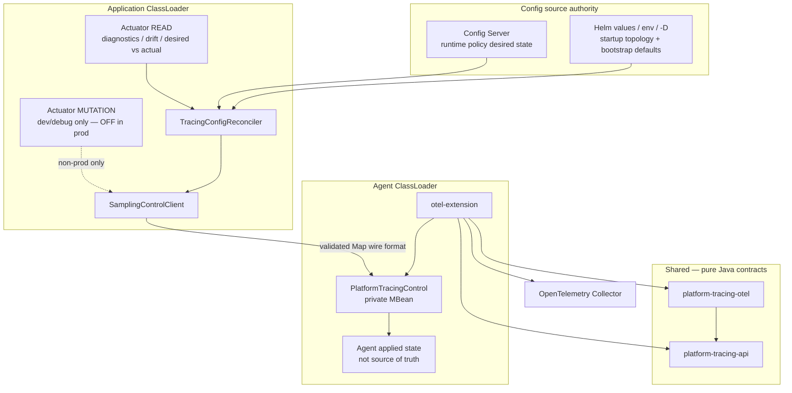

# ADR: Platform Tracing Clean Core Hybrid Architecture

> **SUPERSEDED / HISTORICAL.** Предложенный split не является текущей архитектурой. Каноническое решение: [ADR-platform-tracing-final-architecture](./ADR-platform-tracing-final-architecture.md). Original analysis ниже сохранён без ретроактивного переписывания.

| Поле | Значение |
|------|----------|
| Статус | **Proposed** |
| Дата | 2026-06-11 |
| Контекст | Pre-production; mandatory rollout не начат |
| Заменяет / дополняет | [ADR-platform-tracing-target-architecture](./ADR-platform-tracing-target-architecture.md) (Conservative Hardening — superseded as target) |
| Связанные ADR | [ADR-runtime-config-policy-vs-topology](./ADR-runtime-config-policy-vs-topology.md), [ADR-otel-direct-integration](./ADR-otel-direct-integration.md), [ADR-collector-boundary](./ADR-collector-boundary.md), [ADR-classloader-visibility-spike-finding](./ADR-classloader-visibility-spike-finding.md), [ADR-dual-channel-properties-v0.1](./ADR-dual-channel-properties-v0.1.md) |
| Сопутствующие документы | [platform-tracing-target-architecture.md](../architecture/platform-tracing-target-architecture.md), [platform-tracing-pr-roadmap.md](../architecture/platform-tracing-pr-roadmap.md), [platform-tracing-evidence-before-committee.md](../architecture/platform-tracing-evidence-before-committee.md) (Evidence Gates E1–E7), [platform-tracing-fitness-functions.md](../architecture/platform-tracing-fitness-functions.md) |
| Supporting review materials | Perplexity Pass 5, Sonar Fact Check, GPT-5.4 Adversarial Check, Gemini Final Recommendation |

> **Уточнено 2026-07-16:** `SemconvKeys` перенесён из public contracts в OTel-backed core согласно
> [ADR-api-span-package-boundary](./ADR-api-span-package-boundary.md).

---

## Status

**Proposed** — решение для утверждения архитектурным комитетом. Production code не изменён.

**Committee approval vs production rollout:** комитет может утвердить ADR как **целевую архитектуру** до полного закрытия production evidence. Mandatory rollout остаётся заблокированным до выполнения evidence gates E1–E6, **E7 (если Config Server / Helm desired-state в scope rollout)**, или явного waiver со стороны комитета. См. [Evidence gates](../architecture/platform-tracing-evidence-before-committee.md).

---

## Context

Platform Tracing — agent-first Java tracing platform для крупной коммерческой компании:

- OpenTelemetry Java Agent + `platform-tracing-otel-javaagent-extension` (Agent ClassLoader);
- `platform-tracing-spring-boot-autoconfigure` (Application ClassLoader);
- связь между CL — in-process JMX (`PlatformTracingControl` / `SamplingControlClient`);
- shared contracts — `platform-tracing-api` (`DomainConfigHolder`, semconv, propagation).

**Подтверждённые факты (код + perf evidence):**

| Факт | Источник |
|------|----------|
| Extension ~99 классов, без Spring; autoconfigure ~46 классов | module architecture doc |
| M5 macro FAIL: +48.1% CPU, +25.4% RSS vs бюджет 3%/10% | `architecture-committee-review.md` |
| Degraded modes (M6, M8): no OOM, p99 delta < 1 ms | perf evidence |
| Policy runtime-mutable; topology startup-only | ADR `runtime-config-policy-vs-topology` |
| OTel Java Agent extensions через `otel.javaagent.extensions` | official OTel docs (Sonar fact-check: Confirmed) |
| Cross-CL Java DTO через JMX — class identity risk | ADR `classloader-visibility-spike-finding` |

**Pre-production условие:** backward compatibility с production consumers отсутствует; допустим structural refactor при сохранении agent-first invariants.

---

## Problem

1. **Boundary blur:** `platform-tracing-otel-javaagent-extension` совмещает OTel SPI wiring, policy logic, scrubbing, validation, JMX control plane и resource enrichment — пять concerns в одном Agent CL модуле.
2. **Control plane contract:** JMX bridge не формализован как versioned wire contract; dual-channel drift (`TracingProperties` vs agent runtime) — operational risk.
3. **Performance symptom:** M5 FAIL блокирует mandatory rollout. Root cause **не доказан** — требуется локальное profiling evidence.
4. **Classloader portability:** передача application-specific Java DTO между App CL и Agent CL через `MBeanServer.invoke()` несёт class identity risk (подтверждено spike ADR и Oracle JMX docs).
5. **Security surface:** Actuator MUTATION как production control plane без explicit security design и без Config Server desired-state model — неприемлемо для production.
6. **Config source ambiguity:** отсутствует явная authority model для Helm/env, Config Server, Actuator READ/MUTATION и agent **applied state**.

---

## Decision

Принять **Clean Core Hybrid Architecture (CCH)** как pre-production target:

| Слой | Модуль | Роль |
|------|--------|------|
| Public contracts | `platform-tracing-api` | Semconv, propagation headers, wire schema types, `DomainConfigHolder` |
| Pure policy core | `platform-tracing-otel` | Узкий pure-Java policy engine: sampling state, scrubbing rules, validation rules, immutable snapshots |
| OTel adapter | `platform-tracing-otel-javaagent-extension` | Thin OTel SPI adapters → delegate to core |
| Spring adapter | `platform-tracing-spring-boot-autoconfigure` | Thin Spring wiring; `TracingConfigReconciler`; Actuator READ (prod diagnostics); dev-only Actuator MUTATION |
| Tests | `platform-tracing-e2e-tests` | Cross-CL contract, smoke, perf gates, config reconciliation |

**Ключевые архитектурные правила:**

1. JMX — **private in-process adapter**, не public control plane.
2. **Production:** Actuator — **observability/diagnostics surface (READ)**; Actuator MUTATION **disabled by default**, не является production control plane.
3. **Runtime policy authority (production):** Config Server **desired state** → `TracingConfigReconciler` → validated private JMX Map → agent **applied state**.
4. **Startup topology authority:** Helm release values / env / system properties; startup-only; runtime topology changes rejected.
5. Wire format через JMX — **strictly schema-validated `Map<String, Object>`** с primitive/open types only; raw Java DTO **запрещён**.
6. Agent runtime state — **applied state**, not source of truth.
7. Baseline pipeline — **mandatory scrubbing** (PII protection) + minimal sampling + export.
8. Validation / enrichment / diagnostics — **optional or profile-based** processors (local engineering policy; не OTel best practice).
9. Schema-first codegen — **should-have** после стабилизации manual v1 contract; **не production blocker**.
10. Actuator MUTATION — **dev/test/staging/local-debug only**; temporary production enablement только через explicit waiver, RBAC, audit, network restrictions и security approval (E4).

---

## Decision Drivers

| Driver | Вес | Как CCH адресует |
|--------|-----|------------------|
| Classloader correctness | Hard constraint | Core без OTel/Spring; JMX open-type wire format |
| Production safety | Critical | LKG on invalid policy; scrubbing fail-closed |
| Performance overhead | Critical (blocking gate) | Tiered pipeline + perf evidence program |
| Boundary clarity | High | Single responsibility per module |
| Testability | High | Core unit tests без agent/Spring |
| OTel compatibility | High | Thin adapter on public SPI only |
| Operational simplicity | Medium | Config Server desired state; Actuator READ in prod; dev-only mutation |
| Telemetry contract stability | Medium | Baseline contract tests across profiles |
| Security / PII | High | Mandatory scrubbing; mutation disabled in prod by default |

---

## Architecture Overview



**One-liner для комитета:** Clean Core Hybrid + Desired State Configuration Layer: Config Server — runtime policy authority; Helm/env — startup topology; Actuator READ — prod diagnostics; Actuator MUTATION — dev-only; JMX — private transport; agent — applied state.

---

## Module Structure

| Module | ClassLoader | Обязателен до prod | Назначение |
|--------|-------------|-------------------|------------|
| `platform-tracing-api` | Both (shared jar) | **Да** | Public API, semconv constants, wire schema contract |
| `platform-tracing-otel` | Both | **Да** | Pure-Java policy engine |
| `platform-tracing-otel-javaagent-extension` | Agent | **Да** | OTel SPI thin adapters |
| `platform-tracing-spring-boot-autoconfigure` | App | **Да** (Spring services) | Spring DI, Actuator, JMX client |
| `platform-tracing-e2e-tests` | Test | **Да** (CI gate) | Smoke, contract, cross-CL |
| Отдельные `control-api`, `semconv`, `testkit` modules | — | **Нет** (overengineering на текущем этапе) | Packages внутри api/core достаточно |

---

## Responsibility Boundaries

### `platform-tracing-api`

- **Живёт:** semconv keys (`SemconvKeys`, `PlatformAttributes`), propagation contracts, `DomainConfigHolder`, wire schema constants (`ControlContractVersion`, allowed key sets).
- **Не живёт:** OTel `Span`/`Attributes`, Spring types, business rule execution, MBean implementation.

### `platform-tracing-otel`

- **Живёт:** `SamplerState` immutable snapshots, policy merge/validate, scrubbing rule compilation and matching logic, semconv validation rules, circuit breaker state for scrubbing.
- **Не живёт:** OTel SPI, Spring, HTTP, JMX, export topology, `SpanProcessor` wiring.
- **Scope freeze:** core — **policy engine**, не generic framework. Запрещены SPI, transport, plugin systems.
- **Classloader note:** `platform-tracing-otel` может загружаться в Agent CL и App CL как один и тот же bytecode, но **разные Class objects**. Core не должен полагаться на cross-CL object identity, mutable static shared state или прямую передачу объектов через границу CL.

### `platform-tracing-otel-javaagent-extension`

- **Живёт:** `PlatformAutoConfigurationCustomizer`, OTel `Sampler`/`SpanProcessor`/`Resource` adapters that translate OTel callbacks → core calls → OTel objects.
- **Не живёт:** policy branching duplicated outside core, Spring imports, public MBean documentation.

### `platform-tracing-spring-boot-autoconfigure`

- **Живёт:** `TracingProperties` binding, `TracingConfigReconciler`, `SamplingControlClient`, Actuator READ endpoints, dev-only Actuator MUTATION (profile-guarded), drift/apply metrics, Micrometer binders.
- **Не живёт:** OTel SDK creation, extension class imports (main sources), production mutation control plane.

---

## Allowed Dependencies

```
platform-tracing-api          → JDK only
platform-tracing-otel         → platform-tracing-api + JDK
platform-tracing-otel-javaagent-extension → core + api + OTel SPI/SDK (compileOnly)
platform-tracing-spring-boot-autoconfigure → core + api + Spring Boot
platform-tracing-e2e-tests    → all above (test)
```

- `spring-boot-autoconfigure` → `otel-extension`: **testImplementation only**
- `otel-extension` → Spring: **forbidden**
- `autoconfigure` → `otel-extension` main: **forbidden**

---

## Forbidden Dependencies

| Rule | Enforcement |
|------|-------------|
| `core` ↛ `io.opentelemetry.*` | ArchUnit |
| `core` ↛ `org.springframework.*` | ArchUnit |
| `api` ↛ OTel / Spring | ArchUnit |
| `extension` ↛ Spring | ArchUnit (existing) |
| `autoconfigure` ↛ extension impl (main) | ArchUnit |
| Raw Java DTO across JMX boundary | Code review + contract tests |
| Runtime topology mutation API | ADR policy/topology |
| Arbitrary nested objects in JMX Map payload | Schema validator reject |

---

## Control Plane Model

> In production, Actuator is an observability and diagnostics surface, not a mutation control plane. Runtime policy mutation in production is driven by Config Server / release-managed desired state and applied through the validated private JMX bridge.

### Authority model

| Concern | Config source authority | Mechanism |
|---------|------------------------|-----------|
| **Startup topology** | Helm release values / env / system properties | Agent startup; rolling update; runtime topology mutation **rejected** |
| **Runtime policy (production)** | Config Server **desired state** | `TracingConfigReconciler` → validated Map → private JMX |
| **Bootstrap policy defaults** | Helm/env (non-authoritative at runtime) | Initial desired state until Config Server refresh |
| **Applied state** | Agent runtime (Agent CL) | **Not source of truth** — reconciled against desired state |
| **Actuator READ** | N/A (read-only) | Production diagnostics: desired vs actual, drift, apply status |
| **Actuator MUTATION** | Dev/debug only | **Disabled in production by default**; not production control plane |
| **Private JMX transport** | Internal only | `SamplingControlClient` → validated Map wire format |

### Production policy apply flow

1. Config Server refresh (or Helm bootstrap on startup) → Spring Environment.
2. `TracingConfigReconciler` builds `TracingDesiredState` from config sources.
3. Classify fields: **runtime policy** vs **startup topology**; reject topology at runtime.
4. Validate wire schema; compare **desired state** vs **applied state** (agent actual via READ path / JMX read).
5. If delta and agent available → `SamplingControlClient` → private JMX validated Map → agent `tryUpdate()` → LKG on failure.
6. Emit metrics: `platform.tracing.config.drift.detected`, apply success/failure, source tag (`config-server`, `helm`, `actuator-debug`).
7. Agent absent → desired state preserved; apply status **degraded**; Actuator READ reports drift; mutation path (if enabled in non-prod) → HTTP 503.

### Dev/debug mutation flow (non-production only)

1. Profile `dev` / `test` / `staging` / explicit debug property enables Actuator MUTATION.
2. Authorized request → same validated Map path via `SamplingControlClient` (never raw DTO).
3. RBAC, audit log, rate limiting, network restrictions — mandatory (E4 when mutation exposed).
4. Emergency production override — only via explicit waiver flag + E4 + FF-23; must not silently fight Config Server desired state.

### Surfaces summary

| Surface | Production default | Operations |
|---------|-------------------|------------|
| Actuator READ | **Enabled** (diagnostics) | GET desired/actual/drift/apply status/agent availability |
| Actuator MUTATION | **Disabled** | Not exposed or 404/403 per project convention |
| JMX MBean | Internal | Map wire invoke — `SamplingControlClient` / reconciler only |
| Config Server | **Desired state authority** | Runtime policy refresh |
| Helm / env / `-D` | **Topology + bootstrap** | Startup-only |

---

## Configuration Sources and Desired State Model

### Source precedence (FF-19)

| Priority | Source | Scope |
|----------|--------|-------|
| 1 (highest, exceptional) | Temporary emergency override with TTL | Production waiver only; audit + RBAC + network restrictions |
| 2 | Config Server runtime policy **desired state** | Normal production path |
| 3 | Helm / env bootstrap defaults | Initial desired state; not runtime topology authority |
| — | Agent **applied state** | Never source of truth |

### Helm release values / env / system properties

- **Authority:** startup **topology** + bootstrap defaults for tracing parameters available at agent/app startup.
- **Not authority for:** runtime mutable policy in production (Config Server owns desired policy).
- **Not authority for:** runtime topology changes (rejected; requires rolling update / redeploy).

### Config Server

- **Authority:** runtime **desired policy** source of truth in production.
- Refresh updates `TracingDesiredState` in Spring side; reconciler applies to agent via private JMX.
- Topology fields in Config Server refresh → **rejected** (FF-20); agent applied topology unchanged.

### TracingConfigReconciler (target component)

**Module:** `platform-tracing-spring-boot-autoconfigure`

**Packages (target):**

- `autoconfigure/configsource/TracingDesiredState`
- `autoconfigure/configsource/TracingConfigSourceType`
- `autoconfigure/configsource/TracingConfigReconciler`
- `autoconfigure/configsource/TracingConfigApplyResult`
- `autoconfigure/configsource/TracingConfigDriftStatus`

**Responsibilities:**

```text
Spring Environment / Config Server / Helm defaults
  → TracingDesiredState
  → validate policy vs topology boundary
  → validate wire schema
  → compare desired vs applied (agent actual)
  → apply runtime policy via SamplingControlClient (validated Map)
  → emit drift/apply metrics
```

---

## JMX Role

JMX — **private in-process adapter** между Application CL и Agent CL.

**Обоснование (Sonar fact-check):**

- MXBean/OpenMBean designed for portable management interfaces — **Confirmed** (Oracle JMX docs).
- Raw application DTO across CL boundaries — **risk confirmed** (`ADR-classloader-visibility-spike-finding`).
- `Map<String, Object>` — **acceptable only** when restricted to validated JDK/open types.

**Wire format rules:**

| Allowed | Forbidden |
|---------|-----------|
| `String`, `Boolean`, `Integer`, `Long`, `Double` | Application-specific Java classes |
| `String[]`, primitive arrays | Arbitrary nested `Map`/`List` of unknown types |
| Flat Map with known key set | Topology fields in policy update |
| `contractVersion` (long/string) | Unvalidated dynamic keys |

**CompositeData consideration:** Oracle docs favor `CompositeData`/`TabularData` as canonical structured open types. Текущее решение — validated flat Map as wire format with explicit allowed-type enforcement. CompositeData — documented fallback if Map proves too loose in spike.

**MBean naming and interface:** internal packages in `otel-extension` (`...jmx.internal.*`); not part of public api surface; **не документируется** в runbook как operator-facing management API.

---

## Actuator Role

### Production position

> In production, Actuator is an **observability and diagnostics surface**, not a mutation control plane.

Actuator MUTATION **is not part of the normal production control plane**. It is **disabled in production by default** and may be enabled only in `dev` / `test` / `staging` / local-debug profiles. Production runtime policy changes must come from **Config Server** or release-managed **desired state**, applied via `TracingConfigReconciler` and private validated JMX Map transport.

**Не является:** mandatory dependency for non-Spring deployments.

### Actuator READ (production)

| Purpose | Content |
|---------|---------|
| Desired state | From Config Server / reconciler |
| Applied state | Agent actual (via JMX read-back) |
| Drift status | `TracingConfigDriftStatus` |
| Apply status | Last apply result, source, version |
| Agent availability | SdkMode, MBean presence — degraded OK on read |

Security baseline: authenticated read recommended; may be exposed to monitoring on management port.

### Actuator MUTATION (dev-only by default)

| Requirement | Applies when |
|-------------|--------------|
| **Disabled in prod** | Default — endpoint not exposed or 404/403 |
| **Profile guard** | `dev` / `test` / `staging` / debug property only |
| **RBAC** | When mutation enabled (non-prod or waiver prod) |
| **Audit log** | Mandatory on successful mutation |
| **Rate limiting** | Prevent config storm |
| **Network restrictions** | Management port isolation |
| **Security review (E4)** | Mutation enablement; temporary prod waiver |
| **Agent absent** | HTTP 503 on mutation path only |

Temporary production enablement: explicit waiver flag + E4 signed + FF-23; must not become default ops path.

**Separation principle:** Actuator MUTATION MUST NOT be exposed on production ingress alongside `/health`.

---

## Policy / Topology / Schema Model

### Policy (runtime-mutable)

Sampling ratio, route-ratios, force/QA/drop paths, scrubbing **rules** (не отключение scrubbing), validation mode toggles, optional processor feature flags.

Scrubbing processor остаётся **always on**; попытка отключить scrubbing через policy update **отклоняется** (LKG).

Mechanism: immutable snapshot + `DomainConfigHolder.tryUpdate()` + LKG.

### Topology (startup-only)

Exporter endpoint, BSP queue/batch/timeout, processor chain composition at startup, propagator list, span limits.

Mechanism: agent startup properties / rolling update. Policy update MUST reject topology fields.

### Schema model (v1 manual → v2 generated)

| Phase | Source of truth | Status |
|-------|-----------------|--------|
| **v1 (blocking path)** | Hand-written wire schema in `platform-tracing-api` + contract tests | **Must-have before prod** |
| **Desired state binding** | Config Server + Helm/env classification (policy vs topology) | **Must-have if Config Server in rollout scope (E7)** |
| **v2 (subsequent)** | `policy-schema-v1.yaml` codegen for metadata, tests, docs | **Should-have; not prod blocker** |

Schema-first reduces drift but is **build-time governance choice**, not OTel/JDK mandate (Sonar fact-check).

### Desired state vs applied state

| Term | Definition |
|------|------------|
| **Desired state** | Authoritative target from Config Server (prod) or Helm/bootstrap + config refresh |
| **Applied state** | Agent runtime policy after successful JMX apply |
| **Drift** | desired ≠ applied |
| **Runtime policy** | Mutable via reconciler + validated JMX |
| **Startup topology** | Immutable at runtime; Helm/env at deploy |

---

## Performance-Tiered Pipeline

**Формулировка M5 (blocking correction applied):**

> M5 FAIL is a performance symptom. Leading hypothesis: mixed architecture and implementation overhead. Root cause requires local profiling evidence.

**Не утверждается:** что M5 FAIL доказан как placement error.

### Baseline tier (all environments — non-negotiable)

| Component | Status | Rationale |
|-----------|--------|-----------|
| Head sampler (kill-switch, force-header, parent, ratio) | **Always on** | Cost control at span start |
| **ScrubbingSpanProcessor** | **Always on (mandatory)** | PII protection — not optional heavy processor |
| Safe export pipeline | **Always on** | Telemetry delivery |

### Optional tier (profile / feature flags)

| Component | Default prod | Default dev/staging | Notes |
|-----------|-------------|---------------------|-------|
| `ValidatingSpanProcessor` | **Off** | On (recommended) | Local engineering policy |
| `EnrichingSpanProcessor` | **Off** | On | Must not break baseline telemetry contract |
| Diagnostics processors | **Off** | On | Debug only |
| Route-based sampling extensions | Opt-in | Configurable | Feature flag |

**Heavy processors default-off** — **local engineering policy** that must be validated by benchmarks and telemetry contract tests; **not** official OTel best practice (Sonar fact-check).

**Profile drift prevention:** baseline mandatory span attributes defined in contract tests and verified identically across prod/dev/staging profiles.

### Hot path targets

**`shouldSample()`:** lock-free reads from `SamplerStateHolder`; minimal branch chain; no allocation on common path.

**`onEnd()` for sampled spans:** scrubbing → export chain. Placement of optional processors relative to sampling decision — subject to profiling evidence, not architectural assertion.

---

## PII / Scrubbing Model

**Scrubbing — mandatory baseline processor.** Не относится к optional/heavy tier.

| Aspect | Decision |
|--------|----------|
| JVM first line | `ScrubbingSpanProcessor` (core rules + adapter) — always on |
| Collector second line | Per ADR `collector-boundary` — does not replace JVM guard |
| Tail sampling | Does not replace JVM-side PII protection (Sonar: reasoned security conclusion) |
| ReDoS | Rule validation at `tryUpdate`; `RuleCircuitBreaker` at runtime |
| Fail mode | **Fail-closed on PII:** if scrubbing exceeds budget → drop span, increment metric |
| Fail-open | Validation may be permissive in prod (configurable); scrubbing — never fail-open |

**Tests mandatory:** scrubbing unit tests in core (no agent); forbidden attribute contract tests; ReDoS negative tests; macro M5 with scrubbing-only baseline.

---

## Semantic Conventions Model

| Layer | Responsibility |
|-------|----------------|
| `api` | Constants: `SemconvKeys`, `CategoryContracts`, `PlatformSamplingReasons`, typed span builders |
| `core` | Validation rules, category requirements, strict/permissive mode logic |
| `extension` | Translate core decisions → OTel `Attributes` on span |
| `autoconfigure` | Application-facing `TraceOperations` facade |

**Baseline telemetry contract:** mandatory attributes per category must pass contract tests in **all** pipeline profiles. Optional validation processor off in prod must not remove mandatory attributes — they must be set at instrumentation/facade layer.

---

## Testing and Fitness Functions

Architectural fitness functions codified in [platform-tracing-fitness-functions.md](../architecture/platform-tracing-fitness-functions.md).

Summary:

1. **ArchUnit** — module boundary bans.
2. **Wire contract tests** — cross-CL Map round-trip, invalid payload rejection.
3. **Policy tests** — LKG, concurrent update, kill switch.
4. **Actuator security tests** — READ in prod; MUTATION disabled in prod; RBAC when enabled; 503 on absent agent (non-prod mutation).
5. **Config reconciliation tests** — E7 / FF-18–FF-23.
5. **Telemetry contract tests** — spans, attributes, forbidden keys, profile parity.
6. **JMH / macro perf** — sampler, scrubbing, processor attribution.
7. **Compatibility** — OTel Agent pin matrix, Spring conditions.

---

## Migration Plan

Детальный PR roadmap: [platform-tracing-pr-roadmap.md](../architecture/platform-tracing-pr-roadmap.md).

**Principle:** no big bang; characterize before extract; manual v1 contract before codegen.

| Phase | PRs | Blocking |
|-------|-----|----------|
| Evidence & contract | PR-0, PR-1 | **Yes** |
| Safety & boundaries | PR-2, PR-3 | **Yes** |
| Core extraction | PR-4, PR-5 | **Yes** |
| Performance tier | PR-6 | **Yes** (M5 re-run) |
| Observability & desired state | PR-7, PR-7A | **Yes** (E7 if Config Server in scope) |
| Dev-only mutation guardrails | PR-8 | **No** for normal prod rollout; **Yes** for mutation/waiver enablement |
| Schema codegen | PR-9 | No (should-have) |

---

## Evidence Gates (Production Rollout)

Полный checklist: [platform-tracing-evidence-before-committee.md](../architecture/platform-tracing-evidence-before-committee.md).

**Не блокируют голосование комитета за ADR как target architecture.** Блокируют mandatory production rollout (и отдельно — enablement mutation path для E4).

**Не блокируют голосование комитета за ADR как target architecture.** Блокируют mandatory production rollout (E4 — только mutation/waiver enablement; E7 — если Config Server / Helm desired-state в mandatory scope).

**Blocking artifacts для rollout:**

| # | Artifact | Closes |
|---|----------|--------|
| E1 | Perf characterization report | M5 root cause hypothesis |
| E2 | Cross-CL wire format spike | JMX wire decision |
| E3 | Core extraction spike + ArchUnit report | Pure core feasibility |
| E4 | Actuator mutation security review | **Mutation enablement / temporary prod waiver only** — not required when Actuator MUTATION disabled in prod |
| E5 | Baseline telemetry contract test suite | Tiered pipeline safety |
| E6 | M5 re-run after PR-6 | Perf gate |
| E7 | Config source reconciliation test suite | Config Server / Helm desired-state integration — **required if in mandatory production scope** |

---

## Consequences

### Positive

- Clear module boundaries testable by ArchUnit.
- Core policy logic testable in milliseconds without agent attach.
- Classloader-safe control plane wire format.
- Config Server desired-state model with explicit authority boundaries.
- Production Actuator READ-only by default; reduced mutation attack surface.
- Scrubbing invariant preserved under performance tiering.
- OTel Agent upgrade expected to localize impact to thin adapter layer (verified by compatibility tests; not a guaranteed migration outcome).

### Negative

- 2–3 sprint structural refactor before mandatory rollout.
- Config Server + reconciler integration adds operational moving parts (E7).
- Dual-channel terminology superseded by desired vs applied state — migration of ops docs required.
- Schema codegen deferred — manual v1 contract maintenance until PR-9.
- Tiered pipeline requires strict contract tests to prevent prod/dev shape drift.

### Risks

| Risk | Mitigation |
|------|------------|
| Core scope creep → framework | ADR scope freeze; ArchUnit |
| Thin adapter not thin in practice | Class count budget; mapping allocation audit |
| Map wire runtime type errors | Strict validator; contract tests |
| Perf budget still missed | Per-processor attribution; interim tier-0 mode |
| Mutation endpoint exposure in prod | Prod default disabled; E4 for waiver; FF-18 |
| Config Server vs agent drift | Reconciler + E7; drift metrics; READ surface |
| Emergency override fights desired state | FF-23; audit + TTL waiver |

---

## Rejected Alternatives

| Alternative | Reason |
|-------------|--------|
| V12 Conservative Hardening (prior target) | Boundary blur persists; insufficient reversibility for pre-production clean architecture |
| V3 Pure Spring Boot starter | Violates agent-first ADR |
| V8 Minimal Java + Collector tail only | Breaks JVM PII guard and telemetry contract |
| V10 Multi-extension modular | Ops combinatorics |
| Raw Java DTO over JMX | Class identity trap — rejected |
| Schema-first as production blocker | Premature complexity — deferred to should-have |
| Actuator MUTATION as production control plane | Disabled in prod by default; Config Server desired state |
| Actuator as only public control plane | READ diagnostics in prod; Config Server for policy |
| Agent runtime state as source of truth | Applied state only; desired state from Config Server |
| Helm values as runtime mutable policy | Startup topology + bootstrap; Config Server for runtime policy |
| Config Server runtime topology update | Rejected — topology startup-only |
| Scrubbing as optional heavy processor | Violates PII invariant — rejected |
| M5 FAIL as proven placement error | Unsupported causal claim — rejected |

---

## Open Questions

| # | Question | Owner | Blocks |
|---|----------|-------|--------|
| Q1 | M5 budget hard gate or tiered by service class? | Committee + SRE | Mandatory rollout policy |
| Q2 | CompositeData vs validated Map — final wire format after spike E2? | Architect | PR-1 implementation |
| Q3 | Which mandatory attributes survive validation-off prod profile? | Platform + SRE | Contract tests |
| Q4 | Config Server product: Spring Cloud Config vs custom wrapper? | Platform + SRE | PR-7A, E7 |
| Q5 | Management port / network policy for Actuator READ? | Security | PR-7 |
| Q6 | Temporary prod mutation waiver process and TTL? | Security + SRE | PR-8, E4, FF-23 |
| Q7 | OTel Agent fleet pin vs minor float? | Platform | Compatibility CI |
| Q8 | Timeline for schema codegen (PR-9)? | Tech lead | No (should-have) |
| Q9 | Partial Collector tail sampling after M5 pass? | Architect + Collector | Future track |
| Q10 | Alibaba/ARMS compatibility matrix scope? | Architect meeting | External parity |

---

## Final Recommendation

**Принять Clean Core Hybrid Architecture** как pre-production target для Platform Tracing.

Комитет утверждает направление:

1. Extract narrow `platform-tracing-otel` (pure Java policy engine).
2. Reduce `platform-tracing-otel-javaagent-extension` to thin OTel SPI adapters.
3. Keep `platform-tracing-spring-boot-autoconfigure` as thin Spring adapter.
4. JMX — private validated Map wire transport only.
5. **Production:** Config Server → `TracingConfigReconciler` → desired state apply; Actuator READ for diagnostics/drift.
6. **Actuator MUTATION** — dev/test/staging/debug only; **disabled in production by default**; E4 only for mutation/waiver enablement.
7. Baseline pipeline: sampling + **mandatory scrubbing** + export.
8. Optional tier: validation, enrichment, diagnostics — profile/feature flags with contract tests.
9. Schema-first codegen — after manual v1 contract stabilization.
10. **No mandatory rollout** until E1, E2, E3, E5, E6 (E6 — PASS или waiver); **E7 if Config Server in scope**; E4 — only if mutation/waiver enabled.

**Go/no-go для committee presentation:** ADR может быть утверждён как target architecture без закрытия E1–E7. Planned E1–E3 и agreed Config Server scope достаточны для architecture vote.

**Mandatory production rollout** заблокирован до: E1, E2, E3, E5, E6 (+ **E7** если Config Server / Helm desired-state в mandatory scope). **E4 не требуется** для normal production rollout при disabled Actuator MUTATION in prod.

---

*Supporting review materials: Perplexity Pass 5, Sonar Fact Check, GPT-5.4 Adversarial Check, Gemini Final Recommendation. Production code не изменён.*
