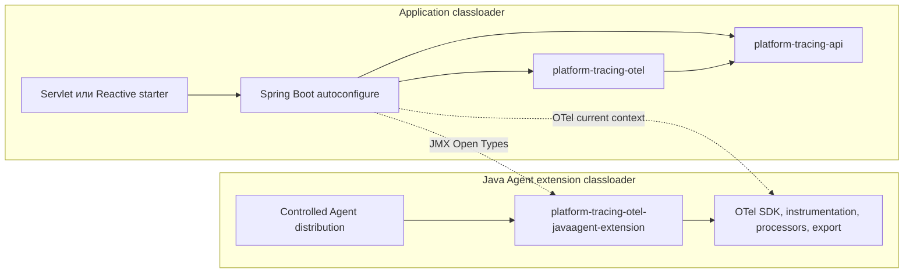

# ADR: итоговая архитектура Platform Tracing

| Поле | Значение |
|---|---|
| Статус | **Accepted** |
| Контекст | Состояние master после Slices E, F, G, H, I, J, K и M |
| Заменяет | [target architecture](./ADR-platform-tracing-target-architecture.md), [clean-core hybrid](./ADR-platform-tracing-clean-core-hybrid.md) |

## Контекст

Рефакторинг завершил границы API, runtime, Spring integration и Java Agent extension. Этот ADR фиксирует существующую топологию, а не предлагает новый split.

## Решение

Публикуемая и исполняемая топология состоит из:

- `platform-tracing-api` - OTel-free прикладные контракты;
- `platform-tracing-otel` - OTel-specific реализация facade, runtime, policies и control-domain;
- `platform-tracing-spring-boot-autoconfigure` - application-plane composition и diagnostics;
- `platform-tracing-autoconfigure-webmvc` и `platform-tracing-autoconfigure-webflux` - web adapters;
- `platform-tracing-spring-boot-starter-servlet` и `platform-tracing-spring-boot-starter-reactive` - по одной точке подключения для соответствующего web stack;
- `platform-tracing-otel-javaagent-extension` - extension и controlled Agent distribution;
- `platform-tracing-bom`, collector configuration и verification modules.

Модулей `otel-runtime`, `platform-tracing-policy` и technology-neutral reusable core нет. Они не являются выбранной будущей topology.

## Composition planes

Application plane создаёт facade и adapters, но не SDK. Agent plane владеет SDK, instrumentation, sampler, processors, sanitizer, propagation hooks и protected export path. Разные class identities ожидаемы. Между planes разрешены поддерживаемый OTel current context и JMX Open Types/primitive Map wire contract.

Запрещены cross-classloader injection platform objects, casts между одноимёнными классами разных classloader, shared mutable statics и передача application DTO через JMX.

## Runtime contract

Production modes: `AGENT` и `DISABLED`. `DISABLED` - единственный успешный NoOp. При включённом tracing отсутствие compatible READY Controlled Agent приводит к startup failure. Application diagnostics не заменяют pre-JVM enforcement.

## Consequences

- Slice K сохранил внутренние пакеты `space.br1440.platform.tracing.core.*`; это историческая taxonomy внутри OTel-specific артефакта, не обещание neutral-core extraction.
- Enrichment сохраняет `void` contract; `EnrichmentOutcome` не вводится.
- Production rollout запрещён, пока открыты оба release gate.

## Verification

Границы защищают `pr0StarterDependencySmoke`, `pr1ModuleTaxonomyVerify`, `pr4ArchitectureFitnessVerify`, ArchUnit, ABI snapshots, published-consumer fixture, extension packaging checks и packaged Agent E2E evidence предыдущих slices.

## Связанные решения

- [OTel-free facade](./ADR-api-otel-free-facade.md)
- [explicit composition](./ADR-explicit-composition-no-static-sl.md)
- [runtime modes](./ADR-sdk-mode-detection.md)
- [module identity](./ADR-platform-tracing-otel-module-identity.md)
- [Slice J evidence](../analysis/platform-tracing-slice-j-evidence.md)
- [Slice K evidence](../analysis/platform-tracing-slice-k-evidence.md)
