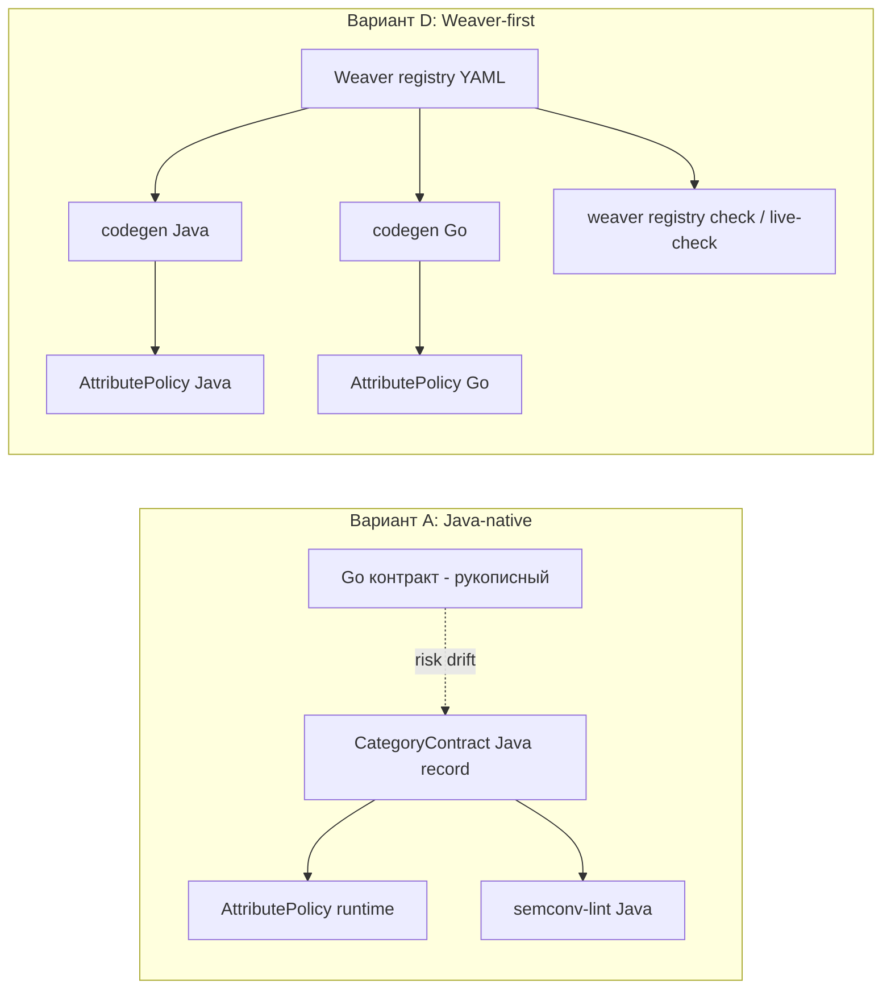

# ADR: governance семантического контракта — Java-native vs Weaver-first codegen

| Поле | Значение |
|------|----------|
| Статус | **Открыт — на обсуждении (митинг с SRE)** |
| Дата | 2026-06-09 |
| Контекст | Фаза 13 (typed span API / semantic layer), `platform-tracing-semconv-lint` |
| Стек | OTel BOM **1.61.0**, OTel instrumentation BOM **2.27.0**, OTel Java Agent **2.27.0** |
| Триггер | Параллельно разрабатывается Go-аналог библиотеки трассировки → семантический контракт становится многоязычным |

> Решение **не принимается соло** разработчиком — выносится на митинг с SRE. До решения `platform-tracing-semconv-lint` дальше **не изменяется** (расширение правил и подключение CI/e2e gate заморожены). Runtime-governance Фазы 13 (`AttributePolicy`/`CategoryContract`, PR-0..PR-4, PR-6) продолжается, т.к. одинаково нужен в обоих исходах.

## Проблема

Фаза 13 вводит управляемый семантический слой: low-cardinality имена span'ов, allowlist'ы атрибутов, обязательные/запрещённые поля по категориям. Источник истины — `CategoryContract` (Java record). Его потребляют:

1. **runtime** — `AttributePolicy.validateAndNormalize(...)` (STRICT/WARN/DISABLED);
2. **build/CI** — `platform-tracing-semconv-lint` (`PlatformSpec` + правила) по экспортированным span'ам.

Пока потребитель один (Java), рукописный `CategoryContract` — корректный single source of truth без дрейфа. Но появление **Go-аналога** делает контракт многоязычным: ручное ведение эквивалентного контракта в Java и Go = неизбежный кросс-языковой semantic drift. Это ровно тот класс проблем, который индустрия решает кодогенерацией из языко-нейтрального источника (как `proto`/OpenAPI), а в OpenTelemetry — через **Weaver** (registry → codegen + `registry check`/`live-check`; используется, в частности, Honeycomb).

Нужно зафиксировать развилку и условия выбора до того, как мы зацементируем runtime/lint вокруг Java-only.

## Варианты

### A — Java-native (текущий)
- `CategoryContract` (Java record) = source of truth для Java.
- `AttributePolicy` (runtime) и `semconv-lint` (Java) читают его напрямую.
- Go ведёт свой контракт независимо.
- Weaver вне scope.

### D — Weaver-first + codegen (предложение Систем Аналитика)
- Weaver-compatible registry (YAML) = единый source of truth.
- Codegen Java **и** Go контрактов / `SemconvKeys`.
- Per-language in-process `AttributePolicy` (STRICT/WARN/DISABLED) поверх сгенерированных артефактов.
- `weaver registry check` / `live-check` как CI/e2e gate.

## Аргументы

**За D (Weaver-first):**
- Один источник истины на оба языка → структурно исключает кросс-языковой drift.
- Weaver — индустриальный стандарт OTel-governance (registry check, live-check, diff, Rego-политики); не самописный велосипед.
- Pre-prod: радикальное изменение сейчас дешевле, чем после релиза двух библиотек.
- Снимает с `platform-tracing-semconv-lint` тяжёлую часть валидации (уходит в `live-check`).

**Против D / за A (на сейчас):**
- Build-зависимость на Weaver (Rust CLI в Docker) в обоих pipeline (Java и Go).
- Jinja-шаблоны под наши формы: `record` + deep-immutable инварианты, `requiredAnyOf`, `EagerOnlyKeys` — не генерируются «чисто».
- Часть контракта — поведение/инварианты (а не только декларация ключей) → всё равно нужен per-language Java/Go-код + Rego.
- `live-check` пока v0.x → риск как обязательного gate.
- Java-сторона уже drift-free сама по себе; выигрыш проявляется только из-за второго (Go) потребителя.

## Вопросы для митинга с SRE

1. Где живёт registry: shared-репозиторий контракта vs здесь + публикация артефакта для Go?
2. Владелец и версионирование registry (`platform.policy.version` как семантический контракт — кто бампает, как diff-гейт).
3. Scope пилота, если берём D (например INTERNAL + DATABASE, потом расширять).
4. Используем ли Rego-политики Weaver или достаточно `registry check`.
5. `live-check` — обязательный CI/e2e gate или опциональный профиль на старте.
6. Кто отвечает за Jinja-шаблоны и их тесты (drift между шаблоном и рукописными инвариантами).

## Решение на сейчас (interim, не предрешает митинг)

- Продолжаем **Java-native (A)**, чтобы не блокировать Фазу 13.
- `CategoryContract` / `SemconvKeys` проектируем **generation-ready**: чистая декларативная структура без ручной логики, которую позже можно эмитить из registry → переход на D станет генерацией, а не переписыванием runtime.
- `platform-tracing-semconv-lint` **заморожен** до решения SRE (не расширяем правила, не подключаем CI/e2e gate).
- Runtime-governance (PR-0..PR-4, PR-6) идёт по плану — не зависит от исхода.

## Пересмотр

После митинга с SRE: перевести статус в **Принято** с выбранным вариантом; при выборе D — открыть отдельные ADR на registry-ownership и codegen-pipeline.

## Связанные артефакты

- План Фазы 13: раздел «Открытый архитектурный вопрос (НА МИТИНГ С SRE): Weaver-first codegen»
- [ADR-otel-direct-integration.md](./ADR-otel-direct-integration.md) — agent-first / direct integration инвариант
- [ADR-db-semconv-detection.md](./ADR-db-semconv-detection.md) — semconv-зависимая детекция (пример многоязычной чувствительности к контракту)
- `platform-tracing-semconv-lint` — `PlatformSpec`, `CommandLineLinter` (заморожены)
- Анализ Систем Аналитика: `Weaver-first governance + Java generation.md`
