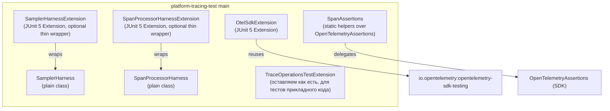

# План разработки JUnit 5 Extensions для OpenTelemetry SDK

**Автор:** Java Lead, платформа трассировки
**Версия:** 2.0 (внутренняя)
**Дата:** 2026-05-20
**Аудитория:** архитектурный комитет, ревьюеры платформенного стартера
**Замещает:** [`E:\Platform_Traces_Archive\Otel-junit-extensions\otel-junit-extensions-plan.md`](file:///E:/Platform_Traces_Archive/Otel-junit-extensions/otel-junit-extensions-plan.md) (далее — «план v1»)
**Scope (подтверждён):** balanced + internal — внутри Platform_Traces, без публичного контракта наружу

---

## 0. TL;DR для митинга

| Параметр | План v1 архитектора | План v2 (этот) |
|---|---|---|
| Количество JUnit Extension'ов | 8 (SDK, Assertions, SamplerChain, SpanProcessor, GlobalIsolation, AsyncSpan, Spring, Benchmark) | **3** (`OtelSdkExtension`, `SamplerHarnessExtension`, `SpanProcessorHarnessExtension`) |
| Помощники без Extension API | — | `SpanAssertions`, `SamplerHarness`, `SpanProcessorHarness` — обычные классы, не extension'ы |
| ServiceLoader auto-detection | да (Phase 2) | **нет** (anti-pattern для test utility scope) |
| Своя AssertJ-обёртка | да | **нет** — переиспользуем `io.opentelemetry.sdk.testing.assertj.OpenTelemetryAssertions` |
| Spring slice extension | да | **нет** — `ApplicationContextRunner` уже покрывает все нужные сценарии |
| Benchmark extension | да | **нет** — JMH/Gradle test task, не JUnit |
| `GlobalOpenTelemetry.resetForTest()` | отдельный extension | **встроено** в `OtelSdkExtension`, никакого `buildAndRegisterGlobal()` в тестах |
| `AsyncSpanExtension` | да | **нет** — `Awaitility` напрямую (3 строки в местах применения) |
| Целевой результат: сокращение boilerplate | ≥60 % | ~50 % на реальных текущих тестах, без новой API-поверхности |

**Главная мысль:** план v1 — добротная карта проблематики OTel-тестирования, но 5 из 8 extension'ов решают проблемы, которых у нас сейчас нет, а часть из них (`OtelBenchmarkExtension`, `OtelSpringExtension`, `AsyncSpanExtension`) принципиально неверно реализованы как JUnit extensions.

---

## 1. Аудит плана v1: что оставляем, что режем, что меняем

### 1.1. Корректные тезисы плана v1 (оставляем как есть)

1. **Анализ индустрии корректен** — `opentelemetry-sdk-testing`, Dynatrace, Okeanos, Quarkus описаны без искажений.
2. **Баг #7919 (`@Nested` + `afterAll`) реален** — лечится ancestor-store lookup.
3. **`GlobalOpenTelemetry.set()` идемпотентность реальна** — решается **не отдельным extension'ом**, а отказом от `buildAndRegisterGlobal()` в тестовом SDK.
4. **`SimpleSpanProcessor` в тестах вместо `BatchSpanProcessor`** — верно, у нас уже так в [`TraceOperationsTestExtension.java`](../platform-tracing-test/src/main/java/space/br1440/platform/tracing/test/TraceOperationsTestExtension.java).
5. **`ExtensionContext.Store` + `AutoCloseable` SdkResource** — единственно правильный подход к lifecycle.

### 1.2. Спорные тезисы (меняем формулировку)

| План v1 | Замена в плане v2 | Обоснование |
|---|---|---|
| «Один `OtelSdkExtension` через composition из 5 подизи extension'ов» | Один **обычный** класс `OtelSdkExtension`, делегирующий приватным компонентам (не extension'ам) | JUnit composition через `@ComposedExtension` не существует. Композиция на уровне instance fields — это просто Java, не паттерн «composition extensions». |
| «SpanAssertionProvider — fluent API» | Используем готовый `OpenTelemetryAssertions.assertThat(span)` из `opentelemetry-sdk-testing` | Своя обёртка дублирует уже стабильный API SDK. |
| «`@RegisterExtension` instance — per-method SDK» | Только `@RegisterExtension static` per-class (с `@Nested` lookup). Per-method вариант **не вводим** | Стоимость пересоздания SDK на каждый тест ≈ 30-80 ms × 200 тестов = +10 сек к билду без выгоды; ни один из существующих тестов это не требует. |
| «`OtelBenchmarkExtension` — JUnit-расширение для throughput-проверок» | **Убираем**. Бенчмарки — отдельный Gradle task с JMH | Assertions «p99 < 10 µs» внутри JUnit-теста нестабильны; правильный инструмент — JMH с baseline-фиксацией. |

### 1.3. Удаляем полностью

| Удалено | Причина |
|---|---|
| `OtelAssertionsExtension` | Не нужен Extension API — это плоская библиотека статических assertions; SDK даёт `OpenTelemetryAssertions` готовым. |
| `GlobalOtelIsolationExtension` | Корень проблемы — `buildAndRegisterGlobal()` в Spring test config. Лечится один раз в `application-test.yml` / `@TestConfiguration`, а не отдельным extension'ом. |
| `AsyncSpanExtension` | Сегодня async-тестов у нас два-три (`SpanWatchdogProcessorTest`). 3 строки `Awaitility.await().atMost(...).until(...)` в трёх местах ≠ повод для отдельного extension. |
| `OtelSpringExtension` | Spring Boot 3 уже даёт всё нужное: `ApplicationContextRunner`, `@SpringBootTest`, `TestPropertyValues`. Свой Spring extension под OTel = дублирование инфраструктуры Spring Test. |
| `OtelBenchmarkExtension` | JUnit не место для benchmarks (см. выше). |
| `ServiceLoader auto-detection` | Анти-паттерн для test utility: невидимое подключение «магией» делает тесты непредсказуемыми, конфликтует с `@RegisterExtension static`, плохо работает в IDE-runner'ах. |
| Раздел «Параллельный запуск Phase 2» (с `junit.jupiter.execution.parallel.enabled=true`) | Включение global parallel execution для модуля с OTel SDK — отдельная архитектурная инициатива, не часть test-extension'ов. |

---

## 2. Анализ текущего состояния `platform-tracing-test`

### 2.1. Что есть сейчас

Единственный класс — [`TraceOperationsTestExtension.java`](../platform-tracing-test/src/main/java/space/br1440/platform/tracing/test/TraceOperationsTestExtension.java) (62 строки):

- `BeforeEachCallback` + `AfterEachCallback` (per-method lifecycle).
- Создаёт `OpenTelemetrySdk` с `SimpleSpanProcessor(InMemorySpanExporter)`.
- В `afterEach` корректно закрывает SDK.
- Предоставляет геттеры: `getInMemorySpanExporter`, `getOpenTelemetry`, `getPlatformTracing`.

### 2.2. Что не работает

1. **Не используется в реальных тестах модуля.** Поиск `TraceOperationsTestExtension` по `platform-tracing-otel-extension` и `platform-tracing-spring-boot-autoconfigure` даёт **0 ссылок**. Все 27 тестов SpanProcessor'ов и Sampler'ов вручную поднимают SDK (см. [`EnrichingSpanProcessorTest.java`](../platform-tracing-otel-extension/src/test/java/space/br1440/platform/tracing/otel/extension/processor/EnrichingSpanProcessorTest.java) — 12-15 строк boilerplate на каждый тест).
2. **Нет `@Nested`-safe scope.** Per-method lifecycle вообще не страдает от бага #7919, но и не пригоден для тестов SpanProcessor — там нужен один SDK на класс.
3. **Нет `TraceOperations` для сервисов, которые тестируют не сам стартер, а свой код.** Метод `getPlatformTracing()` есть, но цель модуля сейчас размыта: для unit-тестов SpanProcessor он избыточен, для интеграционных тестов прикладного кода — недостаточен.

### 2.3. Где конкретно сокращается boilerplate

| Тест-класс | Boilerplate сейчас | После плана v2 |
|---|---|---|
| [`CompositeSamplerTest`](../platform-tracing-otel-extension/src/test/java/space/br1440/platform/tracing/otel/extension/sampler/CompositeSamplerTest.java) | `AttributesBuilder` + ручной `shouldSample()` вызов в каждом тесте (~6 строк × 10 тестов) | `harness.withHeader(...).sample("path", SERVER).assertSampled()` — 1 строка |
| `CompositeSamplerEdgeCasesTest` | то же | то же |
| [`EnrichingSpanProcessorTest`](../platform-tracing-otel-extension/src/test/java/space/br1440/platform/tracing/otel/extension/processor/EnrichingSpanProcessorTest.java) и 7 других `*SpanProcessor*Test` | `InMemorySpanExporter.create() + SdkTracerProvider.builder() + SimpleSpanProcessor + OpenTelemetrySdk.builder() + tracer.spanBuilder(...).end() + tracerProvider.shutdown()` (~13 строк × ≥3 теста на класс) | `@RegisterExtension static OtelSdkExtension otel = OtelSdkExtension.withProcessor(new EnrichingSpanProcessor()); ... otel.tracer().spanBuilder("op").startSpan().end(); assertThat(otel.spans()).hasSize(1)` |
| `PlatformAutoConfigurationCustomizerTest` | Ручная сборка `AutoConfigurationCustomizer` через моки | Остаётся как есть — это не «работа с SDK», а тестирование SPI-implementation. Extension не нужен. |
| `TracingActuatorEndpointTest` | `@SpringBootTest` с моками | Остаётся как есть — `ApplicationContextRunner` уже даёт всё нужное. |

**Реальная экономия:** ~12 строк × ~25 тестов = ~300 строк boilerplate. Не «60 %», а ~50 % именно на тех тестах, где SDK реально создаётся.

---

## 3. Принципы (короткий список)

1. **YAGNI > completeness.** Каждый компонент привязан к ≥3 существующим тестам, иначе не делаем.
2. **Никаких новых аннотаций.** Только `@RegisterExtension static` — стандарт JUnit 5, IDE-friendly, не требует обучения.
3. **Не оборачиваем то, что уже есть в SDK.** `OpenTelemetryAssertions`, `InMemorySpanExporter`, `InMemoryMetricExporter` — используем напрямую.
4. **Класс становится Extension только если нужен JUnit lifecycle.** Sampler-тестам lifecycle не нужен — это `SamplerHarness` (обычный класс), а не `SamplerChainExtension`.
5. **`ExtensionContext.Store` + `AutoCloseable`** — единственный механизм state management.
6. **`@Nested`-safe** = ancestor lookup в Store. Один параграф кода в `OtelSdkExtension`, не отдельный extension.
7. **Никакого `buildAndRegisterGlobal()` в тестах.** Документировать в JavaDoc + ArchUnit-правило (одно).
8. **Ничего не публикуем наружу.** API нестабилен — это test utility модуля, не контракт для сервисов.

---

## 4. Архитектура решения



**Объяснение:**

- `OtelSdkExtension` — основа, заменяет boilerplate в тестах SpanProcessor'ов.
- `SamplerHarness` — обычный builder-класс для подготовки атрибутов и вызова `shouldSample()`. Может использоваться без JUnit (в `main`-коде даже).
- `SamplerHarnessExtension` — тонкая обёртка вокруг `SamplerHarness` ради `@RegisterExtension` синтаксиса и `ParameterResolver`. **Опциональна**: можно писать `new SamplerHarness(sampler)` руками.
- `SpanProcessorHarness` / `SpanProcessorHarnessExtension` — то же для SpanProcessor'ов.
- `TraceOperationsTestExtension` — оставляем без изменений как контракт для unit-тестов прикладного кода, использующего `TraceOperations` фасад. Это другая аудитория (сервисы), даже если артефакт internal.

---

## 5. Каталог компонентов

### 5.1. `OtelSdkExtension` (главный)

**Тип:** JUnit 5 Extension.
**Реализует:** `BeforeAllCallback`, `BeforeEachCallback`, `ParameterResolver`. `AfterAllCallback` **не реализуем** — `AutoCloseable` в `Store` закрывается JUnit'ом сам, без бага #7919.

**Lifecycle:**

| Callback | Действие |
|---|---|
| `beforeAll` | Ищем SDK в Store ancestor-контекстов; если нет — создаём в Store **корневого** (root non-nested) контекста. |
| `beforeEach` | Если sampler/processor stateful — `exporter.reset()`. Сам SDK не пересоздаём. |
| `Store close` (JUnit вызывает автоматически) | `sdk.close()` через `AutoCloseable` обёртку. |

**API (минимальный):**

```java
@RegisterExtension
static final OtelSdkExtension otel = OtelSdkExtension.builder()
        .withSpanProcessor(new EnrichingSpanProcessor())
        .withSampler(Sampler.alwaysOn())   // optional, default = alwaysOn
        .build();

// Совсем простой случай:
@RegisterExtension
static final OtelSdkExtension otel = OtelSdkExtension.create();
```

**Доступные методы (на экземпляре):**

- `Tracer tracer()` — single tracer "test".
- `OpenTelemetry openTelemetry()` — для тестов, которым нужен полный SDK-объект.
- `List<SpanData> spans()` — finished spans, без копирования.
- `void reset()` — `exporter.reset()` mid-test.

**Параметр resolver:** только `OtelSdkExtension` сам (для `@Nested` без `static`). Не `OtelSpanCapture` / `OtelMetricCapture` — это лишняя поверхность, у нас 1 экспортёр в 99 % случаев.

**Никаких метрик/логов в Phase 1.** Когда появится первый тест, требующий `SdkMeterProvider` — расширим. На сегодня в Platform_Traces метрик-тестов нет (логика метрик — в соседнем платформенном стартере).

**`@Nested`-safe lookup (одна функция):**

```java
private ExtensionContext.Store rootStore(ExtensionContext context) {
    ExtensionContext walker = context;
    while (walker.getParent().isPresent()) {
        var parent = walker.getParent().get();
        if (parent.getStore(NS).get(SDK_KEY) != null) {
            return parent.getStore(NS);
        }
        walker = parent;
    }
    return context.getStore(NS);
}
```

### 5.2. `SamplerHarness` (plain class)

**Тип:** обычный класс. **Не Extension.**

```java
public final class SamplerHarness {
    private final Sampler sampler;
    private final AttributesBuilder attrs = Attributes.builder();
    private Context parent = Context.root();
    private SpanKind kind = SpanKind.INTERNAL;

    public SamplerHarness(Sampler sampler) { this.sampler = sampler; }

    public SamplerHarness withHeader(String name, String value) { ... }
    public SamplerHarness withUrlPath(String path) { ... }
    public SamplerHarness withParent(Context ctx) { ... }
    public SamplerHarness withKind(SpanKind kind) { ... }

    public SamplerDecisionAssert sample(String spanName) {
        SamplingResult r = sampler.shouldSample(parent, fixedTraceId(), spanName,
                kind, attrs.build(), List.of());
        return new SamplerDecisionAssert(r);
    }
}

public final class SamplerDecisionAssert {
    public SamplerDecisionAssert assertSampled() { ... }
    public SamplerDecisionAssert assertDropped() { ... }
    public SamplerDecisionAssert hasDecision(SamplingDecision expected) { ... }
}
```

**Используется так:**

```java
@Test
void healthcheck_дропается() {
    new SamplerHarness(sampler)
            .withUrlPath("/actuator/health")
            .withKind(SpanKind.SERVER)
            .sample("GET /actuator/health")
            .assertDropped();
}
```

### 5.3. `SamplerHarnessExtension` (thin optional wrapper)

```java
@RegisterExtension
static final SamplerHarnessExtension harness =
        SamplerHarnessExtension.of(() -> buildCompositeSampler());

@Test
void healthcheck_дропается(SamplerHarness h) {
    h.withUrlPath("/actuator/health").sample("...").assertDropped();
}
```

Тонкая обёртка: `ParameterResolver` для инжекта `SamplerHarness` + reset перед каждым тестом. Если sampler stateless — даже extension не нужен.

### 5.4. `SpanProcessorHarness` / `SpanProcessorHarnessExtension`

Аналогично: harness — обычный класс, обёртка опциональна.

```java
public final class SpanProcessorHarness implements AutoCloseable {
    private final InMemorySpanExporter exporter = InMemorySpanExporter.create();
    private final SdkTracerProvider provider;
    private final Tracer tracer;

    public SpanProcessorHarness(SpanProcessor underTest) {
        this.provider = SdkTracerProvider.builder()
                .addSpanProcessor(underTest)
                .addSpanProcessor(SimpleSpanProcessor.create(exporter))
                .build();
        this.tracer = OpenTelemetrySdk.builder()
                .setTracerProvider(provider).build().getTracer("test");
    }

    public Tracer tracer() { return tracer; }
    public List<SpanData> spans() { return exporter.getFinishedSpanItems(); }
    public void reset() { exporter.reset(); }

    @Override
    public void close() { provider.shutdown().join(2, TimeUnit.SECONDS); }
}
```

В тесте либо `try-with-resources`, либо через `SpanProcessorHarnessExtension`.

### 5.5. `SpanAssertions` (static helpers)

```java
public final class SpanAssertions {
    private SpanAssertions() {}

    public static SpanDataAssert assertSpan(List<SpanData> spans, String name) {
        SpanData found = spans.stream()
                .filter(s -> s.getName().equals(name))
                .findFirst()
                .orElseThrow(() -> new AssertionError(
                        "Span with name '" + name + "' not found among " +
                        spans.stream().map(SpanData::getName).toList()));
        return OpenTelemetryAssertions.assertThat(found);
    }
}
```

Возвращаем `SpanDataAssert` из `opentelemetry-sdk-testing` — fluent API уже есть, не дублируем.

### 5.6. Что **не делаем** (явно, чтобы вернуться при необходимости)

| Компонент | Когда вернёмся |
|---|---|
| `MetricAssertions` / `OtelMetricCapture` | Когда появится первый metric-test в Platform_Traces. |
| `LogAssertions` / `OtelLogCapture` | Аналогично для logs. |
| `OtelSpringExtension` | Если интеграционные `@SpringBootTest` начнут регулярно требовать одинаковый bootstrap OTel — на сегодня покрывается `ApplicationContextRunner`. |
| `GlobalOtelIsolationExtension` | Если появится потребность в parallel `@SpringBootTest` с OTel. Сегодня — нет. |
| `AsyncSpanExtension` | Если число async-тестов превысит ~10. Сегодня — 2-3. |
| `OtelBenchmarkExtension` | Никогда в этом модуле; для performance — отдельный JMH-модуль. |
| `ServiceLoader auto-detection` | Никогда — анти-паттерн для phys test utility. |

---

## 6. План работ по фазам

### Фаза 0 — Подготовка (1 день)

| # | Задача | Результат |
|---|---|---|
| 0.1 | Зафиксировать на ArchUnit: ни один тест Platform_Traces не вызывает `buildAndRegisterGlobal()` | Тест-правило в `platform-tracing-test/src/test/java/.../arch/TestGlobalOtelRulesTest.java` |
| 0.2 | Подтвердить, что [`TraceOperationsTestExtension`](../platform-tracing-test/src/main/java/space/br1440/platform/tracing/test/TraceOperationsTestExtension.java) остаётся как есть | JavaDoc-уточнение «контракт для прикладных тестов, не для тестов самой платформы» |
| 0.3 | Создать пакетную структуру в `platform-tracing-test/src/main/java/space/br1440/platform/tracing/test/`: `junit`, `harness`, `assertions` | Каркас + package-info.java с JavaDoc |

### Фаза 1 — `OtelSdkExtension` + `SpanAssertions` (3-4 дня)

| # | Задача | Acceptance |
|---|---|---|
| 1.1 | Реализовать `OtelSdkExtension` (builder, `@Nested`-safe lookup, `AutoCloseable` SdkResource) | Unit-тесты: SDK переиспользуется в `@Nested`, exporter сбрасывается между методами, `close()` вызывается ровно один раз |
| 1.2 | Реализовать `SpanAssertions.assertSpan(spans, name)` | Возвращает `SpanDataAssert`, поддерживает chain |
| 1.3 | Переписать [`EnrichingSpanProcessorTest`](../platform-tracing-otel-extension/src/test/java/space/br1440/platform/tracing/otel/extension/processor/EnrichingSpanProcessorTest.java) и `EnrichingSpanProcessorAdvancedTest` | Сокращение строк ≥45 %, поведение тестов идентично |
| 1.4 | Перевести `SafeSpanProcessor*Test`, `ValidatingSpanProcessorTest` | Аналогично |
| 1.5 | Документация в `docs/testing.md` с одним рабочим примером | Готовое руководство для команды |

**DoD:** все 8 `*SpanProcessor*Test` используют `OtelSdkExtension`. CI-билд зелёный. Старый `EnrichingSpanProcessorTest` сохраняется в `archive/` неделю для отката.

### Фаза 2 — `SamplerHarness` + `SpanProcessorHarness` (3-4 дня)

| # | Задача | Acceptance |
|---|---|---|
| 2.1 | Реализовать `SamplerHarness` + `SamplerDecisionAssert` | Unit-тесты harness: headers, url.path, kind, parent context |
| 2.2 | Реализовать `SamplerHarnessExtension` (тонкая обёртка с `ParameterResolver`) | Unit-тесты |
| 2.3 | Переписать [`CompositeSamplerTest`](../platform-tracing-otel-extension/src/test/java/space/br1440/platform/tracing/otel/extension/sampler/CompositeSamplerTest.java), `CompositeSamplerEdgeCasesTest` | Boilerplate `AttributesBuilder + shouldSample(...)` → одна fluent-строка |
| 2.4 | Реализовать `SpanProcessorHarness` + `SpanProcessorHarnessExtension` | Unit-тесты |
| 2.5 | Перевести `ScrubbingSpanProcessor*Test`, `SpanWatchdogProcessor*Test` | Совместимость поведения |

**DoD:** все sampler/processor тесты используют harness. Метрика: число строк в перечисленных тестах −40-50 %.

### Фаза 3 — Зачистка и приёмка (1-2 дня)

| # | Задача |
|---|---|
| 3.1 | Удалить старые boilerplate-фрагменты из переведённых тестов |
| 3.2 | Запустить полную регрессию `:build` всех модулей Platform_Traces |
| 3.3 | Code review с архитекторами по checklist'у (см. §10) |
| 3.4 | Финализировать `docs/testing.md` со ссылками на 3 реальных примера в репозитории |

**Суммарный объём:** ~7-10 рабочих дней одного разработчика. План v1 оценивал 4-5 недель и 3 спринта — это включало over-engineered компоненты.

---

## 7. Дизайн API (usage-first)

### 7.1. SpanProcessor-тест (заменяет 13 строк boilerplate)

```java
class EnrichingSpanProcessorTest {

    @RegisterExtension
    static final OtelSdkExtension otel = OtelSdkExtension.builder()
            .withSpanProcessor(new EnrichingSpanProcessor())
            .build();

    @Test
    void проставляет_platform_type_по_SpanKind() {
        otel.tracer().spanBuilder("server-op").setSpanKind(SpanKind.SERVER).startSpan().end();

        SpanAssertions.assertSpan(otel.spans(), "server-op")
                .hasAttribute(stringKey(PlatformAttributes.PLATFORM_TYPE), "http_server")
                .hasAttribute(stringKey(PlatformAttributes.PLATFORM_RESULT), "success");
    }
}
```

### 7.2. Sampler-тест (заменяет 6 строк boilerplate)

```java
class CompositeSamplerTest {

    private static final CompositeSampler sampler = new CompositeSampler(
            Sampler.alwaysOff(), "X-Trace-On", List.of("on", "1", "true"), "X-QA-Trace");

    @Test
    void форсированная_запись_по_X_Trace_On() {
        new SamplerHarness(sampler)
                .withHeader("X-Trace-On", "on")
                .withKind(SpanKind.SERVER)
                .sample("test")
                .assertSampled();
    }
}
```

Через extension-вариант:

```java
@RegisterExtension
static final SamplerHarnessExtension h = SamplerHarnessExtension.of(() -> sampler);

@Test
void форсированная_запись_по_X_Trace_On(SamplerHarness sh) {
    sh.withHeader("X-Trace-On", "on").sample("test").assertSampled();
}
```

### 7.3. `@Nested`-сценарий (фикс бага #7919 «по построению»)

```java
class SpanProcessorChainTest {

    @RegisterExtension
    static final OtelSdkExtension otel = OtelSdkExtension.builder()
            .withSpanProcessor(new EnrichingSpanProcessor())
            .build();

    @Nested
    class СценарииSuccess {
        @Test void server_op() { /* otel переиспользуется, не пересоздаётся */ }
        @Test void client_op() { /* exporter.reset() в beforeEach */ }
    }

    @Nested
    class СценарииError {
        @Test void server_failure() { /* SDK тот же */ }
    }
    // SDK закрывается JUnit'ом ровно один раз — когда Store корневого класса закрывается.
}
```

---

## 8. Технические детали

### 8.1. Структура классов

```
platform-tracing-test/src/main/java/space/br1440/platform/tracing/test/
├── TraceOperationsTestExtension.java          # без изменений (контракт для прикладного кода)
├── junit/
│   ├── OtelSdkExtension.java                  # Фаза 1
│   ├── SamplerHarnessExtension.java           # Фаза 2 (опционально)
│   ├── SpanProcessorHarnessExtension.java     # Фаза 2 (опционально)
│   └── internal/
│       ├── SdkResource.java                   # AutoCloseable wrapper, package-private
│       └── StoreKeys.java                     # enum, package-private
├── harness/
│   ├── SamplerHarness.java                    # Фаза 2
│   ├── SamplerDecisionAssert.java             # Фаза 2
│   └── SpanProcessorHarness.java              # Фаза 2
├── assertions/
│   └── SpanAssertions.java                    # Фаза 1
└── package-info.java
```

Все Extension'ы — `final`. Все `internal/*` — package-private.

### 8.2. `SdkResource` (AutoCloseable)

```java
final class SdkResource implements ExtensionContext.Store.CloseableResource {
    final OpenTelemetrySdk sdk;
    final InMemorySpanExporter spanExporter;
    final Tracer tracer;

    SdkResource(OpenTelemetrySdk sdk, InMemorySpanExporter spanExporter) {
        this.sdk = sdk;
        this.spanExporter = spanExporter;
        this.tracer = sdk.getTracer("test");
    }

    @Override
    public void close() {
        sdk.getSdkTracerProvider().forceFlush().join(2, TimeUnit.SECONDS);
        sdk.close();
    }
}
```

Используем `ExtensionContext.Store.CloseableResource` (JUnit-специфичный), а не `java.lang.AutoCloseable`. Это намеренно: JUnit гарантирует `close()` при закрытии Store, что нам и нужно.

### 8.3. Зависимости (build.gradle)

```gradle
dependencies {
    api platform(project(':platform-tracing-bom'))

    api project(':platform-tracing-api')
    api project(':platform-tracing-core')

    api 'io.opentelemetry:opentelemetry-sdk'
    api 'io.opentelemetry:opentelemetry-sdk-testing'   // даёт OpenTelemetryAssertions, InMemory exporters

    api 'org.junit.jupiter:junit-jupiter-api'
    api 'org.assertj:assertj-core'

    compileOnly 'org.projectlombok:lombok'
    annotationProcessor 'org.projectlombok:lombok'

    testImplementation 'org.junit.jupiter:junit-jupiter'
    testRuntimeOnly 'org.junit.platform:junit-platform-launcher'
}
```

**Никаких новых зависимостей**: `Awaitility` не нужен, Spring test — не нужен, JMH — отдельный модуль.

### 8.4. `@Nested`-lookup корректность: формальная проверка

| Сценарий | Поведение |
|---|---|
| Тест-класс без `@Nested` | `beforeAll` → Store(root context) пуст → создаём SDK там. `Store close` → SDK закрыт. ✅ |
| `@Nested` 1-го уровня | `beforeAll(nested)` → walker идёт вверх, находит SDK в Store(outer). Возвращает Store(outer). SDK не пересоздаётся. ✅ |
| `@Nested` внутри `@Nested` | Walker идёт вверх дважды, находит SDK в Store(outer-outer). ✅ |
| Несколько `@RegisterExtension static` в одном классе | Только верхнего уровня (по контракту JUnit для `static`). |
| `@RegisterExtension` instance (не `static`) | **Запрещаем в JavaDoc**: `OtelSdkExtension` рассчитан только на `static`. Проверим ArchUnit-правилом (опционально). |

### 8.5. Тесты самих extension'ов

| Тест | Покрытие |
|---|---|
| `OtelSdkExtensionLifecycleTest` | Один SDK на класс; `reset()` между тестами; `close()` ровно один раз |
| `OtelSdkExtensionNestedTest` | `@Nested` без пересоздания SDK; outer.span() видит inner.span() (если такого требования нет — фиксируем «нет» в тесте) |
| `OtelSdkExtensionBuilderTest` | Добавление SpanProcessor'а; Sampler по умолчанию `alwaysOn` |
| `SamplerHarnessTest` | headers / url.path / kind / parent; `assertSampled` / `assertDropped` / `hasDecision` |
| `SpanProcessorHarnessTest` | Чистый процессор без extension; `try-with-resources`; SDK закрыт |

**Целевое покрытие:** строки ≥95 %, ветки ≥90 %. Это test utility, неполное покрытие здесь = баги в реальных тестах.

---

## 9. Риски и принципы предотвращения over-engineering

### 9.1. Конкретные риски, которые мы устранили относительно плана v1

| Риск | Симптом в плане v1 | Решение в плане v2 |
|---|---|---|
| Дублирование SDK assertions API | `OtelAssertionsExtension` с собственным fluent API | `OpenTelemetryAssertions` из SDK |
| Создание Spring-инфраструктуры под OTel | `OtelSpringExtension` | `ApplicationContextRunner` (Spring уже даёт) |
| Performance в JUnit | `OtelBenchmarkExtension` | JMH-task (вне scope) |
| Невидимая магия | `ServiceLoader auto-detection` | Только явный `@RegisterExtension static` |
| Преждевременная абстракция | `OtelSdkExtension через composition из 5 sub-extension'ов` | Один класс с приватными вспомогательными методами |
| Расходование SDK на каждый тест | per-method вариант `OtelSdkExtension` | Только class-level, +10 сек к билду снимаем |
| Ad-hoc isolation extension | `GlobalOtelIsolationExtension` | Архитектурное правило: «никакого `buildAndRegisterGlobal()` в тестах» + ArchUnit |

### 9.2. Маркеры over-engineering, на которые смотрим в code review

- Любой класс с суффиксом `Extension`, не реализующий ни один JUnit callback → не extension, переименовать.
- Любой `@RegisterExtension` instance (без `static`) → SDK будет пересоздаваться, обосновать.
- Любая собственная аннотация (например, `@OtelTest`) → не делаем, `@RegisterExtension static` достаточно.
- Любая ServiceLoader-регистрация в `META-INF/services/org.junit.jupiter.api.extension.Extension` → блокируем в review.
- Любой parallel-related код (`junit.jupiter.execution.parallel.*`) → отдельная инициатива, не часть extension'ов.

### 9.3. Поведенческие риски и митигация

| Риск | Митигация |
|---|---|
| Class-level SDK + stateful sampler/processor → утечка между тестами | `beforeEach` ⇒ `exporter.reset()`; sampler/processor должны быть documented stateless или иметь свой `reset()` метод |
| `forceFlush` в `close()` зависает на 2 сек | Таймаут join + warning лог; в тестах это не критично |
| Поломка после обновления SDK 1.62 → 1.70 | Закрепить версию через `platform-tracing-bom`, прогон контракт-тестов на новом SDK перед мерджем |
| Команды начнут писать тесты, требующие per-method SDK | Документировать паттерны в `docs/testing.md`, отвергать в code review |

---

## 10. Чек-лист code review

- [ ] Никакого `static` состояния в Extension-классах (всё в `ExtensionContext.Store`).
- [ ] Никакого `buildAndRegisterGlobal()` в тестах (включая Spring test config).
- [ ] `SdkResource` реализует `ExtensionContext.Store.CloseableResource`, а не голый `AutoCloseable`.
- [ ] `@Nested`-lookup покрыт unit-тестом на 2+ уровня вложенности.
- [ ] Каждый Extension помечен `final`, конструктор скрыт через factory (`create()` / `builder()`).
- [ ] Внешние API extension'ов задокументированы JavaDoc с @since.
- [ ] В `docs/testing.md` есть рабочий пример с реальным `@RegisterExtension static`.
- [ ] ArchUnit-правило про `buildAndRegisterGlobal()` зелёное.
- [ ] Старые тесты, переписанные на новую инфраструктуру, не потеряли ни одного `@Test` метода (diff-проверка).
- [ ] Build CI зелёный на JDK 21.

---

## 11. Сравнение плана v1 и v2 (для презентации)

| Аспект | План v1 | План v2 | Чем v2 лучше |
|---|---|---|---|
| Объём кода (LOC) | ~2500-3500 | ~700-900 | Меньше surface = меньше поддержки |
| Новых публичных классов | ~25-30 | 7 | Проще навигация в IDE |
| Новых аннотаций | 4-5 (включая планируемые) | 0 | Используем стандарт JUnit |
| Зависимостей сверх SDK | Awaitility + Spring Boot Test + (JMH?) | Никаких | Меньше конфликтов BOM |
| Длительность реализации | 5 недель | 7-10 дней | Faster time-to-value |
| Покрытие реальных проблем | 8 проблем, из них ~3 актуальны | Те же 3 актуальные | Без покрытия гипотетических |
| Сложность для новичка в команде | Высокая (8 extensions, abstract patterns) | Низкая (1 extension + 2 harness класса) | Меньше обучения |
| Возможность расширения | Сразу всё закрыто | Открыта (любую недостающую часть добавим, когда появится боль) | YAGNI |

---

## 12. Открытые вопросы для митинга

1. **`TraceOperationsTestExtension` — оставить или мигрировать на `OtelSdkExtension`?** Сейчас он per-method и предоставляет `TraceOperations` фасад. Предлагаю оставить как есть — это контракт для прикладных тестов, не для тестов самой платформы.
2. **Нужно ли SDK переиспользовать между `@Nested`-классами, видя span'ы из outer?** Если да — текущий дизайн работает. Если хотим изоляцию между `@Nested` блоками — нужен явный `reset()` в `beforeAll(@Nested)`. Текущее решение — `reset()` только в `beforeEach`, между `@Nested` блоками spans не очищаются. Уточнить требование.
3. **ArchUnit-правило про `buildAndRegisterGlobal()` — куда положить?** В `platform-tracing-test`/test или в `platform-tracing-otel-extension`/test? Предлагаю в `platform-tracing-test` (единая точка контракта).
4. **Migration пути для существующих 25 тестов: одна большая PR или серия мелких?** Предлагаю серию по модулям: первая PR — `OtelSdkExtension` + переписать 2 теста для демонстрации; вторая — массовая миграция SpanProcessor-тестов; третья — Sampler-тесты.

---

## 13. Заключение

План v1 архитектора — добротный обзор индустрии и проблематики. Его архитектурная карта (раздел 3 — принципы, раздел 7.1 — Store rules) безусловно правильна и должна быть отражена в реальном коде. Однако каталог из 8 extension'ов спроектирован «на вырост» относительно текущих потребностей Platform_Traces — это типичный сценарий over-engineering в инструментальных утилитах.

План v2 фокусируется на сокращении boilerplate в **уже существующих 25 тестах**, оставляя поверхность API минимальной. Любой из удалённых компонентов (Spring, Async, Global, Benchmark, ServiceLoader, AssertionsExtension) можно добавить позже — но **только когда появится конкретная боль в конкретном тесте**, а не превентивно.

Это соответствует индустриальному стандарту больших коммерческих стартеров (Spring Boot Test, Quarkus Test, Micronaut Test): они начали маленькими и обрастали возможностями только по запросам пользователей, не наоборот.
