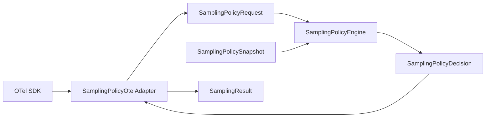

# Глубокое исследование архитектурных вариантов пакета space.br1440.platform.tracing.core.sampling и современных индустриальных практик

## Исполнительное резюме

По доступным артефактам базовая архитектура пакета `space.br1440.platform.tracing.core.sampling` уже находится в хорошем состоянии для hot path: это чистый Java, OTel-free policy engine с неизменяемым `SamplingPolicySnapshot`, stateless-правилами и детерминированным fixed-order rule chain. Конфигурация входит в систему **не напрямую в core**, а через `platform-tracing-otel-extension`, где из runtime/config/control-plane слоя собирается snapshot; production-цепочка правил нормативно зафиксирована, а паритет ratio-алгоритма с OpenTelemetry считается критическим контрактом. Инвентарь также фиксирует главные фактические боли: дублирование normalization между `SamplerState` и `SamplingPolicySnapshot`, split ownership валидации, жёстко прошитую сборку production-chain, избыточно широкий public API правил и отсутствие unit-тестов вокруг `TraceIdRatioDecision` и `QaTracePolicyRule`. fileciteturn0file0

Полный прогон с восемью архитектурными вариантами ранжирует выше всего три семейства: **Runtime Control Plane Split**, **Clean Core Domain Model** и **Minimal Surgical Refactoring**. Дополнительные multi-model обзоры усиливают именно этот вывод, но с разными приоритетами: conservative и adversarial обзоры подталкивают к минимальному и очень безопасному рефакторингу; clean architecture и API-oriented обзоры толкают к явному разделению domain/config/compiler API; Spring Boot review усиливает тезис о том, что control-plane и runtime pipeline должны быть кристально разведены. В результате наилучшим вариантом выглядит **гибрид**: вводить новую архитектуру не одним большим шагом, а через безопасную фазу Minimal Surgical Refactoring, а затем собрать **Clean Domain + Runtime Control Plane Split** как целевое состояние. fileciteturn0file1 fileciteturn0file2 fileciteturn0file3 fileciteturn0file4 fileciteturn0file5 fileciteturn0file6

С точки зрения современной индустрии пакет уже движется в правильном направлении: OpenTelemetry требует, чтобы sampler-методы были безопасны для конкурентного вызова; built-in и contrib sampling в OTel уже разделяют domain decision, parent-based semantics, ratio-based semantics и внешний control/config plane; Spring Boot рекомендует типобезопасную `@ConfigurationProperties`-конфигурацию, constructor binding для records, явную autoconfiguration без component scanning, metadata generation и отдельное тестирование auto-configurations через `ApplicationContextRunner`. Всё это прямо поддерживает рекомендацию оставить **core маленьким и чистым**, а compile/validation/update/jmx/autoconfigure вынести в platform integration layers. citeturn4view2turn7view4turn7view5turn7view2turn4view4turn4view5turn9view2turn10view0turn25view0turn23view0

ASSUMPTION: среди доступных review-артефактов найдены один полный прогон с 8 вариантами и пять perspective reviews; отдельных файлов для перспектив **Runtime Safety Reviewer**, **Testing Architect** и **OpenTelemetry Integration Reviewer** в загруженном наборе не видно, поэтому cross-model normalization ниже опирается на доступные пять обзоров, а не на все восемь возможных перспектив. fileciteturn0file1 fileciteturn0file2 fileciteturn0file3 fileciteturn0file4 fileciteturn0file5 fileciteturn0file6

## Доступные артефакты и проверка базовой картины

Инвентарь `docs/analysis/tracing-sampling-package-inventory.md` подтверждает, что пакет включает immutable domain model (`SamplingPolicyRequest`, `SamplingPolicyDecision`, `SamplingPolicySnapshot`, `RouteRatioPrefix`, перечисления), engine (`SamplingPolicyRule`, `SamplingPolicyEngine`), семь production rules и две package-private utility-сущности. Hot path зафиксирован как `CompositeSampler.shouldSample()` → `SamplingPolicyOtelAdapter.toRequest()` → `SamplingPolicyEngine.evaluate()` → `SamplingPolicyOtelAdapter.toSamplingResult()`, а конфигурация входит через `SamplerPolicyUpdate` и `SamplerState` в `otel-extension`, а не в core. Это важная проверка: пакет уже является **policy engine**, а не general-purpose integration module. fileciteturn0file0

Базовые инварианты также подтверждены и именно их нельзя ломать при рефакторинге: production rule order нормативен; `DefaultRatioPolicyRule` всегда принимает решение и потому production engine не абстейнит; route-ratio matching использует longest-prefix-first при компиляции snapshot; `TraceIdRatioDecision` должен сохранять parity с OTel `traceIdRatioBased`; а правила и `SamplingPolicyEngine` фактически thread-safe за счёт stateless/immutable поведения. Инвентарь отдельно фиксирует, что только `platform-tracing-otel-extension` импортирует production-типы этого пакета напрямую, а core tests по пакету прошли. fileciteturn0file0

Сильная сторона текущего дизайна состоит в том, что он уже согласуется с OpenTelemetry SDK guidance: sampler должен вызываться конкурентно-безопасно, а `ShouldSample` находится в очень чувствительном runtime path; Java SDK отдельно подчёркивает, что по умолчанию используется `ParentBased(root=AlwaysOn)`, а кастомный sampler может участвовать в autoconfiguration через `ConfigurableSamplerProvider`. Это означает, что для вашего пакета лучшая практика — не втаскивать внутрь OTel-типы и не смешивать policy-ядро с внешним control-plane, а держать точку интеграции на boundary adapters. citeturn4view2turn7view4turn7view2

Важно и то, что OTel спецификация на сегодня прямо требует **не менять поведение** исторического `TraceIdRatioBased` до как минимум 1 января 2027 года, несмотря на депрекацию в пользу composable `ProbabilitySampler`; кроме того, sampler с большей вероятностью должен включать все trace’ы, которые включил бы sampler с меньшей вероятностью. Для вас это означает, что `TraceIdRatioDecision` — не просто utility, а compatibility kernel, вокруг которого нужны property-style и parity tests. citeturn4view0turn14view0

## Сравнение архитектурных вариантов и нормализация scoring

Полный восьмивариантный прогон предложил следующий дизайн-space: **Minimal Surgical Refactoring**, **Clean Core Domain Model**, **Strategy Registry Architecture**, **Pipeline / Chain Architecture**, **Functional Core Imperative Shell**, **Runtime Control Plane Split**, **Hexagonal Ports and Adapters** и **Aggressive Package Decomposition**. Для каждого варианта в артефакте уже были описаны core idea, package structure, migration plan, risks и weighted total. Фактически спор идет не о том, нужен ли рефакторинг вообще, а о том, насколько далеко двигать архитектуру от текущего чистого rule-based ядра и как быстро это делать. fileciteturn0file1

Ниже — синтез вариантов в том виде, который пригоден для управленческого и архитектурного решения.

| Вариант | Ядро идеи | Что происходит с текущими классами | Сильные стороны | Слабые стороны и риски | Типовой миграционный план | Базовый weighted score |
|---|---|---|---|---|---|---:|
| Minimal Surgical Refactoring | Минимально чистим ядро без ломки API | `SamplingPolicySnapshot` делегирует normalization helper’ам; `TraceIdRatioDecision` получает явный internal home и тесты; engine/rules почти без изменений | Самый безопасный путь, быстро убирает duplication и test gaps | Не решает до конца split validation и ширину public API | Сначала characterization tests, затем extraction internal helpers | 8.02 fileciteturn0file1 |
| Clean Core Domain Model | Отделяем config/validation/compiler от runtime policy | `SamplingPolicySnapshot` остаётся compiled policy; появляются `SamplingPolicyConfig`, validator и compiler; `fromConfiguration` — facade | Лучшее разделение ответственности, высокая testability | Чуть больше типов, риск поменять semantics validation слишком рано | Ввести compiler/validator за совместимым facade | 8.33 fileciteturn0file1 |
| Strategy Registry | Управление цепочкой правил через registry/factory | `productionEngine()` уходит в factory/registry; rules становятся регистрируемыми strategies | Контролируемая extensibility | Может быть преждевременной абстракцией для всего семи правил | Сначала registry behind existing API | 7.63 fileciteturn0file1 |
| Pipeline / Chain | Явная цепочка parser → normalizer → validator → compiler | normalization/validation/config build вытаскиваются из snapshot и extension в pipeline-стадии | Очень понятный configuration lifecycle | Для небольшого пакета легко переусложнить | Сначала pipeline behind old entry point | 7.71 fileciteturn0file1 |
| Functional Core, Imperative Shell | Decision logic делается максимально pure-function | Правила становятся thin wrappers вокруг pure functions; snapshot/request остаются immutable | Отличная тестируемость без сильной ломки API | Меньше решает package/API/control-plane проблемы | Шаг за шагом вытаскивать rule logic в pure functions | 7.93 fileciteturn0file1 |
| Runtime Control Plane Split | Жёстко разводим immutable runtime и mutable update plane | `SamplingPolicyEngine` остаётся runtime evaluator; update/publication/config lifecycle оформляется как control-plane boundary | Лучшее соответствие platform runtime needs, update safety, observability | Нужны coordinated changes в otel-extension/autoconfigure | Ввести runtime facade и separate update contracts | 8.41 fileciteturn0file1 |
| Hexagonal Ports and Adapters | Доменные порты и внешние адаптеры | engine/snapshot реализуют ports; OTel/Spring/JMX сидят в adapters | Делает boundary explicit | Для такого пакета может быть overkill | Ввод ports без смены поведения | 7.74 fileciteturn0file1 |
| Aggressive Package Decomposition | Сразу режем пакет на много subpackages | Много типов переносится по `model/rule/engine/compiler/internal` | Улучшает package taxonomy при сильном росте | Самая дорогая миграция при небольшом выигрышe | Сильная залежка на characterization suite | 6.78 fileciteturn0file1 |

Пять perspective reviews существенно помогают интерпретировать эти числа. **Conservative Maintainer** и **Adversarial Reviewer** фактически подтверждают, что самый безопасный и почти единственно оправданный первый шаг — Variant 1: зафиксировать поведение тестами, вынести дублирующиеся helper’ы, не ломать chain order и не начинать “архитектурный театр”. **Clean Architecture Purist** и **Java Library API Designer** сходятся в том, что долгосрочно `SamplingPolicySnapshot` перегружен, а границы SPI/API слишком широки, поэтому Variant 2 или его близкий гибрид архитектурно сильнее. **Spring Boot Platform Reviewer** почти буквально продвигает Variant 6: один platform config/update pipeline, один compile path и чистый core без Spring/JMX/OTel leakage. fileciteturn0file2 fileciteturn0file3 fileciteturn0file4 fileciteturn0file5 fileciteturn0file6

Поскольку только один артефакт даёт полную числовую матрицу по всем 8 вариантам, а perspective reviews оценивают лишь рекомендуемую ими архитектуру, я нормализовал результат так: взял weighted total из полного восьмивариантного прогона как базу и добавил небольшой cross-model correction на основании силы и консенсуса доступных perspective reviews. Это **не статистическое усреднение**, а аналитическая reconciliation model; её надо читать как consensus score, а не как “ground truth”. fileciteturn0file1 fileciteturn0file2 fileciteturn0file3 fileciteturn0file4 fileciteturn0file5 fileciteturn0file6

| Вариант | Базовый score | Cross-model сигнал | Нормализованный consensus score | Итоговый ранг |
|---|---:|---|---:|---:|
| Runtime Control Plane Split | 8.41 | Очень сильная поддержка platform review; совпадает с гибридной рекомендацией полного прогона | **8.59** | **1** |
| Clean Core Domain Model | 8.33 | Очень сильная поддержка clean-architecture и API-driven review | **8.55** | **2** |
| Minimal Surgical Refactoring | 8.02 | Очень сильная поддержка conservative и adversarial review как обязательного первого шага | **8.32** | **3** |
| Functional Core, Imperative Shell | 7.93 | Умеренная поддержка как внутренней техники для testability | **7.97** | **4** |
| Hexagonal Ports and Adapters | 7.74 | Идея полезна, но явного консенсуса нет | **7.72** | **5** |
| Pipeline / Chain | 7.71 | Понятен для config lifecycle, но часто воспринимается как переусложнение | **7.68** | **6** |
| Strategy Registry | 7.63 | Extensibility полезна, но для текущего размера пакета выглядит преждевременно | **7.55** | **7** |
| Aggressive Package Decomposition | 6.78 | Негативный консенсус: дорогая миграция при слабом ROI | **6.50** | **8** |

Главный вывод из scoring reconciliation: **побеждает не один “чистый” вариант, а траектория из трёх шагов**. Сначала Variant 1 как safe landing zone, затем Variant 2 для нормализации доменной модели и compile/validation ownership, затем элементы Variant 6 для control-plane/runtime split. Именно эту последовательность поддерживают и базовая матрица, и дополнительные обзоры. fileciteturn0file1 fileciteturn0file3 fileciteturn0file4 fileciteturn0file5 fileciteturn0file6

## Современные индустриальные практики и их значение для данного пакета

Современная практика OpenTelemetry прямо подтверждает несколько архитектурных принципов, которые для вашего пакета являются load-bearing. Во-первых, sampler — это hot-path plugin extension, и `ShouldSample`/`GetDescription` обязаны быть безопасны для конкурентного вызова. Во-вторых, Java SDK по умолчанию использует `ParentBased(root=AlwaysOn)`, а custom sampler можно подключать через autoconfiguration SPI `ConfigurableSamplerProvider`. Это значит, что domain policy engine должен оставаться **чистым, недорогим, неизменяемым и независимым от интеграционного каркаса**, а точки extensibility лучше строить на внешней границе. citeturn4view2turn7view4turn7view2

Во-вторых, у OTel сегодня есть очень сильная линия на **consistent probability sampling**. Спецификация говорит, что sampling decisions должны приниматься согласованно вдоль trace и между несколькими стадиями pipeline; для этого вводятся общая randomness value и rejection threshold. Исторический `TraceIdRatioBased` при этом сохраняется ради совместимости, причём lower-probability sampler должен быть подмножеством higher-probability sampler. Практический вывод для вас: ratio-ядро нельзя просто “чуть-чуть переписать”; его нужно либо оставить неизменным, либо окружить property-based/parity test suite так, чтобы сохранялись monotonic subset semantics и compatibility с OTel. citeturn4view0turn14view0

В-третьих, индустрия уже развела **head sampling в SDK** и **downstream processing / filtering / tail-like decisions в collector path**. OTel docs указывают, что Collector — естественное место для преобразований, фильтрации, governance и cost control, но предупреждают, что сложные преобразования заметно влияют на performance collector’а. Исследования последних лет описывают ту же фундаментальную дилемму: head sampling дёшев, но плохо ловит редкие edge-cases; tail/downstream approaches могут ловить аномалии лучше, но стоят дороже по ingest/processing, а современные гибриды стремятся разделять эти стадии, а не смешивать их в одном компоненте. Для вашей архитектуры это сильный аргумент в пользу того, чтобы route/default/header/parent decisions оставить в core head-policy engine, а всё, что связано с richer runtime control plane и downstream observability policy, держать снаружи. citeturn13view0turn17academia1turn21academia0

С точки зрения Spring Boot best practices картинка столь же ясна. Для библиотек и starters рекомендуются типобезопасные `@ConfigurationProperties`, constructor binding для records, validation через `@Validated`, уникальный namespace, documentation/metadata generation, отдельные `autoconfigure` и `starter` модули, автоконфигурация через `AutoConfiguration.imports`, а не через component scanning, и отдельное тестирование через `ApplicationContextRunner`. Для control-plane критично и то, что JMX по умолчанию выключен, Spring Boot позволяет включать его явно и управлять доменом/экспозицией endpoint’ов; значит, runtime policy updates через JMX должны быть **явным уровнем интеграции**, а не неявной логикой внутри core policy engine. citeturn4view4turn4view5turn4view6turn9view2turn10view0turn10view1turn25view0turn23view0turn23view3

Для Java concurrency и library engineering лучшая практика опять же очень хорошо совпадает с текущим направлением пакета: immutable snapshots, stateless rules и атомарная публикация новой runtime-конфигурации вместо fine-grained locks. JDK `AtomicReference.compareAndSet` даёт атомарную замену со стандартными memory effects; OpenJDK jcstress существует именно как harness для стресс-тестов конкурентных сценариев JVM и library code; а эмпирические данные последних лет указывают, что immutable Java objects коррелируют с существенно меньшей цикломатической сложностью. Это делает архитектурно предпочтительными design patterns вида “compile immutable snapshot offline → atomically publish → read lock-free on hot path”. citeturn4view7turn20view0turn0academia0turn4view2

Из этих best practices вытекают шесть специфических для вашего кейса правил. Первое: core policy package должен оставаться **OTel-free и Spring-free**. Второе: ratio algorithm и rule order должны считаться compatibility contracts, а не “implementation details”. Третье: normalization и validation ownership должны быть едиными и прозрачными. Четвёртое: runtime update plane должен публиковать уже compiled immutable snapshots. Пятое: API/SPI поверхность библиотеки должна быть уже и документированнее, чем сейчас. Шестое: для platform layers нужны не только unit tests, но и autoconfigure tests, control-plane tests и concurrency-stress tests. Эти правила лучше всего поддерживают именно гибрид из Variants 1, 2 и 6. fileciteturn0file0 fileciteturn0file1 citeturn4view2turn4view0turn14view0turn25view0turn23view0turn4view7turn20view0

## Соответствие вариантов лучшим практикам и обязательные remediation steps

Ниже сведено, как каждый вариант соотносится с современными практиками OTel, Spring Boot и Java library design.

| Вариант | Что соблюдает | Что нарушает или не добирает | Что нужно добавить, чтобы довести до best practice |
|---|---|---|---|
| Minimal Surgical Refactoring | Сохраняет hot-path safety, OTel parity, low-risk migration | Не централизует validation/config lifecycle; слабо решает API boundary | Добавить compiler/validator как следующий шаг; задокументировать SPI/API; закрыть test gaps |
| Clean Core Domain Model | Отлично разделяет domain/config/compiler, уменьшает drift | Может слишком рано вынести platform concerns в core | Оставить control-plane реализацию снаружи; `fromConfiguration` временно сохранить как façade |
| Strategy Registry | Дает controlled extensibility и явную сборку rule chain | Для 7 правил выглядит premature abstraction; повышает indirection на hot path construction | Ограничить registry startup-time role; не тащить registry в evaluate-path |
| Pipeline / Chain | Лучший lifecycle для конфигурации и валидации | Риск тяжёлой церемонии для маленького пакета | Делать pipeline только для configuration-time path; не дробить runtime engine |
| Functional Core | Улучшает testability и reasoning для rules/ratio logic | Почти не решает control-plane, API surface и ownership config | Использовать как внутреннюю технику внутри гибридной архитектуры, а не как конечное target state |
| Runtime Control Plane Split | Лучше всего соответствует platform runtime/update patterns и atomic publication | Без Clean Domain остаются грязные compile/validate responsibilities | Обязательно комбинировать с unified compiler/validator и explicit config DTO |
| Hexagonal Ports and Adapters | Делает boundaries явными, хорошо для library design | Для маленького ядра создает избыточные порты и contracts | Использовать только там, где boundary реально пересекает модульные зависимости |
| Aggressive Package Decomposition | Улучшает taxonomy при сильном масштабировании | Слишком дорогой шаг без достаточной бизнес-пользы | Откладывать до реального роста package size и количества policies |

Cross-model артефакты фактически подтверждают ту же логику. Conservative и Adversarial обзоры считают, что strategy/hexagonal/over-decomposition легко превращаются в over-engineering. Clean Architecture Purist требует compiler/validator split и explicit abstain/result model. API Designer хочет уже public surface и сужения случайно открытых типов. Spring Boot reviewer хочет один platform config/update pipeline. Все эти требования совместимы, если не пытаться реализовать каждый обзор как отдельную архитектуру, а собрать из них цельный hybrid. fileciteturn0file2 fileciteturn0file3 fileciteturn0file4 fileciteturn0file5 fileciteturn0file6

Практически это означает такие remediation steps для текущего кода. `SamplingPolicySnapshot` должен перестать быть одновременно runtime state и quasi-compiler. `TraceIdRatioDecision` должен стать явно защищённым тестами compatibility kernel. `SamplerState` не должен повторять normalization уже compiled domain state. У chain order должен появиться явный assembly/factory home, но без изменения нормативного порядка. А public rule classes и `RouteRatioPrefix` нужно либо документировать как поддерживаемый SPI/API, либо shrink/deprecate после проверки фактических внешних зависимостей. fileciteturn0file0 fileciteturn0file2 fileciteturn0file5

## Рекомендуемая гибридная архитектура

Рекомендованная цель — не “чистый” Variant 2 и не “чистый” Variant 6, а **Hybrid = Minimal Surgical entry + Clean Domain core + Runtime Control Plane Split**. В этом target state core остаётся маленьким, pure-Java и OTel-free; config/normalization/validation/compile становятся отдельным configuration-time слоем; а otel-extension и autoconfigure образуют явный platform control plane. Такая цель одновременно минимизирует риск и сильнее всего соответствует OTel/Spring industry guidance. fileciteturn0file1 fileciteturn0file3 fileciteturn0file5 fileciteturn0file6 citeturn4view2turn7view2turn9view2turn10view0

### Пакетная раскладка

```text
space.br1440.platform.tracing.core.sampling
├── model
│   ├── SamplingPolicyRequest
│   ├── SamplingPolicyDecision
│   ├── SamplingPolicyDecisionType
│   ├── SamplingPolicyReason
│   ├── ParentContextState
│   ├── SamplingPolicySnapshot
│   ├── SamplingPolicyConfig
│   └── RouteRatioPrefix
├── policy
│   ├── SamplingPolicyRule
│   ├── KillSwitchPolicyRule
│   ├── HardDropPolicyRule
│   ├── ForceHeaderPolicyRule
│   ├── QaTracePolicyRule
│   ├── ParentSampledPolicyRule
│   ├── RouteRatioPolicyRule
│   └── DefaultRatioPolicyRule
├── runtime
│   ├── SamplingPolicyEngine
│   └── ProductionSamplingPolicy
├── compile
│   ├── SamplingPolicyConfigValidator
│   └── SamplingPolicyCompiler
└── internal
    ├── ProbabilityDecision
    └── RuleMetadata

space.br1440.platform.tracing.otel.extension.sampler
├── SamplingPolicyOtelAdapter
├── SamplerStateHolder
├── SamplingPolicyRuntime
├── SamplingPolicyControlPlane
└── CompositeSampler

space.br1440.platform.tracing.autoconfigure
├── TracingProperties.Sampling
├── SamplingRuntimeConfig
└── SamplingRouteRatiosWire
```

### Ключевое отображение текущих классов на новые типы

| Текущий класс или ответственность | Целевое состояние |
|---|---|
| `SamplingPolicySnapshot` как compiled state | Остаётся `SamplingPolicySnapshot` |
| `SamplingPolicySnapshot.fromConfiguration(...)` | Переезжает в `SamplingPolicyCompiler`; старый метод временно façade |
| `SamplerPolicyUpdate.validateDomain` + часть snapshot validation | Централизуется в `SamplingPolicyConfigValidator` |
| `SamplerState.normalize*` + `SamplingPolicySnapshot.normalize*` | Один authoritative normalization/compile path |
| `SamplingPolicyEngine` | Остаётся runtime evaluator; `productionEngine()` собирается через `ProductionSamplingPolicy` |
| Семь rules | Остаются отдельными stateless policy classes |
| `TraceIdRatioDecision` | `ProbabilityDecision` в `internal` с parity/property tests |
| `SamplingPolicyRuleNames` | `RuleMetadata` или аналогичный internal mapping |
| `CompositeSampler`, `SamplingPolicyOtelAdapter` | Остаются вне core как anti-corruption/adaptation boundary |

### Runtime flow



Этот flow нужно сохранить максимально близким к текущему, потому что он уже соответствует OTel ожиданию, что sampler принимает решение до работы span processors, а `ShouldSample` должен быть конкурентно-безопасен и быстрым. fileciteturn0file0 citeturn4view2turn7view5

### Configuration flow

```mermaid
flowchart LR
    Props[TracingProperties.Sampling / JMX input]
      --> Config[SamplingPolicyConfig]
    Config --> Validator[SamplingPolicyConfigValidator]
    Validator --> Compiler[SamplingPolicyCompiler]
    Compiler --> Snapshot[SamplingPolicySnapshot]
    Snapshot --> Runtime[SamplingPolicyRuntime]
    Runtime --> Holder[SamplerStateHolder Atomic Publish]
    Holder --> Composite[CompositeSampler]
```



Такой flow соответствует одновременно best practices Spring Boot library design и lock-free publication pattern: binding/validation/compile делаются вне hot path, а runtime читает только immutable snapshot. Для JMX/control-plane это особенно важно, потому что Spring Boot по умолчанию держит JMX как отдельный осознанный канал управления, а не часть core business logic. citeturn4view4turn4view5turn23view0turn4view7

### Модель потокобезопасности

Рекомендуемая модель проста: `SamplingPolicySnapshot`, `SamplingPolicyRequest` и `SamplingPolicyDecision` остаются immutable; rules остаются stateless; `SamplingPolicyEngine` также immutable и long-lived; runtime policy update публикуется atomically через holder на основе `AtomicReference`/CAS или эквивалентного механизма. Для verification concurrency-path стоит добавить jcstress или аналогичный stress harness поверх `SamplerStateHolder` и любых новых runtime-publication abstractions. Такая схема полностью согласуется и с OTel concurrency requirements, и с JDK memory model primitives. citeturn4view2turn4view7turn20view0

### Стратегия валидации

Лучшая стратегия валидации — “strict early, lenient nowhere unless documented explicitly”. То есть startup/JMX path должен сначала строить `SamplingPolicyConfig`, затем валидировать всё доменное содержимое единообразно, а уже потом компилировать snapshot. Если нужно сохранить обратную совместимость со старым поведением `fromConfiguration`, этот метод должен временно оставаться façade c documented compatibility semantics, но не быть главным путём для platform integration. Это устраняет текущий split validation ownership и делает поведение runtime update предсказуемым. fileciteturn0file0 fileciteturn0file5 fileciteturn0file6

### План тестирования

Тестовый план должен состоять из четырёх кольцевых слоёв. Внутренний слой — unit/property tests на rules, `SamplingPolicyDecision` invariants и `ProbabilityDecision`. Второй слой — characterization matrix для production rule order, interactions и parity с текущими golden cases. Третий слой — adapter tests на OTel mapping и Spring Boot `ApplicationContextRunner` tests для auto-configuration/control-plane path. Четвёртый слой — concurrency stress tests для atomic publication/update path. Именно такой набор лучше всего защищает refactor without behavior drift. fileciteturn0file0 citeturn25view0turn20view0turn4view0

## Дорожная карта рефакторинга, тесты, открытые вопросы и риски

Ниже — практическая дорожная карта, где каждая фаза имеет конкретные задачи и gate criteria.

| Фаза | Конкретные задачи | Основные тесты и gate criteria |
|---|---|---|
| Phase 0 | Дособрать characterization suite | Должны появиться `QaTracePolicyRuleTest`, `TraceIdRatioDecisionTest`, fractional ratio tests, invalid-entry tests для `fromConfiguration`, constructor invariant tests для `SamplingPolicyDecision`; должны пройти core + otel parity/adapter tests без деградации fileciteturn0file0 |
| Phase 1 | Minimal Surgical Refactoring | Вынести normalization helper и ratio helper; не менять signatures и public behavior; production rule order и parity остаются 1:1 с текущим поведением fileciteturn0file1 fileciteturn0file3 |
| Phase 2 | Clean Domain extraction | Ввести `SamplingPolicyConfig`, `SamplingPolicyConfigValidator`, `SamplingPolicyCompiler`; сделать `SamplingPolicySnapshot.fromConfiguration` совместимым façade; убрать duplication в `SamplerState` fileciteturn0file1 fileciteturn0file5 |
| Phase 3 | Runtime Control Plane Split | Ввести явный platform update/runtime boundary; обновлять runtime только compiled snapshot’ами; закрепить atomic publication contract | Concurrency regression tests и, желательно, jcstress-style tests на publication path; Spring/JMX path и startup path должны давать одинаковый snapshot для одинаковой логической конфигурации fileciteturn0file6 citeturn20view0turn25view0 |
| Phase 4 | API tightening и cleanup | Принять решение по public SPI rule classes, `RouteRatioPrefix`, `RECORD_ONLY`, `foundationEngine()`; при необходимости ввести deprecation path | Нельзя сужать API до завершения проверки фактических external consumers; если move/rename затронет autoconfigure, использовать совместимый replacement path и documented migration notes fileciteturn0file2 fileciteturn0file0 citeturn9view2 |

Перед Phase 1 я бы обязательно добавил три свойства как property-based/contract tests, потому что они прямо вытекают из OTel semantics и особенно важны для вашего кода. Первое — **monotonic subset property**: для `p1 ≤ p2` множество sampled traceIds при `p1` должно быть подмножеством sampled при `p2`. Второе — **stable route precedence**: longest-prefix-first не должен зависеть от insertion order. Третье — **publish-then-read atomicity**: после runtime update читатель либо видит старый полностью валидный snapshot, либо новый полностью валидный snapshot, но не промежуточное состояние. citeturn4view0turn14view0turn20view0 fileciteturn0file0

Открытые вопросы, которые реально влияют на архитектурный выбор, остаются теми же, что зафиксированы в инвентаре. Я бы выделил пять самых важных. Во-первых, является ли `SamplingPolicyRule` настоящим public SPI или только incidental public interface. Во-вторых, должен ли core в долгую жить с lenient `fromConfiguration`, или strict validation обязана стать единым правилом везде. В-третьих, гарантируется ли 32-символьный traceId для всех будущих non-OTel callers. В-четвёртых, нужен ли `RECORD_ONLY` как реальный domain state. В-пятых, насколько стабильны rule metric keys по сравнению с reason codes. Пока эти вопросы не закрыты, API tightening нужно делать осторожно. fileciteturn0file0

Главные риски тоже хорошо видны. Наибольший технический риск — случайно сломать parity и deterministic semantics вокруг `TraceIdRatioDecision`. Наибольший архитектурный риск — начать слишком большой redesign раньше, чем будет собран нужный test harness. Наибольший product/platform риск — размазать ownership между core, autoconfigure и otel-extension так, что правила validation и runtime update останутся неодинаковыми. Поэтому safest path — не выбирать между Variant 1, 2 и 6, а выполнять их **последовательно** как одну программу изменений. fileciteturn0file1 fileciteturn0file4 citeturn4view0turn4view2turn25view0

Итоговая рекомендация такова. **Best architecture** — Hybrid `Minimal Surgical → Clean Domain → Runtime Control Plane Split`. **Second-best fallback** — остановиться на Minimal Surgical Refactoring плюс мощный characterization/parity test suite, если команда хочет срезать риск и время. **Architecture to avoid now** — Aggressive Package Decomposition. **Minimum viable refactoring slice** — закрыть test gaps, вынести duplicated normalization, сделать ratio kernel и route ordering formally protected tests, а затем переводить config/update lifecycle на единый compiler/validator path. Это решение лучше всего согласует имеющиеся артефакты вашего анализа с тем, как сегодня рекомендуют проектировать sampling, control-plane и platform libraries в экосистемах OpenTelemetry, Spring Boot и Java 21. fileciteturn0file1 fileciteturn0file3 fileciteturn0file5 fileciteturn0file6 citeturn4view2turn4view0turn14view0turn10view0turn25view0turn4view7