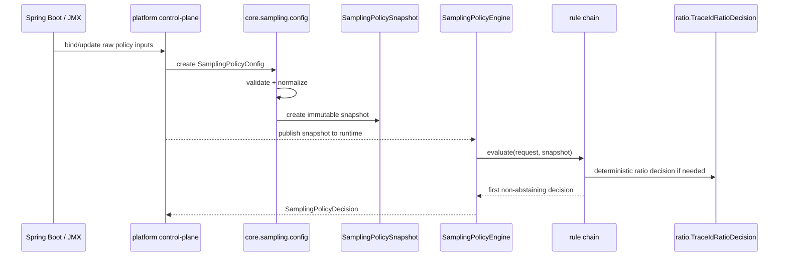

# Исследование целевой архитектуры пакета space.br1440.platform.tracing.core.sampling

## Executive summary

Фактическая инвентаризация показывает, что `space.br1440.platform.tracing.core.sampling` уже является чистым Java-ядром без зависимостей на Spring, OpenTelemetry и JMX: это OTel-free policy engine с фиксированной цепочкой из семи правил, неизменяемым `SamplingPolicySnapshot`, `SamplingPolicyRequest` на каждый span и жёстко зафиксированным порядком production-rules. Конфигурация поступает в пакет не напрямую: сейчас она валидируется и нормализуется в `platform-tracing-otel-extension`, после чего компилируется в snapshot через `SamplingPolicySnapshot.fromConfiguration(...)`. Инвентаризация также фиксирует основные проблемные зоны: раздвоенную ответственность за validation/normalization, package-private ratio algorithm без достаточного unit-покрытия, перегруженный `SamplingPolicySnapshot`, публичные rule-классы с неясным SPI-статусом и нормативный, но хардкодный `productionEngine()`. fileciteturn0file0

Проведённые архитектурные анализы сходятся не в одном “идеальном” варианте, а в устойчивом наборе принципов. Полный сравнительный проход поставил выше всего гибрид из **Clean Core Domain Model** и **Runtime Control Plane Split**, вводимый через **Minimal Surgical Refactoring**; консервативный и adversarial-review подтвердили, что rule order, ratio parity и fallback semantics нельзя трогать без усиления characterization-тестов; API-review указал на избыточную публичную поверхность; Spring/platform-review подтвердил, что binding и runtime control-plane должны жить вне core; clean-architecture-review — что parsing/normalization/validation не должны быть спрятаны внутри snapshot. fileciteturn0file1 fileciteturn0file2 fileciteturn0file3 fileciteturn0file4 fileciteturn0file5 fileciteturn0file6

На этом фоне целевая структура

```text
space.br1440.platform.tracing.core.sampling
├── model
├── rule
├── engine
├── config
└── ratio
```

выглядит **хорошо обоснованной и соответствующей промышленным практикам для Java-библиотек**, но только при важной трактовке: `config` в core — это не Spring `@ConfigurationProperties` и не control-plane слой, а **core-domain configuration-to-snapshot layer**; Spring binding, JMX wire-format, last-known-good update flow и операционные обновления остаются вне core, в platform/otel-extension. Такая раскладка хорошо согласуется и с OpenTelemetry SDK, где sampler abstractions и deterministic ratio logic живут отдельно от provider-owned configuration, и с Spring Boot best practices, где типизированная конфигурация и валидация отделены от runtime-компонентов. citeturn16view3turn17view1turn17view2turn17view3turn18view1turn18view0

Итоговая рекомендация: **подтвердить выбранную структуру как target architecture**, отказаться от терминов `compiler` и `internal` в production package naming, вынести configuration-to-snapshot responsibilities в `config`, изолировать вероятностный алгоритм в `ratio`, оставить engine/rule/model чётко разрезанными по ответственности и внедрять это поэтапно, без мгновенного массового package relocation публичных типов. fileciteturn0file1 fileciteturn0file2 fileciteturn0file5

## Baseline и синтез проведённых анализов

Поскольку файл `tracing-sampling-package-inventory.md` доступен, он используется как источник истины, а не как гипотеза. Из него следует, что текущий пакет уже разделяется на несколько смысловых кластеров: immutable domain model (`SamplingPolicyRequest`, `SamplingPolicyDecision`, `SamplingPolicySnapshot`, `RouteRatioPrefix`, enums), engine (`SamplingPolicyRule`, `SamplingPolicyEngine`), семь stateless rule-классов и две package-private utility (`TraceIdRatioDecision`, `SamplingPolicyRuleNames`). При этом в одном плоском пакете смешаны как runtime evaluation, так и preparation logic для snapshot, а external production usage в пределах репозитория идёт только через `platform-tracing-otel-extension`. fileciteturn0file0

По существу проведённые анализы говорят одно и то же разными словами. Полный архитектурный проход считает лучшим долгосрочным направлением комбинацию “чистого доменного ядра” и “явного split между runtime и control-plane”, но предлагает входить в это через минимально рискованный шаг. Консервативный обзор требует сначала углубить тестовое покрытие и убрать дублирующуюся normalization-логику. Clean Architecture review требует отделить config compilation и validation от snapshot. Java API review требует сузить accidental public surface. Spring/platform review просит не переносить binding/control-plane в core. Adversarial review предупреждает, что глубокий рефакторинг нельзя превратить в “архитектуру ради архитектуры”. В сумме это не спор с целевой структурой, а скорее согласие по поводу того, **как именно её реализовывать**. fileciteturn0file1 fileciteturn0file2 fileciteturn0file3 fileciteturn0file4 fileciteturn0file5 fileciteturn0file6

Именно поэтому ранее обсуждавшиеся названия `compiler` и `internal` выглядят слабыми, хотя сама идея глубокого дробления — сильная. `compiler` в промышленной Java-команде почти всегда ассоциируется с DSL, AST, code generation или expression language, а инвентаризация такого не показывает: фактически речь идёт о валидации, нормализации и создании immutable runtime snapshot. `internal`, в свою очередь, обозначает не смысл, а режим доступа; для архитектуры это хуже, чем предметные имена пакетов. Синтез анализов и сравнение с OSS-практиками поддерживают именно **responsibility-based package names**, а не термины, требующие дополнительного перевода на человеческий язык. Это — архитектурный вывод из проведённых анализов и индустриальных шаблонов, а не буквальная цитата одного документа. fileciteturn0file1 fileciteturn0file2 fileciteturn0file5 citeturn3view0turn3view1turn3view2turn18view1turn18view0

## Package-by-package analysis

Ниже — подтверждённая интерпретация целевой структуры. Она не означает, что все текущие public FQCN нужно перекинуть по подпакетам в один коммит. Она означает, что **ответственности должны быть разведены именно так**, а миграция package names должна подчиняться совместимости. Основание для такого разреза даёт сама инвентаризация: текущие seams уже совпадают с будущими `model`, `rule`, `engine`, `config`, `ratio`. fileciteturn0file0

| Подпакет | Ответственность | Примеры классов и mapping из текущего состояния | Visibility recommendations | Test strategy | Migration steps | Confidence |
|---|---|---|---|---|---|---|
| `model` | Чистая immutable domain/runtime model без parsing/binding logic | `SamplingPolicyRequest`, `SamplingPolicyDecision`, `SamplingPolicyDecisionType`, `SamplingPolicyReason`, `ParentContextState`, `SamplingPolicySnapshot`, `RouteRatioPrefix` остаются моделью; из `SamplingPolicySnapshot` нужно убрать ownership над normalization/compilation и оставить его immutable runtime state | `public` для реально внешних контрактов; конструкторы и factory-методы — узкие и проверяемые; никаких Spring/OTel/JMX типов | Characterization tests на snapshot immutability, decision invariants, reason mapping, longest-prefix semantics как свойство модели | Сначала оставить FQCN как есть, затем постепенно переносить ответственность, а не сразу типы; `SamplingPolicySnapshot.fromConfiguration(...)` временно оставить как compatibility facade | HIGH fileciteturn0file0 |
| `rule` | Stateless policy rules и rule contract, без control-plane и без binding | `SamplingPolicyRule`, `KillSwitchPolicyRule`, `HardDropPolicyRule`, `ForceHeaderPolicyRule`, `QaTracePolicyRule`, `ParentSampledPolicyRule`, `RouteRatioPolicyRule`, `DefaultRatioPolicyRule`; сюда же логично увести `SamplingPolicyRuleNames` | `SamplingPolicyRule` оставить `public` только если SPI действительно нужен; отдельные rule-классы лучше считать non-extension API и по возможности сужать видимость поэтапно | Отдельные unit-тесты на каждое правило, особенно отсутствующий `QaTracePolicyRuleTest`; property-like tests для priority interactions через engine characterization | Сначала физически сохранить поведение и rule order, затем вычистить naming и visibility; никакой смены semantics `null`-abstain до усиления тестов | HIGH для разреза, MEDIUM для visibility tightening fileciteturn0file0 fileciteturn0file2 |
| `engine` | Ordered evaluation, production chain assembly, без normalization и без algorithm internals | `SamplingPolicyEngine`; сюда относится и `productionEngine()` как assembly point, но лучше трактовать сборку цепочки как engine-level composition, а не как часть config | `public` для engine facade; лучше держать API небольшим; `foundationEngine()` — кандидат на deprecation, если это scaffolding | Characterization tests на production order, never-abstains-in-production, fallback semantics в custom engine | Оставить `evaluate(request, snapshot)` неизменным; возможна мягкая экстракция `ProductionSamplingPolicyEngineFactory`, но не обязательна для первого этапа | HIGH fileciteturn0file0 |
| `config` | Core-domain preparation layer: config DTO, validation, normalization, snapshot creation; без Spring binding и без JMX wire-format | Новые `SamplingPolicyConfig`, `SamplingPolicyConfigValidator`, `SamplingPolicySnapshotFactory`; текущая ответственность уже размазана между `SamplingPolicySnapshot.fromConfiguration(...)` и внешними `SamplerPolicyUpdate`/`SamplerState`, что и надо собрать сюда | `SamplingPolicyConfig` и `SamplingPolicySnapshotFactory` можно сделать `public` или package-private в зависимости от реального external usage; validator часто разумно держать package-private или public-but-not-SPI | Tests на validation bounds, silent-skip vs fail-fast compatibility, route sort, normalization equivalence old-vs-new, snapshot equivalence | Ввести новые типы без удаления старого API; `fromConfiguration(...)` делегирует в factory; Spring `@ConfigurationProperties` остаются вне core | HIGH для самой границы, MEDIUM для степени публичности fileciteturn0file0 fileciteturn0file5 fileciteturn0file6 |
| `ratio` | Изолированный deterministic ratio algorithm, parity-sensitive logic | Текущий `TraceIdRatioDecision` естественно переходит сюда; `RouteRatioPrefix` сюда переносить не нужно, потому что это часть compiled policy model, а не часть algorithm | Из-за отдельного package package-private уже не сработает для use из `rule`; практично сделать `public final` с Javadoc “not extension API” и ограничить consumer-ов ArchUnit-правилами, либо завернуть его внутренним engine-level adapter | Dedicated parity suite против OTel semantics, boundary tests для 0/1/fractional ratios, short/null traceId tests | Перенести алгоритм только после появления отдельного тест-контракта; семантику решения менять нельзя | HIGH для выделения, MEDIUM для visibility design fileciteturn0file0 fileciteturn0file3 citeturn3view1turn16view2 |

Из этой таблицы вытекают два принципиальных уточнения. Во-первых, `config` в core не должен становиться shadow-слоем для Spring Boot binding. Это должен быть **domain-facing configuration package**, который получает уже нормализуемые значения и из них строит snapshot; сам `TracingProperties`, `SamplingRuntimeConfig`, JMX input model и control-plane orchestration должны оставаться за пределами core. Во-вторых, `ratio` стоит выделять отдельно именно потому, что вероятностный trace-ID algorithm — это семантически и тестово особый компонент: его нельзя растворять ни в `rule`, ни в `model`, иначе parity-risk снова станет невидимым. fileciteturn0file0 fileciteturn0file6 citeturn3view1turn16view2

## OSS comparisons и индустриальные паттерны

Сравнение с официальными OSS-источниками показывает, что ваша целевая раскладка соответствует не буквальному package naming других библиотек, а **их устойчивым проектным паттернам**. В OpenTelemetry SDK sampler — это отдельная thread-safe abstraction, а built-ins (`parentBased`, `traceIdRatioBased`) оформлены как отдельные реализации/декораторы в специализированном sampler package. В Java SDK trace-id ratio algorithm вынесен в отдельный класс `TraceIdRatioBasedSampler`, где нижние 64 бита trace ID используются для deterministic probability decision; `ParentBasedSampler` при этом живёт рядом, но решает другой слой задачи — propagation-based composition. Это почти прямой аргумент в пользу отдельного `ratio` и отдельного `rule`/`engine` слоёв у вас. citeturn3view0turn3view1turn3view2

OpenTelemetry specification идёт ещё дальше и формализует, что configuration sampler-а принадлежит `TracerProvider`, может обновляться централизованно и должна применяться ко всем уже выданным tracer-ам. В том же разделе спецификация разделяет built-in samplers (`TraceIdRatioBased`, `ProbabilitySampler`, `ParentBased`, `JaegerRemoteSampler`, `CompositeSampler`) и подчёркивает композицию samplers как отдельный concern. Для вашей архитектуры это означает: runtime evaluation должен быть отделён от configuration ownership, а control-plane обновления — от собственно decision engine. Из этого напрямую следует, что `config` внутри core должен быть только preparation layer, а operator-facing update flow — снаружи. citeturn16view3turn16view2turn16view0turn16view1

OpenZipkin Brave демонстрирует похожий принцип, но в ещё более “boring Java” форме: у него есть специализированный `brave.sampler` namespace, базовая абстракция `Sampler` и отдельные реализации/фабрики; API говорит о root-level sampling decision и вероятностном самплинге как об отдельной ответственности, а не как о растворённой логике внутри общего tracer класса. Даже в минималистичной форме это поддерживает вывод, что package с предметным именем вроде `ratio` лучше, чем неопределённый `internal`, а package с предметным именем `rule` лучше, чем архитектурно тяжёлое `compiler`. citeturn3view3

Spring Boot подтверждает другой важный аспект: типизированная конфигурация должна быть отдельной, валидируемой и по возможности immutable. Официальная документация рекомендует `@ConfigurationProperties` для type-safe binding, поддерживает constructor binding в том числе для records и прямо показывает применение `@Validated` для конфигурационных объектов и nested validation. Для вашей системы это не значит, что Spring-аннотации нужно тащить в `core.sampling.config`; это значит, что **форма ответственности `config` как типизированного и валидируемого слоя правильна**, но конкретные Spring-bound классы должны оставаться вне core и адаптироваться к core-domain config. citeturn17view1turn17view2turn17view3

ArchUnit даёт формальное обоснование последнему спорному месту — чем заменить абстрактный пакет `internal`. Вместо “сваливаем всё внутреннее в один пакет” он предлагает явные layer/slice rules: проверку package-dependencies, layered architecture и отсутствие циклов между slices. Для вашей цели это означает, что смысловую структуру лучше выражать пакетами `model/rule/engine/config/ratio`, а нежелательные зависимости блокировать тестами, например через `noClasses().that().resideInAPackage(..)` и `slices().matching(..).should().beFreeOfCycles()`. То есть guardrails должны быть архитектурными правилами, а не мусорным пакетом `internal`. citeturn18view4turn18view0turn18view1

Практический вывод из OSS-сравнения такой: предложенная структура не является экзотикой. Она хорошо ложится на отраслевой паттерн “immutable domain model + dedicated decision logic + dedicated probability logic + configuration owned outside runtime hot-path”. Где она отличается от предыдущих LLM-вариантов, так это в naming: `config` и `ratio` точнее отражают роль кода, чем `compiler` и `internal`, и при этом сохраняют ту же глубину разбиения, которая понравилась архитекторам. fileciteturn0file1 fileciteturn0file5 citeturn3view0turn3view1turn16view3turn18view1

## Best practices и rationale для выбранной структуры

Первый best practice — **package decomposition по смыслу, а не по технике реализации**. `model`, `rule`, `engine`, `config`, `ratio` отвечают на вопрос “что делает этот код?”, тогда как `internal` отвечает только на вопрос “не трогай это”, а `compiler` навязывает ментальную модель DSL/AST, которой в пакете нет. В инвентаризации прямо видно, что текущие responsibilities уже естественно группируются именно по этим пяти направлениям, а проведённые анализы критиковали прежде всего переизбыток абстракции и неясную терминологию, а не идею глубокого дробления как таковую. fileciteturn0file0 fileciteturn0file2 fileciteturn0file4

Второй best practice — **immutable runtime snapshot как точка консистентности**. И текущая инвентаризация, и OTel SDK patterns показывают ценность того, что hot path читает компактное immutable состояние без парсинга и без мутаций. Это особенно важно для concurrent updates: configuration может обновляться операционно, но решение на каждый span должно опираться на уже собранный snapshot и не видеть промежуточных состояний. Поэтому `SamplingPolicySnapshot` надо сохранить как модель runtime state, а из него вынести не runtime-сущности, а именно подготовительную работу в `config`. fileciteturn0file0 citeturn16view3turn3view1

Третий best practice — **развести validation и normalization от decision logic**, но не смешивать это с framework binding. Spring Boot показывает, что typed config и validation должны быть явными, а OpenTelemetry specification — что configuration ownership и runtime behavior должны быть разделены. Для вашей архитектуры из этого следует точная формула: `config` содержит core-domain config DTO, validator и snapshot factory; Spring properties, wire DTO и JMX adapters остаются снаружи. Это в точности решает текущую боль с duplicated normalization между `SamplerState` и `SamplingPolicySnapshot`, но не нарушает module boundary “no OTel/Spring in core”. fileciteturn0file0 fileciteturn0file6 citeturn17view1turn17view2turn17view3turn16view3

Четвёртый best practice — **изолировать deterministic ratio algorithm и защищать его parity-тестами**. Ваша инвентаризация прямо фиксирует, что `TraceIdRatioDecision` — package-private correctness kernel, что он parity-sensitive относительно OTel behavior и что его отдельного unit-test класса сейчас нет. OTel Java SDK также выделяет ratio sampler в отдельный класс и делает сам algorithm очень явным: probability → upper bound → compare random bits of trace ID. Поэтому отдельный пакет `ratio` — не эстетика, а способ сделать семантически критичную часть видимой, тестируемой и ограниченно зависимой. fileciteturn0file0 citeturn3view1turn16view2

Пятый best practice — **ограничивать доступ guardrails-ами, а не “свалкой internal”**. На практике это означает: если `ratio.TraceIdRatioDecision` придётся сделать `public` из-за Java package boundaries, надо не стыдиться этого, а зафиксировать статус `not extension API` в Javadoc и запретить нежелательное использование правилами ArchUnit. Такой подход индустриально устойчивее, чем попытка зашить намерение в абстрактное имя пакета и надеяться, что все его одинаково поймут. citeturn18view4turn18view0turn18view1

## API и compatibility impact

С точки зрения совместимости важно разделять **логическую архитектуру** и **момент физического relocation типов**. Логически целевая структура обоснована. Физически же перенос текущих public типов (`SamplingPolicyEngine`, `SamplingPolicySnapshot`, `SamplingPolicyRequest`, `SamplingPolicyDecision`, rule classes, enums) в подпакеты будет одновременно breaking change и для source compatibility, и для binary compatibility, потому что изменятся полные имена классов и импорты. Инвентаризация при этом говорит, что внутри репозитория production imports идут только из `platform-tracing-otel-extension`, но отдельно оставляет NEEDS_VERIFICATION по поводу возможных внешних consumers, которые могут напрямую создавать snapshot или использовать rule classes. Это означает: package relocation допустим, но только контролируемо и не как “невинный рефакторинг без последствий”. fileciteturn0file0 fileciteturn0file2

Ниже — ключевые compatibility-риски и реалистичные mitigations.

| Риск | Тип совместимости | Вероятность | Смягчение |
|---|---|---:|---|
| Перенос public типов из root package в `model/rule/engine/...` | Source + binary breaking | HIGH | Делать в major version или через двухшаговую миграцию: сначала новые подпакеты и новые types, затем deprecations, затем removal |
| Замена `SamplingPolicySnapshot.fromConfiguration(...)` на новый pipeline | Behavioral + source | MEDIUM | Оставить старый метод как compatibility facade, делегирующий в `SamplingPolicySnapshotFactory` |
| Сужение visibility у public rule classes | Binary + behavioral для hidden consumers | MEDIUM/HIGH | Сначала собрать usage evidence; затем deprecate-don’t-break; в первой фазе менять статус только документацией |
| Перенос `TraceIdRatioDecision` в `ratio` | Source + design | MEDIUM | Перед переносом ввести parity suite; если нужен public access — Javadoc “not SPI” + ArchUnit |
| Удаление `RECORD_ONLY` | Source + behavioral | LOW/MEDIUM | Не удалять до полной проверки adapter path и внешних интеграций |
| Изменение semantics в validation/fail-fast | Behavioral | HIGH | Сохранить legacy semantics во façade-методах; строгую валидацию применять на новых code paths явно |

Главный практический вывод таков: если цель — **подтвердить структуру**, то её можно подтверждать уже сейчас. Если цель — **сразу разложить все существующие public типы по новым подпакетам**, то это уже release-management задача, а не только архитектурная. Лучший промышленный путь — сначала реализовать новую ответственность внутри старых FQCN и только затем принимать package relocation решение как сознательное major-version изменение. Это полностью соответствует и консервативному, и API-centric анализам. fileciteturn0file2 fileciteturn0file3 fileciteturn0file4

## Migration plan, checklist и ADR snippet

Рефакторинг стоит вести в две скорости: **сначала semantic extraction, потом package relocation**. Это позволяет подтвердить целевую архитектуру уже сейчас, не делая каждое архитектурное улучшение автоматическим breaking change. Такая стратегия совпадает с выводами full exploration и нескольких perspective-reviews. fileciteturn0file1 fileciteturn0file3 fileciteturn0file5

Предрефакторинговый checklist должен выглядеть так:

- добавить characterization tests, которых явно не хватает по inventory: `QaTracePolicyRuleTest`, отдельный `TraceIdRatioDecisionTest`, fractional ratio tests, негативные/edge tests для `SamplingPolicySnapshot.fromConfiguration(...)`, invariant tests для `SamplingPolicyDecision`;  
- прогонять не только `platform-tracing-core:test`, но и otel-extension characterization suite, parity tests и runtime update tests;  
- зафиксировать ArchUnit guardrails: отсутствие циклов между `model/rule/engine/config/ratio`, запрет `model -> rule/engine/config`, запрет `rule -> config`, запрет любых Spring/OTel/JMX dependencies в `core.sampling`, запрет внешнего использования `ratio` кроме разрешённых package slices;  
- оформить deprecation plan для старых entry points;  
- добавить migration smoke tests на “старый путь” и “новый путь” создания snapshot с эквивалентным результатом. fileciteturn0file0 citeturn18view4turn18view0turn18view1

Фазовый план выглядит так. **Фаза A**: усилить тесты и вынести новую ответственность, не меняя FQCN публичных типов. Здесь рождаются `config.SamplingPolicyConfig`, `config.SamplingPolicyConfigValidator`, `config.SamplingPolicySnapshotFactory`, а `SamplingPolicySnapshot.fromConfiguration(...)` просто делегирует в новый factory. Одновременно поднимается `ratio.TraceIdRatioDecision` с parity suite, но семантика алгоритма не меняется. **Фаза B**: подтянуть ArchUnit slices и очистить public surface документированием intent. **Фаза C**: только после evidence по внешним consumers принять решение, переезжают ли действительно public API типы в новые подпакеты физически или root package остаётся compatibility façade layer. fileciteturn0file0 fileciteturn0file1 fileciteturn0file2

Короткий ADR-текст для фиксации решения может быть таким:

```text
Decision:
Adopt responsibility-based package decomposition for
space.br1440.platform.tracing.core.sampling with target packages:
model, rule, engine, config, ratio.

Rationale:
The current flat package already mixes immutable domain model,
ordered rule evaluation, configuration normalization, snapshot creation,
and trace-id ratio logic. Inventory and architecture reviews show that
these concerns are stable seams and can be separated without violating
the existing core boundary.

Rules:
- model owns immutable runtime/domain objects.
- rule owns rule contract and stateless policy rules.
- engine owns ordered evaluation and production chain assembly.
- config owns core-domain configuration validation, normalization,
  and immutable snapshot creation.
- ratio owns deterministic trace-id ratio decision logic.

Constraints:
- Spring Boot binding, JMX wire models, and runtime control-plane orchestration
  remain outside core.sampling.
- Production rule order, longest-prefix route semantics, reason-code mapping,
  and ratio parity behavior are preserved.
- The package names `compiler` and `internal` are intentionally avoided because
  they obscure responsibility rather than clarify it.
```

Этот ADR корректно отражает и фактическое состояние пакета, и выводы проведённых анализов, и индустриальные практики package responsibility naming. fileciteturn0file0 fileciteturn0file1 fileciteturn0file5

## Mermaid diagrams и финальные рекомендации

Ниже — рекомендуемая карта пакетов. Она intentionally показывает **responsibility boundaries**, а не release-order миграции.

```mermaid
graph TD
    A[space.br1440.platform.tracing.core.sampling]

    A --> M[model]
    A --> R[rule]
    A --> E[engine]
    A --> C[config]
    A --> Q[ratio]

    M --> M1[SamplingPolicyRequest]
    M --> M2[SamplingPolicyDecision]
    M --> M3[SamplingPolicySnapshot]
    M --> M4[SamplingPolicyReason]
    M --> M5[ParentContextState]
    M --> M6[SamplingPolicyDecisionType]
    M --> M7[RouteRatioPrefix]

    R --> R1[SamplingPolicyRule]
    R --> R2[KillSwitchPolicyRule]
    R --> R3[HardDropPolicyRule]
    R --> R4[ForceHeaderPolicyRule]
    R --> R5[QaTracePolicyRule]
    R --> R6[ParentSampledPolicyRule]
    R --> R7[RouteRatioPolicyRule]
    R --> R8[DefaultRatioPolicyRule]
    R --> R9[SamplingPolicyRuleNames]

    E --> E1[SamplingPolicyEngine]

    C --> C1[SamplingPolicyConfig]
    C --> C2[SamplingPolicyConfigValidator]
    C --> C3[SamplingPolicySnapshotFactory]

    Q --> Q1[TraceIdRatioDecision]

    R -. uses .-> M
    E -. evaluates .-> R
    E -. reads .-> M
    C -. creates .-> M
    R -. ratio decision .-> Q
```



Эта схема соответствует тому, что видно в inventory today, и одновременно убирает терминологические раздражители `compiler` и `internal`, не жертвуя глубиной разбиения. Она также совместима с рекомендованными ArchUnit guardrails, где slices можно проверить на acyclic structure и на допустимые package dependencies. fileciteturn0file0 citeturn18view0turn18view4

Ниже — sequence flow, который показывает правильную трактовку `config` в core: он не про Spring binding, а про **configuration-to-snapshot preparation**. Spring/JMX по-прежнему остаются снаружи.



Финальный вывод исследования таков. Целевая структура `model / rule / engine / config / ratio` для `space.br1440.platform.tracing.core.sampling` **подтверждается** как архитектурно здравая, промышленно объяснимая и хорошо согласующаяся одновременно с фактической инвентаризацией пакета, результатами LLM-анализов, практиками OpenTelemetry/Brave и платформенными принципами Spring Boot/ArchUnit. Самое важное условие — трактовать её не как приглашение к мгновенному массовому package relocation, а как **target responsibility model** с последующей поэтапной миграцией. `compiler` и `internal` в таком дизайне действительно не нужны: они ухудшают объяснимость системы, не добавляя архитектурной силы. fileciteturn0file0 fileciteturn0file1 fileciteturn0file2 fileciteturn0file3 fileciteturn0file5 fileciteturn0file6 citeturn3view0turn3view1turn16view3turn17view1turn18view1

Практически я бы рекомендовал зафиксировать следующее как “go-forward decision”. Архитектуру — принять. `config` внутри core — ввести как domain-facing layer, не как Spring-layer. `ratio` — вынести и немедленно защитить parity suite. `SamplingPolicySnapshotFactory` — предпочесть любому `Compiler`. `internal` — не вводить; вместо него использовать ясные package names и ArchUnit rules. А вот физическое перемещение public API по подпакетам — делать только после characterization hardening и с осознанной стратегией совместимости. Это и есть наилучший баланс между ясностью для архитекторов, предсказуемостью для разработчиков и безопасностью для production library. fileciteturn0file1 fileciteturn0file3 fileciteturn0file4 citeturn18view0turn18view4