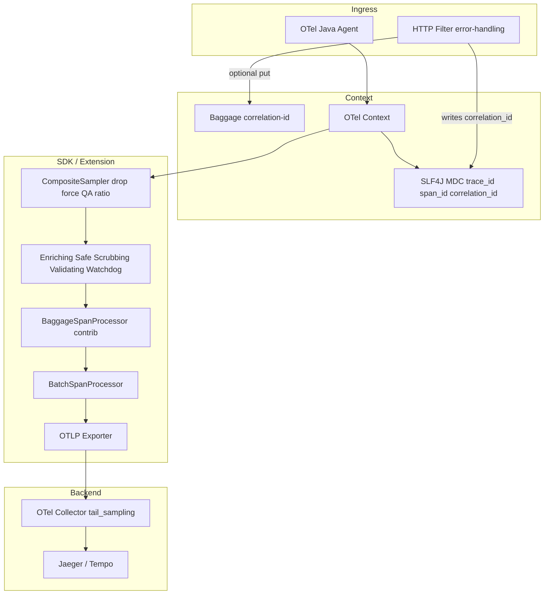

# Исследование: паттерны OpenTelemetry Java SDK для платформенного стартера

**Дата:** 2026-05-19  
**Контекст:** `E:\Platform_Traces` (spring-boot-platform-tracing), каталог `Examples/`  
**Цель:** проанализировать локальные примеры, сопоставить с текущей реализацией и зафиксировать, что стоит перенять из серьёзных OpenSource- и коммерческих решений (в т.ч. проприетарных APM), **без копирования vendor-lock кода**.

---

## 1. Резюме для архитекторов

| Вывод | Детали |
|--------|--------|
| Каталог `Examples/` — зрелый **концептуальный каталог** (18 тем, ~56 KB, 1126 строк), а не готовый production-модуль | Код в примерах — референс для дизайна; часть фрагментов требует доработки перед переносом |
| **Platform_Traces уже реализует значительную часть «коммерческого» уровня** | `platform-tracing-otel-extension`: `CompositeSampler` (force/QA/drop paths), цепочка `SpanProcessor`, scrubbing PII, JMX ratio, `PlatformResourceProvider` |
| **Сильнейшие внешние находки для перенятия** | `BaggageSpanProcessor` (contrib), обёртка `BatchSpanProcessor` (не `SpanExporter`), `parentBased` sampling, contrib resource providers, tail sampling в Collector |
| **Критичный разрыв с error-handling** | `correlation_id` в MDC (error-handling) ≠ автоматический `Baggage`/`span attribute`; нужна явная политика: Baggage + contrib **или** только MDC + `TracingRequestContextSupplier` |
| **Проприетарные APM** | Datadog / Elastic / New Relic — в основном **shim + agent**, не переносимый SDK-код; перенимаем **контракты** (API-only, GlobalOpenTelemetry, OTLP ingest) |

---

## 2. Анализ каталога `E:\Platform_Traces\Examples`

### 2.1. Состав

| Файл | Назначение |
|------|------------|
| [`ReadMe.txt`](../Examples/ReadMe.txt) | Краткое оглавление: 18 паттернов, источники (Elastic EDOT, Honeycomb, Grafana, Quarkus, Datadog, New Relic, contrib) |
| [`OpenTelemetry SDK - примеры для по платформенного стартера.md`](../Examples/OpenTelemetry%20SDK%20-%20примеры%20для%20по%20платформенного%20стартера.md) | Основной документ: production-подобные фрагменты Java/Gradle/XML |

### 2.2. Структура основного документа (18 разделов)

| № | Тема | Суть примера | Качество как референс |
|---|------|--------------|------------------------|
| 1 | Программная сборка `OpenTelemetrySdk` | Resource, OTLP trace/metrics/logs, `BatchSpanProcessor`, composite propagators, `buildAndRegisterGlobal()` | Хорошо для **понимания**; для Spring Boot стартера предпочтительнее autoconfigure + agent |
| 2 | `AutoConfigurationCustomizerProvider` | SPI: span processor chain, resource, properties supplier, sampler | **Совпадает** с подходом `platform-tracing-otel-extension` |
| 3 | Кастомные `SpanProcessor` | `PlatformSpanProcessor`, `BaggageSpanProcessor` (contrib) | Baggage — **must-have** кандидат; кастомный enrich — частично уже в `EnrichingSpanProcessor` |
| 4 | Sampler | `parentBased` + `traceIdRatio`; `HealthcheckFilterSampler` | Drop paths уже в `CompositeSampler`; health — **реализовано иначе** (см. §4) |
| 5 | `TextMapPropagator` | `XRequestIdPropagator` → Baggage `correlation-id` | Важно для Istio/API-шлюзов; **не дублировать** логику error-handling без согласования ключей |
| 6 | Baggage API | Миграция OpenTracing → OTel Baggage | Документация для команд |
| 7 | gRPC | `GrpcTelemetry` / interceptors | Стандарт instrumentation BOM |
| 8 | Kafka | propagation / consumer interceptor | `KafkaTelemetry` из instrumentation library |
| 9 | `SpanExporter` | фильтрация, retry | Оборачивать **processor**, не exporter (см. §5.1) |
| 10 | Metrics | Counter/Histogram + Spring | В Platform_Traces — **вне scope** (отдельный metrics starter) |
| 11 | `@WithSpan` | declarative spans | Micrometer `@Observed` + `@Traced` в platform API |
| 12 | Resource providers | K8s/cloud attributes | contrib `aws-resources`, `gcp-resources` + свой `PlatformResourceProvider` |
| 13 | Span stacktrace | Elastic EDOT → contrib | Опционально для slow/error spans |
| 14 | Inferred spans | profiling + trace | Тяжёлый contrib; только при явной потребности |
| 15 | `BatchSpanProcessor` tuning | queue 8192+, delay 2s | Конфиг через `otel.bsp.*` / properties |
| 16 | Log correlation | logback appender + MDC | У вас: `TracingMdcContextWrapper` + logging starter |
| 17 | Datadog OTel bridge | `DD_TRACE_OTEL_ENABLED`, shim | Контракт coexistence, не копировать shim |
| 18 | Elastic APM bridge | OTel API → Elastic spans | То же |

### 2.3. Сильные стороны Examples

1. **Правильная ось расширения** — `AutoConfigurationCustomizerProvider` + agent extension, а не «свой SDK в каждом сервисе».
2. **Акцент на parent-based sampling** — соответствует OTel spec и практике Elastic/New Relic.
3. **BaggageSpanProcessor** — industry pattern (Honeycomb → contrib), снижает ручной boilerplate на span attributes.
4. **Явное предупреждение** про Baggage и утечку данных в исходящие заголовки.
5. **Таблица вендоров** и Gradle BOM — удобный чеклист зависимостей.
6. **48 ссылок** на первоисточники — хорошая база для code review.

### 2.4. Слабые места / что не копировать «как есть»

| Проблема | Рекомендация |
|----------|--------------|
| Полная ручная сборка `OpenTelemetrySdk` в сервисе | В платформе: agent **или** `opentelemetry-spring-boot-starter` + extension JAR |
| `HealthcheckFilterSampler` на `SemanticAttributes.HTTP_TARGET` | В head sampling у servlet чаще доступен `url.path` (как в вашем `CompositeSampler`), не route-шаблон |
| `buildAndRegisterGlobal()` без оговорок | Alibaba ARMS / Datadog: риск двойной регистрации с agent; документировать **один** владелец SDK |
| `BaggageSpanProcessor.allowAllBaggageKeys()` | Только opt-in список ключей (`correlation-id`, `tenant-id`, …), не `*` |
| Inferred spans «из коробки» | async-profiler, overhead; включать feature-flag |
| Дублирование correlation: Baggage + HTTP filter + MDC | Единая политика с `error-handling` (`TracingMdcKeys.CORRELATION_ID`) |

---

## 3. Сопоставление с текущим `Platform_Traces`

### 3.1. Модули (из README репозитория)

```
platform-tracing-api          — контракт (@Traced, SPI, TracingMdcKeys, TracingRequestContext)
platform-tracing-core         — Micrometer Observation + OTel API
platform-tracing-spring-boot-autoconfigure — Spring: фильтры, MDC wrapper, actuator
platform-tracing-otel-extension — Java Agent SPI (Sampler, SpanProcessor, Resource)
platform-tracing-collector-config — tail_sampling в Collector
```

**Граница:** traces only; logs/metrics — соседние платформенные стартеры (корректно).

### 3.2. Матрица «Examples → Platform_Traces»

| Паттерн из Examples | Статус в Platform_Traces | Комментарий |
|---------------------|--------------------------|-------------|
| `AutoConfigurationCustomizerProvider` | **Есть** — `PlatformAutoConfigurationCustomizer` | Sampler + span processors, JMX |
| Drop health/actuator paths | **Есть** — `CompositeSampler` + `dropPathPrefixes` | По `url.path`, документировано в Javadoc |
| Force trace (`X-Trace-On`) / QA | **Есть** — `CompositeSampler` | Зависит от capture-request-headers agent |
| `MutableRatioSampler` + JMX | **Есть** — `PlatformTracingControl` | Сильнее, чем в Examples |
| Enriching span attributes | **Есть** — `EnrichingSpanProcessor` | platform.type/result/remote_service |
| PII scrubbing | **Есть** — `ScrubbingSpanProcessor` + SPI rules | Выше уровня типичного OSS distro |
| Validating / Safe / Watchdog processors | **Есть** | Production hardening |
| MDC `trace_id` / `span_id` | **Есть** — `TracingMdcContextWrapper` | ContextStorage-level, покрывает async |
| `correlation_id` в MDC | **Частично** — через error-handling filter, не tracing | См. интеграцию с `TracingRequestContextSupplier` |
| `BaggageSpanProcessor` | **Нет** в extension | Рекомендуется P1 (§6) |
| `XRequestIdPropagator` | **Нет** | P2, согласовать с error-handling |
| Programmatic full SDK bootstrap | **Нет** (намеренно) | Agent/starter ownership |
| Contrib stacktrace / inferred spans | **Нет** | P3 / feature flags |
| BatchSpanProcessor tuning docs | **Частично** | Документировать `otel.bsp.*` в platform docs |

### 3.3. Уникальные преимущества Platform_Traces (уже сверх Examples)

1. **Цепочка процессоров с fail-safe** — `SafeSpanProcessor`, validating, scrubbing (типично только в enterprise internal libs).
2. **Российско-специфичные PII rules** — INN, SNILS и др. в extension.
3. **Разделение API / autoconfigure / agent extension** — ArchUnit-friendly, без Spring в `platform-tracing-api`.
4. **Tail sampling в Collector** — правильное место для «100% errors/slow», не в app SDK.

---

## 4. Углублённое исследование: OpenSource

### 4.1. Официальный стек OpenTelemetry Java

| Компонент | Что перенять | Источник |
|-----------|--------------|----------|
| **SDK plugin model** | `SpanProcessor`, `Sampler`, `SpanExporter`, `Resource` — только через SPI/Customizer | [Manage Telemetry with SDK](https://opentelemetry.io/docs/languages/java/sdk/) |
| **Autoconfigure SPI** | `AutoConfigurationCustomizerProvider`, `ConfigurableSpanExporterProvider`, `ResourceProvider` | [Configure the SDK](https://opentelemetry.io/docs/languages/java/configuration/) |
| **Обёртка BatchSpanProcessor** | Фильтрация/задержка span **до** batching | [PR #5986](https://github.com/open-telemetry/opentelemetry-java/pull/5986) |
| **Spring Boot** | `SdkTracerProvider` customization через starter / Boot 3.1+ | [Spring Boot OTel](https://opentelemetry.io/docs/zero-code/java/spring-boot-starter/) |
| **Agent extensions** | `otel.javaagent.extensions`, `@AutoService` | [Agent extensions](https://opentelemetry.io/docs/zero-code/java/agent/extensions/) |
| **examples/distro** | Эталон extension + custom sampler | [java-instrumentation/examples/distro](https://github.com/open-telemetry/opentelemetry-java-instrumentation/tree/main/examples/distro) |

**Антипаттерн:** оборачивать `SpanExporter` для drop/filter на hot path — ломает batching и увеличивает кардинальность на exporter.

### 4.2. opentelemetry-java-contrib (production-grade utilities)

| Модуль | Назначение | Интеграция в platform |
|--------|------------|------------------------|
| **baggage-processor** | Копирует Baggage → span/log attributes (wildcard include/exclude) | `addSpanProcessorCustomizer` **перед** export processor; property `otel.java.experimental.span-attributes.copy-from-baggage.include` |
| **span-stacktrace** | `code.stacktrace` на slow spans | Опционально в extension, порог из config |
| **inferred-spans** | Связка profiling + trace | Только dedicated workloads |
| **aws-resources / gcp-resources** | Cloud resource detection | BOM + agent, не дублировать вручную |
| **kafka / grpc instrumentation** | Library instrumentation | BOM `opentelemetry-instrumentation-bom`, не свой код |

**BaggageSpanProcessor (важно):**

```java
// Программно (contrib)
SdkTracerProvider.builder()
    .addSpanProcessor(BaggageSpanProcessor.create(
        List.of("correlation-id", "tenant-id", "user-id"),
        List.of("*-secret", "password*")))
    .build();
```

```properties
# Autoconfigure (экспериментально)
otel.java.experimental.span-attributes.copy-from-baggage.include=correlation-id,tenant-id
otel.java.experimental.log-attributes.copy-from-baggage.include=correlation-id
```

**Предупреждение contrib:** Baggage уходит во **все** исходящие trace/log headers — не класть секреты.

### 4.3. Framework distros

| Проект | Полезное для platform | Ограничения |
|--------|----------------------|-------------|
| **Quarkus** | `suppress-non-application-uris`, health не в trace; кастомный sampler отключает suppress | [OTel guide](https://quarkus.io/guides/opentelemetry-tracing), issues #25525, #46040 |
| **Micronaut** | Аналогичная интеграция OTel + config | Меньше кода для переноса, больше идей по config surface |
| **Spring Boot 4** | `OpenTelemetrySdkAutoConfiguration`, `ObjectProvider<SdkTracerProvider>` | Следить за выравниванием с `opentelemetry-spring-boot-starter` |

**Вывод:** Quarkus подтверждает ваш подход — **drop на sampler по raw path**, а не post-hoc на exporter.

### 4.4. Honeycomb Java distro (архивирован 2025)

- Исторически: `BaggageSpanProcessor` по умолчанию, deterministic sampling ideas.
- **Статус:** [honeycomb-opentelemetry-java](https://github.com/honeycombio/honeycomb-opentelemetry-java) archived → переносить идеи в **contrib**, не зависимость от distro.
- Паттерн «trace fields через Baggage» = сегодня `BaggageSpanProcessor` + явный `Baggage.current().toBuilder().put(...)`.

### 4.5. Grafana / OneUptime / community

| Источник | Паттерн |
|----------|---------|
| [Grafana Java blog](https://grafana.com/blog/auto-instrumenting-a-java-spring-boot-application-for-traces-and-logs-using-opentelemetry-and-grafana-tempo/) | Agent + Tempo/Loki; акцент на единый pipeline |
| [OneUptime BSP tuning](https://oneuptime.com/blog/post/2026-02-06-tune-batchspanprocessor-high-throughput/view) | `maxQueueSize` 8192–16384 при >400 RPS; `scheduleDelay` 1–2s |
| [Kafka instrumentation README](https://github.com/open-telemetry/opentelemetry-java-instrumentation/blob/main/instrumentation/kafka/kafka-clients/kafka-clients-2.6/library/README.md) | `KafkaTelemetry.create(otel).consumerInterceptorConfigProperties()` |

**Рекомендуемые defaults для документации platform (не hardcode в коде):**

```properties
otel.bsp.max.queue.size=8192
otel.bsp.max.export.batch.size=512
otel.bsp.schedule.delay=2000
otel.bsp.export.timeout=10000
```

### 4.6. Alibaba Cloud ARMS / New Relic distro

- **ARMS:** подчёркивает использование `GlobalOpenTelemetry.get()` при SDK-only mode — один провайдер на JVM.
- **New Relic Java OTel distro:** OTLP → NR backend; полезен как образец **packaging** extension + env vars, не как dependency.

---

## 5. Коммерческие / проприетарные решения

> Проприетарный код **закрыт**. Ниже — наблюдаемые **архитектурные** паттерны из публичной документации и open shim-слоёв.

### 5.1. Datadog (`dd-trace-java`)

| Аспект | Паттерн | Применимость для platform |
|--------|---------|---------------------------|
| OTel API | Shim на bootstrap classpath, `DD_TRACE_OTEL_ENABLED=true` | Документировать: при Datadog agent **не** поднимать второй SDK |
| Tracer | `GlobalOpenTelemetry.getTracer(...)` | Совместимо с `@Traced` / Micrometer bridge |
| Metrics API | Ограниченная поддержка (см. issue #7924) | Metrics — отдельный starter, не OTel metrics в tracing |
| Custom spans | Context API, attributes | Тот же public API `platform-tracing-api` |

**Перенять:** контракт «API-only в приложении, SDK/agent снаружи».  
**Не перенять:** внутренний `OtelTracerProvider` shim.

### 5.2. Elastic (EDOT Java + APM bridge)

| Аспект | Паттерн |
|--------|---------|
| EDOT | Стандартный OTel agent + Elastic enhancements (stacktrace, inferred spans) |
| Sampling | Head-based + `tracestate` для восстановления метрик на backend |
| APM bridge | OTel API → Elastic Transaction/Span (`GlobalOpenTelemetry`) |

**Перенять:** stacktrace processor для slow spans; tail sampling в Collector (у вас уже есть config).  
**Документация:** [EDOT Java features](https://www.elastic.co/docs/reference/opentelemetry/edot-sdks/java/features).

### 5.3. New Relic

- Custom agent distribution + OTLP ingest.
- **Перенять:** стратегию «один OTLP endpoint, resource attributes, parentBased sampling».

### 5.4. Сводная таблица (расширение Examples §18)

| Вендор | Роль OTel | Что полезно platform | Что не тащить в repo |
|--------|-----------|----------------------|----------------------|
| Elastic EDOT | Agent/distro | Stacktrace, baggage→attrs, probability sampling | Elastic-proprietary exporter assumptions |
| Datadog | Agent + shim | OTel API compatibility matrix | Shim bytecode |
| New Relic | Distro | Packaging, env-based config | NR agent |
| Honeycomb | Distro (archived) | Baggage→span (→ contrib) | Старый artifact |
| Grafana | Docs/distro | Preconfigured OTLP stack | Vendor backend coupling |

---

## 6. Рекомендации по перенятию в Platform_Traces

### P0 — перед продакшеном (низкий риск, высокая ценность)

1. **Документировать единственного владельца telemetry на JVM**  
   - Java Agent + `platform-tracing-otel-extension` **или** Spring OTel starter — не оба с полным SDK.  
   - Ссылка на ARMS/Datadog best practices.

2. **Зафиксировать политику correlation**  
   - Канонический MDC-ключ: `TracingMdcKeys.CORRELATION_ID` (`correlation_id`).  
   - Writer: `error-handling` `CorrelationIdFilter`; reader: `TracingRequestContextSupplier`.  
   - Если нужен cross-service: положить тот же id в Baggage **один раз** (в filter или propagator), не три разных механизма.

3. **BSP tuning в platform docs** (properties, не Java constants)  
   - См. §4.5.

4. **Agent headers для CompositeSampler**  
   - `otel.instrumentation.http.server.capture-request-headers=X-Trace-On,X-QA-Trace` (имена из `ExtensionPropertyNames` / `PlatformHeaders`).

### P1 — следующий инкремент extension

1. **Интеграция `opentelemetry-baggage-processor`**  
   - В `PlatformAutoConfigurationCustomizer.addSpanProcessorCustomizer`: composite(enriching, baggage, delegate).  
   - Whitelist: `correlation-id`, `tenant-id`, `user-id` (configurable).  
   - Синхронизировать с `otel.java.experimental.span-attributes.copy-from-baggage.include`.

2. **Опциональный `XRequestIdPropagator`** (только если Baggage — transport для correlation)  
   - Composite: `tracecontext`, `baggage`, `x-request-id`.  
   - Согласовать с `ErrorHandlingHeaders` (не ломать sanitization).

3. **Contrib resource providers** в BOM/README  
   - `opentelemetry-aws-resources`, `opentelemetry-gcp-resources` — через agent, без кода в extension.

### P2 — по запросу продуктовых команд

| Фича | Условие включения |
|------|-------------------|
| Span stacktrace (contrib) | Error/slow threshold, feature flag |
| Inferred spans | Profiling initiative only |
| Custom `SpanExporter` retry | Только если OTLP collector недоступен часто — иначе retry на collector |

### P3 — не в tracing starter

- Полный programmatic `OpenTelemetrySdk` bootstrap из Examples §1.  
- Metrics/logs SDK в tracing module (уже разделено в README).

---

## 7. Архитектурная схема (целевое состояние)



---

## 8. Чеклист code review при переносе фрагментов из Examples

- [ ] Не добавлен второй `GlobalOpenTelemetry.register` без проверки agent.  
- [ ] Sampler использует `parentBased` для root, drop — по `url.path` на head sampling.  
- [ ] SpanProcessor wrapper — вокруг **processor**, не exporter.  
- [ ] Baggage keys — whitelist, без PII/секретов.  
- [ ] Correlation согласован с `TracingMdcKeys` / error-handling.  
- [ ] Sensitive attributes проходят через `ScrubbingSpanProcessor` / SPI rules.  
- [ ] Тесты: unit на sampler/processor + ArchUnit portable utilities.  
- [ ] Версии — только через `platform-tracing-bom`.

---

## 9. Ссылки

### Локальные

- [Examples/ReadMe.txt](../Examples/ReadMe.txt)  
- [Examples — основной документ](../Examples/OpenTelemetry%20SDK%20-%20примеры%20для%20по%20платформенного%20стартера.md)  
- [Platform_Traces README](../README.md)

### OpenTelemetry

- [Java SDK](https://opentelemetry.io/docs/languages/java/sdk/)  
- [Java configuration](https://opentelemetry.io/docs/languages/java/configuration/)  
- [Spring Boot starter](https://opentelemetry.io/docs/zero-code/java/spring-boot-starter/)  
- [Agent extensions](https://opentelemetry.io/docs/zero-code/java/agent/extensions/)  
- [Baggage concept](https://opentelemetry.io/docs/concepts/signals/baggage/)  
- [PR #5986 — wrap SpanProcessor](https://github.com/open-telemetry/opentelemetry-java/pull/5986)  
- [Discussion #6304 — parentBased vs traceIdRatio](https://github.com/open-telemetry/opentelemetry-java-instrumentation/discussions/6304)

### Contrib

- [baggage-processor README](https://github.com/open-telemetry/opentelemetry-java-contrib/blob/main/baggage-processor/README.md)  
- [span-stacktrace](https://github.com/open-telemetry/opentelemetry-java-contrib/tree/main/span-stacktrace)  
- [inferred-spans](https://central.sonatype.com/artifact/io.opentelemetry.contrib/opentelemetry-inferred-spans)

### Commercial / distros

- [Datadog OTel API](https://docs.datadoghq.com/opentelemetry/instrument/api_support/java/)  
- [Elastic EDOT Java](https://www.elastic.co/docs/reference/opentelemetry/edot-sdks/java/configuration)  
- [Elastic APM OTel bridge](https://www.elastic.co/docs/reference/apm/agents/java/opentelemetry-bridge)  
- [Honeycomb Java distro (archived)](https://github.com/honeycombio/honeycomb-opentelemetry-java)  
- [Grafana Java instrumentation](https://grafana.com/docs/opentelemetry/instrument/grafana-java/)

### Tuning

- [BatchSpanProcessor tuning (OneUptime)](https://oneuptime.com/blog/post/2026-02-06-tune-batchspanprocessor-high-throughput/view)  
- [Kafka clients instrumentation](https://github.com/open-telemetry/opentelemetry-java-instrumentation/blob/main/instrumentation/kafka/kafka-clients/kafka-clients-2.6/library/README.md)

---

*Документ подготовлен по результатам анализа `E:\Platform_Traces\Examples` и внешнего исследования публичных источников. Проприетарные реализации цитируются по документации и открытым shim/issue-трекерам; исходный код вендоров в репозиторий не включался.*
