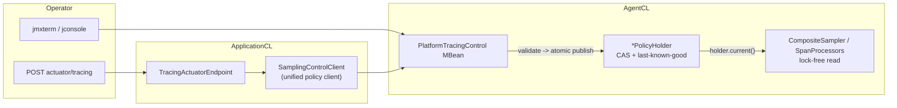

# Runtime policy control: operational runbook

> **Filename note (PR-9A):** This file is still named `runtime-sampling-control.md` for link stability.
> It documents runtime control for **sampling, scrubbing, and validation** (plus export/propagation gates).
> Architecture overview: [runtime-policy-control-architecture.md](runtime-policy-control-architecture.md).

> Нормативная база: [ADR-runtime-sampling-policy.md](../decisions/ADR-runtime-sampling-policy.md)
> (порядок решений sampling, приоритеты, safety contract). Этот документ — операционная инструкция
> для SRE/ops: какие рычаги существуют, как их дёргать, как проверять результат и что
> сознательно не поддерживается.

## 1. Модель

Динамическое управление **не перестраивает SDK**: `CompositeSampler` создаётся один раз
при старте агента (SPI `otel.traces.sampler=platform`), runtime-операции атомарно подменяют
иммутабельный снимок конфигурации (`SamplerState`), который sampler читает lock-free на
каждом `shouldSample()`.



Два транспорта (третьего сознательно нет — см. §7):

| Транспорт | Когда использовать | Точка входа |
|-----------|--------------------|-------------|
| **JMX** (канонический) | Есть доступ к JVM (jconsole, jmxterm, SSH на хост) | MBean `space.br1440.platform.tracing:type=Control,name=PlatformTracingControl` |
| **Actuator** (HTTP-зеркало) | k8s/контейнер без JMX-доступа | `POST /actuator/tracing/{property}/{value}` (требует exposed endpoint `tracing` **и** `platform.tracing.actuator.mutation-enabled=true`, default `false`) |

## 2. Операции

Примеры jmxterm: `run -b space.br1440.platform.tracing:type=Control,name=PlatformTracingControl <операция> <аргументы>`.

| Операция | JMX | Actuator | Эквивалент в ARMS-консоли |
|----------|-----|----------|---------------------------|
| Глобальный ratio | `setSamplingRatio 0.5` | `POST /actuator/tracing/samplingRatio/0.5` | Console → fixed-rate sampling push |
| 100% на критичный API | `setRouteRatios {"/api/checkout": 1.0}` (или `updateSamplingPolicy`) | — (через JMX) | Console interface list (100% critical) |
| Снизить шумный route | `setRouteRatios {"/api/search": 0.01}` | — | Console per-interface rate |
| Выключить sampling (kill-switch) | `setSamplerEnabled false` | `POST /actuator/tracing/samplerEnabled/false` | Console disable tracing |
| Drop инфраструктурных путей | `setDropPathPrefixes ["/actuator","/health"]` | — | Console ignore list |
| Значения force-заголовка | `setForceRecordValues ["on","debug"]` | — | — (за пределами ARMS OSS-доков) |
| **Атомарный мульти-апдейт** | `updateSamplingPolicy(enabled, ratio, routeRatios, dropPaths, forceValues)` | — | Console «Save config» (push всех полей) |
| **Spring refresh (schema v1)** | — (автоматически через JMX) | `POST /actuator/refresh` + Spring Cloud | Config push всех runtime-mutable sampling-полей |
| Export-gate (аварийный) | `setExportEnabled false` | `POST /actuator/tracing/exportEnabled/false` | — |
| Propagation-gate | `setPropagationEnabled false` | `POST /actuator/tracing/propagationEnabled/false` | — |
| Диагностический лог платформы | `setPlatformLogLevel DEBUG` | `POST /actuator/tracing/logLevel/DEBUG` | — |

Правила пользования:

- **Серия связанных изменений — только `updateSamplingPolicy`** (один атомарный снимок);
  серия одиночных setter'ов публикует промежуточные состояния (каждое — валидное, но
  оператор может получить неожиданную комбинацию между вызовами).
- **Spring reconciliation (PR-6E/7C/8C):** при `POST /actuator/refresh` (Spring Cloud) listener на
  `RefreshScopeRefreshedEvent` вызывает `RuntimeConfigApplier`, который читает свежий
  refresh-scoped `TracingProperties` и публикует каждый policy-домен **одним** JMX-вызовом с
  `source="spring-runtime-config"`. Spring — input/reconciliation layer; agent-side holders —
  source of truth.
- **Scrubbing atomic JMX (PR-7B):** `updateScrubbingPolicy(enabled, ruleNames[], source)` on
  `PlatformTracingControlMBean`; validate + compile before CAS; LKG on invalid update.
- **Spring scrubbing refresh (PR-7C):** `POST /actuator/refresh` → `RuntimeConfigApplier` →
  `updateScrubbingPolicy(..., source="spring-runtime-config")`. Unknown rule names passed through;
  agent skips unknown (startup parity). Spring — input/reconciliation layer only.
- **Validation runtime foundation (PR-8A):** `ValidatingSpanProcessor` reads immutable
  `ValidationSnapshot` from `ValidationPolicyHolder` (lock-free `current()`). Modes:
  `enabled=false` bypass; lenient annotate+warn+export; strict throws on missing attrs.
  Validation degradation is not dropped-span loss. JMX `source` polish (PR-8B) and Spring
  reconciler (PR-8C) — complete for validation domain.
- **Validation atomic JMX (PR-8B):** `updateValidationPolicy(enabled, strict, source)` on
  `PlatformTracingControlMBean`; 2-arg overload delegates with `source="JMX"`;
  `getValidationConfigVersion` / `getValidationConfigLastUpdatedSource`; LKG on CAS failure.
- **Spring validation refresh (PR-8C):** `POST /actuator/refresh` → `RuntimeConfigApplier` →
  `updateValidationPolicy(..., source="spring-runtime-config")`. Spring — input/reconciliation
  layer only; agent `ValidationPolicyHolder` — source of truth.
- **PR-9A:** Architecture consolidated in [runtime-policy-control-architecture.md](runtime-policy-control-architecture.md).
  Actuator `config.lastUpdatedSource` — legacy (sampling only); use per-domain `configSource`.
- **PR-9J (Actuator mutation guard):** `POST /actuator/tracing/{property}/{value}` disabled by default
  (`platform.tracing.actuator.mutation-enabled=false`). Returns HTTP 403 without calling JMX.
  Enable only for local/dev/debug/test/pre-prod. `GET /actuator/tracing` read model unchanged;
  includes `actuator.mutationEnabled`. Direct JMX is **not** protected by this flag — see
  [runtime-policy-control-architecture.md](runtime-policy-control-architecture.md) § JMX access model.
- **PR-9J (startup strict ops policy):** `platform.tracing.validation.strict=true` at startup emits
  one-time WARN at processor construction. Production recommendation: `validation.strict=false`,
  `validation.strict-runtime-allowed=false`. PR-9F runtime strict guard does not make startup strict safe.
- Невалидное значение (ratio вне `[0,1]`, > 100 drop-префиксов) → `IllegalArgumentException`,
  конфигурация **не меняется** (last-known-good), инкрементируется `InvalidConfigCount`.
- `X-Trace-On` не работает при `samplerEnabled=false` и не вскрывает drop-пути —
  это ратифицированные приоритеты P-1/P-2 ADR, не баг. Для отладки drop-пути — временно
  убрать префикс через `setDropPathPrefixes`, действие попадёт в audit trail.

## 3. Аудит и диагностика

| Что смотреть | JMX | Назначение |
|--------------|-----|------------|
| Версия конфигурации | `getSamplingConfigVersion` | Монотонно растёт с каждым принятым апдейтом; не выросла после вызова = апдейт отвергнут |
| Источник последнего изменения | `getSamplingConfigLastUpdatedSource` | `startup` / `JMX` / прикладной источник |
| Журнал изменений | `getConfigAuditTrail` | Последние reload-события всех доменов (sampling/scrubbing/validation/export) |
| Отвергнутые апдейты | `getInvalidConfigCount` | Растёт = кто-то шлёт невалидные конфигурации (искать источник) |
| Счётчики решений | `getSamplerDecisionCount(decision, reason)` | Например `("DROP","drop_path")`, `("RECORD_AND_SAMPLE","force_header")` |
| Снимок всего | `GET /actuator/tracing` | Агрегированное состояние: sampling + scrubbing + validation + export + queue + версии/source (PR-8D) |

**PR-8D read model (`GET /actuator/tracing`):** каждый policy-домен показывает configured Spring-поля и live agent-state (JMX), где доступно:

- **Sampling:** `enabled`, `ratio`, `dropPaths`, `routeRatios` (configured) + `liveRatio`, `liveSamplerEnabled`, `liveDropPaths`, `liveRouteRatios` + `configVersion` / `configSource`
- **Scrubbing:** `enabled`, `builtInRules` (configured) + `liveEnabled`, `liveRuleCount` + `configVersion` / `configSource`
- **Validation:** `enabled`, `strict` (configured) + `liveEnabled`, `liveStrict` + `configVersion` / `configSource`

Spring — input/reconciliation layer; agent-side holders — source of truth. Write-path без изменений.

Проверка эффекта операции (пример: снижение ratio):

```text
1. v0 = getSamplingConfigVersion
2. setSamplingRatio 0.05
3. getSamplingConfigVersion == v0 + 1        # апдейт принят
4. getSamplingRatio == 0.05                  # фактическое значение в agent'е
5. Δ getSamplerDecisionCount("RECORD_AND_SAMPLE","global_ratio") резко падает
```

## 4. Гарантии (почему операции безопасны под нагрузкой)

| Гарантия | Механизм | Подтверждение |
|----------|----------|---------------|
| Апдейт не блокирует обработку запросов | CAS-публикация снимка; `shouldSample()` читает один volatile-ref | Перф-гейт **M10** (`dynconf-no-stall`): p99 и queue стабильны в окне reload под нагрузкой |
| Невалидный конфиг не ломает работающий | Last-known-good в `SamplerStateHolder` | `SamplerStateHolderTest`; перф-сценарий M10d (invalid-storm) |
| Нет промежуточных состояний | Валидация всех полей до публикации, один снимок на домен | `PlatformTracingControlTest` |
| Решения детерминированы | `traceIdRatioBased` скомпилирован в снимке; решение — функция traceId | unit-тесты sampler'а; e2e `RuntimeSamplingControlSmokeTest` |
| Каждое изменение видно постфактум | version/source/audit trail | §3 |

Соответствие industry-консенсусу (Honeycomb Refinery, Datadog, SkyWalking, Jaeger — все
четыре используют одинаковые safety-инварианты):

| Инвариант консенсуса | Реализация в платформе |
|----------------------|------------------------|
| Error/slow traces никогда не дропаются молча | Tail-политики Collector'а `errors-always-sample`/`slow-traces` (Фаза 16) — head-уровень это не обещает by design (ADR §1) |
| Config reload failure → last-known-good, не 0%/100% | `SamplerStateHolder.tryUpdate` |
| Rate update — atomic swap, не synchronized на hot path | `DomainConfigHolder` CAS |
| Приоритетная иерархия: error → slow → priority → ratio → default | Tail-политики (1–3) + порядок `rules[]` head-сэмплера (4–5) |

### Route-ratio matching (PR-9G)

Per-route ratios match `url.path` by **prefix**. Overlapping prefixes use **longest-prefix-wins**; equal-length ties break **lexicographic ascending**. Sorting happens once when the policy snapshot is compiled (`SamplingPolicySnapshot.normalizeRouteRatios`); `shouldSample` reads a pre-sorted array — no sort on the hot path.

Configured `routeRatios` map order (Spring `LinkedHashMap`, JMX parallel arrays) is **input/display order only**, not matching semantics. JMX/Spring runtime updates use the same compile-time normalization.

| Configured prefix | Ratio |
|-------------------|-------|
| `/api` | 0.10 |
| `/api/v2` | 0.50 |
| `/api/v2/orders` | 1.00 |

Request path `/api/v2/orders/123` → **`/api/v2/orders` = 1.00**. No matching prefix → route-ratio rule abstains; global default ratio applies.

**Migration:** If overlapping prefixes were configured before PR-9G, effective sampling may change from hash-order-dependent to longest-prefix-wins. Review overlapping configs after upgrade. Full matrix: [platform-tracing-sampling-characterization.md](../architecture/platform-tracing-sampling-characterization.md).

## 5. Типовые сценарии

### Инцидент: нужно больше трейсов с прод-сервиса

```text
1. setSamplingRatio 1.0            # или routeRatios только на затронутые API
2. ... расследование (tail-политики сохраняют errors/slow автоматически) ...
3. setSamplingRatio 0.1            # вернуть штатный режим
4. getConfigAuditTrail             # убедиться, что оба перехода зафиксированы
```

CPU/export-стоимость режима ratio=1.0 — см. M5w evidence в
[performance-budgets.yaml](performance-budgets.yaml) (worst case, не SLA-режим).

### Tracing подозревается в деградации приложения

```text
1. setSamplerEnabled false         # kill-switch: новые трейсы не создаются
   # если проблема в export-пути, а трейсы терять нельзя:
   setExportEnabled false          # export-gate, spans дропаются на выходе с метрикой
2. наблюдать CPU/p99 приложения
3. вернуть обратно; если подтвердилось — runbook performance-diagnostics.md
```

### Отдельный запрос нужно гарантированно трассировать

`curl -H "X-Trace-On: on" ...` — работает при любом ratio (force_header), **кроме**:
выключенного kill-switch'а и путей из drop-префиксов (приоритеты P-1/P-2 ADR).

## 6. Перф-evidence

| Сценарий | Что доказывает | Источник |
|----------|----------------|----------|
| **M10** (reload под нагрузкой) | p99/queue стабильны в окне серии runtime-апдейтов (ratio, scrubbing, export-gate) | [performance-test-matrix.md](performance-test-matrix.md), бюджет `dynconf-no-stall` |
| **M10c** (config storm) | Частые валидные апдейты не деградируют hot-path | `platform-tracing-perf-tests/scenarios/m10c.env` |
| **M10d** (invalid storm) | Поток невалидных апдейтов: LKG держится, sampling работает, `InvalidConfigCount` растёт | `platform-tracing-perf-tests/scenarios/m10d.env` |
| JMH `CompositeSamplerBenchmark` | Микробюджет веток `shouldSample` (в т.ч. под `@Threads(8)` и при конкурентных апдейтах) | `platform-tracing-bench` |
| e2e `RuntimeSamplingControlSmokeTest` | Функциональная семантика: runtime-смена ratio реально меняет export rate; `X-Trace-On` пробивает ratio 0.0 | `platform-tracing-e2e-tests` (`-PrunE2e`) |

## 7. Чего нет и почему (анти-overengineering)

| Отсутствует | Причина | Что делать, если понадобилось |
|-------------|---------|-------------------------------|
| Централизованный control plane / console push (как ARMS-консоль) | Per-instance управление + tail-tier покрывает текущий масштаб | ADR-процесс; первый кандидат — штатный `jaeger_remote` (см. ADR «Отклонённые альтернативы») |
| Adaptive/LFU/EMA-сэмплер | Closed-source у ARMS; требует fleet-координации; нет prod-боли | Зафиксировать prod-кейс, затем отдельная фаза |
| File-watch / ConfigMap hot-reload | Третий транспорт без потребности | Запрос ops → ADR → тонкий адаптер поверх `updateSamplingPolicy` |
| Remote JMX | Мост спроектирован in-process (classloader-граница); `Map` в сигнатуре не OpenType-friendly | ADR + параллельная операция с массивами |
| Изменение `OTEL_TRACES_SAMPLER`/топологии SDK в runtime | Startup-only по спецификации OTel; runtime меняет только данные политики | Не предусмотрено (анти-паттерн) |

## 8. Связанные документы

- [ADR-runtime-sampling-policy.md](../decisions/ADR-runtime-sampling-policy.md) — нормативные решения
- [performance-diagnostics.md](../runbook/performance-diagnostics.md) — decision tree «CPU/RSS/drops растут»
- [dropped-span-reasons.md](dropped-span-reasons.md) — таксономия потерь span'ов (export-pipeline, не sampler)
- [performance-test-matrix.md](performance-test-matrix.md) — M10/M10c/M10d в общей матрице
